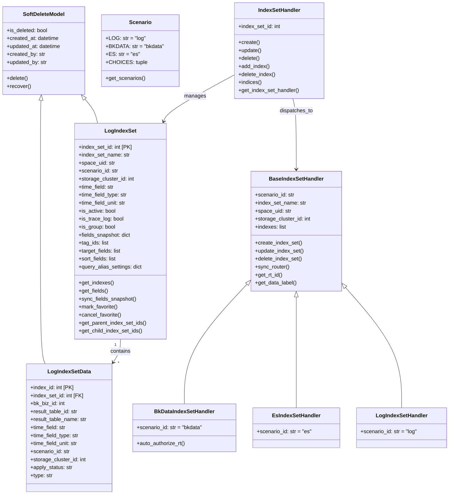
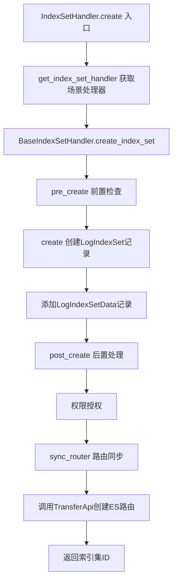
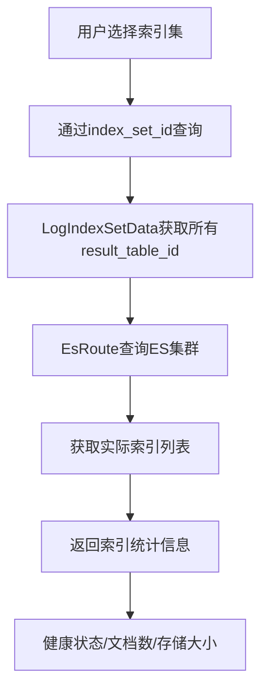

# BKLOG 索引集管理技术文档

## 一、概述

索引集(IndexSet)是 BKLOG 日志平台的核心概念，用于管理和组织 ES 索引，提供统一的日志检索入口。一个索引集可以包含多个 ES 索引（结果表），支持多种数据接入场景。

## 二、模型定义

### 2.1 LogIndexSet 核心模型

**文件位置**: `apps/log_search/models.py` (第337-700行)

```python
# 第337-400行
class LogIndexSet(SoftDeleteModel):
    class Status:
        """审批状态"""
        PENDING = "pending"
        NORMAL = "normal"

    index_set_id = models.AutoField(_("索引集ID"), primary_key=True)
    index_set_name = models.CharField(_("索引集名称"), max_length=64)
    space_uid = models.CharField(_("空间唯一标识"), blank=True, default="", max_length=256, db_index=True)
    project_id = models.IntegerField(_("项目ID"), default=0, db_index=True)
    category_id = models.CharField(_("数据分类"), max_length=64, null=True, default=None)
    bkdata_project_id = models.IntegerField(_("绑定的数据平台项目ID"), null=True, default=None)
    collector_config_id = models.IntegerField(_("绑定Transfer采集ID"), null=True, default=None)
    scenario_id = models.CharField(_("接入场景标识"), max_length=64, choices=Scenario.CHOICES)
    storage_cluster_id = models.IntegerField(_("存储集群ID"), default=None, null=True, blank=True)
    source_id = models.IntegerField(_("数据源ID"), default=None, null=True, blank=True)
    orders = models.IntegerField(_("顺序"), default=0)
    view_roles = MultiStrSplitByCommaField(_("查看权限"), max_length=255, sub_type=int, null=True, blank=True)
    # 预查询校验
    pre_check_tag = models.BooleanField(_("是否通过"), default=True)
    pre_check_msg = models.TextField(_("预查询描述"), null=True)
    is_active = models.BooleanField(_("是否可用"), default=True)
    # 字段快照
    fields_snapshot = JsonField(_("字段快照"), default=None, null=True)
    # 是否trace索引集
    is_trace_log = models.BooleanField(_("是否trace"), default=False)
    source_app_code = models.CharField(verbose_name=_("来源系统"), default=get_request_app_code, max_length=32, blank=True)
    # 时间字段
    time_field = models.CharField(_("时间字段"), max_length=32, default=None, null=True)
    time_field_type = models.CharField(_("时间字段类型"), max_length=32, default=None, null=True)
    time_field_unit = models.CharField(_("时间字段单位"), max_length=32, default=None, null=True)
    tag_ids = MultiStrSplitByCommaField(_("标签id记录"), max_length=255, default="")
    bcs_project_id = models.CharField(_("项目ID"), max_length=64, default="")
    is_editable = models.BooleanField(_("是否可以编辑"), default=True)
    # 上下文、实时日志 定位字段 排序字段
    target_fields = models.JSONField(_("定位字段"), null=True, default=list)
    sort_fields = models.JSONField(_("排序字段"), null=True, default=list)
    result_window = models.IntegerField(default=10000, verbose_name=_("单次导出的日志条数"))
    max_analyzed_offset = models.IntegerField(default=0, verbose_name=_("日志长文本高亮长度限制"))
    max_async_count = models.IntegerField(default=0, verbose_name=_("日志异步下载最大条数限制"))
    # doris
    support_doris = models.BooleanField(_("是否支持doris存储类型"), default=False)
    doris_table_id = models.TextField(_("doris表名"), null=True, default=None)
    query_alias_settings = models.JSONField(_("查询别名配置"), null=True, blank=True)
    is_group = models.BooleanField(_("是否索引组"), default=False)
```

**核心属性说明**:
- `index_set_id`: 索引集唯一标识
- `scenario_id`: 接入场景类型 (log/bkdata/es)
- `storage_cluster_id`: ES存储集群ID
- `time_field`: 时间字段名，用于日志检索时间范围筛选
- `is_group`: 是否为索引组（可包含多个子索引集）

### 2.2 LogIndexSetData 索引集数据模型

**文件位置**: `apps/log_search/models.py` (第702-745行)

```python
# 第702-735行
class LogIndexSetData(SoftDeleteModel):
    class Status:
        """审批状态维护"""
        PENDING = "pending"
        NORMAL = "normal"
        DENY = "deny"
        ABNORMAL = "abnormal"

        StatusChoices = (
            (PENDING, _("审批中")),
            (NORMAL, _("正常")),
            (DENY, _("拒绝")),
            (ABNORMAL, _("异常")),
        )

    index_id = models.AutoField(_("索引ID"), primary_key=True)
    index_set_id = models.IntegerField(_("索引集ID"), db_index=True)
    bk_biz_id = models.IntegerField(_("业务ID"), null=True, default=None)
    result_table_id = models.CharField(_("结果表"), max_length=255)
    result_table_name = models.CharField(_("结果表名称"), max_length=255, null=True, default=None, blank=True)
    time_field = models.CharField(_("时间字段"), max_length=64, null=True, default=None, blank=True)
    apply_status = models.CharField(_("审核状态"), max_length=64, choices=Status.StatusChoices, default=Status.PENDING)
    scenario_id = models.CharField(_("接入场景"), max_length=64, null=True, blank=True)
    storage_cluster_id = models.IntegerField(_("存储集群ID"), default=None, null=True, blank=True)
    time_field_type = models.CharField(_("时间字段类型"), max_length=32, default=None, null=True)
    time_field_unit = models.CharField(_("时间字段单位"), max_length=32, default=None, null=True)

    type = models.CharField(
        _("类型"), max_length=64, choices=IndexSetDataType.get_choices(), default=IndexSetDataType.RESULT_TABLE.value
    )
```

**关键属性说明**:
- `result_table_id`: ES索引对应的结果表ID
- `type`: 数据类型，支持 `RESULT_TABLE`(结果表) 和 `INDEX_SET`(索引集) 两种类型，用于索引组功能

### 2.3 Scenario 接入场景枚举

**文件位置**: `apps/log_search/models.py` (第191-213行)

```python
# 第191-213行
class Scenario:
    """接入场景"""
    LOG = "log"      # 采集接入
    BKDATA = "bkdata"  # 数据平台
    ES = "es"        # 第三方ES

    CHOICES = (
        (LOG, _("采集接入")),
        (BKDATA, _("数据平台")),
        (ES, _("第三方ES")),
    )
```

### 2.4 IndexSetType 和 IndexSetDataType 常量

**文件位置**: `apps/log_search/constants.py` (第1457-1476行)

```python
# 第1457-1476行
class IndexSetType(ChoicesEnum):
    """索引集类型"""
    SINGLE = "single"   # 单索引集
    UNION = "union"     # 联合索引集

    _choices_labels = ((SINGLE, _("单索引集")), (UNION, _("联合索引集")))


class IndexSetDataType(ChoicesEnum):
    """索引类型"""
    RESULT_TABLE = "result_table"  # 结果表
    INDEX_SET = "index_set"        # 索引集

    _choices_labels = ((RESULT_TABLE, _("结果表")), (INDEX_SET, _("索引集")))
```

---

## 三、处理器实现

### 3.1 IndexSetHandler 主处理器

**文件位置**: `apps/log_search/handlers/index_set.py` (第127-1646行)

```python
# 第127-160行
class IndexSetHandler(APIModel):
    def __init__(self, index_set_id=None):
        super().__init__()
        self.index_set_id = index_set_id

    @staticmethod
    def get_index_set_for_storage(storage_cluster_id):
        return LogIndexSet.objects.filter(storage_cluster_id=storage_cluster_id)

    def config(self, config_id: int, index_set_ids: list = None, index_set_type: str = IndexSetType.SINGLE.value):
        """修改用户当前索引集的配置"""
        username = get_request_username()
        params = {"username": username, "source_app_code": get_request_app_code(), "defaults": {"config_id": config_id}}
        ...
        UserIndexSetFieldsConfig.objects.update_or_create(**params)
```

**核心方法**:

| 方法名 | 行号 | 功能描述 |
|-------|------|---------|
| `create` | 411-492 | 创建索引集 |
| `update` | 494-558 | 更新索引集 |
| `delete` | 560-587 | 删除索引集 |
| `add_index` | 605-641 | 向索引集添加ES索引 |
| `delete_index` | 643-649 | 从索引集删除ES索引 |
| `indices` | 680-822 | 获取索引集下的ES索引列表 |
| `get_index_set_handler` | 1177-1186 | 根据场景获取对应的处理器 |

```python
# 第1177-1186行 - 场景处理器路由
@classmethod
def get_index_set_handler(cls, scenario_id):
    try:
        return {
            Scenario.BKDATA: BkDataIndexSetHandler,
            Scenario.ES: EsIndexSetHandler,
            Scenario.LOG: LogIndexSetHandler,
        }[scenario_id]
    except KeyError:
        raise ScenarioNotSupportedException(...)
```

### 3.2 BaseIndexSetHandler 基类处理器

**文件位置**: `apps/log_search/handlers/index_set.py` (第1648-2204行)

```python
# 第1648-1710行
class BaseIndexSetHandler:
    scenario_id = None

    def __init__(
        self,
        index_set_name,
        space_uid,
        storage_cluster_id,
        view_roles,
        indexes=None,
        category_id=None,
        collector_config_id=None,
        is_trace_log=None,
        time_field=None,
        time_field_type=None,
        time_field_unit=None,
        action=None,
        bk_app_code=None,
        username="",
        bcs_project_id=0,
        is_editable=True,
        target_fields=None,
        sort_fields=None,
        bcs_cluster_id=None,
        parent_index_set_ids=None,
    ):
        super().__init__()
        self.index_set_name = index_set_name
        self.space_uid = space_uid
        self.storage_cluster_id = storage_cluster_id
        self.view_roles = view_roles
        self.is_trace_log = is_trace_log
        self.indexes = indexes or []
        ...
```

**核心方法**:

| 方法名 | 行号 | 功能描述 |
|-------|------|---------|
| `create_index_set` | 1730-1842 | 创建索引集完整流程 |
| `update_index_set` | 1744-1759 | 更新索引集完整流程 |
| `delete_index_set` | 1761-1771 | 删除索引集完整流程 |
| `sync_router` | 1974-2039 | 同步ES路由信息到Transfer |
| `get_index_set_table_info_list` | 1869-1972 | 构建路由表信息 |

```python
# 第1730-1842行 - 创建索引集流程
def create_index_set(self):
    """创建索引集"""
    self.pre_create()       # 前置检查
    logger.info(f"[create_index_set]pre_create index_set_name=>{self.index_set_name}")

    index_set = self.create()  # 创建核心逻辑
    logger.info(f"[create_index_set]create index_set_name=>{self.index_set_name}")

    self.post_create(index_set)  # 后置处理（权限授权、路由同步）
    logger.info(f"[create_index_set]post_create index_set_name=>{self.index_set_name}")
    return index_set

# 第1838-1847行 - 路由ID生成规则
@staticmethod
def get_rt_id(index_set_id, result_table_id):
    return f"bklog_index_set_{index_set_id}_{result_table_id.replace('.', '_')}.__default__"

@staticmethod
def get_data_label(index_set_id, clustered_rt=False, pattern_rt=False):
    if pattern_rt:
        return f"bklog_index_set_{index_set_id}_cluster_pattern"
    if clustered_rt:
        return f"bklog_index_set_{index_set_id}_clustered"
    return f"bklog_index_set_{index_set_id}"
```

### 3.3 场景专用处理器

**文件位置**: `apps/log_search/handlers/index_set.py` (第2206-2269行)

```python
# 第2206-2269行
class BkDataIndexSetHandler(BaseIndexSetHandler):
    """数据平台场景处理器"""
    scenario_id = Scenario.BKDATA

    def pre_create(self):
        super().pre_create()
        self.auto_authorize_rt()  # 自动授权结果表

    def auto_authorize_rt(self):
        """自动授权"""
        BkDataAuthHandler.authorize_result_table_to_token(
            result_tables=[index["result_table_id"] for index in self.indexes]
        )


class EsIndexSetHandler(BaseIndexSetHandler):
    """第三方ES场景处理器"""
    scenario_id = Scenario.ES


class LogIndexSetHandler(BaseIndexSetHandler):
    """采集接入场景处理器"""
    scenario_id = Scenario.LOG
```

### 3.4 LogIndexSetDataHandler 索引数据处理器

**文件位置**: `apps/log_search/handlers/index_set.py` (第2271-2328行)

```python
# 第2271-2328行
class LogIndexSetDataHandler:
    def __init__(
        self,
        index_set_data,
        bk_biz_id,
        time_field,
        result_table_id,
        result_table_name=None,
        storage_cluster_id=None,
        scenario_id=None,
        time_field_type=None,
        time_field_unit=None,
        apply_status=LogIndexSetData.Status.NORMAL,
        bk_username=None,
    ):
        self.index_set_data = index_set_data
        self.bk_biz_id = bk_biz_id
        self.time_field = time_field
        self.result_table_id = result_table_id
        ...

    def add_index(self):
        """往索引集添加索引"""
        obj, created = LogIndexSetData.objects.get_or_create(
            defaults={
                "time_field": self.time_field,
                "result_table_name": self.result_table_name,
                "apply_status": self.apply_status,
                "scenario_id": self.scenario_id,
                "storage_cluster_id": self.storage_cluster_id,
                ...
            },
            index_set_id=self.index_set_data.index_set_id,
            bk_biz_id=self.bk_biz_id or None,
            result_table_id=self.result_table_id,
            is_deleted=False,
        )
        return obj

    def delete_index(self):
        """删除索引"""
        LogIndexSetData.objects.filter(
            index_set_id=self.index_set_data.index_set_id,
            result_table_id=self.result_table_id,
            bk_biz_id=self.bk_biz_id,
        ).delete()
```

---

## 四、索引集与 ES 索引的关系映射

### 4.1 映射关系说明

```
┌─────────────────────────────────────────────────────────────────┐
│                      LogIndexSet (索引集)                         │
│  index_set_id: 100                                               │
│  index_set_name: "应用日志索引集"                                  │
│  scenario_id: "log"                                              │
│  storage_cluster_id: 1                                           │
│  time_field: "dtEventTimeStamp"                                  │
└──────────────────────────┬──────────────────────────────────────┘
                           │
           ┌───────────────┼───────────────┐
           │               │               │
           ▼               ▼               ▼
┌─────────────────┐ ┌─────────────────┐ ┌─────────────────┐
│ LogIndexSetData │ │ LogIndexSetData │ │ LogIndexSetData │
│ (索引数据记录)    │ │ (索引数据记录)    │ │ (索引数据记录)    │
│ index_set_id:100│ │ index_set_id:100│ │ index_set_id:100│
│ result_table_id │ │ result_table_id │ │ result_table_id │
│ : "200_log"     │ │ : "201_log"     │ │ : "202_log"     │
└────────┬────────┘ └────────┬────────┘ └────────┬────────┘
         │                   │                   │
         ▼                   ▼                   ▼
┌─────────────────┐ ┌─────────────────┐ ┌─────────────────┐
│  ES 索引         │ │  ES 紵引         │ │  ES 紵引         │
│  200_log_*      │ │  201_log_*      │ │  202_log_*      │
│  (实际存储)      │ │  (实际存储)      │ │  (实际存储)      │
└─────────────────┘ └─────────────────┘ └─────────────────┘
```

### 4.2 路由映射规则

索引集创建时会生成路由信息，用于将查询请求路由到对应的 ES 索引:

```python
# 路由ID格式: bklog_index_set_{index_set_id}_{result_table_id}.__default__
# 示例: bklog_index_set_100_200_log.__default__

# data_label格式: bklog_index_set_{index_set_id}
# 示例: bklog_index_set_100
```

### 4.3 索引组功能

索引组(is_group=True)是一种特殊的索引集，可以包含多个子索引集:

```python
# 第459-479行 - LogIndexSet模型中的索引组方法
def get_parent_index_set_ids(self) -> list[int]:
    """获取当前索引集的归属索引集ID列表"""
    parent_ids = LogIndexSetData.objects.filter(
        result_table_id=self.index_set_id,
        type=IndexSetDataType.INDEX_SET.value,
    ).values_list("index_set_id", flat=True)
    return list(parent_ids)

def get_child_index_set_ids(self) -> list[int]:
    """获取当前索引集的子索引集ID列表"""
    child_ids = LogIndexSetData.objects.filter(
        index_set_id=self.index_set_id,
        type=IndexSetDataType.INDEX_SET.value,
    ).values_list("result_table_id", flat=True)
    return [int(child_id) for child_id in child_ids]
```

---

## 五、Mermaid 类图



---

## 六、核心流程说明

### 6.1 创建索引集流程



### 6.2 索引集查询流程



---

## 七、文件路径汇总

| 文件 | 路径 | 主要内容 |
|-----|-----|---------|
| 模型定义 | `apps/log_search/models.py` | LogIndexSet、LogIndexSetData模型 |
| 处理器 | `apps/log_search/handlers/index_set.py` | IndexSetHandler及各场景处理器 |
| 常量定义 | `apps/log_search/constants.py` | IndexSetType、IndexSetDataType枚举 |
| 视图接口 | `apps/log_search/views/index_set_views.py` | IndexSetViewSet API视图 |
| 异常定义 | `apps/log_search/exceptions.py` | IndexSet相关异常类 |

---

**文档版本**: v1.0
**生成日期**: 2026-04-30
**源码路径**: `apps/log_search/handlers/index_set.py`