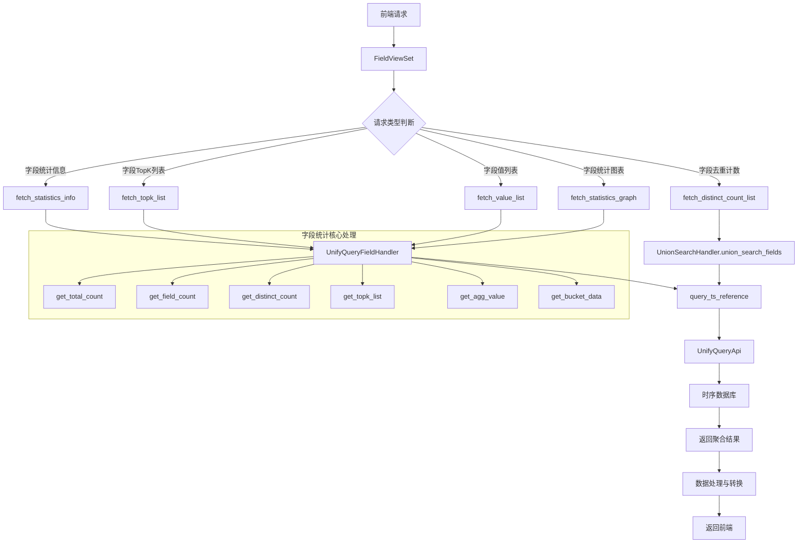
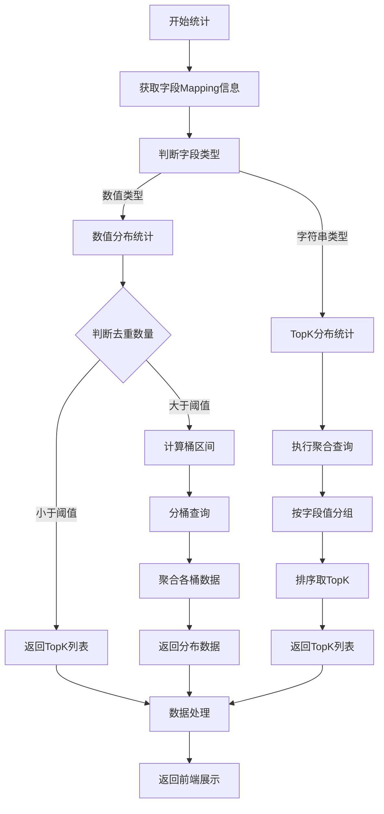

# BKLOG 字段统计分析技术文档

## 一、概述

BKLOG 字段统计分析模块提供了对日志索引集中字段的统计与分析能力，包括字段分布统计、字段值采样、TopK 统计、去重计数等功能。

核心组件：
- **视图层**: `apps/log_search/views/field_views.py` - `FieldViewSet`
- **处理层**: `apps/log_unifyquery/handler/field.py` - `UnifyQueryFieldHandler`
- **基础处理层**: `apps/log_unifyquery/handler/base.py` - `UnifyQueryHandler`
- **聚合处理层**: `apps/log_search/handlers/search/aggs_handlers.py` - `AggsHandlers`

---

## 二、核心流程图



---

## 三、API 接口详解

### 3.1 FieldViewSet 视图类

**文件位置**: `apps/log_search/views/field_views.py` (第 38-197 行)

```python
class FieldViewSet(APIViewSet):
    """
    字段统计&分析
    """
    serializer_class = serializers.Serializer
```

### 3.2 获取字段统计信息接口

**方法**: `fetch_statistics_info` (第 139-170 行)

```python
@list_route(methods=["POST"], url_path="statistics/info")
def fetch_statistics_info(self, request, *args, **kwargs):
    """
    获取字段统计信息
    """
    params = self.params_valid(FetchStatisticsInfoSerializer)
    query_handler = UnifyQueryFieldHandler(params)

    total_count = query_handler.get_total_count()
    field_count = query_handler.get_field_count()
    distinct_count = query_handler.get_distinct_count()

    if total_count and field_count:
        field_percent = round(field_count / total_count, 2)
    else:
        field_percent = 0

    data = {
        "total_count": total_count,
        "field_count": field_count,
        "distinct_count": distinct_count,
        "field_percent": field_percent,
    }

    # 数值类型字段额外统计
    if FIELD_TYPE_MAP.get(params["field_type"], "") == FieldDataTypeEnum.INT.value:
        max_value = query_handler.get_agg_value(AggTypeEnum.MAX.value)
        min_value = query_handler.get_agg_value(AggTypeEnum.MIN.value)
        avg_value = query_handler.get_agg_value(AggTypeEnum.AVG.value)
        median_value = query_handler.get_agg_value(AggTypeEnum.MEDIAN.value)
        data["value_analysis"] = {"max": max_value, "min": min_value, "avg": avg_value, "median": median_value}

    return Response(data)
```

**返回数据结构**:
| 字段 | 说明 |
|------|------|
| `total_count` | 日志总条数 |
| `field_count` | 字段存在的条数 |
| `distinct_count` | 字段值去重后的数量 |
| `field_percent` | 字段存在占比 |
| `value_analysis` | 数值类型字段统计（max/min/avg/median） |

### 3.3 获取字段 TopK 列表接口

**方法**: `fetch_topk_list` (第 89-112 行)

```python
@list_route(methods=["POST"], url_path="fetch_topk_list")
def fetch_topk_list(self, request, *args, **kwargs):
    """
    获取字段topk计数列表
    """
    params = self.params_valid(FetchTopkListSerializer)
    query_handler = UnifyQueryFieldHandler(params)
    total_count = query_handler.get_total_count()
    field_count = query_handler.get_field_count()
    distinct_count = query_handler.get_distinct_count()
    topk_list = query_handler.get_topk_list(params["limit"])

    return Response({
        "name": params["agg_field"],
        "columns": ["_value", "_count"],
        "types": ["float", "float"],
        "limit": params["limit"],
        "total_count": total_count,
        "field_count": field_count,
        "distinct_count": distinct_count,
        "values": topk_list,
    })
```

### 3.4 获取字段统计图表接口

**方法**: `fetch_statistics_graph` (第 182-197 行)

```python
@list_route(methods=["POST"], url_path="statistics/graph")
def fetch_statistics_graph(self, request, *args, **kwargs):
    """
    获取字段统计图表
    """
    params = self.params_valid(FetchStatisticsGraphSerializer)
    query_handler = UnifyQueryFieldHandler(params)

    if FIELD_TYPE_MAP.get(params["field_type"], "") == FieldDataTypeEnum.INT.value:
        if params["distinct_count"] < params["threshold"]:
            return Response(query_handler.get_topk_list(params["threshold"]))
        else:
            return Response(query_handler.get_bucket_data(params["min"], params["max"]))
    else:
        return Response(query_handler.get_topk_ts_data(params["limit"]))
```

**图表数据策略**:
- 数值类型字段：根据去重数量阈值决定返回 TopK 数据或桶聚合数据
- 非数值类型字段：返回 TopK 时序数据

---

## 四、核心处理类 UnifyQueryFieldHandler

**文件位置**: `apps/log_unifyquery/handler/field.py` (第 19-246 行)

### 4.1 类继承结构

```python
class UnifyQueryFieldHandler(UnifyQueryHandler):
    # 继承自 UnifyQueryHandler 基类，复用基础查询能力
```

### 4.2 获取日志总条数

**方法**: `get_total_count` (第 35-43 行)

```python
def get_total_count(self):
    """获取日志聚合总条数"""
    search_dict = copy.deepcopy(self.result_merge_base_dict)
    for query in search_dict["query_list"]:
        query["function"] = [{"method": "count"}]
    data = self.query_ts_reference(search_dict)
    return self.handle_count_data(data)
```

### 4.3 获取字段存在的聚合条数

**方法**: `get_field_count` (第 45-59 行)

```python
def get_field_count(self):
    """获取字段存在的聚合总条数"""
    search_dict = copy.deepcopy(self.result_merge_base_dict)
    for query in search_dict["query_list"]:
        query["function"] = [{"method": "count"}]
        # 增加字段不为空的条件
        query["conditions"]["field_list"].append(
            {"field_name": self.search_params["agg_field"], "value": [""], "op": "ne"}
        )
    data = self.query_ts_reference(search_dict)
    return self.handle_count_data(data)
```

### 4.4 获取字段去重计数

**方法**: `get_distinct_count` (第 81-102 行)

```python
def get_distinct_count(self):
    """获取字段去重的聚合总条数"""
    search_dict = copy.deepcopy(self.base_dict)
    reference_name_list = list()
    for query in search_dict["query_list"]:
        query["function"] = [{"method": "count", "dimensions": [self.search_params["agg_field"]]}]
        query["conditions"]["field_list"].append(
            {"field_name": self.search_params["agg_field"], "value": [""], "op": "ne"}
        )
        reference_name_list.append(query["reference_name"])

    search_dict.update({"metric_merge": " or ".join(reference_name_list)})
    data = self.query_ts_reference(search_dict)

    if not data.get("series", None):
        return 0
    else:
        return len(data.get("series"))
```

### 4.5 获取 TopK 聚合字段列表

**方法**: `get_topk_list` (第 144-163 行)

```python
def get_topk_list(self, limit: int = 5):
    """获取topk聚合字段列表，默认为前5"""
    search_dict = copy.deepcopy(self.result_merge_base_dict)
    for query in search_dict["query_list"]:
        query["limit"] = limit * 2 + 10
        query["function"] = [{"method": "count", "dimensions": [self.search_params["agg_field"]]}]
        query["conditions"]["field_list"].append(
            {"field_name": self.search_params["agg_field"], "value": [""], "op": "ne"}
        )
    search_dict.update({"order_by": ["-_value"]})
    data = self.query_ts_reference(search_dict)

    return [
        [s["group_values"][0], s["values"][0][1]]
        for s in sorted(data["series"], key=lambda x: x["values"][0][1], reverse=True)[:limit]
    ]
```

### 4.6 获取聚合桶数据（数值分布统计）

**方法**: `get_bucket_data` (第 189-204 行)

```python
def get_bucket_data(self, min_value: int, max_value: int, bucket_range: int = 10):
    """计算聚合桶周期，分次获取聚合桶数据"""
    digits = None
    # 浮点数分桶区间精度默认为两位小数
    if self.search_params.get("field_type") and self.search_params["field_type"] in FLOATING_NUMERIC_FIELD_TYPES:
        digits = 2

    step = round((max_value - min_value) / bucket_range, digits)
    bucket_data = []

    for index in range(bucket_range):
        start = min_value + index * step
        end = start + step if index < bucket_range - 1 else max_value
        bucket_count = self.get_bucket_count(start, end)
        bucket_data.append([start, bucket_count])

    return bucket_data
```

### 4.7 获取聚合统计值

**方法**: `get_agg_value` (第 125-142 行)

```python
def get_agg_value(self, agg_method: str):
    """获取不同聚合方法计算出的字段数量"""
    search_dict = copy.deepcopy(self.base_dict)
    reference_name_list = list()

    for query in search_dict["query_list"]:
        query["field_name"] = self.search_params["agg_field"]
        query["function"] = [{"method": "count", "dimensions": [self.search_params["agg_field"]]}]
        reference_name_list.append(query["reference_name"])

    search_dict.update({"metric_merge": " or ".join(reference_name_list)})
    data = self.query_ts_reference(search_dict)

    field_value_list = self.get_field_value_list(data.get("series", []))
    return self.get_agg_value_by_agg_method(field_value_list, agg_method)
```

### 4.8 聚合值计算方法

**方法**: `get_agg_value_by_agg_method` (第 206-228 行)

```python
@staticmethod
def get_agg_value_by_agg_method(agg_field_value_list: list, agg_method: str):
    """通过聚合方法获取聚合值"""
    if not agg_field_value_list:
        return 0

    if agg_method == AggTypeEnum.MAX.value:
        return max(agg_field_value_list)
    elif agg_method == AggTypeEnum.MIN.value:
        return min(agg_field_value_list)
    elif agg_method == AggTypeEnum.AVG.value:
        return round(sum(agg_field_value_list) / len(agg_field_value_list), 2)
    elif agg_method == AggTypeEnum.MEDIAN.value:
        sorted_list = sorted(agg_field_value_list)
        n = len(sorted_list)
        if n % 2 == 1:
            return sorted_list[n // 2]
        else:
            return (sorted_list[n // 2 - 1] + sorted_list[n // 2]) / 2
```

---

## 五、聚合类型枚举定义

**文件位置**: `apps/log_unifyquery/constants.py` (第 25-47 行)

```python
class AggTypeEnum(Enum):
    """聚合类型枚举"""
    MAX = "max"
    MIN = "min"
    AVG = "avg"
    MEDIAN = "median"

# 字段类型映射表
FIELD_TYPE_MAP = {
    "keyword": "string",
    "text": "string",
    "integer": "int",
    "long": "int",
    "double": "int",
    "bool": "string",
    "conflict": "string",
}

FLOATING_NUMERIC_FIELD_TYPES = ["double", "float"]
```

---

## 六、序列化器定义

**文件位置**: `apps/log_search/serializers.py`

### 6.1 字段分析查询基础序列化器 (第 926-964 行)

```python
class QueryFieldBaseSerializer(serializers.Serializer):
    """字段分析查询序列化"""
    bk_biz_id = serializers.IntegerField(label=_("业务ID"), required=True)
    index_set_ids = serializers.ListField(label=_("索引集列表"), required=True)
    result_table_ids = serializers.ListField(label=_("结果表ID列表"), required=False, default=list)
    agg_field = serializers.CharField(label=_("字段名"), required=False)
    addition = serializers.ListField(allow_empty=True, required=False, default="")
    host_scopes = serializers.DictField(default={}, required=False)
    ip_chooser = serializers.DictField(default={}, required=False)
```

### 6.2 获取字段统计信息序列化器 (第 982-987 行)

```python
class FetchStatisticsInfoSerializer(QueryFieldBaseSerializer):
    """获取字段统计信息"""
    field_type = serializers.ChoiceField(required=True, choices=list(FIELD_TYPE_MAP.keys()))
```

### 6.3 获取字段统计图表序列化器 (第 990-1000 行)

```python
class FetchStatisticsGraphSerializer(QueryFieldBaseSerializer):
    """获取字段统计图表"""
    field_type = serializers.ChoiceField(required=True, choices=list(FIELD_TYPE_MAP.keys()))
    max = serializers.FloatField(label=_("最大值"), required=False)
    min = serializers.FloatField(label=_("最小值"), required=False)
    threshold = serializers.IntegerField(label=_("去重数量阈值"), required=False, default=10)
    limit = serializers.IntegerField(label=_("top条数"), required=False, default=5)
    distinct_count = serializers.IntegerField(label=_("去重条数"), required=False)
```

---

## 七、字段分布统计流程图



---

## 八、关键配置参数

| 参数名 | 说明 | 默认值 |
|--------|------|--------|
| `AGGS_BUCKET_SIZE` | 聚合桶大小 | 100 |
| `threshold` | 值分布统计阈值 | 10 |
| `limit` | TopK限制条数 | 5 |
| `bucket_range` | 桶聚合区间数量 | 10 |

---

## 九、总结

BKLOG 字段统计分析模块采用分层架构设计：

| 层级 | 模块 | 职责 |
|------|------|------|
| **视图层** | `FieldViewSet` | 接收请求、参数校验、响应返回 |
| **处理层** | `UnifyQueryFieldHandler` | 业务逻辑处理、数据转换 |
| **查询层** | `UnifyQueryApi` | 与时序数据库交互 |

模块支持的核心功能：
- **字段基础统计**: 总条数、字段存在条数、去重计数
- **数值字段分析**: 最大值、最小值、平均值、中位数
- **字段分布统计**: TopK统计、桶聚合分布
- **字段值采样**: 支持CSV导出

---

**文档版本**: v1.0
**生成时间**: 2026-04-30
**分析项目**: BKLOG 蓝鲸日志平台