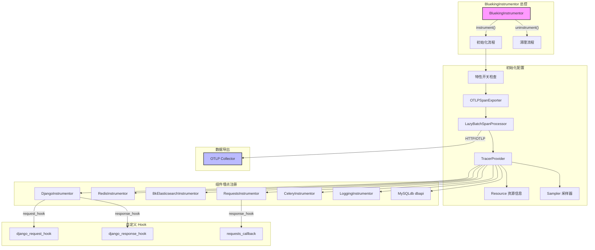

# OpenTelemetry 集成

> 聚焦：apps/log_trace/trace/__init__.py
> 系统自动埋点实现

## 1. BluekingInstrumentor 总控

`BluekingInstrumentor` 是整个 OpenTelemetry 集成的总控类，继承自 `BaseInstrumentor`，负责统一管理所有组件的自动埋点。

### 核心属性

```python
# apps/log_trace/trace/__init__.py 第211-215行
class BluekingInstrumentor(BaseInstrumentor):
    has_instrument = False          # 防止重复初始化的标志
    GRPC_HOST = "otlp_grpc_host"   # OTLP后端地址配置键
    BK_DATA_TOKEN = "otlp_bk_data_token"  # 蓝鲸数据令牌配置键
    SAMPLE_ALL = "sample_all"      # 全量采样配置键
```

### instrument() 初始化流程

```python
# 第226-290行
def _instrument(self, **kwargs):
    """Instrument the library"""
    if self.has_instrument:
        return
    toggle = FeatureToggleObject.toggle("bk_log_trace")
    feature_config = toggle.feature_config
    otlp_grpc_host = settings.OTLP_GRPC_HOST
    otlp_bk_data_token = ""
    sample_all = False
    if feature_config:
        otlp_grpc_host = feature_config.get(self.GRPC_HOST, otlp_grpc_host)
        otlp_bk_data_token = feature_config.get(self.BK_DATA_TOKEN, otlp_bk_data_token)
        sample_all = feature_config.get(self.SAMPLE_ALL, sample_all)
    otlp_exporter = OTLPSpanExporter(endpoint=otlp_grpc_host)
    span_processor = LazyBatchSpanProcessor(otlp_exporter)

    # 定时任务不做采样
    sampler = DEFAULT_OFF
    if settings.IS_CELERY_BEAT:
        sampler = ALWAYS_OFF

    if sample_all:
        sampler = ALWAYS_ON

    resource_info = {
        "service.name": settings.SERVICE_NAME,
        "service.version": settings.VERSION,
        "service.environment": settings.ENVIRONMENT,
        "bk.data.token": otlp_bk_data_token,
        "net.host.ip": get_local_ip(),
        "net.host.name": socket.gethostname(),
    }
    if settings.IS_K8S_DEPLOY_MODE and os.getenv("BKAPP_OTLP_BCS_CLUSTER_ID"):
        resource_info["k8s.bcs.cluster.id"] = os.getenv("BKAPP_OTLP_BCS_CLUSTER_ID", "")
        resource_info["k8s.namespace.name"] = os.getenv("BKAPP_OTLP_BCS_CLUSTER_NAMESPACE", "")
        resource_info["k8s.pod.ip"] = get_local_ip()
        resource_info["k8s.pod.name"] = socket.gethostname()

    tracer_provider = TracerProvider(
        resource=Resource.create(resource_info),
        sampler=sampler,
    )

    tracer_provider.add_span_processor(span_processor)
    trace.set_tracer_provider(tracer_provider)
    # 注册各组件 Instrumentor
    DjangoInstrumentor().instrument(request_hook=django_request_hook, response_hook=django_response_hook)
    RedisInstrumentor().instrument()
    BkElasticsearchInstrumentor().instrument()
    RequestsInstrumentor().instrument(tracer_provider=tracer_provider, response_hook=requests_callback)
    CeleryInstrumentor().instrument(tracer_provider=tracer_provider)
    LoggingInstrumentor().instrument()
    dbapi.wrap_connect(
        __name__,
        MySQLdb,
        "connect",
        "mysql",
        {
            "database": "db",
            "port": "port",
            "host": "host",
            "user": "user",
        },
        tracer_provider=tracer_provider,
    )
    self.has_instrument = True
```

---

## 2. 各 Instrumentor 注册

### 组件埋点清单

| Instrumentor | 用途 | 配置项 |
|-------------|------|--------|
| `DjangoInstrumentor` | Django HTTP 请求追踪 | request_hook, response_hook |
| `RedisInstrumentor` | Redis 操作追踪 | 默认配置 |
| `BkElasticsearchInstrumentor` | ES 查询追踪（自定义扩展） | 默认配置 |
| `RequestsInstrumentor` | HTTP 客户端请求追踪 | response_hook |
| `CeleryInstrumentor` | Celery 异步任务追踪 | tracer_provider |
| `LoggingInstrumentor` | 日志关联追踪 | 默认配置 |
| `dbapi.wrap_connect(MySQLdb)` | MySQL 数据库操作追踪 | tracer_provider |

### 架构图（Mermaid）



---

## 3. django_request_hook() 请求Hook

记录 HTTP 请求参数，包括 GET 查询参数和 POST 请求体。

### 完整代码

```python
# 第139-156行
def django_request_hook(span: Span, request: HttpRequest):
    """将请求中的 GET、BODY 参数记录在 span 中"""

    if not request:
        return
    try:
        if getattr(request, "FILES", None) and request.method.upper() == "POST":
            # 请求中如果包含了文件 不取 Body 内容
            carrier = jsonify(request.POST)
        else:
            carrier = request.body.decode("utf-8")
    except Exception:  # noqa
        carrier = ""

    param_str = jsonify(dict(request.GET)) if request.GET else ""

    span.set_attribute("request.body", carrier[:MAX_PARAMS_SIZE])
    span.set_attribute("request.params", param_str[:MAX_PARAMS_SIZE])
```

### 设计要点

- 文件上传请求（`request.FILES`）特殊处理，避免读取二进制内容
- 参数长度限制为 `MAX_PARAMS_SIZE`（10000字符），防止超大请求体污染
- 异常容错处理，确保 Hook 失败不影响正常请求

---

## 4. django_response_hook() 响应Hook

记录 HTTP 响应结果、状态码和错误信息。

### 完整代码

```python
# 第159-181行
def django_response_hook(span, request, response):
    if hasattr(response, "data"):
        result = response.data
    else:
        try:
            result = json.loads(response.content)
        except Exception:  # pylint: disable=broad-except
            return
    if not isinstance(result, dict):
        return

    is_success = result.get("result", True)
    span.set_attribute("user.username", get_request_username())
    span.set_attribute("http.response.code", result.get("code", 0))
    span.set_attribute("http.response.message", result.get("message", ""))
    span.set_attribute("http.response.errors", str(result.get("errors", "")))
    span.set_attribute("http.response.result", str(is_success))

    if is_success:
        span.set_status(Status(StatusCode.OK))
        return
    span.set_status(Status(StatusCode.ERROR))
    span.record_exception(exception=Exception(result.get("message")))
```

### 响应属性映射

| Span 属性 | 来源 | 说明 |
|----------|------|------|
| `user.username` | `get_request_username()` | 当前请求用户 |
| `http.response.code` | `result.code` | 蓝鲸格式返回码 |
| `http.response.message` | `result.message` | 响应消息 |
| `http.response.errors` | `result.errors` | 错误详情 |
| `http.response.result` | `result.result` | 成功/失败标识 |

---

## 5. requests_callback() HTTP请求回调

处理对外部 HTTP 请求的响应，特别关注蓝鲸格式的返回码处理。

### 完整代码

```python
# 第72-136行
def requests_callback(span: Span, request, response):
    """处理蓝鲸格式返回码"""

    body = request.body

    try:
        authorization_header = request.headers.get("x-bkapi-authorization")
        if authorization_header:
            username = json.loads(authorization_header).get("bk_username")
            if username:
                span.set_attribute("user.username", username)
    except (TypeError, json.JSONDecodeError):
        if body:
            try:
                username = json.loads(body).get("bk_username")
                if username:
                    span.set_attribute("user.username", username)
            except (TypeError, json.JSONDecodeError):
                pass

    try:
        carrier = request.body.decode("utf-8")
    except Exception:  # noqa
        carrier = str(request.body)

    span.set_attribute("request.body", carrier[:MAX_PARAMS_SIZE])

    # 仅统计 JSON 请求，流式请求不统计
    if "application/json" not in response.headers.get("Content-Type", ""):
        return
    if response.headers.get("Accept-Ranges", "") == "bytes":
        return

    try:
        json_result = response.json()
    except Exception:  # pylint: disable=broad-except
        return
    if not isinstance(json_result, dict):
        return

    code = json_result.get("code", 0)
    span.set_attribute("http.response.code", code)
    span.set_attribute("http.response.message", json_result.get("message", ""))
    span.set_attribute("http.response.errors", str(json_result.get("errors", "")))

    # request_id 提取
    request_id = (
        response.headers.get("x-bkapi-request-id")
        or response.headers.get("x-request-id")
        or json_result.get("request_id", "")
    )
    if request_id:
        span.set_attribute("bk.request_id", request_id)

    if code in [0, "0", "00"]:
        span.set_status(Status(StatusCode.OK))
    else:
        span.set_status(Status(StatusCode.ERROR))
```

### request_id 提取优先级

1. `x-bkapi-request-id`（新版 ESB / API Gateway）
2. `x-request-id`（IAM 后端）
3. `result.request_id`（旧版 ESB）

---

## 6. OTLPSpanExporter 配置

### 导出器配置

```python
# 第239-240行
otlp_exporter = OTLPSpanExporter(endpoint=otlp_grpc_host)
span_processor = LazyBatchSpanProcessor(otlp_exporter)
```

### LazyBatchSpanProcessor 延迟批处理

```python
# 第184-208行
class LazyBatchSpanProcessor(BatchSpanProcessor):
    def __init__(self, *args, **kwargs):
        super().__init__(*args, **kwargs)
        # 停止默认线程
        self.done = True
        with self.condition:
            self.condition.notify_all()
        self.worker_thread.join()
        self.done = False
        self.worker_thread = None

    def on_end(self, span: ReadableSpan) -> None:
        if self.worker_thread is None:
            self.worker_thread = threading.Thread(target=self.worker, daemon=True)
            self.worker_thread.start()
        super().on_end(span)
```

### 设计意图

- **延迟启动**：避免在应用启动时创建不必要的后台线程
- **按需初始化**：首个 Span 到达时才启动工作线程
- **资源节省**：在无追踪数据时零线程开销

---

## 7. 特性开关控制

### 开关配置结构

```python
feature_config = {
    "otlp_grpc_host": "http://otlp-collector:4318",  # OTLP后端地址
    "otlp_bk_data_token": "your-token",              # 蓝鲸数据令牌
    "sample_all": True                                # 是否全量采样
}
```

### 应用启动入口

**Django 应用入口** (`apps/log_trace/apps.py`):

```python
# 第32-38行
def ready(self):
    if settings.IS_CELERY and not settings.IS_CELERY_BEAT:
        return
    from apps.feature_toggle.handlers.toggle import FeatureToggleObject

    if FeatureToggleObject.switch("bk_log_trace"):
        BluekingInstrumentor().instrument()
```

### 采样策略

| 场景 | 采样器 | 说明 |
|-----|-------|------|
| Celery Beat | `ALWAYS_OFF` | 定时任务默认关闭 |
| 普通请求 | `DEFAULT_OFF` | 默认关闭，需显式开启 |
| `sample_all=True` | `ALWAYS_ON` | 全量采样 |

---

## 8. 设计要点

### 自动埋点的设计意图

1. **无侵入性** - 通过 OpenTelemetry Instrumentor 自动拦截框架调用
2. **可配置性** - 通过特性开关动态启用/禁用
3. **蓝鲸适配** - 自定义 Hook 处理蓝鲸格式返回码
4. **资源优化** - `LazyBatchSpanProcessor` 延迟启动

### 与手动埋点的对比

| 维度 | 自动埋点 | 手动埋点 |
|-----|---------|---------|
| 侵入性 | 零侵入 | 需修改业务代码 |
| 覆盖范围 | 框架层面 | 业务关键节点 |
| 定制能力 | 受限于 Hook | 完全自由 |
| 维护成本 | 低 | 高 |

---

## 9. 相关文档

- [02-协议适配器模式.md](./02-协议适配器模式.md) - 了解 BkElasticsearchInstrumentor 的自定义扩展实现
- [04-懒加载Span处理器.md](./04-懒加载Span处理器.md) - LazyBatchSpanProcessor 详细实现