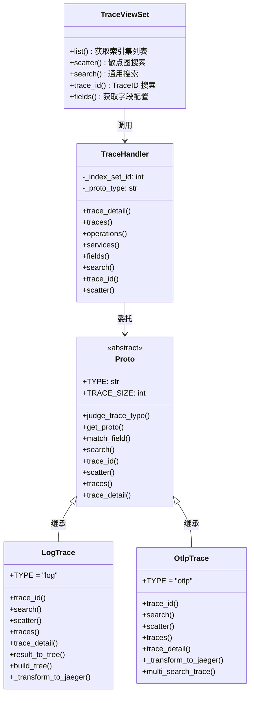
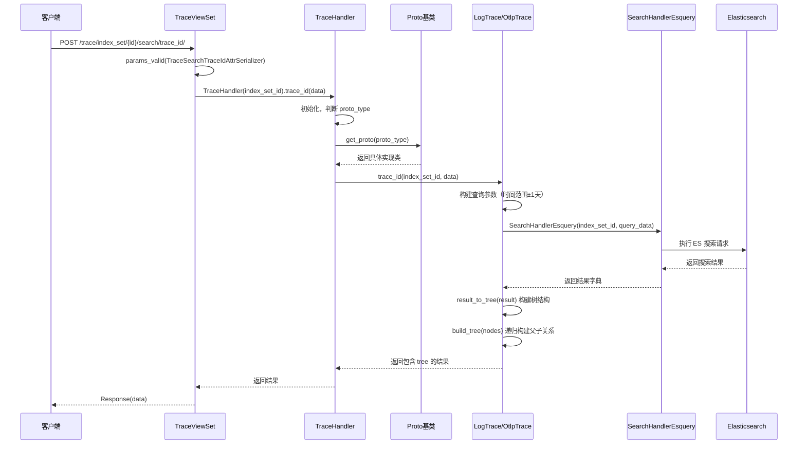
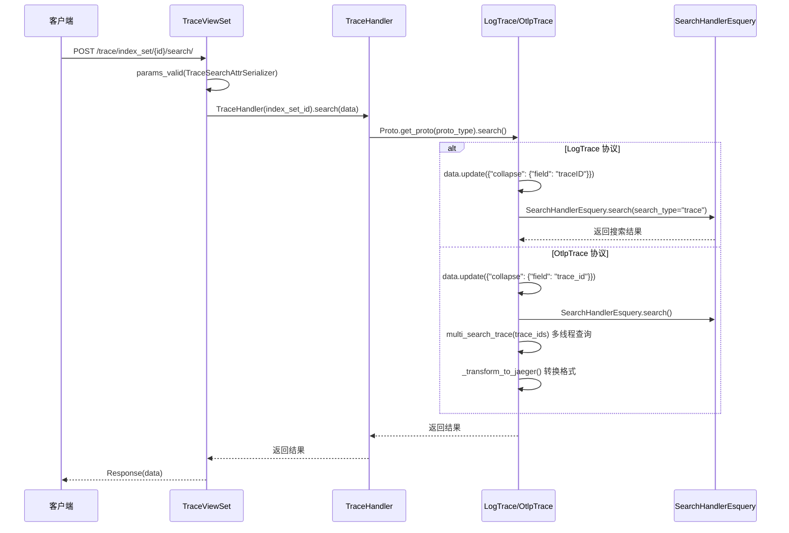

# BKLOG Trace 查询实现技术文档

## 一、目录结构概览

`apps/log_trace` 模块是 BKLOG 系统中负责分布式链路追踪（Trace）查询的核心模块，采用分层架构设计。

```
apps/log_trace/
├── __init__.py                 # 模块初始化，定义默认 AppConfig
├── apps.py                     # Django AppConfig 配置，启动时加载 Instrumentor
├── constants.py                # 常量定义：Trace 协议类型、字段映射、枚举类
├── exceptions.py               # 异常定义：TraceID 不存在、协议不支持等
├── serializers.py              # DRF 序列化器：请求参数校验
├── urls.py                     # URL 路由配置
├── handlers/
│   ├── __init__.py
│   ├── trace_handlers.py       # Trace 查询主 Handler，协调各协议实现
│   ├── trace_config_handlers.py # Trace 配置 Handler，获取用户索引集
│   ├── trace_field_handlers.py  # Trace 字段处理，字段适配与展示配置
│   └── proto/
│       ├── __init__.py
│       ├── proto.py            # 抽象基类 Proto，定义 Trace 协议接口
│       ├── log.py              # LogTrace 实现：日志平台协议
│       └── otlp.py             # OtlpTrace 实现：OpenTelemetry 协议
├── trace/
│   ├── __init__.py             # BluekingInstrumentor：全局 Trace 探针
│   └── elastic.py              # Elasticsearch Instrumentor 封装
└── views/
    ├── __init__.py
    └── trace_views.py          # TraceViewSet：REST API 视图层
```

## 二、核心类关系图



## 三、Trace 查询流程时序图

### 3.1 TraceID 搜索流程（trace_id 接口）



### 3.2 通用搜索流程（search 接口）



## 四、Handler 实现详解

### 4.1 TraceHandler - 主入口 Handler

**文件路径**: `apps/log_trace/handlers/trace_handlers.py`

```python
# 第 27-57 行
class TraceHandler(object):
    def __init__(self, index_set_id):
        data = {"search_type": "trace"}
        search_handler_esquery = SearchHandlerEsquery(index_set_id, data)
        self._index_set_id = index_set_id
        # 根据索引集字段自动判断 Trace 协议类型
        self._proto_type = Proto.judge_trace_type(
            search_handler_esquery.fields().get("fields", [])
        )

    def trace_detail(self, trace_id):
        # 根据 trace_id 获取完整 Trace 详情
        return Proto.get_proto(self._proto_type).trace_detail(
            self._index_set_id, trace_id
        )

    def traces(self, params):
        # 批量查询 Traces
        return Proto.get_proto(self._proto_type).traces(
            self._index_set_id, params
        )

    def operations(self, service_name):
        # 获取服务下的操作列表
        return Proto.get_proto(self._proto_type).operations(
            self._index_set_id, service_name
        )

    def services(self):
        # 获取所有服务列表
        return Proto.get_proto(self._proto_type).services(self._index_set_id)

    def fields(self, scope: str) -> dict:
        # 获取字段配置
        return Proto.get_proto(self._proto_type).fields(
            self._index_set_id, scope
        )

    def search(self, data: dict) -> dict:
        # 通用搜索
        return Proto.get_proto(self._proto_type).search(
            self._index_set_id, data
        )

    def trace_id(self, data: dict) -> dict:
        # TraceID 搜索，生成时间线甘特图
        return Proto.get_proto(self._proto_type).trace_id(
            self._index_set_id, data
        )

    def scatter(self, data: dict):
        # 散点图数据生成
        return Proto.get_proto(self._proto_type).scatter(
            self._index_set_id, data
        )
```

**核心逻辑说明**:
- 初始化时通过 `Proto.judge_trace_type()` 自动识别数据协议类型（log/otlp）
- 所有方法通过 `Proto.get_proto()` 获取具体实现类，实现协议多态

### 4.2 Proto - 抽象基类

**文件路径**: `apps/log_trace/handlers/proto/proto.py`

```python
# 第 35-138 行
class Proto(ABC):
    TYPE = None
    TRACE_MAPPING = None
    TRACE_PLAN = None
    DISPLAY_FIELDS = None
    TRACE_SIZE = 1000
    SERVICE_NAME_FIELD = None
    OPERATION_NAME_FIELD = None
    TRACE_ID_FIELD = None
    TAGS_FIELD = None

    # 协议映射：log -> LogTrace, otlp -> OtlpTrace
    PROTO_MAP = {
        TraceProto.LOG.value: "LogTrace",
        TraceProto.OTLP.value: "OtlpTrace"
    }

    @classmethod
    def judge_trace_type(cls, field_list):
        """
        根据字段列表判断 Trace 协议类型
        遍历所有协议，检查字段是否匹配 MUST_MATCH_FIELDS
        """
        for proto_type in cls.PROTO_MAP.keys():
            if cls.get_proto(proto_type).match_field(field_list):
                return proto_type
        return None

    @classmethod
    def get_proto(cls, proto_type) -> "Proto":
        """
        动态加载具体协议实现类
        通过 import_string 动态导入
        """
        try:
            proto = import_string(
                "apps.log_trace.handlers.proto.{}.{}".format(
                    proto_type, cls.PROTO_MAP[proto_type]
                )
            )
            return proto()
        except KeyError:
            raise ProtoNotSupport

    def match_field(self, field_list) -> bool:
        """
        字段匹配检查
        验证所有 MUST_MATCH_FIELDS 字段是否存在且类型匹配
        """
        if not self.MUST_MATCH_FIELDS:
            return False
        must_fields_len = len(self.MUST_MATCH_FIELDS.keys())
        record = []
        for field in field_list:
            field_name = field.get("field_name", "")
            field_type = field.get("field_type", "")
            if field_type in self.MUST_MATCH_FIELDS.get(field_name, []):
                record.append(field_name)
        return len(record) == must_fields_len
```

### 4.3 LogTrace - 日志平台协议实现

**文件路径**: `apps/log_trace/handlers/proto/log.py`

```python
# 第 42-151 行
class LogTrace(Proto):
    TAGS_FIELD = "tags"
    SERVICE_NAME_FIELD = "tags.local_service"
    OPERATION_NAME_FIELD = "operationName"
    TRACE_ID_FIELD = "traceID"

    TYPE = TraceProto.LOG.value

    # 必须匹配的字段定义
    MUST_MATCH_FIELDS = {
        "parentSpanID": ["keyword"],
        "spanID": ["keyword"],
        "traceID": ["keyword"],
        "operationName": ["keyword"],
        "duration": ["long", "int", "float"],
        "startTime": ["date", "long"],
    }
```

#### 4.3.1 TraceID 搜索实现

```python
# 第 152-176 行
def trace_id(self, index_set_id: int, data: dict) -> dict:
    """
    TraceID 搜索，生成时间线甘特图和树形图
    时间范围扩展为 startTime 前 1 天到后 2 天
    """
    start_time = arrow.get(data.get("startTime")[0:10]).shift(days=-1)
    query_data = {
        "addition": [
            {
                "key": "traceID",
                "method": "is",
                "value": str(data["traceID"]),
                "condition": "and",
                "type": "field"
            }
        ],
        "start_time": start_time.strftime("%Y-%m-%d %H:%M:%S"),
        "end_time": start_time.shift(days=2).strftime("%Y-%m-%d %H:%M:%S"),
        "search_type": "trace_detail",
        "size": self.TRACE_SIZE,  # 默认 1000
    }

    search_handler = SearchHandlerEsquery(
        index_set_id, query_data, can_highlight=False
    )
    result: dict = search_handler.search(search_type=None)

    if not result["total"]:
        raise TraceIDNotExistsException()

    # 按 startTime 排序
    result["list"] = sorted(result["list"], key=lambda x: x["startTime"])
    # 构建 Span 树结构
    result["tree"] = self.result_to_tree(result)
    return result
```

#### 4.3.2 Span 树结构构建

```python
# 第 178-249 行
@classmethod
def result_to_tree(cls, result) -> dict:
    """将搜索结果转换为树结构"""
    result_list: list = result.get("list", [])
    return cls.build_tree(result_list)

@classmethod
def build_tree(cls, nodes):
    """递归构建 Span 父子关系树"""
    if not nodes:
        return nodes
    first_root, *_ = nodes
    cls.update_node(first_root)  # 添加树节点属性
    nodes.remove(first_root)
    return cls._build_tree(nodes, first_root)

@classmethod
def _build_tree(cls, nodes: List[dict], cur_node: dict):
    """
    从当前节点开始，递归查找父子关系
    通过 parentSpanID 和 spanID 建立关联
    """
    # 向下查找子节点
    cls._insert_children([cur_node], nodes)

    # 向上查找父节点
    parent_nodes = [
        node for node in nodes
        if cur_node.get("parentSpanID", "parentSpanID") == node.get("spanID", "spanID")
    ]
    for p_node in parent_nodes:
        cls.update_node(p_node)
        p_node["children"].append(cur_node)
        nodes.remove(p_node)

    # 递归查找直到根节点
    return cls._build_tree(nodes, parent_nodes[0]) if parent_nodes else cur_node

@classmethod
def update_node(cls, child: dict) -> dict:
    """更新节点属性，添加甘特图所需字段"""
    child.update({
        "group": child.get("spanID", ""),
        "from": child.get("startTime", 0),
        "to": child.get("startTime", 0) + child.get("duration", 0),
        "unit": "ms",
        "parentSpanID": child.get("parentSpanID", ""),
        "children": [],
    })
    return child
```

### 4.4 OtlpTrace - OpenTelemetry 协议实现

**文件路径**: `apps/log_trace/handlers/proto/otlp.py`

```python
# 第 45-122 行
class OtlpTrace(Proto):
    TYPE = TraceProto.OTLP.value
    SERVICE_NAME_FIELD = "resource.service.name"
    OPERATION_NAME_FIELD = "span_name"
    TRACE_ID_FIELD = "trace_id"
    TAGS_FIELD = "attributes"

    # 字段映射：OTLP 字段名 -> 日志平台字段名
    FIELD_LOG_MAP = {
        "trace_id": "traceID",
        "span_id": "spanID",
        "span_name": "operationName",
        "parent_span_id": "parentSpanID",
        "start_time": "startTime",
    }

    # 必须匹配的字段定义（OTLP 格式）
    MUST_MATCH_FIELDS = {
        "parent_span_id": ["keyword"],
        "span_name": ["keyword"],
        "trace_id": ["keyword"],
        "span_id": ["keyword"],
        "start_time": ["long", "float"],
        "end_time": ["long", "float"],
    }
```

## 五、Span 数据处理逻辑

### 5.1 Span 树构建算法

Span 树的构建基于以下核心逻辑：

1. **根节点识别**: 从 Span 列表中选取第一个节点作为初始根节点
2. **向下递归**: 通过 `_insert_children()` 查找所有子节点（parentSpanID == 当前 spanID）
3. **向上递归**: 通过父节点查找（当前 parentSpanID == 其他 spanID）定位真正的根节点
4. **终止条件**: 当无法继续向上查找父节点时，当前节点即为根节点

```python
# 关键数据结构（第 237-249 行）
@classmethod
def update_node(cls, child: dict) -> dict:
    child.update({
        "group": child.get("spanID", ""),       # 甘特图分组标识
        "from": child.get("startTime", 0),      # 开始时间戳
        "to": child.get("startTime", 0) + child.get("duration", 0),  # 结束时间戳
        "unit": "ms",                           # 时间单位
        "parentSpanID": child.get("parentSpanID", ""),  # 父 Span ID
        "children": [],                         # 子节点列表
    })
    return child
```

### 5.2 Jaeger 格式转换

OTLP 数据转换为 Jaeger 格式是为了兼容前端展示组件：

| OTLP 字段 | Jaeger 字段 | 说明 |
|-----------|-------------|------|
| `trace_id` | `traceID` | Trace 标识 |
| `span_id` | `spanID` | Span 标识 |
| `span_name` | `operationName` | 操作名称 |
| `elapsed_time` | `duration` | 耗时 |
| `attributes` | `tags` | 属性标签 |
| `events` | `logs` | 事件日志 |
| `kind` | `span.kind` | Span 类型（server/client 等） |

## 六、常量与配置定义

**文件路径**: `apps/log_trace/constants.py`

```python
# 第 27-34 行
class TraceProto(ChoicesEnum):
    LOG = "log"    # 日志平台协议
    OTLP = "otlp"  # OpenTelemetry 协议

    _choices_labels = (
        (LOG, _("日志平台协议")),
        (OTLP, _("opentelemetry协议")),
    )
```

## 七、API 接口定义

**文件路径**: `apps/log_trace/views/trace_views.py`

| 接口路径 | 方法 | 功能 | 序列化器 |
|----------|------|------|----------|
| `/trace/index_set/` | GET | 获取有权限的索引集列表 | `TraceIndexSetScopeSerializer` |
| `/trace/index_set/{id}/search/scatter/` | POST | 散点图搜索 | `TraceSearchAttrSerializer` |
| `/trace/index_set/{id}/search/` | POST | 通用搜索 | `TraceSearchAttrSerializer` |
| `/trace/index_set/{id}/search/trace_id/` | POST | TraceID 搜索 | `TraceSearchTraceIdAttrSerializer` |
| `/trace/index_set/{id}/fields/` | GET | 获取字段配置 | 无（scope 参数） |

## 八、异常处理

**文件路径**: `apps/log_trace/exceptions.py`

```python
class BaseTraceException(BaseException):
    MODULE_CODE = ErrorCode.BKLOG_TRACE
    MESSAGE = _("查询异常")

class TraceIDNotExistsException(BaseTraceException):
    ERROR_CODE = "001"
    MESSAGE = _("trace_id不存在")

class TraceRootException(BaseTraceException):
    ERROR_CODE = "002"
    MESSAGE = _("trace日志没有找到根节点")

class ProtoNotSupport(BaseTraceException):
    ERROR_CODE = "003"
    MESSAGE = _("协议未支持")
```

## 九、关键设计总结

1. **协议多态**: 通过 Proto 抽象基类实现协议多态，支持 Log 和 OTLP 两种协议自动识别
2. **字段自适应**: `judge_trace_type()` 通过 MUST_MATCH_FIELDS 自动判断数据格式
3. **树结构构建**: 递归算法构建 Span 父子关系树，支持甘特图展示
4. **格式转换**: OTLP 数据转换为 Jaeger 格式，统一前端展示
5. **多线程优化**: `multi_search_trace()` 并行查询提升性能

---

**文档版本**: v1.0
**生成日期**: 2026-04-30
**源码路径**: `apps/log_trace/handlers/`