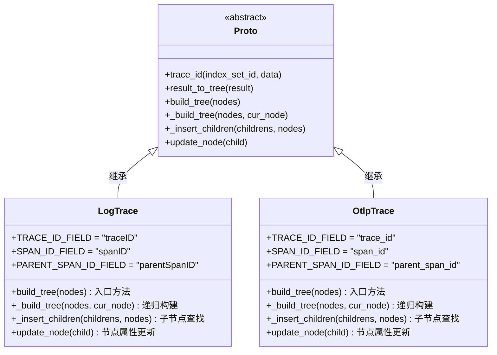
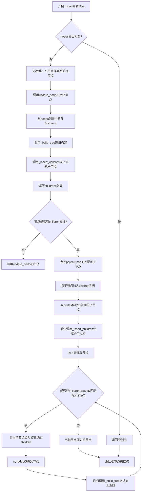
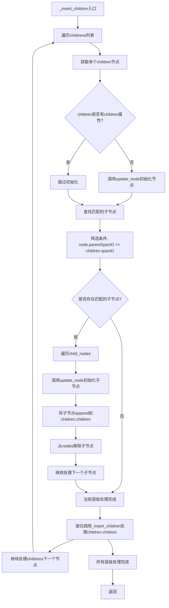
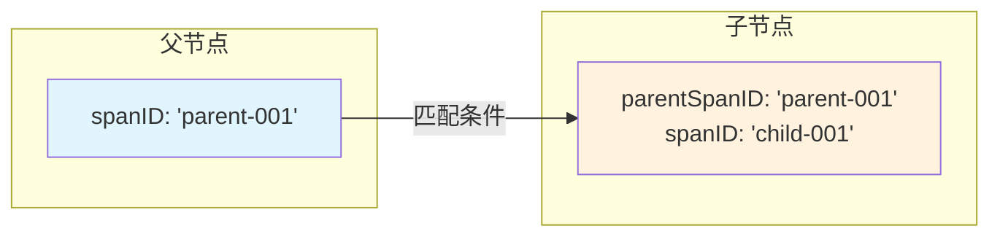
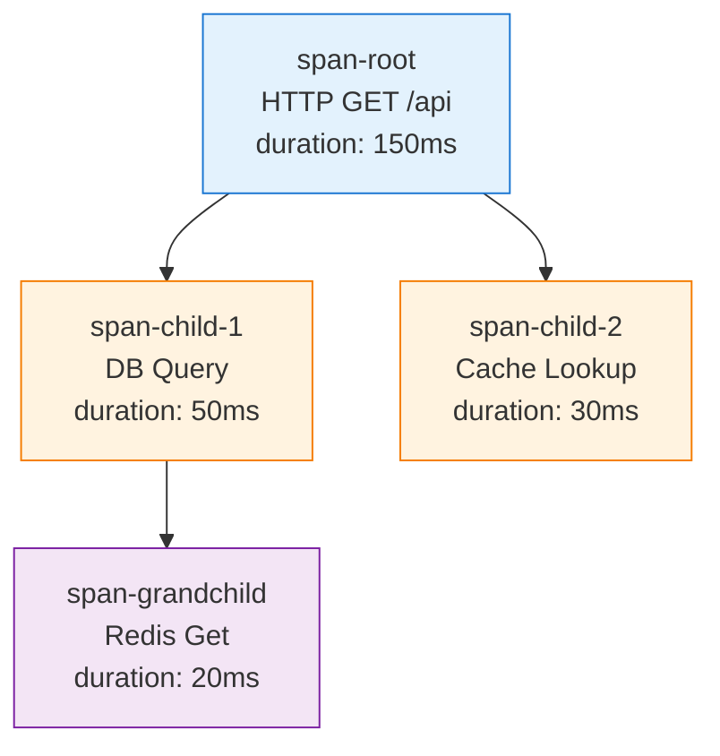
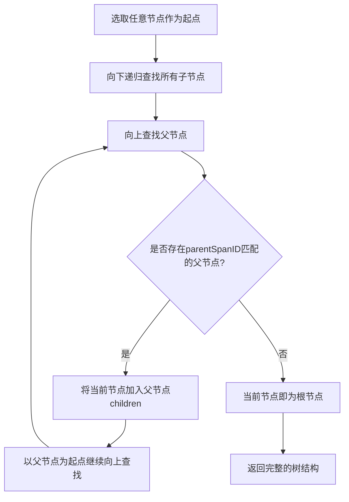
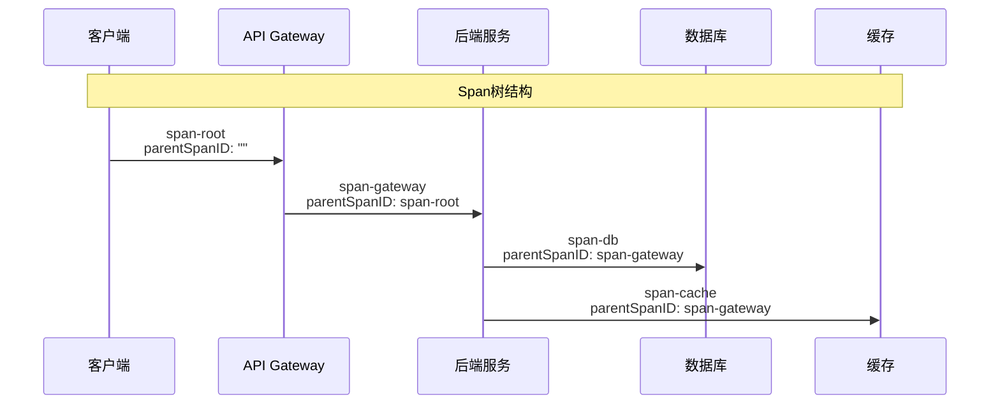
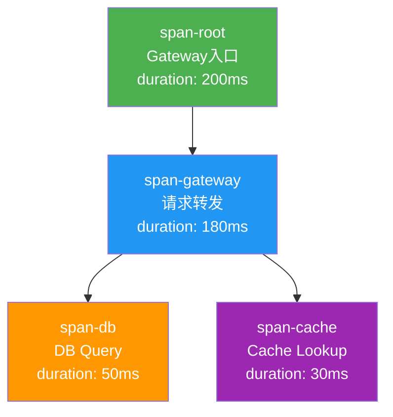
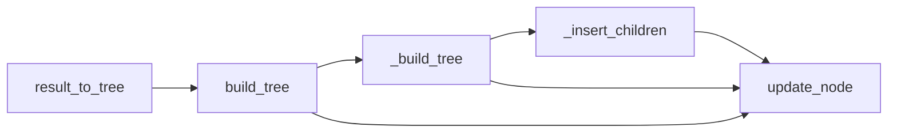

# BKLOG 调用链树构建技术文档

## 一、概述

调用链树构建是分布式链路追踪系统中的核心功能，负责将扁平化的 Span 数据转换为具有父子关系的树结构，用于可视化展示调用链路的时间线甘特图。本文档深度解析 BKLOG 系统中 `build_tree` 递归算法的实现原理。

## 二、核心类与方法概览



## 三、算法流程图

### 3.1 整体构建流程



### 3.2 _insert_children 递归流程



## 四、核心方法详解

### 4.1 build_tree - 入口方法

**文件路径**: `apps/log_trace/handlers/proto/log.py`

**源码位置**: 第 188-200 行

```python
@classmethod
def build_tree(cls, nodes):
    """
    build_tree - 树构建入口方法
    @param nodes: Span节点列表（扁平结构）
    @return: 树结构的根节点

    核心逻辑：
    1. 空列表检查 - 边界条件处理
    2. 选取第一个节点作为初始根节点
    3. 初始化节点属性
    4. 从列表移除已处理节点
    5. 调用递归方法构建完整树
    """
    if not nodes:
        return nodes  # 边界条件：空列表直接返回
    first_root, *_ = nodes  # 解构赋值，取第一个节点
    cls.update_node(first_root)  # 初始化节点树属性
    nodes.remove(first_root)  # 移除已处理节点
    return cls._build_tree(nodes, first_root)  # 递归构建
```

**关键点解析**:

1. **边界条件处理**: 当 `nodes` 为空时直接返回，避免后续递归出错
2. **初始节点选择**: 选择第一个节点作为起点，不代表最终根节点
3. **节点移除策略**: 采用就地移除（`list.remove`），减少内存复制开销

### 4.2 _build_tree - 核心递归方法

**文件路径**: `apps/log_trace/handlers/proto/log.py`

**源码位置**: 第 217-235 行

```python
@classmethod
def _build_tree(cls, nodes: List[dict], cur_node: dict):
    """
    从当前节点cur_node开始，找出父子关系，然后返回整颗树的根节点

    @param nodes: 待处理的节点列表（已移除初始节点）
    @param cur_node: 当前处理的节点
    @return: 树结构的根节点

    递归策略：
    1. 向下递归：查找所有子节点并构建子树
    2. 向上递归：查找父节点直到找到根节点
    3. 终止条件：无法向上查找时返回当前节点
    """
    # 第一步：找到子节点（向下递归）
    cls._insert_children([cur_node], nodes)

    # 第二步：找到父节点（向上查找）
    parent_nodes = [
        node for node in nodes
        if cur_node.get("parentSpanID", "parentSpanID") == node.get("spanID", "spanID")
    ]

    for p_node in parent_nodes:
        cls.update_node(p_node)  # 初始化父节点属性
        p_node["children"].append(cur_node)  # 将当前节点加入父节点的children
        nodes.remove(p_node)  # 移除已处理的父节点

    # 第三步：递归查找直到root根节点
    # 注意：parent_nodes只会有一个（Span的父节点唯一）
    return cls._build_tree(nodes, parent_nodes[0]) if parent_nodes else cur_node
```

**递归终止条件分析**:

| 条件 | 场景 | 返回值 |
|------|------|--------|
| `parent_nodes` 为空 | 当前节点无父节点，即为根节点 | `cur_node` |
| `parent_nodes` 不为空 | 存在父节点，继续向上递归 | `_build_tree(nodes, parent_nodes[0])` |

**Span父子关系建立规则**:



### 4.3 _insert_children - 子节点查找方法

**文件路径**: `apps/log_trace/handlers/proto/log.py`

**源码位置**: 第 202-215 行

```python
@classmethod
def _insert_children(cls, childrens: List[dict], nodes):
    """
    递归查找并插入子节点

    @param childrens: 当前层级的节点列表
    @param nodes: 待处理的节点池

    算法逻辑：
    1. 遍历当前层级的每个节点
    2. 查找parentSpanID匹配当前节点spanID的所有子节点
    3. 将子节点加入当前节点的children列表
    4. 递归处理子节点的children树
    """
    for children in childrens:
        # 检查是否已初始化children属性
        if "children" not in children:
            cls.update_node(children)

        # 查找匹配的子节点：子节点的parentSpanID == 当前节点的spanID
        child_nodes = [
            node for node in nodes
            if node.get("parentSpanID", "parentSpanID") == children.get("spanID", "spanID")
        ]

        for c_node in child_nodes:
            cls.update_node(c_node)  # 初始化子节点
            children["children"].append(c_node)  # 加入父节点的children列表
            nodes.remove(c_node)  # 从节点池移除

        # 递归处理下一层级的子节点
        cls._insert_children(children["children"], nodes)
```

**子节点匹配逻辑详解**:

```python
# 匹配条件表达式
node.get("parentSpanID", "parentSpanID") == children.get("spanID", "spanID")

# 匹配条件解析
# 左侧：待匹配节点的parentSpanID（若不存在则使用默认值）
# 右侧：当前节点的spanID
# 当左侧等于右侧时，说明待匹配节点是当前节点的子节点
```

### 4.4 update_node - 节点属性更新方法

**文件路径**: `apps/log_trace/handlers/proto/log.py`

**源码位置**: 第 237-249 行

```python
@classmethod
def update_node(cls, child: dict) -> dict:
    """
    更新节点属性，添加甘特图展示所需的字段

    @param child: Span原始数据节点
    @return: 更新后的节点

    新增字段说明：
    - group: 甘特图分组标识（使用spanID）
    - from: 时间轴起点（startTime）
    - to: 时间轴终点（startTime + duration）
    - unit: 时间单位
    - parentSpanID: 父Span标识
    - children: 子节点列表（初始化为空）
    """
    child.update({
        "group": child.get("spanID", ""),           # 甘特图分组ID
        "from": child.get("startTime", 0),          # 开始时间戳
        "to": child.get("startTime", 0) + child.get("duration", 0),  # 结束时间戳
        "unit": "ms",                               # 时间单位：毫秒
        "parentSpanID": child.get("parentSpanID", ""),  # 父SpanID
        "children": [],                             # 子节点列表初始化
    })
    return child
```

## 五、OTLP协议实现对比

OtlpTrace 类实现了相同的树构建算法，但字段命名不同。

**文件路径**: `apps/log_trace/handlers/proto/otlp.py`

### 5.1 字段映射对照表

| LogTrace 字段 | OtlpTrace 字段 | 说明 |
|---------------|----------------|------|
| `traceID` | `trace_id` | Trace标识 |
| `spanID` | `span_id` | Span标识 |
| `parentSpanID` | `parent_span_id` | 父Span标识 |
| `operationName` | `span_name` | 操作名称 |
| `startTime` | `start_time` | 开始时间 |

### 5.2 OtlpTrace build_tree 实现

**源码位置**: 第 159-171 行

```python
@classmethod
def build_tree(cls, nodes):
    """OTLP协议的树构建入口"""
    if not nodes:
        return nodes
    first_root, *_ = nodes
    cls.update_node(first_root)
    nodes.remove(first_root)
    return cls._build_tree(nodes, first_root)
```

### 5.3 OtlpTrace _insert_children 实现

**源码位置**: 第 173-187 行

```python
@classmethod
def _insert_children(cls, childrens: List[dict], nodes):
    """OTLP协议的子节点查找"""
    for children in childrens:
        if "children" not in children:
            cls.update_node(children)

        # 使用OTLP字段名进行匹配
        child_nodes = [
            node for node in nodes
            if node.get("parent_span_id", "parent_span_id") == children.get("span_id", "span_id")
        ]

        for c_node in child_nodes:
            cls.update_node(c_node)
            children["children"].append(c_node)
            nodes.remove(c_node)

        cls._insert_children(children["children"], nodes)
```

### 5.4 OtlpTrace update_node 实现

**源码位置**: 第 209-228 行

```python
@classmethod
def update_node(cls, child: dict) -> dict:
    """OTLP协议的节点属性更新"""
    child.update({
        "start_time": cls.format_time(child.get("start_time")),
        "end_time": cls.format_time(child.get("end_time")),
        "group": child.get("span_id", ""),
        "from": child.get("start_time", 0),
        "to": child.get("end_time", 0),
        "unit": "ms",
        "parentSpanID": child.get("parent_span_id", "parent_span_id"),
        "children": [],
    })
    return child
```

## 六、树结构数据格式

### 6.1 输入数据结构（扁平列表）

```json
[
    {
        "traceID": "trace-001",
        "spanID": "span-root",
        "parentSpanID": "",
        "operationName": "HTTP GET /api",
        "startTime": 1704067200000,
        "duration": 150,
        "tags": { "error": false }
    },
    {
        "traceID": "trace-001",
        "spanID": "span-child-1",
        "parentSpanID": "span-root",
        "operationName": "DB Query",
        "startTime": 1704067200010,
        "duration": 50,
        "tags": { "error": false }
    },
    {
        "traceID": "trace-001",
        "spanID": "span-child-2",
        "parentSpanID": "span-root",
        "operationName": "Cache Lookup",
        "startTime": 1704067200020,
        "duration": 30,
        "tags": { "error": false }
    },
    {
        "traceID": "trace-001",
        "spanID": "span-grandchild",
        "parentSpanID": "span-child-1",
        "operationName": "Redis Get",
        "startTime": 1704067200015,
        "duration": 20,
        "tags": { "error": false }
    }
]
```

### 6.2 输出树结构

```json
{
    "traceID": "trace-001",
    "spanID": "span-root",
    "parentSpanID": "",
    "operationName": "HTTP GET /api",
    "startTime": 1704067200000,
    "duration": 150,
    "group": "span-root",
    "from": 1704067200000,
    "to": 1704067200150,
    "unit": "ms",
    "children": [
        {
            "spanID": "span-child-1",
            "parentSpanID": "span-root",
            "operationName": "DB Query",
            "startTime": 1704067200010,
            "duration": 50,
            "group": "span-child-1",
            "from": 1704067200010,
            "to": 1704067200060,
            "unit": "ms",
            "children": [
                {
                    "spanID": "span-grandchild",
                    "parentSpanID": "span-child-1",
                    "operationName": "Redis Get",
                    "startTime": 1704067200015,
                    "duration": 20,
                    "group": "span-grandchild",
                    "from": 1704067200015,
                    "to": 1704067200035,
                    "unit": "ms",
                    "children": []
                }
            ]
        },
        {
            "spanID": "span-child-2",
            "parentSpanID": "span-root",
            "operationName": "Cache Lookup",
            "startTime": 1704067200020,
            "duration": 30,
            "group": "span-child-2",
            "from": 1704067200020,
            "to": 1704067200050,
            "unit": "ms",
            "children": []
        }
    ]
}
```

### 6.3 树结构可视化



## 七、根节点识别算法详解

### 7.1 根节点定义

根节点是调用链的起点，具有以下特征：
- `parentSpanID` 为空字符串或不存在
- 是整个调用链的第一个 Span

### 7.2 识别算法流程



### 7.3 根节点识别代码解析

```python
# 核心识别逻辑（_build_tree方法第226-235行）
parent_nodes = [
    node for node in nodes
    if cur_node.get("parentSpanID", "parentSpanID") == node.get("spanID", "spanID")
]

# 当parent_nodes为空时，说明：
# 1. 当前节点的parentSpanID在nodes中找不到匹配的spanID
# 2. 当前节点即为根节点
return cls._build_tree(nodes, parent_nodes[0]) if parent_nodes else cur_node
```

### 7.4 根节点识别场景分析

| 场景 | parent_nodes状态 | 结果 |
|------|------------------|------|
| 正常调用链 | 最终为空 | 找到根节点 |
| 跨服务调用（Span缺失） | 某节点parent_nodes为空 | 以缺失父节点的节点作为根 |
| 循环引用（异常数据） | 无法终止 | 理论上不会出现（Span ID唯一） |

## 八、算法复杂度分析

### 8.1 时间复杂度

| 方法 | 复杂度 | 说明 |
|------|--------|------|
| `build_tree` | O(n) | 入口方法，线性操作 |
| `_build_tree` | O(n log n) ~ O(n^2) | 依赖数据结构，最坏情况下平方级 |
| `_insert_children` | O(n) 每层 | 每层遍历nodes一次 |
| `update_node` | O(1) | 单节点更新，常数时间 |

**优化建议**:

当前实现使用列表遍历查找父子节点，可通过以下方式优化：

```python
# 优化方案：预先构建spanID索引
def build_tree_optimized(nodes):
    if not nodes:
        return nodes

    # 构建 spanID -> node 的映射
    span_map = {node["spanID"]: node for node in nodes}

    # 构建 parentSpanID -> children 的映射
    children_map = defaultdict(list)
    for node in nodes:
        parent_id = node.get("parentSpanID", "")
        if parent_id and parent_id in span_map:
            children_map[parent_id].append(node)

    # 找到根节点（parentSpanID为空或不存在）
    root = None
    for node in nodes:
        parent_id = node.get("parentSpanID", "")
        if not parent_id or parent_id not in span_map:
            root = node
            break

    # 构建树结构
    def build_children(node):
        node["children"] = []
        for child in children_map.get(node["spanID"], []):
            update_node(child)
            node["children"].append(build_children(child))
        return node

    return build_children(root)
```

优化后的时间复杂度：O(n)

### 8.2 空间复杂度

| 数据结构 | 空间占用 |
|----------|----------|
| 原始nodes列表 | O(n) |
| 递归调用栈 | O(h)，h为树高度 |
| 输出树结构 | O(n) |

## 九、异常场景处理

### 9.1 异常定义

**文件路径**: `apps/log_trace/exceptions.py`

```python
# 第 40-42 行
class TraceRootException(BaseTraceException):
    ERROR_CODE = "002"
    MESSAGE = _("trace日志没有找到根节点")
```

### 9.2 边界情况处理

| 边界情况 | 处理方式 |
|----------|----------|
| 空Span列表 | `build_tree` 返回空列表 |
| 单节点Trace | 直接返回该节点（即为根节点） |
| 孤立节点（parentSpanID不存在） | 作为独立子树处理 |
| 循环引用 | 通过nodes移除机制避免（已处理节点不重复处理） |

## 十、调用链路图示例

### 10.1 典型HTTP调用链



### 10.2 对应的树结构



## 十一、总结

### 11.1 核心设计要点

1. **双向递归**: 向下查找子节点 + 向上查找父节点，确保完整树构建
2. **就地修改**: 使用 `list.remove()` 就地移除已处理节点，减少内存开销
3. **节点初始化**: `update_node` 方法统一添加树展示所需属性
4. **协议适配**: LogTrace 和 OtlpTrace 实现相同算法，仅字段名不同

### 11.2 方法调用链



---

**文档版本**: v1.0
**生成日期**: 2026-04-30
**源码路径**: `apps/log_trace/handlers/proto/log.py`, `apps/log_trace/handlers/proto/otlp.py`