# BKLOG 懒加载Span处理器技术文档

## 一、概述

`LazyBatchSpanProcessor` 是 BKLOG 系统针对 OpenTelemetry Span 处理流程的核心优化组件。该组件继承自 OpenTelemetry SDK 的 `BatchSpanProcessor`，通过懒加载机制实现了工作线程的按需启动，有效避免了应用启动时不必要的线程资源占用，降低了系统在无追踪请求时的资源开销。

## 二、核心类结构

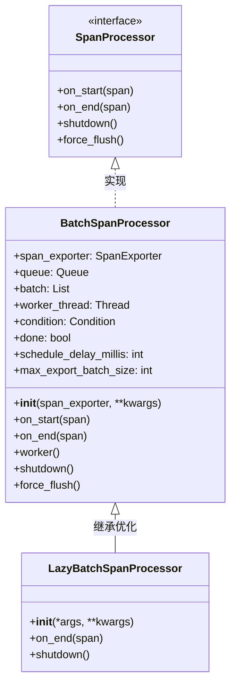

## 三、OpenTelemetry Span处理流程

### 3.1 Span生命周期流程图

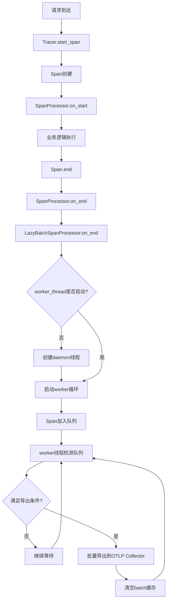

### 3.2 Span处理架构图

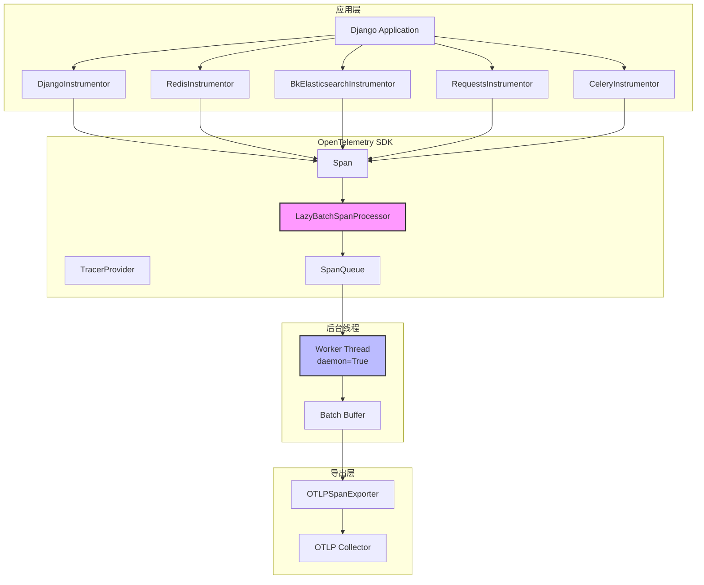

## 四、LazyBatchSpanProcessor 完整实现

### 4.1 核心源码

**文件路径**: `apps/log_trace/trace/__init__.py`

**源码位置**: 第 184-208 行

```python
class LazyBatchSpanProcessor(BatchSpanProcessor):
    """
    懒加载批处理Span处理器

    继承自OpenTelemetry SDK的BatchSpanProcessor，优化线程启动时机：
    - 父类BatchSpanProcessor在__init__时就启动后台工作线程
    - LazyBatchSpanProcessor延迟到第一个Span.on_end时才启动

    设计意图：
    1. 避免应用启动时创建不必要的后台线程
    2. 减少无追踪请求时的资源占用
    3. 按需初始化，提高资源利用率
    """

    def __init__(self, *args, **kwargs):
        """
        初始化懒加载处理器

        核心逻辑：
        1. 调用父类__init__完成基础初始化（创建队列、条件变量等）
        2. 设置done=True标记，通知父类创建的线程停止
        3. 通过condition.notify_all()唤醒线程使其检测到done标记
        4. 等待父类线程完全退出（join阻塞）
        5. 重置done=False，为后续懒启动做准备
        6. 将worker_thread置为None，表示线程未启动状态
        """
        super().__init__(*args, **kwargs)

        # 停止父类自动启动的默认线程
        self.done = True
        with self.condition:
            self.condition.notify_all()
        self.worker_thread.join()

        # 重置状态，准备懒启动
        self.done = False
        self.worker_thread = None

    def on_end(self, span: ReadableSpan) -> None:
        """
        Span结束回调 - 懒加载触发点

        @param span: ReadableSpan 完成的Span对象

        核心逻辑：
        1. 检查worker_thread是否已启动
        2. 若未启动，创建daemon线程并启动
        3. 调用父类on_end将Span加入队列
        """
        if self.worker_thread is None:
            # 首次Span到达时，启动工作线程
            self.worker_thread = threading.Thread(
                target=self.worker,
                daemon=True  # daemon线程，主线程退出时自动终止
            )
            self.worker_thread.start()
        super().on_end(span)

    def shutdown(self) -> None:
        """
        关闭处理器

        核心逻辑：
        1. 设置done=True，通知工作线程停止
        2. 通过condition.notify_all()唤醒等待中的线程
        3. 若worker_thread存在，等待其完全退出
        4. 调用span_exporter.shutdown()关闭导出器
        """
        # signal the worker thread to finish and then wait for it
        self.done = True
        with self.condition:
            self.condition.notify_all()
        if self.worker_thread:
            self.worker_thread.join()
        self.span_exporter.shutdown()
```

## 五、懒加载触发机制详解

### 5.1 懒加载触发流程图

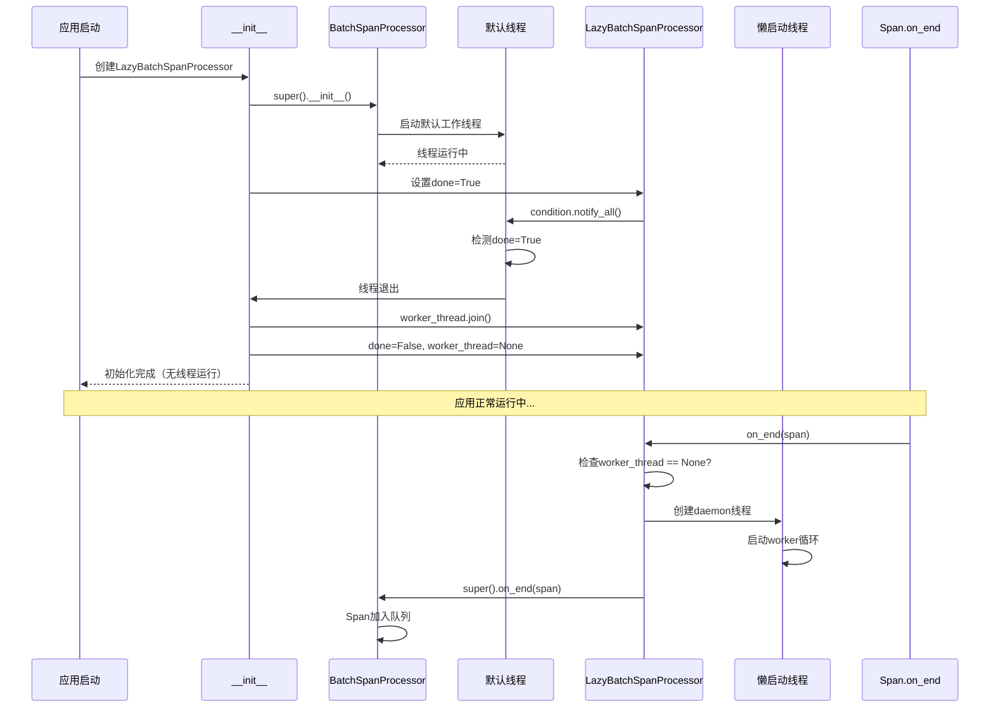

### 5.2 懒加载触发时机分析

| 触发时机 | worker_thread状态 | 行为 |
|----------|-------------------|------|
| 应用启动时 | None（父类线程已停止） | 无线程运行 |
| 首个Span.on_end | None | 创建并启动daemon线程 |
| 后续Span.on_end | Thread对象 | 直接调用父类on_end |
| shutdown调用 | Thread对象或None | 设置done=True，等待线程退出 |

### 5.3 线程启动关键代码解析

```python
# apps/log_trace/trace/__init__.py 第 196-199 行
if self.worker_thread is None:
    self.worker_thread = threading.Thread(
        target=self.worker,
        daemon=True  # daemon线程特性
    )
    self.worker_thread.start()
```

**daemon=True 的设计意义**:

1. **主线程退出时自动终止**: 当应用主进程退出时，daemon线程会自动终止，无需显式关闭
2. **避免线程阻塞应用关闭**: 非daemon线程会阻止进程退出，daemon线程则不会
3. **适用于后台任务**: Span导出是后台异步任务，丢失少量未导出Span不影响应用正常关闭

## 六、批量导出策略

### 6.1 批量导出流程图

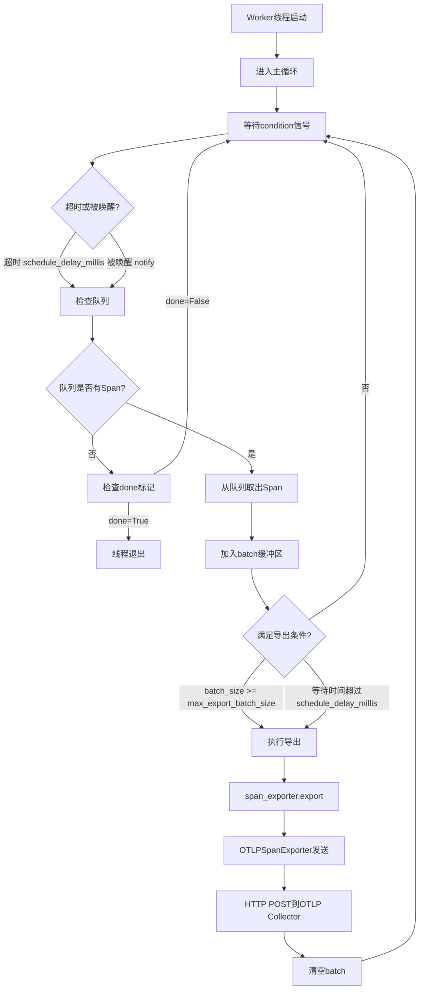

### 6.2 BatchSpanProcessor 配置参数

| 参数 | 默认值 | 说明 |
|------|--------|------|
| `schedule_delay_millis` | 5000ms | 导出间隔，每5秒检查一次 |
| `max_queue_size` | 2048 | 队列最大容量 |
| `max_export_batch_size` | 512 | 单次导出最大Span数 |
| `export_timeout_millis` | 30000ms | 导出超时时间 |

### 6.3 批量导出优势分析

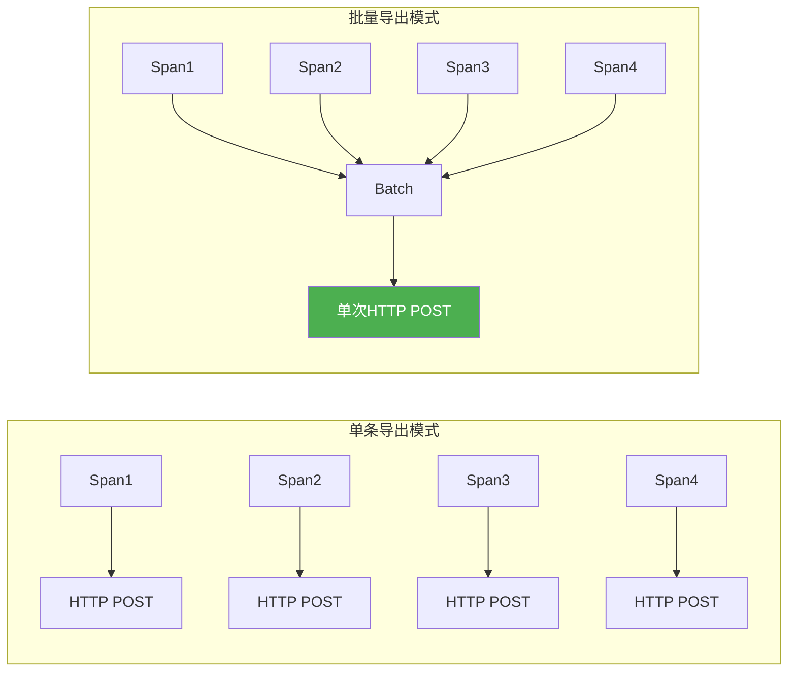

| 维度 | 单条导出 | 批量导出 |
|------|----------|----------|
| HTTP请求次数 | N次 | N/512次 |
| 网络开销 | 高 | 低 |
| OTLP Collector压力 | 高 | 低 |
| Span丢失风险 | 低 | 略高（批量丢失） |
| 导出延迟 | 低 | 略高（等待批量） |

## 七、与原生BatchSpanProcessor对比

### 7.1 线程启动时机对比

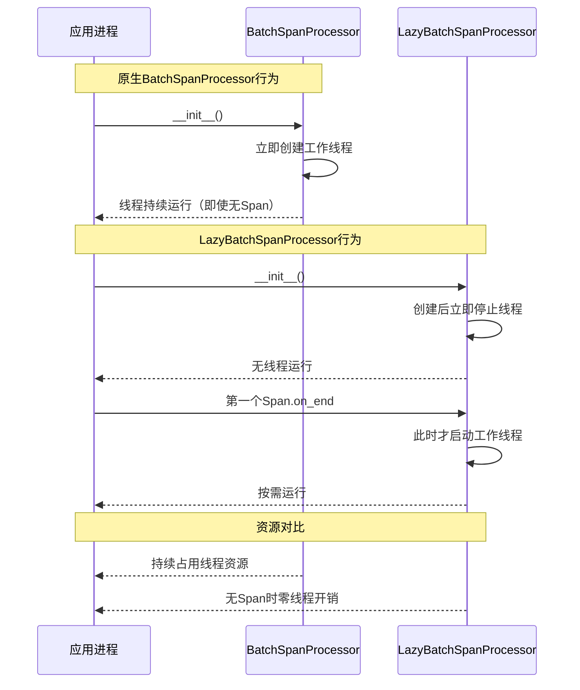

### 7.2 核心差异对比表

| 维度 | BatchSpanProcessor | LazyBatchSpanProcessor |
|------|--------------------|------------------------|
| 线程启动时机 | __init__时立即启动 | 首个Span.on_end时启动 |
| 无请求时资源占用 | 持续占用线程 | 零线程占用 |
| 启动性能影响 | 线程创建开销 | 启动更快 |
| 请求响应延迟 | 无额外延迟 | 首次请求有线程创建延迟 |
| 适用场景 | 高频请求系统 | 中低频请求系统 |
| 线程管理复杂度 | 简单 | 需额外管理线程状态 |

### 7.3 原生实现的问题分析

**原生BatchSpanProcessor __init__源码参考**:

```python
# OpenTelemetry SDK 参考实现
class BatchSpanProcessor(SpanProcessor):
    def __init__(self, span_exporter, ...):
        # ... 初始化队列、条件变量等
        self.worker_thread = threading.Thread(
            name="BatchSpanProcessorWorker",
            target=self.worker,
            daemon=True,
        )
        self.worker_thread.start()  # 立即启动，无Span时仍运行
```

**问题点**:

1. **不必要的线程开销**: 应用启动时立即创建线程，即使后续无任何追踪请求
2. **后台线程空转**: worker线程进入等待循环，占用CPU调度资源
3. **资源浪费**: 在Celery Beat等低频请求场景中尤为明显

## 八、应用启动集成

### 8.1 初始化调用链

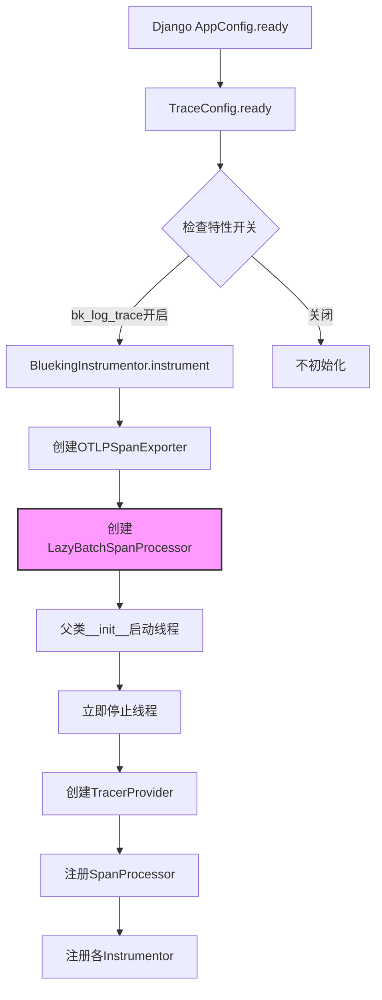

### 8.2 应用入口代码

**文件路径**: `apps/log_trace/apps.py`

**源码位置**: 第 32-38 行

```python
def ready(self):
    """
    Django AppConfig.ready() - 应用启动入口

    初始化逻辑：
    1. Celery Worker（非Beat）不初始化追踪
    2. 检查bk_log_trace特性开关
    3. 开关启用时执行instrument()
    """
    if settings.IS_CELERY and not settings.IS_CELERY_BEAT:
        return
    from apps.feature_toggle.handlers.toggle import FeatureToggleObject

    if FeatureToggleObject.switch("bk_log_trace"):
        BluekingInstrumentor().instrument()
```

### 8.3 Celery Worker初始化

**文件路径**: `apps/log_trace/trace/__init__.py`

**源码位置**: 第 296-301 行

```python
@worker_process_init.connect(weak=False)
def init_celery_tracing(*args, **kwargs):
    """
    Celery Worker进程初始化信号回调

    设计要点：
    1. 使用worker_process_init信号，每个Worker进程独立初始化
    2. 避免多进程环境下的TracerProvider共享问题
    3. 同样使用LazyBatchSpanProcessor降低资源占用
    """
    from apps.feature_toggle.handlers.toggle import FeatureToggleObject

    if FeatureToggleObject.switch("bk_log_trace"):
        BluekingInstrumentor().instrument()
```

## 九、Span导出链路

### 9.1 完整导出流程图

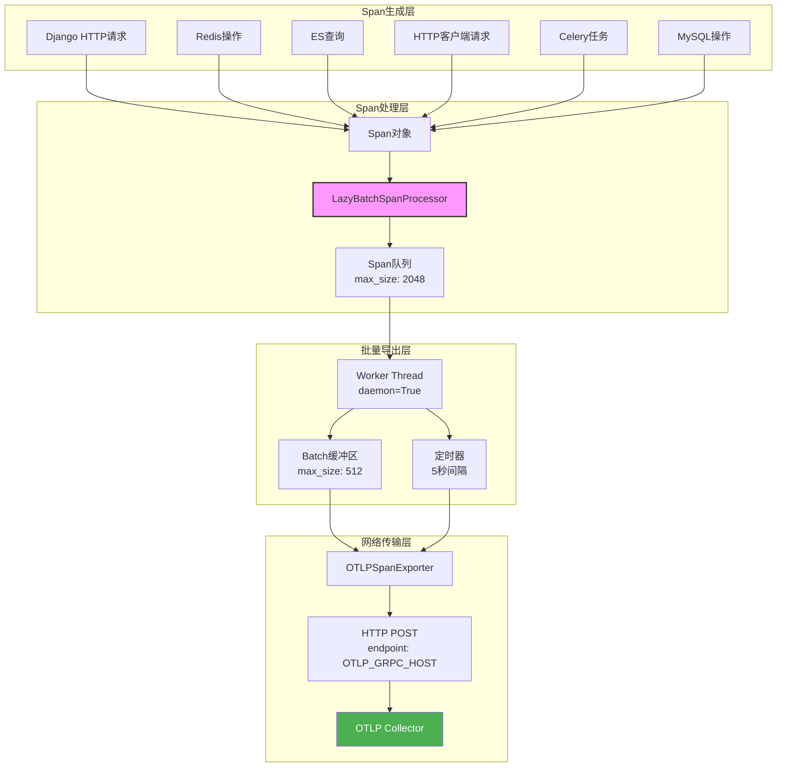

### 9.2 OTLP导出器配置

**文件路径**: `apps/log_trace/trace/__init__.py`

**源码位置**: 第 239-240 行

```python
# 创建OTLP导出器
otlp_exporter = OTLPSpanExporter(endpoint=otlp_grpc_host)
span_processor = LazyBatchSpanProcessor(otlp_exporter)
```

### 9.3 OTLP协议数据格式

```json
{
    "resource_spans": [{
        "resource": {
            "attributes": [
                {"key": "service.name", "value": {"stringValue": "bklog"}},
                {"key": "service.version", "value": {"stringValue": "1.0.0"}},
                {"key": "bk.data.token", "value": {"stringValue": "xxx"}}
            ]
        },
        "scope_spans": [{
            "spans": [{
                "trace_id": "trace-001",
                "span_id": "span-001",
                "parent_span_id": "",
                "name": "HTTP GET /api/search",
                "kind": 1,
                "start_time": "1704067200000000000",
                "end_time": "1704067200150000000",
                "attributes": [
                    {"key": "http.method", "value": {"stringValue": "GET"}},
                    {"key": "http.url", "value": {"stringValue": "/api/search"}}
                ]
            }]
        }]
    }]
}
```

## 十、多线程安全设计

### 10.1 线程同步机制

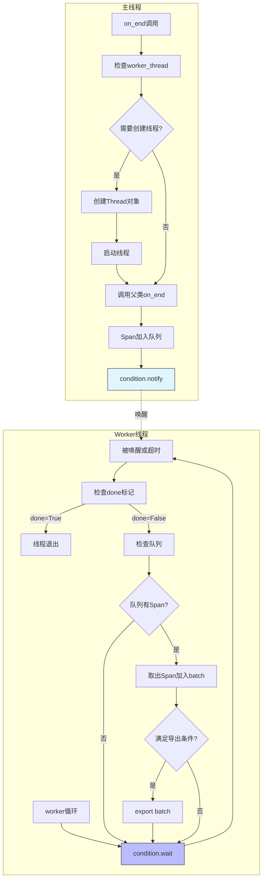

### 10.2 Condition变量作用

```python
# Condition变量核心使用场景
with self.condition:
    self.condition.notify_all()  # 告知线程检查done标记

with self.condition:
    self.condition.wait(timeout=self.schedule_delay_millis)  # 等待信号或超时
```

**Condition变量设计要点**:

1. **通知机制**: `notify_all()` 告知等待线程检查状态
2. **等待机制**: `wait(timeout)` 支持超时等待，避免无限阻塞
3. **锁保护**: `with self.condition` 自动获取/释放锁，保护共享状态

## 十一、异常场景处理

### 11.1 异常场景分析

| 场景 | 处理方式 | 影响 |
|------|----------|------|
| OTLP Collector不可达 | export失败，Span留在队列 | 后续重试导出 |
| 队列满（max_queue_size） | 新Span被丢弃 | Span丢失 |
| Worker线程异常退出 | 无自动重启机制 | 所有后续Span丢失 |
| 应用突然退出 | daemon线程自动终止 | 未导出Span丢失 |
| shutdown未调用 | daemon线程随主线程退出 | 未导出Span丢失 |

### 11.2 Span丢失场景分析

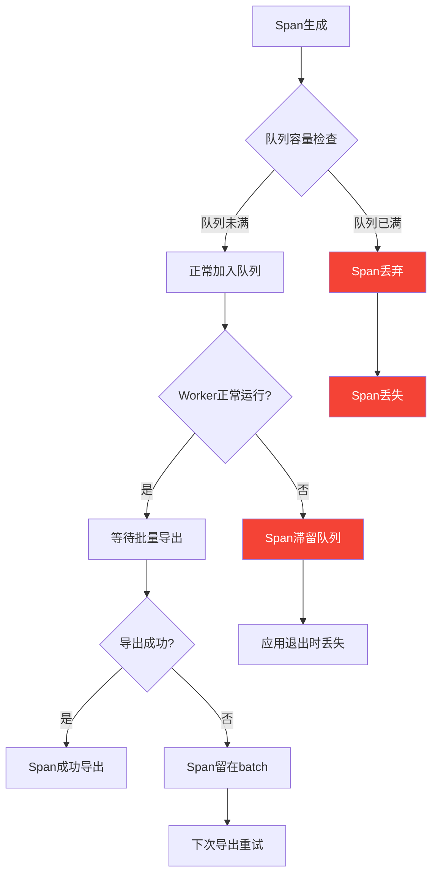

## 十二、性能优化分析

### 12.1 资源占用对比

| 状态 | BatchSpanProcessor | LazyBatchSpanProcessor |
|------|--------------------|------------------------|
| 应用启动完成 | 1个后台线程运行 | 0个线程运行 |
| 无追踪请求 | 线程空转等待 | 零线程开销 |
| 首次追踪请求 | 无延迟 | 线程创建延迟（~1ms） |
| 活跃追踪请求 | 正常运行 | 正常运行 |

### 12.2 适用场景分析

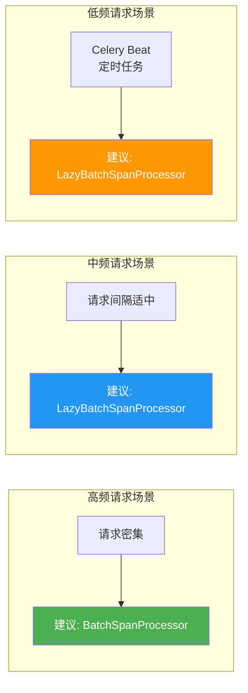

### 12.3 BKLOG场景适配

BKLOG系统选择LazyBatchSpanProcessor的考量：

1. **Celery Beat场景**: 定时任务请求频率低，无请求时不应占用线程资源
2. **管理后台场景**: 用户操作不频繁，大部分时间无追踪请求
3. **资源优化**: 多Worker进程部署时，减少不必要的线程总数

## 十三、设计要点总结

### 13.1 懒加载设计核心思想

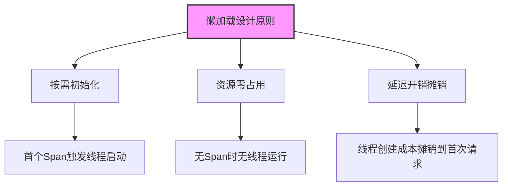

### 13.2 实现要点总结

| 要点 | 实现方式 | 代码位置 |
|------|----------|----------|
| 停止父类线程 | done=True + notify_all + join | 第187-192行 |
| 状态重置 | done=False + worker_thread=None | 第193-194行 |
| 懒启动触发 | on_end检查worker_thread | 第196-199行 |
| daemon线程 | Thread(daemon=True) | 第197行 |
| 安全关闭 | shutdown检查worker_thread | 第201-208行 |

### 13.3 与OpenTelemetry生态集成

```mermaid
graph TB
    subgraph "OpenTelemetry标准组件"
        SDK[SDK Core]
        API[Trace API]
        EXPORT[OTLP Exporter]
        PROC[SpanProcessor接口]
    end

    subgraph "BKLOG自定义实现"
        LAZY[LazyBatchSpanProcessor]
        INST[BluekingInstrumentor]
        HOOK[自定义Hooks]
    end

    subgraph "蓝鲸基础设施"
        FEAT[FeatureToggle开关]
        OTLP[OTLP Collector]
        BKDATA[数据平台]
    end

    SDK --> PROC
    PROC <|.. LAZY : 继承优化
    EXPORT --> OTLP
    INST --> API
    API --> PROC
    LAZY --> EXPORT
    FEAT --> INST
    OTLP --> BKDATA
    HOOK --> INST

    style LAZY fill:#f9f,stroke:#333,stroke-width:2px
    style PROC fill:#e1f5fe,stroke:#333
```

## 十四、相关文档

- [01-OpenTelemetry集成.md](./01-OpenTelemetry集成.md) - 了解BluekingInstrumentor总控实现
- [02-Trace查询实现.md](./02-Trace查询实现.md) - 了解Trace数据查询流程
- [03-调用链树构建.md](./03-调用链树构建.md) - 了解Span树结构构建算法

---

**文档版本**: v1.0
**生成日期**: 2026-04-30
**源码路径**: `apps/log_trace/trace/__init__.py`