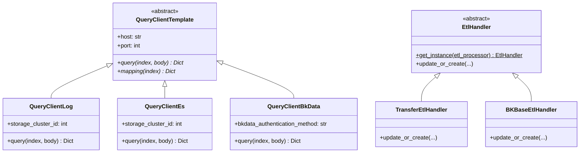
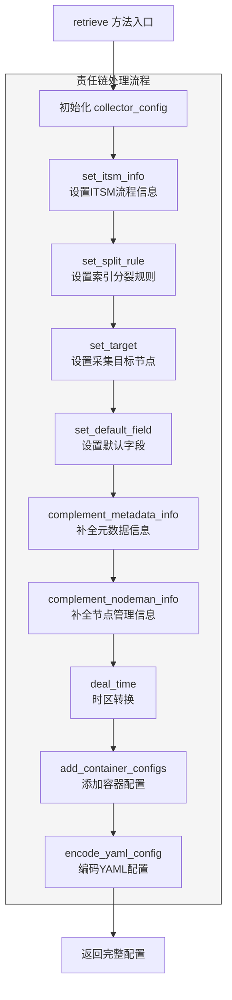

# BKLOG 设计模式应用总结

## 目录

- [一、策略模式](#一策略模式)
- [二、工厂模式](#二工厂模式)
- [三、模板方法模式](#三模板方法模式)
- [四、责任链模式](#四责任链模式)
- [五、建造者模式](#五建造者模式)
- [六、装饰器模式](#六装饰器模式)
- [七、设计模式关系总览](#七设计模式关系总览)

---

## 一、策略模式

策略模式定义了一系列算法，将每个算法封装起来，并使它们可以互相替换。BKLOG 在 ES 查询场景和 ETL 清洗场景中广泛应用策略模式。

### 1.1 QueryClient 策略模式

**核心文件位置**：
- `apps/log_esquery/esquery/client/QueryClientTemplate.py` (抽象模板类)
- `apps/log_esquery/esquery/client/QueryClientLog.py` (日志场景策略)
- `apps/log_esquery/esquery/client/QueryClientEs.py` (ES 原生场景策略)
- `apps/log_esquery/esquery/client/QueryClientBkData.py` (BKBase 数据平台策略)

**抽象策略接口 QueryClientTemplate**：

```python
# 文件: apps/log_esquery/esquery/client/QueryClientTemplate.py (第 33-48 行)
class QueryClientTemplate(object):
    def __init__(self):
        self.host: str = ""
        self.port: int = -1
        self.username: str = ""
        self.password: str = ""

    def query(self, index: str, body: Dict[str, Any], scroll=None, track_total_hits=False):
        raise NotImplementedError()  # 抽象方法，子类必须实现

    def mapping(self, index: str, add_settings_details: bool = False) -> Dict:
        raise NotImplementedError()  # 抽象方法
```

**具体策略实现 QueryClientLog**：

```python
# 文件: apps/log_esquery/esquery/client/QueryClientLog.py (第 54-73 行)
class QueryClientLog(QueryClientTemplate):
    def __init__(self, storage_cluster_id: int = None):
        super(QueryClientLog, self).__init__()
        self.storage_cluster_id = storage_cluster_id

    def query(self, index: str, body: Dict[str, Any], scroll=None, track_total_hits=False):
        self._build_connection(index=index, check_ping=False)

        if track_total_hits and not isinstance(self._client, Elasticsearch5):
            body.update({"track_total_hits": True})

        return self._client.search(index=index, body=body, scroll=scroll)
```

### 1.2 EtlHandler 策略模式

**核心文件位置**：
- `apps/log_databus/handlers/etl/base.py` (第 72-105 行) - 抽象策略基类
- `apps/log_databus/handlers/etl/transfer.py` - Transfer 清洗策略
- `apps/log_databus/handlers/etl/bkbase.py` - BKBase 清洗策略

**策略选择方法**：

```python
# 文件: apps/log_databus/handlers/etl/base.py (第 72-105 行)
class EtlHandler:
    @classmethod
    def get_instance(cls, collector_config_id=None, etl_processor=ETLProcessorChoices.TRANSFER.value):
        """策略选择方法 - 根据处理器类型返回具体策略实例"""
        mapping = {
            ETLProcessorChoices.BKBASE.value: "BKBaseEtlHandler",
            ETLProcessorChoices.TRANSFER.value: "TransferEtlHandler",
        }
        etl_handler = import_string(f"apps.log_databus.handlers.etl.{etl_processor}.{mapping.get(etl_processor)}")
        return etl_handler(collector_config_id=collector_config_id)
```

### 1.3 策略模式类图



---

## 二、工厂模式

工厂模式提供了一种创建对象的最佳方式，在创建对象时不会对客户端暴露创建逻辑。

### 2.1 QueryClient 工厂方法

**核心文件位置**：`apps/log_esquery/esquery/client/QueryClient.py` (第 28-52 行)

```python
class QueryClient(object):
    def __init__(
        self,
        scenario_id: str,
        storage_cluster_id: int = -1,
        bkdata_authentication_method: str = "",
        bkdata_data_token: str = "",
    ):
        self.scenario_id: str = scenario_id
        self.storage_cluster_id: int = storage_cluster_id

    def get_instance(self):
        """工厂方法 - 根据场景类型创建对应的客户端实例"""
        mapping = {
            Scenario.BKDATA: "apps.log_esquery.esquery.client.QueryClientBkData.QueryClientBkData",
            Scenario.LOG: "apps.log_esquery.esquery.client.QueryClientLog.QueryClientLog",
            Scenario.ES: "apps.log_esquery.esquery.client.QueryClientEs.QueryClientEs",
        }
        client = import_string(mapping.get(self.scenario_id))

        if self.scenario_id in [Scenario.LOG, Scenario.ES]:
            return client(self.storage_cluster_id)
        elif self.scenario_id == Scenario.BKDATA:
            return client(self.bkdata_authentication_method, self.bkdata_data_token)
        return client()
```

### 2.2 CollectorHandler 工厂方法

**核心文件位置**：`apps/log_databus/handlers/collector/base.py` (第 137-160 行)

```python
class CollectorHandler:
    @classmethod
    def get_instance(cls, collector_config_id=None, env=None):
        """工厂方法 - 根据环境类型创建对应的采集处理器"""
        if env == Environment.CONTAINER:
            collector_handler = import_string("apps.log_databus.handlers.collector.K8sCollectorHandler")
            return collector_handler()
        else:
            collector_handler = import_string("apps.log_databus.handlers.collector.HostCollectorHandler")
            return collector_handler()
```

---

## 三、模板方法模式

模板方法模式定义了一个操作中的算法骨架，将某些步骤延迟到子类中实现。

### 3.1 CollectorHandler 模板方法

**核心文件位置**：`apps/log_databus/handlers/collector/base.py` (第 403-480 行)

```python
class CollectorHandler:
    @abc.abstractmethod
    def _pre_start(self):
        """钩子方法 - 子类必须实现"""
        raise NotImplementedError

    @transaction.atomic
    def start(self, **kwargs):
        """
        模板方法 - 启动采集配置的算法骨架
        """
        # Step 1: ITSM 流程判断
        self._itsm_start_judge()

        # Step 2: 更新状态为活跃
        self.data.is_active = True
        self.data.save()

        # Step 3: 启用索引集
        if self.data.index_set_id:
            IndexSetHandler(self.data.index_set_id).start()

        # Step 4: 调用子类钩子方法
        self._pre_start()

        # Step 5: 启用结果表
        if self.data.table_id:
            etl_storage = EtlStorage.get_instance(self.data.etl_config)
            etl_storage.switch_result_table(collector_config=self.data, is_enable=True)

        return True

    @abc.abstractmethod
    def _pre_stop(self):
        raise NotImplementedError

    @transaction.atomic
    def stop(self, is_stop_index_set=True, **kwargs):
        """模板方法 - 停止采集配置"""
        self.data.is_active = False
        self.data.save()
        self._pre_stop()
        # ... 更多步骤
```

**子类 HostCollectorHandler 实现钩子方法**：

```python
# 文件: apps/log_databus/handlers/collector/host.py (第 82-131 行)
class HostCollectorHandler(CollectorHandler):
    def _pre_start(self):
        """物理机场景的启动前置逻辑"""
        if self.data.subscription_id:
            NodeApi.switch_subscription({"subscription_id": self.data.subscription_id, "action": "enable"})

    def _pre_stop(self):
        """物理机场景的停止前置逻辑"""
        if self.data.subscription_id:
            NodeApi.switch_subscription({"subscription_id": self.data.subscription_id, "action": "disable"})

    def _pre_destroy(self):
        """物理机场景的删除前置逻辑"""
        if self.data.subscription_id:
            NodeApi.delete_subscription({"subscription_id": self.data.subscription_id})
```

---

## 四、责任链模式

责任链模式使多个对象都有机会处理请求，将这些对象连成一条链传递请求。

### 4.1 RETRIEVE_CHAIN 责任链定义

**核心文件位置**：`apps/log_databus/constants.py` (第 736-748 行)

```python
RETRIEVE_CHAIN = [
    "set_itsm_info",           # 处理节点1: 设置 ITSM 流程信息
    "set_split_rule",          # 处理节点2: 设置索引分裂规则
    "set_target",              # 处理节点3: 设置采集目标节点
    "set_default_field",       # 处理节点4: 设置默认字段
    "set_categorie_name",      # 处理节点5: 设置分类名称
    "complement_metadata_info", # 处理节点6: 补全元数据信息
    "complement_nodeman_info",  # 处理节点7: 补全节点管理信息
    "fields_is_empty",         # 处理节点8: 处理空字段场景
    "deal_time",               # 处理节点9: 处理时区转换
    "add_container_configs",    # 处理节点10: 添加容器配置
    "encode_yaml_config",       # 处理节点11: 编码 YAML 配置
]
```

### 4.2 责任链执行流程

```python
# 文件: apps/log_databus/handlers/collector/base.py (第 482-502 行)
class CollectorHandler:
    def retrieve(self, use_request=True):
        """获取采集配置 - 责任链模式执行"""
        context = self._multi_info_get(use_request)
        collector_config = model_to_dict(self.data)

        # 责任链处理 - 依次调用每个处理节点
        for process in RETRIEVE_CHAIN:
            collector_config = getattr(self, process)(collector_config, context)

        return collector_config
```

### 4.3 责任链模式流程图



---

## 五、建造者模式

建造者模式将复杂对象的构建与表示分离，使得同样的构建过程可以创建不同表示。

### 5.1 DslBuilder 建造者实现

**核心文件位置**：`apps/log_esquery/esquery/dsl_builder/dsl_builder.py` (第 34-195 行)

```python
class DslBuilder(object):
    def __init__(
        self,
        search_string="*",           # 搜索字符串
        filter_dict_list: list = [],  # 过滤条件列表
        time_range_dict: dict = {},   # 时间范围字典
        sort_tuple: tuple = (),       # 排序字段元组
        begin=0,                      # 分页起始位置
        size=500,                     # 分页大小
        aggs: dict = {},              # 聚合配置
        highlight: dict = {},         # 高亮配置
        collapse={},                  # 折叠配置
        search_after=[],              # search_after 参数
    ):
        """建造者构造函数 - 在构造函数中完成复杂 DSL 对象的分步构建"""
        self._body: dict = {}

        # Step 1: 构建 query bool 查询
        query_bool_obj = Dsl(
            query_string=search_string,
            filter_dict_list=filter_dict_list,
            range_field_dict=time_range_dict,
        ).dsl_dict

        # Step 2: 添加排序
        if sort_tuple:
            self.search = self.search.sort(*sort_tuple)

        # Step 3: 构建 query body
        self._query_body = self.search.to_dict()
        self._query_body.update({"from": begin, "size": size})
        self._query_body.update({"query": query_bool_obj.get("query")})

        # Step 4: 设置聚合
        if aggs:
            self._body.update({"aggs": aggs})

        # Step 5: 设置高亮
        if highlight:
            self._body.update({"highlight": highlight})

        # Step 6: 设置 search_after
        if search_after:
            self._body.update({"search_after": search_after})

    @property
    def body(self):
        """获取构建结果 - 返回完整的 ES DSL 查询体"""
        return self._body
```

### 5.2 建造者使用示例

```python
dsl_builder = DslBuilder(
    search_string="error OR exception",
    filter_dict_list=[{"level": ["ERROR", "WARN"]}],
    time_range_dict={"dtEventTimeStamp": {"gte": "now-1h"}},
    sort_tuple=("-dtEventTimeStamp",),
    begin=0,
    size=100,
    aggs={"level_stats": {"terms": {"field": "level"}}},
)

es_query_body = dsl_builder.body
```

---

## 六、装饰器模式

装饰器模式动态地给对象添加额外职责。Python 语言原生支持装饰器语法。

### 6.1 缓存装饰器 @using_cache

**核心文件位置**：`apps/utils/cache.py` (第 36-81 行)

```python
def using_cache(key: str, duration, need_md5=False, compress=False):
    """缓存装饰器 - 为函数添加缓存能力"""

    def decorator(func):
        @functools.wraps(func)
        def inner(*args, **kwargs):
            refresh = kwargs.get("refresh", False)
            actual_key = key.format(*args, **kwargs)

            if need_md5:
                actual_key = md5_sum(actual_key)

            # 检查缓存
            cache_result = cache.get(actual_key)
            if cache_result and not refresh:
                return json.loads(cache_result)

            # 执行原函数
            result = func(*args, **kwargs)
            if result:
                cache.set(actual_key, json.dumps(result), duration)
            return result
        return inner
    return decorator


# 预定义缓存装饰器
cache_five_minute = functools.partial(using_cache, duration=300)
cache_one_hour = functools.partial(using_cache, duration=3600)
```

**使用示例**：

```python
class QueryClientLog(QueryClientTemplate):
    @cache_five_minute("_connect_info_{storage_cluster_id}", need_md5=True)
    def _connect_info_by_storage_cluster_id(self, storage_cluster_id: int) -> tuple:
        """根据集群ID获取连接信息 - 使用缓存装饰器"""
        transfer_api_response = TransferApi.get_cluster_info({"cluster_id": storage_cluster_id})
        return self._get_cluster_config(...)
```

### 6.2 分布式锁装饰器 @share_lock

**核心文件位置**：`apps/utils/lock.py` (第 98-133 行)

```python
def share_lock(ttl=600, identify=None):
    """分布式锁装饰器 - 为定时任务添加锁能力"""

    def wrapper(func):
        @functools.wraps(func)
        def _inner(*args, **kwargs):
            if not settings.USE_REDIS:
                return func(*args, **kwargs)

            token = str(time.time())
            cache_key = "celery_%s" % func.__name__ if identify is None else identify

            # 尝试获取锁
            lock_success = cache.set(cache_key, token, timeout=ttl, nx=True)
            if not lock_success:
                return

            try:
                return func(*args, **kwargs)
            finally:
                # 释放锁
                if cache.get(cache_key) == token:
                    cache.delete(cache_key)
        return _inner
    return wrapper
```

**使用示例**：

```python
@periodic_task(run_every=crontab(minute="*/1"))
@share_lock(ttl=300, identify="log_databus_clean_task")
def clean_expired_data():
    """清理过期数据的定时任务"""
    pass
```

---

## 七、设计模式关系总览

### 7.1 设计模式应用场景总结

| 设计模式 | 应用模块 | 核心类/方法 | 解决的问题 |
|---------|---------|------------|-----------|
| **策略模式** | ES 查询 | QueryClientTemplate、QueryClientLog/Es/BkData | 多场景 ES 查询策略切换 |
| **策略模式** | ETL 清洗 | EtlHandler、TransferEtlHandler/BKBaseEtlHandler | 多处理器清洗逻辑切换 |
| **工厂模式** | 查询客户端 | QueryClient.get_instance | 动态创建场景对应的客户端 |
| **工厂模式** | 采集处理器 | CollectorHandler.get_instance | 动态创建环境对应的处理器 |
| **模板方法** | 采集生命周期 | CollectorHandler.start/stop/destroy | 统一生命周期流程骨架 |
| **责任链** | 配置补全 | RETRIEVE_CHAIN、retrieve | 分步骤补全采集配置信息 |
| **建造者** | DSL 构建 | DslBuilder | 复杂 ES 查询语句构建 |
| **装饰器** | 缓存 | @using_cache | 函数结果缓存增强 |
| **装饰器** | 分布式锁 | @share_lock | 定时任务并发控制 |

### 7.2 关键文件路径索引

| 文件路径 | 设计模式 | 说明 |
|---------|---------|-----|
| `apps/log_esquery/esquery/client/QueryClient.py` | 工厂模式 | 查询客户端工厂 |
| `apps/log_esquery/esquery/client/QueryClientTemplate.py` | 策略模式 | 抽象策略接口 |
| `apps/log_databus/handlers/etl/base.py` | 策略+工厂 | ETL 处理器基类 |
| `apps/log_databus/handlers/collector/base.py` | 模板方法+责任链+工厂 | 采集处理器基类 |
| `apps/log_databus/constants.py` (第 736-748 行) | 责任链 | RETRIEVE_CHAIN 定义 |
| `apps/log_esquery/esquery/dsl_builder/dsl_builder.py` | 建造者 | DSL 构建器 |
| `apps/utils/cache.py` | 装饰器 | 缓存装饰器 |
| `apps/utils/lock.py` | 装饰器 | 分布式锁装饰器 |

---

**文档版本**: v1.0
**生成时间**: 2026-04-30
**分析项目**: BKLOG 蓝鲸日志平台