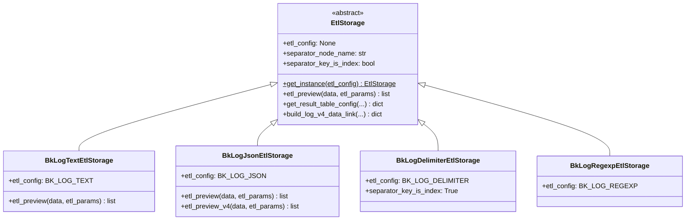
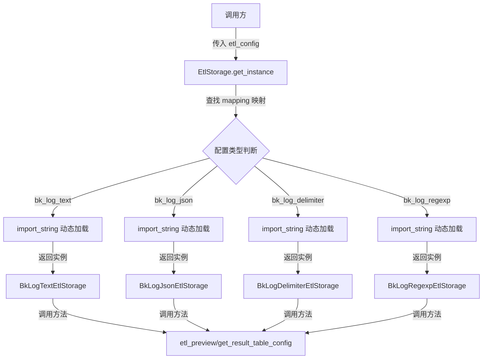
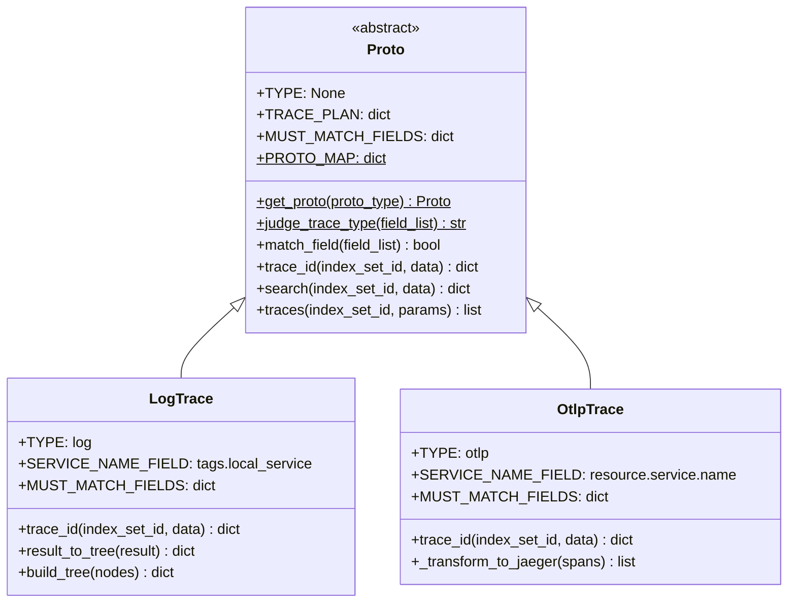
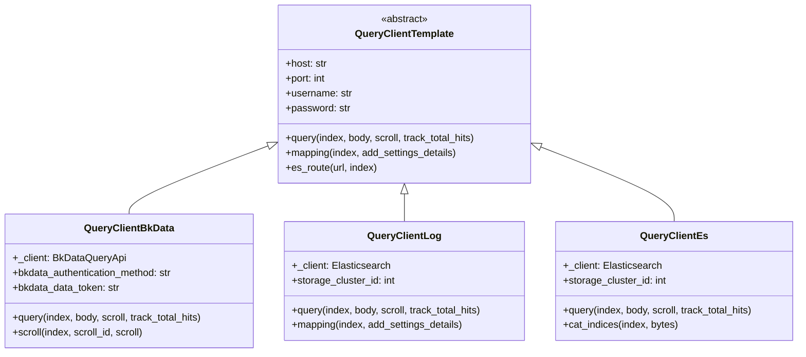
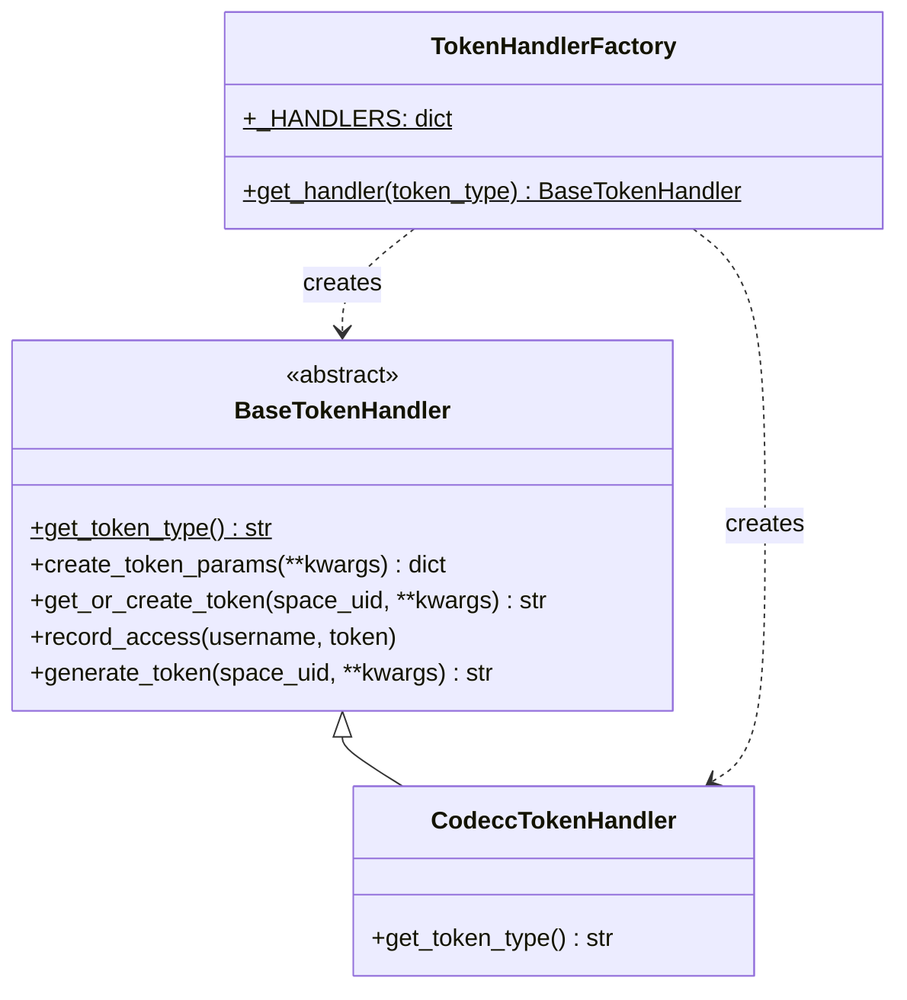
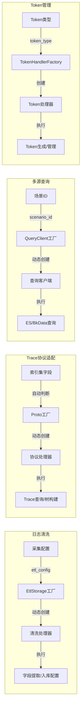

# 工厂模式应用

> 聚焦：BKLOG项目中工厂模式的实现与应用
> 涵盖：EtlStorage、Proto、QueryClient、TokenHandlerFactory 四大工厂类

## 1. 工厂模式概述

工厂模式（Factory Pattern）是创建型设计模式中最常用的模式之一。在BKLOG项目中，工厂模式被广泛应用于以下场景：

- **动态加载策略类**：根据配置类型动态创建对应的处理器实例
- **多场景查询客户端**：根据场景ID创建不同数据源的查询客户端
- **协议适配器**：根据协议类型创建对应的Trace协议处理器
- **Token处理器**：根据Token类型创建对应的Token处理器

## 2. EtlStorage 工厂方法

### 2.1 工厂方法实现（base.py 第63-87行）

```python
# apps/log_databus/handlers/etl_storage/base.py

class EtlStorage:
    """
    清洗入库
    """

    # 子类需重载
    etl_config = None
    separator_node_name = "bk_separator_object"
    path_separator_node_name = "bk_separator_object_path"
    separator_key_is_index = False

    @classmethod
    def get_instance(cls, etl_config=None):
        """工厂方法：根据清洗配置类型动态创建清洗处理器实例"""
        mapping = {
            EtlConfig.BK_LOG_TEXT: "BkLogTextEtlStorage",
            EtlConfig.BK_LOG_JSON: "BkLogJsonEtlStorage",
            EtlConfig.BK_LOG_DELIMITER: "BkLogDelimiterEtlStorage",
            EtlConfig.BK_LOG_REGEXP: "BkLogRegexpEtlStorage",
        }
        try:
            etl_storage = import_string(f"apps.log_databus.handlers.etl_storage.{etl_config}.{mapping.get(etl_config)}")
            return etl_storage()
        except ImportError as error:
            raise NotImplementedError(f"{etl_config} not implement, error: {error}")
```

### 2.2 类继承结构



### 2.3 具体实现类示例

**BkLogTextEtlStorage（bk_log_text.py 第28-43行）**：

```python
class BkLogTextEtlStorage(EtlStorage):
    """
    直接入库 - 不做任何字段解析，将日志原文直接存入log字段
    """

    etl_config = EtlConfig.BK_LOG_TEXT

    def etl_preview(self, data, etl_params) -> list:
        """字段提取预览 - 直接返回原始数据"""
        return data

    def etl_preview_v4(self, data, etl_params) -> list:
        """V4版本预览"""
        return data
```

**BkLogJsonEtlStorage（bk_log_json.py 第29-84行）**：

```python
class BkLogJsonEtlStorage(EtlStorage):
    etl_config = EtlConfig.BK_LOG_JSON

    def etl_preview(self, data, etl_params=None) -> list:
        """字段提取预览 - JSON解析"""
        return preview("json", data)

    def etl_preview_v4(self, data, etl_params=None) -> list:
        """V4版本字段提取预览"""
        api_request = {
            "input": data,
            "rules": [
                {
                    "input_id": "__raw_data",
                    "output_id": "bk_separator_object",
                    "operator": {"type": "json_de"}
                }
            ],
            "filter_rules": []
        }
        api_response = BkDataDatabusApi.databus_clean_debug(api_request)
        # 解析并返回结果...
```

### 2.4 工厂调用流程



## 3. Proto.get_proto() 工厂方法

### 3.1 工厂方法实现（proto.py 第112-138行）

```python
# apps/log_trace/handlers/proto/proto.py

class Proto(ABC):
    """Trace协议抽象基类"""

    TYPE = None
    TRACE_MAPPING = None
    TRACE_PLAN = None
    DISPLAY_FIELDS = None
    TRACE_SIZE = 1000
    SERVICE_NAME_FIELD = None
    OPERATION_NAME_FIELD = None
    TRACE_ID_FIELD = None
    TAGS_FIELD = None
    MUST_MATCH_FIELDS = None

    # 协议映射字典
    PROTO_MAP = {
        TraceProto.LOG.value: "LogTrace",
        TraceProto.OTLP.value: "OtlpTrace"
    }

    @classmethod
    def get_proto(cls, proto_type) -> "Proto":
        """
        工厂方法：根据协议类型动态创建协议处理器实例
        @param proto_type: 协议类型（log/otlp）
        @return: Proto实例
        """
        try:
            proto = import_string(
                "apps.log_trace.handlers.proto.{}.{}".format(proto_type, cls.PROTO_MAP[proto_type])
            )
            return proto()
        except KeyError:
            raise ProtoNotSupport

    @classmethod
    def judge_trace_type(cls, field_list):
        """
        自动判断Trace类型
        @param field_list: 字段列表
        @return: 协议类型或None
        """
        for proto_type in cls.PROTO_MAP.keys():
            if cls.get_proto(proto_type).match_field(field_list):
                return proto_type
        return None
```

### 3.2 类继承结构



### 3.3 协议类型自动判断机制

Proto工厂方法不仅支持直接获取协议实例，还支持自动判断Trace类型：

```python
# proto.py 第114-124行
@classmethod
def judge_trace_type(cls, field_list):
    """
    通过字段匹配自动判断Trace类型
    原理：遍历所有协议类型，检查字段列表是否匹配协议必需字段
    """
    for proto_type in cls.PROTO_MAP.keys():
        if cls.get_proto(proto_type).match_field(field_list):
            return proto_type
    return None
```

**LogTrace 必需字段匹配（log.py 第143-150行）**：

```python
MUST_MATCH_FIELDS = {
    "parentSpanID": ["keyword"],
    "spanID": ["keyword"],
    "traceID": ["keyword"],
    "operationName": ["keyword"],
    "duration": ["long", "int", "float"],
    "startTime": ["date", "long"],
}
```

**OtlpTrace 必需字段匹配（otlp.py 第114-121行）**：

```python
MUST_MATCH_FIELDS = {
    "parent_span_id": ["keyword"],
    "span_name": ["keyword"],
    "trace_id": ["keyword"],
    "span_id": ["keyword"],
    "start_time": ["long", "float"],
    "end_time": ["long", "float"],
}
```

## 4. QueryClient 工厂类

### 4.1 工厂类实现（QueryClient.py 第28-53行）

```python
# apps/log_esquery/esquery/client/QueryClient.py

class QueryClient(object):
    """
    查询客户端工厂类
    根据场景ID创建不同数据源的查询客户端
    """

    def __init__(
        self,
        scenario_id: str,
        storage_cluster_id: int = -1,
        bkdata_authentication_method: str = "",
        bkdata_data_token: str = "",
    ):
        self.scenario_id: str = scenario_id
        self.storage_cluster_id: int = storage_cluster_id
        self.bkdata_authentication_method = bkdata_authentication_method
        self.bkdata_data_token = bkdata_data_token

    def get_instance(self):
        """工厂方法：根据场景ID动态创建查询客户端实例"""
        mapping = {
            Scenario.BKDATA: "apps.log_esquery.esquery.client.QueryClientBkData.QueryClientBkData",
            Scenario.LOG: "apps.log_esquery.esquery.client.QueryClientLog.QueryClientLog",
            Scenario.ES: "apps.log_esquery.esquery.client.QueryClientEs.QueryClientEs",
        }
        client = import_string(mapping.get(self.scenario_id))
        if self.scenario_id in [Scenario.LOG, Scenario.ES]:
            return client(self.storage_cluster_id)
        elif self.scenario_id == Scenario.BKDATA:
            return client(self.bkdata_authentication_method, self.bkdata_data_token)
        return client()
```

### 4.2 类继承结构



### 4.3 使用示例（esquery.py 第215-220行）

```python
# apps/log_esquery/esquery/esquery.py

def query(self):
    """执行查询"""
    # 创建工厂实例并获取对应的客户端
    client = QueryClient(
        scenario_id,
        storage_cluster_id=storage_cluster_id,
        bkdata_authentication_method=bkdata_authentication_method,
        bkdata_data_token=bkdata_data_token,
    ).get_instance()

    # 使用客户端执行查询
    result = client.query(indices, body, scroll=scroll, track_total_hits=track_total_hits)
    return result
```

### 4.4 QueryClientTemplate 抽象基类（QueryClientTemplate.py 第33-42行）

```python
class QueryClientTemplate(object):
    """查询客户端模板基类，定义统一接口"""

    def __init__(self):
        self.host: str = ""
        self.port: int = -1
        self.username: str = ""
        self.password: str = ""
        self._active: bool = False

    def query(self, index: str, body: Dict[str, Any], scroll=None, track_total_hits=False):
        """执行查询 - 子类必须实现"""
        raise NotImplementedError()

    def mapping(self, index: str, add_settings_details: bool = False) -> Dict:
        """获取映射 - 子类必须实现"""
        raise NotImplementedError()
```

## 5. TokenHandlerFactory 工厂类

### 5.1 工厂类实现（token.py 第11-90行）

```python
# apps/log_commons/token.py

class BaseTokenHandler(ABC):
    """Token处理器抽象基类"""

    @abstractmethod
    def get_token_type(self) -> str:
        """获取token类型"""
        raise NotImplementedError

    def get_or_create_token(self, space_uid: str, **kwargs) -> str:
        """获取或创建token"""
        username = get_request_username()
        token_params = self.create_token_params(**kwargs)

        # 查找现有令牌
        token_obj = ApiAuthToken.objects.filter(
            space_uid=space_uid,
            type=self.get_token_type(),
            params__contains=token_params,
            created_by=username,
        ).first()

        if token_obj:
            return token_obj.token

        # 创建新 token
        token_obj = ApiAuthToken.objects.create(
            space_uid=space_uid,
            type=self.get_token_type(),
            params=token_params,
            created_by=username,
        )
        return token_obj.token

    def generate_token(self, space_uid: str, **kwargs) -> str:
        """生成token的完整流程"""
        username = get_request_username()
        token = self.get_or_create_token(space_uid, **kwargs)
        self.record_access(username, token)
        return token


class CodeccTokenHandler(BaseTokenHandler):
    """CodeCC Token处理器"""

    def get_token_type(self) -> str:
        return ApiTokenAuthType.CODECC.value


class TokenHandlerFactory:
    """Token处理器工厂类"""

    # 处理器注册表
    _HANDLERS = {
        ApiTokenAuthType.CODECC.value: CodeccTokenHandler,
    }

    @classmethod
    def get_handler(cls, token_type: str) -> BaseTokenHandler:
        """
        工厂方法：根据token类型获取对应的处理器实例
        @param token_type: token类型
        @return: BaseTokenHandler实例
        """
        handler_class = cls._HANDLERS.get(token_type)
        if not handler_class:
            supported_types = list(cls._HANDLERS.keys())
            raise ValueError(
                f"Unsupported token type: {token_type}. Supported types: {supported_types}"
            )

        return handler_class()
```

### 5.2 类结构图



## 6. 工厂模式设计特点总结

### 6.1 实现方式对比

| 工厂类 | 实现方式 | 动态加载 | 参数化创建 | 特点 |
|-------|---------|---------|-----------|------|
| EtlStorage | 类方法工厂 | import_string | etl_config | 模块级动态加载，类名映射 |
| Proto | 类方法工厂 | import_string | proto_type | 自动判断能力，协议适配 |
| QueryClient | 实例方法工厂 | import_string | scenario_id + 其他参数 | 多参数差异化创建 |
| TokenHandlerFactory | 注册表工厂 | 预注册 | token_type | 静态注册表，类型校验 |

### 6.2 核心设计要点

**1. 统一接口定义**

所有工厂创建的产品都继承自抽象基类，确保接口一致性：

```python
# 清洗处理器统一接口
def etl_preview(self, data, etl_params) -> list
def get_result_table_config(self, fields, etl_params, built_in_config, ...) -> dict

# 查询客户端统一接口
def query(self, index, body, scroll, track_total_hits)
def mapping(self, index, add_settings_details)

# Token处理器统一接口
def get_token_type(self) -> str
def generate_token(self, space_uid, **kwargs) -> str
```

**2. 动态加载机制**

使用 Django 的 `import_string` 实现动态类加载：

```python
# 动态加载路径构建
etl_storage = import_string(
    f"apps.log_databus.handlers.etl_storage.{etl_config}.{mapping.get(etl_config)}"
)

# 优势：
# - 避免循环依赖
# - 按需加载，减少内存占用
# - 扩展性强，新增类型只需添加模块
```

**3. 映射字典管理**

工厂内部维护类型到类名/路径的映射：

```python
# EtlStorage映射
mapping = {
    EtlConfig.BK_LOG_TEXT: "BkLogTextEtlStorage",
    EtlConfig.BK_LOG_JSON: "BkLogJsonEtlStorage",
    ...
}

# QueryClient映射
mapping = {
    Scenario.BKDATA: "apps.log_esquery.esquery.client.QueryClientBkData.QueryClientBkData",
    Scenario.LOG: "apps.log_esquery.esquery.client.QueryClientLog.QueryClientLog",
    ...
}
```

**4. 异常处理机制**

工厂方法统一处理未实现类型的异常：

```python
try:
    instance = import_string(path)
    return instance()
except ImportError:
    raise NotImplementedError(f"{type} not implement")
except KeyError:
    raise ProtoNotSupport
```

### 6.3 扩展指南

**添加新的清洗类型**：

1. 在 `constants.py` 定义新常量
2. 在 `etl_storage/` 目录创建新模块文件
3. 实现继承 `EtlStorage` 的具体类
4. 在 `mapping` 字典添加映射

```python
# 1. constants.py
class EtlConfig:
    BK_LOG_CUSTOM = "bk_log_custom"

# 2. etl_storage/bk_log_custom.py
class BkLogCustomEtlStorage(EtlStorage):
    etl_config = EtlConfig.BK_LOG_CUSTOM
    def etl_preview(self, data, etl_params):
        # 自定义实现...

# 3. base.py mapping更新
mapping = {
    ...
    EtlConfig.BK_LOG_CUSTOM: "BkLogCustomEtlStorage",
}
```

## 7. 应用场景总结



---

**文档版本**: v1.0
**生成日期**: 2026-04-30
**源码路径**:
- `apps/log_databus/handlers/etl_storage/base.py`
- `apps/log_trace/handlers/proto/proto.py`
- `apps/log_esquery/esquery/client/QueryClient.py`
- `apps/log_commons/token.py`