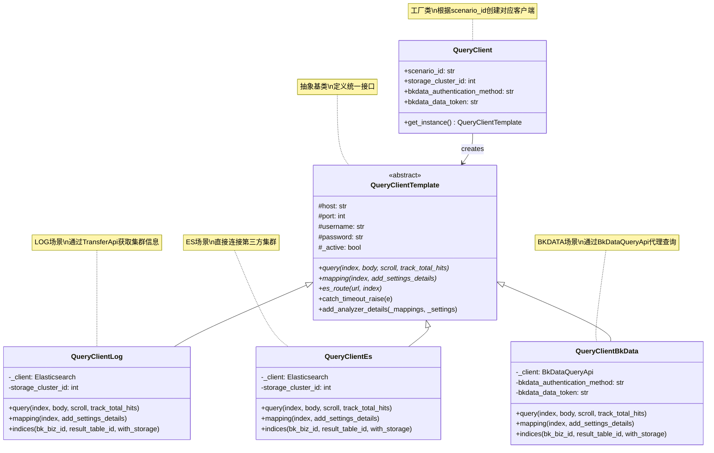
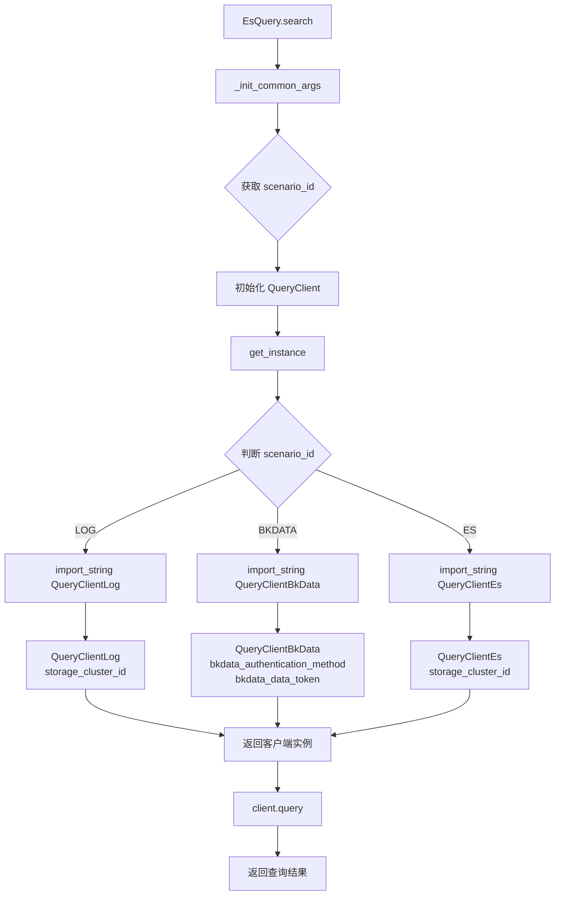
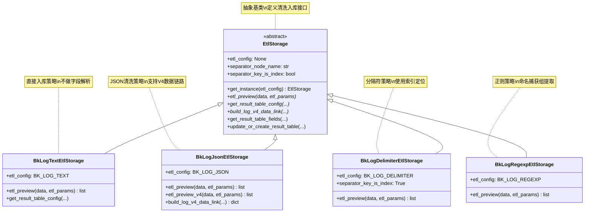
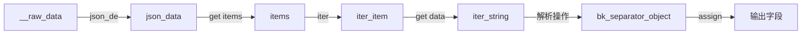
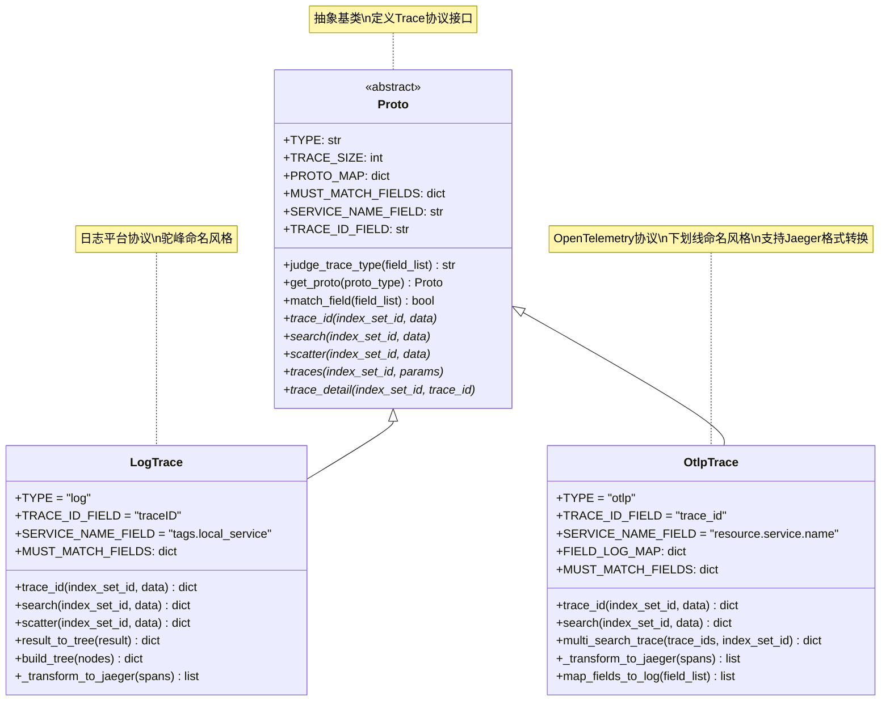
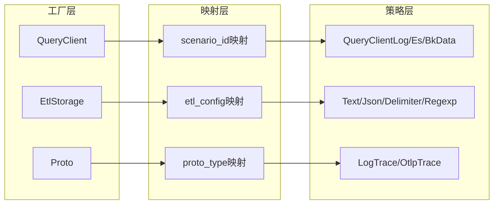

# BKLOG 策略模式应用深度解析

> 聚焦：BKLOG系统中三大策略模式实现场景
> 涵盖：QueryClient、EtlStorage、Proto策略模式的设计与实践

## 一、策略模式概述

策略模式（Strategy Pattern）是一种行为型设计模式，它定义了一系列算法，将每个算法封装起来，并使它们可以相互替换。BKLOG系统在多个核心模块中应用了策略模式，实现了业务逻辑与具体实现的解耦。

### 1.1 BKLOG中的策略模式应用场景

| 模块 | 策略工厂 | 策略数量 | 应用场景 |
|------|---------|---------|---------|
| QueryClient | `QueryClient.get_instance()` | 3种 | ES查询多数据源场景 |
| EtlStorage | `EtlStorage.get_instance()` | 4种 | 日志清洗ETL处理 |
| Proto | `Proto.get_proto()` | 2种 | Trace协议解析 |

## 二、QueryClient 策略模式（ES查询场景）

### 2.1 场景说明

BKLOG日志平台支持三种不同的日志接入场景，每种场景对应不同的数据来源和查询方式：

| 场景标识 | 场景名称 | 数据来源 | 查询方式 | 认证方式 |
|---------|---------|---------|---------|---------|
| `log` | 蓝鲸采集 | 蓝鲸日志采集系统 | 直接连接ES集群 | 集群账号密码 |
| `bkdata` | 数据平台 | BKBase数据平台 | BkDataQueryApi代理查询 | Token认证 |
| `es` | 第三方ES | 外部第三方ES集群 | 直接连接ES集群 | 集群账号密码 |

### 2.2 类结构设计



### 2.3 工厂类实现

**源码路径**: `apps/log_esquery/esquery/client/QueryClient.py`

```python
# 第28-53行
class QueryClient(object):  # pylint: disable=invalid-name
    def __init__(
        self,
        scenario_id: str,
        storage_cluster_id: int = -1,
        bkdata_authentication_method: str = "",
        bkdata_data_token: str = "",
    ):
        self.scenario_id: str = scenario_id
        self.storage_cluster_id: int = storage_cluster_id
        self.bkdata_authentication_method = bkdata_authentication_method
        self.bkdata_data_token = bkdata_data_token

    def get_instance(self):
        # 策略映射表：scenario_id -> 策略类路径
        mapping = {
            Scenario.BKDATA: "apps.log_esquery.esquery.client.QueryClientBkData.QueryClientBkData",
            Scenario.LOG: "apps.log_esquery.esquery.client.QueryClientLog.QueryClientLog",
            Scenario.ES: "apps.log_esquery.esquery.client.QueryClientEs.QueryClientEs",
        }
        # 动态导入策略类
        client = import_string(mapping.get(self.scenario_id))
        # 差异化实例化：根据场景类型传递不同构造参数
        if self.scenario_id in [Scenario.LOG, Scenario.ES]:
            return client(self.storage_cluster_id)
        elif self.scenario_id == Scenario.BKDATA:
            return client(self.bkdata_authentication_method, self.bkdata_data_token)
        return client()
```

### 2.4 策略选择流程



### 2.5 策略差异对比

| 方法 | QueryClientLog | QueryClientEs | QueryClientBkData |
|-----|---------------|---------------|-------------------|
| **连接方式** | 从索引名解析集群信息 | 使用 `storage_cluster_id` | 使用 BKData API |
| **query** | ES Client 直接查询 | ES Client 直接查询 | SQL API 查询 |
| **mapping** | ES Client API | ES Client API | SQL API + 过滤处理 |
| **indices** | 从 CollectorConfig 模型获取 | ES Client `indices.get()` | BkDataMetaApi 获取 |
| **认证方式** | 用户名/密码 | 用户名/密码 | Token/认证方法 |
| **追踪支持** | 无 | 无 | OpenTelemetry |

### 2.6 使用示例

```python
# LOG 场景 - 蓝鲸采集接入
client = QueryClient(scenario_id=Scenario.LOG, storage_cluster_id=123).get_instance()
result = client.query(index="my_index", body={"query": {"match_all": {}}})

# ES 场景 - 直连第三方ES集群
client = QueryClient(scenario_id=Scenario.ES, storage_cluster_id=456).get_instance()
result = client.query(index="external_index", body={"query": {"match_all": {}}})

# BKDATA 场景 - 数据平台查询
client = QueryClient(
    scenario_id=Scenario.BKDATA,
    bkdata_authentication_method="token",
    bkdata_data_token="xxx"
).get_instance()
result = client.query(index="result_table_id", body={"query": {"match_all": {}}})
```

## 三、EtlStorage 策略模式（清洗ETL场景）

### 3.1 四种清洗策略

BKLOG支持四种清洗策略，对应不同的日志格式解析需求：

| 策略名称 | 常量值 | 中文描述 | 适用场景 | 解析方式 |
|---------|--------|---------|---------|---------|
| BK_LOG_TEXT | `bk_log_text` | 直接入库 | 无需解析的原始日志 | 直接存储原文 |
| BK_LOG_JSON | `bk_log_json` | JSON | JSON格式日志 | JSON字段解析 |
| BK_LOG_DELIMITER | `bk_log_delimiter` | 分隔符 | 结构化分隔日志 | 按分隔符切分 |
| BK_LOG_REGEXP | `bk_log_regexp` | 正则 | 复杂格式日志 | 正则表达式提取 |

### 3.2 类结构设计



### 3.3 工厂类实现

**源码路径**: `apps/log_databus/handlers/etl_storage/base.py`

```python
# 第63-87行
class EtlStorage:
    """
    清洗入库
    """

    # 子类需重载
    etl_config = None
    separator_node_name = "bk_separator_object"
    path_separator_node_name = "bk_separator_object_path"
    separator_key_is_index = False

    @classmethod
    def get_instance(cls, etl_config=None):
        # 策略映射表：etl_config -> 策略类名
        mapping = {
            EtlConfig.BK_LOG_TEXT: "BkLogTextEtlStorage",
            EtlConfig.BK_LOG_JSON: "BkLogJsonEtlStorage",
            EtlConfig.BK_LOG_DELIMITER: "BkLogDelimiterEtlStorage",
            EtlConfig.BK_LOG_REGEXP: "BkLogRegexpEtlStorage",
        }
        try:
            # 动态导入：路径为 apps.log_databus.handlers.etl_storage.{etl_config}.{类名}
            etl_storage = import_string(
                f"apps.log_databus.handlers.etl_storage.{etl_config}.{mapping.get(etl_config)}"
            )
            return etl_storage()
        except ImportError as error:
            raise NotImplementedError(f"{etl_config} not implement, error: {error}")
```

### 3.4 V4数据链路设计

V4版本采用 **clean_rules** 规则链设计，数据流转过程：



**规则链核心操作类型**：

| 操作类型 | 说明 | 使用场景 |
|---------|------|---------|
| `json_de` | JSON解析 | 原始数据解析、日志内容解析 |
| `get` | 字段提取 | 提取指定字段值 |
| `iter` | 数组迭代 | 处理items数组中的多条日志 |
| `split_str` | 分隔符切分 | 分隔符清洗策略 |
| `regex` | 正则解析 | 正则清洗策略 |
| `assign` | 字段赋值 | 字段映射和输出 |

### 3.5 JSON清洗策略实现详解

**源码路径**: `apps/log_databus/handlers/etl_storage/bk_log_json.py`

```python
# 第29-84行
class BkLogJsonEtlStorage(EtlStorage):
    etl_config = EtlConfig.BK_LOG_JSON

    def etl_preview(self, data, etl_params=None) -> list:
        """字段提取预览 - JSON解析"""
        return preview("json", data)

    def etl_preview_v4(self, data, etl_params=None) -> list:
        """V4版本预览 - 调用BkDataDatabusApi"""
        api_request = {
            "input": data,
            "rules": [{
                "input_id": "__raw_data",
                "output_id": "bk_separator_object",
                "operator": {"type": "json_de"}
            }]
        }
        api_response = BkDataDatabusApi.databus_clean_debug(api_request)
        # 解析并返回结果...

    def build_log_v4_data_link(self, fields: list, etl_params: dict, built_in_config: dict) -> dict:
        """构建V4 clean_rules配置"""
        rules = []

        # 1. JSON解析阶段（原始数据 -> json_data）
        rules.append({
            "input_id": "__raw_data",
            "output_id": "json_data",
            "operator": {"type": "json_de", "error_strategy": "drop"}
        })

        # 2. 提取内置字段
        rules.extend(self._build_built_in_fields_v4(built_in_config))

        # 3. 提取items数组并迭代
        rules.extend([
            {"input_id": "json_data", "output_id": "items", "operator": {"type": "get", ...}},
            {"input_id": "items", "output_id": "iter_item", "operator": {"type": "iter"}},
        ])

        # 4. 字段映射
        for field in fields:
            if field.get("is_delete"):
                continue
            rules.append({
                "input_id": "bk_separator_object",
                "output_id": field["field_name"],
                "operator": {"type": "assign", ...}
            })

        return {"clean_rules": rules, ...}
```

### 3.6 清洗策略对比

| 特性 | TEXT | JSON | DELIMITER | REGEXP |
|-----|------|------|-----------|--------|
| **字段解析** | 无 | JSON解析 | 分隔符切分 | 正则匹配 |
| **字段定位** | - | 字段名 | 索引位置 | 命名捕获组 |
| **V4支持** | 部分 | 完整 | 完整 | 完整 |
| **适用日志** | 原文存储 | JSON日志 | CSV/TAB日志 | 自定义格式 |
| **预览方法** | 直接返回 | preview("json") | split解析 | re.match |

## 四、Proto 策略模式（Trace协议场景）

### 4.1 两种Trace协议

BKLOG支持两种分布式链路追踪协议：

| 协议标识 | 协议名称 | 数据来源 | 字段命名风格 |
|---------|---------|---------|-------------|
| `log` | LogTrace | 日志平台协议 | 驼峰命名（traceID） |
| `otlp` | OtlpTrace | OpenTelemetry协议 | 下划线命名（trace_id） |

### 4.2 类结构设计



### 4.3 工厂类与协议识别

**源码路径**: `apps/log_trace/handlers/proto/proto.py`

```python
# 第35-138行
class Proto(ABC):
    TYPE = None
    TRACE_SIZE = 1000
    SERVICE_NAME_FIELD = None
    TRACE_ID_FIELD = None
    TAGS_FIELD = None

    # 协议映射表
    PROTO_MAP = {
        TraceProto.LOG.value: "LogTrace",
        TraceProto.OTLP.value: "OtlpTrace"
    }

    @classmethod
    def judge_trace_type(cls, field_list):
        """根据字段列表自动判断Trace协议类型"""
        for proto_type in cls.PROTO_MAP.keys():
            if cls.get_proto(proto_type).match_field(field_list):
                return proto_type
        return None

    @classmethod
    def get_proto(cls, proto_type) -> "Proto":
        """动态加载具体协议实现类"""
        try:
            proto = import_string(
                "apps.log_trace.handlers.proto.{}.{}".format(
                    proto_type, cls.PROTO_MAP[proto_type]
                )
            )
            return proto()
        except KeyError:
            raise ProtoNotSupport

    def match_field(self, field_list) -> bool:
        """字段匹配检查 - 验证必须字段是否存在"""
        if not self.MUST_MATCH_FIELDS:
            return False
        must_fields_len = len(self.MUST_MATCH_FIELDS.keys())
        record = []
        for field in field_list:
            field_name = field.get("field_name", "")
            field_type = field.get("field_type", "")
            if field_type in self.MUST_MATCH_FIELDS.get(field_name, []):
                record.append(field_name)
        return len(record) == must_fields_len
```

### 4.4 LogTrace协议实现

**源码路径**: `apps/log_trace/handlers/proto/log.py`

```python
# 第42-151行
class LogTrace(Proto):
    TAGS_FIELD = "tags"
    SERVICE_NAME_FIELD = "tags.local_service"
    TRACE_ID_FIELD = "traceID"
    TYPE = TraceProto.LOG.value

    # 必须匹配的字段定义（用于协议识别）
    MUST_MATCH_FIELDS = {
        "parentSpanID": ["keyword"],
        "spanID": ["keyword"],
        "traceID": ["keyword"],
        "operationName": ["keyword"],
        "duration": ["long", "int", "float"],
        "startTime": ["date", "long"],
    }

    def trace_id(self, index_set_id: int, data: dict) -> dict:
        """TraceID搜索，生成时间线甘特图"""
        start_time = arrow.get(data.get("startTime")[0:10]).shift(days=-1)
        query_data = {
            "addition": [
                {"key": "traceID", "method": "is", "value": str(data["traceID"]), ...}
            ],
            "start_time": start_time.strftime("%Y-%m-%d %H:%M:%S"),
            "end_time": start_time.shift(days=2).strftime("%Y-%m-%d %H:%M:%S"),
            "search_type": "trace_detail",
            "size": self.TRACE_SIZE,
        }
        search_handler = SearchHandlerEsquery(index_set_id, query_data)
        result = search_handler.search(search_type=None)
        result["tree"] = self.result_to_tree(result)  # 构建Span树
        return result
```

### 4.5 OtlpTrace协议实现

**源码路径**: `apps/log_trace/handlers/proto/otlp.py`

```python
# 第45-122行
class OtlpTrace(Proto):
    TYPE = TraceProto.OTLP.value
    SERVICE_NAME_FIELD = "resource.service.name"
    TRACE_ID_FIELD = "trace_id"
    TAGS_FIELD = "attributes"

    # 字段映射：OTLP -> Jaeger格式
    FIELD_LOG_MAP = {
        "trace_id": "traceID",
        "span_id": "spanID",
        "span_name": "operationName",
        "parent_span_id": "parentSpanID",
        "start_time": "startTime",
    }

    # 必须匹配的字段定义
    MUST_MATCH_FIELDS = {
        "parent_span_id": ["keyword"],
        "span_name": ["keyword"],
        "trace_id": ["keyword"],
        "span_id": ["keyword"],
        "start_time": ["long", "float"],
        "end_time": ["long", "float"],
    }

    def _transform_to_jaeger(self, spans):
        """将OTLP数据转换为Jaeger格式（兼容前端展示）"""
        jaeger_traces = defaultdict(lambda: {"spans": [], "traceID": ""})
        for span in spans:
            trace_id = span["trace_id"]
            jaeger_traces[trace_id]["spans"].append({
                "traceID": trace_id,
                "spanID": span["span_id"],
                "duration": span["elapsed_time"],
                "operationName": span["span_name"],
                "startTime": span["start_time"],
                "tags": self._transform_to_tags(span["attributes"]),
                ...
            })
        return list(jaeger_traces.values())
```

### 4.6 协议差异对比

| 特性 | LogTrace | OtlpTrace |
|-----|----------|-----------|
| **字段命名** | 驼峰（traceID） | 下划线（trace_id） |
| **服务名字段** | tags.local_service | resource.service.name |
| **标签字段** | tags | attributes |
| **时间字段** | startTime | start_time |
| **Span树构建** | build_tree | build_tree |
| **Jaeger转换** | 直接映射 | 需要处理processes |
| **多线程查询** | 否 | multi_search_trace |

## 五、策略模式设计要点总结

### 5.1 统一的工厂模式结构

BKLOG中的三种策略模式都遵循相同的工厂模式结构：



### 5.2 核心设计模式要点

1. **抽象基类定义接口**
   - 定义统一的方法签名（`query`、`etl_preview`、`trace_id`）
   - 提供公共工具方法（`catch_timeout_raise`、`get_result_table_fields`）

2. **工厂类动态创建**
   - 使用 `import_string` 实现按需加载
   - 映射字典维护策略标识与类路径的关系
   - 差异化实例化处理不同构造参数

3. **策略类差异化实现**
   - 每个策略类只关注一种场景的实现
   - 通过类属性标识策略类型（`etl_config`、`TYPE`）
   - 必须字段匹配实现协议自动识别

### 5.3 开闭原则体现

**对扩展开放**：
- 新增场景只需创建新策略类
- 在映射字典添加新映射关系
- 无需修改已有代码

**对修改关闭**：
- 高层模块依赖抽象接口
- 已有策略类无需修改
- 工厂类逻辑保持稳定

### 5.4 扩展新策略步骤

以新增清洗策略为例：

1. **定义常量**：在 `constants.py` 中添加新的 EtlConfig 常量
2. **创建模块**：在 `etl_storage/` 目录下创建新模块文件
3. **实现策略类**：继承 `EtlStorage`，实现所有抽象方法
4. **注册工厂**：在 `EtlStorage.get_instance()` 的映射字典中添加映射

```python
# 1. 定义常量
class EtlConfig:
    BK_LOG_CUSTOM = "bk_log_custom"  # 新增策略

# 2. 创建模块 apps/log_databus/handlers/etl_storage/bk_log_custom.py
class BkLogCustomEtlStorage(EtlStorage):
    etl_config = EtlConfig.BK_LOG_CUSTOM
    def etl_preview(self, data, etl_params): ...

# 3. 注册工厂
mapping = {
    EtlConfig.BK_LOG_CUSTOM: "BkLogCustomEtlStorage",
    ...
}
```

## 六、策略模式应用价值

### 6.1 架构价值

| 价值维度 | 具体收益 |
|---------|---------|
| **解耦** | 业务逻辑与具体实现分离 |
| **可维护** | 每个策略类职责单一，易于维护 |
| **可测试** | 策略类独立测试，降低测试复杂度 |
| **可扩展** | 新增场景无需修改已有代码 |

### 6.2 实际应用场景总结

| 场景 | 痛点 | 策略模式解决 |
|-----|------|-------------|
| 多数据源查询 | 不同ES集群连接方式不同 | 统一接口，差异化实现 |
| 多格式清洗 | 日志格式多样，解析逻辑不同 | 策略工厂动态选择 |
| 多协议解析 | Trace协议字段命名不一致 | 自动识别+统一转换 |

---

**文档版本**: v1.0
**生成日期**: 2026-04-30
**相关源码路径**:
- `apps/log_esquery/esquery/client/QueryClient.py` (第28-53行)
- `apps/log_esquery/esquery/client/QueryClientTemplate.py` (第33-104行)
- `apps/log_databus/handlers/etl_storage/base.py` (第63-87行)
- `apps/log_databus/handlers/etl_storage/bk_log_json.py` (第29-245行)
- `apps/log_trace/handlers/proto/proto.py` (第35-138行)
- `apps/log_trace/handlers/proto/log.py` (第42-401行)
- `apps/log_trace/handlers/proto/otlp.py` (第45-453行)
- `apps/log_search/models.py` (Scenario定义)
- `apps/log_databus/constants.py` (EtlConfig定义)
- `apps/log_trace/constants.py` (TraceProto定义)