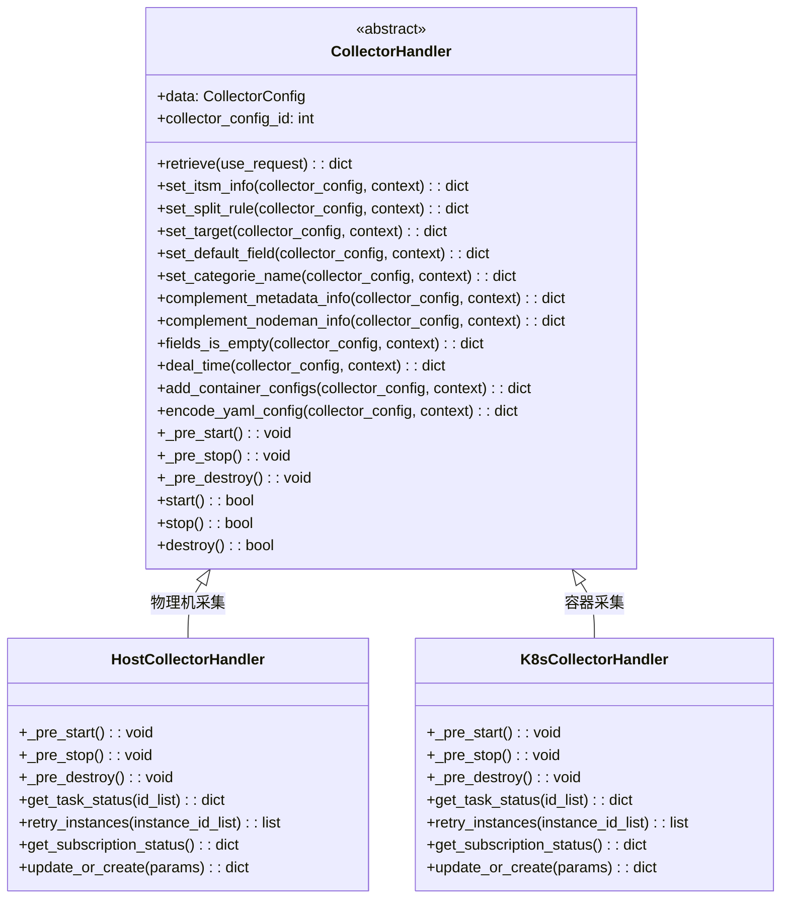
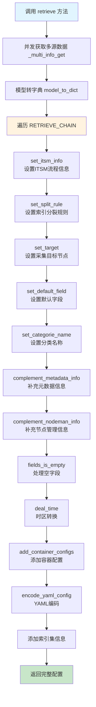
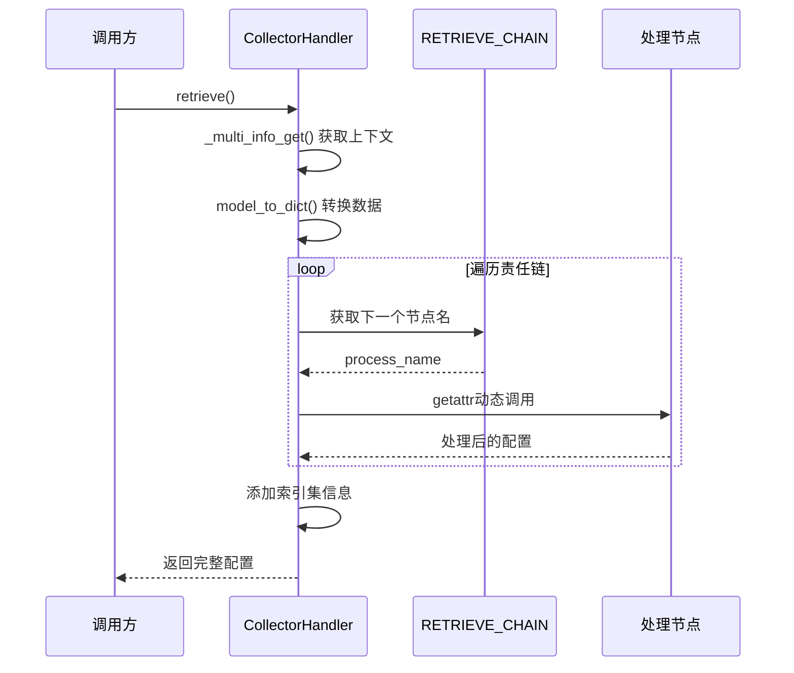

# 责任链模式应用

## 概述

BKLOG项目在采集器管理模块中应用了责任链模式（Chain of Responsibility Pattern），通过`RETRIEVE_CHAIN`实现采集配置数据的链式处理。该设计模式将数据处理流程解耦为多个独立的处理节点，每个节点专注于单一职责，支持灵活的流程编排和扩展。

## 核心实现

### 责任链定义

责任链配置定义在 `apps/log_databus/constants.py` 中：

```python
# 源文件: apps/log_databus/constants.py
# 行号: 736-748

RETRIEVE_CHAIN = [
    "set_itsm_info",           # 设置ITSM流程信息
    "set_split_rule",          # 设置索引分裂规则
    "set_target",              # 设置采集目标节点
    "set_default_field",       # 设置默认字段
    "set_categorie_name",      # 设置分类名称
    "complement_metadata_info", # 补充元数据信息
    "complement_nodeman_info",  # 补充节点管理信息
    "fields_is_empty",         # 处理空字段场景
    "deal_time",               # 时区转换处理
    "add_container_configs",   # 添加容器配置
    "encode_yaml_config",      # YAML配置编码
]
```

### 责任链执行入口

责任链的执行入口位于 `CollectorHandler.retrieve()` 方法：

```python
# 源文件: apps/log_databus/handlers/collector/base.py
# 行号: 482-502

def retrieve(self, use_request=True):
    """
    获取采集配置
    @param use_request:
    @return:
    """
    # 1. 并发获取多源数据
    context = self._multi_info_get(use_request)

    # 2. 将模型对象转换为字典
    collector_config = model_to_dict(self.data)

    # 3. 链式调用处理节点
    for process in RETRIEVE_CHAIN:
        collector_config = getattr(self, process, lambda x, y: x)(collector_config, context)
        logger.info(f"[databus retrieve] process => [{process}] collector_config => [{collector_config}]")

    # 4. 添加索引集相关信息
    log_index_set_obj = LogIndexSet.objects.filter(collector_config_id=self.collector_config_id).first()
    if log_index_set_obj:
        collector_config.update(
            {"sort_fields": log_index_set_obj.sort_fields, "target_fields": log_index_set_obj.target_fields}
        )
        parent_index_set_ids = log_index_set_obj.get_parent_index_set_ids()
        collector_config.update({"parent_index_set_ids": parent_index_set_ids})
    return collector_config
```

## 处理节点详解

### 1. set_itsm_info - ITSM流程信息设置

```python
# 源文件: apps/log_databus/handlers/collector/base.py
# 行号: 198-216

def set_itsm_info(self, collector_config, context):
    """
    设置ITSM审批流程状态信息
    """
    from apps.log_databus.handlers.itsm import ItsmHandler

    itsm_info = ItsmHandler().collect_itsm_status(collect_config_id=collector_config["collector_config_id"])
    collector_config.update(
        {
            "iframe_ticket_url": itsm_info["iframe_ticket_url"],
            "ticket_url": itsm_info["ticket_url"],
            "itsm_ticket_status": itsm_info["collect_itsm_status"],
            "itsm_ticket_status_display": itsm_info["collect_itsm_status_display"],
        }
    )
    return collector_config
```

**职责**: 查询并补充ITSM流程审批状态，包括审批链接和当前状态。

### 2. set_split_rule - 索引分裂规则设置

```python
# 源文件: apps/log_databus/handlers/collector/base.py
# 行号: 237-248

def set_split_rule(self, collector_config, context):
    """
    设置ES索引分裂规则说明
    """
    collector_config["index_split_rule"] = "--"
    if self.data.table_id and collector_config["storage_shards_size"]:
        slice_size = collector_config["storage_shards_nums"] * collector_config["storage_shards_size"]
        collector_config["index_split_rule"] = _("ES索引主分片大小达到{}G后分裂").format(slice_size)
    return collector_config
```

**职责**: 根据分片配置计算并生成索引分裂规则说明文本。

### 3. set_target - 采集目标节点设置

```python
# 源文件: apps/log_databus/handlers/collector/base.py
# 行号: 250-269

def set_target(self, collector_config: dict, context):
    """
    解析并设置采集目标节点信息
    """
    if collector_config["target_node_type"] == "INSTANCE":
        collector_config["target"] = collector_config.get("target_nodes", [])
        return collector_config

    nodes = collector_config.get("target_nodes", [])
    bk_module_inst_ids = self._get_ids("module", nodes)
    bk_set_inst_ids = self._get_ids("set", nodes)
    collector_config["target"] = []

    biz_handler = BizHandler(bk_biz_id=collector_config["bk_biz_id"])
    result_module = biz_handler.get_modules_info(bk_module_inst_ids)
    result_set = biz_handler.get_sets_info(bk_set_inst_ids)
    collector_config["target"].extend(result_module)
    collector_config["target"].extend(result_set)
    return collector_config
```

**职责**: 根据节点类型（INSTANCE/TOPO）解析并补充采集目标的详细信息。

### 4. set_default_field - 默认字段设置

```python
# 源文件: apps/log_databus/handlers/collector/base.py
# 行号: 218-235

def set_default_field(self, collector_config, context):
    """
    设置采集配置的默认字段信息
    """
    collector_config.update(
        {
            "collector_scenario_name": self.data.get_collector_scenario_id_display(),
            "bk_data_name": self.data.bk_data_name,
            "storage_cluster_id": None,
            "retention": None,
            "etl_params": {},
            "fields": [],
        }
    )
    return collector_config
```

**职责**: 初始化采集配置的默认字段，为后续节点提供基础数据结构。

### 5. complement_metadata_info - 元数据信息补充

```python
# 源文件: apps/log_databus/handlers/collector/base.py
# 行号: 282-321

def complement_metadata_info(self, collector_config, context):
    """
    补全保存在metadata结果表中的配置信息
    """
    result = context
    if not self.data.table_id:
        collector_config.update(
            {"table_id_prefix": self._build_bk_table_id(self.data.bk_biz_id, ""), "table_id": ""}
        )
        return collector_config

    table_id_prefix, table_id = self.data.table_id.split(".")
    collector_config.update({"table_id_prefix": table_id_prefix + "_", "table_id": table_id})

    if "result_table_config" in result and "result_table_storage" in result:
        if self.data.table_id in result["result_table_storage"]:
            self.data.etl_config = EtlStorage.get_etl_config(
                result["result_table_config"], default=self.data.etl_config
            )
            etl_storage = EtlStorage.get_instance(etl_config=self.data.etl_config)
            collector_config.update(
                etl_storage.parse_result_table_config(
                    result_table_config=result["result_table_config"],
                    result_table_storage=result["result_table_storage"][self.data.table_id],
                    fields_dict=self.get_fields_dict(self.data.collector_config_id),
                )
            )
            # 补充ES集群端口和域名
            storage_cluster_id = collector_config.get("storage_cluster_id", "")
            cluster_config = IndexSetHandler.get_cluster_map().get(storage_cluster_id, {})
            collector_config.update(
                {
                    "storage_cluster_port": cluster_config.get("cluster_port", ""),
                    "storage_cluster_domain_name": cluster_config.get("cluster_domain_name", ""),
                }
            )
    return collector_config
```

**职责**: 从Transfer API获取结果表配置，补充存储集群信息、ETL配置、字段定义等核心元数据。

### 6. complement_nodeman_info - 节点管理信息补充

```python
# 源文件: apps/log_databus/handlers/collector/base.py
# 行号: 323-342

def complement_nodeman_info(self, collector_config, context):
    """
    补全保存在节点管理的订阅配置
    """
    result = context
    if self.data.subscription_id and "subscription_config" in result:
        if not result["subscription_config"]:
            raise SubscriptionInfoNotFoundException()

        subscription_config = result["subscription_config"][0]
        collector_scenario = CollectorScenario.get_instance(collector_scenario_id=self.data.collector_scenario_id)
        params = collector_scenario.parse_steps(subscription_config["steps"])
        collector_config.update({"params": params})

        data_encoding = params.get("encoding")
        if data_encoding:
            collector_config.update({"data_encoding": data_encoding.upper()})
    return collector_config
```

**职责**: 从节点管理API获取订阅配置，解析采集参数并补充到配置中。

### 7. fields_is_empty - 空字段处理

```python
# 源文件: apps/log_databus/handlers/collector/base.py
# 行号: 344-360

def fields_is_empty(self, collector_config, context):
    """
    如果数据未入库，则fields为空，直接使用默认标准字段返回
    """
    if not collector_config["fields"]:
        etl_storage = EtlStorage.get_instance(EtlConfig.BK_LOG_TEXT)
        collector_scenario = CollectorScenario.get_instance(collector_scenario_id=self.data.collector_scenario_id)
        built_in_config = collector_scenario.get_built_in_config()
        result_table_config = etl_storage.get_result_table_config(
            fields=None, etl_params=None, built_in_config=built_in_config
        )
        etl_config = etl_storage.parse_result_table_config(result_table_config)
        collector_config["fields"] = etl_config.get("fields", [])
    return collector_config
```

**职责**: 当字段列表为空时，使用采集场景的内置配置生成默认标准字段。

### 8. deal_time - 时区转换处理

```python
# 源文件: apps/log_databus/handlers/collector/base.py
# 行号: 362-372

def deal_time(self, collector_config, context):
    """
    对collector_config进行时区转换
    """
    time_zone = get_local_param("time_zone", settings.TIME_ZONE)
    collector_config["updated_at"] = format_user_time_zone(collector_config["updated_at"], time_zone=time_zone)
    collector_config["created_at"] = format_user_time_zone(collector_config["created_at"], time_zone=time_zone)
    return collector_config
```

**职责**: 将创建时间和更新时间转换为用户所在时区的格式。

### 9. add_container_configs - 容器配置添加

```python
# 源文件: apps/log_databus/handlers/collector/base.py
# 行号: 374-389

def add_container_configs(self, collector_config, context):
    """
    添加容器采集配置（仅容器环境）
    """
    if not self.data.is_container_environment:
        return collector_config

    container_configs = []
    for config in ContainerCollectorConfig.objects.filter(collector_config_id=self.collector_config_id):
        container_configs.append(model_to_dict(config))

    collector_config["configs"] = container_configs
    return collector_config
```

**职责**: 仅在容器环境下，查询并添加容器采集配置列表。

### 10. encode_yaml_config - YAML配置编码

```python
# 源文件: apps/log_databus/handlers/collector/base.py
# 行号: 391-401

def encode_yaml_config(self, collector_config, context):
    """
    对YAML配置进行Base64编码
    """
    if not collector_config["yaml_config"]:
        return collector_config
    collector_config["yaml_config"] = base64.b64encode(collector_config["yaml_config"].encode("utf-8"))
    return collector_config
```

**职责**: 将YAML配置字符串进行Base64编码，便于前端传输和展示。

## 类结构设计



## 链式调用流程



## 动态方法调用机制

责任链采用Python的反射机制实现动态方法调用：

```python
# 核心调用逻辑
# 源文件: apps/log_databus/handlers/collector/base.py
# 行号: 490-491

for process in RETRIEVE_CHAIN:
    collector_config = getattr(self, process, lambda x, y: x)(collector_config, context)
```

**机制解析**:

| 组成部分 | 说明 |
|---------|------|
| `getattr(self, process, ...)` | 动态获取实例方法 |
| `lambda x, y: x` | 默认处理器：若方法不存在则返回原数据 |
| `(collector_config, context)` | 传递配置字典和上下文数据 |

这种设计提供了以下优势：

1. **容错性**: 方法不存在时不会报错，而是返回原始数据
2. **可扩展性**: 新增处理节点只需添加方法并在`RETRIEVE_CHAIN`中注册
3. **可维护性**: 处理逻辑解耦，每个节点职责单一

## 处理节点注册机制

新增处理节点的步骤：

### 步骤1: 定义处理方法

在`CollectorHandler`类中添加新方法：

```python
def new_process_node(self, collector_config, context):
    """
    新处理节点的实现
    @param collector_config: 配置字典（链上传递）
    @param context: 并发获取的上下文数据
    @return: 处理后的配置字典
    """
    # 处理逻辑
    collector_config.update({"new_field": "value"})
    return collector_config
```

### 步骤2: 注册到责任链

在`constants.py`中的`RETRIEVE_CHAIN`列表添加方法名：

```python
RETRIEVE_CHAIN = [
    "set_itsm_info",
    # ... 其他节点
    "new_process_node",  # 新增节点
]
```

### 步骤3: 确定节点顺序

根据业务逻辑确定节点在链中的位置：

- **前置节点**: 数据初始化、默认值设置
- **中间节点**: 数据转换、信息补充
- **后置节点**: 格式化、编码输出

## 数据流转示意



## 设计优势

### 1. 单一职责原则

每个处理节点只关注一个特定的数据处理任务，代码职责清晰：

| 节点 | 职责范围 |
|-----|---------|
| set_itsm_info | ITSM审批状态 |
| set_split_rule | 索引分裂规则 |
| set_target | 目标节点解析 |
| deal_time | 时间格式转换 |

### 2. 开闭原则

- **对扩展开放**: 新增节点只需添加方法和注册
- **对修改封闭**: 已有节点无需修改即可扩展功能

### 3. 灵活编排

通过修改`RETRIEVE_CHAIN`列表即可调整处理顺序，无需修改业务代码。

### 4. 统一接口

所有节点遵循相同的方法签名：

```python
def process_node(self, collector_config: dict, context: dict) -> dict
```

## 最佳实践建议

### 处理节点命名规范

采用`动词_对象`格式，清晰表达节点职责：

```
set_xxx     # 设置属性
complement_xxx  # 补充信息
deal_xxx    # 处理转换
add_xxx     # 添加配置
encode_xxx  # 编码处理
```

### 节点实现原则

1. **纯函数设计**: 不修改context，只处理collector_config
2. **返回一致性**: 必须返回collector_config字典
3. **异常处理**: 内部捕获异常，避免链中断
4. **日志记录**: 关键操作添加日志便于追踪

### 避免的问题

- 避免在节点中执行耗时操作（应放入context预获取）
- 避免节点间依赖顺序（保持独立性）
- 避免修改链上其他节点的输出结果

---
**版本**: v1.0
**日期**: 2026-04-30
**维护团队**: BKLOG开发团队