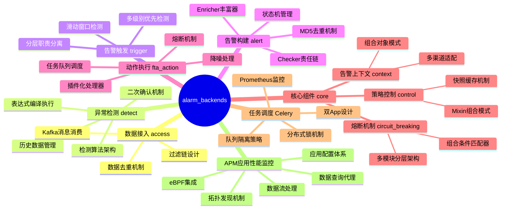
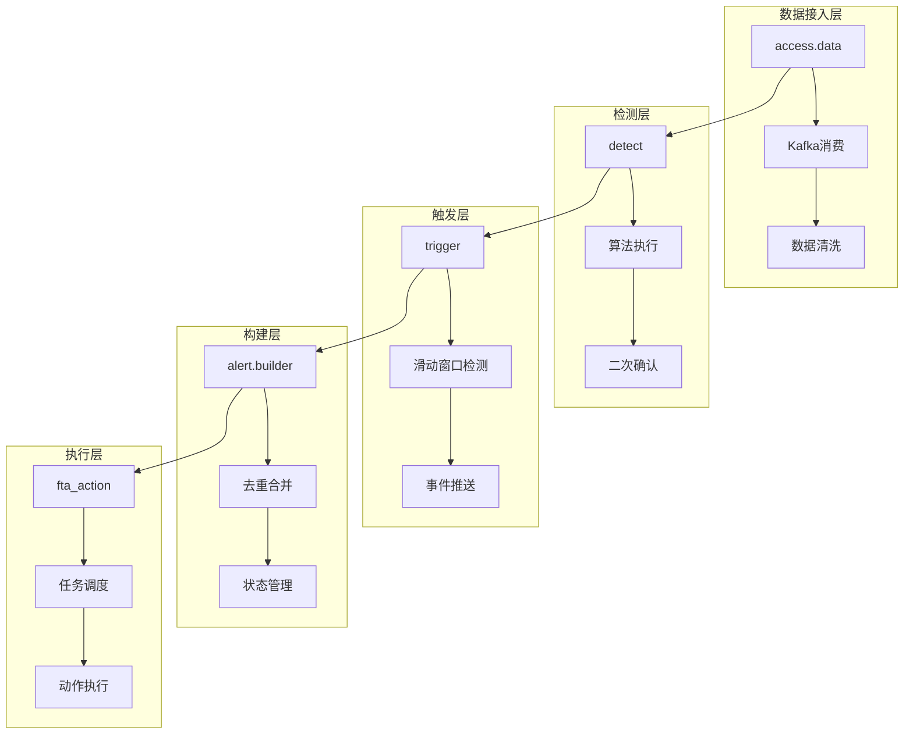
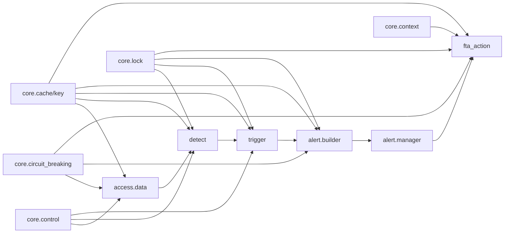

# 告警后台模块编程经验学习文档汇总

## 📚 文档概览

本目录包含对 `alarm_backends` 核心模块的深入分析，总结了可复用的设计模式和最佳实践。



---

## 📁 文档清单

| 序号 | 文档 | 核心内容 | 关键设计模式 |
|------|------|----------|-------------|
| 1 | [detect_experience.md](./detect_experience.md) | 异常检测算法 | 表达式编译、算法继承体系、二次确认Protocol |
| 2 | [trigger_experience.md](./trigger_experience.md) | 告警触发流程 | 三层职责分离、滑动窗口检测、分布式锁+延迟重试 |
| 3 | [alert_builder_experience.md](./alert_builder_experience.md) | 告警构建管理 | MD5去重、状态机、Checker责任链、Enricher丰富器 |
| 4 | [fta_action_experience.md](./fta_action_experience.md) | 动作执行调度 | 插件化架构、Celery队列、熔断机制、降噪处理 |
| 5 | [control_experience.md](./control_experience.md) | 策略控制管理 | 延迟加载、快照机制、Mixin组合、Checkpoint |
| 6 | [context_experience.md](./context_experience.md) | 告警上下文构建 | 组合对象模式、cached_property、多渠道适配 |
| 7 | [circuit_breaking_experience.md](./circuit_breaking_experience.md) | 系统熔断保护 | 组合条件匹配器、模板方法模式、策略注册表 |
| 8 | [celery_experience.md](./celery_experience.md) | Celery任务调度 | 双App设计、队列隔离、分布式锁、监控集成 |
| 9 | [apm-wiki/](./apm-wiki/) | APM应用性能监控 | 拓扑发现、查询代理、Flow管理、eBPF集成 |

---

## 🎯 核心设计模式一览

### 1. 分层架构模式



### 2. 设计模式应用统计

| 设计模式 | 应用模块 | 核心价值 |
|----------|---------|---------|
| **策略模式** | detect, fta_action | 算法/处理器可插拔，灵活扩展 |
| **模板方法模式** | circuit_breaking, alert | 统一流程框架，子类定制细节 |
| **组合模式** | circuit_breaking, context, detect | 树形结构组合，复杂逻辑表达 |
| **责任链模式** | alert(Checker), context(Renderer) | 顺序处理，可插拔环节 |
| **工厂模式** | control, detect | 动态对象创建，解耦配置与实现 |
| **状态机模式** | alert, fta_action | 状态流转控制，可追溯性 |
| **Mixin组合模式** | control(Item) | 功能模块化，避免继承臃肿 |
| **Protocol接口** | detect(double_check) | 接口契约，鸭子类型 |
| **适配器模式** | trigger, context | 格式转换，系统解耦 |
| **注册器模式** | apm(discover) | 自动发现注册，插件化 |

---

## 🔑 关键技术点汇总

### 性能优化技巧

| 技术点 | 说明 | 应用位置 |
|--------|------|---------|
| `cached_property` | 惰性计算+缓存 | context, control, detect |
| `compile()` 预编译 | 表达式编译提升性能 | detect(算法执行) |
| Pipeline批量操作 | 减少Redis交互 | trigger, detect, alert |
| 本地+Redis双重缓存 | 优化重复查询 | detect(历史数据) |
| PIT深分页 | ES深分页优化 | alert(告警查询) |
| 序列池预取 | 全局唯一ID生成 | alert(UID生成) |

### 并发控制机制

| 机制 | 实现方式 | 应用场景 |
|------|---------|---------|
| 分布式锁 | Redis SET NX EX + Lua释放 | 策略处理、告警更新、任务同步 |
| 事务+行锁 | `select_for_update()` | 状态更新原子性 |
| 锁失败重试 | 延迟重推队列 | trigger、fta_action |

### Celery 任务调度

| 配置项 | 说明 | 推荐值 |
|--------|------|-------|
| Worker数量 | 根据 CPU 动态计算 | `cpu_count() ** 0.6 * 1.85` |
| 子进程任务数 | 防止内存泄漏 | `worker_max_tasks_per_child = 1000` |
| 预取任务数 | 限制 Worker 预取 | `prefetch_multiplier = 4` |
| 任务过期时间 | 防止任务堆积 | `expires = min(3600, max(interval, 300))` |

### 异常处理策略

| 策略 | 说明 | 应用位置 |
|------|------|---------|
| fail-safe | 异常时返回安全默认值 | circuit_breaking, trigger限流 |
| 降级策略 | 失败时使用默认方案 | context(模板渲染降级) |
| 分类重试 | 区分业务错误和系统错误 | fta_action(重试机制) |
| 熔断保护 | 过载时阻断流量 | circuit_breaking, fta_action |

---

## 📊 模块依赖关系



---

## 💡 学习建议

### 推荐阅读顺序

1. **入门阶段**: control → context → circuit_breaking
   - 了解策略管理和基础架构模式

2. **核心流程**: detect → trigger → alert
   - 理解告警处理的核心业务流程

3. **执行层面**: fta_action
   - 学习任务调度和动作执行的实现

### 重点学习模块

| 目标 | 推荐模块 | 重点内容 |
|------|---------|---------|
| 设计模式应用 | control, circuit_breaking | Mixin组合、组合模式、模板方法 |
| 并发控制 | trigger, alert, fta_action | 分布式锁、事务控制、状态机 |
| 性能优化 | detect, alert | 缓存设计、批量操作、Pipeline |
| 可扩展架构 | detect, fta_action | 插件化、动态加载、Protocol |

---

## 📝 核心文件路径索引

### 服务层 (alarm_backends/service)

```
service/
├── access/data/          # 数据接入
├── detect/               # 异常检测
├── trigger/              # 告警触发
├── alert/
│   ├── builder/          # 告警构建
│   ├── manager/          # 告警管理
│   └── enricher/         # 数据丰富
├── fta_action/           # 动作执行
│   ├── tasks/            # Celery任务
│   ├── notice/           # 通知处理
│   ├── webhook/          # Webhook处理
│   └── common/           # 通用处理
└── nodata/               # 无数据检测
```

### 核心层 (alarm_backends/core)

```
core/
├── control/              # 策略控制
│   ├── strategy.py       # 策略管理
│   ├── item.py           # 检测项
│   ├── checkpoint.py     # 检测点
│   └ mixins/             # 功能Mixin
├── context/              # 告警上下文
│   ├── alarm.py          # 告警信息
│   ├── target.py         # 目标对象
│   ├── content.py        # 内容适配
├── circuit_breaking/     # 熔断机制
│   ├── manager.py        # 熔断管理器
│   ├── matcher.py        # 规则匹配
├── lock/                 # 分布式锁
├── cache/
│   ├── key.py            # Redis Key定义
│   ├── strategy.py       # 策略缓存
│   └ delay_queue.py      # 延迟队列
└── storage/
    ├── kafka.py          # Kafka封装
    ├── redis.py          # Redis封装
```

### APM模块 (apm)

```
apm/
├── core/
│   ├── discover/          # 拓扑发现
│   │   ├── base.py       # DiscoverBase基类
│   │   ├── node.py       # 节点发现
│   │   ├── instance.py   # 实例发现
│   │   ├── relation.py   # 关系发现
│   │   └── cached_mixin.py # 缓存Mixin
│   ├── handlers/
│   │   ├── bk_data/      # 数据流处理
│   │   │   ├── flow.py   # ApmFlow基类
│   │   │   ├── tail_sampling.py # 尾部采样
│   │   │   └── virtual_metric.py # 虚拟指标
│   │   └── query/        # 查询代理
│   │       ├── proxy.py  # QueryProxy
│   │       ├── trace_query.py # TraceQuery
│   │       └── statistics_query.py # 统计查询
│   └── deepflow/         # eBPF集成
│       ├── converter.py  # L7FlowLog转Span
│       └── constants.py  # 信号源/采集点
└── models/
    ├── application.py    # 应用模型与工厂
    ├── config.py         # 配置模型(Apdex/Sampler)
    ├── datasource.py     # 数据源配置
    └── topo.py           # 拓扑数据模型
```

---

## 🎉 总结

通过对 `alarm_backends` 和 `apm` 模块的深入分析，我们总结了以下可复用的编程经验：

1. **架构设计**: 分层职责分离、插件化扩展、组合优于继承
2. **并发控制**: 分布式锁、事务原子性、状态机管理
3. **性能优化**: 缓存策略、批量操作、惰性计算
4. **异常处理**: fail-safe原则、分类重试、降级策略
5. **可扩展性**: Protocol接口、动态加载、注册表模式
6. **APM特有**: 模板方法发现流程、查询代理路由、Flow生命周期管理

这些经验可以广泛应用于其他复杂的业务系统开发中 🚀