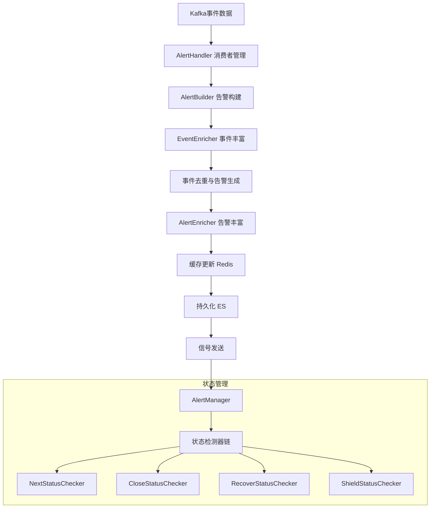
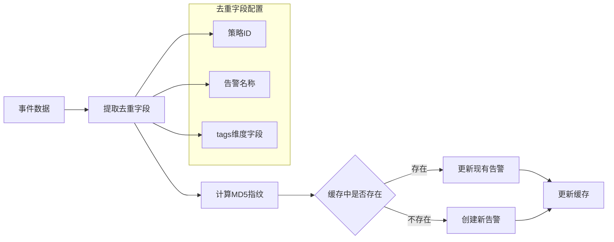
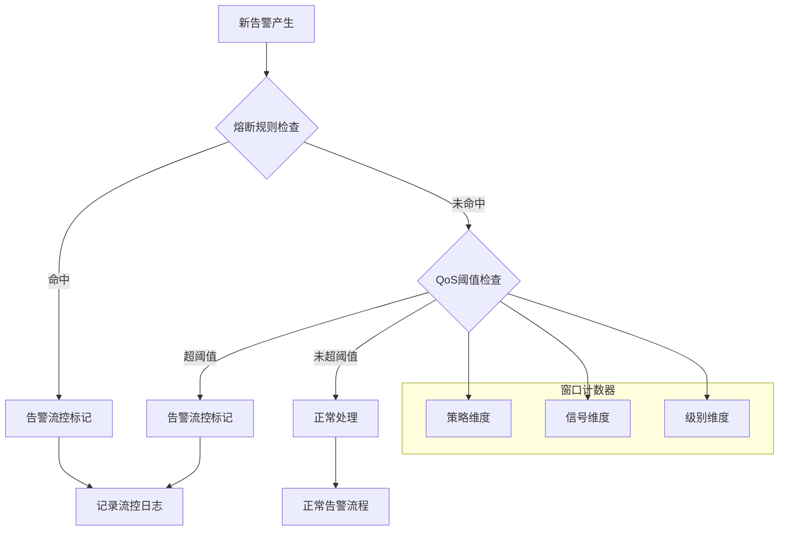
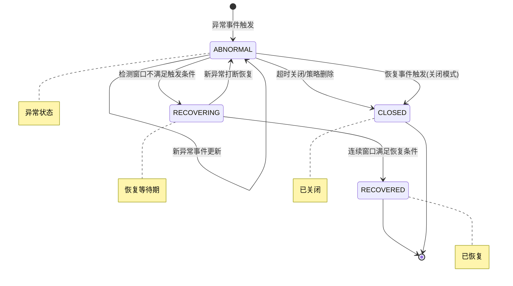
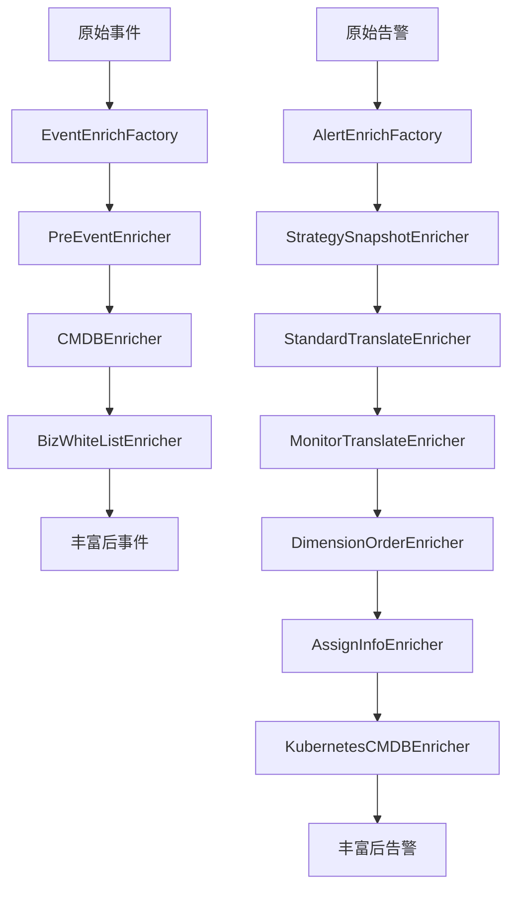

# 告警构建模块编程经验与最佳实践

## 目录
1. [告警构建流程设计](#1-告警构建流程设计)
2. [告警去重机制](#2-告警去重机制)
3. [告警收敛策略](#3-告警收敛策略)
4. [告警生命周期管理](#4-告警生命周期管理)
5. [多维度告警聚合](#5-多维度告警聚合)
6. [设计模式与最佳实践](#6-设计模式与最佳实践)

---

## 1. 告警构建流程设计

### 1.1 整体架构概述

告警构建模块采用分层架构设计，将数据处理流程清晰划分为多个阶段：



### 1.2 分层处理模式

**概念说明**：采用分层处理模式，将复杂业务逻辑拆分为独立层次，每层专注单一职责。

**代码示例**：

```python
# builder/processor.py
class AlertBuilder(BaseAlertProcessor):
    def handle(self, events: list[Event]):
        """事件处理逻辑 - 分层处理"""
        # 第一层：事件丰富
        events = self.enrich_events(events)
        # 第二层：事件持久化
        events = self.save_events(events)
        # 第三层：告警生成与去重
        alerts = self.dedupe_events_to_alerts(events)
        return alerts
```

**应用场景**：
- 复杂数据处理管道
- 需要按顺序执行的多步骤业务流程
- 数据清洗 -> 转换 -> 存储 -> 后处理的经典场景

**注意事项**：
- 每层应保持独立，避免跨层调用
- 层间数据传递使用明确的数据结构
- 每层应有清晰的输入输出定义

### 1.3 分布式锁机制

**概念说明**：使用分布式锁保证告警更新的原子性，防止并发冲突。

**代码示例**：

```python
# builder/processor.py
def dedupe_events_to_alerts(self, events: list[Event]):
    lock_keys = [ALERT_UPDATE_LOCK.get_key(dedupe_md5=event.dedupe_md5) for event in events]

    with multi_service_lock(ALERT_UPDATE_LOCK, lock_keys) as lock:
        success_locked_events = []
        fail_locked_events = []
        # 区分加锁成功和失败的事件
        for event in events:
            if lock.is_locked(ALERT_UPDATE_LOCK.get_key(dedupe_md5=event.dedupe_md5)):
                success_locked_events.append(event)
            else:
                fail_locked_events.append(event)

        # 处理加锁成功的事件
        alerts = self.build_alerts(success_locked_events)
        # 加锁失败的事件延后处理
        if fail_locked_events:
            dedupe_events_to_alerts.apply_async(
                kwargs={"events": fail_locked_events},
                countdown=5  # 5秒后重试
            )
```

**应用场景**：
- 多进程/多实例并发处理同一数据
- 需要保证数据一致性的更新操作
- 防止重复处理的场景

**注意事项**：
- 锁要有合理的超时时间，防止死锁
- 加锁失败要有重试机制
- 锁粒度要适中，太大会影响并发效率

---

## 2. 告警去重机制

### 2.1 MD5指纹去重

**概念说明**：基于多维度的MD5指纹实现告警去重，相同指纹的事件合并到同一告警。



**代码示例**：

```python
# core/alert/event.py
class Event:
    FIELDS = (
        "strategy_id", "alert_name", "dedupe_keys", "dedupe_md5", ...
    )

    def _clean_dedupe_keys(self):
        """配置去重字段列表"""
        default_dedupe_keys = copy.deepcopy(DEFAULT_DEDUPE_FIELDS)
        if self.data.get("strategy_id"):
            # 有策略ID时移除告警名称，使用策略ID去重
            default_dedupe_keys.remove("alert_name")
        else:
            default_dedupe_keys.remove("strategy_id")
        return default_dedupe_keys

    def cal_dedupe_md5(self):
        """计算去重MD5指纹"""
        self._dedupe_values = []
        for key in self.dedupe_keys:
            value = self.get_field(key)  # 支持tags.xxx格式
            self._dedupe_values.append(value)
        self.data["dedupe_md5"] = count_md5(self._dedupe_values)
```

**应用场景**：
- 大量重复告警需要合并的场景
- 基于业务维度进行告警分组
- 需要精确识别相同问题的事件

**注意事项**：
- 去重字段要覆盖业务核心维度
- MD5计算要处理空值情况
- 支持动态配置去重字段

### 2.2 缓存一致性管理

**概念说明**：使用Redis缓存维护告警状态，确保多进程间数据一致性。

**代码示例**：

```python
# core/alert/alert.py
class AlertCache:
    @staticmethod
    def save_alert_to_cache(alerts: list[Alert]):
        """保存告警到缓存"""
        alerts_to_saved = {}
        for alert in alerts:
            current_alert = alerts_to_saved.get(alert.dedupe_md5)
            # 只保留最新的告警
            if not current_alert or alert.create_time > current_alert.create_time:
                alerts_to_saved[alert.dedupe_md5] = alert

        # 批量更新缓存
        pipeline = ALERT_DEDUPE_CONTENT_KEY.client.pipeline(transaction=False)
        for alert in alerts_to_saved.values():
            key = ALERT_DEDUPE_CONTENT_KEY.get_key(
                strategy_id=alert.strategy_id or 0,
                dedupe_md5=alert.dedupe_md5
            )
            pipeline.set(key, json.dumps(alert.to_dict()), ALERT_DEDUPE_CONTENT_KEY.ttl)
        pipeline.execute()
```

**应用场景**：
- 高频更新的状态数据
- 需要快速查询的中间状态
- 多进程共享的数据

**注意事项**：
- 设置合理的缓存过期时间
- 使用pipeline批量操作提升性能
- 缓存和DB数据要定期同步

---

## 3. 告警收敛策略

### 3.1 事件级别收敛

**概念说明**：根据事件严重级别进行收敛，只保留最高级别的事件作为告警代表性事件。

**代码示例**：

```python
# core/alert/alert.py
class Alert:
    def update(self, event: Event):
        """根据事件更新告警"""
        # 高级别事件自动更新为代表性事件
        if event.status == EventStatus.ABNORMAL and event.severity < self.data["severity"]:
            self.data["severity"] = event.severity
            self.data["event"] = event.to_dict()
            self._refresh_db = True  # 标记需要刷新DB

        # 收敛日志记录
        default_log = dict(
            op_type=AlertLog.OpType.CONVERGE,
            event_id=event.id,
            description=event.description,
            time=event.time,
        )

        # 低级别事件被收敛丢弃
        if alert.event_severity < event.severity:
            alert.add_log(
                op_type=AlertLog.OpType.EVENT_DROP,
                event_id=event.id,
                description=event.description,
            )
            event.drop()
```

**应用场景**：
- 同一问题产生多级别告警时保留最严重
- 需要展示代表性事件而非所有事件
- 告警风暴抑制

**注意事项**：
- 级别定义要有明确业务含义
- 被收敛的事件要有日志记录
- 支持查看收敛的历史事件

### 3.2 QoS流控收敛

**概念说明**：基于时间窗口的计数器实现告警流控，防止告警风暴。



**代码示例**：

```python
# core/alert/alert.py
class Alert:
    def qos_check(self):
        """告警QoS检测"""
        if not self.is_blocked and not self.is_new():
            return {"is_blocked": False, "message": ""}

        qos_threshold = settings.QOS_ALERT_THRESHOLD
        if qos_threshold == 0:
            return {"is_blocked": self.is_blocked, "message": ""}

        # 按策略、信号、级别作为维度计数
        qos_dimension = dict(
            strategy_id=self.strategy_id or 0,
            signal="no_data" if self.is_no_data() else EventStatus.ABNORMAL,
            severity=self.severity
        )

        is_blocked, current_count = self.qos_calc(
            signal=signal,
            qos_counter=qos_counter,
            threshold={"threshold": qos_threshold, "window": settings.QOS_ALERT_WINDOW},
            need_incr=self.is_new()
        )

        if is_blocked:
            message = _("告警所属策略在当前窗口期内产生的告警数量已大于QOS阈值，当前告警被流控")
        return {"is_blocked": is_blocked, "message": message}
```

**应用场景**：
- 防止告警风暴影响系统稳定性
- 大规模故障时的告警抑制
- 保护下游通知系统

**注意事项**：
- 窗口大小和阈值要根据业务调优
- 流控告警要有后续处理机制
- 流控解除时要恢复正常通知

### 3.3 熔断规则收敛

**概念说明**：基于多维度的熔断规则，在系统异常时主动抑制告警。

**代码示例**：

```python
# core/alert/alert.py
class Alert:
    def check_circuit_breaking(self, circuit_breaking_manager=None) -> bool:
        """检查是否触发熔断"""
        if not circuit_breaking_manager:
            return False

        # 构建熔断匹配维度
        dimensions = self.circuit_breaking_dimensions
        return circuit_breaking_manager.is_circuit_breaking(**dimensions)

    @property
    def circuit_breaking_dimensions(self) -> dict:
        """获取熔断匹配维度"""
        dimension = {}
        if self.strategy_id is not None:
            dimension["strategy_id"] = str(self.strategy_id)
        if self.bk_biz_id:
            dimension["bk_biz_id"] = str(self.bk_biz_id)
        # 从策略信息中提取数据源和数据类型
        strategy = self.strategy
        if strategy and strategy.get("items"):
            first_query_config = strategy["items"][0]["query_configs"][0]
            dimension["data_source_label"] = first_query_config.get("data_source_label")
            dimension["data_type_label"] = first_query_config.get("data_type_label")
        return dimension
```

---

## 4. 告警生命周期管理

### 4.1 状态机设计



**代码示例**：

```python
# core/alert/alert.py
class Alert:
    # 1小时无更新自动关闭
    CLOSE_WINDOW_SIZE = 60 * 60

    def set_next_status(self, status, seconds):
        """设置下一个预期状态"""
        self.data["next_status_time"] = int(time.time()) + seconds
        self.data["next_status"] = status

    def move_to_next_status(self):
        """迁移到下一个状态"""
        if not self.data.get("next_status_time") or not self.data.get("next_status"):
            return False

        end_time = int(time.time())
        if self.data["next_status_time"] > end_time:
            return False

        # 到达转换时间，执行状态转换
        if self.data["next_status"] == EventStatus.RECOVERED:
            op_type = AlertLog.OpType.SYSTEM_RECOVER
        else:
            op_type = AlertLog.OpType.SYSTEM_CLOSE

        self.set_end_status(status=self.data["next_status"], op_type=op_type, end_time=end_time)
        return True
```

**应用场景**：
- 告警状态流转控制
- 自动恢复/关闭机制
- 周期性状态检测

**注意事项**：
- 状态转换要有日志记录
- 状态机要处理异常情况
- 状态转换条件要清晰定义

### 4.2 Checker责任链模式

**概念说明**：使用责任链模式串联多个状态检测器，每个检测器专注单一职责。

**代码示例**：

```python
# manager/processor.py
INSTALLED_CHECKERS = (
    NextStatusChecker,      # 下一状态检查
    CloseStatusChecker,     # 关闭条件检查
    RecoverStatusChecker,   # 恢复条件检查
    ShieldStatusChecker,    # 屏蔽状态检查
    AckChecker,             # 确认状态检查
    UpgradeChecker,         # 升级检查
    ActionHandleChecker,    # 动作处理检查
)

class AlertManager(BaseAlertProcessor):
    def handle(self, alerts: list[Alert]):
        for checker_cls in INSTALLED_CHECKERS:
            checker = checker_cls(alerts=alerts)
            checker.check_all()
```

```python
# manager/checker/base.py
class BaseChecker:
    def is_enabled(self, alert: Alert):
        """判断告警是否需要检测"""
        return alert.is_abnormal()

    def check_all(self):
        success = 0
        failed = 0
        for alert in self.alerts:
            if self.is_enabled(alert):
                try:
                    self.check(alert)
                    success += 1
                except Exception as e:
                    logger.exception("[%s failed] alert(%s)", self.__class__.__name__, alert.id)
                    failed += 1
        logger.info("[%s] success(%s), failed(%s)", self.__class__.__name__, success, failed)
```

**应用场景**：
- 多规则顺序检查
- 可插拔的检测逻辑
- 检测规则的灵活组合

**注意事项**：
- 检测器顺序要合理设计
- 每个检测器要有明确的启用条件
- 异常处理要不影响后续检测器

### 4.3 恢复检测算法

**概念说明**：使用滑动窗口算法检测告警恢复条件，支持灵活的恢复配置。

**代码示例**：

```python
# manager/checker/recover.py
class RecoverStatusChecker(BaseChecker):
    @classmethod
    def check_result_cache(cls, alert, last_check_timestamp, recovery_window_size, ...):
        """通过检测结果缓存判断恢复条件"""
        check_cache_key = CHECK_RESULT_CACHE_KEY.get_key(...)

        # 获取时间范围内的检测结果
        check_results = CHECK_RESULT_CACHE_KEY.client.zrangebyscore(
            name=check_cache_key,
            min=min_check_timestamp,
            max=last_check_timestamp,
            withscores=True
        )

        # 按窗口滑动检查
        for i in range(recovery_window_size):
            start_index = bisect.bisect_left(anomaly_timestamps, current_check_start_time)
            end_index = bisect.bisect_right(anomaly_timestamps, current_check_end_time)
            anomaly_count = end_index - start_index

            if anomaly_count >= trigger_count:
                # 满足触发条件，不恢复
                return False, latest_normal_record

            # 移动窗口
            current_check_start_time -= window_unit
            current_check_end_time -= window_unit

        return True, latest_normal_record  # 满足恢复条件
```

**应用场景**：
- 需要连续N个周期正常才恢复
- 支持灵活的触发/恢复窗口配置
- 防止瞬时波动导致的误恢复

**注意事项**：
- 使用二分查找优化窗口滑动效率
- 恢复周期内要抑制告警处理
- 恢复被打断要有明确日志

---

## 5. 多维度告警聚合

### 5.1 Enricher丰富器模式

**概念说明**：使用丰富器模式对告警/事件进行多维度信息补充，支持可插拔扩展。



**代码示例**：

```python
# enricher/__init__.py
INSTALLED_EVENT_ENRICHER = [
    PreEventEnricher,
    CMDBEnricher,
    BizWhiteListFor3rdEvent,
]

INSTALLED_AlERT_ENRICHER = [
    StrategySnapshotEnricher,
    StandardTranslateEnricher,
    MonitorTranslateEnricher,
    DimensionOrderEnricher,
    AssignInfoEnricher,
    KubernetesCMDBEnricher,
]

class EventEnrichFactory:
    def enrich(self):
        events = self.events
        for enricher_cls in INSTALLED_EVENT_ENRICHER:
            enricher = enricher_cls(events)
            events = enricher.enrich()
        return events

class BaseEventEnricher(metaclass=abc.ABCMeta):
    def enrich(self) -> List[Event]:
        events = []
        for event in self.events:
            if event.is_dropped():
                events.append(event)
            event = self.enrich_event(event)
            events.append(event)
        return events

    def enrich_event(self, event) -> Event:
        """单个事件丰富 - 子类实现"""
        return event
```

**应用场景**：
- 数据补全与增强
- 多数据源信息聚合
- 可配置的处理管道

**注意事项**：
- 丰富器顺序要合理
- 异常处理不阻断流程
- 支持丢弃标记

### 5.2 批量查询优化

**概念说明**：在丰富器初始化时批量查询关联数据，避免N+1查询问题。

**代码示例**：

```python
# enricher/cmdb.py
class CMDBEnricher(BaseEventEnricher):
    def __init__(self, events: list[Event]):
        super().__init__(events)

        # 缓存准备 - 批量查询
        tenant_ips = defaultdict(set)
        tenant_hosts = defaultdict(set)
        tenant_service_instance_ids = defaultdict(set)

        # 预收集所有需要查询的ID
        for event in self.events:
            if event.target_type == EventTargetType.HOST:
                tenant_hosts[event.bk_tenant_id].add(event.target)
            elif event.target_type == EventTargetType.SERVICE:
                tenant_service_instance_ids[event.bk_tenant_id].add(int(event.target))

        # 批量查询并缓存
        self.hosts_cache = {}
        for bk_tenant_id in tenant_hosts:
            self.hosts_cache[bk_tenant_id] = HostManager.mget(
                bk_tenant_id=bk_tenant_id,
                host_keys=list(tenant_hosts[bk_tenant_id])
            )
```

**应用场景**：
- 批量数据处理
- 需要关联查询的场景
- 减少外部系统调用次数

**注意事项**：
- 批量大小要控制，避免内存溢出
- 缓存要有过期机制
- 查询失败要有降级处理

### 5.3 维度翻译与标准化

**概念说明**：将内部维度值翻译为用户友好的显示值，提升告警可读性。

**代码示例**：

```python
# enricher/dimension.py
class StandardTranslateEnricher(BaseAlertEnricher):
    def enrich_host(self, alert: Alert):
        """主机维度翻译"""
        bk_host_id = alert.top_event["bk_host_id"]
        host = HostManager.get_by_id(bk_tenant_id=alert.bk_tenant_id, bk_host_id=bk_host_id)

        if host:
            display_name = _("主机")
            display_value = host.display_name
        else:
            display_name = _("主机ID")
            display_value = bk_host_id

        alert.add_dimension(
            key="bk_host_id",
            value=bk_host_id,
            display_key=display_name,
            display_value=display_value,
        )
```

---

## 6. 设计模式与最佳实践

### 6.1 工厂模式

**代码示例**：

```python
# enricher/translator/__init__.py
class TranslatorFactory:
    """维度翻译工厂"""
    def __init__(self, strategy):
        self.strategy = strategy
        self.translators = self._init_translators()

    def translate(self, dimensions):
        result = {}
        for translator in self.translators:
            result.update(translator.translate(dimensions))
        return result
```

### 6.2 上下文管理器模式

**代码示例**：

```python
# core/lock/service_lock.py
@contextmanager
def multi_service_lock(key_instance, keys):
    """多锁上下文管理器"""
    lock = None
    try:
        lock = MultiRedisLock(keys, key_instance.ttl)
        lock.acquire()
        yield lock
    finally:
        if lock is not None:
            lock.release()
```

### 6.3 唯一ID生成器

**概念说明**：使用时间戳+序列号生成全局唯一告警ID，支持集群隔离。

**代码示例**：

```python
# core/alert/alert.py
class AlertUIDManager:
    SEQUENCE_REDIS_KEY = ALERT_UUID_SEQUENCE
    sequence_pool = set()

    @classmethod
    def preload_pool(cls, count=1):
        """预取序列号到内存池"""
        poll_size = len(cls.sequence_pool)
        if poll_size >= count:
            return

        fetch_size = count - poll_size
        max_seq = cls.SEQUENCE_REDIS_KEY.client.incrby(
            cls.SEQUENCE_REDIS_KEY.get_key(), fetch_size
        )

        cluster = get_cluster()
        if cluster.is_default():
            cls.sequence_pool.update(range(max_seq, max_seq - fetch_size, -1))
        else:
            # 非默认集群追加集群编码
            cls.sequence_pool.update(
                f"{i}{cluster.code}" for i in range(max_seq, max_seq - fetch_size, -1)
            )

    @classmethod
    def generate(cls, timestamp: int = None) -> str:
        """生成UUID: 时间戳+序列号"""
        if not timestamp:
            timestamp = int(time.time())
        sequence = cls.pop_sequence()
        return f"{timestamp:0>10}{sequence}"
```

### 6.4 两级数据获取策略

**概念说明**：优先从高性能缓存获取数据，失败时降级到持久化存储。

**代码示例**：

```python
# core/alert/alert.py
class Alert:
    @classmethod
    def get(cls, alert_key: AlertKey) -> "Alert":
        """两级数据获取策略"""
        try:
            alert = cls.get_from_snapshot(alert_key)  # Redis快照
        except RedisError as error:
            logger.exception("load alert from redis failed: %s", error)
            alert = None

        if not alert:
            alert = cls.get_from_es(alert_key.alert_id)  # ES持久化
        return alert

    @classmethod
    def mget(cls, alert_keys: list[AlertKey]) -> list["Alert"]:
        """批量获取 - pipeline优化"""
        pipeline = ALERT_SNAPSHOT_KEY.client.pipeline(transaction=False)
        for alert_key in alert_keys:
            pipeline.get(alert_key.get_snapshot_key())
        alerts_snapshot = pipeline.execute()

        results = []
        alert_ids_not_found = []

        for index, alert_json in enumerate(alerts_snapshot):
            if not alert_json:
                alert_ids_not_found.append(alert_keys[index].alert_id)
                continue
            results.append(cls(json.loads(alert_json)))

        # 缓存未找到的从ES获取
        if alert_ids_not_found:
            for alert_doc in AlertDocument.mget(alert_ids_not_found):
                results.append(cls(alert_doc.to_dict()))

        return results
```

### 6.5 PIT深分页迭代

**概念说明**：使用Point-in-Time API替代scroll实现深分页，避免上下文积压。

**代码示例**：

```python
# manager/tasks.py
def _search_after_hits(search, page_size: int):
    """基于search_after + PIT的深分页迭代"""
    es_client = AlertDocument._index._get_connection()
    index = search._index
    base_body = search.to_dict()
    base_body["sort"] = [{"id": "asc"}]
    base_body["size"] = page_size

    # 打开PIT获取快照
    pit_resp = es_client.open_point_in_time(index=index, keep_alive="1m")
    pit_id = pit_resp["id"]

    try:
        search_after = None
        while True:
            body = {**base_body, "pit": {"id": pit_id, "keep_alive": "1m"}}
            if search_after:
                body["search_after"] = search_after
            resp = es_client.search(body=body, request_timeout=30)
            if resp.get("pit_id"):
                pit_id = resp["pit_id"]  # 更新PIT ID
            hits = resp["hits"]["hits"]
            if not hits:
                break
            yield from hits
            search_after = hits[-1]["sort"]
    finally:
        es_client.close_point_in_time(body={"id": pit_id})
```

---

## 总结

本模块展现了多个值得学习的编程经验：

| 设计点 | 模式/技术 | 核心价值 |
|--------|----------|---------|
| 分层处理 | 管道模式 | 业务解耦，流程清晰 |
| 分布式锁 | 上下文管理器 | 并发安全，防止冲突 |
| MD5去重 | 指纹算法 | 高效合并，减少重复 |
| Checker链 | 责任链模式 | 可插拔检测，灵活组合 |
| Enricher | 工厂+抽象类 | 数据增强，可扩展 |
| 两级获取 | 降级策略 | 高性能+高可靠 |
| UID生成 | 序列池预取 | 全局唯一，集群隔离 |
| PIT分页 | ES特性 | 深分页优化，避免积压 |

这些设计模式和技术方案可以广泛应用于其他复杂业务系统的开发中。

---

## 核心文件路径

- `alarm_backends/service/alert/builder/processor.py` - 告警构建处理器
- `alarm_backends/service/alert/builder/enricher/` - 事件丰富器
- `alarm_backends/service/alert/manager/processor.py` - 告警管理处理器
- `alarm_backends/service/alert/manager/checker/` - 状态检测器
- `alarm_backends/core/alert/alert.py` - 告警核心类
- `alarm_backends/core/alert/event.py` - 事件核心类
- `alarm_backends/core/lock/service_lock.py` - 分布式锁