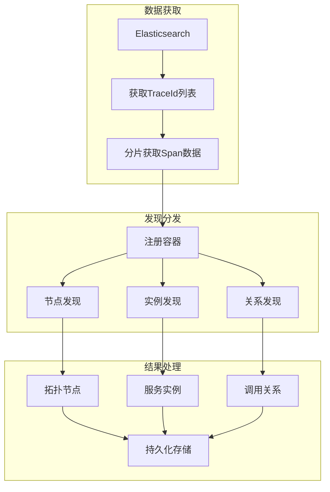

# 拓扑发现机制

## 核心架构



## 一、模板方法模式

**核心类**: `DiscoverBase` (文件: `apm/core/discover/base.py`)

```python
class DiscoverBase:
    """发现流程骨架"""

    def discover(self, spans):
        """核心抽象方法 - 子类必须实现"""
        raise NotImplementedError

    def build_instance_data(self, span):
        """构建数据对象"""
        return self._create_instance(span)

    def _create_instance(self, span):
        """工厂方法"""
        raise NotImplementedError
```

**子类实现示例**: `NodeDiscover` (文件: `apm/core/discover/node.py`)

```python
class NodeDiscover(DiscoverBase):
    def discover(self, spans):
        nodes = {}
        for span in spans:
            node_key = self._generate_key(span)
            if node_key not nodes:
                nodes[node_key].update(span)
            else:
                nodes[node_key] = TopoNode.from_span(span)
        return nodes
    ```
`

## 二、Mixin 缓存模式

**核心类**: `CachedDiscoverMixin` (文件: `apm/core/discover/cached_mixin.py`)

```python
class CachedDiscoverMixin:
    """缓存能力混入"""

    CACHE_KEY_TEMPLATE = "apm:topo:{topo_key}:{discover_type}"
    TTL = 600  # 10分钟

    def handle_cache_refresh_after_create(self):
        """统一缓存刷新"""
        key = self._get_cache_key()
        data = self.serialize()
        self.cache.set(key, json.dumps(data), ex=self.TTL)
    ```
`

**使用示例**:

```python
class NodeDiscover(DiscoverBase, CachedDiscoverMixin):
    """节点发现 + 缓存"""

    def discover(self, spans):
        # 发现逻辑
        nodes = self._discover_nodes(spans)
        # 自动刷新缓存
        self.handle_cache_refresh_after_create()
        return nodes
    ```
`

## 三、注册器模式

**核心类**: `DiscoverContainer` (文件: `apm/core/discover/__init__.py`)

```python
class DiscoverContainer:
    _discover_mapping = defaultdict(list)

    @classmethod
    def register(cls, module, target):
        """注册Discover"""
        cls._discover_mapping[module].append(target)

    @classmethod
    def list_discovers(cls, module):
        """获取已注册的Discover"""
        return cls._discover_mapping[module]
    ```
`

**自动注册机制**:

```python
class DiscoverBase:
    def __init_subclass__(cls, **kwargs):
        """子类定义时自动注册"""
        module = getattr(cls, 'module', 'default')
        DiscoverContainer.register(module, cls)
    ```
`

## 四、批量处理优化

**核心配置** (文件: `apm/constants.py`)

```python
# 批处理参数
DISCOVER_BATCH_SIZE = 10000       # 每批处理数量
PER_ROUND_TRACE_ID_MAX_SIZE = 100  # 每轮TraceId数量
HANDLE_SPANS_BATCH_SIZE = 10000   # Span批处理大小
```

**批处理流程** (文件: `apm/core/handlers/discover_handler.py`)

```python
class TopoHandler:
    def _fetch_spans(self, trace_ids):
        """分片获取Span"""
        from concurrent.futures import ThreadPoolExecutor

        with ThreadPoolExecutor(max_workers=10) as executor:
            futures = [
                executor.submit(self._get_batch, ids)
                for ids in chunks(trace_ids, HANDLE_SPANS_BATCH_SIZE)
            ]
            results = [f.result() for f in futures]
        return results
    ```
`

## 五、缓存策略详解

| 策略 | 觺发条件 | 处理动作 |
|------|----------|----------|
| **过期清理** | TTL < MIN_TTL | 删除整个缓存 |
| **超量清理** | 数据量 > MAX_SIZE | 删除并重建 |
| **增量更新** | 数据量 ≤ MAX_SIZE | 更新现有数据 |

```python
def _should_clear_cache(self, key):
    """智能清理判断"""
    ttl = self.cache.ttl(key)
    if ttl < self.MIN_TTL:
        return True

    cached = json.loads(self.cache.get(key) or '{}')
    if len(cached) > self.MAX_SIZE:
        return True

    return False
```

## 六、关键文件路径

| 文件 | 功能 |
|------|------|
| `apm/core/discover/base.py` | DiscoverBase 基类 |
| `apm/core/discover/node.py` | NodeDiscover 节点发现 |
| `apm/core/discover/instance.py` | InstanceDiscover 实例发现 |
| `apm/core/discover/relation.py` | RelationDiscover 关系发现 |
| `apm/core/discover/cached_mixin.py` | CachedMixin 缓存 |
| `apm/core/discover/__init__.py` | DiscoverContainer 注册器 |
| `apm/core/handlers/discover_handler.py` | TopoHandler 主处理器 |
| `apm/constants.py` | 批处理配置常量 |