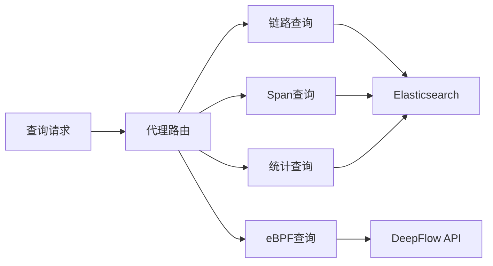

# 数据查询代理

## 代理模式架构



## 一、QueryProxy 代理类

**文件**: `apm/core/handlers/query/proxy.py`

```python
class QueryProxy:
    """查询代理 - 多策略路由"""

    QUERY_MODES = {
        'trace': TraceQuery,
        'span': SpanQuery,
        'statistics': StatisticsQuery,
        'ebpf': DeepFlowQuery,
    }

    def __init__(self, mode, **kwargs):
        self.mode = mode
        self.query = self._create_query(mode, **kwargs)

    def _create_query(self, mode, **kwargs):
        """工厂方法 - 创建具体查询"""
        query_cls = self.QUERY_MODES.get(mode)
        if not query_cls:
            raise ValueError(f"Unknown query mode: {mode}")
        return query_cls(**kwargs)

    def execute(self):
        """执行查询"""
        return self.query.execute()
    ```
`

## 二、TraceQuery 链路查询

**文件**: `apm/core/handlers/query/trace_query.py`

```python
class TraceQuery(BaseQuery):
    """链路查询实现"""

    def build_query(self):
        """构建ES查询"""
        return {
            "query": {
                "bool": {
                    "must": [
                        {"term": {"trace_id": self.trace_id}}
                    ]
                }
            },
            "sort": [{"time": "desc"}],
            "size": self.limit
        }

    def execute(self):
        """执行查询"""
        result = self.es.search(
            index=self.index,
            body=self.build_query()
        )
        return self._parse_result(result)
    ```
`

## 三、SpanQuery 调用段查询

**文件**: `apm/core/handlers/query/span_query.py`

```python
class SpanQuery(BaseQuery):
    """Span查询实现"""

    def build_query(self):
        """构建Span查询"""
        filters = []

        # 支持多种过滤条件
        if self.service_name:
            filters.append({"term": {"service_name": self.service_name}})
        if self.span_name:
            filters.append({"term": {"span_name": self.span_name}})
        if self.status_code:
            filters.append({"term": {"status_code": self.status_code}})

        return {
            "query": {"bool": {"must": filters}},
            "size": self.limit
        }
    ```
`

## 四、StatisticsQuery 统计查询

**文件**: `apm/core/handlers/query/statistics_query.py`

```python
class StatisticsQuery(BaseQuery):
    """统计聚合查询"""

    def build_query(self):
        """构建聚合查询"""
        return {
            "query": self._build_filters(),
            "aggs": {
                "service_stats": {
                    "terms": {"field": "service_name", "size": 100},
                    "aggs": {
                        "avg_duration": {"avg": {"field": "bk_apm_duration"}},
                        "error_rate": {
                            "filters": [{"term": {"status_code": "error"}}],
                            "avg_bucket": {"avg": {"field": "bk_apm_count"}}
                        }
                    }
                }
            }
        }
    ```
`

## 五、QueryBuilder 条件构建

**文件**: `apm/core/handlers/query/builder.py`

```python
class QueryBuilder:
    """查询条件构建器"""

    def add_term_filter(self, field, value):
        """添加精确匹配"""
        self.filters.append({
            "term": {field: value}
        })
        return self

    def add_range_filter(self, field, gte=None, lte=None):
        """添加范围过滤"""
        range_filter = {}
        if gte:
            range_filter["gte"] = gte
        if lte:
            range_filter["lte"] = lte
        self.filters.append({
            "range": {field: range_filter}
        })
        return self

    def add_exists_filter(self, field):
        """添加存在性过滤"""
        self.filters.append({
            "exists": {"field": field}
        })
        return self

    def build(self):
        """构建最终查询"""
        return {"bool": {"must": self.filters}}
    ```
`

## 六、查询模式对比

| 模式 | 查询类型 | 支持的操作 |
|------|---------|----------|
| `trace` | TraceQuery | 链路完整追踪 |
| `span` | SpanQuery | Span详情查询 |
| `statistics` | StatisticsQuery | 统计聚合分析 |
| `ebpf` | DeepFlowQuery | 网络性能分析 |

## 七、关键文件路径

| 文件 | 功能 |
|------|------|
| `apm/core/handlers/query/proxy.py` | QueryProxy 代理 |
| `apm/core/handlers/query/base.py` | BaseQuery 基类 |
| `apm/core/handlers/query/trace_query.py` | TraceQuery |
| `apm/core/handlers/query/span_query.py` | SpanQuery |
| `apm/core/handlers/query/statistics_query.py` | StatisticsQuery |
| `apm/core/handlers/query/ebpf_query.py` | DeepFlowQuery |
| `apm/core/handlers/query/builder.py` | QueryBuilder |