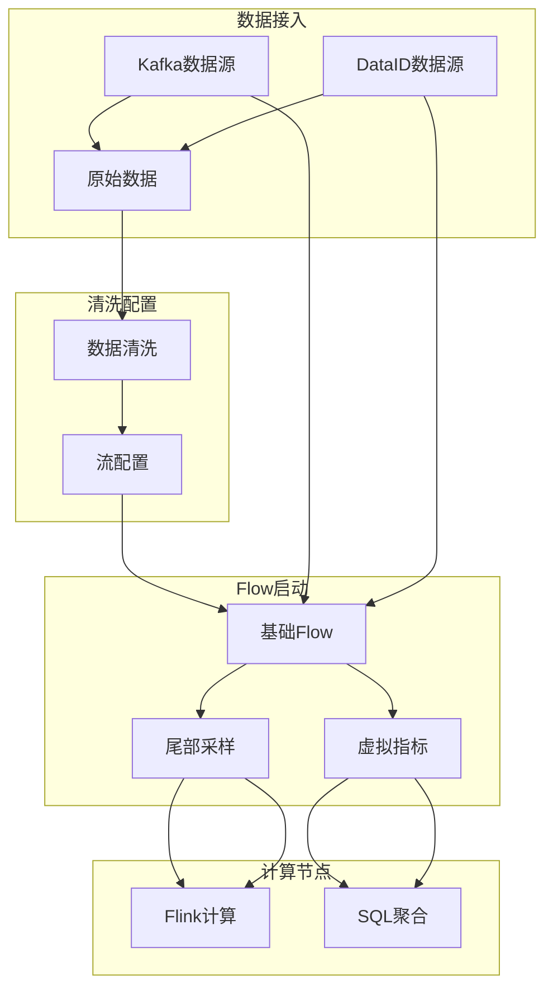

# 数据流处理

## Flow 创建架构



## 一、ApmFlow 基类

**文件**: `apm/core/handlers/bk_data/flow.py`

```python
class ApmFlow:
    """Flow创建基类"""

    def start(self):
        """启动流程"""
        # Step1: 配置数据源
        self._config_deploy()

        # Step2: 配置清洗规则
        self._config_cleans()

        # Step3: 启动清洗
        self._start_cleans()

        # Step4: 项目授权
        self._auth_project()

        # Step5: 启动Flow
        self._start_flow()
    ```
`

## 二、TailSamplingFlow 尾部采样

**文件**: `apm/core/handlers/bk_data/tail_sampling.py`

```python
class TailSamplingFlow(ApmFlow):
    """尾部采样Flow"""

    def __init__(self, app_name, sampling_config):
        self.app_name = app_name
        self.sampling_config = sampling_config

        # 采样条件支持
        self.conditions = {
            'eq': lambda field, value: f"{field} == '{value}'",
            'neq': lambda field, value: f"{field} != '{value}'",
            'gt': lambda field, value: f"{field} > {value}",
            'error': lambda _: "status_code == 'error'",
        }

    def get_sampling_logic(self):
        """获取采样逻辑"""
        logic = []
        for condition in self.sampling_config:
            func = self.conditions[condition['method']]
            logic.append(func(condition['field'], condition['value']))
        return " OR ".join(logic)
    ```
`

**采样策略**:

| 策略 | 条件 | 输出 |
|------|------|------|
| 随机采样 | 无条件 | 按比例输出 |
| 错误采样 | status_code='error' | 100%输出 |
| 慢调用采样 | duration > threshold | 100%输出 |
| 关键链路采样 | 特定trace_id | 100%输出 |

## 三、VirtualMetricFlow 虚拟指标

**文件**: `apm/core/handlers/bk_data/virtual_metric.py`

```python
class VirtualMetricFlow(ApmFlow):
    """虚拟指标计算Flow"""

    def get_sql_aggregation(self):
        """SQL聚合计算"""
        return """
        SELECT
            service_name,
            COUNT(*) as bk_apm_count,
            AVG(bk_apm_duration) as bk_apm_avg_duration,
            SUM(IF(status_code='error', 1, 0)) as bk_apm_error_count
        FROM {table}
        WHERE time >= {start_time}
        GROUP BY service_name
        """

    def get_apdex_calculation(self):
        """Apdex计算"""
        return """
        SELECT
            service_name,
            (SUM(IF(apdex_type='satisfied', 1, 0)) +
             SUM(IF(apdex_type='tolerating', 1, 0) * 0.5) /
             COUNT(*)) as apdex_score
        FROM {table}
        GROUP BY service_name
        """
    ```
`

## 四、FlowHelper 辅助类

**文件**: `apm/core/handlers/bk_data/helper.py`

```python
class FlowHelper:
    """Flow管理辅助类"""

    def create_flow(self, app_name, flow_config):
        """创建Flow"""
        # 获取或创建数据源
        resource = self._get_or_create_resource(flow_config)

        # 创建清洗规则
        clean_rules = self._create_clean_rules(flow_config)

        # 创建Flow
        flow = self._create_flow_instance(resource, clean_rules)

        return flow

    def update_flow(self, flow_id, new_config):
        """更新Flow"""
        flow = BkdataFlowConfig.objects.get(id=flow_id)
        flow.config = new_config
        flow.save()

        # 重启Flow
        self._restart_flow(flow)
    ```
`

## 五、关键文件路径

| 文件 | 功能 |
|------|------|
| `apm/core/handlers/bk_data/flow.py` | ApmFlow 基类 |
| `apm/core/handlers/bk_data/tail_sampling.py` | TailSamplingFlow |
| `apm/core/handlers/bk_data/virtual_metric.py` | VirtualMetricFlow |
| `apm/core/handlers/bk_data/helper.py` | FlowHelper |
| `apm/core/handlers/bk_data/constants.py` | Flow状态常量 |