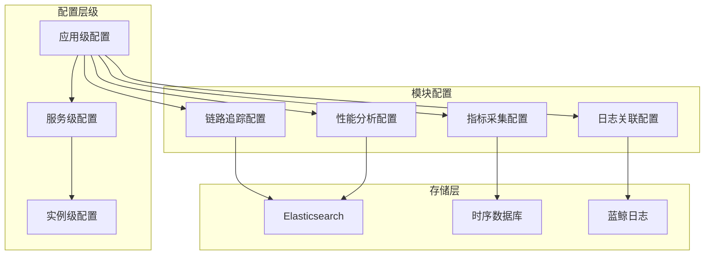

# 应用配置体系

## 配置层级架构



## 一、配置三级体系

**文件**: `apm/models/config.py`

```python
class ConfigLevel:
    """配置层级枚举"""
    APP = "app"           # 应用级 - 全局配置
    SERVICE = "service"   # 服务级 - 服务维度
    INSTANCE = "instance" # 实例级 - 实例维度
```

**配置继承机制**:

```python
class ApmApplication:
    """应用配置管理"""

    def get_config(self, level, module, key=None):
        """获取配置 - 支持层级继承"""
        # 优先级: 实例 > 服务 > 应用
        configs = []

        # 实例级配置
        if level >= ConfigLevel.INSTANCE:
            configs.append(self._get_instance_config())

        # 服务级配置
        if level >= ConfigLevel.SERVICE:
            configs.append(self._get_service_config())

        # 应用级配置
        configs.append(self._get_app_config())

        # 合并配置
        return self._merge_configs(configs, key)
```

## 二、Apdex 配置管理

**文件**: `apm/models/config.py`

```python
class ApdexConfig:
    """应用性能指数配置"""

    # Apdex等级阈值(秒)
    SATISFIED = 0.5      # 满意阈值
    TOLERATING = 2.0     # 容忍阈值

    def calculate_apdex(self, response_times):
        """计算Apdex分数"""
        satisfied = sum(1 for t in response_times if t <= self.SATISFIED)
        tolerating = sum(
            1 for t in response_times
            if self.SATISFIED < t <= self.TOLERATING
        )
        frustrated = sum(
            1 for t in response_times
            if t > self.TOLERATING
        )

        total = satisfied + tolerating + frustrated
        return (satisfied + tolerating * 0.5) / total if total > 0 else 1.0
```

**Apdex评分标准**:

| 响应时间 | Apdex类型 | 权重 |
|---------|-----------|------|
| ≤ 0.5s | satisfied | 1.0 |
| 0.5s ~ 2.0s | tolerating | 0.5 |
| > 2.0s | frustrated | 0 |

## 三、采样配置

**文件**: `apm/models/config.py`

```python
class SamplerConfig:
    """采样策略配置"""

    # 采样类型
    SAMPLER_TYPES = {
        'probabilistic': ProbabilisticSampler,  # 概率采样
        'rate_limiting': RateLimitingSampler,    # 限流采样
        'tail': TailSampler,                      # 尾部采样
    }

    def __init__(self, sampler_type, config):
        self.sampler = self._create_sampler(sampler_type, config)

    def should_sample(self, span):
        """判断是否采样"""
        return self.sampler.should_sample(span)


class ProbabilisticSampler:
    """概率采样器"""

    def __init__(self, sampling_rate=0.1):
        self.sampling_rate = sampling_rate  # 采样率 0.0~1.0

    def should_sample(self, span):
        return random.random() < self.sampling_rate
```

**采样策略对比**:

| 策略 | 特点 | 适用场景 |
|------|------|----------|
| probabilistic | 固定比例采样 | 流量均匀场景 |
| rate_limiting | 每秒固定数量 | 保护后端系统 |
| tail | 基于条件采样 | 捕获异常链路 |

## 四、数据链路存储

**文件**: `apm/models/datasource.py`

```python
class DataLinkConfig:
    """数据链路配置"""

    # 存储类型
    STORAGE_TYPES = {
        'es': ElasticsearchStorage,
        'clickhouse': ClickHouseStorage,
    }

    def create_storage(self, config):
        """创建存储实例"""
        storage_cls = self.STORAGE_TYPES[config['type']]
        return storage_cls(config)

    def get_index_name(self, app_name, data_type):
        """获取索引名称"""
        return f"{app_name}_{data_type}_{datetime.now():%Y%m%d}"
```

**数据存储映射**:

| 数据类型 | 存储介质 | 索引格式 |
|---------|---------|---------|
| Trace | Elasticsearch | `{app}_trace_{date}` |
| Span | Elasticsearch | `{app}_span_{date}` |
| Metric | VictoriaMetrics | `{app}_metric` |
| Profile | Elasticsearch | `{app}_profile_{date}` |

## 五、应用工厂模式

**文件**: `apm/models/application.py`

```python
class ApplicationFactory:
    """应用创建工厂"""

    @staticmethod
    def create_application(app_type, **kwargs):
        """工厂方法"""
        app_map = {
            'standard': StandardApplication,
            'deepflow': DeepFlowApplication,
            'custom': CustomApplication,
        }

        app_cls = app_map.get(app_type, StandardApplication)
        return app_cls(**kwargs)


class StandardApplication:
    """标准APM应用"""

    def __init__(self, app_name, **kwargs):
        self.app_name = app_name
        self.config = self._init_config(kwargs)
        self.modules = self._init_modules()

    def _init_modules(self):
        """初始化功能模块"""
        modules = []

        if self.config.trace_enabled:
            modules.append(TraceModule(self))
        if self.config.metric_enabled:
            modules.append(MetricModule(self))
        if self.config.profile_enabled:
            modules.append(ProfileModule(self))
        if self.config.log_enabled:
            modules.append(LogModule(self))

        return modules
```

## 六、关键文件路径

| 文件 | 功能 |
|------|------|
| `apm/models/application.py` | 应用模型与工厂 |
| `apm/models/config.py` | 配置模型(Apdex/Sampler) |
| `apm/models/datasource.py` | 数据源配置 |
| `apm/models/subscription_config.py` | 订阅配置 |
| `apm/models/profile.py` | Profile数据模型 |
| `apm/models/topo.py` | 拓扑数据模型 |