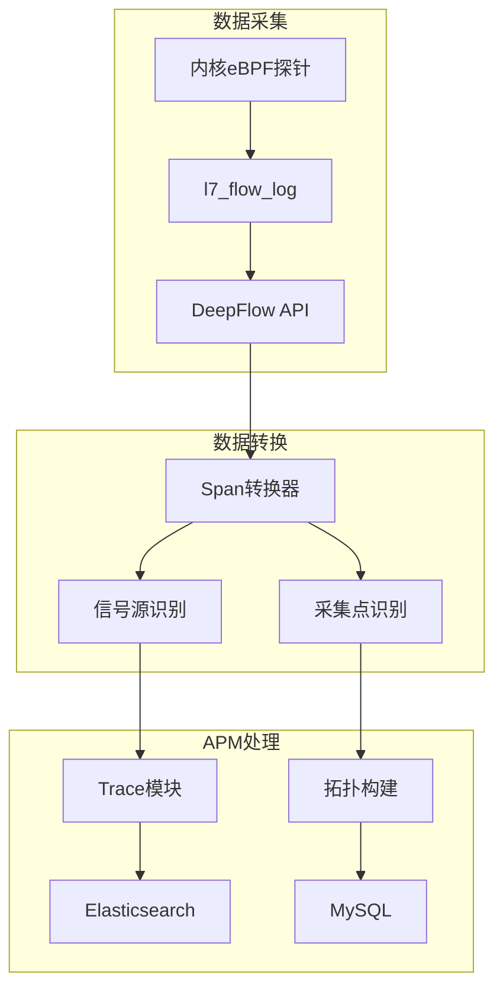

# eBPF集成

## DeepFlow 架构集成



## 一、l7_flow_log 转 Span

**文件**: `apm/core/deepflow/converter.py`

```python
class L7FlowLogConverter:
    """L7流量日志转Span"""

    # Span字段映射
    FIELD_MAPPING = {
        'l7_protocol': 'protocol',
        'l7_protocol_str': 'protocol_name',
        'request_type': 'span_kind',
        'request_resource': 'span_name',
        'response_status': 'status_code',
        'response_code': 'http_status',
        'response_exception': 'error_message',
        'latency_us': 'duration',  # 微秒转毫秒
    }

    def convert_to_span(self, flow_log):
        """转换流程"""
        span = {
            'trace_id': self._generate_trace_id(flow_log),
            'span_id': flow_log['span_id'],
            'parent_span_id': flow_log.get('parent_span_id', ''),
            'start_time': flow_log['start_time'],
            'end_time': flow_log['end_time'],
        }

        # 字段映射
        for src_field, dst_field in self.FIELD_MAPPING.items():
            if src_field in flow_log:
                span[dst_field] = self._transform_value(
                    src_field, flow_log[src_field]
                )

        # 添加属性
        span['attributes'] = self._extract_attributes(flow_log)

        return span

    def _transform_value(self, field, value):
        """字段值转换"""
        if field == 'latency_us':
            return value / 1000  # 微秒->毫秒
        return value
```

## 二、信号源类型

**文件**: `apm/core/deepflow/constants.py`

```python
class SignalSource:
    """信号源类型枚举"""

    # 流量来源
    CAPTURE_FROM_CVM = 1      # CVM镜像采集
    CAPTURE_FROM_K8S = 2       # K8s节点采集
    CAPTURE_FROM_ECS = 3       # ECS实例采集

    # 应用来源
    OTEL_SDK = 10              # OpenTelemetry SDK
    BK_SDK = 11                # 蓝鲸SDK

    # 协议类型
    PROTOCOL_HTTP = 100
    PROTOCOL_GRPC = 101
    PROTOCOL_MYSQL = 102
    PROTOCOL_REDIS = 103
    PROTOCOL_KAFKA = 104

    # 映射关系
    SIGNAL_NAMES = {
        1: 'cvm_mirror',
        2: 'k8s_node',
        3: 'ecs_instance',
        10: 'otel_sdk',
        11: 'bk_sdk',
    }
```

**信号源识别**:

```python
def identify_signal_source(flow_log):
    """识别信号源"""
    # 优先使用SDK上报
    if flow_log.get('telemetry_sdk'):
        return SignalSource.BK_SDK

    # 根据采集源判断
    capture_source = flow_log.get('capture_source')
    if capture_source == 'cvm':
        return SignalSource.CAPTURE_FROM_CVM
    elif capture_source == 'k8s':
        return SignalSource.CAPTURE_FROM_K8S

    return SignalSource.CAPTURE_FROM_CVM
```

## 三、采集点类型

**文件**: `apm/core/deepflow/constants.py`

```python
class TapSide:
    """采集点位置"""

    # 采集位置
    C_SIDE = 0      # 客户端
    S_SIDE = 1      # 服务端
    M_SIDE = 2      # 中间件
    NA_SIDE = 3     # 未知

    # 采集类型映射
    TAP_SIDE_NAMES = {
        0: 'client',
        1: 'server',
        2: 'middleware',
        3: 'unknown',
    }

    # 对应关系
    TAP_SIDE_RELATION = {
        'c': 'client -> server',
        's': 'server <- client',
        'm': 'middleware',
    }
```

**采集点识别**:

```python
def identify_tap_side(flow_log):
    """识别采集点位置"""
    # 根据流量方向判断
    direction = flow_log.get('flow_direction')

    if direction == 'outbound':
        return TapSide.C_SIDE  # 客户端出站
    elif direction == 'inbound':
        return TapSide.S_SIDE  # 服务端入站
    elif flow_log.get('is_middleware'):
        return TapSide.M_SIDE

    return TapSide.NA_SIDE
```

## 四、网络性能监控

**文件**: `apm/core/deepflow/metrics.py`

```python
class NetworkMetricsCollector:
    """网络指标采集"""

    def collect_metrics(self, flow_logs):
        """采集网络指标"""
        metrics = {
            'latency': [],      # 延迟
            'throughput': [],   # 吞吐量
            'error_rate': 0,    # 错误率
            'connection_count': 0,  # 连接数
        }

        for log in flow_logs:
            metrics['latency'].append(log['latency_us'])
            metrics['throughput'].append(log['response_size'])
            if log['response_status'] != 'OK':
                metrics['error_rate'] += 1
            metrics['connection_count'] += 1

        # 聚合计算
        return {
            'avg_latency_ms': sum(metrics['latency']) / len(metrics['latency']) / 1000,
            'total_throughput_bytes': sum(metrics['throughput']),
            'error_rate': metrics['error_rate'] / len(flow_logs),
            'connection_count': metrics['connection_count'],
        }
```

## 五、DeepFlow 查询集成

**文件**: `apm/core/handlers/query/ebpf_query.py`

```python
class DeepFlowQuery(BaseQuery):
    """DeepFlow查询实现"""

    API_ENDPOINTS = {
        'query': '/api/v1/query',
        'trace': '/api/v1/trace/{trace_id}',
        'topology': '/api/v1/topology',
    }

    def build_query(self):
        """构建查询参数"""
        params = {
            'app_name': self.app_name,
            'start_time': self.start_time,
            'end_time': self.end_time,
            'protocol': self.protocol,
        }

        if self.signal_source:
            params['signal_source'] = self.signal_source

        if self.tap_side:
            params['tap_side'] = self.tap_side

        return params

    def execute(self):
        """执行查询"""
        params = self.build_query()
        response = self._call_deepflow_api('query', params)
        return self._parse_response(response)
```

## 六、应用配置适配器

**文件**: `apm/models/application.py`

```python
class DeepFlowApplication(StandardApplication):
    """DeepFlow应用配置"""

    def __init__(self, app_name, **kwargs):
        super().__init__(app_name, **kwargs)
        self.enable_ebpf = kwargs.get('enable_ebpf', True)

        # DeepFlow专用配置
        self.deepflow_config = {
            'api_url': kwargs.get('deepflow_api_url'),
            'cluster_id': kwargs.get('cluster_id'),
            'signal_sources': kwargs.get('signal_sources', [1, 2, 3]),
            'tap_sides': kwargs.get('tap_sides', [0, 1]),
        }

    def get_converter(self):
        """获取转换器"""
        from apm.core.deepflow.converter import L7FlowLogConverter
        return L7FlowLogConverter()
```

## 七、关键文件路径

| 文件 | 功能 |
|------|------|
| `apm/core/deepflow/converter.py` | L7FlowLog转Span |
| `apm/core/deepflow/constants.py` | 信号源/采集点常量 |
| `apm/core/deepflow/metrics.py` | 网络指标采集 |
| `apm/core/handlers/query/ebpf_query.py` | DeepFlow查询 |
| `apm/models/application.py` | DeepFlowApplication |