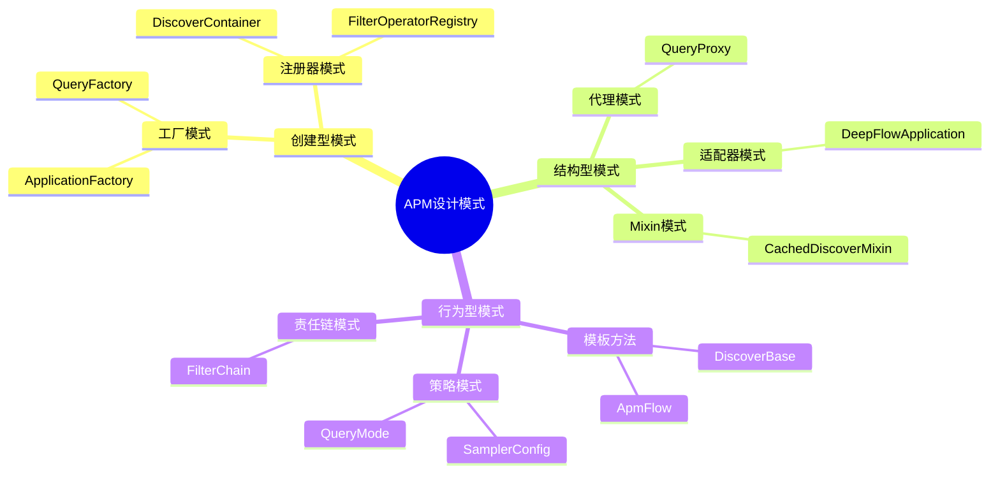

# 设计模式总结

## APM模块设计模式总览



## 一、工厂模式 ★

**应用场景**: 应用创建、查询创建

```python
# 文件: apm/models/application.py
class ApplicationFactory:
    """应用创建工厂"""

    @staticmethod
    def create_application(app_type, **kwargs):
        """根据类型创建应用"""
        app_map = {
            'standard': StandardApplication,
            'deepflow': DeepFlowApplication,
            'custom': CustomApplication,
        }
        app_cls = app_map.get(app_type, StandardApplication)
        return app_cls(**kwargs)

# 使用示例
app = ApplicationFactory.create_application('deepflow', app_name='my-app')
```

**优势**:
- 解耦创建逻辑和使用逻辑
- 统一创建入口，便于扩展新类型
- 支持配置驱动创建

---

## 二、模板方法模式 ★

**应用场景**: 发现流程、Flow生命周期

```python
# 文件: apm/core/discover/base.py
class DiscoverBase:
    """发现流程骨架"""

    def discover(self, spans):
        """核心抽象方法 - 子类实现"""
        raise NotImplementedError

    def build_instance_data(self, span):
        """构建数据对象"""
        return self._create_instance(span)

    def _create_instance(self, span):
        """工厂方法"""
        raise NotImplementedError

# 文件: apm/core/handlers/bk_data/flow.py
class ApmFlow:
    """Flow生命周期模板"""

    def start(self):
        """启动流程 - 固定步骤"""
        self._config_deploy()      # Step1: 配置数据源
        self._config_cleans()      # Step2: 配置清洗规则
        self._start_cleans()       # Step3: 启动清洗
        self._auth_project()       # Step4: 项目授权
        self._start_flow()         # Step5: 启动Flow
```

**优势**:
- 定义算法骨架，固定流程步骤
- 子类可定制具体实现
- 复用公共代码逻辑

---

## 三、代理模式 ★

**应用场景**: 查询路由

```python
# 文件: apm/core/handlers/query/proxy.py
class QueryProxy:
    """查询代理 - 多策略路由"""

    QUERY_MODES = {
        'trace': TraceQuery,
        'span': SpanQuery,
        'statistics': StatisticsQuery,
        'ebpf': DeepFlowQuery,
    }

    def __init__(self, mode, **kwargs):
        self.mode = mode
        self.query = self._create_query(mode, **kwargs)

    def execute(self):
        """代理执行"""
        return self.query.execute()

# 使用示例
proxy = QueryProxy('trace', trace_id='abc123')
result = proxy.execute()
```

**优势**:
- 隐藏具体查询实现
- 统一查询入口
- 支持动态切换查询策略

---

## 四、Mixin模式 ★

**应用场景**: 缓存能力增强

```python
# 文件: apm/core/discover/cached_mixin.py
class CachedDiscoverMixin:
    """缓存能力混入"""

    CACHE_KEY_TEMPLATE = "apm:topo:{topo_key}:{discover_type}"
    TTL = 600  # 10分钟

    def handle_cache_refresh_after_create(self):
        """统一缓存刷新"""
        key = self._get_cache_key()
        data = self.serialize()
        self.cache.set(key, json.dumps(data), ex=self.TTL)

# 组合使用
class NodeDiscover(DiscoverBase, CachedDiscoverMixin):
    """节点发现 + 缓存"""

    def discover(self, spans):
        nodes = self._discover_nodes(spans)
        self.handle_cache_refresh_after_create()  # 自动刷新缓存
        return nodes
```

**优势**:
- 横向扩展功能，不破坏继承链
- 按需组合能力
- 避免多重继承复杂度

---

## 五、注册器模式 ★

**应用场景**: Discover自动注册、FilterOperator注册

```python
# 文件: apm/core/discover/__init__.py
class DiscoverContainer:
    """注册器"""
    _discover_mapping = defaultdict(list)

    @classmethod
    def register(cls, module, target):
        """注册Discover"""
        cls._discover_mapping[module].append(target)

    @classmethod
    def list_discovers(cls, module):
        """获取已注册的Discover"""
        return cls._discover_mapping[module]

# 自动注册机制
class DiscoverBase:
    def __init_subclass__(cls, **kwargs):
        """子类定义时自动注册"""
        module = getattr(cls, 'module', 'default')
        DiscoverContainer.register(module, cls)
```

**优势**:
- 自动发现注册
- 解耦注册逻辑
- 支持插件化扩展

---

## 六、策略模式 ★

**应用场景**: 采样策略、查询模式

```python
# 文件: apm/models/config.py
class SamplerConfig:
    """采样策略配置"""

    SAMPLER_TYPES = {
        'probabilistic': ProbabilisticSampler,  # 概率采样
        'rate_limiting': RateLimitingSampler,    # 限流采样
        'tail': TailSampler,                      # 尾部采样
    }

    def __init__(self, sampler_type, config):
        self.sampler = self._create_sampler(sampler_type, config)

    def should_sample(self, span):
        """统一接口"""
        return self.sampler.should_sample(span)


class ProbabilisticSampler:
    """概率采样策略"""
    def should_sample(self, span):
        return random.random() < self.sampling_rate


class RateLimitingSampler:
    """限流采样策略"""
    def should_sample(self, span):
        return self.rate_limiter.try_consume(1)
```

**优势**:
- 算法可独立变化
- 客户端透明使用
- 易于扩展新策略

---

## 七、适配器模式 ★

**应用场景**: DeepFlow集成

```python
# 文件: apm/models/application.py
class DeepFlowApplication(StandardApplication):
    """DeepFlow应用适配器"""

    def __init__(self, app_name, **kwargs):
        super().__init__(app_name, **kwargs)
        # 适配DeepFlow专用配置
        self.enable_ebpf = kwargs.get('enable_ebpf', True)
        self.deepflow_config = {
            'api_url': kwargs.get('deepflow_api_url'),
            'cluster_id': kwargs.get('cluster_id'),
        }

    def get_converter(self):
        """获取适配转换器"""
        from apm.core.deepflow.converter import L7FlowLogConverter
        return L7FlowLogConverter()
```

**优势**:
- 兼容现有接口
- 封装外部系统差异
- 平滑集成第三方服务

---

## 八、责任链模式

**应用场景**: 过滤器链

```python
# 文件: apm/core/handlers/query/filter.py
class FilterChain:
    """过滤器链"""

    def __init__(self):
        self.filters = []

    def add_filter(self, filter_obj):
        """添加过滤器"""
        self.filters.append(filter_obj)
        return self

    def apply(self, query):
        """依次应用过滤"""
        for filter_obj in self.filters:
            query = filter_obj.apply(query)
        return query

# 使用示例
chain = FilterChain()
chain.add_filter(TimeRangeFilter())
       .add_filter(ServiceFilter())
       .add_filter(StatusFilter())

query = chain.apply(base_query)
```

**优势**:
- 解耦过滤器逻辑
- 支持动态组合
- 符合单一职责

---

## 设计模式应用总结

| 模式 | 核心类 | 应用场景 | 优势 |
|------|--------|----------|------|
| **工厂模式** | ApplicationFactory | 应用创建 | 统一创建入口，易扩展 |
| **模板方法** | DiscoverBase | 发现流程 | 固定骨架，灵活实现 |
| **代理模式** | QueryProxy | 查询路由 | 隐藏实现，统一入口 |
| **Mixin模式** | CachedDiscoverMixin | 缓存增强 | 横向扩展，按需组合 |
| **注册器模式** | DiscoverContainer | 自动注册 | 自动发现，插件化 |
| **策略模式** | SamplerConfig | 采样策略 | 算法可变，透明使用 |
| **适配器模式** | DeepFlowApplication | DeepFlow集成 | 兼容接口，平滑集成 |
| **责任链模式** | FilterChain | 过滤器链 | 解耦逻辑，动态组合 |

## 最佳实践建议

1. **优先使用组合而非继承**: Mixin模式优于多重继承
2. **固定流程用模板方法**: ApmFlow的5步生命周期
3. **策略可变用策略模式**: 采样、查询模式切换
4. **扩展功能用适配器**: 第三方系统集成
5. **插件化用注册器**: 自动发现机制