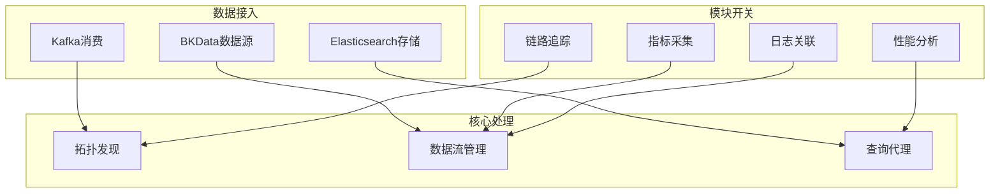

# APM 模块核心技术 Wiki

## 模块定位

APM（Application Performance Monitoring）是蓝鲸监控平台的应用性能监控模块， 提供分布式应用的链路追踪、拓扑发现、性能分析等能力。

## 整体架构



## 核心技术一览

| 技术 | 核心类 | 设计模式 | 文件路径 |
|------|---------|----------|---------|
| **拓扑发现** | TopoHandler + DiscoverBase | 模板方法 + Mixin | `apm/core/discover/` |
| **数据流管理** | ApmFlow | TailSamplingFlow | 策略模式 + 工厂模式 | `apm/core/handlers/bk_data/` |
| **查询代理** | QueryProxy | TraceQuery + 代理模式 + 策略模式 | `apm/core/handlers/query/` |
| **应用配置** | ApplicationHelper | ApmApplication | 工厂模式 | `apm/models/application.py` |
| **eBPF集成** | DeepFlowQuery | EBPFApplicationConfig | 适配器模式 | `apm/core/deepflow/` |

## 子文档导航

| 文档 | 核心内容 |
|------|---------|
| [拓扑发现机制](./01_拓扑发现机制.md) | 服务拓扑自动发现的核心设计 |
| [数据查询代理](./02_数据查询代理.md) | Trace/Span 查询的代理模式设计 |
| [数据流处理](./03_数据流处理.md) | BKData Flow 和尾部采样机制 |
| [应用配置体系](./04_应用配置体系.md) | 四模块配置与存储管理 |
| [eBPF集成](./05_eBPF集成.md) | DeepFlow 网络性能监控 |
| [设计模式总结](./06_设计模式总结.md) | 核心设计模式与最佳实践 |

## 抸索链路

```
Trace数据 -> TopoDiscover(发现拓扑) -> FlowManager(创建Flow) -> ES(存储结果)
                ↓
            QueryProxy(查询代理) -> API响应
```