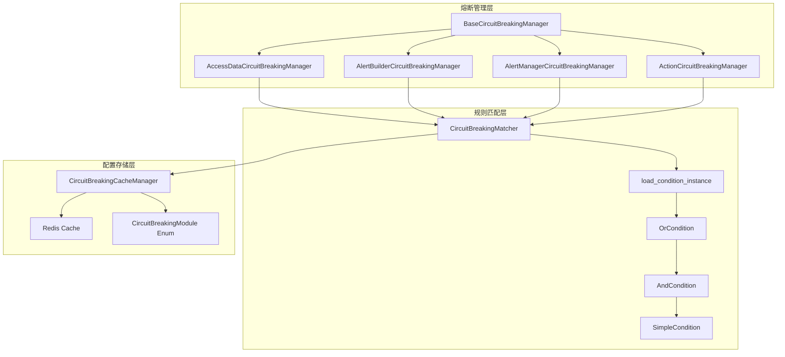
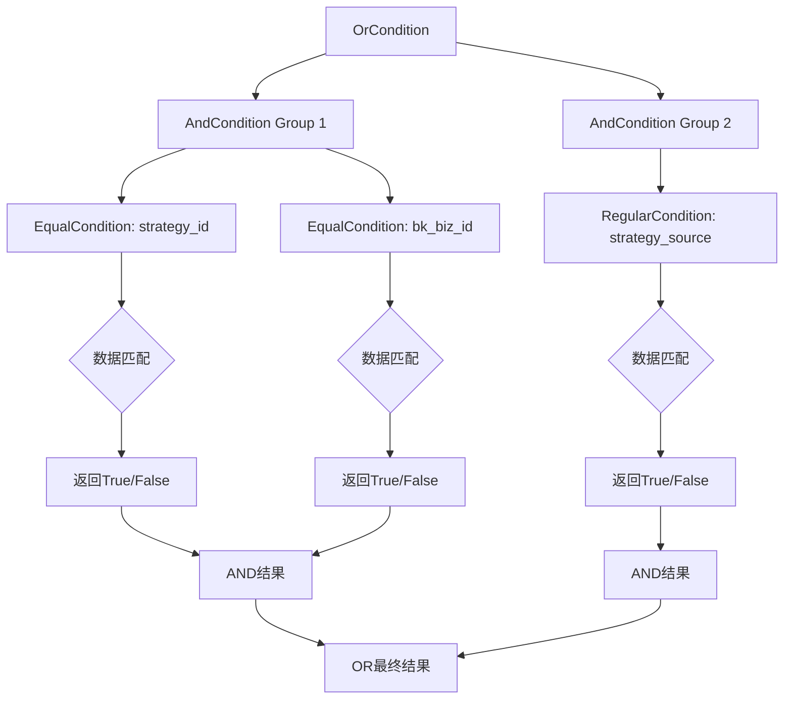
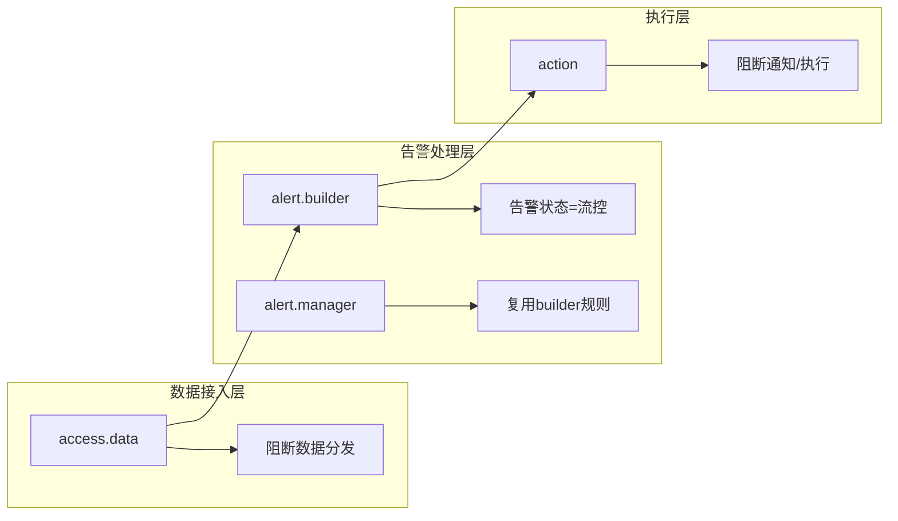
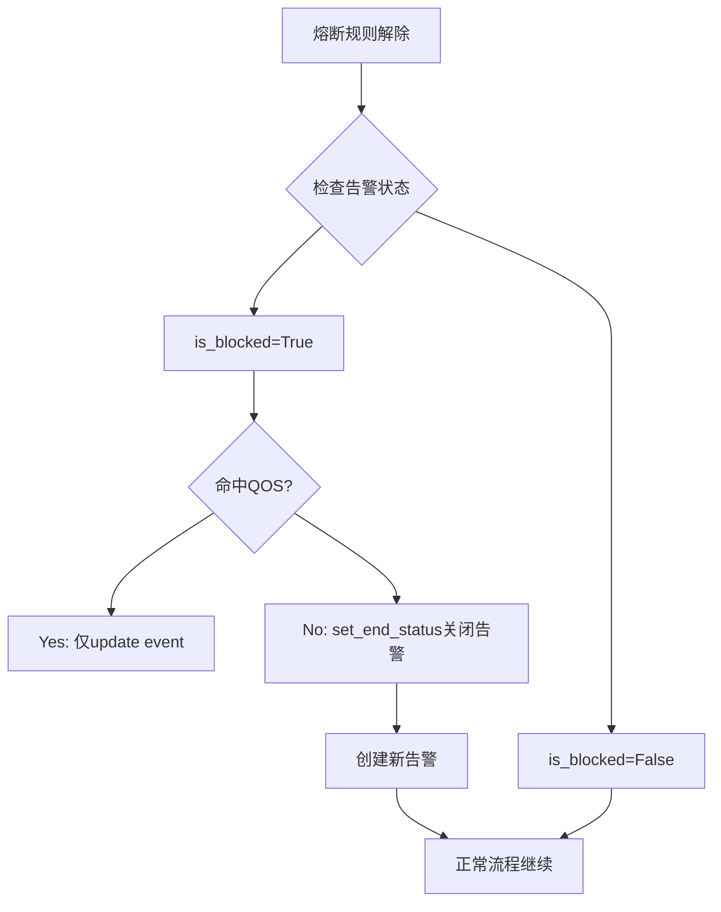

# 熔断机制模块学习文档

## 一、熔断架构概览



---

## 二、核心设计模式分析

### 1. 模板方法模式 - 熔断管理器基类设计

**概念说明**：
`BaseCircuitBreakingManager` 使用模板方法模式，定义了熔断判定的标准流程，子类通过覆盖特定方法实现差异化行为。

**代码示例**（来自 `manager.py`）：
```python
class BaseCircuitBreakingManager:
    module = ""  # 子类覆盖：定义模块标识

    def __init__(self):
        self.config = CircuitBreakingCacheManager.get_config(self.module)
        self.matcher = gen_circuit_breaking_matcher(self.config)

    def is_cb(self, target_instance: dict) -> bool:
        """模板方法：定义熔断判定的标准流程"""
        if not self.matcher:
            return False
        # 步骤1：清理维度数据（子类可覆盖）
        clean_instance = self.clean_cb_dimension(**target_instance)
        # 步骤2：执行匹配判定
        return self.matcher.is_match(clean_instance)

    @classmethod
    def clean_cb_dimension(cls, strategy_id=None, bk_biz_id=None, ...) -> dict:
        """钩子方法：子类可扩展维度清理逻辑"""
        dimension = {}
        if strategy_id is not None:
            dimension["strategy_id"] = str(strategy_id)
        # ...
        return dimension

class ActionCircuitBreakingManager(BaseCircuitBreakingManager):
    module = "action"

    @classmethod
    def clean_cb_dimension(cls, plugin_type=None, **kwargs) -> dict:
        """扩展方法：添加Action模块特有维度"""
        dimension = super().clean_cb_dimension(**kwargs)
        if plugin_type is not None:
            dimension["plugin_type"] = str(plugin_type)
        return dimension
```

**应用场景**：
- 多模块熔断管理，各模块有通用流程和特殊维度
- 需要在统一流程中预留扩展点

**注意事项**：
- 模块标识 `module` 必须与 `CircuitBreakingModule` 枚举对齐
- 覆盖方法时应调用父类方法保证基础逻辑完整性

---

### 2. 组合模式 - 条件匹配器架构

**概念说明**：
条件匹配器使用组合模式，将简单条件和复合条件组合成树形结构，支持复杂的逻辑表达式。

**代码示例**（来自 `conditions.py`）：
```python
class Condition:
    def is_match(self, data):
        raise NotImplementedError

class SimpleCondition(Condition):
    """叶子节点：单一条件"""
    def __init__(self, cond_field, default_value_if_not_exists=False):
        self.cond_field = cond_field

    def is_match(self, data):
        existed, data_field = self.get_field(data)
        if not existed:
            return self.default_value_if_not_exists
        return self._is_match(data_field)

class CompositeCondition(Condition):
    """组合节点：AND/OR逻辑"""
    def __init__(self):
        self.conditions = []  # 存储子条件

    def add(self, condition):
        self.conditions.append(condition)

class OrCondition(CompositeCondition):
    def is_match(self, data):
        if not self.conditions:
            return True
        for cond in self.conditions:
            if cond.is_match(data):
                return True
        return False

class AndCondition(CompositeCondition):
    def is_match(self, data):
        if not self.conditions:
            return True
        for cond in self.conditions:
            if not cond.is_match(data):
                return False
        return True
```

**匹配流程图**：


**应用场景**：
- 复杂的规则匹配逻辑，如 `(A AND B) OR (C AND D)`
- 需要动态构建匹配规则树

**注意事项**：
- 空条件组默认返回 True，避免空配置阻断所有数据
- 条件匹配异常时应返回 False（fail-safe原则）

---

### 3. 工厂模式 - 匹配器创建

**概念说明**：
使用工厂函数统一创建匹配器实例，封装复杂的对象创建逻辑。

**代码示例**（来自 `matcher.py` 和 `range/__init__.py`）：
```python
# matcher.py
def gen_circuit_breaking_matcher(cb_config: list[dict]) -> CircuitBreakingMatcher | None:
    """工厂函数：生成流控条件匹配器"""
    return create_circuit_breaking_matcher(cb_config)

def create_circuit_breaking_matcher(config_rules: list[dict]) -> CircuitBreakingMatcher | None:
    if not config_rules:
        return None
    return CircuitBreakingMatcher(config_rules)

# range/__init__.py
CONDITION_CLASS_MAP = {
    "eq": conditions.EqualCondition,
    "neq": conditions.NotEqualCondition,
    "reg": conditions.RegularCondition,
    # ...
}

def load_condition_instance(conditions_config, default_value_if_not_exists=True):
    """工厂函数：根据配置构建条件匹配器树"""
    or_cond_obj = conditions.OrCondition()
    for cond_item_list in conditions_config:
        and_cond_obj = conditions.AndCondition()
        for cond_item in cond_item_list:
            method = cond_item.get("method", "eq")
            cond_obj = CONDITION_CLASS_MAP.get(method)(cond_field, ...)
            and_cond_obj.add(cond_obj)
        or_cond_obj.add(and_cond_obj)
    return or_cond_obj
```

**应用场景**：
- 根据配置动态创建不同类型条件对象
- 隔离对象创建与使用逻辑

**注意事项**：
- 工厂函数应处理空配置情况，返回 None 或默认实例
- 使用字典映射简化条件类型选择

---

### 4. 策略模式 - 多种匹配方法

**概念说明**：
通过条件类映射实现策略模式，支持动态选择不同的匹配算法。

**支持的匹配方法**：
| 方法 | 说明 | 条件类 |
|------|------|--------|
| eq | 等于 | EqualCondition |
| neq | 不等于 | NotEqualCondition |
| lt/lte | 小于/小于等于 | LesserCondition |
| gt/gte | 大于/大于等于 | GreaterCondition |
| reg/nreg | 正则匹配/不匹配 | RegularCondition |
| include/exclude | 包含/不包含 | IncludeCondition |
| issuperset | 是超集 | IsSuperSetCondition |

**代码示例**：
```python
class EqualCondition(SimpleCondition):
    def _is_match(self, data_field):
        data_value = data_field.to_str_list()
        cond_value = self.cond_field.to_str_list()
        return bool(set(data_value) & set(cond_value))

class RegularCondition(SimpleCondition):
    def _is_match(self, data_field):
        data_value = data_field.to_str_list()[0]
        cond_value = self.cond_field.to_str_list()
        for v in cond_value:
            reg = re.compile(rf"{v}")
            if reg.findall(data_value):
                return True
        return False
```

---

## 三、系统保护机制

### 1. 多模块分层熔断架构



**熔断触发点设计**：
| 模块 | 熔断时机 | 熔断效果 | 日志记录 |
|------|----------|----------|----------|
| access.data | 任务分发前 | 阻断任务入队列 | 记录到日志 |
| alert.builder | 告警创建后 | 告警状态=流控 | 记录到ES |
| alert.manager | 告警处理中 | 同builder规则 | 记录到ES |
| action | 执行前 | 阻断通知发送 | 记录流水 |

**代码示例**（来自 `__init__.py` 文档注释）：
```python
"""
熔断模块埋点:
1. access.data:
   - 数据分发熔断: 基于策略属性(业务, 数据来源)进行熔断。
   - 命中熔断后, 不会再分发任务到 service-worker 队列

2. alert.builder:
   - 正常创建告警后进行熔断判定
   - 告警状态设置为被流控, 并不再后续处理
   - 所有熔断日志记录到ES, 支持回溯

3. action:
   - message_queue: action创建阶段熔断, 避免action风暴
   - 其他plugin_type: 执行阶段熔断, 记录告警流水
"""
```

---

### 2. 维度组合熔断策略

**支持的熔断维度**：
```python
# 熔断维度结构
{
    "strategy_id": 11,       # 策略ID
    "bk_biz_id": 11,         # 业务ID
    "data_source_label": "bk_log_search",  # 数据源标签
    "data_type_label": "log",              # 数据类型标签
    "strategy_source": "bk_log_search:log" # 组合维度
}
```

**配置规则格式**：
```python
# 规则之间为AND关系，condition字段为OR时切换分组
[
    {"key": "strategy_id", "method": "eq", "value": ["1", "2"]},
    {"key": "bk_biz_id", "method": "eq", "value": ["1", "2"], "condition": "or"},
    {"key": "strategy_source", "method": "eq", "value": ["bk_log_search:log"], "condition": "or"}
]
```

---

### 3. 异常安全机制

**概念说明**：
熔断判定过程中发生异常时，采用 fail-safe 原则，默认返回 False（不熔断），避免因熔断模块异常阻断正常业务流程。

**代码示例**：
```python
class BaseCircuitBreakingManager:
    def is_circuit_breaking(self, **kwargs) -> bool:
        try:
            target_instance = {}
            target_instance.update(kwargs)
            return self.is_cb(target_instance)
        except Exception as e:
            logger.exception(f"circuit breaking check failed: {e}")
            return False  # 异常时不熔断，保证业务连续性

class CircuitBreakingMatcher:
    def is_match(self, dimensions: dict) -> bool:
        try:
            normalized_dimensions = self._normalize_dimensions(dimensions)
            return self.condition_matcher.is_match(normalized_dimensions)
        except Exception as e:
            logger.error(f"Error matching dimensions: {e}")
            return False  # 匹配异常时不阻断
```

---

## 四、配置动态更新机制

### 1. 缓存管理器设计

**代码示例**（来自 `circuit_breaking.py`）：
```python
class CircuitBreakingCacheManager(CacheManager):
    CACHE_KEY_PREFIX = f"{PUBLIC_KEY_PREFIX}.cache.circuit_breaking"
    CACHE_TIMEOUT = 60 * 60 * 24  # 24小时缓存

    @classmethod
    def get_config(cls, module: str) -> list[dict]:
        cache_key = cls.get_cache_key(module)
        config_data = cls.cache.get(cache_key)
        if config_data:
            return json.loads(config_data)
        return []

    @classmethod
    def set_config(cls, module: str, config: list[dict]) -> bool:
        cache_key = cls.get_cache_key(module)
        config_data = json.dumps(config, ensure_ascii=False)
        cls.cache.set(cache_key, config_data, cls.CACHE_TIMEOUT)
        return True

    @classmethod
    def add_rule(cls, module: str, rule: dict) -> bool:
        """追加规则：支持增量配置"""
        config = cls.get_config(module)
        config.append(rule)
        return cls.set_config(module, config)
```

---

### 2. 预设快捷配置函数

**概念说明**：
提供便捷函数简化常见熔断场景的配置操作。

**代码示例**：
```python
# 设置策略数据源熔断
set_strategy_source_circuit_breaking(
    module="access.data",
    strategy_sources=["bk_log_search:log", "bk_monitor:time_series"]
)

# 设置业务熔断
set_bk_biz_id_circuit_breaking(
    module="access.data",
    bk_biz_ids=["100", "200"]
)

# 设置策略级别熔断
set_strategy_circuit_breaking(
    module="access.data",
    strategy_ids=[12345, 67890]
)

# 设置插件类型熔断（action模块）
set_plugin_type_circuit_breaking(
    module="action",
    plugin_types=["notice", "webhook"]
)

# 清空配置
clear(module="access.data")  # 清空指定模块
clear()                      # 清空所有模块
```

---

### 3. 枚举约束模块范围

**概念说明**：
使用枚举类约束支持的熔断模块，防止配置错误。

**代码示例**：
```python
class CircuitBreakingModule(Enum):
    ACCESS_DATA = "access.data"
    ALERT_BUILDER = "alert.builder"
    ALERT_MANAGER = "alert.manager"
    ACTION = "action"

    @classmethod
    def is_valid_module(cls, module: str) -> bool:
        return module in cls.get_all_values()
```

---

## 五、熔断恢复逻辑

### 1. 熔断解除后的告警处理



**处理逻辑**（来自文档注释）：
```python
"""
熔断规则解除后的处理:
1. 已存在的告警, is_blocked=True:
   - 命中qos: 仅update(event)
   - 未命中qos: set_end_status关闭并创建新告警
2. 已存在的告警, is_blocked=False:
   - 正常流程继续
3. 新创建的告警:
   - 正常流程继续
"""
```

---

### 2. 规则降级与继承

**概念说明**：
`AlertManagerCircuitBreakingManager` 展示了规则继承的设计，当自身模块无配置时，自动继承其他模块的规则。

**代码示例**：
```python
class AlertManagerCircuitBreakingManager(BaseCircuitBreakingManager):
    module = "alert.manager"

    def __init__(self):
        super().__init__()
        # 规则降级：无配置时复用 alert.builder 规则
        if self.matcher is None:
            self.config = CircuitBreakingCacheManager.get_config("alert.builder")
            self.matcher = gen_circuit_breaking_matcher(self.config)
```

---

## 六、设计亮点总结

| 亮点 | 说明 |
|------|------|
| **分层解耦架构** | 管理器、匹配器、缓存三层独立，职责清晰 |
| **组合模式匹配器** | 支持任意复杂度的逻辑表达式 |
| **模板方法扩展** | 基类定义流程，子类扩展维度 |
| **异常安全设计** | fail-safe原则保证业务连续性 |
| **便捷配置函数** | 简化常见场景操作 |
| **规则继承降级** | 无配置时自动复用相关模块规则 |
| **枚举约束范围** | 防止配置错误 |

---

## 七、可复用模式推荐

| 模式 | 适用场景 | 复用建议 |
|------|----------|----------|
| 模板方法模式 | 多模块统一流程 | 定义基类流程，子类覆盖扩展点 |
| 组合模式 | 复杂逻辑表达式 | 使用树形结构组合条件 |
| 工厂模式 | 动态对象创建 | 字典映射+工厂函数 |
| 策略模式 | 多种算法选择 | 条件类映射 |
| 枚举约束 | 防止配置错误 | 使用Enum限定范围 |

---

## 八、核心文件路径

- `alarm_backends/core/circuit_breaking/manager.py` - 熔断管理器基类与子类
- `alarm_backends/core/circuit_breaking/matcher.py` - 规则匹配器
- `alarm_backends/core/cache/circuit_breaking.py` - 缓存管理器
- `bkmonitor/utils/range/conditions.py` - 条件类实现
- `bkmonitor/utils/range/__init__.py` - 工厂函数