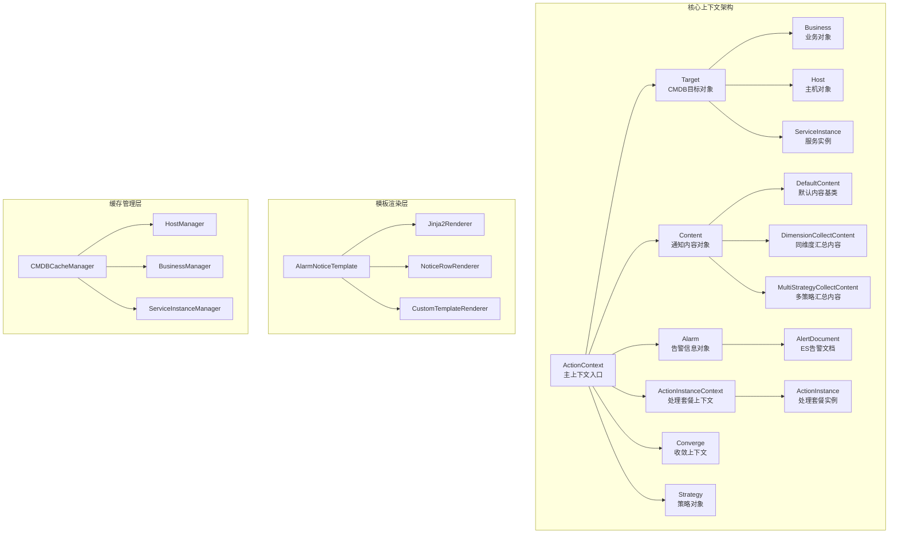
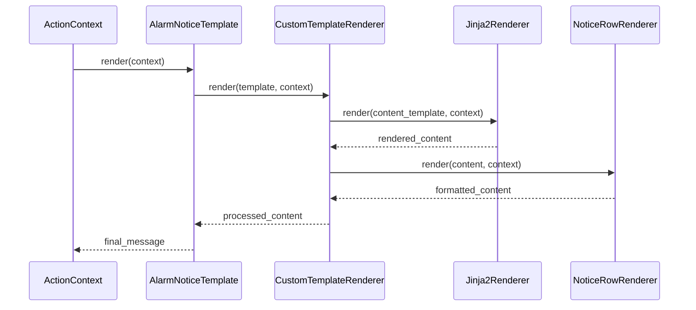
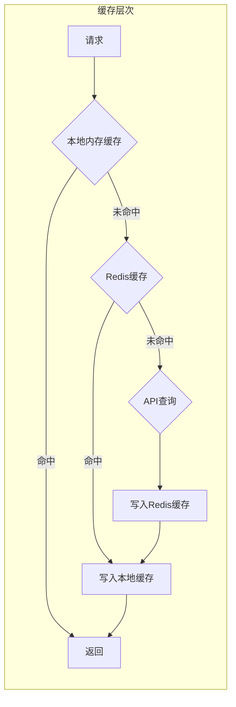
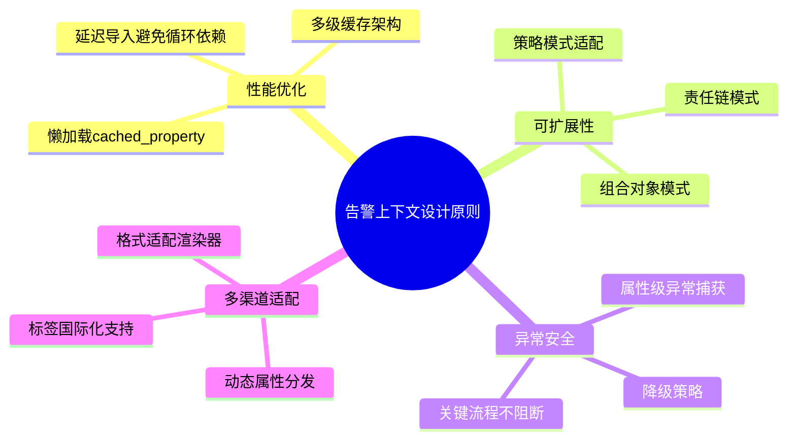
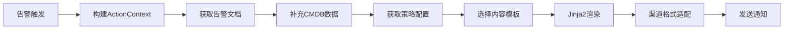
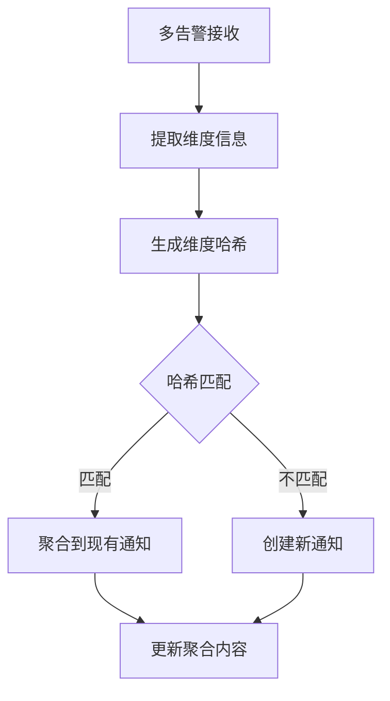

# 告警上下文构建模块学习文档

## 一、模块架构概览

告警上下文构建模块采用**组合对象模式**，通过分层构建上下文对象，实现告警信息的动态组装和模板渲染。



## 二、核心设计经验

### 1. 组合对象模式 - 层级上下文构建

**概念说明：**
通过组合模式构建树形对象结构，每个上下文对象持有父对象的引用，形成层级关系。这种设计使得属性可以跨层级访问，同时保持各模块的独立性和可测试性。

**代码示例：**

```python
# 基础上下文对象定义
class BaseContextObject:
    def __init__(self, parent):
        self.parent = parent  # 持有父对象引用

# 主上下文入口
class ActionContext:
    Fields = [
        "notice_way", "user_type", "notice_channel",
        "alerts_info", "alarm", "alert", "target",
        "content", "strategy", "business", "action_instance"
    ]

    # 通过cached_property延迟加载子上下文对象
    @cached_property
    def alarm(self):
        from .alarm import Alarm
        return Alarm(self)  # 将自身作为parent传入

    @cached_property
    def target(self):
        from .target import Target
        return Target(self)

    @cached_property
    def business(self):
        return self.target.business  # 跨层级访问属性
```

**应用场景：**
- 复杂领域模型的上下文构建
- 需要多层级数据聚合的场景
- 模板渲染时的动态数据获取

**注意事项：**
- 使用`cached_property`避免重复计算和重复对象创建
- 子对象创建时通过延迟导入避免循环依赖
- 父对象引用保持单向，避免形成循环引用

---

### 2. 懒加载属性设计 - cached_property深度应用

**概念说明：**
Django的`cached_property`装饰器实现属性值的惰性计算和缓存。首次访问时计算并缓存结果，后续访问直接返回缓存值，避免重复计算开销。

**代码示例：**

```python
from django.utils.functional import cached_property

class Alarm(BaseContextObject):
    # 简单懒加载：直接返回关联数据
    @cached_property
    def id(self):
        if self.parent.alert:
            return self.parent.alert.id
        return ""

    # 复杂懒加载：涉及多步计算
    @cached_property
    def dimension_string_list(self):
        if not self.display_dimensions:
            return []

        display_dimensions = copy.deepcopy(self.display_dimensions)
        dimension_lists = []

        if self.parent.alert.agg_dimensions:
            for dimension_key in self.parent.alert.agg_dimensions:
                dimension_key = dimension_key[5:] if dimension_key.startswith("tags.") else dimension_key
                dimension = display_dimensions.pop(dimension_key, None)
                if not dimension:
                    continue
                dimension_lists.append([
                    dimension.display_key or dimension_key,
                    dimension.display_value or dimension.value or "--"
                ])

        return dimension_lists

    # 带性能监控的懒加载
    @cached_property
    @context_field_timer  # 自定义装饰器记录耗时
    def anomaly_dimensions(self):
        if not self.parent.alert:
            return None
        result = DimensionDrillLightManager(
            self.parent.alert,
            ReadOnlyAiSetting(self.parent.alert.event["bk_biz_id"], self.ai_setting_config)
        ).fetch_aiops_result()
        return f"异常维度 {result['info']['anomaly_dimension_count']}"
```

**应用场景：**
- 计算开销大的属性（如涉及API调用、数据库查询）
- 可能不会被使用的属性（按需加载）
- 需要性能监控的关键属性

**注意事项：**
- `cached_property`与`property`的区别：前者缓存结果，后者每次调用都重新计算
- 不要在`cached_property`方法中修改对象状态
- 需要刷新缓存时，可删除属性：`del obj.attr`

---

### 3. 多渠道适配 - 动态属性分发机制

**概念说明：**
通过`__getattribute__`拦截属性访问，根据通知渠道类型动态返回适配的格式。这是一种策略模式的Pythonic实现。

**代码示例：**

```python
from collections import defaultdict
from django.utils.translation import gettext_lazy as _lazy

class DefaultContent(BaseContextObject):
    # 定义可适配的字段列表
    Fields = (
        "level", "time", "begin_time", "duration",
        "target_type", "data_source", "content", "biz",
        "target", "dimension", "detail", "current_value"
    )

    # 定义各渠道的标签映射
    Labels = {
        "begin_time": defaultdict(lambda: _lazy("首次异常")),
        "time": defaultdict(lambda: _lazy("最近异常"), {"mail": _lazy("时间范围")}),
        "level": defaultdict(lambda: _lazy("级别"), {"mail": _lazy("告警级别")}),
        "content": defaultdict(lambda: _lazy("内容"), {"mail": _lazy("告警内容")}),
        "detail": defaultdict(lambda: _lazy("详情"), {"sms": _lazy("告警ID")}),
    }

    def __getattribute__(self, item):
        """
        取值时自动获取相应通知类型的值
        """
        if item in object.__getattribute__(self, "Fields"):
            content_type = self.parent.notice_way

            # 将支持markdown的通知方式统一处理
            if self.parent.notice_way in settings.MD_SUPPORTED_NOTICE_WAYS:
                content_type = "markdown"

            # 尝试获取渠道特定实现
            if hasattr(self, f"{item}_{content_type}"):
                value = object.__getattribute__(self, f"{item}_{content_type}")
            else:
                value = super().__getattribute__(item)

            if value is None:
                return ""

            # 使用渲染器格式化输出
            return NoticeRowRenderer.format(content_type, self.Labels[item][content_type], value)

        return super().__getattribute__(item)

    # 短信特定实现
    @cached_property
    def detail_sms(self):
        return self.parent.alert.id

    # 邮件特定实现
    @cached_property
    def level_mail(self):
        return self.parent.alert.severity_display

    # Markdown特定实现
    @cached_property
    def detail_markdown(self):
        return None  # Markdown格式不显示详情链接
```

**应用场景：**
- 多渠道内容适配（邮件、微信、短信、钉钉等）
- 多格式输出适配（HTML、Markdown、纯文本）
- 需要保持统一接口但输出不同的场景

**注意事项：**
- `__getattribute__`是Python属性访问的最底层方法，需谨慎使用
- 使用`object.__getattribute__`避免无限递归
- 每个渠道特定的方法命名遵循`{field}_{channel}`格式

---

### 4. 模板渲染责任链模式

**概念说明：**
通知模板渲染采用责任链模式，多个渲染器依次处理内容。每个渲染器专注于特定职责，可以灵活组合和扩展。



**代码示例：**

```python
class AlarmNoticeTemplate:
    """
    通知模板 - 使用责任链模式组合多个渲染器
    """

    Renderers = [
        CustomTemplateRenderer,  # 自定义模板处理
        Jinja2Renderer,          # Jinja2语法渲染
    ]

    def __init__(self, template_path=None, template_content=None):
        if template_path:
            self.template = self.get_template_source(template_path)
        elif template_content is not None:
            self.template = template_content
        else:
            self.template = ""

    def render(self, context):
        template_message = self.template
        # 责任链：依次通过各渲染器
        for renderer in self.Renderers:
            template_message = renderer.render(template_message, context)

        return template_message.replace("\\n", "\n").replace("\\t", "\t")

class CustomTemplateRenderer:
    @staticmethod
    def render(content, context):
        try:
            content_template = Jinja2Renderer.render(
                context.get("content_template") or "", context
            )
        except Exception as error:
            # 异常处理：降级到默认模板
            logger.error(f"render content failed: {error}")
            content_template = Jinja2Renderer.render(
                context.get("default_content_template") or "", context
            )

        # 使用行渲染器格式化
        alarm_content = NoticeRowRenderer.render(content_template, context)
        context["user_content"] = alarm_content
        return content

class Jinja2Renderer:
    @staticmethod
    def render(content, context):
        notice_way = context.get("notice_way")
        # Markdown渠道启用自动转义
        autoescape = notice_way in settings.MD_SUPPORTED_NOTICE_WAYS

        return (
            jinja2_environment(autoescape=autoescape)
            .from_string(content)
            .render({"json": json, "re": re, "arrow": arrow, **context})
        )
```

**应用场景：**
- 复杂内容的分步处理
- 需要支持多种模板语法
- 处理流程需要灵活配置和扩展

**注意事项：**
- 每个渲染器返回处理后的内容给下一个渲染器
- 需要设计统一的渲染器接口
- 异常处理要考虑责任链中的位置

---

### 5. CMDB数据补充 - 多级缓存架构

**概念说明：**
CMDB数据补充采用多级缓存架构：本地内存缓存 -> Redis分布式缓存 -> API实时查询。这种设计在保证数据实时性的同时，最大限度减少API调用。



**代码示例：**

```python
# CMDB缓存基类设计
class CMDBCacheManager(ABC):
    cache = Cache("cache-cmdb")  # Redis缓存实例
    cache_type: str  # 缓存类型标识
    CACHE_TIMEOUT = 60 * 60 * 24 * 7  # 7天过期

    @classmethod
    def get_cache_key(cls, bk_tenant_id: str) -> str:
        return f"{bk_tenant_id}.cache.cmdb.{cls.cache_type}"

    @classmethod
    @abstractmethod
    def get(cls, *args, **kwargs) -> Any:
        raise NotImplementedError

# 主机缓存管理器 - 多级缓存实现
class HostManager(CMDBCacheManager):
    cache_type = "host"

    @classmethod
    def get(cls, *, bk_tenant_id: str, ip: str, bk_cloud_id: int = 0,
            using_mem: bool = False, using_api: bool = False) -> Host | None:
        if not ip:
            return None

        host_key = cls.get_host_key(ip, bk_cloud_id)
        cache_key = f"{cls.get_cache_key(bk_tenant_id=bk_tenant_id)}.{host_key}"

        # 第一级：本地内存缓存
        if using_mem:
            host = local.host_cache.get(cache_key, None)
            if host is not None:
                return host

        # 第二级：Redis缓存
        host = cls._get(bk_tenant_id=bk_tenant_id, ip=ip, bk_cloud_id=bk_cloud_id)

        # 第三级：API穿透查询
        if host is None and using_api:
            logger.info("[HostManager] get host(%s) by api start", host_key)
            try:
                host_page = api.cmdb.get_host_without_biz_v2(
                    bk_tenant_id=bk_tenant_id, ips=[ip], bk_cloud_id=[bk_cloud_id], limit=1
                )
                host = Host(host_page["hosts"][0])
                cls.fill_attr_to_hosts(host.bk_biz_id, [host])
            except Exception as e:
                logger.info("[HostManager] get host(%s) by api failed: %s", host_key, str(e))

        # 回写本地缓存
        if using_mem and host:
            local.host_cache[cache_key] = host

        return host

# Target上下文使用缓存
class Target(BaseContextObject):
    @cached_property
    def host(self):
        if not self.parent.alert:
            return

        event = self.parent.alert.event

        try:
            if event.bk_host_id:
                result = HostManager.get_by_id(
                    bk_tenant_id=event.bk_tenant_id,
                    bk_host_id=event.bk_host_id
                )
            else:
                result = HostManager.get(
                    bk_tenant_id=event.bk_tenant_id,
                    ip=event.ip,
                    bk_cloud_id=event.bk_cloud_id
                )
        except Exception:
            return

        if result:
            # 补充拓扑信息
            result.operator_string = ",".join(result.operator)
            module_names = set()
            set_names = set()
            for topo_id, topo_link in result.topo_link.items():
                if topo_id.startswith("module|") and topo_link:
                    module_names.add(topo_link[0].bk_inst_name)
                    set_names.add(topo_link[1].bk_inst_name)
            result.module_string = ",".join(module_names)
            result.set_string = ",".join(set_names)

        return result
```

**应用场景：**
- 高频访问的外部数据查询
- 需要补充业务上下文信息的场景
- 分布式系统的数据共享

**注意事项：**
- 本地缓存需要在请求结束后清理，避免内存泄漏
- Redis缓存设置合理的过期时间
- API穿透要有日志监控，防止大量穿透

---

### 6. 告警维度处理 - 维度聚合与展示

**概念说明：**
告警维度处理实现维度的去重、排序、格式化和展示适配。通过维度聚合键生成唯一标识，支持同维度告警的汇总。

**代码示例：**

```python
class Alarm(BaseContextObject):
    @cached_property
    def display_dimensions(self):
        """
        非目标维度：用于展示的维度信息
        """
        dedupe_fields = ["alert_name", "strategy_id", "target_type", "target", "bk_biz_id"]
        return {
            d.key: d
            for d in self.new_dimensions.values()
            if d.key not in dedupe_fields
        }

    @cached_property
    def dimension_string_list(self):
        """
        维度字符串列表：按优先级排序的维度展示
        """
        if not self.display_dimensions:
            return []

        display_dimensions = copy.deepcopy(self.display_dimensions)
        dimension_lists = []

        # 优先使用聚合维度顺序
        if self.parent.alert.agg_dimensions:
            for dimension_key in self.parent.alert.agg_dimensions:
                dimension_key = dimension_key[5:] if dimension_key.startswith("tags.") else dimension_key
                dimension = display_dimensions.pop(dimension_key, None)
                if not dimension:
                    continue
                dimension_lists.append([
                    dimension.display_key or dimension_key,
                    dimension.display_value or dimension.value or "--"
                ])

        # 剩余维度添加到最后
        for dimension_key, dimension in display_dimensions.items():
            dimension_lists.append([
                dimension.display_key or dimension_key,
                dimension.display_value or dimension.value or "--"
            ])

        # 根据通知方式调整分隔符
        sep = "="
        if self.parent.notice_way in settings.MD_SUPPORTED_NOTICE_WAYS:
            sep = ": "
            for dimension_list in dimension_lists:
                value = str(dimension_list[1]).strip()
                if value.startswith("http://") or value.startswith("https://"):
                    dimension_list[1] = f"[{value}]({value})"

        return [f"{k}{sep}{v}" for k, v in sorted(dimension_lists, key=lambda x: x[0])]

class Converge(BaseContextObject):
    @cached_property
    def dimensions(self):
        """
        维度哈希：用于同维度告警聚合的键
        """
        if self.parent.action.dimension_hash:
            return self.parent.action.dimension_hash

        order_dimensions = {}
        try:
            dimensions_dict = {
                d["key"]: d["value"]
                for d in self.parent.alert.common_dimensions
                if d.get("value")
            }
            order_dimensions = OrderedDict(sorted(dimensions_dict.items()))
        except BaseException as error:
            logger.info("get dimensions ctx error %s", str(error))

        return count_md5(order_dimensions)  # 使用MD5生成唯一键
```

**应用场景：**
- 告警聚合和收敛
- 多维度数据的展示格式化
- 唯一标识生成

**注意事项：**
- 维度排序保证一致性
- 维度哈希需要考虑维度值的稳定性
- 不同渠道的维度展示格式需要适配

---

### 7. 异常安全处理与降级策略

**概念说明：**
告警上下文构建过程中涉及大量外部数据获取，需要完善的异常处理和降级策略。设计原则是：宁可返回空值，也不要阻断告警流程。

**代码示例：**

```python
class ActionContext:
    def get_dictionary(self):
        """
        构建完整上下文字典：异常安全处理
        """
        result = {}
        for field in self.Fields:
            try:
                result[field] = getattr(self, field)
            except Exception as e:
                result[field] = None  # 异常时返回None，不阻断流程
                action_id = self.action.id if self.action else "NULL"
                alert_id = self.alert.id if self.alert else "NULL"
                logger.debug(f"action({action_id})|alert({alert_id}) create context field({field}) error, {e}")
        return result

class CustomTemplateRenderer:
    @staticmethod
    def render(content, context):
        try:
            content_template = Jinja2Renderer.render(
                context.get("content_template") or "", context
            )
        except Exception as error:
            # 模板渲染异常：降级到默认模板
            logger.error(f"render content failed: {error}")
            error_info = _("用户配置的通知模板渲染失败，默认使用系统内置模板")
            content_template = Jinja2Renderer.render(
                context.get("default_content_template") or "", context
            )
            content_template += "\n" + NoticeRowRenderer().format(
                context.get("notice_way"),
                title=_("备注"),
                content=error_info
            )

        alarm_content = NoticeRowRenderer.render(content_template, context)
        context["user_content"] = alarm_content
        return content
```

**应用场景：**
- 外部数据获取
- 复杂计算流程
- 需要保证系统稳定性的关键路径

**注意事项：**
- 异常处理粒度要细化到单个属性
- 异常日志要包含关键上下文信息
- 降级策略要有明确的用户提示

---

### 8. 图表渲染 - 异步渲染与资源管理

**概念说明：**
告警图表渲染使用Playwright/pyppeteer进行异步HTML渲染，通过临时文件和事件循环管理，实现高性能的图表图片生成。

**代码示例：**

```python
import asyncio
import tempfile
import base64
from django.template.loader import get_template

async def render_html(html_file_path: str) -> bytes | None:
    """
    异步渲染HTML为图片
    """
    browser = await get_browser()

    page = await browser.newPage()
    await page.goto(f"file://{html_file_path}")
    await page.setViewport({"width": 1520, "height": 635})

    # 等待动画完成
    await asyncio.sleep(0.03)

    panel = await page.querySelector(".chart-contain")
    if not panel:
        return b""

    img_bytes = await panel.screenshot({"type": "jpeg", "quality": 90})

    # 资源清理
    try:
        await page.close()
    except Exception as e:
        logger.exception(f"close page error: {e}")

    return img_bytes

def get_chart_image(chart_data) -> str:
    """
    图表图片生成：使用临时文件和异步渲染
    """
    try:
        template = get_template("image_exporter/graph.html")
        html_string = template.render({"context": json.dumps(chart_data)})

        # 使用临时文件
        with tempfile.NamedTemporaryFile(
            prefix="tmp_chart_image_",
            suffix=".html"
        ) as f:
            f.write(html_string.encode("utf-8"))
            f.flush()

            loop = get_or_create_eventloop()
            img_bytes = loop.run_until_complete(render_html(f.name))

            if not img_bytes:
                return ""

            return base64.b64encode(img_bytes).decode("utf-8")
    except Exception as e:
        logger.exception(f"get_chart_image fail: {e}")
        return ""
```

**应用场景：**
- 报表图片生成
- 需要浏览器渲染的内容
- 异步任务与同步代码的集成

**注意事项：**
- 临时文件使用后自动清理
- 事件循环需要单例管理
- 异步异常要正确捕获和记录

---

## 三、最佳实践总结

### 设计原则



### 关键技术点

| 技术 | 应用场景 | 优势 |
|------|----------|------|
| cached_property | 惰性属性计算 | 避免重复计算，减少内存占用 |
| __getattribute__拦截 | 多渠道动态适配 | 统一接口，灵活输出 |
| 责任链模式 | 模板渲染流程 | 易于扩展，职责清晰 |
| 多级缓存 | CMDB数据补充 | 高性能，低API压力 |
| OrderedDict + MD5 | 维度哈希 | 保证聚合键稳定性 |

### 避坑指南

1. **循环依赖问题**：使用延迟导入解决模块间的循环依赖
2. **属性访问递归**：`__getattribute__`必须使用`object.__getattribute__`获取原始值
3. **缓存穿透风险**：多级缓存需要API穿透的监控和限制
4. **异常阻断流程**：关键路径的异常要有降级策略
5. **内存泄漏**：本地缓存需要在请求结束时清理

---

## 四、典型应用场景示例

### 场景1：告警通知内容生成



### 场景2：同维度告警聚合



---

## 五、核心文件路径

- `alarm_backends/core/context/__init__.py` - ActionContext主入口
- `alarm_backends/core/context/alarm.py` - Alarm告警信息对象
- `alarm_backends/core/context/target.py` - Target目标对象
- `alarm_backends/core/context/content.py` - Content通知内容对象
- `alarm_backends/core/context/utils.py` - 工具函数和渲染器
- `alarm_backends/core/cache/cmdb/` - CMDB缓存管理器