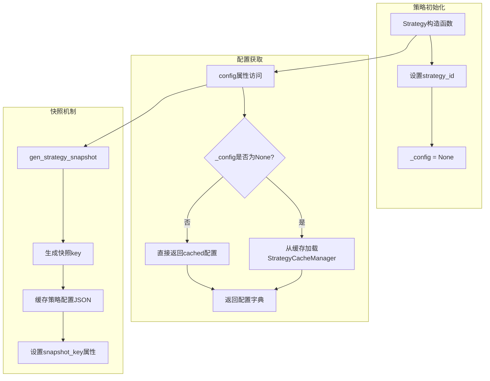
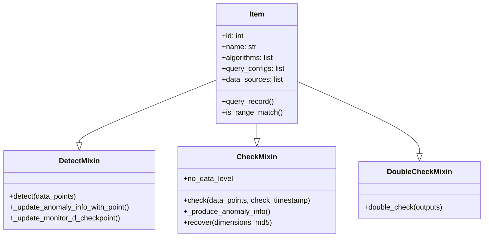
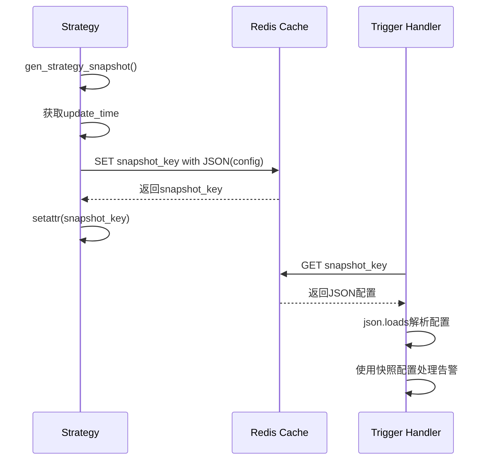
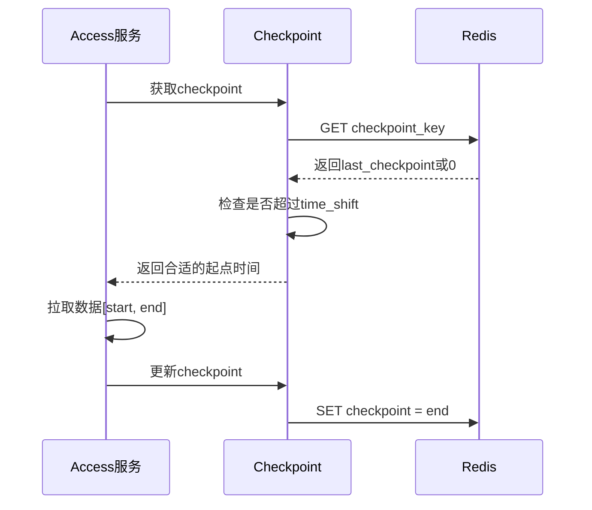
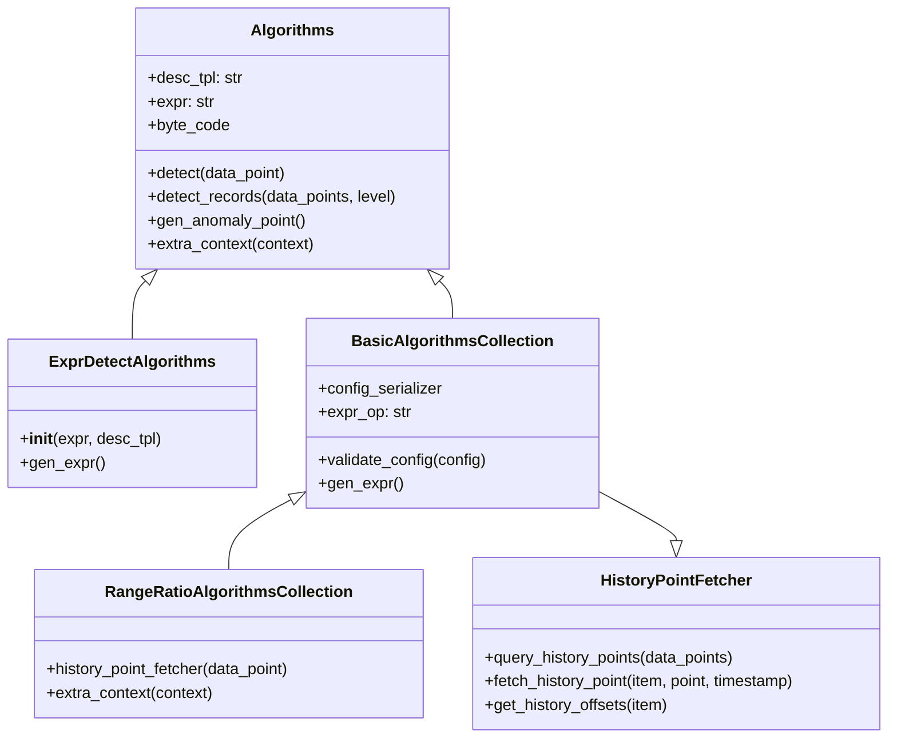
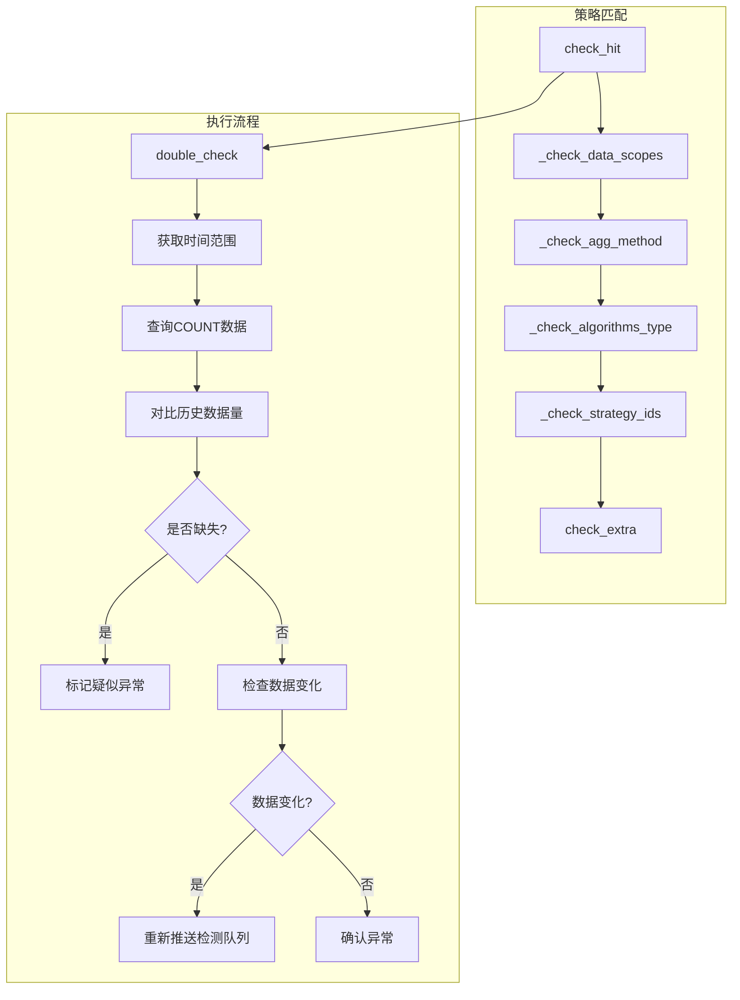
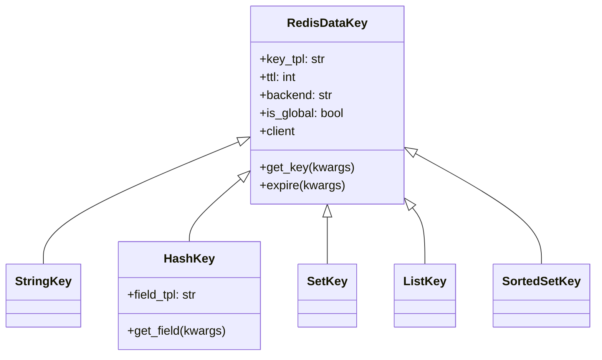

# 策略控制模块编程经验学习文档

## 一、策略配置管理机制

### 1.1 核心概念

Strategy 类采用了**延迟加载 + 快照机制**的设计模式，实现了策略配置的高效管理和版本控制。



### 1.2 设计亮点分析

**代码示例 - 延迟加载模式:**

```python
# 文件: alarm_backends/core/control/strategy.py
class Strategy:
    def __init__(self, strategy_id, default_config=None):
        self.id = self.strategy_id = strategy_id
        self._config = default_config  # 延迟加载：初始时不加载配置

    @property
    def config(self) -> dict:
        if self._config is None:
            # 首次访问时从缓存加载
            self._config = StrategyCacheManager.get_strategy_by_id(self.strategy_id) or {}
        return self._config
```

**设计优势:**
- **性能优化**: 避免不必要的数据库/缓存查询
- **内存效率**: 只在实际需要时才占用内存
- **灵活初始化**: 支持预置配置（测试场景）和自动加载两种模式

### 1.3 cached_property 高效缓存模式

```python
# 文件: alarm_backends/core/control/strategy.py
from django.utils.functional import cached_property

class Strategy:
    @cached_property
    def bk_tenant_id(self) -> str:
        return bk_biz_id_to_bk_tenant_id(self.bk_biz_id)

    @cached_property
    def items(self) -> list[Item]:
        results = []
        item_list = self.config.get("items") or []
        for item_config in item_list:
            results.append(Item(item_config, self))
        return results
```

**应用场景:**
- 多次访问但计算逻辑固定的属性
- 涉及数据库查询或复杂计算的属性
- 需要保持数据一致性的属性

**注意事项:**
- `cached_property` 是实例级别的缓存，每个实例独立缓存
- 不可用于需要动态更新的属性
- 在高并发场景下确保计算逻辑无副作用

---

## 二、检测项的设计模式

### 2.1 多重继承 + Mixin 组合模式

Item 类采用了 **Mixin 组合模式**，实现了功能模块化和解耦。



**代码示例:**

```python
# 文件: alarm_backends/core/control/item.py
class Item(DetectMixin, CheckMixin, DoubleCheckMixin):
    def __init__(self, item_config: dict, strategy):
        self.id = item_config.get("id")
        self.name = item_config.get("name")
        self.algorithms = item_config.get("algorithms", [])
        self.query_configs = item_config.get("query_configs", [])
        # ... 其他属性初始化

        # 动态构建数据源
        for query_config in self.query_configs:
            data_source_class = load_data_source(
                query_config["data_source_label"],
                query_config["data_type_label"]
            )
            self.data_sources.append(
                data_source_class.init_by_query_config(
                    query_config=query_config,
                    name=self.name,
                    bk_biz_id=self.strategy.bk_biz_id,
                )
            )
```

### 2.2 设计优势分析

| 特性 | 传统继承 | Mixin组合 |
|------|---------|----------|
| 功能扩展 | 需要修改基类 | 直接添加新Mixin |
| 代码复用 | 单继承链限制 | 可组合多个Mixin |
| 维护成本 | 高（基类臃肿） | 低（模块独立） |
| 测试难度 | 基类测试影响大 | 每个Mixin独立测试 |

**注意事项:**
- Mixin 类不应有独立实例化能力
- Mixin 方法应避免与其他Mixin命名冲突
- 继承顺序影响方法解析顺序（MRO）

---

## 三、策略快照机制

### 3.1 快照机制核心流程



### 3.2 快照Key设计

**代码示例:**

```python
# 文件: alarm_backends/core/control/strategy.py
def gen_strategy_snapshot(self):
    """
    创建当前策略配置缓存快照，返回快照存储的key
    """
    # 基于策略更新时间，判断策略是否有变更
    client = key.STRATEGY_SNAPSHOT_KEY.client
    update_time = self.config.get("update_time")
    snapshot_key = key.STRATEGY_SNAPSHOT_KEY.get_key(
        strategy_id=self.id,
        update_time=update_time
    )
    client.set(snapshot_key, json.dumps(self.config), ex=CONST_ONE_HOUR)
    setattr(self, "snapshot_key", snapshot_key)
    return snapshot_key
```

**Key设计特点:**

```python
# 文件: alarm_backends/core/cache/key.py
STRATEGY_SNAPSHOT_KEY = register_key_with_config({
    "label": "[detect]异常检测使用的策略快照",
    "key_type": "string",
    "key_tpl": "cache.strategy.snapshot.{strategy_id}.{update_time}",
    "ttl": CONST_ONE_HOUR,  # 1小时过期
    "backend": "service",
})
```

### 3.3 快照机制优势

| 优势 | 说明 |
|------|------|
| **版本控制** | update_time作为key的一部分，天然支持版本区分 |
| **数据一致性** | 告警处理使用固定版本配置，不受配置变更影响 |
| **内存效率** | 仅缓存当前使用的配置，过期自动清理 |
| **追溯能力** | 可通过快照key追溯历史配置 |

---

## 四、数据源抽象设计

### 4.1 工厂模式 + 多态设计

```mermaid
flowchart TB
    subgraph 工厂加载
        A[load_data_source] --> B[data_source_mapping字典]
        B --> C[返回对应DataSource类]
    end

    subgraph 数据源类型
        D[BkMonitorTimeSeriesDataSource]
        E[BkMonitorLogDataSource]
        F[CustomEventDataSource]
        G[LogSearchLogDataSource]
        H[PrometheusTimeSeriesDataSource]
        I[...其他数据源]
    end

    subgraph 初始化流程
        C --> J[init_by_query_config]
        J --> K[解析query_config]
        K --> L[构建数据源实例]
    end

    A --> {D,E,F,G,H,I}
```

### 4.2 工厂模式实现

**代码示例:**

```python
# 文件: bkmonitor/data_source/data_source/__init__.py
def load_data_source(data_source_label: str, data_type_label: str) -> type[DataSource]:
    """
    加载对应的DataSource - 工厂模式
    """
    data_sources = [
        BkMonitorTimeSeriesDataSource,
        BkMonitorLogDataSource,
        BkMonitorEventDataSource,
        BkdataTimeSeriesDataSource,
        CustomEventDataSource,
        CustomTimeSeriesDataSource,
        LogSearchLogDataSource,
        LogSearchTimeSeriesDataSource,
        BkMonitorAlertDataSource,
        BkFtaAlertDataSource,
        BkFtaEventDataSource,
        BkApmTraceDataSource,
        BkApmTraceTimeSeriesDataSource,
        PrometheusTimeSeriesDataSource,
    ]

    # 使用元组作为key，实现二维映射
    data_source_mapping = {
        (data_source.data_source_label, data_source.data_type_label): data_source
        for data_source in data_sources
    }

    return data_source_mapping[(data_source_label, data_type_label)]
```

### 4.3 统一查询接口

```python
# 文件: bkmonitor/data_source/unify_query/query.py
class UnifyQuery:
    """
    统一查询模块 - 针对不同数据源的统一查询接口
    """
    def __init__(
        self,
        bk_biz_id: int | None,
        data_sources: list[DataSource],
        expression: str,
        functions: list | None = None,
        bk_tenant_id: str | None = None,
    ):
        self.bk_biz_id = bk_biz_id
        self.data_sources = data_sources
        self.expression = expression

        # 设置租户ID
        for data_source in self.data_sources:
            data_source.set_bk_tenant_id(bk_tenant_id)
```

---

## 五、查询配置动态管理

### 5.1 查询配置预处理流程


### 5.2 查询MD5分组机制

```python
# 文件: alarm_backends/core/cache/strategy.py
@classmethod
def get_query_md5(cls, bk_biz_id: int, item: dict) -> str:
    """
    生成监控项查询MD5 - 用于策略分组
    """
    item = copy.deepcopy(item)

    configs = []
    for query_config in item["query_configs"]:
        params = {
            "bk_biz_id": int(bk_biz_id),
            "data_source_label": query_config["data_source_label"],
            "data_type_label": query_config["data_type_label"],
            "agg_method": query_config.get("agg_method"),
            "agg_interval": query_config.get("agg_interval"),
            # ... 其他参数
        }
        configs.append(params)

    return count_md5(
        configs[0] if len(configs) == 1
        else {"expression": item["expression"], "query_configs": configs}
    )
```

**应用场景:**
- 相同查询条件的策略合并处理
- 减少重复数据拉取
- 提高系统处理效率

---

## 六、Checkpoint检测点管理

### 6.1 Checkpoint核心设计



### 6.2 Checkpoint实现

```python
# 文件: alarm_backends/core/control/checkpoint.py
class Checkpoint(object):
    def __init__(self, strategy_group_key, client=None):
        self.strategy_group_key = strategy_group_key
        self.client = client or key.STRATEGY_CHECKPOINT_KEY.client

    @cached_property
    def _key(self):
        return key.STRATEGY_CHECKPOINT_KEY.get_key(
            strategy_group_key=self.strategy_group_key
        )

    def get(self, min_last_checkpoint=0, interval=60):
        """
        获取监控最后一个处理时间

        策略:
            - 当第一次拉取或距离上一次超过最小值，以最小值为准
            - 其他情况则以缓存中的checkpoint为准
        """
        now = int(time.time())
        last_check_point = int(self.client.get(self._key) or 0)
        time_shift = settings.MIN_DATA_ACCESS_CHECKPOINT

        # 大周期策略需要更大的时间窗口
        if interval > 300:
            time_shift = max([interval * 5, settings.MIN_DATA_ACCESS_CHECKPOINT])

        if (now - last_check_point) > time_shift:
            return max(min_last_checkpoint, now - time_shift)
        return last_check_point
```

### 6.3 Checkpoint Key设计

```python
# 文件: alarm_backends/core/cache/key.py
STRATEGY_CHECKPOINT_KEY = register_key_with_config({
    "label": "[access]策略数据拉取到的最后一条数据的时间",
    "key_type": "string",
    "key_tpl": "checkpoint.strategy_group_{strategy_group_key}",
    "ttl": CONST_ONE_HOUR,
    "backend": "service",
})

LAST_CHECKPOINTS_CACHE_KEY = register_key_with_config({
    "label": "[detect|nodata]最后检测时间点",
    "key_type": "hash",
    "key_tpl": "detect.last.checkpoint.{strategy_id}.{item_id}",
    "ttl": TTL_NOT_SET,
    "backend": "service",
    "field_tpl": "detect.result.{dimensions_md5}.{level}",
})
```

---

## 七、检测算法策略模式

### 7.1 算法类继承体系



### 7.2 算法动态加载机制

```python
# 文件: alarm_backends/core/control/mixins/detect.py
def load_detector_cls(_type) -> type["BasicAlgorithmsCollection"]:
    """
    动态加载检测算法类 - 命名约定映射
    """
    algorithms_target = camel_to_underscore(_type)  # Threshold -> threshold
    package_name = "alarm_backends.service.detect"
    cls_target = f"{package_name}.strategy.{algorithms_target}.{_type}"
    try:
        cls = import_string(cls_target)
    except ImportError:
        logger.error(f"detector load error: {cls_target}")
        cls = None
    return cls
```

### 7.3 表达式检测核心

```python
# 文件: alarm_backends/service/detect/strategy/__init__.py
class Algorithms:
    """检测算法基类"""

    def __init__(self):
        self.expr = self.gen_expr()
        self.byte_code = compile(self.expr, "<string>", "eval")  # 预编译

    def _detect(self, data_point):
        context = self.get_context(data_point)
        return eval(self.byte_code, {}, context)  # 执行预编译表达式

    def detect(self, data_point):
        if self._detect(data_point):
            anomaly_point = AnomalyDataPoint(data_point=data_point, detector=self)
            anomaly_point.anomaly_message = self._format_message(data_point)
            return [anomaly_point]
```

---

## 八、二次确认策略模式

### 8.1 DoubleCheckStrategy设计



### 8.2 策略注册机制

```python
# 文件: alarm_backends/core/control/mixins/double_check.py
@dataclass
class DoubleCheckStrategy(Protocol):
    """二次确认策略协议"""

    name: ClassVar[str]
    item: "Item"
    match_strategy_ids: List[int]
    data_scopes: ClassVar[List[Tuple[str, str]]]
    match_agg_method: ClassVar[Optional[str]]
    match_algorithms_type_sequence: ClassVar[List[str]]

    def check_hit(self) -> bool:
        """检查是否命中"""
        if not self._check_data_scopes():
            return False
        if not self._check_agg_method():
            return False
        if not self._check_algorithms_type():
            return False
        return self.check_extra()

# 全局策略注册表
_strategies: Dict[str, Type[DoubleCheckStrategy]] = {}

def register_double_check_strategy(strategy: Type[DoubleCheckStrategy]):
    """注册二次确认策略"""
    if strategy.name in _strategies:
        return
    _strategies[strategy.name] = strategy
```

---

## 九、Redis Key设计规范

### 9.1 Key类型封装体系



### 9.2 Key配置化注册

```python
# 文件: alarm_backends/core/cache/key.py
def register_key_with_config(config):
    """
    支持的类型：hash、set、list、sorted_set
    通过配置字典动态创建Key对象
    """
    key_type = config["key_type"]
    key_cls = globals().get(f"{underscore_to_camel(key_type)}Key")
    return key_cls(**config)

# Key定义示例
CHECK_RESULT_CACHE_KEY = register_key_with_config({
    "label": "[detect]检测结果缓存",
    "key_type": "sorted_set",
    "key_tpl": "{KEY_PREFIX}.detect.result.{strategy_id}.{item_id}.{dimensions_md5}.{level}",
    "ttl": int(settings.CHECK_RESULT_TTL_HOURS) * CONST_ONE_HOUR,
    "backend": "service",
})
```

---

## 十、最佳实践总结

### 10.1 设计模式应用一览

| 模式 | 应用位置 | 核心价值 |
|------|---------|---------|
| **延迟加载** | Strategy.config | 减少不必要查询，提高性能 |
| **Mixin组合** | Item类 | 功能模块化，易于扩展维护 |
| **工厂模式** | load_data_source | 解耦数据源类型，支持动态扩展 |
| **策略模式** | 检测算法类 | 算法可插拔，支持灵活配置 |
| **快照模式** | gen_strategy_snapshot | 配置版本控制，数据一致性 |
| **注册表模式** | DoubleCheckStrategy | 策略动态注册，灰度控制 |

### 10.2 性能优化技巧

```python
# 1. cached_property 避免重复计算
@cached_property
def expensive_property(self):
    return self._compute_expensive_value()

# 2. Pipeline批量操作
pipeline = cls.cache.pipeline()
for strategy in strategies:
    pipeline.set(key, value, ttl)
pipeline.execute()

# 3. 预编译表达式
self.byte_code = compile(self.expr, "<string>", "eval")

# 4. 分批处理
for chunked_points in chunks(list(points.items()), 5000):
    client.hmset(key, chunked_points)
```

### 10.3 扩展性设计原则

1. **配置驱动**: 通过配置字典定义行为（如Key注册、算法加载）
2. **命名约定**: 通过类名映射到模块路径（camel_to_underscore）
3. **协议定义**: 使用Protocol/dataclass定义接口规范
4. **白名单控制**: 通过配置白名单管理灰度策略

---

## 十一、核心文件路径

- `alarm_backends/core/control/strategy.py` - 策略配置管理
- `alarm_backends/core/control/item.py` - 检测项设计
- `alarm_backends/core/control/checkpoint.py` - 检测点管理
- `alarm_backends/core/control/mixins/detect.py` - 检测Mixin
- `alarm_backends/core/control/mixins/check.py` - 校验Mixin
- `alarm_backends/core/control/mixins/double_check.py` - 二次确认Mixin
- `alarm_backends/core/cache/strategy.py` - 策略缓存管理
- `alarm_backends/core/cache/key.py` - Redis Key定义