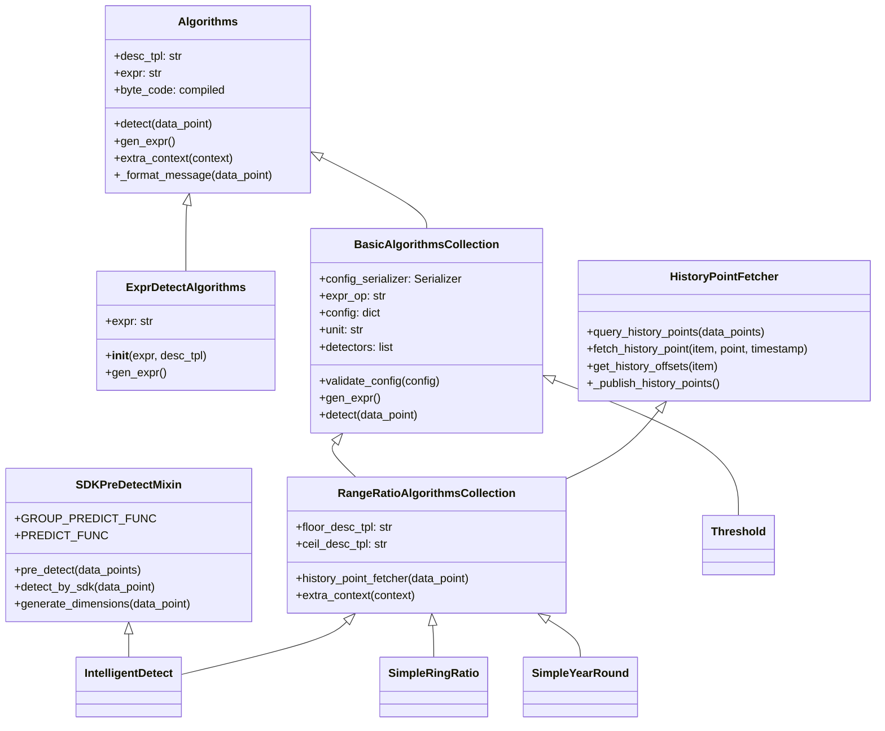
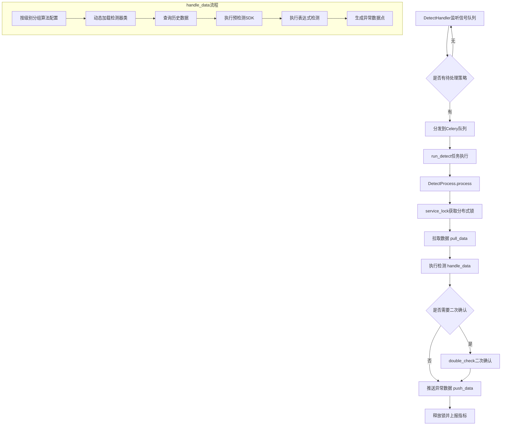
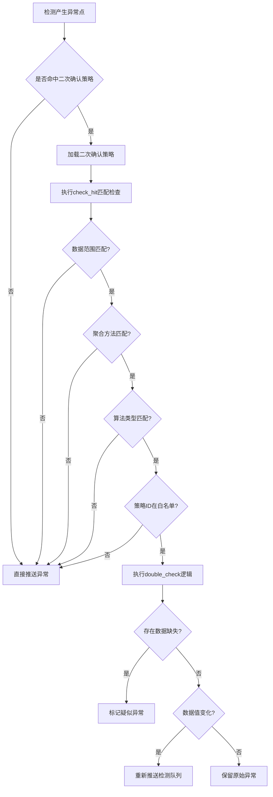
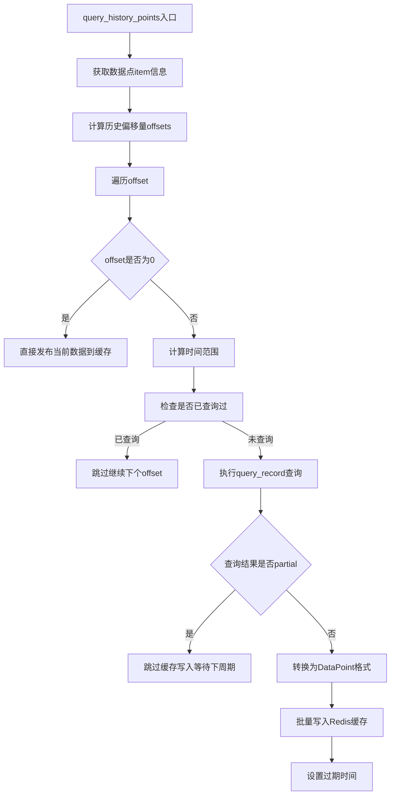
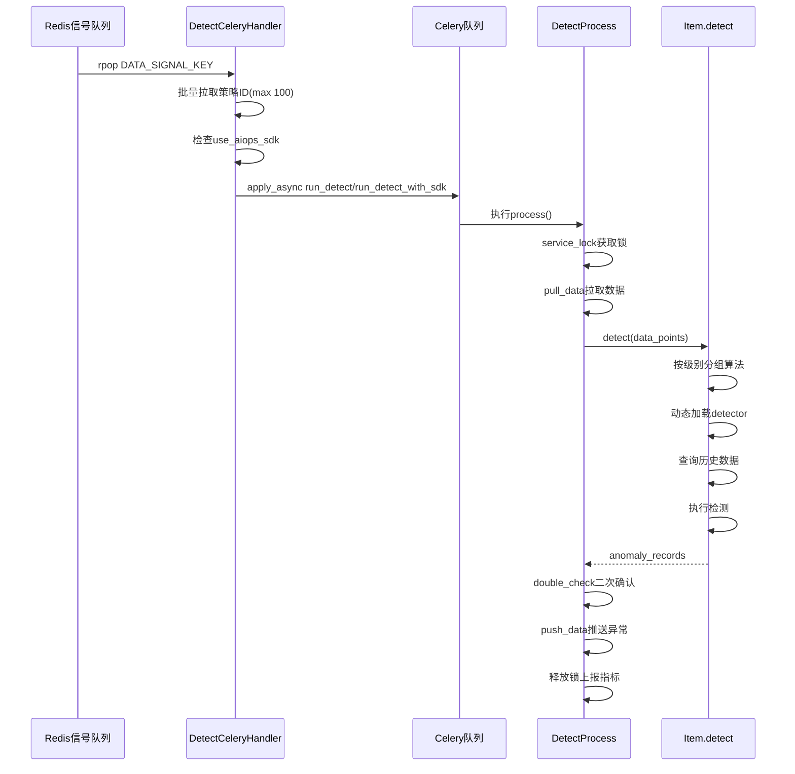
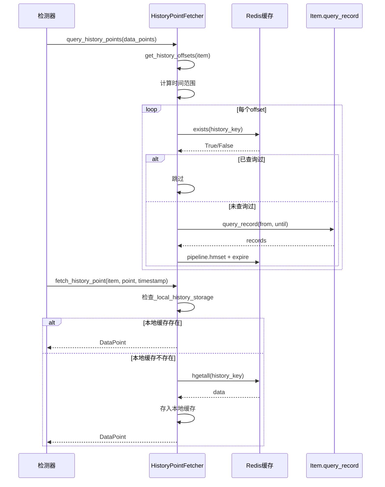

# 检测模块学习文档

基于对 `alarm_backends/service/detect` 目录的深入分析，以下是值得学习的编程经验和最佳实践。

---

## 一、异常检测算法架构设计

### 1.1 分层继承体系

检测算法采用分层继承设计，通过基类定义核心行为，子类实现具体逻辑：



**核心文件路径**：
- `alarm_backends/service/detect/core.py` - 算法基类定义
- `alarm_backends/service/detect/strategy/__init__.py` - 策略模块入口

**设计亮点**：
- **表达式驱动检测**：通过生成Python表达式并编译为字节码执行，实现灵活的检测逻辑
- **模板渲染消息**：使用Django模板系统渲染告警描述，支持动态内容

**代码示例 - 表达式编译执行**：

```python
# core.py
def __init__(self):
    self.expr = self.gen_expr()
    self.byte_code = compile(self.expr, "<string>", "eval")

def _detect(self, data_point):
    context = self.get_context(data_point)
    if "__debug__" not in data_point.as_dict():
        return eval(self.byte_code, {}, context)
    # debug模式下的异常捕获和日志输出
```

**应用场景**：需要灵活配置检测规则的监控系统、规则引擎系统

**注意事项**：
- `eval` 执行需确保表达式来源可信，避免安全风险
- 使用 `compile` 预编译表达式可提升性能

---

### 1.2 阈值检测算法实现

**文件路径**：`alarm_backends/service/detect/strategy/threshold.py`

阈值算法通过组合 `AndThreshold` 和 `Threshold` 实现多层级的逻辑组合：

```python
# threshold.py
class AndThreshold(BasicAlgorithmsCollection):
    config_serializer = ThresholdSerializer.AndSerializer
    expr_op = "and"  # 同级别算法AND连接

    def gen_expr(self):
        expr_list = []
        tpl_list = []
        for t_config in self.validated_config:
            method = t_config["method"]
            threshold = t_config["threshold"]
            comp = THRESHOLD_ALLOWED_METHODS[method]
            # 动态生成表达式：unit_convert_min(value, unit) >= threshold
            expr_list.append(
                f"unit_convert_min(value, unit) {comp} unit_convert_min({threshold}, unit, algorithm_unit)"
            )

        for args in zip(expr_list, tpl_list):
            yield ExprDetectAlgorithms(*args)

class Threshold(AndThreshold):
    expr_op = "or"  # 不同阈值组OR连接

    def gen_expr(self):
        for t_config in self.validated_config:
            # 每个t_config对应一个AndThreshold实例
            yield AndThreshold(t_config, self.unit)
```

**设计亮点**：
- **嵌套组合模式**：Threshold包含多个AndThreshold，实现 `(A1 AND A2) OR (B1 AND B2)` 逻辑
- **单位转换函数**：`unit_convert_min` 统一处理不同单位比较

---

### 1.3 环比/同比算法实现

**文件路径**：
- `alarm_backends/service/detect/strategy/simple_ring_ratio.py`
- `alarm_backends/service/detect/strategy/simple_year_round.py`
- `alarm_backends/service/detect/strategy/advanced_ring_ratio.py`
- `alarm_backends/service/detect/strategy/advanced_year_round.py`

```python
# core.py - RangeRatioAlgorithmsCollection.gen_expr()
def gen_expr(self):
    if self.validated_config["floor"]:  # 下降阈值
        yield ExprDetectAlgorithms(
            "(unit_convert_min(value, unit) or unit_convert_min(floor_history_value, unit)) "
            "and (unit_convert_min(value, unit) <= "
            "(unit_convert_min(floor_history_value, unit) * (100 - floor) * 0.01))",
            self.floor_desc_tpl,
        )

    if self.validated_config["ceil"]:  # 上升阈值
        yield ExprDetectAlgorithms(
            "(unit_convert_min(value, unit) or unit_convert_min(ceil_history_value, unit)) "
            "and (unit_convert_min(value, unit) >= "
            "(unit_convert_min(ceil_history_value, unit) * (100 + ceil) * 0.01))",
            self.ceil_desc_tpl,
        )

# simple_ring_ratio.py
def get_history_offsets(self, item):
    return [item.query_configs[0]["agg_interval"]]  # 一个聚合周期

# simple_year_round.py
def get_history_offsets(self, item):
    return [CONST_ONE_WEEK]  # 一周前
```

**设计亮点**：
- **历史偏移抽象**：`get_history_offsets` 方法统一定义历史数据时间偏移
- **上升/下降分离**：floor和ceil分别处理下降和上升场景

---

### 1.4 智能检测算法实现

**文件路径**：`alarm_backends/service/detect/strategy/intelligent_detect.py`

智能检测结合SDK预检测和结果表数据：

```python
# intelligent_detect.py
class IntelligentDetect(SDKPreDetectMixin, RangeRatioAlgorithmsCollection):
    GROUP_PREDICT_FUNC = api.aiops_sdk.kpi_group_predict
    PREDICT_FUNC = api.aiops_sdk.kpi_predict

    def generate_sdk_predict_params(self) -> dict:
        return {
            "predict_args": {
                arg_key.lstrip("$"): arg_value
                for arg_key, arg_value in self.validated_config["args"].items()
            },
            "serving_config": {
                "service_name": self.extra_config.get("service_name") or "default",
                "grey_to_bkfara": self.extra_config.get("grey_to_bkfara", False),
                "enable_week_compare": self.extra_config.get("enable_week_compare", False),
            },
            # 历史异常回填配置
            "extra_data": {
                "history_anomaly": {
                    "source": "backfill",
                    "retention_period": "8d",
                    ...
                }
            }
        }
```

---

## 二、检测流程设计模式

### 2.1 整体处理流程



**核心文件路径**：
- `alarm_backends/service/detect/handler.py` - 入口处理器
- `alarm_backends/service/detect/process.py` - 处理流程
- `alarm_backends/service/detect/tasks.py` - Celery任务

### 2.2 DetectProcess处理器模式

```python
# process.py
class DetectProcess(BaseAbnormalPushProcessor):
    def __init__(self, strategy_id: str):
        self.strategy_id = strategy_id
        self.strategy = Strategy(strategy_id)
        self.inputs = {}  # 输入数据点
        self.outputs = {}  # 输出异常点

    def process(self):
        with service_lock(key.SERVICE_LOCK_DETECT, strategy_id=self.strategy_id):
            self.strategy.gen_strategy_snapshot()
            for item in self.strategy.items:
                self.pull_data(item)     # 从Redis队列拉取数据
                self.handle_data(item)   # 执行检测
                self.double_check(item)  # 二次确认
            self.push_data()             # 推送异常数据

    def pull_data(self, item):
        data_channel = key.DATA_LIST_KEY.get_key(...)
        records = client.lrange(data_channel, -offset, -1)
        client.ltrim(data_channel, 0, -offset - 1)  # 清理已消费数据
        for record in reversed(records):  # 保证FIFO顺序
            data_point = DataPoint(json.loads(record), item)
            self.inputs[item.id].append(data_point)
```

**设计亮点**：
- **分布式锁保护**：确保同一策略不会被并发处理
- **批量消费优化**：一次拉取多条数据，减少Redis交互
- **流程钩子设计**：pull/handle/push 阶段清晰分离

---

### 2.3 DetectMixin策略组合

**文件路径**：`alarm_backends/core/control/mixins/detect.py`

```python
# detect.py
class DetectMixin:
    def detect(self, data_points):
        # 按告警级别分组算法配置
        algorithm_group = defaultdict(list)
        for _config in self.algorithms:
            level = int(_config["level"])
            algorithm_group[level].append(_config)

        levels = sorted(algorithm_group.keys())
        detected_result_dict = OrderedDict()

        for level in levels:
            algorithm_connector = self.algorithm_connectors[level]  # AND/OR连接符
            detector_list = []

            for detect_config in algorithm_group[level]:
                algorithm_type = detect_config["type"]
                detector_cls = load_detector_cls(algorithm_type)  # 动态加载

                # 提取控制参数（白名单机制）
                extra_config = {k: algorithm_config[k]
                               for k in EXTRA_CONFIG_KEYS if k in algorithm_config}

                detector = detector_cls(algorithm_config, unit, extra_config=extra_config)

                # 历史数据查询
                if hasattr(detector, "history_point_fetcher"):
                    detector.query_history_points(data_points)

                # SDK预检测
                if hasattr(detector, "pre_detect"):
                    detector.pre_detect(data_points)

                detector_list.append(detector)

            # 执行检测并组合结果
            if len(detector_list) == 1:
                anomaly_records = detector_list[0].detect_records(data_points, level)
            else:
                # 多算法组合检测（AND/OR逻辑）
                anomaly_records = self._combine_detect(...)

        return list(detected_result_dict.values())
```

**设计亮点**：
- **白名单控制参数提取**：`EXTRA_CONFIG_KEYS` 定义可传递的控制参数
- **动态类加载**：通过 `import_string` 按名称加载算法类
- **特性检测而非类型检测**：使用 `hasattr` 判断是否需要历史数据/预检测

---

## 三、算法参数配置和扩展机制

### 3.1 Serializer验证机制

```python
# core.py
class BasicAlgorithmsCollection(Algorithms):
    config_serializer = None  # 子类指定具体Serializer

    def validate_config(self, config):
        self.validated_config = config
        if self.config_serializer is None:
            return

        if inspect.isclass(self.config_serializer):
            init_kwargs = {"data": config}
            if hasattr(self.config_serializer, "child"):
                init_kwargs["allow_empty"] = False  # 不允许空列表

            self.config_serializer = self.config_serializer(**init_kwargs)

        if not self.config_serializer.is_valid():
            raise InvalidAlgorithmsConfig(config=config)

        self.validated_config = self.config_serializer.validated_data
```

**应用场景**：配置验证、参数合法性检查

**各算法对应Serializer**：
| 算法类型 | Serializer |
|---------|-----------|
| Threshold | ThresholdSerializer |
| SimpleRingRatio | SimpleRingRatioSerializer |
| SimpleYearRound | SimpleYearRoundSerializer |
| AdvancedRingRatio | AdvancedRingRatioSerializer |
| IntelligentDetect | IntelligentDetectSerializer |

---

### 3.2 动态加载机制

```python
# detect.py
def load_detector_cls(_type) -> type["BasicAlgorithmsCollection"]:
    algorithms_target = camel_to_underscore(_type)  # Threshold -> threshold
    package_name = "alarm_backends.service.detect"
    cls_target = f"{package_name}.strategy.{algorithms_target}.{_type}"
    # 例如: alarm_backends.service.detect.strategy.threshold.Threshold
    try:
        cls = import_string(cls_target)
    except ImportError:
        logger.error(f"detector load error: {cls_target}")
        cls = None
    return cls
```

**设计亮点**：
- **命名约定映射**：类名驼峰转下划线作为模块名
- **统一导入路径**：所有算法策略遵循相同路径规范

---

### 3.3 扩展新算法步骤

1. 在 `strategy/` 目录下创建新模块，如 `new_algorithm.py`
2. 继承合适的基类（`BasicAlgorithmsCollection` 或 `RangeRatioAlgorithmsCollection`）
3. 定义 `config_serializer` 配置验证器
4. 实现 `gen_expr()` 生成检测表达式
5. 如需历史数据，实现 `get_history_offsets()` 和 `extra_context()`

```python
# 新算法模板
class NewAlgorithm(BasicAlgorithmsCollection):
    config_serializer = NewAlgorithmSerializer
    desc_tpl = _("检测描述模板")
    expr_op = "and"  # 或 "or"

    def gen_expr(self):
        yield ExprDetectAlgorithms("value > threshold", self.desc_tpl)

    def extra_context(self, context):
        return {"threshold": self.validated_config["threshold"]}
```

---

## 四、二次确认(double_check)机制

### 4.1 二次确认架构



**核心文件路径**：
- `alarm_backends/core/control/mixins/double_check.py` - 二次确认基类
- `alarm_backends/service/detect/double_check_strategies/sum.py` - SUM聚合二次确认

### 4.2 DoubleCheckStrategy Protocol设计

```python
# double_check.py
@dataclass
class DoubleCheckStrategy(Protocol):
    """二次确认策略 - 聚焦于对数据的二次检验"""

    DOUBLE_CHECK_CONTEXT_KEY: ClassVar[str] = "__double_check_result"
    name: ClassVar[str]
    item: "Item"

    # 灰度策略ID白名单（可动态配置）
    match_strategy_ids: List[int]

    # 数据范围限定 [(source, type),]
    data_scopes: ClassVar[List[Tuple[str, str]]]

    # 聚合方法限定
    match_agg_method: ClassVar[Optional[str]]

    # 检测算法匹配序列（优先级从高到低）
    match_algorithms_type_sequence: ClassVar[List[str]]

    def check_hit(self) -> bool:
        """链式检查是否命中二次确认策略"""
        if not self._check_data_scopes():
            return False
        if not self._check_agg_method():
            return False
        if not self._check_algorithms_type():
            return False
        return self.check_extra()
```

**设计亮点**：
- **Protocol而非抽象类**：使用Python Protocol定义接口契约
- **链式检查模式**：`check_hit` 通过多个子检查组合判断
- **灰度白名单机制**：通过 `match_strategy_ids` 控制灰度范围

---

### 4.3 SUM聚合二次确认实现

```python
# sum.py
@dataclass
class DoubleCheckSumStrategy(DoubleCheckStrategy):
    name = "SUM"

    # 匹配规则定义
    data_scopes = [
        (DataSourceLabel.BK_MONITOR_COLLECTOR, DataTypeLabel.TIME_SERIES),
        (DataSourceLabel.CUSTOM, DataTypeLabel.TIME_SERIES),
    ]
    match_agg_method = "SUM"
    match_algorithms_type_sequence = [
        "IntelligentDetect", "AdvancedRingRatio", "SimpleRingRatio", "Threshold"
    ]

    def double_check(self, outputs: list[dict]):
        """针对SUM聚合进行二次确认"""
        # 1. 根据异常判定策略定义的周期偏移计算检测时间范围
        offset_list = self.get_offsets_by_algorithm(algorithm_type)

        # 2. 查出数据点数（COUNT聚合）
        counter_data = self.countable_item.query_record(...)

        # 3. 逐个异常点进行数据质量确认
        for anomaly_point in anomaly_points:
            # 对比当前周期与历史周期数据量
            if self.check_points_missing(now_points, former_points, ...):
                # 标记为疑似异常（数据缺失导致）
                anomaly_point["context"][self.DOUBLE_CHECK_CONTEXT_KEY] = "SUSPECTED_MISSING_POINTS"
            elif anomaly_point["data"]["value"] != origin_point_map[record_id]:
                # 数据值变化，重新推送检测队列
                outputs.clear()
                return self.push_to_detect(origin_points)

    @property
    def countable_item(self) -> "Item":
        """动态构造COUNT聚合的Item"""
        _item_config_copied = deepcopy(_strategy.config["items"][0])
        _item_config_copied["query_configs"][0]["agg_method"] = "COUNT"
        return self.item.__class__(_item_config_copied, _strategy)
```

**应用场景**：
- SUM聚合场景下的异常二次确认
- 排除因数据缺失导致的误报

**注意事项**：
- 二次确认会增加检测延迟
- 需要合理设置灰度范围

---

### 4.4 策略注册和拣选机制

```python
# double_check.py
_strategies: Dict[str, Type[DoubleCheckStrategy]] = {}

def register_double_check_strategy(strategy: Type[DoubleCheckStrategy]):
    """注册二次确认策略"""
    if strategy.name in _strategies:
        logger.debug("DoubleCheckStrategy<%s> already registered", strategy.name)
        return
    _strategies[strategy.name] = strategy

def load_all_strategies():
    """加载所有二次确认策略"""
    strategies_path = "alarm_backends.service.detect.double_check_strategies.all_strategies"
    for s in import_string(strategies_path):
        register_double_check_strategy(s)

def pick_double_check_strategy(item: "Item") -> Optional[DoubleCheckStrategy]:
    """拣选二次确认策略"""
    for _, strategy_cls in _strategies.items():
        ins = strategy_cls.__call__(item)
        if ins.check_hit():
            return ins
    return None
```

---

## 五、历史数据管理

### 5.1 HistoryPointFetcher历史数据查询



**核心文件路径**：`alarm_backends/service/detect/core.py`

```python
# core.py
class HistoryPointFetcher:
    def query_history_points(self, data_points):
        item = data_points[0].item
        sorted_data_points = sorted(data_points, key=lambda x: x.timestamp)
        offsets = self.get_history_offsets(item)  # 子类实现

        for offset in offsets:
            if isinstance(offset, tuple):
                start, end = offset  # 区间查询
            else:
                start = end = offset

            if end == 0:
                # offset=0表示当前数据，直接发布到缓存
                self._publish_history_points(item, data_points)
                continue

            # 检查历史时刻数据是否已查询过
            accessed = self._check_history_points(item, history_timestamp)
            if accessed:
                continue

            # 执行查询
            item_records = item.query_record(from_timestamp, until_timestamp)
            if item.query.is_partial:
                # VM节点不可用，跳过缓存写入
                logger.warning("history query is partial, skip cache writing")
                continue

            # 批量写入缓存
            self._publish_history_points(item, records)

    def _publish_history_points(self, item, history_points):
        pipeline = key.HISTORY_DATA_KEY.client.pipeline(transaction=False)
        history_points_map = {}
        for point in history_points:
            points_with_timestamp_map = history_points_map.setdefault(point.timestamp, {})
            points_with_timestamp_map[point.record_id.split(".")[0]] = json.dumps(point.as_dict())

        for timestamp, _map in history_points_map.items():
            history_key = history_key_maker(timestamp=timestamp)
            pipeline.hmset(history_key, _map)
            pipeline.expire(history_key, key.HISTORY_DATA_KEY.ttl)
        pipeline.execute()
```

**设计亮点**：
- **批量查询优化**：区间offset支持批量查询多个历史点
- **已查询检测**：避免重复查询同一时间点数据
- **Partial结果处理**：VM节点不可用时跳过缓存写入
- **Pipeline批量写入**：减少Redis交互次数

---

### 5.2 本地+Redis双重缓存

```python
# core.py
def fetch_history_point(self, item, point, history_timestamp):
    client = key.HISTORY_DATA_KEY.client
    history_key = key.HISTORY_DATA_KEY.get_key(...)

    # 本地缓存（进程内）
    if not getattr(self, "_local_history_storage", None):
        self._local_history_storage = {}

    if history_key not in self._local_history_storage:
        # Redis查询，结果存入本地缓存
        self._local_history_storage[history_key] = client.hgetall(history_key)

    raw_data = self._local_history_storage[history_key].get(point.record_id.split(".")[0])
    if not raw_data:
        if getattr(self, "_default", None) is not None:
            return DataPoint({"value": self._default, "time": history_timestamp}, item)
        return

    return DataPoint(json.loads(raw_data), item)
```

**应用场景**：
- 同批次检测中多次访问同一历史时间点
- 减少Redis查询压力

---

### 5.3 各算法历史偏移配置

| 算法类型 | get_history_offsets返回值 | 说明 |
|---------|------------------------|------|
| SimpleRingRatio | `[agg_interval]` | 一个聚合周期前 |
| SimpleYearRound | `[CONST_ONE_WEEK]` | 一周前 |
| AdvancedRingRatio | `[(1*agg_interval, max*agg_interval)]` | 区间批量查询 |
| AdvancedYearRound | `[CONST_ONE_DAY * i for i in range(1, days+1)]` | 多天前 |
| OsRestart | `[0, agg_interval, 10*60, 25*60]` | 当前+多时刻 |
| IntelligentDetect | `[agg_interval]` | 一个周期前 |

---

## 六、SDK预检测机制

### 6.1 SDKPreDetectMixin并发预测

```python
# core.py
class SDKPreDetectMixin:
    GROUP_PREDICT_FUNC = None
    PREDICT_FUNC = None

    def pre_detect(self, data_points: list[DataPoint]) -> None:
        """批量分组预测"""
        self._local_pre_detect_results = {}

        predict_inputs = {}
        for data_point in data_points:
            dimension_md5 = data_point.record_id.split(".")[0]
            if dimension_md5 not in predict_inputs:
                predict_inputs[dimension_md5] = {
                    "dimensions": self.generate_dimensions(data_point),
                    "data": [],
                }
            predict_inputs[dimension_md5]["data"].append({
                "__index__": data_point.record_id,
                "value": data_point.value,
                "timestamp": data_point.timestamp * 1000,
            })

        # 并发预测
        with concurrent.futures.ThreadPoolExecutor(
            max_workers=settings.AIOPS_SDK_PREDICT_CONCURRENCY
        ) as executor:
            tasks = []
            for predict_input in predict_inputs.values():
                tasks.append(executor.submit(self.PREDICT_FUNC, **predict_input))

        # 收集结果
        for future in concurrent.futures.as_completed(tasks):
            try:
                predict_result = future.result()
                for output_data in predict_result:
                    self._local_pre_detect_results[output_data["__index__"]] = output_data
            except Exception as e:
                logger.warning(f"Predict error: {e}")
```

**设计亮点**：
- **维度分组聚合**：按维度MD5分组预测输入数据
- **并发执行**：使用ThreadPoolExecutor并行调用SDK
- **错误统计**：使用Counter统计各类错误

---

## 七、DataPoint和AnomalyDataPoint数据封装

**文件路径**：`alarm_backends/service/detect/strategy/__init__.py`

```python
# strategy/__init__.py
class DataPoint(object):
    """access拉取数据的封装"""

    context_field = ["value", "timestamp", "unit", "item"]  # 必须属性

    def __init__(self, accessed_data, item):
        self.item = item
        self._raw_input = accessed_data
        for k, v in six.iteritems(accessed_data):
            if not k.startswith("__"):
                setattr(self, k, v)  # 动态设置属性

    @property
    def unit(self):
        if len(self.item.data_sources) > 1:
            return ""  # 多指标不处理单位
        return self.item.unit

    @property
    def timestamp(self):
        return self.time  # alias

class AnomalyDataPoint(object):
    """检测后的异常数据点"""

    def __init__(self, data_point, detector):
        self.data_point = data_point
        self.detector = detector
        self.anomaly_message = ""
        self.anomaly_time = arrow.utcnow().format("YYYY-MM-DD HH:mm:ss")
        self.strategy_snapshot_key = ""
        self.child_detector = []  # 多算法组合时的子检测器
        self.context = {}  # 扩展上下文
```

**设计亮点**：
- **动态属性设置**：从原始数据动态注入属性
- **属性别名**：`timestamp` 作为 `time` 的别名
- **必选属性声明**：`context_field` 明确检测所需属性

---

## 八、监控指标和性能优化

### 8.1 Prometheus指标上报

```python
# process.py
def pull_data(self, item):
    metrics.DETECT_PROCESS_DATA_COUNT.labels(
        strategy_id=metrics.TOTAL_TAG, type="pull"
    ).inc(len(records))

def push_data(self):
    metrics.DETECT_PROCESS_LATENCY.labels(strategy_id=metrics.TOTAL_TAG).observe(max_latency)
    metrics.DETECT_PROCESS_DATA_COUNT.labels(strategy_id=metrics.TOTAL_TAG, type="push").inc(anomaly_count)

# tasks.py
metrics.DETECT_PROCESS_COUNT.labels(
    strategy_id=metrics.TOTAL_TAG,
    status=metrics.StatusEnum.from_exc(exc),
    exception=exc
).inc()
```

**上报指标列表**：
- `DETECT_PROCESS_DATA_COUNT` - 拉取/推送数据量
- `DETECT_PROCESS_LATENCY` - 处理延迟
- `DETECT_PROCESS_TIME` - 处理耗时
- `DETECT_PROCESS_COUNT` - 处理次数（成功/失败）
- `AIOPS_DETECT_DIMENSION_COUNT` - AIOPS维度数量
- `AIOPS_PRE_DETECT_LATENCY` - 预检测延迟

---

### 8.2 性能优化要点

1. **批量消费**：一次拉取多条数据减少Redis交互
2. **Pipeline写入**：历史数据和检测结果批量写入
3. **本地缓存**：`_local_history_storage` 避免重复Redis查询
4. **预编译表达式**：`compile(expr)` 提升检测性能
5. **并发预测**：ThreadPoolExecutor并行调用SDK
6. **已查询检测**：避免重复查询历史数据

---

## 九、关键流程图汇总

### 9.1 检测入口流程



### 9.2 历史数据查询流程



---

## 十、最佳实践总结

| 实践点 | 说明 | 代码位置 |
|-------|------|---------|
| 分层继承体系 | 基类定义核心行为，子类实现具体逻辑 | core.py |
| 表达式驱动检测 | 编译表达式提升性能，灵活配置 | core.py |
| Serializer配置验证 | 参数合法性统一验证 | core.py |
| 动态类加载 | 按命名约定动态加载算法 | detect.py |
| Mixin组合模式 | 功能通过组合而非继承扩展 | detect.py, double_check.py |
| Protocol接口契约 | 使用Protocol定义接口 | double_check.py |
| 灰度白名单控制 | 通过配置控制功能灰度范围 | double_check.py, sum.py |
| 批量消费+Pipeline | 减少Redis交互次数 | process.py, core.py |
| 本地+Redis双重缓存 | 优化重复查询性能 | core.py |
| 特性检测(hasattr) | 判断功能而非类型 | detect.py |
| 监控指标上报 | 全流程性能监控 | process.py, tasks.py |

---

## 十一、核心文件清单

| 文件路径 | 功能说明 |
|---------|---------|
| `alarm_backends/service/detect/core.py` | 算法基类、历史数据管理、SDK预检测 |
| `alarm_backends/service/detect/handler.py` | 入口处理器、Celery分发 |
| `alarm_backends/service/detect/process.py` | 处理流程、数据拉取推送 |
| `alarm_backends/service/detect/tasks.py` | Celery任务定义 |
| `alarm_backends/service/detect/strategy/__init__.py` | DataPoint/AnomalyDataPoint |
| `alarm_backends/service/detect/strategy/threshold.py` | 阈值检测 |
| `alarm_backends/service/detect/strategy/simple_ring_ratio.py` | 简易环比 |
| `alarm_backends/service/detect/strategy/simple_year_round.py` | 简易同比 |
| `alarm_backends/service/detect/strategy/advanced_ring_ratio.py` | 高级环比 |
| `alarm_backends/service/detect/strategy/advanced_year_round.py` | 高级同比 |
| `alarm_backends/service/detect/strategy/intelligent_detect.py` | 智能检测 |
| `alarm_backends/service/detect/double_check_strategies/sum.py` | SUM聚合二次确认 |
| `alarm_backends/core/control/mixins/detect.py` | DetectMixin |
| `alarm_backends/core/control/mixins/double_check.py` | DoubleCheckStrategy Protocol