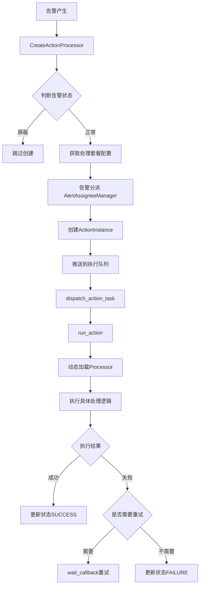
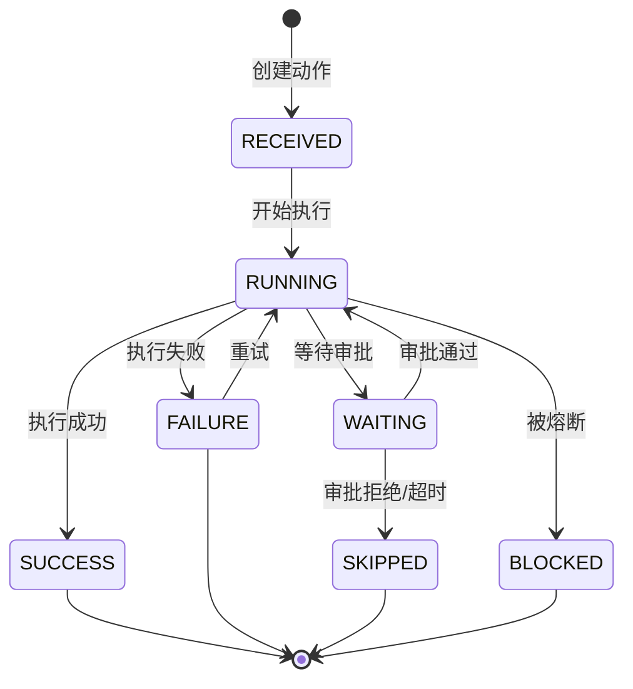
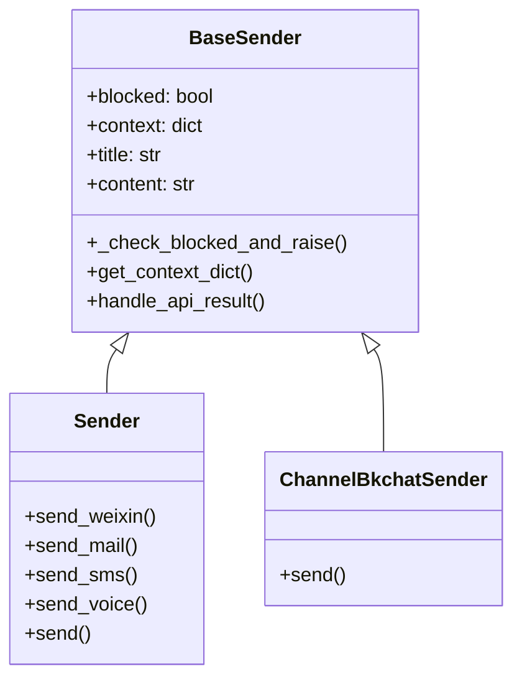
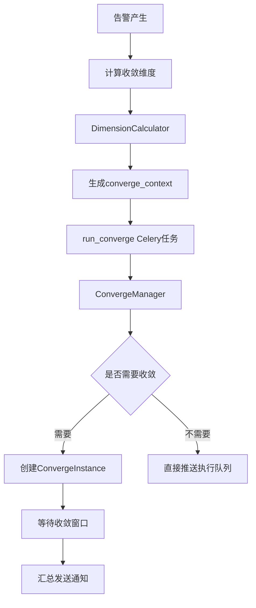
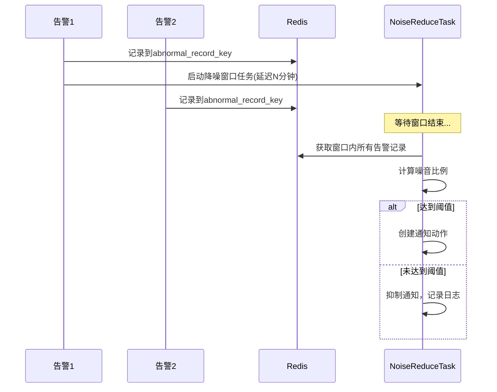
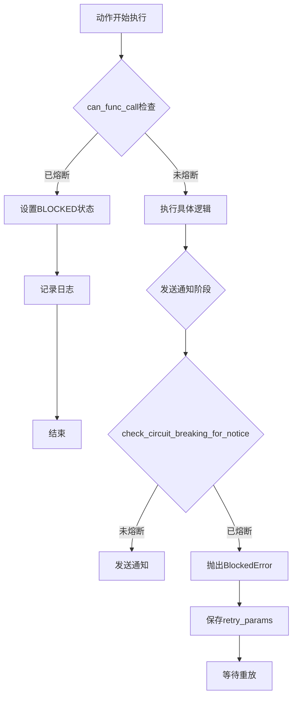

# 告警动作执行模块(fta_action)编程经验学习文档

## 一、模块架构概览

### 1.1 目录结构

```
fta_action/
├── __init__.py              # 核心基础处理器
├── utils.py                 # 工具函数和辅助类
├── double_check.py          # 二次确认机制
├── issue_processor.py       # Issue聚合处理器
├── common/
│   └── processor.py         # 通用动作处理器
├── notice/
│   └── processor.py         # 通知处理器
├── webhook/
│   └── processor.py         # Webhook回调处理器
├── job/
│   └── processor.py         # 作业平台处理器
├── sops/
│   └── processor.py         # 标准运维处理器
├── message_queue/
│   └── processor.py         # 消息队列处理器
├── collect/
│   └── processor.py         # 收集汇总处理器
├── tasks/
│   ├── action_tasks.py      # Celery任务调度
│   ├── create_action.py     # 动作创建流程
│   ├── alert_assign.py      # 告警分派管理
│   └── noise_reduce.py      # 降噪处理
└── bk_incident/
    └── processor.py         # 事件处理器
```

### 1.2 核心流程图



---

## 二、核心设计模式与最佳实践

### 2.1 策略模式 - 插件化处理器架构

**概念说明**：
通过统一的基类定义接口规范，不同类型的动作处理器继承基类实现各自的处理逻辑，实现"开闭原则"。

**代码示例**：

```python
# alarm_backends/service/fta_action/__init__.py

class BaseActionProcessor:
    """
    Action 处理器基类
    所有具体处理器都必须继承此类并实现execute方法
    """

    NOTICE_SENDER = {NoticeChannel.BK_CHAT: ChannelBkchatSender}

    def __init__(self, action_id, alerts=None):
        self.action = ActionInstance.objects.get(id=action_id)
        self.alerts = alerts
        self.retry_times = 0
        self.is_finished = False
        # ... 初始化逻辑

    @property
    def inputs(self):
        """输入数据 - 子类需实现"""
        raise NotImplementedError

    def execute(self, failed_times=0):
        """执行入口 - 子类需实现"""
        raise NotImplementedError

    def wait_callback(self, callback_func, kwargs=None, delta_seconds=0):
        """等待回调或轮询 - 公共方法"""
        PushActionProcessor.push_action_to_execute_queue(
            self.action, countdown=delta_seconds,
            callback_func=callback_func, kwargs=kwargs
        )
```

**具体处理器实现**：

```python
# alarm_backends/service/fta_action/notice/processor.py

class ActionProcessor(BaseActionProcessor):
    """通知处理器"""

    def execute(self):
        if self.action.status in ActionStatus.CAN_EXECUTE_STATUS:
            self.set_start_to_execute()
        self.execute_notify()

    def execute_notify(self):
        # 通知发送具体逻辑
        ...

# alarm_backends/service/fta_action/webhook/processor.py

class ActionProcessor(BaseActionProcessor):
    """Webhook处理器"""

    def execute_webhook(self):
        result, message = self.webhook_request()
        self.set_finished(
            ActionStatus.SUCCESS if result else ActionStatus.FAILURE,
            message=message
        )
```

**应用场景**：
- 多种通知渠道（邮件、短信、电话、企业微信等）
- 不同类型的动作执行（Webhook、作业平台、标准运维）
- 可扩展的新插件类型支持

**注意事项**：
- 基类应提供公共方法而非抽象方法，减少子类重复代码
- 使用 `NOTICE_SENDER` 字典实现发送器的策略选择
- 动态加载模块时使用 `importlib.import_module`

---

### 2.2 状态机模式 - 动作生命周期管理

**概念说明**：
使用明确的状态集合和状态转换规则管理动作的完整生命周期，确保状态变更的可追溯性和一致性。

**状态定义**：

```python
# constants/action.py

class ActionStatus:
    RECEIVED = 1        # 已接收
    RUNNING = 2         # 执行中
    SUCCESS = 3         # 成功
    FAILURE = 4         # 失败
    SKIPPED = 5         # 跳过
    WAITING = 6         # 等待审批
    BLOCKED = 7         # 被熔断

    CAN_EXECUTE_STATUS = [RECEIVED, RUNNING]
    END_STATUS = [SUCCESS, FAILURE, SKIPPED, BLOCKED]
    CAN_SYNC_STATUS = [SUCCESS, FAILURE, SKIPPED, BLOCKED]
```

**状态转换逻辑**：

```python
# alarm_backends/service/fta_action/__init__.py

def set_finished(self, to_status, failure_type="", message="", retry_func="execute", kwargs=None):
    """
    设置任务结束状态，包含重试判断逻辑
    """
    if to_status not in ActionStatus.END_STATUS:
        logger.info("destination status %s is not in end status list", to_status)
        return

    # 重试逻辑
    if to_status == ActionStatus.FAILURE and self.retry_times < self.max_retry_times:
        self.is_finished = False
        self.wait_callback(retry_func, delta_seconds=self.retry_interval, kwargs=kwargs)
        return

    # 框架异常的特殊重试
    if failure_type == FailureType.FRAMEWORK_CODE and kwargs.get("node_execute_times", 0) < 3:
        self.is_finished = False
        self.wait_callback(retry_func, delta_seconds=5, kwargs=kwargs)
        return

    # 更新最终状态
    self.update_action_status(
        to_status=to_status,
        failure_type=failure_type,
        end_time=datetime.now(tz=timezone.utc),
        ex_data={"message": message}
    )
```

**状态流转图**：



**应用场景**：
- 告警处理任务的完整生命周期管理
- 支持失败重试、熔断恢复等复杂场景
- 与ES同步的数据过滤条件

**注意事项**：
- 使用常量类定义状态，避免硬编码
- 状态变更时使用数据库事务保证一致性
- `select_for_update()` 防止并发更新冲突

---

### 2.3 分布式锁模式 - 并发控制

**概念说明**：
使用Redis实现分布式锁，保证多进程/多机器环境下关键操作的互斥性，防止重复执行。

**代码示例**：

```python
# alarm_backends/core/lock/service_lock.py

from alarm_backends.core.cache.key import SYNC_ACTION_LOCK_KEY

def service_lock(lock_key, **kwargs):
    """
    分布式服务锁装饰器/上下文管理器
    """
    client = lock_key.client
    key = lock_key.get_key(**kwargs)
    token = str(uuid.uuid4())

    acquired = client.set(key, token, nx=True, ex=lock_key.ttl)
    if not acquired:
        raise LockError(f"Failed to acquire lock: {key}")

    return ServiceLockContext(client, key, token)
```

**使用场景**：

```python
# alarm_backends/service/fta_action/tasks/action_tasks.py

@app.task(ignore_result=True, queue="celery_action_cron")
def sync_action_instances_every_10_secs():
    """
    定期同步任务 - 使用分布式锁保证单节点执行
    """
    try:
        with service_lock(SYNC_ACTION_LOCK_KEY):
            # 同步逻辑，确保只有一个进程执行
            perform_sharding_task(...)
    except LockError:
        logger.info("[get service lock fail] will process later")
        return
```

**Token锁的安全释放**：

```python
# alarm_backends/service/fta_action/issue_processor.py

class _TokenLock:
    """基于token的安全锁：只释放自己持有的锁"""

    _release_script = """
    if redis.call("get", KEYS[1]) == ARGV[1] then
        return redis.call("del", KEYS[1])
    else
        return 0
    end
    """

    def release(self):
        self._client.eval(self._release_script, 1, self._key, self._token)
```

**应用场景**：
- 周期性任务的调度控制（避免重复执行）
- 告警分派规则的匹配处理
- Issue聚合的创建过程
- 数据同步任务

**注意事项**：
- 使用Lua脚本保证释放操作的原子性
- 锁需要设置合理的TTL防止死锁
- 获取锁失败应优雅处理而非阻塞

---

### 2.4 通知发送机制 - 多渠道统一抽象

**概念说明**：
将不同通知渠道的发送逻辑抽象为统一的Sender类，通过模板渲染生成通知内容，支持熔断控制。

**架构设计**：



**核心发送逻辑**：

```python
# bkmonitor/utils/send.py

class Sender(BaseSender):
    def send(self, notice_way, notice_receivers, action_plugin=ActionPluginType.NOTICE):
        """
        统一发送入口，根据通知方式路由到具体方法
        """
        send_func = getattr(self, f"send_{notice_way}", None)
        if not send_func:
            raise NotImplementedError(f"send_{notice_way} not implemented")

        return send_func(notice_receivers, action_plugin)

    def send_mail(self, notice_receivers, action_plugin=ActionPluginType.NOTICE):
        """发送邮件"""
        params = {
            "title": self.title,
            "content": self.content,
            "is_content_base64": True,
        }

        retry_params = {
            "api_module": "api.cmsi.default",
            "resource": "SendMail",
            "kwargs": dict(bk_tenant_id=self.bk_tenant_id, **params),
        }

        self._check_blocked_and_raise("mail", retry_params)  # 熔断检查
        api_result = api.cmsi.send_mail(bk_tenant_id=self.bk_tenant_id, **params)
        return self.handle_api_result(api_result, notice_receivers)
```

**熔断处理**：

```python
class BaseSender:
    blocked = False

    def _check_blocked_and_raise(self, notice_type: str, retry_params: dict):
        """检查是否被熔断，抛出BlockedError保存重试参数"""
        if self.blocked:
            raise BlockedError(f"{notice_type} 通知被熔断", retry_params)
```

**应用场景**：
- 告警通知发送（邮件、短信、电话、企业微信等）
- 执行结果通知
- 升级告警通知

**注意事项**：
- 使用模板路径而非硬编码内容
- 熔断时保存 `retry_params` 用于后续重放
- 支持国际化模板（语言后缀）

---

### 2.5 任务队列调度 - Celery异步任务

**概念说明**：
使用Celery实现任务的异步调度，支持不同队列隔离、延迟执行、任务过期等特性。

**队列分发设计**：

```python
# alarm_backends/service/fta_action/tasks/action_tasks.py

def dispatch_action_task(action_type, action_info, countdown=0, **kwargs):
    """
    根据动作类型自动选择队列发送任务
    """
    # WEBHOOK和MESSAGE_QUEUE使用webhook队列
    if action_type in [ActionPluginType.WEBHOOK, ActionPluginType.MESSAGE_QUEUE]:
        return run_webhook_action.apply_async(
            (action_type, action_info),
            countdown=countdown,
            **kwargs
        )

    # NOTICE使用专用通知队列
    if os.getenv("ENABLE_NOTICE_QUEUE") and action_type == ActionPluginType.NOTICE:
        return run_notice_action.apply_async(
            (action_type, action_info),
            countdown=countdown,
            **kwargs
        )

    # 其他类型使用默认运行队列
    return run_action.apply_async(
        (action_type, action_info),
        countdown=countdown,
        **kwargs
    )
```

**动态模块加载**：

```python
@app.task(ignore_result=True, queue="celery_running_action")
def run_action(action_type, action_info):
    """
    动态加载处理器模块并执行
    """
    module_name = f"alarm_backends.service.fta_action.{action_type}.processor"

    try:
        module = importlib.import_module(module_name)
        processor = module.ActionProcessor(
            action_info["id"],
            alerts=action_info.get("alerts")
        )

        func_name = action_info.get("function", "execute")
        func = getattr(processor, func_name)
        func(**action_info.get("kwargs", {}))

    except ActionAlreadyFinishedError:
        logger.info("action already finished")
    except BaseException as error:
        logger.exception("run action error")
        ActionInstance.objects.filter(id=action_info["id"]).update(
            status=ActionStatus.FAILURE,
            failure_type=FailureType.FRAMEWORK_CODE
        )
```

**周期任务管理**：

```python
def check_create_poll_action():
    """
    周期创建循环通知任务 - 分片执行避免单次处理过多
    """
    polled_action_interval = int(getattr(settings, "POLLED_ACTION_INTERVAL", 30))
    for interval in range(0, 60, polled_action_interval):
        check_create_poll_action_10_secs.apply_async(
            countdown=interval,
            expires=120  # 任务过期时间
        )
```

**应用场景**：
- 告警动作的异步执行
- 周期性通知任务
- 数据同步任务

**注意事项**：
- 使用 `expires` 参数防止任务堆积
- 不同队列实现资源隔离
- 任务失败时更新数据库状态

---

### 2.6 告警收敛与批量处理

**概念说明**：
通过维度聚合将多条告警合并为一条通知，减少通知噪音，提升用户体验。

**收敛流程**：



**通知汇总发送**：

```python
# alarm_backends/service/fta_action/notice/processor.py

def get_same_notice_way_actions(self):
    """
    获取当前通知方式的所有actions进行汇总
    """
    collect_params = {
        "notice_way": self.context["collect_ctx"].group_notice_way,
        "action_signal": self.action.signal,
        "alert_id": "_".join(self.action.alerts or []),
    }
    collect_key = FTA_NOTICE_COLLECT_KEY.get_key(**collect_params)

    with service_lock(FTA_NOTICE_COLLECT_LOCK, **collect_params):
        client = FTA_NOTICE_COLLECT_KEY.client
        data = client.hgetall(collect_key)

        if not data and self.action.is_parent_action is False:
            raise ActionAlreadyFinishedError("当前告警通知已经汇总发送")

        self.notice_receivers = list(data.keys())
        self.notify_actions = list(data.values())

        # 清除缓存中的数据
        for receiver in self.notice_receivers:
            client.hdel(collect_key, receiver)
```

**应用场景**：
- 同维度多告警合并通知
- 业务级别的告警汇总
- 减少通知频率

**注意事项**：
- 使用分布式锁保证汇总操作的原子性
- 语音告警不走汇总逻辑（需独立处理）
- 汇总后清除缓存避免重复发送

---

### 2.7 降噪处理机制

**概念说明**：
通过时间窗口内的告警统计分析，判断是否为噪音告警，达到阈值才发送通知。

**降噪处理器**：

```python
# alarm_backends/service/fta_action/tasks/noise_reduce.py

class NoiseReduceRecordProcessor:
    """记录阶段：收集窗口内的告警信息"""

    def process(self):
        if not self.need_noise_reduce:
            return False

        current_timestamp = int(time.time())

        try:
            with service_lock(key.NOISE_REDUCE_INIT_LOCK_KEY, ...):
                # 检测是否已有降噪窗口
                if not self.redis_client.zrangebyscore(...):
                    # 创建新的降噪执行任务，延迟执行
                    execute_processor = NoiseReduceExecuteProcessor(...)
                    task_id = run_noise_reduce_task.apply_async(
                        (execute_processor,),
                        countdown=settings.NOISE_REDUCE_TIMEDELTA * 60  # 等待窗口结束
                    )
        except LockError:
            logger.info("window already exist, current alert in processing")

        # 记录告警信息到Redis
        self.redis_client.zadd(self.abnormal_record_key, {dimension_value_hash: current_timestamp})
        return True


class NoiseReduceExecuteProcessor:
    """执行阶段：判断是否需要发送通知"""

    def process(self):
        with service_lock(key.NOISE_REDUCE_OPERATE_LOCK_KEY, ...):
            dimension_hash_keys = self.redis_client.zrangebyscore(...)

            # 计算噪音比例
            noise_percent = len(dimension_hash_keys) * 100 // len(total_dimension_hash_keys)

            if noise_percent < self.count:  # 未达到阈值
                # 抑制通知，记录日志
                AlertLog.bulk_create([...])
            else:
                # 达到阈值，创建通知任务
                self.create_noise_reduce_actions(...)
```

**降噪流程图**：



**应用场景**：
- 批量告警的噪音抑制
- 基于阈值的智能通知控制
- 防止告警风暴

**注意事项**：
- 使用Sorted Set记录时间序列数据
- 使用分布式锁保证窗口创建的互斥
- 降噪结果需更新告警的 `handle_stage`

---

### 2.8 失败重试与异常处理

**概念说明**：
区分不同类型的失败，实施差异化的重试策略，保证系统的容错性。

**重试策略设计**：

```python
# alarm_backends/service/fta_action/__init__.py

def set_finished(self, to_status, failure_type="", message="", retry_func="execute", kwargs=None):
    """
    失败处理策略：
    1. EXECUTE_ERROR: 用户配置导致的失败，按配置重试
    2. FRAMEWORK_CODE: 系统异常，固定重试3次
    3. TIMEOUT: 超时不重试
    4. BLOCKED: 熔断状态，等待重放
    """

    # EXECUTE_ERROR类型的重试
    if to_status == ActionStatus.FAILURE and failure_type != FailureType.TIMEOUT:
        if self.retry_times < self.max_retry_times:
            self.is_finished = False
            self.wait_callback(retry_func, delta_seconds=self.retry_interval, kwargs=kwargs)
            return

    # FRAMEWORK_CODE类型的特殊重试
    if failure_type == FailureType.FRAMEWORK_CODE:
        if kwargs.get("node_execute_times", 0) < 3:
            self.is_finished = False
            self.wait_callback(retry_func, delta_seconds=5, kwargs=kwargs)
            return
```

**异常分类**：

```python
# constants/action.py

class FailureType:
    EXECUTE_ERROR = "execute_error"      # 执行错误（业务层面）
    FRAMEWORK_CODE = "framework_code"     # 框架错误（系统层面）
    TIMEOUT = "timeout"                   # 超时
    BLOCKED = "blocked"                   # 熔断
    SYSTEM_ABORT = "system_abort"         # 系统中止
```

**通用处理器的异常捕获**：

```python
# alarm_backends/service/fta_action/common/processor.py

def run_node_task(self, config, **kwargs):
    try:
        outputs = self.run_request_action(config, **kwargs)
    except (APIPermissionDeniedError, BKAPIError, CustomException) as error:
        # API权限/调用错误 - 按配置重试
        self.set_finished(
            ActionStatus.FAILURE,
            message=str(error),
            retry_func=config.get("function", "execute"),
            kwargs=kwargs
        )
    except BaseException as exc:
        # 系统异常 - 固定重试3次
        kwargs["node_execute_times"] = self.action.outputs.get(node_execute_times_key, 1)
        self.set_finished(
            ActionStatus.FAILURE,
            failure_type=FailureType.FRAMEWORK_CODE,
            retry_func=config.get("function", "execute"),
            kwargs=kwargs
        )
```

**应用场景**：
- API调用失败的自动重试
- 系统异常的有限重试
- 超时任务的特殊处理

**注意事项**：
- 区分业务错误和系统错误
- 重试次数需要限制防止无限循环
- 使用 `wait_callback` 实现延迟重试

---

### 2.9 熔断机制设计

**概念说明**：
通过熔断规则控制系统的执行流量，防止异常情况下的资源过度消耗。

**熔断管理器架构**：

```python
# alarm_backends/core/circuit_breaking/manager.py

class BaseCircuitBreakingManager:
    module = ""

    def __init__(self):
        self.config = CircuitBreakingCacheManager.get_config(self.module)
        self.matcher = gen_circuit_breaking_matcher(self.config)

    def is_circuit_breaking(self, **kwargs) -> bool:
        """检查是否需要熔断"""
        if not self.matcher:
            return False

        clean_instance = self.clean_cb_dimension(**kwargs)
        return self.matcher.is_match(clean_instance)


class ActionCircuitBreakingManager(BaseCircuitBreakingManager):
    """动作模块熔断管理器"""
    module = "action"

    @classmethod
    def clean_cb_dimension(cls, strategy_id=None, bk_biz_id=None, plugin_type=None, **kwargs):
        dimension = {}
        if strategy_id:
            dimension["strategy_id"] = str(strategy_id)
        if bk_biz_id:
            dimension["bk_biz_id"] = str(bk_biz_id)
        if plugin_type:
            dimension["plugin_type"] = str(plugin_type)
        return dimension
```

**熔断检查流程**：

```python
# alarm_backends/service/fta_action/__init__.py

def can_func_call(self):
    """执行前熔断检查"""
    plugin_type = self.plugin_key
    can_continue = not self._check_circuit_breaking()
    return can_continue

def _check_circuit_breaking(self, plugin_type=None, skip_notice_check=True):
    """
    检查是否命中熔断规则
    :param skip_notice_check: 执行阶段跳过通知类型的检查
    """
    try:
        is_circuit_breaking = self._do_circuit_breaking_check(plugin_type)

        if is_circuit_breaking:
            self._handle_execution_circuit_breaking(plugin_type)
            return True
        return False
    except Exception as e:
        logger.exception("circuit breaking check failed")
        return False  # 异常时不熔断
```

**熔断流程图**：



**应用场景**：
- 系统过载保护
- 异常策略的执行抑制
- 特定业务/数据源的熔断控制

**注意事项**：
- 熔断检查异常时默认不熔断（保护可用性）
- 熔断状态需要保存重试参数以便恢复
- 使用维度匹配器实现灵活的熔断规则

---

### 2.10 通知模板渲染

**概念说明**：
使用Jinja2模板引擎渲染通知内容，支持动态变量替换、国际化模板选择。

**模板渲染流程**：

```python
# alarm_backends/service/fta_action/common/processor.py

def jinja_render(self, template_value):
    """递归渲染模板值"""
    user_content = Jinja2Renderer.render(
        self.context.get("default_content_template", ""),
        self.context
    )
    alarm_content = NoticeRowRenderer.render(user_content, self.context)
    self.context["user_content"] = alarm_content

    if isinstance(template_value, str):
        return Jinja2Renderer.render(template_value, self.context)
    if isinstance(template_value, dict):
        return {key: self.jinja_render(value) for key, value in template_value.items()}
    if isinstance(template_value, list):
        return [self.jinja_render(value) for value in template_value]
    return template_value
```

**模板路径选择**：

```python
# alarm_backends/service/fta_action/notice/processor.py

def notify_handle(self):
    action_signal = self.action.signal
    msg_type = "markdown" if self.notice_way in settings.MD_SUPPORTED_NOTICE_WAYS else self.notice_way

    title_template_path = f"notice/{action_signal}/action/{self.notice_way}_title.jinja"
    content_template_path = f"notice/{action_signal}/action/{msg_type}_content.jinja"
```

**国际化模板支持**：

```python
# bkmonitor/utils/send.py

def get_language_template_path(template_path, language):
    """获取对应语言的模板文件"""
    dir_path, filename = path.split(template_path)
    name, ext = path.splitext(filename)
    name = f"{name}_{language}{ext}"
    lang_template_path = path.join(dir_path, name)

    try:
        get_template(lang_template_path)
    except TemplateDoesNotExist:
        return template_path  # 回退到默认模板

    return lang_template_path
```

**应用场景**：
- 告警通知内容生成
- 执行结果通知
- 多语言支持

**注意事项**：
- 模板路径遵循统一规范便于管理
- 递归渲染支持复杂嵌套结构
- 内容长度限制需要处理

---

## 三、其他最佳实践

### 3.1 数据库事务与并发控制

```python
# alarm_backends/service/fta_action/__init__.py

def update_action_status(self, to_status, failure_type="", **kwargs):
    """使用事务和行锁保证状态更新的原子性"""
    with transaction.atomic(using=backend_alert_router):
        try:
            locked_action = ActionInstance.objects.select_for_update().get(pk=self.action.id)
        except ActionInstance.DoesNotExist:
            return None

        locked_action.status = to_status
        locked_action.failure_type = failure_type
        for key, value in kwargs.items():
            setattr(locked_action, key, value)
        locked_action.save(using=backend_alert_router)
        self.action = locked_action  # 更新实例引用
```

### 3.2 ES批量操作与重试

```python
# alarm_backends/service/fta_action/tasks/create_action.py

def update_alert_documents(self, alerts_assignee, shield_ids, is_handled, ...):
    """更新ES文档，处理版本冲突"""
    retry_times = 0
    while retry_times < 3:
        try:
            AlertDocument.bulk_create(update_alerts, action=BulkActionType.UPDATE)
            break
        except ConflictError:
            # 版本冲突，重试处理
            logger.info("update alert failed because of version conflict")
            retry_times += 1
```

### 3.3 业务规则的JMESPath匹配

```python
# alarm_backends/service/fta_action/__init__.py

def business_rule_validate(self, params, rule):
    """使用JMESPath实现灵活的条件判断"""
    if rule["method"] == "equal":
        return jmespath.search(rule["key"], params) == rule["value"]
    if rule["method"] == "in":
        return jmespath.search(rule["key"], params) in rule["value"]
    if rule["method"] == "not in":
        return jmespath.search(rule["key"], params) not in rule["value"]
    return False
```

### 3.4 周期通知的间隔计算

```python
# alarm_backends/service/fta_action/tasks/create_action.py

def calc_action_interval(execute_config, action_instance):
    """
    计算周期任务间隔：
    - standard: 固定间隔
    - increasing: 指数递增间隔
    """
    notify_interval = int(execute_config.get("notify_interval", 0))
    interval_notify_mode = execute_config.get("interval_notify_mode", IntervalNotifyMode.STANDARD)

    if interval_notify_mode == IntervalNotifyMode.INCREASING:
        # 指数递增：每次翻倍
        notify_interval = int(notify_interval * math.pow(2, action_instance.execute_times - 1))

    return notify_interval
```

### 3.5 Prometheus指标监控

```python
# alarm_backends/service/fta_action/tasks/action_tasks.py

def run_action(action_type, action_info):
    start_time = time.time()
    exc = None

    try:
        processor = module.ActionProcessor(action_info["id"], ...)
        func(**action_info.get("kwargs", {}))
    except BaseException as error:
        exc = error

    labels = {
        "bk_biz_id": action_instance.bk_biz_id,
        "plugin_type": action_type,
        "strategy_id": metrics.TOTAL_TAG,
    }

    metrics.ACTION_EXECUTE_TIME.labels(**labels).observe(time.time() - start_time)
    metrics.ACTION_EXECUTE_COUNT.labels(
        status=metrics.StatusEnum.from_exc(exc),
        exception=exc,
        **labels
    ).inc()
```

---

## 四、设计亮点总结

| 设计点 | 实现方式 | 价值 |
|--------|----------|------|
| 插件化架构 | 基类+动态加载 | 可扩展性、解耦合 |
| 状态机管理 | 常量状态+转换规则 | 可追溯性、一致性 |
| 分布式锁 | Redis+Lua脚本 | 并发安全、原子性 |
| 多渠道通知 | Sender抽象+模板渲染 | 统一接口、易维护 |
| 任务调度 | Celery+队列隔离 | 异步处理、资源隔离 |
| 告警收敛 | 维度聚合+时间窗口 | 减少噪音、用户体验 |
| 降噪机制 | 阈值判断+时间窗口 | 智能抑制、防止风暴 |
| 失败重试 | 分类重试+延迟执行 | 容错性、可靠性 |
| 熔断机制 | 维度匹配+状态标记 | 过载保护、系统稳定 |
| 模板渲染 | Jinja2+国际化 | 动态内容、多语言 |

---

## 五、核心文件路径

| 文件路径 | 功能说明 |
|---------|---------|
| `alarm_backends/service/fta_action/__init__.py` | 基础处理器基类 |
| `alarm_backends/service/fta_action/tasks/action_tasks.py` | Celery任务调度 |
| `alarm_backends/service/fta_action/tasks/create_action.py` | 动作创建流程 |
| `alarm_backends/service/fta_action/tasks/noise_reduce.py` | 降噪处理 |
| `alarm_backends/service/fta_action/notice/processor.py` | 通知处理器 |
| `alarm_backends/service/fta_action/webhook/processor.py` | Webhook处理器 |
| `alarm_backends/service/fta_action/common/processor.py` | 通用处理器 |
| `alarm_backends/core/lock/service_lock.py` | 分布式锁 |
| `alarm_backends/core/circuit_breaking/manager.py` | 熔断管理器 |
| `bkmonitor/utils/send.py` | 通知发送器 |