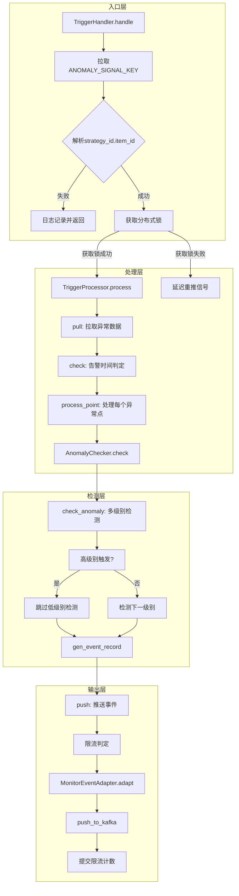
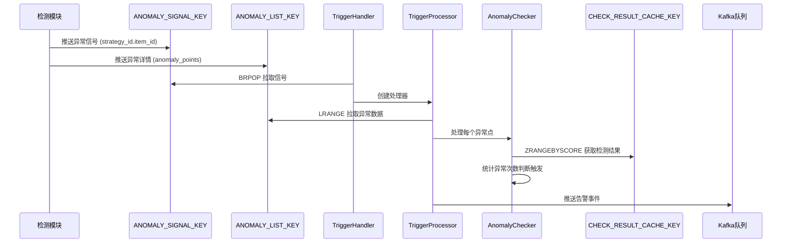
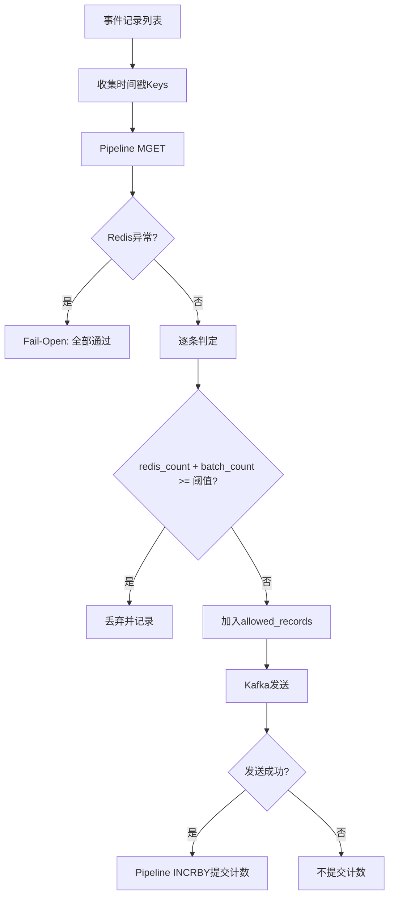
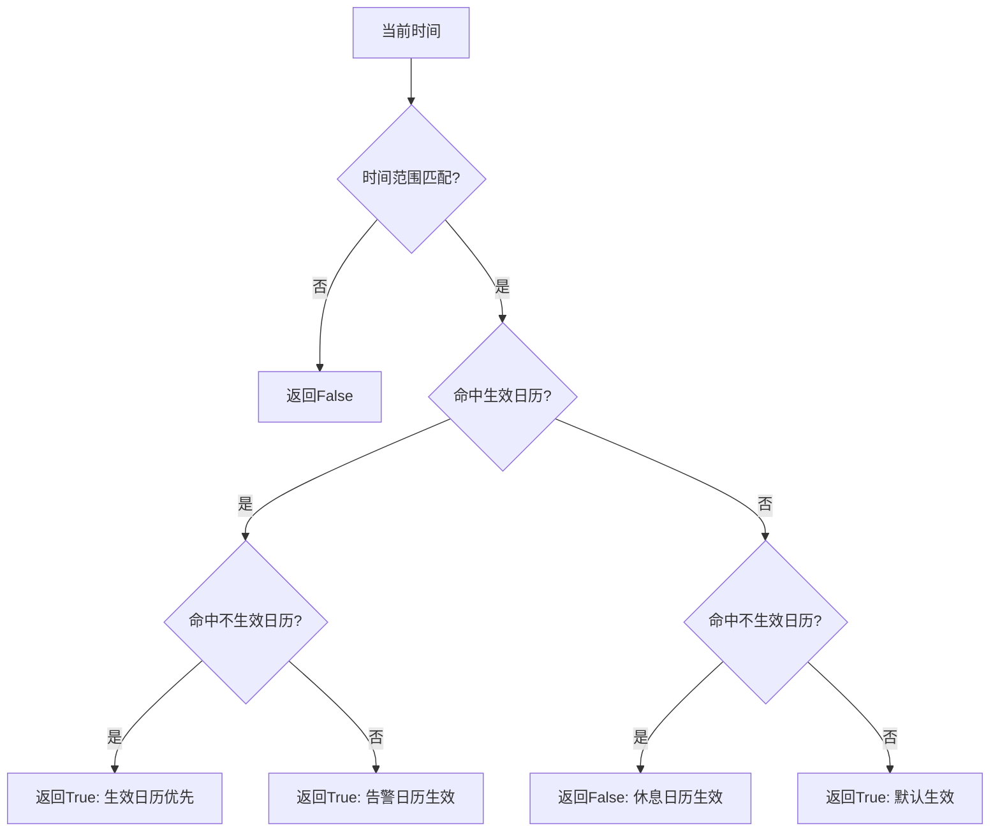

# 告警触发模块编程经验与最佳实践

## 一、模块概述

告警触发模块位于 `alarm_backends/service/trigger` 目录，负责处理异常检测结果并触发告警事件。核心文件包括：

| 文件 | 职责 |
|------|------|
| `handler.py` | 任务入口，负责拉取信号、获取锁、调用处理器 |
| `processor.py` | 核心处理器，负责数据拉取、触发检测、事件推送 |
| `checker.py` | 异常检测器，负责判断触发条件 |
| `README.md` | 模块设计文档 |

## 二、整体架构设计

### 2.1 架构流程图



### 2.2 数据流转图



---

## 三、核心编程经验

### 3.1 分层职责分离模式

**概念说明**

模块采用三层职责分离设计：入口层负责信号获取和锁管理、处理层负责数据流转和批量处理、检测层负责具体触发逻辑。这种分离使得每层职责清晰，便于测试和维护。

**代码示例**

```python
# handler.py - 入口层：只负责信号获取和锁管理
class TriggerHandler(base.BaseHandler):
    def handle(self):
        # 1. 拉取信号
        anomaly_key = ANOMALY_SIGNAL_KEY.client.brpop(ANOMALY_SIGNAL_KEY.get_key(), self.DATA_FETCH_TIMEOUT)
        if not anomaly_key:
            return

        # 2. 解析信号
        strategy_id, item_id = anomaly_key.split(".")

        # 3. 获取锁并处理
        with service_lock(SERVICE_LOCK_TRIGGER, strategy_id=strategy_id, item_id=item_id):
            processor = TriggerProcessor(strategy_id, item_id)
            processor.process()

# processor.py - 处理层：负责数据流转
class TriggerProcessor:
    def process(self):
        self.pull()  # 拉取数据
        for point in self.anomaly_points:
            self.process_point(point)  # 处理每个点
        self.push()  # 推送结果

# checker.py - 检测层：只负责触发判断
class AnomalyChecker:
    def check(self):
        anomaly_level, anomaly_timestamps = self.check_anomaly()
        anomaly_records = self.gen_anomaly_records()
        event_record = self.gen_event_record(anomaly_level, anomaly_timestamps)
        return anomaly_records, event_record
```

**应用场景**
- 复杂业务流程处理
- 需要批量操作的场景
- 多阶段数据处理管道

**注意事项**
- 各层之间通过明确的数据结构传递信息
- 避免层间职责越界，保持单一职责原则
- 处理层应关注数据流转效率，检测层应关注业务逻辑正确性

---

### 3.2 分布式锁与延迟重试机制

**概念说明**

使用 Redis 分布式锁保证同一策略监控项不会并发处理。当获取锁失败时，将信号延迟重推到队列，实现优雅的重试机制。

**代码示例**

```python
# handler.py
def handle(self):
    try:
        with service_lock(SERVICE_LOCK_TRIGGER, strategy_id=strategy_id, item_id=item_id):
            processor = TriggerProcessor(strategy_id, item_id)
            processor.process()
    except LockError:
        logger.info("[get service lock fail] strategy({}), item({}). will process later".format(strategy_id, item_id))
        # 延迟1秒后重推信号
        ANOMALY_SIGNAL_KEY.client.delay("rpush", ANOMALY_SIGNAL_KEY.get_key(), anomaly_key, delay=1)
        return
    except Exception as e:
        # 其他异常记录日志
        logger.exception("[process error] ...")

# service_lock.py - 上下文管理器实现
@contextmanager
def service_lock(key_instance, **kwargs):
    lock = None
    lock_key = key_instance.get_key(**kwargs)
    try:
        lock = RedisLock(lock_key, key_instance.ttl)
        if lock.acquire(0.1):
            yield lock
        else:
            raise LockError(msg=f"{lock_key} is already locked")
    except LockError as err:
        raise err
    finally:
        if lock is not None:
            lock.release()
```

**应用场景**
- 多进程/多实例并发控制
- 防止重复处理的场景
- 需要优雅重试的队列处理

**注意事项**
- 锁的 TTL 要合理设置，避免死锁
- 延迟重试时间应大于平均处理时间
- 重试次数应有上限，避免无限循环

---

### 3.3 多级别异常优先级检测

**概念说明**

异常检测结果可能包含多个级别（如致命、严重、警告）。采用从高到低的检测顺序，高级别触发后跳过低级别检测，避免产生重复告警。

**代码示例**

```python
# checker.py
def check_anomaly(self):
    """
    异常检测：按照算法级别从高到低判断
    如果高级别算法已经触发，则无需判断低级别
    """
    levels = sorted([int(level) for level in list(self.point["anomaly"].keys())])
    anomaly_level = -1
    anomaly_timestamps = []

    for level in levels:
        if anomaly_level != -1:
            # 高级别已触发，跳过低级别
            logger.debug(
                "anomaly record ({anomaly_id}) skip trigger because"
                "high level anomaly record (level: {level}) has been trigger.".format(
                    anomaly_id=self.anomaly_ids[str(level)], level=anomaly_level
                )
            )
            continue
        is_triggered, anomaly_timestamps = self._check_anomaly_by_level(str(level))
        if is_triggered:
            anomaly_level = level

    return anomaly_level, anomaly_timestamps

def _check_anomaly_by_level(self, level):
    """
    检测某个级别的异常点是否满足触发条件
    """
    trigger_config = self.trigger_configs[level]

    # 从缓存获取检测结果窗口
    check_cache_key = CHECK_RESULT_CACHE_KEY.get_key(
        strategy_id=self.strategy_id, item_id=self.item_id,
        dimensions_md5=self.dimensions_md5, level=level
    )
    check_window_offset = trigger_config["check_window_size"] * self.check_window_unit - 1
    check_results = CHECK_RESULT_CACHE_KEY.client.zrangebyscore(
        name=check_cache_key,
        min=self.source_time - check_window_offset,
        max=self.source_time,
        withscores=True
    )

    # 统计异常标记数量
    anomaly_timestamps = []
    for label, score in check_results:
        if label.endswith(ANOMALY_LABEL):  # ANOMALY_LABEL = "ANOMALY"
            anomaly_timestamps.append(int(score))

    anomaly_times = len(anomaly_timestamps)
    is_triggered = anomaly_times >= trigger_config["trigger_count"]

    return is_triggered, anomaly_timestamps
```

**应用场景**
- 多级别告警系统
- 优先级队列处理
- 策略规则引擎

**注意事项**
- 级别排序方向要正确（从高到低或从低到高）
- 跳过逻辑要有明确的日志记录
- 触发阈值配置应灵活可调

---

### 3.4 滑动窗口检测模式

**概念说明**

使用 Redis SortedSet 存储检测结果，score 为时间戳，value 为检测状态。通过 ZRANGEBYSCORE 获取时间窗口内的检测记录，实现滑动窗口检测。

**代码示例**

```python
# 数据结构设计
# CHECK_RESULT_CACHE_KEY: SortedSet
# key: {strategy_id}.{item_id}.{dimensions_md5}.{level}
# score: 数据时间戳
# member: 正常 -> "timestamp|value"，异常 -> "timestamp|ANOMALY"

# 检测窗口获取
check_window_offset = trigger_config["check_window_size"] * self.check_window_unit - 1
check_results = CHECK_RESULT_CACHE_KEY.client.zrangebyscore(
    name=check_cache_key,
    min=self.source_time - check_window_offset,  # 窗口起始
    max=self.source_time,  # 窗口结束（当前时间）
    withscores=True
)

# 统计窗口内异常数量
anomaly_timestamps = []
for label, score in check_results:
    if label.endswith(ANOMALY_LABEL):
        anomaly_timestamps.append(int(score))

anomaly_times = len(anomaly_timestamps)
is_triggered = anomaly_times >= trigger_config["trigger_count"]
```

```mermaid
flowchart LR
    subgraph 检测窗口
        T1[timestamp1|value] --> T2[timestamp2|ANOMALY]
        T2 --> T3[timestamp3|ANOMALY]
        T3 --> T4[timestamp4|value]
        T4 --> T5[timestamp5|ANOMALY]
        T5 --> T6[当前时间]
    end

    subgraph 触发判定
        C[异常计数: 3] --> D{>= trigger_count?}
        D -->|是| E[触发告警]
        D -->|否| F[继续检测]
    end
```

**应用场景**
- 周期性检测判定
- 累计次数触发场景
- 时间序列数据分析

**注意事项**
- 窗口大小和触发次数要合理配置
- 使用 SortedSet 的 score 作为时间戳，便于范围查询
- 窗口偏移量计算要考虑数据周期

---

### 3.5 策略快照缓存设计

**概念说明**

策略配置可能频繁变更，使用快照机制确保处理时使用一致配置。快照以 `strategy_id + update_time` 为键，避免配置变更导致处理逻辑不一致。

**代码示例**

```python
# strategy.py - 快照生成
def gen_strategy_snapshot(self):
    """
    创建当前策略配置缓存快照
    """
    client = key.STRATEGY_SNAPSHOT_KEY.client
    update_time = self.config.get("update_time")
    snapshot_key = key.STRATEGY_SNAPSHOT_KEY.get_key(
        strategy_id=self.id, update_time=update_time
    )
    client.set(snapshot_key, json.dumps(self.config), ex=CONST_ONE_HOUR)
    setattr(self, "snapshot_key", snapshot_key)
    return snapshot_key

# processor.py - 快照获取与缓存
def get_strategy_snapshot(self, key):
    """
    获取配置快照：内存优先，Redis兜底
    """
    try:
        return self._strategy_snapshots[key]  # 内存缓存
    except KeyError:
        snapshot = Strategy.get_strategy_snapshot_by_key(key, self.strategy_id)
        if not snapshot:
            raise StrategyNotFound({"key": key})
        self._strategy_snapshots[key] = snapshot  # 缓存到内存
        return snapshot
```

**应用场景**
- 配置变更频繁的系统
- 需要配置一致性的批量处理
- 长时间运行的任务处理

**注意事项**
- 快照 TTL 要大于任务处理周期
- 内存缓存避免重复查询 Redis
- 快照键包含 update_time 保证唯一性

---

### 3.6 事件限流设计

**概念说明**

通过 Redis 计数器实现按 `(strategy_id, item_id, source_time)` 粒度的事件限流。使用 fail-open 策略，Redis 异常时允许通过，Kafka 发送成功后再提交计数。

**代码示例**

```python
# processor.py
TRIGGER_EVENT_RATE_LIMIT_THRESHOLD = 5000

def _filter_by_rate_limit(self, event_records):
    """
    按（strategy_id, item_id, 数据时间戳）进行限流判定

    算法：
    1. 内存中按 source_time 分组
    2. pipeline MGET 获取 Redis 已有值
    3. 逐条判定：redis_count + 本批已通过数 >= 阈值时拒绝
    """
    client = TRIGGER_EVENT_RATE_LIMIT_KEY.client
    threshold = TRIGGER_EVENT_RATE_LIMIT_THRESHOLD

    # step1: 收集各时间戳的 Redis key
    ts_keys = {}
    for record in event_records:
        source_time = record["event_record"].get("data", {}).get("time")
        if source_time is None:
            continue
        source_time = int(source_time)
        if source_time not in ts_keys:
            ts_keys[source_time] = TRIGGER_EVENT_RATE_LIMIT_KEY.get_key(
                strategy_id=self.strategy_id, item_id=self.item_id, source_time=source_time
            )

    # step2: pipeline MGET
    pipe = client.pipeline(transaction=False)
    for ts in ordered_ts:
        pipe.get(ts_keys[ts])
    redis_results = pipe.execute()
    redis_counts = {ts: int(val) if val else 0 for ts, val in zip(ordered_ts, redis_results)}

    # step3: 内存逐条判定
    allowed_records = []
    batch_counts = {ts: 0 for ts in ordered_ts}

    for record in event_records:
        source_time = int(event_data.get("time"))
        already = redis_counts[source_time] + batch_counts[source_time]
        if already >= threshold:
            # 超过阈值，丢弃
            drop_counts[source_time] = drop_counts.get(source_time, 0) + 1
        else:
            batch_counts[source_time] += 1
            allowed_records.append(record)

    return allowed_records, batch_counts, ts_keys, drop_counts

def push_event_to_kafka(self, event_records):
    # step1: 限流判定（只读 Redis）
    allowed_records, batch_counts, ts_keys, drop_counts = self._filter_by_rate_limit(event_records)

    # step2: 发送到 Kafka
    MonitorEventAdapter.push_to_kafka(events=events)

    # step3: 发送成功后提交计数
    self._commit_rate_limit_counts(batch_counts, ts_keys)
```



**应用场景**
- 高并发事件推送
- 防止系统过载
- 需要精确限流的场景

**注意事项**
- 限流粒度要合理（按时间戳而非策略）
- fail-open 策略避免 Redis 故障影响业务
- Kafka 发送成功后再提交计数，避免额度被静默消耗
- 使用 Pipeline 减少 Redis 交互次数

---

### 3.7 适配器模式转换事件格式

**概念说明**

使用适配器模式将内部事件格式转换为外部系统（故障自愈）所需格式，分离数据转换逻辑和业务处理逻辑。

**代码示例**

```python
# adapter.py
class MonitorEventAdapter:
    """
    监控事件适配器：将 Trigger 生产的内部数据适配为自愈事件格式
    """

    def __init__(self, record: dict, strategy: dict):
        self.record = record
        self.strategy = strategy

    def adapt(self, status=None, description=None, time=None) -> dict:
        """
        将 Trigger 生产的数据适配为自愈事件
        """
        severity = self.record["trigger"]["level"]
        target_type, target, data_dimensions = self.extract_target(
            self.strategy, self.record["data"]["dimensions"]
        )

        # 构建自愈事件格式
        event = {
            "event_id": self.record["anomaly"][str(severity)]["anomaly_id"],
            "plugin_id": settings.MONITOR_EVENT_PLUGIN_ID,
            "strategy_id": self.strategy["id"],
            "alert_name": self.strategy["name"],
            "description": self.record["anomaly"][str(severity)]["anomaly_message"],
            "severity": int(severity),
            "tags": [{"key": k, "value": v} for k, v in data_dimensions.items()],
            "target_type": target_type,
            "target": target,
            "status": status or EventStatus.ABNORMAL,
            "bk_biz_id": self.strategy["bk_biz_id"],
            "extra_info": {
                "origin_alarm": {
                    "trigger_time": now_time,
                    "data": self.record["data"],
                    "trigger": self.record.get("trigger", {}),
                    "anomaly": self.record.get("anomaly", {}),
                }
            }
        }
        return event

    @classmethod
    def push_to_kafka(cls, events: list[dict]):
        """将事件推送到 Kafka"""
        messages = [json.dumps(event).encode("utf-8") for event in events]
        kafka_queue = KafkaQueue.get_alert_kafka_queue()
        kafka_queue.set_topic(topic)
        kafka_queue.put(value=messages)
```

**应用场景**
- 多系统数据对接
- 数据格式转换
- 协议适配层

**注意事项**
- 适配器只做格式转换，不修改业务逻辑
- extra_info 保留原始数据便于追溯
- 使用类方法 push_to_kafka 分离推送逻辑

---

### 3.8 ID 解析器继承设计

**概念说明**

通过继承实现多层级解析器，基类 `AnomalyIDParser` 解析异常ID格式，子类扩展特定场景解析需求。

**代码示例**

```python
# record_parser.py
class AnomalyIDParser(object):
    """
    异常ID解析器
    格式："{dimensions_md5}.{timestamp}.{strategy_id}.{item_id}.{level}"
    """

    def __init__(self, anomaly_id):
        record_info = anomaly_id.split(".")
        self.dimensions_md5 = record_info[0]
        self.source_time = int(record_info[1])
        self.strategy_id = int(record_info[2])
        self.item_id = int(record_info[3])
        self.level = int(record_info[4])

    @property
    def mysql_time(self):
        """source_time to mysql saved time"""
        return time_tools.mysql_time(arrow.get(self.source_time).datetime)

class EventIDParser(AnomalyIDParser):
    """事件ID解析器 - 格式与异常ID相同"""
    pass

class RecordParser(AnomalyIDParser):
    """
    数据记录解析器 - 从完整记录中提取anomaly_id并解析
    """
    def __init__(self, record):
        self.record = record
        anomaly_id = list(self.record["anomaly"].values())[0]["anomaly_id"]
        super(RecordParser, self).__init__(anomaly_id)
```

**应用场景**
- 统一的ID格式解析
- 多场景扩展解析需求
- 避免重复解析逻辑

**注意事项**
- ID 格式设计要考虑扩展性
- 解析失败应有明确的错误处理
- 子类通过 super() 复用基类解析逻辑

---

### 3.9 Prometheus 指标埋点设计

**概念说明**

在关键节点埋点 Prometheus 指标，包括处理耗时、处理数量、限流丢弃、延迟监控等，便于系统监控和问题定位。

**代码示例**

```python
# handler.py
def handle(self):
    exc = None
    try:
        with service_lock(SERVICE_LOCK_TRIGGER, strategy_id=strategy_id, item_id=item_id):
            with metrics.TRIGGER_PROCESS_TIME.labels(strategy_id=metrics.TOTAL_TAG).time():
                processor = TriggerProcessor(strategy_id, item_id)
                processor.process()
    except LockError:
        return
    except Exception as e:
        exc = e

    # 处理结果上报
    metrics.TRIGGER_PROCESS_COUNT.labels(
        strategy_id=metrics.TOTAL_TAG,
        status=metrics.StatusEnum.from_exc(exc),
        exception=exc
    ).inc()
    metrics.report_all()

# processor.py
def push_event_to_kafka(self, event_records):
    # 延迟监控
    current_time = time.time()
    max_latency = 0
    for record in allowed_records:
        detect_time = event_record.get("data", {}).get("detect_time")
        if detect_time:
            latency = current_time - detect_time
            max_latency = max(max_latency, latency)

    metrics.TRIGGER_PROCESS_LATENCY.labels(strategy_id=metrics.TOTAL_TAG).observe(max_latency)

    if max_latency > 60:
        logger.warning("[detect to trigger] big latency %s", max_latency)
        metrics.PROCESS_BIG_LATENCY.labels(
            strategy_id=self.strategy_id,
            module="detect_trigger",
        ).observe(max_latency)

    # 限流丢弃上报
    if total_drop > 0:
        metrics.TRIGGER_EVENT_RATE_LIMIT_DROP.labels(
            strategy_id=self.strategy_id,
            bk_biz_id=self.strategy.bk_biz_id,
        ).inc(total_drop)
```

**应用场景**
- 系统性能监控
- 异常告警
- 运维分析

**注意事项**
- 使用 TOTAL_TAG 作为汇总标签
- 异常状态通过 StatusEnum.from_exc 转换
- 大延迟触发日志警告便于快速定位

---

### 3.10 策略生效时间判定设计

**概念说明**

策略支持配置生效时间范围和日历事项。生效时间判定包含时间范围匹配、日历事项匹配，优先级为：生效日历 > 不生效日历。

**代码示例**

```python
# strategy.py
def in_alarm_time(self, now_time=None) -> tuple[bool, str]:
    """
    是否在策略生效期间
    :return: bool, str（说明信息）
    """
    now_time = now_time or datetime.now()
    now_time_str = time_tools.strftime_local(now_time, _format="%H:%M")

    # 时间范围匹配
    time_ranges = []
    time_matched = False
    for time_range in uptime["time_ranges"]:
        start_time = arrow.get(time_range["start"], "HH:mm").format("HH:mm")
        end_time = arrow.get(time_range["end"], "HH:mm").format("HH:mm")
        time_ranges.append(f"{start_time}-{end_time}")

        if start_time <= end_time:
            # 同一天内
            if start_time <= now_time_str <= end_time:
                time_matched = True
                break
        elif start_time <= now_time_str or now_time_str <= end_time:
            # 跨天情况（如 22:00-06:00）
            time_matched = True
            break

    if not time_matched:
        return False, _("当前时刻不在策略生效时间范围: {}").format(", ".join(time_ranges))

    # 日历事项匹配
    active_item_messages = self._get_calendar_item_messages(active_calendar_ids)
    inactive_item_messages = self._get_calendar_item_messages(calendar_ids)

    # 优先级：生效日历 > 不生效日历
    if active_item_messages and inactive_item_messages:
        return True, _("同时命中告警日历和休息日历，告警日历优先生效")
    elif active_item_messages:
        return True, _("当前时刻命中告警日历事项: {}")
    elif inactive_item_messages:
        return False, _("当前时刻命中日历休息事项: {}")

    return True, ""
```



**应用场景**
- 告警静默时段配置
- 工作时间限定告警
- 日历事项联动

**注意事项**
- 考虑跨天时间范围（如夜间）要正确处理
- 日历优先级要有明确规则
- 返回说明信息便于用户理解

---

## 四、设计亮点总结

| 设计点 | 亮点描述 |
|--------|----------|
| 三层职责分离 | Handler/Processor/Checker 各司其职，易于测试和维护 |
| 分布式锁+延迟重试 | 锁失败不丢弃数据，优雅重试保证可靠性 |
| 多级别优先检测 | 高级别触发后跳过低级别，避免重复告警 |
| 滑动窗口检测 | SortedSet 存储检测历史，时间范围查询高效 |
| 策略快照缓存 | 配置一致性保障，内存+Redis双重缓存 |
| 事件限流 fail-open | Redis 异常不影响业务，Kafka 成功后提交计数 |
| 适配器模式 | 内部事件格式与外部系统解耦 |
| ID解析器继承 | 统一ID格式解析，子类场景扩展 |
| Prometheus埋点 | 关键节点全覆盖，便于监控和问题定位 |
| 生效时间判定 | 时间范围+日历事项，优先级规则明确 |

---

## 五、可复用模式清单

1. **分层职责分离模式** - Handler/Processor/Checker 三层架构
2. **分布式锁+延迟重试模式** - 锁失败时延迟重推队列
3. **多级别优先检测模式** - 高级别触发后跳过低级别
4. **滑动窗口检测模式** - SortedSet + ZRANGEBYSCORE
5. **快照缓存模式** - 内存优先+Redis兜底
6. **限流 fail-open 模式** - Redis 异常允许通过，成功后提交
7. **适配器转换模式** - 数据格式转换分离
8. **继承解析器模式** - 基类解析+子类扩展
9. **指标埋点模式** - 关键节点全覆盖
10. **生效时间判定模式** - 时间范围+日历优先级

---

## 六、核心文件路径

- `alarm_backends/service/trigger/handler.py` - 任务入口
- `alarm_backends/service/trigger/processor.py` - 核心处理器
- `alarm_backends/service/trigger/checker.py` - 异常检测器
- `alarm_backends/core/lock/service_lock.py` - 分布式锁
- `alarm_backends/core/control/strategy.py` - 策略管理
- `alarm_backends/core/control/record_parser.py` - ID解析器
- `alarm_backends/core/alert/adapter.py` - 事件适配器