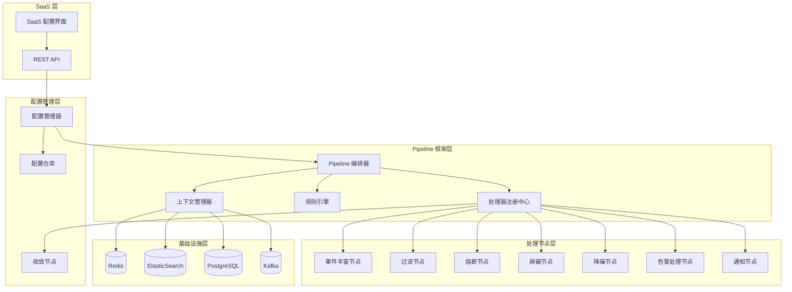
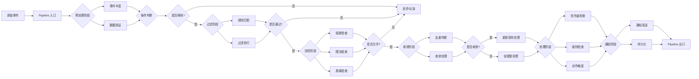
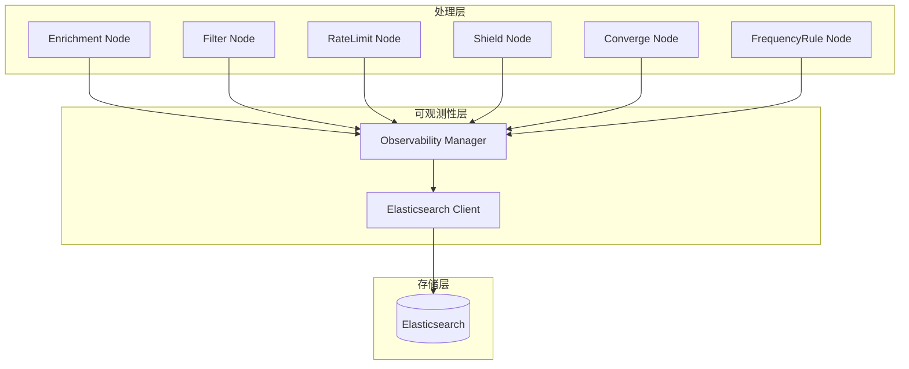

## 产品概述

在 bkmonitor/alarm_backends/ 模块中实现基于配置的数据流处理框架,封装告警处理全流程,支持通过配置灵活编排处理节点,并提供 SaaS 页面配置接口。

## 核心功能

- **事件丰富**:支持多维数据增强和元数据补充
- **过滤**:基于规则条件的事件过滤机制
- **抑制**:事件抑制和屏蔽逻辑
- **限流**:QoS 限流和流量控制
- **熔断**:熔断机制和故障隔离
- **收敛**:事件收敛和去重聚合
- **降噪**:智能降噪和噪音过滤
- **屏蔽**:告警屏蔽和故障期管理
- **处理**:告警处理和状态转换
- **通知**:多渠道通知和消息推送
- **优先级检查**:告警优先级评估和调整
- **级别检查**:告警级别验证和校验
- **动作触发规则**:自定义动作触发条件和规则配置
- **配置驱动处理**:支持 JSON/YAML 格式的流程配置
- **可视化配置界面**:SaaS 页面管理处理流程
- **跨项目复用**:支持流程模板跨项目共享

## 技术栈选择

- **编程语言**: Python 3.10+
- **Web 框架**: Django + Django REST Framework (现有系统技术栈)
- **数据存储**: Redis (缓存)、ElasticSearch (持久化)、PostgreSQL (配置管理)
- **消息队列**: Kafka (事件流)
- **配置格式**: JSON / YAML
- **分布式支持**: Celery (异步任务)

## 技术架构设计

### 系统架构

采用分层架构设计,保持与现有系统兼容:



### 模块划分

#### 1. 框架核心模块 (framework/)

- **pipeline/**: Pipeline 编排和执行引擎
- **processor/**: 处理器接口和注册机制
- **rule/**: 规则引擎和条件匹配
- **config/**: 配置管理和验证
- **context/**: 上下文管理和状态传递
- **observable/**: 可观测性模块,包括日志记录、指标收集、Elasticsearch 存储

#### 2. 处理节点模块 (nodes/)

- **enrichment/**: 事件丰富节点实现
- **filter/**: 过滤节点实现
- **circuit_breaker/**: 熔断节点实现
- **shield/**: 屏蔽节点实现
- **converge/**: 收敛节点实现
- **notification/**: 通知节点实现
- **action/**: 动作触发节点实现

#### 3. 集成适配模块 (adapters/)

- **legacy/**: 现有处理器适配器
- **migration/**: 旧逻辑迁移工具
- **compat/**: 兼容性层

#### 4. SaaS 接口模块 (api/)

- **views.py**: REST API 视图
- **serializers.py**: 序列化器
- **urls.py**: 路由配置

### 数据流设计



### 核心数据结构

#### Pipeline 配置结构

```python
@dataclass
class PipelineConfig:
    """Pipeline 配置定义"""
    id: str                                      # Pipeline 唯一标识
    name: str                                    # Pipeline 名称
    version: str                                 # 版本号
    description: str                             # 描述
    scenario: str                                # 应用场景
    enabled: bool                                # 是否启用
    stages: List[StageConfig]                   # 阶段列表
    global_config: Dict[str, Any]                # 全局配置
    error_handling: ErrorHandlingConfig          # 错误处理配置
    metrics_config: MetricsConfig                # 监控配置

@dataclass
class StageConfig:
    """阶段配置定义"""
    name: str                                    # 阶段名称
    type: StageType                             # 阶段类型 (sequential/parallel/conditional)
    processors: List[ProcessorConfig]            # 处理器列表
    condition: Optional[str] = None              # 条件表达式
    enabled: bool = True                         # 是否启用
    timeout: Optional[int] = None                # 超时时间
    retry_config: Optional[RetryConfig] = None   # 重试配置
```

#### 处理器接口

```python
class IProcessor(ABC):
    """处理器基类"""
    
    @abstractmethod
    def get_name(self) -> str:
        """获取处理器名称"""
        pass
    
    @abstractmethod
    def get_version(self) -> str:
        """获取处理器版本"""
        pass
    
    @abstractmethod
    def get_config_schema(self) -> Dict:
        """获取配置 Schema"""
        pass
    
    @abstractmethod
    def initialize(self, config: Dict) -> None:
        """初始化处理器"""
        pass
    
    @abstractmethod
    def process(self, context: ProcessContext) -> ProcessResult:
        """处理数据"""
        pass
    
    @abstractmethod
    def cleanup(self) -> None:
        """清理资源"""
        pass
```

#### 处理上下文

```python
@dataclass
class ProcessContext:
    """处理上下文 - 贯穿整个 Pipeline"""
    # 数据部分
    event: Event                                # 原始事件
    alert: Optional[Alert] = None               # 告警对象
    data: Dict[str, Any] = field(default_factory=dict)  # 扩展数据
    
    # 元数据
    metadata: Dict[str, Any] = field(default_factory=dict)  # 元数据
    
    # 状态
    state: Dict[str, Any] = field(default_factory=dict)     # 跨处理器共享状态
    
    # 配置
    config: Dict[str, Any] = field(default_factory=dict)    # Pipeline 配置
    
    # 执行信息
    errors: List[Exception] = field(default_factory=list)   # 错误收集
    metrics: Dict[str, Any] = field(default_factory=dict)   # 指标收集
    trace_id: Optional[str] = None                           # 追踪 ID
    
    # 控制标志
    should_stop: bool = False                # 是否停止后续处理
    should_skip: bool = False                # 是否跳过当前阶段
```

### 关键技术实现

#### 1. 处理器注册机制

- 使用装饰器方式注册处理器
- 支持动态发现和加载
- 版本兼容性检查
- 依赖关系管理

#### 2. 规则引擎

- 支持多种条件匹配方法
- 逻辑运算 (AND/OR/NOT)
- 嵌套规则支持
- 优先级管理

#### 3. Pipeline 执行引擎

- 顺序执行
- 并行执行
- 条件分支
- 循环执行
- 异常处理
- 超时控制
- 重试机制

#### 4. 配置管理

- JSON/YAML 配置文件支持
- 配置验证 (JSON Schema)
- 版本管理
- 热加载
- 配置回滚

#### 5. 可观测性

- **结构化日志**: 统一日志格式,支持 JSON 结构化输出
- **性能指标**: 处理器执行时间、Pipeline 整体耗时、吞吐量指标
- **追踪链路**: 基于 trace_id 的端到端追踪,支持分布式追踪
- **告警监控**: Pipeline 执行异常、性能瓶颈、限流/熔断等告警
- **全面数据记录**:
- 限流记录: 总到达次数、限流次数、限流时间窗口、限流阈值
- 屏蔽记录: 屏蔽开始时间、屏蔽结束时间、屏蔽原因、屏蔽规则
- 收敛记录: 收敛次数、收敛时长、收敛策略、去重统计
- 频率规则记录: 触发次数、触发时间、规则配置
- 完整流程追踪: 从事件输入到最终输出的完整链路记录
- **Elasticsearch 存储**:
- 专用索引存储各类执行日志
- 支持快速查询和聚合分析
- 提供时间范围、trace_id、策略维度等多维度检索
- 支持故障后快速定位和数据回溯

## 实现细节

### 核心目录结构

```
bkmonitor/alarm_backends/
├── framework/                           # 新增: Pipeline 框架核心
│   ├── __init__.py
│   ├── pipeline/                        # Pipeline 编排器
│   │   ├── __init__.py
│   │   ├── orchestrator.py             # 编排器实现
│   │   ├── executor.py                 # 执行器
│   │   └── context.py                  # 上下文管理
│   ├── processor/                       # 处理器框架
│   │   ├── __init__.py
│   │   ├── base.py                     # 处理器基类
│   │   ├── registry.py                 # 注册中心
│   │   └── factory.py                  # 工厂类
│   ├── rule/                            # 规则引擎
│   │   ├── __init__.py
│   │   ├── engine.py                   # 规则引擎
│   │   ├── matcher.py                  # 条件匹配器
│   │   └── condition.py                # 条件定义
│   ├── config/                          # 配置管理
│   │   ├── __init__.py
│   │   ├── manager.py                  # 配置管理器
│   │   ├── validator.py                # 配置验证器
│   │   ├── loader.py                   # 配置加载器
│   │   └── storage.py                  # 配置存储
│   └── metrics/                        # 可观测性
│       ├── __init__.py
│       ├── collector.py                # 指标收集
│       └── tracer.py                   # 追踪器
├── nodes/                               # 新增: 预置处理节点
│   ├── __init__.py
│   ├── enrichment/                      # 丰富化节点
│   │   ├── __init__.py
│   │   ├── base.py
│   │   ├── cmdb_enricher.py
│   │   └── tag_enricher.py
│   ├── filter/                          # 过滤节点
│   │   ├── __init__.py
│   │   ├── rule_filter.py
│   │   └── severity_filter.py
│   ├── circuit_breaker/                 # 熔断节点
│   │   ├── __init__.py
│   │   ├── base.py
│   │   └── circuit_breaker_node.py
│   ├── shield/                          # 屏蔽节点
│   │   ├── __init__.py
│   │   ├── base.py
│   │   └── shield_node.py
│   ├── converge/                        # 收敛节点
│   │   ├── __init__.py
│   │   ├── base.py
│   │   └── converge_node.py
│   ├── notification/                     # 通知节点
│   │   ├── __init__.py
│   │   ├── base.py
│   │   └── notification_node.py
│   └── action/                          # 动作节点
│       ├── __init__.py
│       ├── base.py
│       └── action_trigger_node.py
├── adapters/                            # 新增: 集成适配层
│   ├── __init__.py
│   ├── legacy/                         # 现有处理器适配器
│   │   ├── __init__.py
│   │   ├── converge_adapter.py         # 收敛处理器适配
│   │   ├── composite_adapter.py        # 关联告警适配
│   │   └── fta_action_adapter.py       # 动作处理器适配
│   └── migration/                      # 迁移工具
│       ├── __init__.py
│       └── legacy_migrator.py
├── api/                                # 新增: SaaS API
│   ├── __init__.py
│   ├── views.py
│   ├── serializers.py
│   └── urls.py
└── templates/                          # 新增: Pipeline 配置模板
    ├── alert_pipeline_template.json
    └── access_pipeline_template.json
```

### 关键代码结构

#### 处理器基类

```python
class IProcessor(ABC):
    """处理器基类 - 定义统一接口"""
    
    @property
    @abstractmethod
    def name(self) -> str:
        """处理器名称"""
        pass
    
    @property
    @abstractmethod
    def version(self) -> str:
        """处理器版本"""
        pass
    
    @classmethod
    @abstractmethod
    def get_config_schema(cls) -> Dict:
        """返回配置 Schema"""
        pass
    
    @abstractmethod
    def initialize(self, config: Dict) -> None:
        """初始化"""
        pass
    
    @abstractmethod
    def process(self, context: ProcessContext) -> ProcessResult:
        """处理数据"""
        pass
    
    def validate_config(self, config: Dict) -> bool:
        """验证配置"""
        return True
```

#### Pipeline 编排器

```python
class PipelineOrchestrator:
    """Pipeline 编排器 - 负责流程编排和执行"""
    
    def __init__(self):
        self.registry = ProcessorRegistry()
        self.rule_engine = RuleEngine()
        self.pipelines: Dict[str, PipelineDefinition] = {}
    
    def load_pipeline(self, config: Dict) -> PipelineDefinition:
        """加载 Pipeline 配置"""
        pass
    
    def execute(self, pipeline_id: str, data: Any) -> ProcessContext:
        """执行 Pipeline"""
        pass
    
    def reload_pipeline(self, pipeline_id: str) -> None:
        """热加载 Pipeline"""
        pass
```

### 技术实现计划

#### 阶段一: 框架核心开发

1. **处理器框架**: 实现处理器基类和注册机制
2. **规则引擎**: 实现条件匹配和规则评估
3. **上下文管理**: 实现处理上下文和状态传递
4. **Pipeline 编排器**: 实现流程编排和执行引擎

#### 阶段二: 配置管理

1. **配置加载**: 实现 JSON/YAML 配置加载
2. **配置验证**: 实现 Schema 验证
3. **配置存储**: 实现配置持久化到数据库
4. **热加载**: 实现配置热更新机制

#### 阶段三: 处理节点实现

1. **丰富化节点**: 实现事件丰富节点
2. **过滤节点**: 实现规则过滤节点
3. **熔断节点**: 实现熔断检查节点
4. **屏蔽节点**: 实现屏蔽检查节点
5. **收敛节点**: 实现收敛处理节点
6. **通知节点**: 实现通知发送节点

#### 阶段四: 集成适配

1. **适配器开发**: 开展现有处理器适配器
2. **迁移工具**: 实现旧逻辑迁移工具
3. **兼容层**: 实现向后兼容层

#### 阶段五: SaaS 接口

1. **API 开发**: 开发 REST API
2. **序列化器**: 实现数据序列化
3. **配置界面**: 实现 Pipeline 配置界面

#### 阶段六: 可观测性

1. **日志收集**: 实现结构化日志,集成 Django 日志系统
2. **指标收集**: 实现性能指标、计数器、计时器等监控指标
3. **链路追踪**: 实现基于 trace_id 的端到端追踪
4. **监控告警**: 实现监控和告警
5. **数据记录**: 实现限流、屏蔽、收敛、频率规则等全面数据记录
6. **Elasticsearch 存储**: 实现 ES 索引管理和数据查询接口
7. **故障排查工具**: 提供基于 trace_id 的事故回溯接口

### 集成点

#### 与现有系统集成

1. **Event 模型**: 直接使用 `core/alert/event.py` 中的 Event 类
2. **Alert 模型**: 直接使用 `core/alert/alert.py` 中的 Alert 类
3. **Strategy 配置**: 复用 `core/cache/strategy.py` 的策略缓存
4. **Shield 配置**: 复用 `core/cache/shield.py` 的屏蔽配置
5. **Circuit Breaking**: 复用 `core/circuit_breaking/` 的熔断机制
6. **Converge 逻辑**: 复用 `service/converge/` 的收敛逻辑
7. **Storage**: 复用 `core/storage/` 的存储抽象

#### 配置数据格式

- JSON 格式: 便于机器解析和 API 交互
- YAML 格式: 便于人工编辑和维护
- 存储: PostgreSQL (Pipeline 配置表)

#### 第三方依赖

- **Django**: Web 框架 (现有)
- **DRF**: API 框架 (现有)
- **Redis**: 缓存 (现有)
- **ElasticSearch**: 搜索和持久化 (现有)
- **Kafka**: 消息队列 (现有)
- **Celery**: 异步任务 (现有)
- **pydantic**: 数据验证 (新增)
- **jsonschema**: Schema 验证 (新增)

### 技术考量

#### 日志

- 保持现有日志格式和级别
- 使用结构化日志 (JSON 格式)
- 增加 Pipeline 执行日志
- 支持 trace_id 追踪

#### 性能优化

- 处理器实例池化
- 并行执行优化
- 配置缓存
- 异步处理支持
- 批处理优化

#### 安全措施

- 配置访问权限控制
- 输入验证和过滤
- SQL 注入防护
- XSS 防护
- 敏感数据脱敏

#### 可扩展性

- 插件化处理器架构
- 动态加载机制
- 多租户支持
- 配置版本管理
- 灰度发布支持

## 可观测性设计

### 设计目标

为框架提供全面的可观测性能力,确保在发生事故时能够快速定位问题、回溯处理流程、分析故障原因。所有关键处理环节的数据都必须被记录,并通过 Elasticsearch 进行持久化存储,支持快速查询和分析。

### 核心设计原则

1. **全面记录**: 每个处理节点的关键操作都必须记录
2. **链路追踪**: 使用 trace_id 关联整个处理流程
3. **快速查询**: 基于 Elasticsearch 实现毫秒级查询响应
4. **多维分析**: 支持按时间、策略、节点等多种维度查询
5. **故障回溯**: 提供完整的事故回溯能力

### Elasticsearch 索引设计

#### 1. 执行日志索引 (alertflow_execution_log)

记录 Pipeline 的整体执行信息。

```python
{
    "trace_id": "uuid",              # 追踪 ID
    "pipeline_id": "str",            # Pipeline ID
    "pipeline_name": "str",          # Pipeline 名称
    "event_id": "str",               # 事件 ID
    "status": "success/failed",      # 执行状态
    "start_time": "datetime",        # 开始时间
    "end_time": "datetime",          # 结束时间
    "duration_ms": "int",            # 执行时长(毫秒)
    "input_event": "dict",           # 输入事件数据
    "output_alert": "dict",          # 输出告警数据
    "error_message": "str",          # 错误信息(如果有)
    "error_stack": "str",            # 错误堆栈(如果有)
    "nodes_executed": "list",        # 执行的节点列表
    "metadata": "dict"               # 元数据
}
```

#### 2. 节点执行日志索引 (alertflow_node_log)

记录每个处理节点的执行详情。

```python
{
    "trace_id": "uuid",              # 追踪 ID
    "pipeline_id": "str",            # Pipeline ID
    "node_id": "str",                # 节点 ID
    "node_name": "str",              # 节点名称
    "node_type": "str",              # 节点类型
    "status": "success/failed/skipped",  # 执行状态
    "start_time": "datetime",        # 开始时间
    "end_time": "datetime",          # 结束时间
    "duration_ms": "int",            # 执行时长(毫秒)
    "input_data": "dict",            # 输入数据
    "output_data": "dict",           # 输出数据
    "config": "dict",                # 节点配置
    "error_message": "str",          # 错误信息(如果有)
    "metadata": "dict"               # 元数据
}
```

#### 3. 限流日志索引 (alertflow_rate_limit_log)

记录限流操作的详细信息。

```python
{
    "trace_id": "uuid",              # 追踪 ID
    "strategy_id": "str",            # 策略 ID
    "strategy_name": "str",          # 策略名称
    "dimension": "dict",             # 限流维度(如: ip, user_id)
    "total_requests": "int",         # 总请求数
    "limited_requests": "int",      # 被限流的请求数
    "passed_requests": "int",       # 通过的请求数
    "threshold": "int",             # 限流阈值
    "window_size": "int",           # 时间窗口大小(秒)
    "timestamp": "datetime",        # 限流时间点
    "result": "passed/limited"      # 限流结果
}
```

#### 4. 屏蔽日志索引 (alertflow_shield_log)

记录屏蔽操作的详细信息。

```python
{
    "trace_id": "uuid",              # 追踪 ID
    "strategy_id": "str",            # 策略 ID
    "shield_id": "str",              # 屏蔽规则 ID
    "shield_name": "str",            # 屏蔽规则名称
    "shield_type": "str",           # 屏蔽类型
    "dimension": "dict",             # 屏蔽维度
    "start_time": "datetime",        # 屏蔽开始时间
    "end_time": "datetime",          # 屏蔽结束时间(如果是临时屏蔽)
    "reason": "str",                 # 屏蔽原因
    "is_active": "bool",             # 是否当前生效
    "config": "dict",                # 屏蔽配置
    "timestamp": "datetime"         # 记录时间
}
```

#### 5. 收敛日志索引 (alertflow_converge_log)

记录收敛操作的详细信息。

```python
{
    "trace_id": "uuid",              # 追踪 ID
    "strategy_id": "str",            # 策略 ID
    "converge_id": "str",            # 收敛规则 ID
    "converge_name": "str",          # 收敛规则名称
    "converge_type": "str",          # 收敛类型
    "dimension": "dict",             # 收敛维度
    "event_count": "int",            # 收敛的事件数量
    "alert_id": "str",               # 关联的告警 ID
    "converge_start_time": "datetime",  # 收敛开始时间
    "converge_end_time": "datetime",    # 收敛结束时间
    "duration_ms": "int",            # 收敛时长(毫秒)
    "config": "dict",                 # 收敛配置
    "timestamp": "datetime"          # 记录时间
}
```

#### 6. 频率规则日志索引 (alertflow_frequency_rule_log)

记录频率规则触发的详细信息。

```python
{
    "trace_id": "uuid",              # 追踪 ID
    "strategy_id": "str",            # 策略 ID
    "rule_id": "str",                # 频率规则 ID
    "rule_name": "str",              # 频率规则名称
    "dimension": "dict",             # 频率维度
    "trigger_count": "int",          # 触发次数
    "window_size": "int",            # 时间窗口大小(秒)
    "threshold": "int",              # 触发阈值
    "trigger_time": "datetime",      # 触发时间
    "action": "str",                 # 执行的动作
    "config": "dict",                # 规则配置
    "timestamp": "datetime"          # 记录时间
}
```

### 可观测性架构



### 可观测性 Mixin

所有处理节点继承 `ObservabilityMixin` 基类,自动实现数据记录功能。

```python
from abc import ABC
from typing import Any, Dict, Optional
from datetime import datetime
import uuid

class ObservabilityMixin(ABC):
    """可观测性 Mixin - 为处理器提供自动日志记录功能"""
    
    def __init__(self):
        self.observability_manager: Optional['ObservabilityManager'] = None
        self.trace_id: Optional[str] = None
    
    def set_observability(self, manager: 'ObservabilityManager', trace_id: str):
        """设置可观测性管理器和追踪 ID"""
        self.observability_manager = manager
        self.trace_id = trace_id
    
    def record_node_execution(self, **kwargs):
        """记录节点执行信息"""
        if self.observability_manager:
            self.observability_manager.record_node_execution(
                trace_id=self.trace_id,
                node_id=self.get_node_id(),
                node_name=self.get_name(),
                node_type=self.get_type(),
                **kwargs
            )
    
    def record_rate_limit(self, **kwargs):
        """记录限流信息"""
        if self.observability_manager:
            self.observability_manager.record_rate_limit(
                trace_id=self.trace_id,
                **kwargs
            )
    
    def record_shield(self, **kwargs):
        """记录屏蔽信息"""
        if self.observability_manager:
            self.observability_manager.record_shield(
                trace_id=self.trace_id,
                **kwargs
            )
    
    def record_converge(self, **kwargs):
        """记录收敛信息"""
        if self.observability_manager:
            self.observability_manager.record_converge(
                trace_id=self.trace_id,
                **kwargs
            )
    
    def record_frequency_rule(self, **kwargs):
        """记录频率规则信息"""
        if self.observability_manager:
            self.observability_manager.record_frequency_rule(
                trace_id=self.trace_id,
                **kwargs
            )
    
    @abstractmethod
    def get_node_id(self) -> str:
        """获取节点 ID"""
        pass
    
    @abstractmethod
    def get_name(self) -> str:
        """获取节点名称"""
        pass
    
    @abstractmethod
    def get_type(self) -> str:
        """获取节点类型"""
        pass
```

### 可观测性管理器

```python
class ObservabilityManager:
    """可观测性管理器 - 统一管理所有日志记录"""
    
    def __init__(self, es_client: 'ESClient'):
        self.es_client = es_client
    
    def record_node_execution(
        self,
        trace_id: str,
        node_id: str,
        node_name: str,
        node_type: str,
        status: str,
        start_time: datetime,
        end_time: datetime,
        input_data: Dict[str, Any],
        output_data: Dict[str, Any],
        config: Dict[str, Any],
        error_message: Optional[str] = None,
        **kwargs
    ):
        """记录节点执行日志"""
        document = {
            "trace_id": trace_id,
            "node_id": node_id,
            "node_name": node_name,
            "node_type": node_type,
            "status": status,
            "start_time": start_time,
            "end_time": end_time,
            "duration_ms": int((end_time - start_time).total_seconds() * 1000),
            "input_data": input_data,
            "output_data": output_data,
            "config": config,
            "error_message": error_message,
            **kwargs
        }
        self.es_client.index(index="alertflow_node_log", document=document)
    
    def record_rate_limit(
        self,
        trace_id: str,
        strategy_id: str,
        strategy_name: str,
        dimension: Dict[str, Any],
        total_requests: int,
        limited_requests: int,
        threshold: int,
        window_size: int,
        result: str,
        **kwargs
    ):
        """记录限流日志"""
        document = {
            "trace_id": trace_id,
            "strategy_id": strategy_id,
            "strategy_name": strategy_name,
            "dimension": dimension,
            "total_requests": total_requests,
            "limited_requests": limited_requests,
            "passed_requests": total_requests - limited_requests,
            "threshold": threshold,
            "window_size": window_size,
            "timestamp": datetime.utcnow(),
            "result": result,
            **kwargs
        }
        self.es_client.index(index="alertflow_rate_limit_log", document=document)
    
    def record_shield(
        self,
        trace_id: str,
        strategy_id: str,
        shield_id: str,
        shield_name: str,
        shield_type: str,
        dimension: Dict[str, Any],
        start_time: datetime,
        end_time: Optional[datetime],
        reason: str,
        is_active: bool,
        config: Dict[str, Any],
        **kwargs
    ):
        """记录屏蔽日志"""
        document = {
            "trace_id": trace_id,
            "strategy_id": strategy_id,
            "shield_id": shield_id,
            "shield_name": shield_name,
            "shield_type": shield_type,
            "dimension": dimension,
            "start_time": start_time,
            "end_time": end_time,
            "reason": reason,
            "is_active": is_active,
            "config": config,
            "timestamp": datetime.utcnow(),
            **kwargs
        }
        self.es_client.index(index="alertflow_shield_log", document=document)
    
    def record_converge(
        self,
        trace_id: str,
        strategy_id: str,
        converge_id: str,
        converge_name: str,
        converge_type: str,
        dimension: Dict[str, Any],
        event_count: int,
        alert_id: str,
        converge_start_time: datetime,
        converge_end_time: datetime,
        config: Dict[str, Any],
        **kwargs
    ):
        """记录收敛日志"""
        document = {
            "trace_id": trace_id,
            "strategy_id": strategy_id,
            "converge_id": converge_id,
            "converge_name": converge_name,
            "converge_type": converge_type,
            "dimension": dimension,
            "event_count": event_count,
            "alert_id": alert_id,
            "converge_start_time": converge_start_time,
            "converge_end_time": converge_end_time,
            "duration_ms": int((converge_end_time - converge_start_time).total_seconds() * 1000),
            "config": config,
            "timestamp": datetime.utcnow(),
            **kwargs
        }
        self.es_client.index(index="alertflow_converge_log", document=document)
    
    def record_frequency_rule(
        self,
        trace_id: str,
        strategy_id: str,
        rule_id: str,
        rule_name: str,
        dimension: Dict[str, Any],
        trigger_count: int,
        window_size: int,
        threshold: int,
        trigger_time: datetime,
        action: str,
        config: Dict[str, Any],
        **kwargs
    ):
        """记录频率规则日志"""
        document = {
            "trace_id": trace_id,
            "strategy_id": strategy_id,
            "rule_id": rule_id,
            "rule_name": rule_name,
            "dimension": dimension,
            "trigger_count": trigger_count,
            "window_size": window_size,
            "threshold": threshold,
            "trigger_time": trigger_time,
            "action": action,
            "config": config,
            "timestamp": datetime.utcnow(),
            **kwargs
        }
        self.es_client.index(index="alertflow_frequency_rule_log", document=document)
    
    def record_pipeline_execution(
        self,
        trace_id: str,
        pipeline_id: str,
        pipeline_name: str,
        event_id: str,
        status: str,
        start_time: datetime,
        end_time: datetime,
        input_event: Dict[str, Any],
        output_alert: Optional[Dict[str, Any]],
        nodes_executed: list,
        error_message: Optional[str] = None,
        **kwargs
    ):
        """记录 Pipeline 执行日志"""
        document = {
            "trace_id": trace_id,
            "pipeline_id": pipeline_id,
            "pipeline_name": pipeline_name,
            "event_id": event_id,
            "status": status,
            "start_time": start_time,
            "end_time": end_time,
            "duration_ms": int((end_time - start_time).total_seconds() * 1000),
            "input_event": input_event,
            "output_alert": output_alert,
            "nodes_executed": nodes_executed,
            "error_message": error_message,
            **kwargs
        }
        self.es_client.index(index="alertflow_execution_log", document=document)
    
    def query_by_trace_id(self, trace_id: str) -> Dict[str, Any]:
        """根据 trace_id 查询完整的执行链路"""
        # 查询所有相关日志
        execution_logs = self.es_client.search(
            index="alertflow_execution_log",
            body={"query": {"term": {"trace_id": trace_id}}}
        )
        
        node_logs = self.es_client.search(
            index="alertflow_node_log",
            body={"query": {"term": {"trace_id": trace_id}}}
        )
        
        rate_limit_logs = self.es_client.search(
            index="alertflow_rate_limit_log",
            body={"query": {"term": {"trace_id": trace_id}}}
        )
        
        shield_logs = self.es_client.search(
            index="alertflow_shield_log",
            body={"query": {"term": {"trace_id": trace_id}}}
        )
        
        converge_logs = self.es_client.search(
            index="alertflow_converge_log",
            body={"query": {"term": {"trace_id": trace_id}}}
        )
        
        frequency_rule_logs = self.es_client.search(
            index="alertflow_frequency_rule_log",
            body={"query": {"term": {"trace_id": trace_id}}}
        )
        
        return {
            "execution": execution_logs,
            "nodes": node_logs,
            "rate_limits": rate_limit_logs,
            "shields": shield_logs,
            "converges": converge_logs,
            "frequency_rules": frequency_rule_logs
        }
```

### 故障排查接口

提供基于 REST API 的故障排查接口,支持快速查询和分析。

```python
# bkmonitor/alarm_backends/api/views.py

from rest_framework import views
from rest_framework.response import Response
from .observable.manager import ObservabilityManager

class TraceQueryView(views.APIView):
    """根据 trace_id 查询完整执行链路"""
    
    def get(self, request, trace_id):
        manager = ObservabilityManager.get_instance()
        trace_data = manager.query_by_trace_id(trace_id)
        return Response(trace_data)

class StrategyAnalysisView(views.APIView):
    """策略维度的分析接口"""
    
    def get(self, request):
        strategy_id = request.query_params.get('strategy_id')
        start_time = request.query_params.get('start_time')
        end_time = request.query_params.get('end_time')
        
        manager = ObservabilityManager.get_instance()
        
        # 查询该策略的限流统计
        rate_limit_stats = manager.es_client.aggregate(
            index="alertflow_rate_limit_log",
            body={
                "query": {
                    "bool": {
                        "must": [
                            {"term": {"strategy_id": strategy_id}},
                            {"range": {"timestamp": {"gte": start_time, "lte": end_time}}}
                        ]
                    }
                },
                "aggs": {
                    "total_requests": {"sum": {"field": "total_requests"}},
                    "limited_requests": {"sum": {"field": "limited_requests"}},
                    "passed_requests": {"sum": {"field": "passed_requests"}}
                }
            }
        )
        
        return Response({
            "strategy_id": strategy_id,
            "rate_limit_stats": rate_limit_stats
        })

class TimeRangeAnalysisView(views.APIView):
    """时间范围分析接口"""
    
    def get(self, request):
        start_time = request.query_params.get('start_time')
        end_time = request.query_params.get('end_time')
        index_type = request.query_params.get('type', 'execution')  # execution/node/rate_limit/etc
        
        manager = ObservabilityManager.get_instance()
        
        index_map = {
            "execution": "alertflow_execution_log",
            "node": "alertflow_node_log",
            "rate_limit": "alertflow_rate_limit_log",
            "shield": "alertflow_shield_log",
            "converge": "alertflow_converge_log",
            "frequency_rule": "alertflow_frequency_rule_log"
        }
        
        index = index_map.get(index_type, "alertflow_execution_log")
        
        logs = manager.es_client.search(
            index=index,
            body={
                "query": {
                    "range": {
                        "timestamp": {
                            "gte": start_time,
                            "lte": end_time
                        }
                    }
                },
                "sort": [{"timestamp": {"order": "desc"}}],
                "size": 1000
            }
        )
        
        return Response({
            "type": index_type,
            "start_time": start_time,
            "end_time": end_time,
            "logs": logs
        })
```

### 可观测性最佳实践

1. **Trace ID 生成**: 在事件进入 Pipeline 时生成唯一 trace_id
2. **异步写入**: 使用异步方式写入 Elasticsearch,避免影响主流程性能
3. **数据保留策略**: 设置合理的索引生命周期(ILM),定期清理过期数据
4. **监控告警**: 对 Elasticsearch 写入失败、查询超时等设置告警
5. **查询优化**: 使用合理的索引模板和映射,优化查询性能
6. **数据采样**: 在高并发场景下,可考虑对日志数据进行采样

## 设计风格

采用现代化企业级设计风格,提供专业、清晰、高效的用户界面。使用 React + TypeScript + Tailwind CSS + shadcn/ui 技术栈,构建响应式、可交互的 Pipeline 配置管理界面。

## 设计内容

### 页面规划

1. **Pipeline 列表页**: 展示所有 Pipeline 配置,支持搜索、筛选、新建、编辑、删除操作
2. **Pipeline 详情页**: 查看 Pipeline 配置详情,展示处理流程图
3. **Pipeline 编辑页**: 可视化编辑 Pipeline 配置,拖拽式编排处理节点
4. **节点配置页**: 配置单个处理节点的参数
5. **规则配置页**: 配置规则条件和动作

### 页面设计

#### Pipeline 列表页

- **顶部导航栏**: 面包屑导航、操作按钮 (新建 Pipeline)
- **搜索筛选区**: 搜索框、场景筛选器、状态筛选器
- **列表区域**: 表格展示 Pipeline 信息 (ID、名称、版本、场景、状态、操作)
- **分页器**: 底部分页导航

#### Pipeline 详情页

- **顶部导航栏**: 返回按钮、标题、操作按钮 (编辑、启用/禁用、克隆、删除)
- **基本信息区**: Pipeline ID、名称、描述、版本、场景、状态
- **流程图区域**: 可视化展示 Pipeline 处理流程,节点高亮显示
- **配置详情区**: 折叠展示完整 JSON 配置
- **执行历史区**: 展示最近执行记录

#### Pipeline 编辑页

- **顶部导航栏**: 返回按钮、标题、保存按钮、预览按钮
- **基本信息区**: 名称、描述、场景选择
- **流程编排区**: 可视化 Pipeline 编辑器
- 左侧: 节点面板 (可拖拽的节点库)
- 中间: 画布区域 (放置和连接节点)
- 右侧: 节点属性配置面板
- **配置预览区**: 实时显示生成的 JSON 配置

#### 节点配置页

- **节点类型**: 显示节点类型和图标
- **节点名称**: 输入节点名称
- **配置表单**: 根据节点类型动态生成配置表单
- **规则配置**: 如果需要规则,提供规则编辑器
- **测试按钮**: 测试节点配置是否正确

#### 规则配置页

- **规则列表**: 展示所有规则
- **规则编辑器**: 可视化规则编辑
- 条件选择器: 字段、操作符、值
- 逻辑运算符: AND/OR/NOT
- 嵌套规则支持
- **动作配置**: 匹配成功后执行的动作