## 产品概述

> **注意**: 本文档已拆分为多个子文档，便于阅读和维护。请访问 [docs/alertflow_engine/README.md](./docs/alertflow_engine/README.md) 查看拆分后的文档目录。

在 bkmonitor/alarm_backends/ 模块中实现基于配置的数据流处理框架,封装告警处理全流程,支持通过配置灵活编排处理节点,提供数据库配置管理和脚本管理接口。

## 核心功能

- **事件丰富**:支持多维数据增强和元数据补充
- **过滤**:基于规则条件的事件过滤机制
- **抑制**:事件抑制和屏蔽逻辑
- **限流**:QoS 限流和流量控制
- **熔断**:熔断机制和故障隔离
- **收敛**:事件收敛和去重聚合
- **降噪**:智能降噪和噪音过滤
- **屏蔽**:告警屏蔽和故障期管理
- **处理**:告警处理和状态转换
- **通知**:多渠道通知和消息推送
- **优先级检查**:告警优先级评估和调整
- **级别检查**:告警级别验证和校验
- **动作触发规则**:自定义动作触发条件和规则配置
- **配置驱动处理**:支持 JSON/YAML 格式的流程配置
- **配置版本管理**:支持流程模板跨项目共享和版本控制

## 技术栈选择

- **编程语言**: Python 3.10+
- **Web 框架**: Django + Django REST Framework (现有系统技术栈)
- **数据存储**: Redis (缓存)、ElasticSearch (持久化)、PostgreSQL (配置管理)
- **消息队列**: Kafka (事件流)
- **配置格式**: JSON / YAML
- **分布式支持**: Celery (异步任务)

## 技术架构设计

### 系统架构

采用分层架构设计,保持与现有系统兼容:

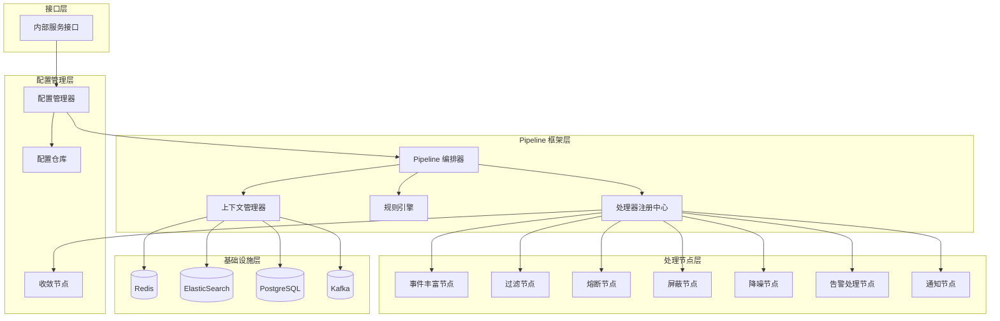

### 模块划分

#### 1. 框架核心模块 (framework/)

- **pipeline/**: Pipeline 编排和执行引擎
- **processor/**: 处理器接口和注册机制
- **rule/**: 规则引擎和条件匹配
- **config/**: 配置管理和验证
- **context/**: 上下文管理和状态传递
- **observable/**: 可观测性模块,包括日志记录、指标收集、Elasticsearch 存储

#### 2. 处理节点模块 (nodes/)

- **enrichment/**: 事件丰富节点实现
- **filter/**: 过滤节点实现
- **circuit_breaker/**: 熔断节点实现
- **shield/**: 屏蔽节点实现
- **converge/**: 收敛节点实现
- **notification/**: 通知节点实现
- **action/**: 动作触发节点实现

#### 3. 集成适配模块 (adapters/)

- **legacy/**: 现有处理器适配器
- **migration/**: 旧逻辑迁移工具
- **compat/**: 兼容性层

#### 4. 内部服务接口模块 (service/)

- **views.py**: REST API 视图
- **serializers.py**: 序列化器
- **urls.py**: 路由配置
- **manager.py**: 配置管理器

### 数据流设计

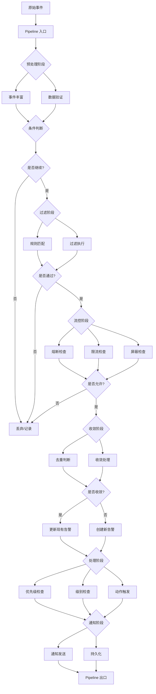

### 核心数据结构

#### Pipeline 配置结构

```python
@dataclass
class PipelineConfig:
    """Pipeline 配置定义"""
    id: str                                      # Pipeline 唯一标识
    name: str                                    # Pipeline 名称
    version: str                                 # 版本号
    description: str                             # 描述
    scenario: str                                # 应用场景
    enabled: bool                                # 是否启用
    stages: List[StageConfig]                   # 阶段列表
    global_config: Dict[str, Any]                # 全局配置
    error_handling: ErrorHandlingConfig          # 错误处理配置
    metrics_config: MetricsConfig                # 监控配置

@dataclass
class StageConfig:
    """阶段配置定义"""
    name: str                                    # 阶段名称
    type: StageType                             # 阶段类型 (sequential/parallel/conditional)
    processors: List[ProcessorConfig]            # 处理器列表
    condition: Optional[str] = None              # 条件表达式
    enabled: bool = True                         # 是否启用
    timeout: Optional[int] = None                # 超时时间
    retry_config: Optional[RetryConfig] = None   # 重试配置
```

#### 处理器接口

```python
class IProcessor(ABC):
    """
    处理器基类 - 定义节点必须实现的抽象接口
    
    接口设计包含三类核心接口：
    1. 数据处理接口：process() - 完成数据的接收、处理和推送
    2. 配置接口：initialize()、get_config_schema()、validate_config()
    3. 元数据接口：name、version 属性
    """
    
    # ========== 数据处理接口 ==========
    
    @abstractmethod
    def process(self, context: ProcessContext) -> ProcessResult:
        """
        数据处理接口 - 核心方法，完成数据的接收、处理和推送
        
        该方法通过 ProcessContext 对象实现数据的流动：
        1. **数据接收**：从 context.event 和 context.alert 中读取输入数据
        2. **数据处理**：根据配置执行业务逻辑
        3. **数据推送**：修改 context 中的数据，传递给下一个节点
        
        Args:
            context: 处理上下文，包含输入数据（event/alert）和输出数据
        
        Returns:
            ProcessResult: 处理结果，包含处理后的 context
        
        数据流动示意：
            输入: context.event → 处理逻辑 → 输出: context.event (可能被修改)
            输入: context.alert → 处理逻辑 → 输出: context.alert (可能被新增或修改)
        """
        pass
    
    # ========== 配置接口 ==========
    
    @abstractmethod
    def initialize(self, config: Dict) -> None:
        """
        配置接收接口 - 接收并应用节点的专属配置
        
        这是节点接收配置的主要接口，在以下时机调用：
        - Pipeline 加载时（本地节点）
        - 节点启动时（远程节点）
        - 配置热更新时
        
        Args:
            config: 节点专属配置字典，符合 get_config_schema() 定义的格式
                   每个节点类型的配置格式不同，必须实现 get_config_schema() 定义
        
        Raises:
            ValueError: 配置验证失败时抛出
        """
        pass
    
    @classmethod
    @abstractmethod
    def get_config_schema(cls) -> Dict:
        """
        配置格式定义接口 - 定义节点的专属配置格式（JSON Schema）
        
        每个节点必须定义自己的配置格式，用于：
        - 配置验证器验证配置的正确性
        - 生成配置模板，帮助用户理解如何配置
        - IDE 自动补全和类型检查
        - 生成配置文档
        
        Returns:
            Dict: JSON Schema 格式的配置定义
        
        说明：
            不同节点类型的配置格式不同，例如：
            - 过滤节点：定义条件列表和匹配模式
            - 限流节点：定义限流键、阈值和时间窗口
            - 丰富化节点：定义数据映射规则
        """
        pass
    
    @abstractmethod
    def validate_config(self, config: Dict) -> bool:
        """
        配置验证接口 - 验证配置数据的有效性
        
        在 initialize() 之前调用，确保配置合法后再应用。
        该方法通常使用 pydantic 或 jsonschema 进行验证。
        
        Args:
            config: 待验证的配置字典
        
        Returns:
            bool: 配置是否有效
        
        Raises:
            ValueError: 配置验证失败时抛出详细错误信息，帮助用户快速定位问题
        """
        pass
    
    # ========== 元数据接口 ==========
    
    @property
    @abstractmethod
    def name(self) -> str:
        """
        节点名称属性
        
        Returns:
            str: 节点的唯一名称标识
        """
        pass
    
    @property
    @abstractmethod
    def version(self) -> str:
        """
        节点版本属性
        
        Returns:
            str: 节点版本号，遵循语义化版本规范（如 "1.0.0"）
        """
        pass
    
    # ========== 生命周期接口 ==========
    
    def cleanup(self) -> None:
        """
        资源清理接口 - 释放节点占用的资源
        
        在以下场景调用：
        - Pipeline 卸载时
        - 节点停止服务时
        - 配置重新加载前
        
        默认实现为空，子类可根据需要重写，例如：
        - 关闭数据库连接
        - 清理缓存
        - 停止后台线程
        """
        pass
```

**接口设计说明**：

1. **数据处理接口**：`process(context)` 方法
   - 通过 `ProcessContext` 对象实现数据的**隐式流动**
   - `context.event` 和 `context.alert` 是**输入数据**（接收接口）
   - 修改 `context` 中的数据就是**推送数据**（推送接口）
   - 这样设计的好处：简洁、统一、避免序列化开销

2. **配置接口**：
   - `initialize(config)` - 配置接收接口，每个节点接收专属配置
   - `get_config_schema()` - 配置格式定义接口，每个节点定义自己的格式
   - `validate_config()` - 配置验证接口，确保配置正确性

3. **元数据接口**：
   - `name` 和 `version` 属性，提供节点的标识信息

4. **生命周期接口**：
   - `cleanup()` 方法，用于资源清理

**数据流动示例**：

```python
class FilterNode(IProcessor):
    """过滤节点实现示例"""
    
    def process(self, context: ProcessContext) -> ProcessResult:
        """
        数据处理流程：
        1. 接收数据：从 context.event 中读取事件数据
        2. 处理数据：根据条件过滤
        3. 推送数据：通过 should_stop 标志控制是否继续处理
        """
        # 接收数据
        event_data = context.event.to_dict()
        
        # 处理数据
        if not self._should_pass(event_data):
            context.should_stop = True  # 控制数据流动
        
        # 推送数据（context 会被传递给下一个节点）
        return ProcessResult(success=not context.should_stop, context=context)
```

**配置示例**：

```python
# 过滤节点的专属配置格式
filter_config = {
    "name": "severity_filter",  # 节点名称
    "conditions": [              # 过滤条件（过滤节点专属）
        {"field": "severity", "op": "gte", "value": 3}
    ]
}

# 限流节点的专属配置格式（不同于过滤节点）
rate_limit_config = {
    "key_template": "{strategy_id}",  # 限流键模板（限流节点专属）
    "limit": 100,                      # 限流阈值
    "window": 60                       # 时间窗口
}
```

### 节点执行模式

#### 设计目标

框架支持两种节点执行模式，以适应不同的性能需求和部署场景：

1. **本地执行模式**：所有节点在同一台机器上执行，通过 ProcessContext 传递数据
2. **分布式执行模式**：节点分布在不同的机器上，通过网络接口传递数据

#### 架构对比

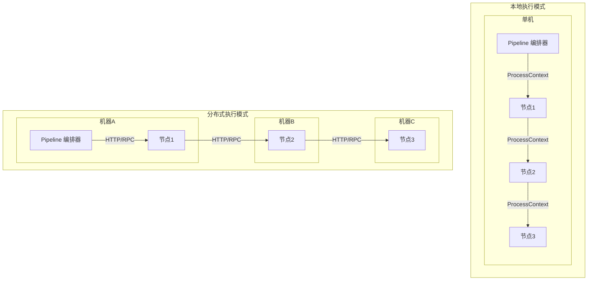

#### 混合部署架构

实际生产环境中，可以采用混合部署模式：

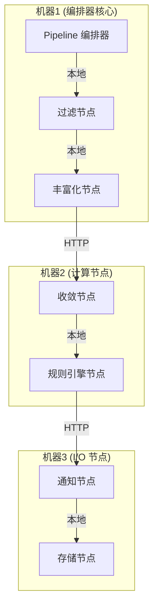

#### 节点接口设计

节点需要实现两套接口，支持两种执行模式：

##### 本地执行接口

```python
class IProcessor(ABC):
    """处理器基类 - 支持本地执行"""
    
    @abstractmethod
    def process(self, context: ProcessContext) -> ProcessResult:
        """
        本地执行接口 - 通过 ProcessContext 传递数据
        
        Args:
            context: 处理上下文，包含所有数据
        
        Returns:
            ProcessResult: 处理结果
        """
        pass
```

##### 分布式执行接口

```python
from fastapi import FastAPI, HTTPException
from pydantic import BaseModel

class ProcessRequest(BaseModel):
    """处理请求模型"""
    trace_id: str
    pipeline_id: str
    node_id: str
    event: Dict[str, Any]
    alert: Optional[Dict[str, Any]] = None
    data: Dict[str, Any] = {}
    metadata: Dict[str, Any] = {}
    state: Dict[str, Any] = {}

class ProcessResponse(BaseModel):
    """处理响应模型"""
    success: bool
    trace_id: str
    node_id: str
    event: Optional[Dict[str, Any]] = None
    alert: Optional[Dict[str, Any]] = None
    data: Dict[str, Any] = {}
    metadata: Dict[str, Any] = {}
    state: Dict[str, Any] = {}
    should_stop: bool = False
    should_skip: bool = False
    error_message: Optional[str] = None

class IDistributedProcessor(IProcessor):
    """分布式处理器接口 - 支持 HTTP 接口"""
    
    def __init__(self, config: Dict):
        self.config = config
        self.app = FastAPI()
        self._setup_routes()
    
    def _setup_routes(self):
        """设置 HTTP 路由"""
        
        @self.app.post("/process")
        async def process_http(request: ProcessRequest):
            """HTTP 处理接口"""
            try:
                # 构建上下文
                context = self._build_context(request)
                
                # 调用本地处理逻辑
                result = self.process(context)
                
                # 构建响应
                return self._build_response(result)
            except Exception as e:
                raise HTTPException(status_code=500, detail=str(e))
        
        @self.app.get("/health")
        async def health():
            """健康检查接口"""
            return {"status": "healthy", "node_id": self.node_id}
        
        @self.app.get("/config/schema")
        async def get_schema():
            """获取配置 Schema"""
            return {"schema": self.get_config_schema()}
    
    def _build_context(self, request: ProcessRequest) -> ProcessContext:
        """构建 ProcessContext"""
        return ProcessContext(
            event=Event.from_dict(request.event),
            alert=Alert.from_dict(request.alert) if request.alert else None,
            data=request.data,
            metadata=request.metadata,
            state=request.state,
            trace_id=request.trace_id
        )
    
    def _build_response(self, result: ProcessResult) -> ProcessResponse:
        """构建 ProcessResponse"""
        return ProcessResponse(
            success=result.success,
            trace_id=result.context.trace_id,
            node_id=self.node_id,
            event=result.context.event.to_dict() if result.context.event else None,
            alert=result.context.alert.to_dict() if result.context.alert else None,
            data=result.context.data,
            metadata=result.context.metadata,
            state=result.context.state,
            should_stop=result.context.should_stop,
            should_skip=result.context.should_skip
        )
    
    @property
    @abstractmethod
    def node_id(self) -> str:
        """节点唯一标识"""
        pass
    
    def start_server(self, host: str = "0.0.0.0", port: int = 8000):
        """启动 HTTP 服务器"""
        import uvicorn
        uvicorn.run(self.app, host=host, port=port)
```

#### 节点实现示例

```python
class FilterNode(IDistributedProcessor):
    """过滤节点 - 支持本地和分布式执行"""
    
    def __init__(self, config: Dict):
        super().__init__(config)
        self.conditions = config.get("conditions", [])
        self.matcher = ConditionMatcher(self.conditions)
    
    def process(self, context: ProcessContext) -> ProcessResult:
        """本地执行逻辑"""
        if not self.matcher.match(context.event.to_dict()):
            context.should_stop = True
            return ProcessResult(success=False, context=context)
        
        return ProcessResult(success=True, context=context)
    
    @property
    def node_id(self) -> str:
        return f"filter:{self.config.get('name', 'default')}"
    
    @classmethod
    def get_config_schema(cls) -> Dict:
        return {
            "type": "object",
            "properties": {
                "name": {"type": "string"},
                "conditions": {"type": "array"}
            }
        }

# 使用示例

# 本地执行
filter_node = FilterNode(config)
result = filter_node.process(context)

# 分布式执行（启动服务）
filter_node.start_server(host="0.0.0.0", port=8000)
```

#### Pipeline 编排器设计

编排器需要根据节点配置决定调用方式：

```python
from typing import Dict, Any, Union
import httpx

class NodeConfig(BaseModel):
    """节点配置"""
    id: str
    type: str
    config: Dict[str, Any]
    deployment: DeploymentMode = DeploymentMode.LOCAL
    endpoint: Optional[str] = None  # 远程节点地址

class DeploymentMode(str, Enum):
    """部署模式"""
    LOCAL = "local"
    REMOTE = "remote"

class PipelineOrchestrator:
    """Pipeline 编排器 - 支持本地和分布式执行"""
    
    def __init__(self):
        self.registry = ProcessorRegistry()
        self.http_client = httpx.AsyncClient(timeout=30.0)
    
    async def execute_node(
        self,
        node_config: NodeConfig,
        context: ProcessContext
    ) -> ProcessResult:
        """
        执行节点 - 根据部署模式选择调用方式
        
        Args:
            node_config: 节点配置
            context: 处理上下文
        
        Returns:
            ProcessResult: 处理结果
        """
        if node_config.deployment == DeploymentMode.LOCAL:
            # 本地执行
            return await self._execute_local(node_config, context)
        else:
            # 远程执行
            return await self._execute_remote(node_config, context)
    
    async def _execute_local(
        self,
        node_config: NodeConfig,
        context: ProcessContext
    ) -> ProcessResult:
        """本地执行节点"""
        processor = self.registry.get_processor(node_config.type)
        processor.initialize(node_config.config)
        return processor.process(context)
    
    async def _execute_remote(
        self,
        node_config: NodeConfig,
        context: ProcessContext
    ) -> ProcessResult:
        """远程执行节点"""
        if not node_config.endpoint:
            raise ValueError(f"Remote node {node_config.id} missing endpoint")
        
        # 构建请求
        request = ProcessRequest(
            trace_id=context.trace_id,
            pipeline_id=context.config.get("pipeline_id"),
            node_id=node_config.id,
            event=context.event.to_dict(),
            alert=context.alert.to_dict() if context.alert else None,
            data=context.data,
            metadata=context.metadata,
            state=context.state
        )
        
        # 发送 HTTP 请求
        response = await self.http_client.post(
            f"{node_config.endpoint}/process",
            json=request.dict()
        )
        response.raise_for_status()
        
        # 解析响应
        process_response = ProcessResponse(**response.json())
        
        # 构建结果
        context.event = Event.from_dict(process_response.event) if process_response.event else context.event
        context.alert = Alert.from_dict(process_response.alert) if process_response.alert else context.alert
        context.data.update(process_response.data)
        context.metadata.update(process_response.metadata)
        context.state.update(process_response.state)
        context.should_stop = process_response.should_stop
        context.should_skip = process_response.should_skip
        
        return ProcessResult(
            success=process_response.success,
            context=context
        )
```

#### Pipeline 配置示例

```json
{
  "id": "alert_pipeline_001",
  "name": "告警处理流程",
  "version": "1.0.0",
  "stages": [
    {
      "name": "预处理",
      "processors": [
        {
          "id": "filter_001",
          "type": "filter",
          "deployment": "local",
          "enabled": true,
          "config": {
            "conditions": [
              {"field": "severity", "op": "gte", "value": 3}
            ]
          }
        },
        {
          "id": "enrichment_001",
          "type": "enrichment",
          "deployment": "local",
          "enabled": true,
          "config": {
            "enrichments": [
              {"type": "cmdb", "source_field": "ip", "target_field": "host_info"}
            ]
          }
        }
      ]
    },
    {
      "name": "流控",
      "processors": [
        {
          "id": "rate_limit_001",
          "type": "rate_limit",
          "deployment": "remote",
          "endpoint": "http://rate-limit-node-1:8000",
          "enabled": true,
          "config": {
            "key_template": "{strategy_id}",
            "limit": 100,
            "window": 60
          }
        },
        {
          "id": "converge_001",
          "type": "converge",
          "deployment": "remote",
          "endpoint": "http://converge-node-1:8000",
          "enabled": true,
          "config": {
            "dimension": ["strategy_id", "dimension"],
            "window": 300
          }
        }
      ]
    },
    {
      "name": "通知",
      "processors": [
        {
          "id": "notification_001",
          "type": "notification",
          "deployment": "remote",
          "endpoint": "http://notification-node-1:8000",
          "enabled": true,
          "config": {
            "channels": ["email", "sms", "webhook"]
          }
        }
      ]
    }
  ]
}
```

#### 部署架构

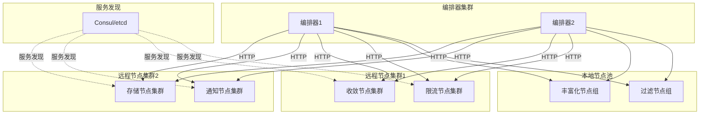

#### 服务发现集成

```python
from typing import Optional
import consul

class ServiceDiscovery:
    """服务发现 - 基于 Consul"""
    
    def __init__(self, consul_host: str = "localhost", consul_port: int = 8500):
        self.consul = consul.Consul(host=consul_host, port=consul_port)
    
    def get_node_endpoint(self, node_type: str, node_id: str) -> Optional[str]:
        """
        获取节点服务端点
        
        Args:
            node_type: 节点类型
            node_id: 节点 ID
        
        Returns:
            节点服务地址，格式: http://host:port
        """
        service_name = f"alertflow-{node_type}"
        _, services = self.consul.health.service(service_name, passing=True)
        
        if not services:
            return None
        
        # 简单的负载均衡：随机选择一个健康实例
        import random
        service = random.choice(services)
        return f"http://{service['Service']['Address']}:{service['Service']['Port']}"
    
    def register_node(
        self,
        node_type: str,
        node_id: str,
        host: str,
        port: int,
        tags: Optional[list] = None
    ):
        """注册节点服务"""
        service_name = f"alertflow-{node_type}"
        self.consul.agent.service.register(
            name=service_name,
            service_id=node_id,
            address=host,
            port=port,
            tags=tags or []
        )
    
    def deregister_node(self, node_id: str):
        """注销节点服务"""
        self.consul.agent.service.deregister(node_id)

# 在 Pipeline 编排器中集成服务发现

class PipelineOrchestrator:
    """Pipeline 编排器 - 集成服务发现"""
    
    def __init__(self):
        self.registry = ProcessorRegistry()
        self.http_client = httpx.AsyncClient(timeout=30.0)
        self.service_discovery = ServiceDiscovery()
    
    async def execute_node(
        self,
        node_config: NodeConfig,
        context: ProcessContext
    ) -> ProcessResult:
        """执行节点"""
        if node_config.deployment == DeploymentMode.LOCAL:
            return await self._execute_local(node_config, context)
        
        # 远程执行 - 自动发现服务
        endpoint = node_config.endpoint or self.service_discovery.get_node_endpoint(
            node_config.type,
            node_config.id
        )
        
        if not endpoint:
            raise ValueError(f"No available endpoint for node {node_config.id}")
        
        # 创建临时配置
        remote_config = node_config.copy()
        remote_config.endpoint = endpoint
        
        return await self._execute_remote(remote_config, context)
```

#### 性能考量

| 执行模式 | 优势 | 劣势 | 适用场景 |
|---------|------|------|---------|
| **本地执行** | • 无网络开销<br>• 数据传递快<br>• 部署简单 | • 资源受限<br>• 无法横向扩展 | • 轻量级处理<br>• 高频低延迟场景<br>• 开发测试环境 |
| **分布式执行** | • 水平扩展<br>• 资源隔离<br>• 高可用 | • 网络开销<br>• 序列化成本<br>• 部署复杂 | • 计算密集型任务<br>• 大规模数据处理<br>• 生产环境 |
| **混合部署** | • 灵活性高<br>• 成本优化<br>• 性能均衡 | • 运维复杂<br>• 监控困难 | • 复杂业务场景<br>• 多租户环境<br>• 资源受限场景 |

#### 最佳实践

1. **节点分类部署**：
   - 轻量级节点（过滤、验证）→ 本地执行
   - 计算密集型节点（收敛、规则引擎）→ 分布式执行
   - I/O 密集型节点（通知、存储）→ 分布式执行

2. **负载均衡**：
   - 远程节点集群使用服务发现和负载均衡
   - 使用健康检查确保服务可用性
   - 实现熔断机制防止级联故障

3. **性能优化**：
   - 本地节点使用 ProcessContext 避免序列化
   - 远程节点使用高效的序列化格式（JSON/Protobuf）
   - 启用 HTTP 连接池和 keep-alive

4. **可观测性**：
   - 记录节点执行模式（本地/远程）
   - 记录网络调用延迟
   - 监控节点健康状态

5. **容错机制**：
   - 远程节点调用失败时的重试策略
   - 本地节点作为降级方案
   - 超时控制和熔断保护

#### 多协议支持架构

##### 设计目标

框架支持多种通信协议，让用户根据**性能需求、安全要求、部署环境**灵活选择，而不是被单一协议绑定。

| 场景 | 推荐协议 | 原因 |
|------|---------|------|
| **开发/测试环境** | HTTP | 调试方便，可用 curl/Postman 直接测试 |
| **内网高吞吐** | gRPC | 低延迟、高性能、二进制传输 |
| **跨网络/安全敏感** | gRPC + mTLS | 强加密、双向认证 |
| **异步解耦场景** | Kafka | 削峰填谷、高可用 |

##### 架构设计

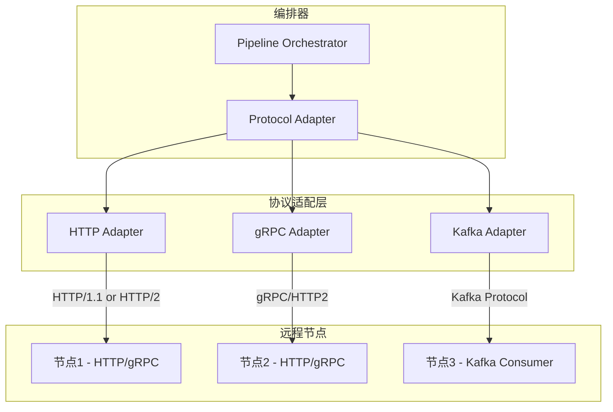

##### 协议抽象接口

```python
from abc import ABC, abstractmethod
from enum import Enum
from typing import Optional
from dataclasses import dataclass

class Protocol(str, Enum):
    """支持的通信协议"""
    HTTP = "http"
    GRPC = "grpc"
    KAFKA = "kafka"

@dataclass
class TransportConfig:
    """传输层配置"""
    protocol: Protocol
    endpoint: str
    timeout: int = 30
    # HTTP 特有配置
    http_version: str = "1.1"  # "1.1" or "2"
    # gRPC 特有配置
    use_tls: bool = True
    cert_path: Optional[str] = None
    # Kafka 特有配置
    topic: Optional[str] = None
    consumer_group: Optional[str] = None

class ITransportAdapter(ABC):
    """传输层适配器接口"""
    
    @abstractmethod
    async def send(self, context: ProcessContext) -> ProcessResult:
        """发送处理请求并等待响应"""
        pass
    
    @abstractmethod
    async def health_check(self) -> bool:
        """健康检查"""
        pass
    
    @abstractmethod
    def close(self) -> None:
        """关闭连接"""
        pass
```

##### HTTP 适配器

```python
import httpx
from typing import Dict, Any

class HttpTransportAdapter(ITransportAdapter):
    """HTTP 传输适配器"""
    
    def __init__(self, config: TransportConfig):
        self.config = config
        self.client = httpx.AsyncClient(
            timeout=config.timeout,
            http2=(config.http_version == "2"),
            verify=config.use_tls,
        )
    
    async def send(self, context: ProcessContext) -> ProcessResult:
        request = self._build_request(context)
        response = await self.client.post(
            f"{self.config.endpoint}/process",
            json=request.dict()
        )
        response.raise_for_status()
        return self._parse_response(response.json(), context)
    
    async def health_check(self) -> bool:
        try:
            resp = await self.client.get(f"{self.config.endpoint}/health")
            return resp.status_code == 200
        except Exception:
            return False
    
    def close(self) -> None:
        self.client.aclose()
```

##### gRPC 适配器

```python
import grpc
from grpc import aio
import alertflow_pb2
import alertflow_pb2_grpc

class GrpcTransportAdapter(ITransportAdapter):
    """gRPC 传输适配器"""
    
    def __init__(self, config: TransportConfig):
        self.config = config
        self.channel = self._create_channel()
        self.stub = alertflow_pb2_grpc.NodeProcessorStub(self.channel)
    
    def _create_channel(self) -> aio.Channel:
        if self.config.use_tls:
            with open(self.config.cert_path, 'rb') as f:
                credentials = grpc.ssl_channel_credentials(f.read())
            return aio.secure_channel(self.config.endpoint, credentials)
        return aio.insecure_channel(self.config.endpoint)
    
    async def send(self, context: ProcessContext) -> ProcessResult:
        request = self._build_grpc_request(context)
        response = await self.stub.Process(
            request, 
            timeout=self.config.timeout
        )
        return self._parse_grpc_response(response, context)
    
    async def health_check(self) -> bool:
        try:
            response = await self.stub.HealthCheck(
                alertflow_pb2.HealthRequest()
            )
            return response.status == "SERVING"
        except Exception:
            return False
    
    def close(self) -> None:
        self.channel.close()
```

##### Kafka 适配器（异步模式）

```python
from aiokafka import AIOKafkaProducer, AIOKafkaConsumer
import asyncio
import uuid

class KafkaTransportAdapter(ITransportAdapter):
    """Kafka 传输适配器 - 异步请求/响应模式"""
    
    def __init__(self, config: TransportConfig):
        self.config = config
        self.producer = AIOKafkaProducer(
            bootstrap_servers=config.endpoint
        )
        self.pending_requests: Dict[str, asyncio.Future] = {}
        self._start_response_consumer()
    
    async def send(self, context: ProcessContext) -> ProcessResult:
        correlation_id = str(uuid.uuid4())
        future = asyncio.get_event_loop().create_future()
        self.pending_requests[correlation_id] = future
        
        message = self._build_kafka_message(context, correlation_id)
        await self.producer.send_and_wait(
            self.config.topic,
            value=message
        )
        
        try:
            response = await asyncio.wait_for(
                future, 
                timeout=self.config.timeout
            )
            return self._parse_kafka_response(response, context)
        finally:
            self.pending_requests.pop(correlation_id, None)
    
    async def _consume_responses(self):
        """消费响应消息"""
        consumer = AIOKafkaConsumer(
            f"{self.config.topic}_response",
            bootstrap_servers=self.config.endpoint,
            group_id=self.config.consumer_group
        )
        await consumer.start()
        
        async for msg in consumer:
            correlation_id = msg.headers.get('correlation_id')
            if correlation_id in self.pending_requests:
                self.pending_requests[correlation_id].set_result(msg.value)
    
    async def health_check(self) -> bool:
        try:
            return self.producer._sender.is_alive()
        except Exception:
            return False
    
    def close(self) -> None:
        self.producer.stop()
```

##### 协议适配器工厂

```python
class TransportAdapterFactory:
    """传输适配器工厂"""
    
    _adapters = {
        Protocol.HTTP: HttpTransportAdapter,
        Protocol.GRPC: GrpcTransportAdapter,
        Protocol.KAFKA: KafkaTransportAdapter,
    }
    
    @classmethod
    def create(cls, config: TransportConfig) -> ITransportAdapter:
        adapter_class = cls._adapters.get(config.protocol)
        if not adapter_class:
            raise ValueError(f"Unsupported protocol: {config.protocol}")
        return adapter_class(config)
    
    @classmethod
    def register(cls, protocol: Protocol, adapter_class: type):
        """注册自定义协议适配器"""
        cls._adapters[protocol] = adapter_class
```

##### 编排器集成

```python
class PipelineOrchestrator:
    """Pipeline 编排器 - 支持多协议"""
    
    def __init__(self):
        self.registry = ProcessorRegistry()
        self.adapters: Dict[str, ITransportAdapter] = {}
    
    async def execute_node(
        self,
        node_config: NodeConfig,
        context: ProcessContext
    ) -> ProcessResult:
        if node_config.deployment == DeploymentMode.LOCAL:
            return await self._execute_local(node_config, context)
        
        # 根据配置选择协议
        adapter = self._get_or_create_adapter(node_config)
        return await adapter.send(context)
    
    def _get_or_create_adapter(self, node_config: NodeConfig) -> ITransportAdapter:
        cache_key = f"{node_config.id}:{node_config.transport.protocol}"
        
        if cache_key not in self.adapters:
            self.adapters[cache_key] = TransportAdapterFactory.create(
                node_config.transport
            )
        return self.adapters[cache_key]
```

##### gRPC Protobuf 消息定义

```protobuf
syntax = "proto3";

package alertflow;

service NodeProcessor {
    rpc Process(ProcessRequest) returns (ProcessResponse);
    rpc HealthCheck(HealthRequest) returns (HealthResponse);
    rpc UpdateConfig(ConfigRequest) returns (ConfigResponse);
}

message ProcessRequest {
    string trace_id = 1;
    string pipeline_id = 2;
    string node_id = 3;
    bytes event_data = 4;  // 序列化的事件数据
    bytes alert_data = 5;  // 序列化的告警数据
    map<string, bytes> metadata = 6;
    map<string, bytes> state = 7;
}

message ProcessResponse {
    bool success = 1;
    string trace_id = 2;
    bytes event_data = 3;
    bytes alert_data = 4;
    map<string, bytes> data = 5;
    bool should_stop = 6;
    bool should_skip = 7;
    string error_message = 8;
}

message HealthRequest {}

message HealthResponse {
    string status = 1;  // SERVING, NOT_SERVING
    string node_id = 2;
}

message ConfigRequest {
    bytes config_data = 1;
}

message ConfigResponse {
    bool success = 1;
    string message = 2;
}
```

##### 多协议 Pipeline 配置示例

```yaml
id: alert_pipeline_001
name: 告警处理流程
version: "1.0.0"

stages:
  - name: 预处理
    processors:
      - id: filter_001
        type: filter
        deployment: local  # 本地执行，无需网络
        config:
          conditions:
            - field: severity
              op: gte
              value: 3

  - name: 收敛处理
    processors:
      - id: converge_001
        type: converge
        deployment: remote
        transport:
          protocol: grpc  # 内网高性能场景用 gRPC
          endpoint: "converge-node:50051"
          use_tls: true
          cert_path: "/etc/certs/ca.crt"
        config:
          dimension: ["strategy_id", "dimension"]
          window: 300

  - name: 通知
    processors:
      - id: notification_001
        type: notification
        deployment: remote
        transport:
          protocol: kafka  # 异步解耦，削峰填谷
          endpoint: "kafka:9092"
          topic: "alertflow.notification"
          consumer_group: "notification-group"
        config:
          channels: ["email", "sms"]

  - name: 外部系统对接
    processors:
      - id: webhook_001
        type: webhook
        deployment: remote
        transport:
          protocol: http  # 对接外部系统，使用标准 HTTP
          endpoint: "https://external-system.example.com"
          http_version: "2"
          use_tls: true
        config:
          retry_count: 3
```

##### 节点服务端多协议支持

```python
class MultiProtocolNode(IDistributedProcessor):
    """多协议节点 - 同时暴露 HTTP 和 gRPC 接口"""
    
    def __init__(self, config: Dict):
        self.processor = self._create_processor(config)
        
        # HTTP 服务
        self.http_app = FastAPI()
        self._setup_http_routes()
        
        # gRPC 服务
        self.grpc_server = grpc.aio.server()
        self._setup_grpc_service()
    
    def _setup_http_routes(self):
        @self.http_app.post("/process")
        async def process_http(request: ProcessRequest):
            context = self._build_context(request)
            result = self.processor.process(context)
            return self._build_response(result)
    
    def _setup_grpc_service(self):
        servicer = NodeProcessorServicer(self.processor)
        alertflow_pb2_grpc.add_NodeProcessorServicer_to_server(
            servicer, self.grpc_server
        )
    
    async def start(self, http_port: int = 8000, grpc_port: int = 50051):
        """同时启动 HTTP 和 gRPC 服务"""
        # 启动 gRPC
        self.grpc_server.add_insecure_port(f'[::]:{grpc_port}')
        await self.grpc_server.start()
        
        # 启动 HTTP
        config = uvicorn.Config(self.http_app, host="0.0.0.0", port=http_port)
        server = uvicorn.Server(config)
        await server.serve()
```

##### 协议选择决策流程

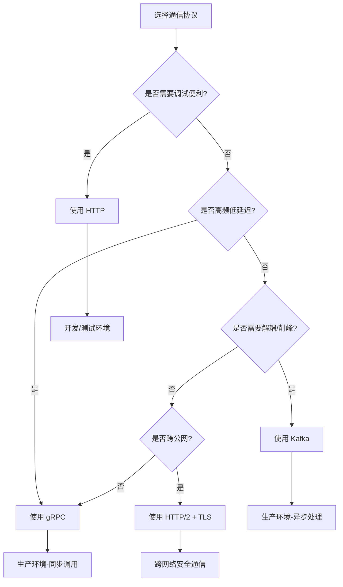

##### 协议对比与选型建议

| 特性 | HTTP/JSON | gRPC/Protobuf | Kafka |
|------|-----------|---------------|-------|
| **延迟** | 高 (5-10ms) | 低 (1-2ms) | 中 (2-5ms) |
| **吞吐量** | 低 | 高 | 很高 |
| **序列化开销** | 高 | 低 | 低 |
| **安全性** | 需额外配置 TLS | 内置 TLS/mTLS | 依赖 Kafka 配置 |
| **调试便利性** | 高 | 中 | 低 |
| **同步/异步** | 同步 | 同步/流式 | 异步 |
| **适用场景** | 开发调试、外部对接 | 内网高性能 | 削峰填谷、解耦 |

##### 多协议安全配置

###### HTTP TLS 配置

```python
import uvicorn
import ssl

ssl_context = ssl.SSLContext(ssl.PROTOCOL_TLS_SERVER)
ssl_context.load_cert_chain('server.crt', 'server.key')
ssl_context.load_verify_locations('ca.crt')
ssl_context.verify_mode = ssl.CERT_REQUIRED  # mTLS

uvicorn.run(app, host="0.0.0.0", port=8000, ssl=ssl_context)
```

###### gRPC mTLS 配置

```python
def serve_with_mtls(processor: IProcessor, port: int = 50051):
    """启动带 mTLS 的 gRPC 服务"""
    server = grpc.aio.server()
    
    # 加载证书
    with open('server.key', 'rb') as f:
        private_key = f.read()
    with open('server.crt', 'rb') as f:
        certificate_chain = f.read()
    with open('ca.crt', 'rb') as f:
        root_certificates = f.read()
    
    # 配置 mTLS
    server_credentials = grpc.ssl_server_credentials(
        [(private_key, certificate_chain)],
        root_certificates=root_certificates,
        require_client_auth=True
    )
    
    alertflow_pb2_grpc.add_NodeProcessorServicer_to_server(
        NodeProcessorServicer(processor), server
    )
    server.add_secure_port(f'[::]:{port}', server_credentials)
    return server
```

###### Kafka SASL/SSL 配置

```python
from aiokafka import AIOKafkaProducer

producer = AIOKafkaProducer(
    bootstrap_servers='kafka:9092',
    security_protocol='SASL_SSL',
    sasl_mechanism='SCRAM-SHA-256',
    sasl_plain_username='alertflow',
    sasl_plain_password='secret',
    ssl_cafile='/etc/certs/ca.crt',
    ssl_certfile='/etc/certs/client.crt',
    ssl_keyfile='/etc/certs/client.key',
)
```

##### 多协议支持的核心价值

| 维度 | 收益 |
|------|------|
| **灵活性** | 不同节点可选择最适合的协议 |
| **渐进式迁移** | 可从 HTTP 逐步迁移到 gRPC，无需一次性改造 |
| **场景适配** | 开发用 HTTP 调试，生产用 gRPC 性能 |
| **扩展性** | 工厂模式支持注册自定义协议适配器 |

#### 处理上下文

```python
@dataclass
class ProcessContext:
    """处理上下文 - 贯穿整个 Pipeline"""
    # 数据部分
    event: Event                                # 原始事件
    alert: Optional[Alert] = None               # 告警对象
    data: Dict[str, Any] = field(default_factory=dict)  # 扩展数据
    
    # 元数据
    metadata: Dict[str, Any] = field(default_factory=dict)  # 元数据
    
    # 状态
    state: Dict[str, Any] = field(default_factory=dict)     # 跨处理器共享状态
    
    # 配置
    config: Dict[str, Any] = field(default_factory=dict)    # Pipeline 配置
    
    # 执行信息
    errors: List[Exception] = field(default_factory=list)   # 错误收集
    metrics: Dict[str, Any] = field(default_factory=dict)   # 指标收集
    trace_id: Optional[str] = None                           # 追踪 ID
    
    # 控制标志
    should_stop: bool = False                # 是否停止后续处理
    should_skip: bool = False                # 是否跳过当前阶段
```

### 关键技术实现

#### 1. 处理器注册机制

- 使用装饰器方式注册处理器
- 支持动态发现和加载
- 版本兼容性检查
- 依赖关系管理

#### 2. 规则引擎 - 基于 jsonLogic

- **核心库**: jsonLogic - 标准 JSON 规则引擎
- **条件匹配器**: 内置的 ConditionMatcher (matcher/adapter.py)
- **支持的操作符**: eq/neq/gt/gte/lt/lte/in/not_in/include/exclude/regex/startswith/endswith
- **逻辑运算**: AND/OR/NOT
- **嵌套规则**: 支持复杂的多层嵌套条件
- **扩展操作**: 支持自定义操作注册(正则、前缀、后缀匹配等)

#### 3. Pipeline 执行引擎

- 顺序执行
- 并行执行
- 条件分支
- 循环执行
- 异常处理
- 超时控制
- 重试机制

#### 4. 配置管理

- JSON/YAML 配置文件支持
- 配置验证 (JSON Schema)
- 版本管理
- 热加载
- 配置回滚

#### 5. 可观测性

- **结构化日志**: 统一日志格式,支持 JSON 结构化输出
- **性能指标**: 处理器执行时间、Pipeline 整体耗时、吞吐量指标
- **追踪链路**: 基于 trace_id 的端到端追踪,支持分布式追踪
- **告警监控**: Pipeline 执行异常、性能瓶颈、限流/熔断等告警
- **全面数据记录**:
- 限流记录: 总到达次数、限流次数、限流时间窗口、限流阈值
- 屏蔽记录: 屏蔽开始时间、屏蔽结束时间、屏蔽原因、屏蔽规则
- 收敛记录: 收敛次数、收敛时长、收敛策略、去重统计
- 频率规则记录: 触发次数、触发时间、规则配置
- 完整流程追踪: 从事件输入到最终输出的完整链路记录
- **Elasticsearch 存储**:
- 专用索引存储各类执行日志
- 支持快速查询和聚合分析
- 提供时间范围、trace_id、策略维度等多维度检索
- 支持故障后快速定位和数据回溯

## 实现细节

### 核心目录结构

```
bkmonitor/alarm_backends/
├── framework/                           # 新增: Pipeline 框架核心
│   ├── __init__.py
│   ├── pipeline/                        # Pipeline 编排器
│   │   ├── __init__.py
│   │   ├── orchestrator.py             # 编排器实现
│   │   ├── executor.py                 # 执行器
│   │   └── context.py                  # 上下文管理
│   ├── processor/                       # 处理器框架
│   │   ├── __init__.py
│   │   ├── base.py                     # 处理器基类
│   │   ├── registry.py                 # 注册中心
│   │   └── factory.py                  # 工厂类
│   ├── rule/                            # 规则引擎
│   │   ├── __init__.py
│   │   ├── engine.py                   # 规则引擎
│   │   ├── matcher.py                  # 条件匹配器
│   │   └── condition.py                # 条件定义
│   ├── config/                          # 配置管理
│   │   ├── __init__.py
│   │   ├── manager.py                  # 配置管理器
│   │   ├── validator.py                # 配置验证器
│   │   ├── loader.py                   # 配置加载器
│   │   └── storage.py                  # 配置存储
│   └── metrics/                        # 可观测性
│       ├── __init__.py
│       ├── collector.py                # 指标收集
│       └── tracer.py                   # 追踪器
├── nodes/                               # 新增: 预置处理节点
│   ├── __init__.py
│   ├── enrichment/                      # 丰富化节点
│   │   ├── __init__.py
│   │   ├── base.py
│   │   ├── cmdb_enricher.py
│   │   └── tag_enricher.py
│   ├── filter/                          # 过滤节点
│   │   ├── __init__.py
│   │   ├── rule_filter.py
│   │   └── severity_filter.py
│   ├── circuit_breaker/                 # 熔断节点
│   │   ├── __init__.py
│   │   ├── base.py
│   │   └── circuit_breaker_node.py
│   ├── shield/                          # 屏蔽节点
│   │   ├── __init__.py
│   │   ├── base.py
│   │   └── shield_node.py
│   ├── converge/                        # 收敛节点
│   │   ├── __init__.py
│   │   ├── base.py
│   │   └── converge_node.py
│   ├── notification/                     # 通知节点
│   │   ├── __init__.py
│   │   ├── base.py
│   │   └── notification_node.py
│   └── action/                          # 动作节点
│       ├── __init__.py
│       ├── base.py
│       └── action_trigger_node.py
├── adapters/                            # 新增: 集成适配层
│   ├── __init__.py
│   ├── legacy/                         # 现有处理器适配器
│   │   ├── __init__.py
│   │   ├── converge_adapter.py         # 收敛处理器适配
│   │   ├── composite_adapter.py        # 关联告警适配
│   │   └── fta_action_adapter.py       # 动作处理器适配
│   └── migration/                      # 迁移工具
│       ├── __init__.py
│       └── legacy_migrator.py
├── service/                            # 新增: 内部服务接口
│   ├── __init__.py
│   ├── views.py
│   ├── serializers.py
│   ├── urls.py
│   └── manager.py
└── templates/                          # 新增: Pipeline 配置模板
    ├── alert_pipeline_template.json
    └── access_pipeline_template.json
```

### 关键代码结构

#### 处理器基类

```python
class IProcessor(ABC):
    """处理器基类 - 定义统一接口"""
    
    @property
    @abstractmethod
    def name(self) -> str:
        """处理器名称"""
        pass
    
    @property
    @abstractmethod
    def version(self) -> str:
        """处理器版本"""
        pass
    
    @classmethod
    @abstractmethod
    def get_config_schema(cls) -> Dict:
        """返回配置 Schema"""
        pass
    
    @abstractmethod
    def initialize(self, config: Dict) -> None:
        """初始化"""
        pass
    
    @abstractmethod
    def process(self, context: ProcessContext) -> ProcessResult:
        """处理数据"""
        pass
    
    def validate_config(self, config: Dict) -> bool:
        """验证配置"""
        return True
```

#### Pipeline 编排器

```python
class PipelineOrchestrator:
    """Pipeline 编排器 - 负责流程编排和执行"""
    
    def __init__(self):
        self.registry = ProcessorRegistry()
        self.rule_engine = RuleEngine()
        self.pipelines: Dict[str, PipelineDefinition] = {}
    
    def load_pipeline(self, config: Dict) -> PipelineDefinition:
        """加载 Pipeline 配置"""
        pass
    
    def execute(self, pipeline_id: str, data: Any) -> ProcessContext:
        """执行 Pipeline"""
        pass
    
    def reload_pipeline(self, pipeline_id: str) -> None:
        """热加载 Pipeline"""
        pass
```

### 技术实现计划

#### 阶段一: 框架核心开发

1. **处理器框架**: 实现处理器基类和注册机制
2. **规则引擎**: 实现条件匹配和规则评估
3. **上下文管理**: 实现处理上下文和状态传递
4. **Pipeline 编排器**: 实现流程编排和执行引擎

#### 阶段二: 配置管理

1. **配置加载**: 实现 JSON/YAML 配置加载
2. **配置验证**: 实现 Schema 验证
3. **配置存储**: 实现配置持久化到数据库
4. **热加载**: 实现配置热更新机制

#### 阶段三: 处理节点实现

1. **丰富化节点**: 实现事件丰富节点
2. **过滤节点**: 实现规则过滤节点
3. **熔断节点**: 实现熔断检查节点
4. **屏蔽节点**: 实现屏蔽检查节点
5. **收敛节点**: 实现收敛处理节点
6. **通知节点**: 实现通知发送节点

#### 阶段四: 集成适配

1. **适配器开发**: 开展现有处理器适配器
2. **迁移工具**: 实现旧逻辑迁移工具
3. **兼容层**: 实现向后兼容层

#### 阶段五: 内部服务接口

1. **API 开发**: 开发 REST API
2. **序列化器**: 实现数据序列化
3. **配置管理器**: 实现配置管理的 CRUD 接口

#### 阶段六: 可观测性

1. **日志收集**: 实现结构化日志,集成 Django 日志系统
2. **指标收集**: 实现性能指标、计数器、计时器等监控指标
3. **链路追踪**: 实现基于 trace_id 的端到端追踪
4. **监控告警**: 实现监控和告警
5. **数据记录**: 实现限流、屏蔽、收敛、频率规则等全面数据记录
6. **Elasticsearch 存储**: 实现 ES 索引管理和数据查询接口
7. **故障排查工具**: 提供基于 trace_id 的事故回溯接口

#### 阶段七: 第三方库集成

1. **jsonLogic 集成**: 集成 jsonLogic 规则引擎,实现条件匹配功能
2. **Redis 限流**: 基于 Redis + Lua 实现分布式限流功能
3. **structlog 集成**: 替换传统 logging,实现结构化日志输出
4. **pydantic 验证**: 集成 pydantic 进行配置对象验证和类型检查
5. **jsonschema 验证**: 集成 jsonschema 进行严格 Schema 验证

### 集成点

#### 与现有系统集成

1. **Event 模型**: 直接使用 `core/alert/event.py` 中的 Event 类
2. **Alert 模型**: 直接使用 `core/alert/alert.py` 中的 Alert 类
3. **Strategy 配置**: 复用 `core/cache/strategy.py` 的策略缓存
4. **Shield 配置**: 复用 `core/cache/shield.py` 的屏蔽配置
5. **Circuit Breaking**: 复用 `core/circuit_breaking/` 的熔断机制
6. **Converge 逻辑**: 复用 `service/converge/` 的收敛逻辑
7. **Storage**: 复用 `core/storage/` 的存储抽象

#### 配置数据格式

- JSON 格式: 便于机器解析和 API 交互
- YAML 格式: 便于人工编辑和维护
- 存储: PostgreSQL (Pipeline 配置表)

#### 第三方依赖

- **Django**: Web 框架 (现有)
- **DRF**: API 框架 (现有)
- **Redis**: 缓存 (现有)
- **ElasticSearch**: 搜索和持久化 (现有)
- **Kafka**: 消息队列 (现有)
- **Celery**: 异步任务 (现有)
- **jsonLogic**: 规则引擎 (新增) - 用于条件匹配和规则评估
- **pydantic**: 数据验证 (新增) - 配置对象验证和类型检查
- **jsonschema**: Schema 验证 (新增) - 严格的 JSON Schema 验证
- **structlog**: 结构化日志 (新增) - 结构化日志输出
- **redis-py**: Redis 客户端 (现有，新增限流功能)
- **prometheus-client**: 指标收集 (可选) - 如果使用 Prometheus 监控

### 技术考量

#### 日志

- 保持现有日志格式和级别
- 使用结构化日志 (JSON 格式)
- 增加 Pipeline 执行日志
- 支持 trace_id 追踪

#### 性能优化

- 处理器实例池化
- 并行执行优化
- 配置缓存
- 异步处理支持
- 批处理优化

#### 安全措施

- 配置访问权限控制
- 输入验证和过滤
- SQL 注入防护
- XSS 防护
- 敏感数据脱敏

#### 可扩展性

- 插件化处理器架构
- 动态加载机制
- 多租户支持
- 配置版本管理
- 灰度发布支持

## 可观测性设计

### 设计目标

为框架提供全面的可观测性能力,确保在发生事故时能够快速定位问题、回溯处理流程、分析故障原因。所有关键处理环节的数据都必须被记录,并通过 Elasticsearch 进行持久化存储,支持快速查询和分析。

### 核心设计原则

1. **全面记录**: 每个处理节点的关键操作都必须记录
2. **链路追踪**: 使用 trace_id 关联整个处理流程
3. **快速查询**: 基于 Elasticsearch 实现毫秒级查询响应
4. **多维分析**: 支持按时间、策略、节点等多种维度查询
5. **故障回溯**: 提供完整的事故回溯能力

### Elasticsearch 索引设计

#### 1. 执行日志索引 (alertflow_execution_log)

记录 Pipeline 的整体执行信息。

```python
{
    "trace_id": "uuid",              # 追踪 ID
    "pipeline_id": "str",            # Pipeline ID
    "pipeline_name": "str",          # Pipeline 名称
    "event_id": "str",               # 事件 ID
    "status": "success/failed",      # 执行状态
    "start_time": "datetime",        # 开始时间
    "end_time": "datetime",          # 结束时间
    "duration_ms": "int",            # 执行时长(毫秒)
    "input_event": "dict",           # 输入事件数据
    "output_alert": "dict",          # 输出告警数据
    "error_message": "str",          # 错误信息(如果有)
    "error_stack": "str",          # 错误堆栈(如果有)
    "nodes_executed": "list",        # 执行的节点列表
    "metadata": "dict"               # 元数据
}
```

#### 2. 节点执行日志索引 (alertflow_node_log)

记录每个处理节点的执行详情。

```python
{
    "trace_id": "uuid",              # 追踪 ID
    "pipeline_id": "str",            # Pipeline ID
    "node_id": "str",                # 节点 ID
    "node_name": "str",              # 节点名称
    "node_type": "str",              # 节点类型
    "status": "success/failed/skipped",  # 执行状态
    "start_time": "datetime",        # 开始时间
    "end_time": "datetime",          # 结束时间
    "duration_ms": "int",            # 执行时长(毫秒)
    "input_data": "dict",            # 输入数据
    "output_data": "dict",           # 输出数据
    "config": "dict",                # 节点配置
    "error_message": "str",          # 错误信息(如果有)
    "metadata": "dict"               # 元数据
}
```

#### 3. 限流日志索引 (alertflow_rate_limit_log)

记录限流操作的详细信息。

```python
{
    "trace_id": "uuid",              # 追踪 ID
    "strategy_id": "str",            # 策略 ID
    "strategy_name": "str",          # 策略名称
    "dimension": "dict",             # 限流维度(如: ip, user_id)
    "total_requests": "int",         # 总请求数
    "limited_requests": "int",      # 被限流的请求数
    "passed_requests": "int",       # 通过的请求数
    "threshold": "int",             # 限流阈值
    "window_size": "int",           # 时间窗口大小(秒)
    "timestamp": "datetime",        # 限流时间点
    "result": "passed/limited"      # 限流结果
}
```

#### 4. 屏蔽日志索引 (alertflow_shield_log)

记录屏蔽操作的详细信息。

```python
{
    "trace_id": "uuid",              # 追踪 ID
    "strategy_id": "str",            # 策略 ID
    "shield_id": "str",              # 屏蔽规则 ID
    "shield_name": "str",            # 屏蔽规则名称
    "shield_type": "str",           # 屏蔽类型
    "dimension": "dict",             # 屏蔽维度
    "start_time": "datetime",        # 屏蔽开始时间
    "end_time": "datetime",          # 屏蔽结束时间(如果是临时屏蔽)
    "reason": "str",                 # 屏蔽原因
    "is_active": "bool",             # 是否当前生效
    "config": "dict",                # 屏蔽配置
    "timestamp": "datetime"         # 记录时间
}
```

#### 5. 收敛日志索引 (alertflow_converge_log)

记录收敛操作的详细信息。

```python
{
    "trace_id": "uuid",              # 追踪 ID
    "strategy_id": "str",            # 策略 ID
    "converge_id": "str",            # 收敛规则 ID
    "converge_name": "str",          # 收敛规则名称
    "converge_type": "str",          # 收敛类型
    "dimension": "dict",             # 收敛维度
    "event_count": "int",            # 收敛的事件数量
    "alert_id": "str",               # 关联的告警 ID
    "converge_start_time": "datetime",  # 收敛开始时间
    "converge_end_time": "datetime",    # 收敛结束时间
    "duration_ms": "int",            # 收敛时长(毫秒)
    "config": "dict",                 # 收敛配置
    "timestamp": "datetime"          # 记录时间
}
```

#### 6. 频率规则日志索引 (alertflow_frequency_rule_log)

记录频率规则触发的详细信息。

```python
{
    "trace_id": "uuid",              # 追踪 ID
    "strategy_id": "str",            # 策略 ID
    "rule_id": "str",                # 频率规则 ID
    "rule_name": "str",              # 频率规则名称
    "dimension": "dict",             # 频率维度
    "trigger_count": "int",          # 触发次数
    "window_size": "int",            # 时间窗口大小(秒)
    "threshold": "int",              # 触发阈值
    "trigger_time": "datetime",      # 触发时间
    "action": "str",                 # 执行的动作
    "config": "dict",                # 规则配置
    "timestamp": "datetime"          # 记录时间
}
```

### 可观测性架构

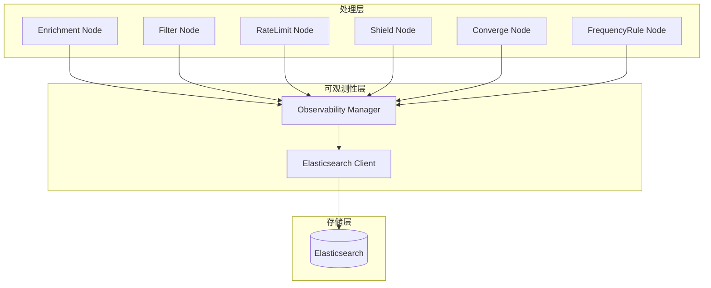

### 可观测性 Mixin

所有处理节点继承 `ObservabilityMixin` 基类,自动实现数据记录功能。

```python
from abc import ABC
from typing import Any, Dict, Optional
from datetime import datetime
import uuid

class ObservabilityMixin(ABC):
    """可观测性 Mixin - 为处理器提供自动日志记录功能"""
    
    def __init__(self):
        self.observability_manager: Optional['ObservabilityManager'] = None
        self.trace_id: Optional[str] = None
    
    def set_observability(self, manager: 'ObservabilityManager', trace_id: str):
        """设置可观测性管理器和追踪 ID"""
        self.observability_manager = manager
        self.trace_id = trace_id
    
    def record_node_execution(self, **kwargs):
        """记录节点执行信息"""
        if self.observability_manager:
            self.observability_manager.record_node_execution(
                trace_id=self.trace_id,
                node_id=self.get_node_id(),
                node_name=self.get_name(),
                node_type=self.get_type(),
                **kwargs
            )
    
    def record_rate_limit(self, **kwargs):
        """记录限流信息"""
        if self.observability_manager:
            self.observability_manager.record_rate_limit(
                trace_id=self.trace_id,
                **kwargs
            )
    
    def record_shield(self, **kwargs):
        """记录屏蔽信息"""
        if self.observability_manager:
            self.observability_manager.record_shield(
                trace_id=self.trace_id,
                **kwargs
            )
    
    def record_converge(self, **kwargs):
        """记录收敛信息"""
        if self.observability_manager:
            self.observability_manager.record_converge(
                trace_id=self.trace_id,
                **kwargs
            )
    
    def record_frequency_rule(self, **kwargs):
        """记录频率规则信息"""
        if self.observability_manager:
            self.observability_manager.record_frequency_rule(
                trace_id=self.trace_id,
                **kwargs
            )
    
    @abstractmethod
    def get_node_id(self) -> str:
        """获取节点 ID"""
        pass
    
    @abstractmethod
    def get_name(self) -> str:
        """获取节点名称"""
        pass
    
    @abstractmethod
    def get_type(self) -> str:
        """获取节点类型"""
        pass
```

### 可观测性管理器

```python
class ObservabilityManager:
    """可观测性管理器 - 统一管理所有日志记录"""
    
    def __init__(self, es_client: 'ESClient'):
        self.es_client = es_client
    
    def record_node_execution(
        self,
        trace_id: str,
        node_id: str,
        node_name: str,
        node_type: str,
        status: str,
        start_time: datetime,
        end_time: datetime,
        input_data: Dict[str, Any],
        output_data: Dict[str, Any],
        config: Dict[str, Any],
        error_message: Optional[str] = None,
        **kwargs
    ):
        """记录节点执行日志"""
        document = {
            "trace_id": trace_id,
            "node_id": node_id,
            "node_name": node_name,
            "node_type": node_type,
            "status": status,
            "start_time": start_time,
            "end_time": end_time,
            "duration_ms": int((end_time - start_time).total_seconds() * 1000),
            "input_data": input_data,
            "output_data": output_data,
            "config": config,
            "error_message": error_message,
            **kwargs
        }
        self.es_client.index(index="alertflow_node_log", document=document)
    
    def record_rate_limit(
        self,
        trace_id: str,
        strategy_id: str,
        strategy_name: str,
        dimension: Dict[str, Any],
        total_requests: int,
        limited_requests: int,
        threshold: int,
        window_size: int,
        result: str,
        **kwargs
    ):
        """记录限流日志"""
        document = {
            "trace_id": trace_id,
            "strategy_id": strategy_id,
            "strategy_name": strategy_name,
            "dimension": dimension,
            "total_requests": total_requests,
            "limited_requests": limited_requests,
            "passed_requests": total_requests - limited_requests,
            "threshold": threshold,
            "window_size": window_size,
            "timestamp": datetime.utcnow(),
            "result": result,
            **kwargs
        }
        self.es_client.index(index="alertflow_rate_limit_log", document=document)
    
    def record_shield(
        self,
        trace_id: str,
        strategy_id: str,
        shield_id: str,
        shield_name: str,
        shield_type: str,
        dimension: Dict[str, Any],
        start_time: datetime,
        end_time: Optional[datetime],
        reason: str,
        is_active: bool,
        config: Dict[str, Any],
        **kwargs
    ):
        """记录屏蔽日志"""
        document = {
            "trace_id": trace_id,
            "strategy_id": strategy_id,
            "shield_id": shield_id,
            "shield_name": shield_name,
            "shield_type": shield_type,
            "dimension": dimension,
            "start_time": start_time,
            "end_time": end_time,
            "reason": reason,
            "is_active": is_active,
            "config": config,
            "timestamp": datetime.utcnow(),
            **kwargs
        }
        self.es_client.index(index="alertflow_shield_log", document=document)
    
    def record_converge(
        self,
        trace_id: str,
        strategy_id: str,
        converge_id: str,
        converge_name: str,
        converge_type: str,
        dimension: Dict[str, Any],
        event_count: int,
        alert_id: str,
        converge_start_time: datetime,
        converge_end_time: datetime,
        config: Dict[str, Any],
        **kwargs
    ):
        """记录收敛日志"""
        document = {
            "trace_id": trace_id,
            "strategy_id": strategy_id,
            "converge_id": converge_id,
            "converge_name": converge_name,
            "converge_type": converge_type,
            "dimension": dimension,
            "event_count": event_count,
            "alert_id": alert_id,
            "converge_start_time": converge_start_time,
            "converge_end_time": converge_end_time,
            "duration_ms": int((converge_end_time - converge_start_time).total_seconds() * 1000),
            "config": config,
            "timestamp": datetime.utcnow(),
            **kwargs
        }
        self.es_client.index(index="alertflow_converge_log", document=document)
    
    def record_frequency_rule(
        self,
        trace_id: str,
        strategy_id: str,
        rule_id: str,
        rule_name: str,
        dimension: Dict[str, Any],
        trigger_count: int,
        window_size: int,
        threshold: int,
        trigger_time: datetime,
        action: str,
        config: Dict[str, Any],
        **kwargs
    ):
        """记录频率规则日志"""
        document = {
            "trace_id": trace_id,
            "strategy_id": strategy_id,
            "rule_id": rule_id,
            "rule_name": rule_name,
            "dimension": dimension,
            "trigger_count": trigger_count,
            "window_size": window_size,
            "threshold": threshold,
            "trigger_time": trigger_time,
            "action": action,
            "config": config,
            "timestamp": datetime.utcnow(),
            **kwargs
        }
        self.es_client.index(index="alertflow_frequency_rule_log", document=document)
    
    def record_pipeline_execution(
        self,
        trace_id: str,
        pipeline_id: str,
        pipeline_name: str,
        event_id: str,
        status: str,
        start_time: datetime,
        end_time: datetime,
        input_event: Dict[str, Any],
        output_alert: Optional[Dict[str, Any]],
        nodes_executed: list,
        error_message: Optional[str] = None,
        **kwargs
    ):
        """记录 Pipeline 执行日志"""
        document = {
            "trace_id": trace_id,
            "pipeline_id": pipeline_id,
            "pipeline_name": pipeline_name,
            "event_id": event_id,
            "status": status,
            "start_time": start_time,
            "end_time": end_time,
            "duration_ms": int((end_time - start_time).total_seconds() * 1000),
            "input_event": input_event,
            "output_alert": output_alert,
            "nodes_executed": nodes_executed,
            "error_message": error_message,
            **kwargs
        }
        self.es_client.index(index="alertflow_execution_log", document=document)
    
    def query_by_trace_id(self, trace_id: str) -> Dict[str, Any]:
        """根据 trace_id 查询完整的执行链路"""
        # 查询所有相关日志
        execution_logs = self.es_client.search(
            index="alertflow_execution_log",
            body={"query": {"term": {"trace_id": trace_id}}}
        )
        
        node_logs = self.es_client.search(
            index="alertflow_node_log",
            body={"query": {"term": {"trace_id": trace_id}}}
        )
        
        rate_limit_logs = self.es_client.search(
            index="alertflow_rate_limit_log",
            body={"query": {"term": {"trace_id": trace_id}}}
        )
        
        shield_logs = self.es_client.search(
            index="alertflow_shield_log",
            body={"query": {"term": {"trace_id": trace_id}}}
        )
        
        converge_logs = self.es_client.search(
            index="alertflow_converge_log",
            body={"query": {"term": {"trace_id": trace_id}}}
        )
        
        frequency_rule_logs = self.es_client.search(
            index="alertflow_frequency_rule_log",
            body={"query": {"term": {"trace_id": trace_id}}}
        )
        
        return {
            "execution": execution_logs,
            "nodes": node_logs,
            "rate_limits": rate_limit_logs,
            "shields": shield_logs,
            "converges": converge_logs,
            "frequency_rules": frequency_rule_logs
        }
```

### 故障排查接口

提供基于 REST API 的故障排查接口,支持快速查询和分析。

```python
# bkmonitor/alarm_backends/service/views.py

from rest_framework import views
from rest_framework.response import Response
from .observable.manager import ObservabilityManager

class TraceQueryView(views.APIView):
    """根据 trace_id 查询完整执行链路"""
    
    def get(self, request, trace_id):
        manager = ObservabilityManager.get_instance()
        trace_data = manager.query_by_trace_id(trace_id)
        return Response(trace_data)

class StrategyAnalysisView(views.APIView):
    """策略维度的分析接口"""
    
    def get(self, request):
        strategy_id = request.query_params.get('strategy_id')
        start_time = request.query_params.get('start_time')
        end_time = request.query_params.get('end_time')
        
        manager = ObservabilityManager.get_instance()
        
        # 查询该策略的限流统计
        rate_limit_stats = manager.es_client.aggregate(
            index="alertflow_rate_limit_log",
            body={
                "query": {
                    "bool": {
                        "must": [
                            {"term": {"strategy_id": strategy_id}},
                            {"range": {"timestamp": {"gte": start_time, "lte": end_time}}}
                        ]
                    }
                },
                "aggs": {
                    "total_requests": {"sum": {"field": "total_requests"}},
                    "limited_requests": {"sum": {"field": "limited_requests"}},
                    "passed_requests": {"sum": {"field": "passed_requests"}}
                }
            }
        )
        
        return Response({
            "strategy_id": strategy_id,
            "rate_limit_stats": rate_limit_stats
        })

class TimeRangeAnalysisView(views.APIView):
    """时间范围分析接口"""
    
    def get(self, request):
        start_time = request.query_params.get('start_time')
        end_time = request.query_params.get('end_time')
        index_type = request.query_params.get('type', 'execution')  # execution/node/rate_limit/etc
        
        manager = ObservabilityManager.get_instance()
        
        index_map = {
            "execution": "alertflow_execution_log",
            "node": "alertflow_node_log",
            "rate_limit": "alertflow_rate_limit_log",
            "shield": "alertflow_shield_log",
            "converge": "alertflow_converge_log",
            "frequency_rule": "alertflow_frequency_rule_log"
        }
        
        index = index_map.get(index_type, "alertflow_execution_log")
        
        logs = manager.es_client.search(
            index=index,
            body={
                "query": {
                    "range": {
                        "timestamp": {
                            "gte": start_time,
                            "lte": end_time
                        }
                    }
                },
                "sort": [{"timestamp": {"order": "desc"}}],
                "size": 1000
            }
        )
        
        return Response({
            "type": index_type,
            "start_time": start_time,
            "end_time": end_time,
            "logs": logs
        })
```

### 可观测性最佳实践

1. **Trace ID 生成**: 在事件进入 Pipeline 时生成唯一 trace_id
2. **异步写入**: 使用异步方式写入 Elasticsearch,避免影响主流程性能
3. **数据保留策略**: 设置合理的索引生命周期(ILM),定期清理过期数据
4. **监控告警**: 对 Elasticsearch 写入失败、查询超时等设置告警
5. **查询优化**: 使用合理的索引模板和映射,优化查询性能
6. **数据采样**: 在高并发场景下,可考虑对日志数据进行采样

## 配置管理设计

### 配置管理方式

框架采用**配置文件 + 数据库 + 命令行工具**的方式进行配置管理:

1. **配置文件**:
   - 支持 JSON 和 YAML 格式
   - 便于版本控制和团队协作
   - 支持配置模板和变量替换

2. **数据库持久化**:
   - PostgreSQL 存储配置元数据
   - 支持配置版本管理
   - 支持配置历史追溯

3. **命令行工具**:
   - 提供 Pipeline 配置的 CRUD 操作
   - 支持配置导入导出
   - 支持配置验证和测试

4. **内部服务接口**:
   - 提供 REST API 供其他服务调用
   - 支持配置查询和更新
   - 支持批量操作

### 配置管理命令

```bash
# 创建 Pipeline 配置
bk-monitor pipeline create --config config/pipeline.yaml

# 更新 Pipeline 配置
bk-monitor pipeline update --pipeline-id pipeline_001 --config config/pipeline.yaml

# 删除 Pipeline 配置
bk-monitor pipeline delete --pipeline-id pipeline_001

# 查询 Pipeline 配置
bk-monitor pipeline get --pipeline-id pipeline_001

# 列出所有 Pipeline 配置
bk-monitor pipeline list

# 验证配置文件
bk-monitor pipeline validate --config config/pipeline.yaml

# 测试 Pipeline 配置
bk-monitor pipeline test --config config/pipeline.yaml --test-data test/event.json
```

### REST API 接口

提供内部服务接口供其他后台服务调用:

```
POST   /api/v1/pipelines/               # 创建 Pipeline
GET    /api/v1/pipelines/               # 获取 Pipeline 列表
GET    /api/v1/pipelines/{id}/          # 获取 Pipeline 详情
PUT    /api/v1/pipelines/{id}/          # 更新 Pipeline
DELETE /api/v1/pipelines/{id}/          # 删除 Pipeline
POST   /api/v1/pipelines/{id}/validate  # 验证配置
POST   /api/v1/pipelines/{id}/test      # 测试配置
GET    /api/v1/pipelines/{id}/versions  # 获取配置版本历史
POST   /api/v1/pipelines/{id}/rollback  # 回滚到指定版本
```

### 配置数据结构

#### Pipeline 配置表

```python
class PipelineConfig:
    id: str                              # Pipeline 唯一标识
    name: str                            # Pipeline 名称
    version: str                         # 版本号
    description: str                     # 描述
    scenario: str                        # 应用场景
    enabled: bool                        # 是否启用
    config_json: Dict[str, Any]          # 完整配置 JSON
    created_at: datetime                 # 创建时间
    updated_at: datetime                 # 更新时间
    created_by: str                      # 创建人
```

#### 配置版本历史表

```python
class PipelineConfigVersion:
    id: str                              # 版本记录 ID
    pipeline_id: str                     # Pipeline ID
    version: str                         # 版本号
    config_json: Dict[str, Any]          # 配置 JSON 快照
    change_reason: str                   # 变更原因
    created_at: datetime                 # 创建时间
    created_by: str                      # 创建人
```

## 架构设计总结

### 核心架构决策

#### 1. 节点执行模式

框架支持**双模式执行**，根据业务需求灵活选择：

| 执行模式 | 数据传递方式 | 适用场景 | 优势 |
|---------|------------|---------|------|
| **本地执行** | ProcessContext 对象传递 | • 轻量级处理<br>• 高频低延迟场景<br>• 开发测试环境 | • 无网络开销<br>• 数据传递快<br>• 部署简单 |
| **分布式执行 (HTTP)** | HTTP/JSON 接口 | • 开发调试环境<br>• 外部系统对接 | • 调试便利<br>• 通用性强 |
| **分布式执行 (gRPC)** | gRPC/Protobuf 接口 | • 内网高性能场景<br>• 计算密集型任务 | • 低延迟<br>• 高吞吐<br>• 内置 TLS |
| **分布式执行 (Kafka)** | Kafka 消息队列 | • 异步解耦场景<br>• 削峰填谷 | • 高可用<br>• 水平扩展 |
| **混合部署** | ProcessContext + 多协议 | • 复杂业务场景<br>• 多租户环境 | • 灵活性高<br>• 成本优化<br>• 性能均衡 |

#### 2. 节点接口设计

每个节点需要实现三类接口：

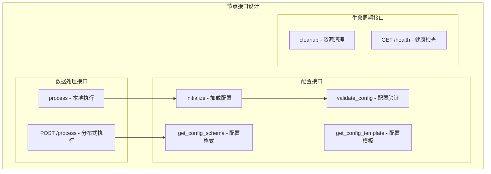

#### 3. 配置管理机制

每个节点都有**专属的配置格式**，通过 `get_config_schema()` 定义：

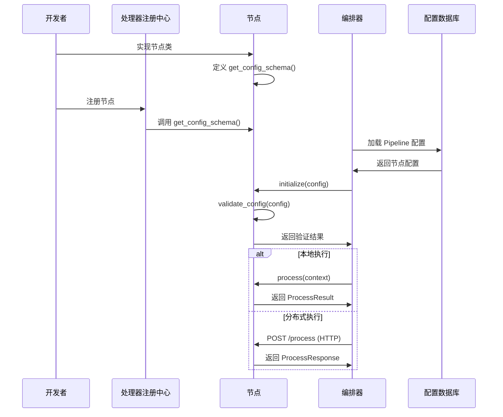

### 架构优势

1. **灵活性**：支持本地和分布式两种执行模式，可根据实际需求选择
2. **可扩展性**：分布式执行支持水平扩展，应对大规模数据处理
3. **类型安全**：每个节点定义专属配置格式，确保配置正确性
4. **易维护性**：清晰的接口设计，节点职责单一
5. **高性能**：本地执行无网络开销，分布式执行可并行处理
6. **高可用**：支持服务发现、负载均衡、熔断降级

### 技术栈总结

| 组件 | 技术选型 | 用途 |
|------|---------|------|
| **规则引擎** | jsonLogic + ConditionMatcher | 条件匹配和规则评估 |
| **限流** | Redis + Lua 脚本 | 分布式限流 |
| **配置验证** | pydantic + jsonschema | 配置对象验证 |
| **结构化日志** | structlog | JSON 格式日志输出 |
| **分布式通信** | 多协议支持 (HTTP/gRPC/Kafka) | 可插拔传输层，根据场景选择协议 |
| **HTTP 适配器** | FastAPI + httpx | 开发调试、外部系统对接 |
| **gRPC 适配器** | grpcio + protobuf | 内网高性能场景，低延迟二进制传输 |
| **Kafka 适配器** | aiokafka | 异步解耦、削峰填谷场景 |
| **服务发现** | Consul/etcd | 动态服务注册与发现 |
| **Pipeline编排** | 自研编排器 | 流程编排和执行 |
| **熔断/收敛** | 现有实现 | 复用成熟组件 |

### 最佳实践建议

1. **节点部署策略**：
   - 轻量级节点（过滤、验证）→ 本地执行
   - 计算密集型节点（收敛、规则引擎）→ 分布式执行
   - I/O 密集型节点（通知、存储）→ 分布式执行

2. **协议选择策略**：
   - **HTTP**: 开发调试环境、外部系统对接、需要 curl/Postman 测试的场景
   - **gRPC**: 内网高性能场景、对延迟敏感的调用、二进制数据传输
   - **Kafka**: 异步处理场景、削峰填谷、需要解耦生产者和消费者的场景
   - 可以同一 Pipeline 中混用多种协议，根据节点特点选择

3. **配置管理**：
   - 使用配置模板生成初始配置
   - 严格遵循节点配置 Schema
   - 支持配置热更新和版本管理

4. **可观测性**：
   - 记录节点执行模式（本地/远程）和使用的协议
   - 监控网络调用延迟（分布式模式）
   - 统一使用 structlog 输出结构化日志

5. **性能优化**：
   - 本地节点使用 ProcessContext 避免序列化
   - HTTP 节点使用连接池和 HTTP/2
   - gRPC 节点启用连接复用和流式传输
   - Kafka 节点使用批量发送和异步确认

6. **安全配置**：
   - HTTP: 启用 TLS/mTLS，配置 API Key 或 JWT 认证
   - gRPC: 启用 mTLS 双向认证
   - Kafka: 配置 SASL/SSL 认证加密

7. **容错机制**：
   - 实现重试策略和超时控制
   - 远程节点失败时降级到本地节点
   - 使用熔断器防止级联故障

## 总结

本文档描述了一个基于配置的数据流处理框架的设计方案。该框架专注于后台数据处理，通过 Pipeline 编排器实现可配置的告警处理流程，支持事件丰富、过滤、限流、熔断、屏蔽、收敛、通知等核心功能。

**核心特性**：
- **多协议支持**：支持 HTTP、gRPC、Kafka 三种通信协议，可根据场景灵活选择
- **可插拔架构**：协议适配器工厂模式，支持注册自定义协议
- **混合部署**：同一 Pipeline 中可混用多种协议，充分发挥各协议优势
- **安全通信**：支持 TLS/mTLS、SASL/SSL 等安全机制

框架采用纯后台架构，通过配置文件、数据库和命令行工具进行配置管理，提供 REST API 供其他服务调用，不包含任何用户界面组件。

## 第三方库详细使用说明

### 1. 规则引擎 - jsonLogic

#### 库选择
- **jsonLogic**: 轻量级的 JSON 规则引擎,支持复杂的条件表达式
- **已实现**: matcher/adapter.py 中的 ConditionMatcher 已完成集成

#### 核心功能
- 简洁的条件配置格式
- 支持丰富的操作符: eq/neq/gt/gte/lt/lte/in/not_in/include/exclude/regex/startswith/endswith
- 支持 AND/OR/NOT 逻辑组合
- 支持自定义操作注册

#### 使用示例

```python
from matcher.adapter import ConditionMatcher

# 定义条件
conditions = [
    {"field": "severity", "op": "gte", "value": 3},
    {"field": "level", "op": "in", "value": ["error", "critical"]},
    {"field": "message", "op": "include", "value": "database"}
]

# 创建匹配器
matcher = ConditionMatcher(conditions)

# 匹配数据
data = {"severity": 4, "level": "error", "message": "database connection failed"}
result = matcher.match(data)  # True

# 快速匹配函数
from matcher.adapter import match
result = match(data, conditions)
```

#### 与 Pipeline 集成

```python
class FilterNode(IProcessor):
    """基于 jsonLogic 的过滤节点"""
    
    def __init__(self, config: Dict):
        self.conditions = config.get("conditions", [])
        self.matcher = ConditionMatcher(self.conditions)
    
    def process(self, context: ProcessContext) -> ProcessResult:
        if not self.matcher.match(context.event.to_dict()):
            context.should_stop = True
            return ProcessResult(success=False, context=context)
        
        return ProcessResult(success=True, context=context)
```

---

### 2. 限流 - Redis + Lua

#### 实现方案
基于 Redis 和 Lua 脚本实现滑动窗口限流算法,支持分布式场景。

#### 核心优势
- 高性能: 原子操作,避免竞态条件
- 分布式: 支持多实例部署
- 精确控制: 滑动窗口,避免固定窗口的边界问题

#### 限流配置

```python
@dataclass
class RateLimitConfig:
    """限流配置"""
    key: str                          # 限流键
    limit: int                        # 限流阈值
    window: int                       # 时间窗口(秒)
    strategy: str = "sliding_window"  # 限流策略
```

#### 实现代码

```python
import time
import redis
from typing import Dict, Optional

class RateLimiter:
    """基于 Redis 的分布式限流器"""
    
    # 滑动窗口限流 Lua 脚本
    SLIDING_WINDOW_SCRIPT = """
    local key = KEYS[1]
    local now = tonumber(ARGV[1])
    local window = tonumber(ARGV[2])
    local limit = tonumber(ARGV[3])
    
    -- 清理过期数据
    redis.call('ZREMRANGEBYSCORE', key, '-inf', now - window)
    
    -- 获取当前窗口内的请求数
    local current = redis.call('ZCARD', key)
    
    -- 判断是否超过限制
    if current < limit then
        redis.call('ZADD', key, now, now)
        redis.call('EXPIRE', key, window)
        return {1, current + 1}
    else
        return {0, current}
    end
    """
    
    def __init__(self, redis_client: redis.Redis):
        self.redis = redis_client
        self.script = self.redis.register_script(self.SLIDING_WINDOW_SCRIPT)
    
    def check(self, key: str, limit: int, window: int) -> tuple[bool, int]:
        """检查是否允许通过"""
        redis_key = f"rate_limit:{key}"
        result = self.script(
            keys=[redis_key],
            args=[int(time.time()), window, limit]
        )
        return bool(result[0]), result[1]
    
    def is_allowed(self, key: str, limit: int, window: int) -> bool:
        """简化接口: 仅返回是否允许"""
        allowed, _ = self.check(key, limit, window)
        return allowed
```

#### 与 Pipeline 集成

```python
class RateLimitNode(IProcessor):
    """限流节点"""
    
    def __init__(self, config: Dict):
        self.config = RateLimitConfig(**config)
        self.limiter = RateLimiter(get_redis_client())
    
    def process(self, context: ProcessContext) -> ProcessResult:
        # 构建限流键
        limit_key = self._build_limit_key(context)
        
        # 检查限流
        if not self.limiter.is_allowed(
            limit_key,
            self.config.limit,
            self.config.window
        ):
            # 记录限流日志
            context.metrics['rate_limited'] = True
            return ProcessResult(success=False, context=context)
        
        return ProcessResult(success=True, context=context)
    
    def _build_limit_key(self, context: ProcessContext) -> str:
        """构建限流键,可根据策略动态生成"""
        return f"{context.event.strategy_id}:{context.event.ip}"
```

---

### 3. 结构化日志 - structlog

#### 库选择
- **structlog**: 现代化的结构化日志库,支持多种输出格式

#### 核心优势
- JSON 格式输出,便于机器解析
- 自动上下文绑定
- 与 Elasticsearch 完美集成
- 支持多种处理器和渲染器

#### 配置示例

```python
import structlog
from logging.config import dictConfig

# 配置 structlog
dictConfig({
    "version": 1,
    "disable_existing_loggers": False,
    "formatters": {
        "json": {
            "()": structlog.stdlib.ProcessorFormatter,
            "processor": structlog.processors.JSONRenderer()
        }
    },
    "handlers": {
        "default": {
            "level": "INFO",
            "class": "logging.StreamHandler",
            "formatter": "json"
        }
    },
    "loggers": {
        "": {
            "handlers": ["default"],
            "level": "INFO",
            "propagate": True
        }
    }
})

# 配置 structlog
structlog.configure(
    processors=[
        structlog.stdlib.filter_by_level,
        structlog.stdlib.add_logger_name,
        structlog.stdlib.add_log_level,
        structlog.processors.TimeStamper(fmt="iso"),
        structlog.processors.StackInfoRenderer(),
        structlog.processors.format_exc_info,
        structlog.processors.UnicodeDecoder(),
        structlog.processors.JSONRenderer()
    ],
    context_class=dict,
    logger_factory=structlog.stdlib.LoggerFactory(),
    cache_logger_on_first_use=True
)
```

#### 使用示例

```python
import structlog

logger = structlog.get_logger(__name__)

# 自动绑定上下文
log = logger.bind(
    pipeline_id="alert_pipeline",
    trace_id="abc123",
    event_id="evt_001"
)

# 输出 JSON 格式日志
log.info("Processing event", severity=3, processor="filter")
```

#### 与 Pipeline 集成

```python
class ObservabilityMixin(ABC):
    """可观测性 Mixin - 使用 structlog 记录日志"""
    
    def __init__(self):
        self.logger = structlog.get_logger(self.__class__.__name__)
        self._log_context: Optional[Dict] = None
    
    def bind_log_context(self, **kwargs):
        """绑定日志上下文"""
        self._log_context = kwargs
        self.logger = self.logger.bind(**kwargs)
    
    def log_node_start(self, **kwargs):
        """记录节点开始"""
        self.logger.info("Node started", **kwargs)
    
    def log_node_success(self, **kwargs):
        """记录节点成功"""
        self.logger.info("Node completed successfully", **kwargs)
    
    def log_node_error(self, error: Exception, **kwargs):
        """记录节点错误"""
        self.logger.error("Node failed", error=str(error), **kwargs)
```

---

### 4. 配置验证 - pydantic

#### 库选择
- **pydantic**: 现代化的数据验证库,基于 Python 类型注解

#### 核心优势
- 自动类型验证
- 内置字段验证器
- IDE 友好的类型提示
- 支持 JSON Schema 生成
- 性能优异

#### 配置模型定义

```python
from pydantic import BaseModel, Field, validator
from typing import List, Optional
from enum import Enum

class ProcessorType(str, Enum):
    """处理器类型枚举"""
    ENRICHMENT = "enrichment"
    FILTER = "filter"
    RATE_LIMIT = "rate_limit"
    SHIELD = "shield"
    CONVERGE = "converge"

class ProcessorConfig(BaseModel):
    """处理器配置"""
    name: str = Field(..., description="处理器名称")
    type: ProcessorType
    enabled: bool = True
    timeout: Optional[int] = Field(None, gt=0, le=300, description="超时时间(秒)")
    config: Dict[str, Any] = Field(default_factory=dict)
    
    @validator('name')
    def name_must_not_be_empty(cls, v):
        if not v.strip():
            raise ValueError('name cannot be empty')
        return v

class StageConfig(BaseModel):
    """阶段配置"""
    name: str
    processors: List[ProcessorConfig]
    enabled: bool = True
    parallel: bool = False
    condition: Optional[str] = None

class PipelineConfig(BaseModel):
    """Pipeline 配置"""
    id: str
    name: str
    version: str
    enabled: bool = True
    stages: List[StageConfig]
    global_config: Dict[str, Any] = Field(default_factory=dict)
    
    class Config:
        extra = 'forbid'  # 禁止额外字段
```

#### 使用示例

```python
# 验证配置
try:
    config = PipelineConfig(**config_data)
    print("配置验证成功")
except ValidationError as e:
    print(f"配置验证失败: {e}")
```

#### 生成 JSON Schema

```python
# 生成 JSON Schema
schema = PipelineConfig.schema_json()
print(schema)
```

---

### 5. Schema 验证 - jsonschema

#### 库选择
- **jsonschema**: 标准的 JSON Schema 验证库

#### 核心优势
- 符合 JSON Schema 规范
- 支持复杂的验证规则
- 适用于外部配置验证

#### 使用示例

```python
from jsonschema import validate, ValidationError

# 定义 Schema
schema = {
    "type": "object",
    "properties": {
        "id": {"type": "string"},
        "name": {"type": "string", "minLength": 1},
        "stages": {
            "type": "array",
            "items": {
                "type": "object",
                "properties": {
                    "name": {"type": "string"},
                    "processors": {"type": "array"}
                },
                "required": ["name", "processors"]
            }
        }
    },
    "required": ["id", "name", "stages"]
}

# 验证配置
try:
    validate(instance=config_data, schema=schema)
    print("Schema 验证成功")
except ValidationError as e:
    print(f"Schema 验证失败: {e.message}")
    print(f"路径: {list(e.path)}")
```

#### 与 pydantic 结合使用

```python
class ConfigValidator:
    """配置验证器 - 组合使用 pydantic 和 jsonschema"""
    
    def __init__(self, schema: Optional[Dict] = None):
        self.json_schema = schema
    
    def validate(self, config_data: Dict):
        """双重验证"""
        # 第一步: pydantic 验证
        try:
            pipeline_config = PipelineConfig(**config_data)
        except ValidationError as e:
            raise ValueError(f"Pydantic 验证失败: {e}")
        
        # 第二步: jsonschema 验证(可选)
        if self.json_schema:
            try:
                validate(instance=config_data, schema=self.json_schema)
            except ValidationError as e:
                raise ValueError(f"JSON Schema 验证失败: {e.message}")
        
        return pipeline_config
```

---

### 6. 依赖安装

```bash
# 安装核心依赖
pip install jsonLogic
pip install pydantic
pip install jsonschema
pip install structlog
pip install redis

# 可选依赖 - 如果使用 Prometheus 监控
pip install prometheus-client
```

---

### 7. 第三方库集成架构

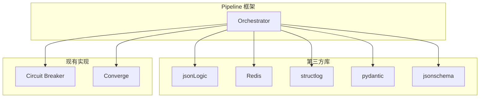

---

### 8. 最佳实践

#### 8.1 规则引擎
- 使用简洁的条件配置格式
- 复杂条件拆分为多个简单条件
- 定期审查规则性能

#### 8.2 限流
- 根据业务需求选择合适的限流策略
- 限流键设计要合理,避免过度限制
- 监控限流触发情况,及时调整阈值

#### 8.3 结构化日志
- 统一日志格式,便于分析
- 合理使用上下文绑定,避免信息冗余
- 敏感信息脱敏处理

#### 8.4 配置验证
- 使用 pydantic 进行日常配置验证
- 使用 jsonschema 进行严格 Schema 验证
- 提供清晰的错误提示,帮助用户快速定位问题

---

### 9. 性能考量

| 功能 | 第三方库 | 性能特点 | 优化建议 |
|------|---------|---------|---------|
| 规则匹配 | jsonLogic | 高性能,表达式求值快 | 缓存编译后的规则 |
| 限流 | Redis Lua | 高性能,原子操作 | 使用 Pipeline 批量操作 |
| 日志 | structlog | 轻量级,异步友好 | 异步写入 Elasticsearch |
| 配置验证 | pydantic | 高性能,编译时检查 | 缓存验证器实例 |

#### 节点配置接口设计

每个节点都需要接收配置，并且节点之间可能有不同的配置格式。节点提供三种配置接口：

##### 1. 配置加载接口

```python
class IProcessor(ABC):
    """处理器基类 - 支持配置加载"""
    
    @abstractmethod
    def initialize(self, config: Dict) -> None:
        """
        初始化处理器，接收配置
        
        这是节点接收配置的主要接口，在以下时机调用：
        - Pipeline 加载时（本地节点）
        - 节点启动时（远程节点）
        - 配置热更新时
        
        Args:
            config: 节点专属配置字典，符合 get_config_schema() 定义的格式
        
        Raises:
            ValueError: 配置验证失败
        """
        pass
    
    @classmethod
    @abstractmethod
    def get_config_schema(cls) -> Dict:
        """
        返回节点的配置 Schema（JSON Schema）
        
        每个节点必须定义自己的配置格式，用于：
        - 配置验证
        - 生成配置模板
        - 文档生成
        - IDE 自动补全
        
        Returns:
            JSON Schema 格式的配置定义
        """
        pass
    
    @abstractmethod
    def validate_config(self, config: Dict) -> bool:
        """
        验证配置是否有效
        
        在 initialize() 之前调用，确保配置合法。
        
        Args:
            config: 配置字典
        
        Returns:
            验证结果
        
        Raises:
            ValueError: 配置验证失败时抛出详细错误信息
        """
        pass
```

##### 2. 配置更新接口（远程节点）

```python
class IDistributedProcessor(IProcessor):
    """分布式处理器接口 - 支持动态配置更新"""
    
    def _setup_routes(self):
        """设置 HTTP 路由"""
        
        @self.app.post("/config/update")
        async def update_config(config: Dict):
            """配置更新接口"""
            try:
                # 验证配置
                if not self.validate_config(config):
                    raise ValueError("Invalid config")
                
                # 应用新配置
                self.initialize(config)
                
                return {"success": True, "message": "Config updated"}
            except Exception as e:
                raise HTTPException(status_code=400, detail=str(e))
        
        @self.app.get("/config")
        async def get_config():
            """获取当前配置"""
            return {"config": self.config}
```

##### 3. 配置模板接口

```python
class IProcessor(ABC):
    """处理器基类 - 支持配置模板"""
    
    @classmethod
    def get_config_template(cls) -> Dict:
        """
        获取配置模板
        
        提供带有默认值和注释的配置模板，方便用户理解如何配置。
        
        Returns:
            配置模板字典，包含默认值和说明
        """
        schema = cls.get_config_schema()
        return cls._generate_template_from_schema(schema)
    
    @classmethod
    def _generate_template_from_schema(cls, schema: Dict) -> Dict:
        """从 Schema 生成配置模板"""
        template = {}
        properties = schema.get("properties", {})
        
        for key, prop in properties.items():
            default = prop.get("default")
            description = prop.get("description", "")
            prop_type = prop.get("type")
            
            # 添加注释（在 JSON 中用 __comment_ 前缀）
            if description:
                template[f"__comment_{key}"] = description
            
            # 设置默认值
            if default is not None:
                template[key] = default
            elif prop_type == "string":
                template[key] = ""
            elif prop_type == "integer":
                template[key] = 0
            elif prop_type == "boolean":
                template[key] = False
            elif prop_type == "array":
                template[key] = []
            elif prop_type == "object":
                template[key] = {}
        
        return template
```

#### 节点配置格式示例

不同节点有不同的配置格式，以下是几个典型的节点配置示例：

##### 1. 过滤节点配置

```python
class FilterNode(IDistributedProcessor):
    """过滤节点配置"""
    
    @classmethod
    def get_config_schema(cls) -> Dict:
        """过滤节点配置 Schema"""
        return {
            "type": "object",
            "description": "过滤节点配置，用于基于规则条件过滤事件",
            "properties": {
                "name": {
                    "type": "string",
                    "description": "节点名称"
                },
                "conditions": {
                    "type": "array",
                    "description": "过滤条件列表，所有条件必须满足（AND 逻辑）",
                    "items": {
                        "type": "object",
                        "properties": {
                            "field": {
                                "type": "string",
                                "description": "字段名，支持嵌套路径如 'labels.env'"
                            },
                            "op": {
                                "type": "string",
                                "description": "操作符",
                                "enum": ["eq", "neq", "gt", "gte", "lt", "lte", "in", "not_in", 
                                        "include", "exclude", "regex", "startswith", "endswith"]
                            },
                            "value": {
                                "description": "比较值，可以是字符串、数字、数组等"
                            }
                        },
                        "required": ["field", "op", "value"]
                    }
                },
                "match_mode": {
                    "type": "string",
                    "description": "匹配模式",
                    "enum": ["any", "all"],
                    "default": "all"
                }
            },
            "required": ["conditions"]
        }
    
    @classmethod
    def get_config_template(cls) -> Dict:
        """配置模板"""
        return {
            "__comment_name": "节点名称",
            "name": "severity_filter",
            "__comment_conditions": "过滤条件列表",
            "conditions": [
                {
                    "__comment_field": "字段名",
                    "field": "severity",
                    "__comment_op": "操作符",
                    "op": "gte",
                    "__comment_value": "比较值",
                    "value": 3
                },
                {
                    "field": "labels.env",
                    "op": "in",
                    "value": ["prod", "staging"]
                }
            ],
            "__comment_match_mode": "匹配模式：any（任意匹配）或 all（全部匹配）",
            "match_mode": "all"
        }

# 配置示例
filter_config = {
    "name": "severity_filter",
    "conditions": [
        {"field": "severity", "op": "gte", "value": 3},
        {"field": "level", "op": "in", "value": ["error", "critical"]},
        {"field": "message", "op": "include", "value": "database"}
    ],
    "match_mode": "all"
}
```

##### 2. 限流节点配置

```python
class RateLimitNode(IDistributedProcessor):
    """限流节点配置"""
    
    @classmethod
    def get_config_schema(cls) -> Dict:
        """限流节点配置 Schema"""
        return {
            "type": "object",
            "description": "限流节点配置，基于 Redis 实现分布式限流",
            "properties": {
                "key_template": {
                    "type": "string",
                    "description": "限流键模板，支持变量替换如 '{strategy_id}:{ip}'"
                },
                "limit": {
                    "type": "integer",
                    "description": "限流阈值",
                    "minimum": 1
                },
                "window": {
                    "type": "integer",
                    "description": "时间窗口（秒）",
                    "minimum": 1
                },
                "strategy": {
                    "type": "string",
                    "description": "限流策略",
                    "enum": ["sliding_window", "fixed_window", "token_bucket"],
                    "default": "sliding_window"
                },
                "burst_size": {
                    "type": "integer",
                    "description": "突发容量（令牌桶模式）",
                    "minimum": 0,
                    "default": 10
                }
            },
            "required": ["key_template", "limit", "window"]
        }
    
    @classmethod
    def get_config_template(cls) -> Dict:
        """配置模板"""
        return {
            "__comment_key_template": "限流键模板，可用变量：{strategy_id}, {ip}, {event_id}",
            "key_template": "{strategy_id}:{ip}",
            "__comment_limit": "限流阈值",
            "limit": 100,
            "__comment_window": "时间窗口（秒）",
            "window": 60,
            "__comment_strategy": "限流策略",
            "strategy": "sliding_window"
        }

# 配置示例
rate_limit_config = {
    "key_template": "{strategy_id}:{ip}",
    "limit": 100,
    "window": 60,
    "strategy": "sliding_window"
}
```

##### 3. 丰富化节点配置

```python
class EnrichmentNode(IDistributedProcessor):
    """丰富化节点配置"""
    
    @classmethod
    def get_config_schema(cls) -> Dict:
        """丰富化节点配置 Schema"""
        return {
            "type": "object",
            "description": "丰富化节点配置，用于事件数据增强",
            "properties": {
                "enrichments": {
                    "type": "array",
                    "description": "丰富化规则列表",
                    "items": {
                        "type": "object",
                        "properties": {
                            "type": {
                                "type": "string",
                                "description": "丰富化类型",
                                "enum": ["cmdb", "tag", "custom", "static"]
                            },
                            "source_field": {
                                "type": "string",
                                "description": "源字段名"
                            },
                            "target_field": {
                                "type": "string",
                                "description": "目标字段名"
                            },
                            "mapping": {
                                "type": "object",
                                "description": "映射规则（type=custom 时使用）"
                            },
                            "static_value": {
                                "description": "静态值（type=static 时使用）"
                            }
                        },
                        "required": ["type", "target_field"]
                    }
                },
                "fallback_values": {
                    "type": "object",
                    "description": "丰富化失败时的默认值"
                },
                "timeout": {
                    "type": "integer",
                    "description": "超时时间（毫秒）",
                    "minimum": 100,
                    "default": 5000
                }
            },
            "required": ["enrichments"]
        }
    
    @classmethod
    def get_config_template(cls) -> Dict:
        """配置模板"""
        return {
            "__comment_enrichments": "丰富化规则列表",
            "enrichments": [
                {
                    "__comment_type": "丰富化类型",
                    "type": "cmdb",
                    "__comment_source_field": "源字段",
                    "source_field": "ip",
                    "__comment_target_field": "目标字段",
                    "target_field": "host_info"
                },
                {
                    "type": "custom",
                    "source_field": "level",
                    "target_field": "priority",
                    "__comment_mapping": "自定义映射",
                    "mapping": {
                        "critical": "P0",
                        "error": "P1",
                        "warning": "P2"
                    }
                }
            ],
            "__comment_fallback_values": "默认值",
            "fallback_values": {},
            "__comment_timeout": "超时时间（毫秒）",
            "timeout": 5000
        }

# 配置示例
enrichment_config = {
    "enrichments": [
        {
            "type": "cmdb",
            "source_field": "ip",
            "target_field": "host_info"
        },
        {
            "type": "custom",
            "source_field": "level",
            "target_field": "priority",
            "mapping": {
                "critical": "P0",
                "error": "P1",
                "warning": "P2"
            }
        }
    ],
    "fallback_values": {
        "host_info": {"unknown": True}
    },
    "timeout": 5000
}
```

##### 4. 收敛节点配置

```python
class ConvergeNode(IDistributedProcessor):
    """收敛节点配置"""
    
    @classmethod
    def get_config_schema(cls) -> Dict:
        """收敛节点配置 Schema"""
        return {
            "type": "object",
            "description": "收敛节点配置，用于事件去重和聚合",
            "properties": {
                "dimension": {
                    "type": "array",
                    "description": "收敛维度字段列表",
                    "items": {"type": "string"}
                },
                "window": {
                    "type": "integer",
                    "description": "收敛时间窗口（秒）",
                    "minimum": 1
                },
                "converge_type": {
                    "type": "string",
                    "description": "收敛类型",
                    "enum": ["count", "duration", "interval"],
                    "default": "count"
                },
                "threshold": {
                    "type": "integer",
                    "description": "收敛阈值",
                    "minimum": 1,
                    "default": 10
                },
                "action": {
                    "type": "string",
                    "description": "收敛动作",
                    "enum": ["suppress", "aggregate", "update"],
                    "default": "suppress"
                },
                "include_fields": {
                    "type": "array",
                    "description": "包含字段（仅用于 aggregate 动作）",
                    "items": {"type": "string"}
                }
            },
            "required": ["dimension", "window"]
        }
    
    @classmethod
    def get_config_template(cls) -> Dict:
        """配置模板"""
        return {
            "__comment_dimension": "收敛维度字段列表",
            "dimension": ["strategy_id", "dimension"],
            "__comment_window": "收敛时间窗口（秒）",
            "window": 300,
            "__comment_converge_type": "收敛类型",
            "converge_type": "count",
            "__comment_threshold": "收敛阈值",
            "threshold": 10,
            "__comment_action": "收敛动作",
            "action": "suppress"
        }

# 配置示例
converge_config = {
    "dimension": ["strategy_id", "dimension"],
    "window": 300,
    "converge_type": "count",
    "threshold": 10,
    "action": "suppress",
    "include_fields": ["first_event_time", "last_event_time", "event_count"]
}
```

#### 配置验证流程

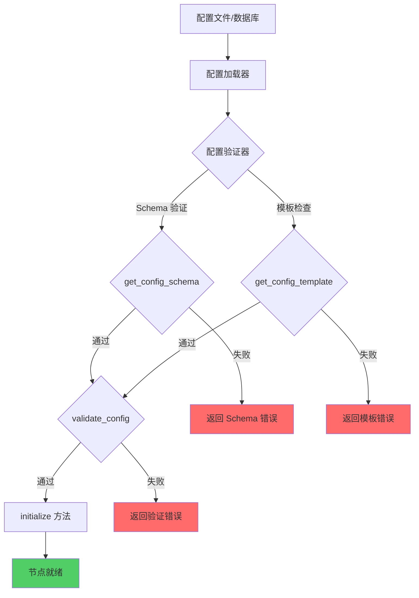

#### 配置管理接口

##### REST API 接口

```python
# bkmonitor/alarm_backends/service/views.py

from rest_framework import views
from rest_framework.response import Response
from framework.processor.registry import ProcessorRegistry

class NodeConfigView(views.APIView):
    """节点配置管理接口"""
    
    def get(self, request, node_type: str):
        """获取节点配置 Schema 和模板"""
        registry = ProcessorRegistry.get_instance()
        
        try:
            processor_class = registry.get_processor_class(node_type)
        except ValueError as e:
            return Response({"error": str(e)}, status=404)
        
        return Response({
            "node_type": node_type,
            "schema": processor_class.get_config_schema(),
            "template": processor_class.get_config_template()
        })

class NodeListView(views.APIView):
    """节点类型列表接口"""
    
    def get(self, request):
        """获取所有可用的节点类型"""
        registry = ProcessorRegistry.get_instance()
        
        nodes = []
        for node_type, processor_class in registry.get_all_processors().items():
            nodes.append({
                "type": node_type,
                "name": processor_class.__name__,
                "version": processor_class.get_version() if hasattr(processor_class, 'get_version') else "1.0.0",
                "description": processor_class.get_config_schema().get("description", "")
            })
        
        return Response({"nodes": nodes})

# URL 配置
# bkmonitor/alarm_backends/service/urls.py

from django.urls import path
from .views import NodeConfigView, NodeListView

urlpatterns = [
    path('api/v1/nodes/', NodeListView.as_view(), name='node-list'),
    path('api/v1/nodes/<str:node_type>/config/', NodeConfigView.as_view(), name='node-config'),
]
```

##### 命令行工具

```bash
# 获取节点配置 Schema
bk-monitor node schema filter

# 获取节点配置模板
bk-monitor node template rate-limit > config/rate_limit_example.yaml

# 验证节点配置
bk-monitor node validate --type filter --config config/filter.yaml

# 列出所有可用节点
bk-monitor node list
```

