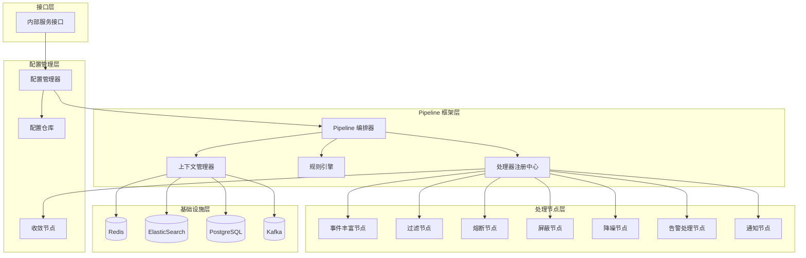
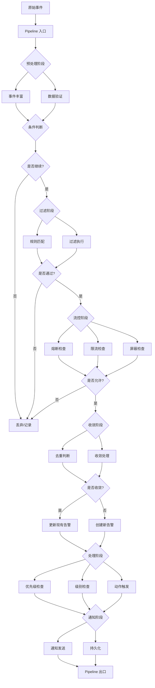
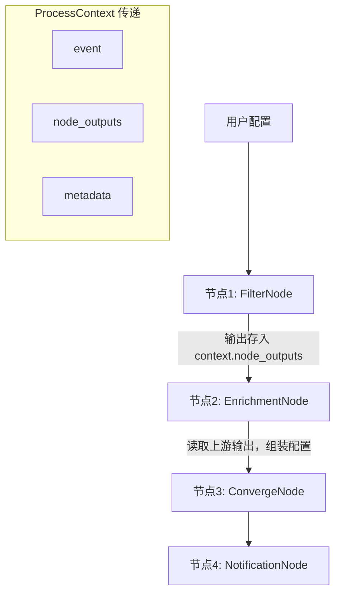
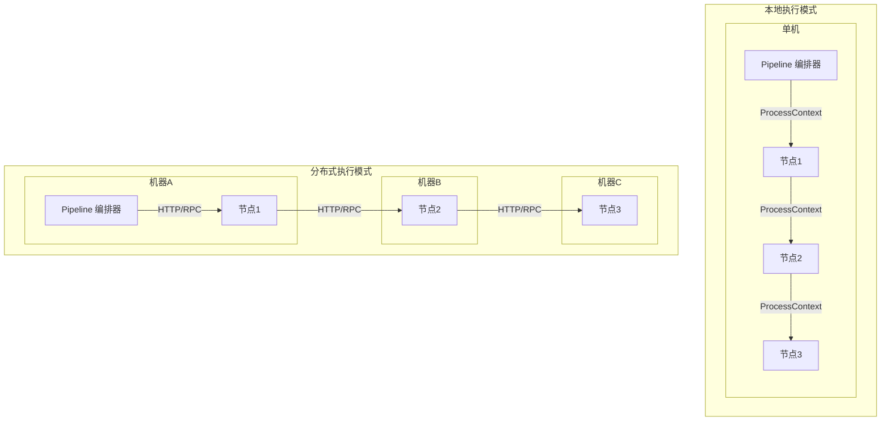
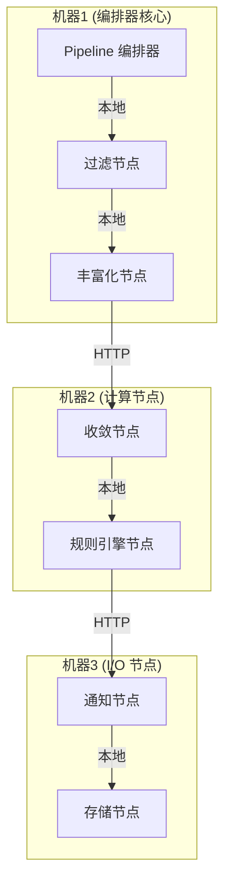
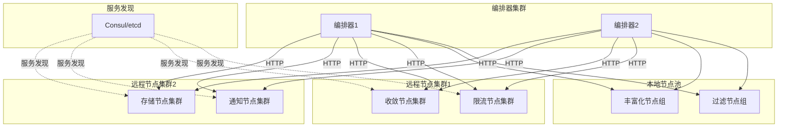
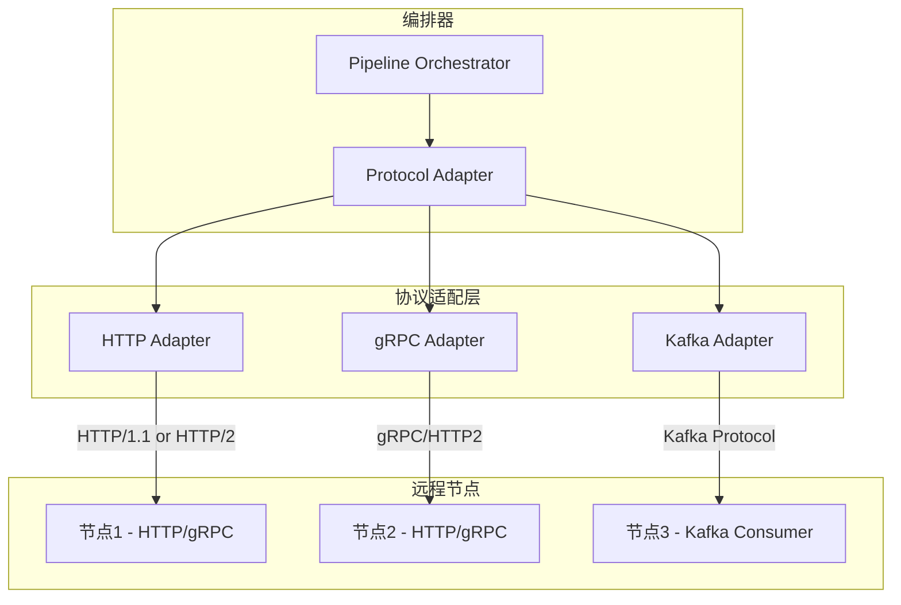
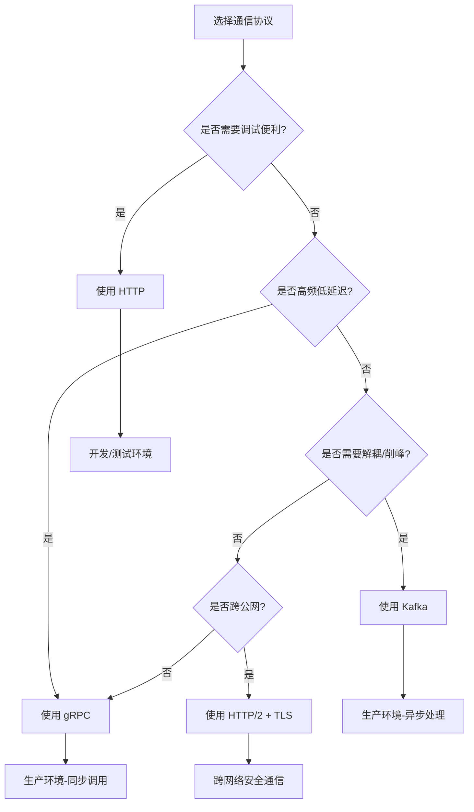

# 技术架构设计

> 返回 [目录](./README.md)

## 技术架构设计

### 系统架构

采用分层架构设计,保持与现有系统兼容:



### 模块划分

#### 1. 框架核心模块 (framework/)

- **pipeline/**: Pipeline 编排和执行引擎
- **processor/**: 处理器接口和注册机制
- **rule/**: 规则引擎和条件匹配
- **config/**: 配置管理和验证
- **context/**: 上下文管理和状态传递
- **observable/**: 可观测性模块,包括日志记录、指标收集、Elasticsearch 存储

#### 2. 处理节点模块 (nodes/)

- **enrichment/**: 事件丰富节点实现
- **filter/**: 过滤节点实现
- **circuit_breaker/**: 熔断节点实现
- **shield/**: 屏蔽节点实现
- **converge/**: 收敛节点实现
- **notification/**: 通知节点实现
- **action/**: 动作触发节点实现

#### 3. 集成适配模块 (adapters/)

- **legacy/**: 现有处理器适配器
- **migration/**: 旧逻辑迁移工具
- **compat/**: 兼容性层

#### 4. 内部服务接口模块 (service/)

- **views.py**: REST API 视图
- **serializers.py**: 序列化器
- **urls.py**: 路由配置
- **manager.py**: 配置管理器

### 数据流设计



### 核心数据结构

#### Pipeline 配置结构

```python
@dataclass
class PipelineConfig:
    """Pipeline 配置定义"""
    id: str                                      # Pipeline 唯一标识
    name: str                                    # Pipeline 名称
    version: str                                 # 版本号
    description: str                             # 描述
    scenario: str                                # 应用场景
    enabled: bool                                # 是否启用
    stages: List[StageConfig]                   # 阶段列表
    global_config: Dict[str, Any]                # 全局配置
    error_handling: ErrorHandlingConfig          # 错误处理配置
    metrics_config: MetricsConfig                # 监控配置

@dataclass
class StageConfig:
    """阶段配置定义"""
    name: str                                    # 阶段名称
    type: StageType                             # 阶段类型 (sequential/parallel/conditional)
    processors: List[ProcessorConfig]            # 处理器列表
    condition: Optional[str] = None              # 条件表达式
    enabled: bool = True                         # 是否启用
    timeout: Optional[int] = None                # 超时时间
    retry_config: Optional[RetryConfig] = None   # 重试配置
```

#### 处理器接口

```python
class IProcessor(ABC):
    """
    处理器基类 - 定义节点必须实现的抽象接口
    
    接口设计包含四类核心接口：
    1. 数据处理接口：process() - 完成数据的接收、处理和推送
    2. 配置接口：initialize()、get_config_schema()、validate_config()
    3. 输入输出 Schema 接口：get_input_schema()、get_output_schema() - 定义节点期望的输入和输出数据格式
    4. 元数据接口：name、version 属性
    """
    
    # ========== 数据处理接口 ==========
    
    @abstractmethod
    def process(self, context: ProcessContext) -> ProcessResult:
        """
        数据处理接口 - 核心方法，完成数据的接收、处理和推送
        
        该方法通过 ProcessContext 对象实现数据的流动：
        1. **数据接收**：从 context.event 和 context.alert 中读取输入数据
        2. **数据处理**：根据配置执行业务逻辑
        3. **数据推送**：修改 context 中的数据，传递给下一个节点
        
        Args:
            context: 处理上下文，包含输入数据（event/alert）和输出数据
        
        Returns:
            ProcessResult: 处理结果，包含处理后的 context
        
        数据流动示意：
            输入: context.event → 处理逻辑 → 输出: context.event (可能被修改)
            输入: context.alert → 处理逻辑 → 输出: context.alert (可能被新增或修改)
        """
        pass
    
    # ========== 配置接口 ==========
    
    @abstractmethod
    def initialize(self, config: Dict) -> None:
        """
        配置接收接口 - 接收并应用节点的专属配置
        
        这是节点接收配置的主要接口，在以下时机调用：
        - Pipeline 加载时（本地节点）
        - 节点启动时（远程节点）
        - 配置热更新时
        
        Args:
            config: 节点专属配置字典，符合 get_config_schema() 定义的格式
                   每个节点类型的配置格式不同，必须实现 get_config_schema() 定义
        
        Raises:
            ValueError: 配置验证失败时抛出
        """
        pass
    
    @classmethod
    @abstractmethod
    def get_config_schema(cls) -> Type[serializers.Serializer]:
        """
        配置格式定义接口 - 定义节点的专属配置格式（DRF Serializer）
        
        每个节点必须定义自己的配置格式，用于：
        - 配置验证器验证配置的正确性
        - 生成配置模板，帮助用户理解如何配置
        - IDE 自动补全和类型检查
        - 生成配置文档
        
        Returns:
            Type[serializers.Serializer]: DRF 序列化器类
        
        说明：
            不同节点类型的配置格式不同，例如：
            - 过滤节点：定义条件列表和匹配模式
            - 限流节点：定义限流键、阈值和时间窗口
            - 丰富化节点：定义数据映射规则
        """
        pass
    
    @abstractmethod
    def validate_config(self, config: Dict) -> bool:
        """
        配置验证接口 - 验证配置数据的有效性
        
        在 initialize() 之前调用，确保配置合法后再应用。
        该方法使用 DRF Serializer 进行验证。
        
        Args:
            config: 待验证的配置字典
        
        Returns:
            bool: 配置是否有效
        
        Raises:
            ValueError: 配置验证失败时抛出详细错误信息，帮助用户快速定位问题
        """
        pass
    
    # ========== 输入输出 Schema 接口 ==========
    
    @classmethod
    @abstractmethod
    def get_input_schema(cls) -> Type[serializers.Serializer]:
        """
        输入数据 Schema 接口 - 定义节点期望的输入数据格式
        
        这是节点暴露给用户的抽象接口，用户可以根据此 Schema
        了解该节点需要什么样的输入数据，从而组装配置。
        
        Returns:
            Type[serializers.Serializer]: DRF 序列化器类
        
        用途：
            - 用户根据此 Schema 组装输入数据
            - Pipeline 编排器验证节点连接的合法性
            - 自动生成文档
        """
        pass
    
    @classmethod
    @abstractmethod
    def get_output_schema(cls) -> Type[serializers.Serializer]:
        """
        输出数据 Schema 接口 - 定义节点产生的输出数据格式
        
        这是节点暴露给用户的抽象接口，用户可以根据此 Schema
        了解该节点输出什么样的数据，从而配置下游节点。
        
        Returns:
            Type[serializers.Serializer]: DRF 序列化器类
        
        用途：
            - 上一个节点的输出是下一个节点的输入
            - Pipeline 编排器验证节点链的数据流
            - 自动生成数据流图
        """
        pass
    
    # ========== 元数据接口 ==========
    
    @property
    @abstractmethod
    def name(self) -> str:
        """
        节点名称属性
        
        Returns:
            str: 节点的唯一名称标识
        """
        pass
    
    @property
    @abstractmethod
    def version(self) -> str:
        """
        节点版本属性
        
        Returns:
            str: 节点版本号，遵循语义化版本规范（如 "1.0.0"）
        """
        pass
    
    # ========== 生命周期接口 ==========
    
    def cleanup(self) -> None:
        """
        资源清理接口 - 释放节点占用的资源
        
        在以下场景调用：
        - Pipeline 卸载时
        - 节点停止服务时
        - 配置重新加载前
        
        默认实现为空，子类可根据需要重写，例如：
        - 关闭数据库连接
        - 清理缓存
        - 停止后台线程
        """
        pass
```

**接口设计说明**：

1. **数据处理接口**：`process(context)` 方法
   - 通过 `ProcessContext` 对象实现数据的**隐式流动**
   - `context.event` 和 `context.alert` 是**输入数据**（接收接口）
   - 修改 `context` 中的数据就是**推送数据**（推送接口）
   - 这样设计的好处：简洁、统一、避免序列化开销

2. **配置接口**：
   - `initialize(config)` - 配置接收接口，每个节点接收专属配置
   - `get_config_schema()` - 配置格式定义接口，返回 DRF Serializer
   - `validate_config()` - 配置验证接口，确保配置正确性

3. **输入输出 Schema 接口**：
   - `get_input_schema()` - 定义节点期望的输入数据格式
   - `get_output_schema()` - 定义节点产生的输出数据格式
   - **用户根据此接口组装配置**，上一个节点的输出是下一个节点的输入

4. **元数据接口**：
   - `name` 和 `version` 属性，提供节点的标识信息

5. **生命周期接口**：
   - `cleanup()` 方法，用于资源清理

### 配置传递机制

#### 设计理念

节点之间的配置传递通过 `ProcessContext` 实现：

```
上一个节点                    下一个节点
┌────────────────┐              ┌────────────────┐
│  FilterNode    │              │ EnrichmentNode │
│                │              │                │
│ output_schema ──────────────► input_schema   │
│                │  context     │                │
└────────────────┘  传递       └────────────────┘
```

#### ProcessContext 增强设计

```python
@dataclass
class ProcessContext:
    """
    处理上下文 - 节点间数据和配置的载体
    
    上一个节点的输出会通过 context 传递给下一个节点。
    用户可以通过 node_outputs 获取上游节点的输出，组装当前节点的配置。
    """
    
    # ========== 核心数据 ==========
    event: Event                          # 原始事件数据
    alert: Optional[Alert] = None         # 告警对象（可能由节点创建）
    
    # ========== 节点输出传递 ==========
    node_outputs: Dict[str, Any] = field(default_factory=dict)
    """
    节点输出字典 - 上一个节点的输出会存储在这里
    
    格式: {node_name: output_data}
    
    示例:
        {
            "filter_node": {"passed": true, "matched_conditions": [...]},
            "enrichment_node": {"host_info": {...}, "biz_info": {...}}
        }
    
    用户可以通过此字典获取上游节点的输出，组装当前节点的配置。
    """
    
    # ========== 运行时数据 ==========
    data: Dict[str, Any] = field(default_factory=dict)    # 临时数据存储
    metadata: Dict[str, Any] = field(default_factory=dict) # 元数据
    state: Dict[str, Any] = field(default_factory=dict)    # 状态数据
    
    # ========== 流程控制 ==========
    should_stop: bool = False             # 是否停止处理
    should_skip: bool = False             # 是否跳过后续节点
    
    # ========== 追踪信息 ==========
    trace_id: str = ""                    # 链路追踪 ID
    current_node: str = ""                # 当前执行的节点
    
    def set_node_output(self, node_name: str, output: Any) -> None:
        """设置节点输出，传递给下游节点"""
        self.node_outputs[node_name] = output
    
    def get_node_output(self, node_name: str) -> Optional[Any]:
        """获取上游节点的输出"""
        return self.node_outputs.get(node_name)
    
    def get_upstream_output(self, field_path: str) -> Any:
        """
        通过路径获取上游节点的输出
        
        Args:
            field_path: 路径格式为 "node_name.field.subfield"
        
        示例:
            context.get_upstream_output("enrichment_node.host_info.bk_biz_id")
        """
        parts = field_path.split(".")
        node_name = parts[0]
        output = self.node_outputs.get(node_name)
        
        for part in parts[1:]:
            if isinstance(output, dict):
                output = output.get(part)
            else:
                return None
        return output
```

#### 配置传递流程图



#### 配置传递示例

```python
class EnrichmentNode(IProcessor):
    """丰富化节点 - 演示如何使用上游节点的输出"""
    
    @classmethod
    def get_input_schema(cls) -> Type[serializers.Serializer]:
        """定义输入 Schema"""
        class EnrichmentInputSerializer(serializers.Serializer):
            event = serializers.DictField(help_text="原始事件")
            lookup_field = serializers.CharField(help_text="查询字段（如 event.ip）")
        return EnrichmentInputSerializer
    
    @classmethod
    def get_output_schema(cls) -> Type[serializers.Serializer]:
        """定义输出 Schema"""
        class EnrichmentOutputSerializer(serializers.Serializer):
            enriched_data = serializers.DictField(help_text="丰富后的数据")
            source = serializers.CharField(help_text="数据来源")
        return EnrichmentOutputSerializer
    
    def process(self, context: ProcessContext) -> ProcessResult:
        """
        处理流程：
        1. 从 context 读取输入数据
        2. 执行丰富化逻辑
        3. 将输出存入 context.node_outputs，传递给下游节点
        """
        # 1. 读取输入
        event_data = context.event.to_dict()
        lookup_value = self._get_field_value(event_data, self.config.lookup_field)
        
        # 2. 执行丰富化
        enriched_data = self._fetch_from_cmdb(lookup_value)
        
        # 3. 将输出存入 context，传递给下游节点
        context.set_node_output(self.name, {
            "enriched_data": enriched_data,
            "source": "cmdb"
        })
        
        # 4. 也可以直接修改 event
        for mapping in self.config.field_mappings:
            self._apply_mapping(context.event, enriched_data, mapping)
        
        return ProcessResult(success=True, context=context)


class NotificationNode(IProcessor):
    """通知节点 - 演示如何读取上游节点的输出"""
    
    def process(self, context: ProcessContext) -> ProcessResult:
        """
        处理流程：
        1. 读取上游节点的输出
        2. 组装通知内容
        3. 发送通知
        """
        # 读取上游 EnrichmentNode 的输出
        enrichment_output = context.get_node_output("enrichment_node")
        host_info = enrichment_output.get("enriched_data", {}) if enrichment_output else {}
        
        # 也可以通过路径直接获取
        biz_id = context.get_upstream_output("enrichment_node.enriched_data.bk_biz_id")
        
        # 组装通知内容
        notification_content = self._build_content(
            event=context.event,
            host_info=host_info,
            biz_id=biz_id
        )
        
        # 发送通知
        self._send_notification(notification_content)
        
        return ProcessResult(success=True, context=context)
```

#### 配置中引用上游输出

用户可以在配置中通过特殊语法引用上游节点的输出：

```json
{
  "name": "notification_node",
  "node_type": "notification",
  "template": {
    "title_template": "[告警] {{ event.alert_name }}",
    "content_template": "主机: {{ $upstream.enrichment_node.enriched_data.hostname }}\n业务: {{ $upstream.enrichment_node.enriched_data.bk_biz_name }}"
  }
}
```

**配置引用语法**：
- `{{ event.xxx }}` - 引用当前事件的字段
- `{{ alert.xxx }}` - 引用告警对象的字段
- `{{ $upstream.node_name.field }}` - 引用上游节点的输出

### 节点执行模式

#### 设计目标

框架支持两种节点执行模式，以适应不同的性能需求和部署场景：

1. **本地执行模式**：所有节点在同一台机器上执行，通过 ProcessContext 传递数据
2. **分布式执行模式**：节点分布在不同的机器上，通过网络接口传递数据

#### 架构对比



#### 混合部署架构

实际生产环境中，可以采用混合部署模式：



#### 节点接口设计

节点需要实现两套接口，支持两种执行模式：

##### 本地执行接口

```python
class IProcessor(ABC):
    """处理器基类 - 支持本地执行"""
    
    @abstractmethod
    def process(self, context: ProcessContext) -> ProcessResult:
        """
        本地执行接口 - 通过 ProcessContext 传递数据
        
        Args:
            context: 处理上下文，包含所有数据
        
        Returns:
            ProcessResult: 处理结果
        """
        pass
```

##### 分布式执行接口

```python
from fastapi import FastAPI, HTTPException
from pydantic import BaseModel

class ProcessRequest(BaseModel):
    """处理请求模型"""
    trace_id: str
    pipeline_id: str
    node_id: str
    event: Dict[str, Any]
    alert: Optional[Dict[str, Any]] = None
    data: Dict[str, Any] = {}
    metadata: Dict[str, Any] = {}
    state: Dict[str, Any] = {}

class ProcessResponse(BaseModel):
    """处理响应模型"""
    success: bool
    trace_id: str
    node_id: str
    event: Optional[Dict[str, Any]] = None
    alert: Optional[Dict[str, Any]] = None
    data: Dict[str, Any] = {}
    metadata: Dict[str, Any] = {}
    state: Dict[str, Any] = {}
    should_stop: bool = False
    should_skip: bool = False
    error_message: Optional[str] = None

class IDistributedProcessor(IProcessor):
    """分布式处理器接口 - 支持 HTTP 接口"""
    
    def __init__(self, config: Dict):
        self.config = config
        self.app = FastAPI()
        self._setup_routes()
    
    def _setup_routes(self):
        """设置 HTTP 路由"""
        
        @self.app.post("/process")
        async def process_http(request: ProcessRequest):
            """HTTP 处理接口"""
            try:
                # 构建上下文
                context = self._build_context(request)
                
                # 调用本地处理逻辑
                result = self.process(context)
                
                # 构建响应
                return self._build_response(result)
            except Exception as e:
                raise HTTPException(status_code=500, detail=str(e))
        
        @self.app.get("/health")
        async def health():
            """健康检查接口"""
            return {"status": "healthy", "node_id": self.node_id}
        
        @self.app.get("/config/schema")
        async def get_schema():
            """获取配置 Schema"""
            return {"schema": self.get_config_schema()}
    
    def _build_context(self, request: ProcessRequest) -> ProcessContext:
        """构建 ProcessContext"""
        return ProcessContext(
            event=Event.from_dict(request.event),
            alert=Alert.from_dict(request.alert) if request.alert else None,
            data=request.data,
            metadata=request.metadata,
            state=request.state,
            trace_id=request.trace_id
        )
    
    def _build_response(self, result: ProcessResult) -> ProcessResponse:
        """构建 ProcessResponse"""
        return ProcessResponse(
            success=result.success,
            trace_id=result.context.trace_id,
            node_id=self.node_id,
            event=result.context.event.to_dict() if result.context.event else None,
            alert=result.context.alert.to_dict() if result.context.alert else None,
            data=result.context.data,
            metadata=result.context.metadata,
            state=result.context.state,
            should_stop=result.context.should_stop,
            should_skip=result.context.should_skip
        )
    
    @property
    @abstractmethod
    def node_id(self) -> str:
        """节点唯一标识"""
        pass
    
    def start_server(self, host: str = "0.0.0.0", port: int = 8000):
        """启动 HTTP 服务器"""
        import uvicorn
        uvicorn.run(self.app, host=host, port=port)
```

#### 节点实现示例

```python
class FilterNode(IDistributedProcessor):
    """过滤节点 - 支持本地和分布式执行"""
    
    def __init__(self, config: Dict):
        super().__init__(config)
        self.conditions = config.get("conditions", [])
        self.matcher = ConditionMatcher(self.conditions)
    
    def process(self, context: ProcessContext) -> ProcessResult:
        """本地执行逻辑"""
        if not self.matcher.match(context.event.to_dict()):
            context.should_stop = True
            return ProcessResult(success=False, context=context)
        
        return ProcessResult(success=True, context=context)
    
    @property
    def node_id(self) -> str:
        return f"filter:{self.config.get('name', 'default')}"
    
    @classmethod
    def get_config_schema(cls) -> Dict:
        return {
            "type": "object",
            "properties": {
                "name": {"type": "string"},
                "conditions": {"type": "array"}
            }
        }

# 使用示例

# 本地执行
filter_node = FilterNode(config)
result = filter_node.process(context)

# 分布式执行（启动服务）
filter_node.start_server(host="0.0.0.0", port=8000)
```

#### Pipeline 编排器设计

编排器需要根据节点配置决定调用方式：

```python
from typing import Dict, Any, Union
import httpx

class NodeConfig(BaseModel):
    """节点配置"""
    id: str
    type: str
    config: Dict[str, Any]
    deployment: DeploymentMode = DeploymentMode.LOCAL
    endpoint: Optional[str] = None  # 远程节点地址

class DeploymentMode(str, Enum):
    """部署模式"""
    LOCAL = "local"
    REMOTE = "remote"

class PipelineOrchestrator:
    """Pipeline 编排器 - 支持本地和分布式执行"""
    
    def __init__(self):
        self.registry = ProcessorRegistry()
        self.http_client = httpx.AsyncClient(timeout=30.0)
    
    async def execute_node(
        self,
        node_config: NodeConfig,
        context: ProcessContext
    ) -> ProcessResult:
        """
        执行节点 - 根据部署模式选择调用方式
        
        Args:
            node_config: 节点配置
            context: 处理上下文
        
        Returns:
            ProcessResult: 处理结果
        """
        if node_config.deployment == DeploymentMode.LOCAL:
            # 本地执行
            return await self._execute_local(node_config, context)
        else:
            # 远程执行
            return await self._execute_remote(node_config, context)
    
    async def _execute_local(
        self,
        node_config: NodeConfig,
        context: ProcessContext
    ) -> ProcessResult:
        """本地执行节点"""
        processor = self.registry.get_processor(node_config.type)
        processor.initialize(node_config.config)
        return processor.process(context)
    
    async def _execute_remote(
        self,
        node_config: NodeConfig,
        context: ProcessContext
    ) -> ProcessResult:
        """远程执行节点"""
        if not node_config.endpoint:
            raise ValueError(f"Remote node {node_config.id} missing endpoint")
        
        # 构建请求
        request = ProcessRequest(
            trace_id=context.trace_id,
            pipeline_id=context.config.get("pipeline_id"),
            node_id=node_config.id,
            event=context.event.to_dict(),
            alert=context.alert.to_dict() if context.alert else None,
            data=context.data,
            metadata=context.metadata,
            state=context.state
        )
        
        # 发送 HTTP 请求
        response = await self.http_client.post(
            f"{node_config.endpoint}/process",
            json=request.dict()
        )
        response.raise_for_status()
        
        # 解析响应
        process_response = ProcessResponse(**response.json())
        
        # 构建结果
        context.event = Event.from_dict(process_response.event) if process_response.event else context.event
        context.alert = Alert.from_dict(process_response.alert) if process_response.alert else context.alert
        context.data.update(process_response.data)
        context.metadata.update(process_response.metadata)
        context.state.update(process_response.state)
        context.should_stop = process_response.should_stop
        context.should_skip = process_response.should_skip
        
        return ProcessResult(
            success=process_response.success,
            context=context
        )
```

#### Pipeline 配置示例

```json
{
  "id": "alert_pipeline_001",
  "name": "告警处理流程",
  "version": "1.0.0",
  "stages": [
    {
      "name": "预处理",
      "processors": [
        {
          "id": "filter_001",
          "type": "filter",
          "deployment": "local",
          "enabled": true,
          "config": {
            "conditions": [
              {"field": "severity", "op": "gte", "value": 3}
            ]
          }
        },
        {
          "id": "enrichment_001",
          "type": "enrichment",
          "deployment": "local",
          "enabled": true,
          "config": {
            "enrichments": [
              {"type": "cmdb", "source_field": "ip", "target_field": "host_info"}
            ]
          }
        }
      ]
    },
    {
      "name": "流控",
      "processors": [
        {
          "id": "rate_limit_001",
          "type": "rate_limit",
          "deployment": "remote",
          "endpoint": "http://rate-limit-node-1:8000",
          "enabled": true,
          "config": {
            "key_template": "{strategy_id}",
            "limit": 100,
            "window": 60
          }
        },
        {
          "id": "converge_001",
          "type": "converge",
          "deployment": "remote",
          "endpoint": "http://converge-node-1:8000",
          "enabled": true,
          "config": {
            "dimension": ["strategy_id", "dimension"],
            "window": 300
          }
        }
      ]
    },
    {
      "name": "通知",
      "processors": [
        {
          "id": "notification_001",
          "type": "notification",
          "deployment": "remote",
          "endpoint": "http://notification-node-1:8000",
          "enabled": true,
          "config": {
            "channels": ["email", "sms", "webhook"]
          }
        }
      ]
    }
  ]
}
```

#### 部署架构



#### 服务发现集成

```python
from typing import Optional
import consul

class ServiceDiscovery:
    """服务发现 - 基于 Consul"""
    
    def __init__(self, consul_host: str = "localhost", consul_port: int = 8500):
        self.consul = consul.Consul(host=consul_host, port=consul_port)
    
    def get_node_endpoint(self, node_type: str, node_id: str) -> Optional[str]:
        """
        获取节点服务端点
        
        Args:
            node_type: 节点类型
            node_id: 节点 ID
        
        Returns:
            节点服务地址，格式: http://host:port
        """
        service_name = f"alertflow-{node_type}"
        _, services = self.consul.health.service(service_name, passing=True)
        
        if not services:
            return None
        
        # 简单的负载均衡：随机选择一个健康实例
        import random
        service = random.choice(services)
        return f"http://{service['Service']['Address']}:{service['Service']['Port']}"
    
    def register_node(
        self,
        node_type: str,
        node_id: str,
        host: str,
        port: int,
        tags: Optional[list] = None
    ):
        """注册节点服务"""
        service_name = f"alertflow-{node_type}"
        self.consul.agent.service.register(
            name=service_name,
            service_id=node_id,
            address=host,
            port=port,
            tags=tags or []
        )
    
    def deregister_node(self, node_id: str):
        """注销节点服务"""
        self.consul.agent.service.deregister(node_id)

# 在 Pipeline 编排器中集成服务发现

class PipelineOrchestrator:
    """Pipeline 编排器 - 集成服务发现"""
    
    def __init__(self):
        self.registry = ProcessorRegistry()
        self.http_client = httpx.AsyncClient(timeout=30.0)
        self.service_discovery = ServiceDiscovery()
    
    async def execute_node(
        self,
        node_config: NodeConfig,
        context: ProcessContext
    ) -> ProcessResult:
        """执行节点"""
        if node_config.deployment == DeploymentMode.LOCAL:
            return await self._execute_local(node_config, context)
        
        # 远程执行 - 自动发现服务
        endpoint = node_config.endpoint or self.service_discovery.get_node_endpoint(
            node_config.type,
            node_config.id
        )
        
        if not endpoint:
            raise ValueError(f"No available endpoint for node {node_config.id}")
        
        # 创建临时配置
        remote_config = node_config.copy()
        remote_config.endpoint = endpoint
        
        return await self._execute_remote(remote_config, context)
```

#### 性能考量

| 执行模式 | 优势 | 劣势 | 适用场景 |
|---------|------|------|---------|
| **本地执行** | • 无网络开销<br>• 数据传递快<br>• 部署简单 | • 资源受限<br>• 无法横向扩展 | • 轻量级处理<br>• 高频低延迟场景<br>• 开发测试环境 |
| **分布式执行** | • 水平扩展<br>• 资源隔离<br>• 高可用 | • 网络开销<br>• 序列化成本<br>• 部署复杂 | • 计算密集型任务<br>• 大规模数据处理<br>• 生产环境 |
| **混合部署** | • 灵活性高<br>• 成本优化<br>• 性能均衡 | • 运维复杂<br>• 监控困难 | • 复杂业务场景<br>• 多租户环境<br>• 资源受限场景 |

#### 最佳实践

1. **节点分类部署**：
   - 轻量级节点（过滤、验证）→ 本地执行
   - 计算密集型节点（收敛、规则引擎）→ 分布式执行
   - I/O 密集型节点（通知、存储）→ 分布式执行

2. **负载均衡**：
   - 远程节点集群使用服务发现和负载均衡
   - 使用健康检查确保服务可用性
   - 实现熔断机制防止级联故障

3. **性能优化**：
   - 本地节点使用 ProcessContext 避免序列化
   - 远程节点使用高效的序列化格式（JSON/Protobuf）
   - 启用 HTTP 连接池和 keep-alive

4. **可观测性**：
   - 记录节点执行模式（本地/远程）
   - 记录网络调用延迟
   - 监控节点健康状态

5. **容错机制**：
   - 远程节点调用失败时的重试策略
   - 本地节点作为降级方案
   - 超时控制和熔断保护

#### 多协议支持架构

##### 设计目标

框架支持多种通信协议，让用户根据**性能需求、安全要求、部署环境**灵活选择，而不是被单一协议绑定。

| 场景 | 推荐协议 | 原因 |
|------|---------|------|
| **开发/测试环境** | HTTP | 调试方便，可用 curl/Postman 直接测试 |
| **内网高吞吐** | gRPC | 低延迟、高性能、二进制传输 |
| **跨网络/安全敏感** | gRPC + mTLS | 强加密、双向认证 |
| **异步解耦场景** | Kafka | 削峰填谷、高可用 |

##### 架构设计



##### 协议抽象接口

```python
from abc import ABC, abstractmethod
from enum import Enum
from typing import Optional
from dataclasses import dataclass

class Protocol(str, Enum):
    """支持的通信协议"""
    HTTP = "http"
    GRPC = "grpc"
    KAFKA = "kafka"

@dataclass
class TransportConfig:
    """传输层配置"""
    protocol: Protocol
    endpoint: str
    timeout: int = 30
    # HTTP 特有配置
    http_version: str = "1.1"  # "1.1" or "2"
    # gRPC 特有配置
    use_tls: bool = True
    cert_path: Optional[str] = None
    # Kafka 特有配置
    topic: Optional[str] = None
    consumer_group: Optional[str] = None

class ITransportAdapter(ABC):
    """传输层适配器接口"""
    
    @abstractmethod
    async def send(self, context: ProcessContext) -> ProcessResult:
        """发送处理请求并等待响应"""
        pass
    
    @abstractmethod
    async def health_check(self) -> bool:
        """健康检查"""
        pass
    
    @abstractmethod
    def close(self) -> None:
        """关闭连接"""
        pass
```

##### HTTP 适配器

```python
import httpx
from typing import Dict, Any

class HttpTransportAdapter(ITransportAdapter):
    """HTTP 传输适配器"""
    
    def __init__(self, config: TransportConfig):
        self.config = config
        self.client = httpx.AsyncClient(
            timeout=config.timeout,
            http2=(config.http_version == "2"),
            verify=config.use_tls,
        )
    
    async def send(self, context: ProcessContext) -> ProcessResult:
        request = self._build_request(context)
        response = await self.client.post(
            f"{self.config.endpoint}/process",
            json=request.dict()
        )
        response.raise_for_status()
        return self._parse_response(response.json(), context)
    
    async def health_check(self) -> bool:
        try:
            resp = await self.client.get(f"{self.config.endpoint}/health")
            return resp.status_code == 200
        except Exception:
            return False
    
    def close(self) -> None:
        self.client.aclose()
```

##### gRPC 适配器

```python
import grpc
from grpc import aio
import alertflow_pb2
import alertflow_pb2_grpc

class GrpcTransportAdapter(ITransportAdapter):
    """gRPC 传输适配器"""
    
    def __init__(self, config: TransportConfig):
        self.config = config
        self.channel = self._create_channel()
        self.stub = alertflow_pb2_grpc.NodeProcessorStub(self.channel)
    
    def _create_channel(self) -> aio.Channel:
        if self.config.use_tls:
            with open(self.config.cert_path, 'rb') as f:
                credentials = grpc.ssl_channel_credentials(f.read())
            return aio.secure_channel(self.config.endpoint, credentials)
        return aio.insecure_channel(self.config.endpoint)
    
    async def send(self, context: ProcessContext) -> ProcessResult:
        request = self._build_grpc_request(context)
        response = await self.stub.Process(
            request, 
            timeout=self.config.timeout
        )
        return self._parse_grpc_response(response, context)
    
    async def health_check(self) -> bool:
        try:
            response = await self.stub.HealthCheck(
                alertflow_pb2.HealthRequest()
            )
            return response.status == "SERVING"
        except Exception:
            return False
    
    def close(self) -> None:
        self.channel.close()
```

##### Kafka 适配器（异步模式）

```python
from aiokafka import AIOKafkaProducer, AIOKafkaConsumer
import asyncio
import uuid

class KafkaTransportAdapter(ITransportAdapter):
    """Kafka 传输适配器 - 异步请求/响应模式"""
    
    def __init__(self, config: TransportConfig):
        self.config = config
        self.producer = AIOKafkaProducer(
            bootstrap_servers=config.endpoint
        )
        self.pending_requests: Dict[str, asyncio.Future] = {}
        self._start_response_consumer()
    
    async def send(self, context: ProcessContext) -> ProcessResult:
        correlation_id = str(uuid.uuid4())
        future = asyncio.get_event_loop().create_future()
        self.pending_requests[correlation_id] = future
        
        message = self._build_kafka_message(context, correlation_id)
        await self.producer.send_and_wait(
            self.config.topic,
            value=message
        )
        
        try:
            response = await asyncio.wait_for(
                future, 
                timeout=self.config.timeout
            )
            return self._parse_kafka_response(response, context)
        finally:
            self.pending_requests.pop(correlation_id, None)
    
    async def _consume_responses(self):
        """消费响应消息"""
        consumer = AIOKafkaConsumer(
            f"{self.config.topic}_response",
            bootstrap_servers=self.config.endpoint,
            group_id=self.config.consumer_group
        )
        await consumer.start()
        
        async for msg in consumer:
            correlation_id = msg.headers.get('correlation_id')
            if correlation_id in self.pending_requests:
                self.pending_requests[correlation_id].set_result(msg.value)
    
    async def health_check(self) -> bool:
        try:
            return self.producer._sender.is_alive()
        except Exception:
            return False
    
    def close(self) -> None:
        self.producer.stop()
```

##### 协议适配器工厂

```python
class TransportAdapterFactory:
    """传输适配器工厂"""
    
    _adapters = {
        Protocol.HTTP: HttpTransportAdapter,
        Protocol.GRPC: GrpcTransportAdapter,
        Protocol.KAFKA: KafkaTransportAdapter,
    }
    
    @classmethod
    def create(cls, config: TransportConfig) -> ITransportAdapter:
        adapter_class = cls._adapters.get(config.protocol)
        if not adapter_class:
            raise ValueError(f"Unsupported protocol: {config.protocol}")
        return adapter_class(config)
    
    @classmethod
    def register(cls, protocol: Protocol, adapter_class: type):
        """注册自定义协议适配器"""
        cls._adapters[protocol] = adapter_class
```

##### 编排器集成

```python
class PipelineOrchestrator:
    """Pipeline 编排器 - 支持多协议"""
    
    def __init__(self):
        self.registry = ProcessorRegistry()
        self.adapters: Dict[str, ITransportAdapter] = {}
    
    async def execute_node(
        self,
        node_config: NodeConfig,
        context: ProcessContext
    ) -> ProcessResult:
        if node_config.deployment == DeploymentMode.LOCAL:
            return await self._execute_local(node_config, context)
        
        # 根据配置选择协议
        adapter = self._get_or_create_adapter(node_config)
        return await adapter.send(context)
    
    def _get_or_create_adapter(self, node_config: NodeConfig) -> ITransportAdapter:
        cache_key = f"{node_config.id}:{node_config.transport.protocol}"
        
        if cache_key not in self.adapters:
            self.adapters[cache_key] = TransportAdapterFactory.create(
                node_config.transport
            )
        return self.adapters[cache_key]
```

##### gRPC Protobuf 消息定义

```protobuf
syntax = "proto3";

package alertflow;

service NodeProcessor {
    rpc Process(ProcessRequest) returns (ProcessResponse);
    rpc HealthCheck(HealthRequest) returns (HealthResponse);
    rpc UpdateConfig(ConfigRequest) returns (ConfigResponse);
}

message ProcessRequest {
    string trace_id = 1;
    string pipeline_id = 2;
    string node_id = 3;
    bytes event_data = 4;  // 序列化的事件数据
    bytes alert_data = 5;  // 序列化的告警数据
    map<string, bytes> metadata = 6;
    map<string, bytes> state = 7;
}

message ProcessResponse {
    bool success = 1;
    string trace_id = 2;
    bytes event_data = 3;
    bytes alert_data = 4;
    map<string, bytes> data = 5;
    bool should_stop = 6;
    bool should_skip = 7;
    string error_message = 8;
}

message HealthRequest {}

message HealthResponse {
    string status = 1;  // SERVING, NOT_SERVING
    string node_id = 2;
}

message ConfigRequest {
    bytes config_data = 1;
}

message ConfigResponse {
    bool success = 1;
    string message = 2;
}
```

##### 多协议 Pipeline 配置示例

```yaml
id: alert_pipeline_001
name: 告警处理流程
version: "1.0.0"

stages:
  - name: 预处理
    processors:
      - id: filter_001
        type: filter
        deployment: local  # 本地执行，无需网络
        config:
          conditions:
            - field: severity
              op: gte
              value: 3

  - name: 收敛处理
    processors:
      - id: converge_001
        type: converge
        deployment: remote
        transport:
          protocol: grpc  # 内网高性能场景用 gRPC
          endpoint: "converge-node:50051"
          use_tls: true
          cert_path: "/etc/certs/ca.crt"
        config:
          dimension: ["strategy_id", "dimension"]
          window: 300

  - name: 通知
    processors:
      - id: notification_001
        type: notification
        deployment: remote
        transport:
          protocol: kafka  # 异步解耦，削峰填谷
          endpoint: "kafka:9092"
          topic: "alertflow.notification"
          consumer_group: "notification-group"
        config:
          channels: ["email", "sms"]

  - name: 外部系统对接
    processors:
      - id: webhook_001
        type: webhook
        deployment: remote
        transport:
          protocol: http  # 对接外部系统，使用标准 HTTP
          endpoint: "https://external-system.example.com"
          http_version: "2"
          use_tls: true
        config:
          retry_count: 3
```

##### 节点服务端多协议支持

```python
class MultiProtocolNode(IDistributedProcessor):
    """多协议节点 - 同时暴露 HTTP 和 gRPC 接口"""
    
    def __init__(self, config: Dict):
        self.processor = self._create_processor(config)
        
        # HTTP 服务
        self.http_app = FastAPI()
        self._setup_http_routes()
        
        # gRPC 服务
        self.grpc_server = grpc.aio.server()
        self._setup_grpc_service()
    
    def _setup_http_routes(self):
        @self.http_app.post("/process")
        async def process_http(request: ProcessRequest):
            context = self._build_context(request)
            result = self.processor.process(context)
            return self._build_response(result)
    
    def _setup_grpc_service(self):
        servicer = NodeProcessorServicer(self.processor)
        alertflow_pb2_grpc.add_NodeProcessorServicer_to_server(
            servicer, self.grpc_server
        )
    
    async def start(self, http_port: int = 8000, grpc_port: int = 50051):
        """同时启动 HTTP 和 gRPC 服务"""
        # 启动 gRPC
        self.grpc_server.add_insecure_port(f'[::]:{grpc_port}')
        await self.grpc_server.start()
        
        # 启动 HTTP
        config = uvicorn.Config(self.http_app, host="0.0.0.0", port=http_port)
        server = uvicorn.Server(config)
        await server.serve()
```

##### 协议选择决策流程



##### 协议对比与选型建议

| 特性 | HTTP/JSON | gRPC/Protobuf | Kafka |
|------|-----------|---------------|-------|
| **延迟** | 高 (5-10ms) | 低 (1-2ms) | 中 (2-5ms) |
| **吞吐量** | 低 | 高 | 很高 |
| **序列化开销** | 高 | 低 | 低 |
| **安全性** | 需额外配置 TLS | 内置 TLS/mTLS | 依赖 Kafka 配置 |
| **调试便利性** | 高 | 中 | 低 |
| **同步/异步** | 同步 | 同步/流式 | 异步 |
| **适用场景** | 开发调试、外部对接 | 内网高性能 | 削峰填谷、解耦 |

##### 多协议安全配置

###### HTTP TLS 配置

```python
import uvicorn
import ssl

ssl_context = ssl.SSLContext(ssl.PROTOCOL_TLS_SERVER)
ssl_context.load_cert_chain('server.crt', 'server.key')
ssl_context.load_verify_locations('ca.crt')
ssl_context.verify_mode = ssl.CERT_REQUIRED  # mTLS

uvicorn.run(app, host="0.0.0.0", port=8000, ssl=ssl_context)
```

###### gRPC mTLS 配置

```python
def serve_with_mtls(processor: IProcessor, port: int = 50051):
    """启动带 mTLS 的 gRPC 服务"""
    server = grpc.aio.server()
    
    # 加载证书
    with open('server.key', 'rb') as f:
        private_key = f.read()
    with open('server.crt', 'rb') as f:
        certificate_chain = f.read()
    with open('ca.crt', 'rb') as f:
        root_certificates = f.read()
    
    # 配置 mTLS
    server_credentials = grpc.ssl_server_credentials(
        [(private_key, certificate_chain)],
        root_certificates=root_certificates,
        require_client_auth=True
    )
    
    alertflow_pb2_grpc.add_NodeProcessorServicer_to_server(
        NodeProcessorServicer(processor), server
    )
    server.add_secure_port(f'[::]:{port}', server_credentials)
    return server
```

###### Kafka SASL/SSL 配置

```python
from aiokafka import AIOKafkaProducer

producer = AIOKafkaProducer(
    bootstrap_servers='kafka:9092',
    security_protocol='SASL_SSL',
    sasl_mechanism='SCRAM-SHA-256',
    sasl_plain_username='alertflow',
    sasl_plain_password='secret',
    ssl_cafile='/etc/certs/ca.crt',
    ssl_certfile='/etc/certs/client.crt',
    ssl_keyfile='/etc/certs/client.key',
)
```

##### 多协议支持的核心价值

| 维度 | 收益 |
|------|------|
| **灵活性** | 不同节点可选择最适合的协议 |
| **渐进式迁移** | 可从 HTTP 逐步迁移到 gRPC，无需一次性改造 |
| **场景适配** | 开发用 HTTP 调试，生产用 gRPC 性能 |
| **扩展性** | 工厂模式支持注册自定义协议适配器 |

#### 处理上下文

```python
@dataclass
class ProcessContext:
    """处理上下文 - 贯穿整个 Pipeline"""
    # 数据部分
    event: Event                                # 原始事件
    alert: Optional[Alert] = None               # 告警对象
    data: Dict[str, Any] = field(default_factory=dict)  # 扩展数据
    
    # 元数据
    metadata: Dict[str, Any] = field(default_factory=dict)  # 元数据
    
    # 状态
    state: Dict[str, Any] = field(default_factory=dict)     # 跨处理器共享状态
    
    # 配置
    config: Dict[str, Any] = field(default_factory=dict)    # Pipeline 配置
    
    # 执行信息
    errors: List[Exception] = field(default_factory=list)   # 错误收集
    metrics: Dict[str, Any] = field(default_factory=dict)   # 指标收集
    trace_id: Optional[str] = None                           # 追踪 ID
    
    # 控制标志
    should_stop: bool = False                # 是否停止后续处理
    should_skip: bool = False                # 是否跳过当前阶段
```

### 关键技术实现

#### 1. 处理器注册机制

- 使用装饰器方式注册处理器
- 支持动态发现和加载
- 版本兼容性检查
- 依赖关系管理

#### 2. 规则引擎 - 基于 jsonLogic

- **核心库**: jsonLogic - 标准 JSON 规则引擎
- **条件匹配器**: 内置的 ConditionMatcher (matcher/adapter.py)
- **支持的操作符**: eq/neq/gt/gte/lt/lte/in/not_in/include/exclude/regex/startswith/endswith
- **逻辑运算**: AND/OR/NOT
- **嵌套规则**: 支持复杂的多层嵌套条件
- **扩展操作**: 支持自定义操作注册(正则、前缀、后缀匹配等)

#### 3. Pipeline 执行引擎

- 顺序执行
- 并行执行
- 条件分支
- 循环执行
- 异常处理
- 超时控制
- 重试机制

#### 4. 配置管理

- JSON/YAML 配置文件支持
- 配置验证 (JSON Schema)
- 版本管理
- 热加载
- 配置回滚

#### 5. 可观测性

- **结构化日志**: 统一日志格式,支持 JSON 结构化输出
- **性能指标**: 处理器执行时间、Pipeline 整体耗时、吞吐量指标
- **追踪链路**: 基于 trace_id 的端到端追踪,支持分布式追踪
- **告警监控**: Pipeline 执行异常、性能瓶颈、限流/熔断等告警
- **全面数据记录**:
- 限流记录: 总到达次数、限流次数、限流时间窗口、限流阈值
- 屏蔽记录: 屏蔽开始时间、屏蔽结束时间、屏蔽原因、屏蔽规则
- 收敛记录: 收敛次数、收敛时长、收敛策略、去重统计
- 频率规则记录: 触发次数、触发时间、规则配置
- 完整流程追踪: 从事件输入到最终输出的完整链路记录
- **Elasticsearch 存储**:
- 专用索引存储各类执行日志
- 支持快速查询和聚合分析
- 提供时间范围、trace_id、策略维度等多维度检索
- 支持故障后快速定位和数据回溯


---

**上一篇**: [产品概述](./01-overview.md) | **下一篇**: [实现细节](./03-implementation.md)
