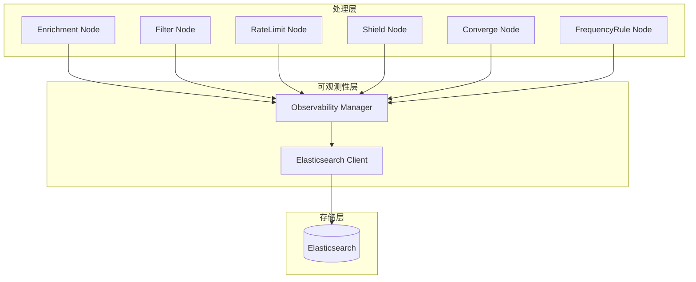

# 可观测性设计

> 返回 [目录](./README.md)

## 可观测性设计

### 设计目标

为框架提供全面的可观测性能力,确保在发生事故时能够快速定位问题、回溯处理流程、分析故障原因。所有关键处理环节的数据都必须被记录,并通过 Elasticsearch 进行持久化存储,支持快速查询和分析。

### 核心设计原则

1. **全面记录**: 每个处理节点的关键操作都必须记录
2. **链路追踪**: 使用 trace_id 关联整个处理流程
3. **快速查询**: 基于 Elasticsearch 实现毫秒级查询响应
4. **多维分析**: 支持按时间、策略、节点等多种维度查询
5. **故障回溯**: 提供完整的事故回溯能力

### Elasticsearch 索引设计

#### 1. 执行日志索引 (alertflow_execution_log)

记录 Pipeline 的整体执行信息。

```python
{
    "trace_id": "uuid",              # 追踪 ID
    "pipeline_id": "str",            # Pipeline ID
    "pipeline_name": "str",          # Pipeline 名称
    "event_id": "str",               # 事件 ID
    "status": "success/failed",      # 执行状态
    "start_time": "datetime",        # 开始时间
    "end_time": "datetime",          # 结束时间
    "duration_ms": "int",            # 执行时长(毫秒)
    "input_event": "dict",           # 输入事件数据
    "output_alert": "dict",          # 输出告警数据
    "error_message": "str",          # 错误信息(如果有)
    "error_stack": "str",          # 错误堆栈(如果有)
    "nodes_executed": "list",        # 执行的节点列表
    "metadata": "dict"               # 元数据
}
```

#### 2. 节点执行日志索引 (alertflow_node_log)

记录每个处理节点的执行详情。

```python
{
    "trace_id": "uuid",              # 追踪 ID
    "pipeline_id": "str",            # Pipeline ID
    "node_id": "str",                # 节点 ID
    "node_name": "str",              # 节点名称
    "node_type": "str",              # 节点类型
    "status": "success/failed/skipped",  # 执行状态
    "start_time": "datetime",        # 开始时间
    "end_time": "datetime",          # 结束时间
    "duration_ms": "int",            # 执行时长(毫秒)
    "input_data": "dict",            # 输入数据
    "output_data": "dict",           # 输出数据
    "config": "dict",                # 节点配置
    "error_message": "str",          # 错误信息(如果有)
    "metadata": "dict"               # 元数据
}
```

#### 3. 限流日志索引 (alertflow_rate_limit_log)

记录限流操作的详细信息。

```python
{
    "trace_id": "uuid",              # 追踪 ID
    "strategy_id": "str",            # 策略 ID
    "strategy_name": "str",          # 策略名称
    "dimension": "dict",             # 限流维度(如: ip, user_id)
    "total_requests": "int",         # 总请求数
    "limited_requests": "int",      # 被限流的请求数
    "passed_requests": "int",       # 通过的请求数
    "threshold": "int",             # 限流阈值
    "window_size": "int",           # 时间窗口大小(秒)
    "timestamp": "datetime",        # 限流时间点
    "result": "passed/limited"      # 限流结果
}
```

#### 4. 屏蔽日志索引 (alertflow_shield_log)

记录屏蔽操作的详细信息。

```python
{
    "trace_id": "uuid",              # 追踪 ID
    "strategy_id": "str",            # 策略 ID
    "shield_id": "str",              # 屏蔽规则 ID
    "shield_name": "str",            # 屏蔽规则名称
    "shield_type": "str",           # 屏蔽类型
    "dimension": "dict",             # 屏蔽维度
    "start_time": "datetime",        # 屏蔽开始时间
    "end_time": "datetime",          # 屏蔽结束时间(如果是临时屏蔽)
    "reason": "str",                 # 屏蔽原因
    "is_active": "bool",             # 是否当前生效
    "config": "dict",                # 屏蔽配置
    "timestamp": "datetime"         # 记录时间
}
```

#### 5. 收敛日志索引 (alertflow_converge_log)

记录收敛操作的详细信息。

```python
{
    "trace_id": "uuid",              # 追踪 ID
    "strategy_id": "str",            # 策略 ID
    "converge_id": "str",            # 收敛规则 ID
    "converge_name": "str",          # 收敛规则名称
    "converge_type": "str",          # 收敛类型
    "dimension": "dict",             # 收敛维度
    "event_count": "int",            # 收敛的事件数量
    "alert_id": "str",               # 关联的告警 ID
    "converge_start_time": "datetime",  # 收敛开始时间
    "converge_end_time": "datetime",    # 收敛结束时间
    "duration_ms": "int",            # 收敛时长(毫秒)
    "config": "dict",                 # 收敛配置
    "timestamp": "datetime"          # 记录时间
}
```

#### 6. 频率规则日志索引 (alertflow_frequency_rule_log)

记录频率规则触发的详细信息。

```python
{
    "trace_id": "uuid",              # 追踪 ID
    "strategy_id": "str",            # 策略 ID
    "rule_id": "str",                # 频率规则 ID
    "rule_name": "str",              # 频率规则名称
    "dimension": "dict",             # 频率维度
    "trigger_count": "int",          # 触发次数
    "window_size": "int",            # 时间窗口大小(秒)
    "threshold": "int",              # 触发阈值
    "trigger_time": "datetime",      # 触发时间
    "action": "str",                 # 执行的动作
    "config": "dict",                # 规则配置
    "timestamp": "datetime"          # 记录时间
}
```

### 可观测性架构



### 可观测性 Mixin

所有处理节点继承 `ObservabilityMixin` 基类,自动实现数据记录功能。

```python
from abc import ABC
from typing import Any, Dict, Optional
from datetime import datetime
import uuid

class ObservabilityMixin(ABC):
    """可观测性 Mixin - 为处理器提供自动日志记录功能"""
    
    def __init__(self):
        self.observability_manager: Optional['ObservabilityManager'] = None
        self.trace_id: Optional[str] = None
    
    def set_observability(self, manager: 'ObservabilityManager', trace_id: str):
        """设置可观测性管理器和追踪 ID"""
        self.observability_manager = manager
        self.trace_id = trace_id
    
    def record_node_execution(self, **kwargs):
        """记录节点执行信息"""
        if self.observability_manager:
            self.observability_manager.record_node_execution(
                trace_id=self.trace_id,
                node_id=self.get_node_id(),
                node_name=self.get_name(),
                node_type=self.get_type(),
                **kwargs
            )
    
    def record_rate_limit(self, **kwargs):
        """记录限流信息"""
        if self.observability_manager:
            self.observability_manager.record_rate_limit(
                trace_id=self.trace_id,
                **kwargs
            )
    
    def record_shield(self, **kwargs):
        """记录屏蔽信息"""
        if self.observability_manager:
            self.observability_manager.record_shield(
                trace_id=self.trace_id,
                **kwargs
            )
    
    def record_converge(self, **kwargs):
        """记录收敛信息"""
        if self.observability_manager:
            self.observability_manager.record_converge(
                trace_id=self.trace_id,
                **kwargs
            )
    
    def record_frequency_rule(self, **kwargs):
        """记录频率规则信息"""
        if self.observability_manager:
            self.observability_manager.record_frequency_rule(
                trace_id=self.trace_id,
                **kwargs
            )
    
    @abstractmethod
    def get_node_id(self) -> str:
        """获取节点 ID"""
        pass
    
    @abstractmethod
    def get_name(self) -> str:
        """获取节点名称"""
        pass
    
    @abstractmethod
    def get_type(self) -> str:
        """获取节点类型"""
        pass
```

### 可观测性管理器

```python
class ObservabilityManager:
    """可观测性管理器 - 统一管理所有日志记录"""
    
    def __init__(self, es_client: 'ESClient'):
        self.es_client = es_client
    
    def record_node_execution(
        self,
        trace_id: str,
        node_id: str,
        node_name: str,
        node_type: str,
        status: str,
        start_time: datetime,
        end_time: datetime,
        input_data: Dict[str, Any],
        output_data: Dict[str, Any],
        config: Dict[str, Any],
        error_message: Optional[str] = None,
        **kwargs
    ):
        """记录节点执行日志"""
        document = {
            "trace_id": trace_id,
            "node_id": node_id,
            "node_name": node_name,
            "node_type": node_type,
            "status": status,
            "start_time": start_time,
            "end_time": end_time,
            "duration_ms": int((end_time - start_time).total_seconds() * 1000),
            "input_data": input_data,
            "output_data": output_data,
            "config": config,
            "error_message": error_message,
            **kwargs
        }
        self.es_client.index(index="alertflow_node_log", document=document)
    
    def record_rate_limit(
        self,
        trace_id: str,
        strategy_id: str,
        strategy_name: str,
        dimension: Dict[str, Any],
        total_requests: int,
        limited_requests: int,
        threshold: int,
        window_size: int,
        result: str,
        **kwargs
    ):
        """记录限流日志"""
        document = {
            "trace_id": trace_id,
            "strategy_id": strategy_id,
            "strategy_name": strategy_name,
            "dimension": dimension,
            "total_requests": total_requests,
            "limited_requests": limited_requests,
            "passed_requests": total_requests - limited_requests,
            "threshold": threshold,
            "window_size": window_size,
            "timestamp": datetime.utcnow(),
            "result": result,
            **kwargs
        }
        self.es_client.index(index="alertflow_rate_limit_log", document=document)
    
    def record_shield(
        self,
        trace_id: str,
        strategy_id: str,
        shield_id: str,
        shield_name: str,
        shield_type: str,
        dimension: Dict[str, Any],
        start_time: datetime,
        end_time: Optional[datetime],
        reason: str,
        is_active: bool,
        config: Dict[str, Any],
        **kwargs
    ):
        """记录屏蔽日志"""
        document = {
            "trace_id": trace_id,
            "strategy_id": strategy_id,
            "shield_id": shield_id,
            "shield_name": shield_name,
            "shield_type": shield_type,
            "dimension": dimension,
            "start_time": start_time,
            "end_time": end_time,
            "reason": reason,
            "is_active": is_active,
            "config": config,
            "timestamp": datetime.utcnow(),
            **kwargs
        }
        self.es_client.index(index="alertflow_shield_log", document=document)
    
    def record_converge(
        self,
        trace_id: str,
        strategy_id: str,
        converge_id: str,
        converge_name: str,
        converge_type: str,
        dimension: Dict[str, Any],
        event_count: int,
        alert_id: str,
        converge_start_time: datetime,
        converge_end_time: datetime,
        config: Dict[str, Any],
        **kwargs
    ):
        """记录收敛日志"""
        document = {
            "trace_id": trace_id,
            "strategy_id": strategy_id,
            "converge_id": converge_id,
            "converge_name": converge_name,
            "converge_type": converge_type,
            "dimension": dimension,
            "event_count": event_count,
            "alert_id": alert_id,
            "converge_start_time": converge_start_time,
            "converge_end_time": converge_end_time,
            "duration_ms": int((converge_end_time - converge_start_time).total_seconds() * 1000),
            "config": config,
            "timestamp": datetime.utcnow(),
            **kwargs
        }
        self.es_client.index(index="alertflow_converge_log", document=document)
    
    def record_frequency_rule(
        self,
        trace_id: str,
        strategy_id: str,
        rule_id: str,
        rule_name: str,
        dimension: Dict[str, Any],
        trigger_count: int,
        window_size: int,
        threshold: int,
        trigger_time: datetime,
        action: str,
        config: Dict[str, Any],
        **kwargs
    ):
        """记录频率规则日志"""
        document = {
            "trace_id": trace_id,
            "strategy_id": strategy_id,
            "rule_id": rule_id,
            "rule_name": rule_name,
            "dimension": dimension,
            "trigger_count": trigger_count,
            "window_size": window_size,
            "threshold": threshold,
            "trigger_time": trigger_time,
            "action": action,
            "config": config,
            "timestamp": datetime.utcnow(),
            **kwargs
        }
        self.es_client.index(index="alertflow_frequency_rule_log", document=document)
    
    def record_pipeline_execution(
        self,
        trace_id: str,
        pipeline_id: str,
        pipeline_name: str,
        event_id: str,
        status: str,
        start_time: datetime,
        end_time: datetime,
        input_event: Dict[str, Any],
        output_alert: Optional[Dict[str, Any]],
        nodes_executed: list,
        error_message: Optional[str] = None,
        **kwargs
    ):
        """记录 Pipeline 执行日志"""
        document = {
            "trace_id": trace_id,
            "pipeline_id": pipeline_id,
            "pipeline_name": pipeline_name,
            "event_id": event_id,
            "status": status,
            "start_time": start_time,
            "end_time": end_time,
            "duration_ms": int((end_time - start_time).total_seconds() * 1000),
            "input_event": input_event,
            "output_alert": output_alert,
            "nodes_executed": nodes_executed,
            "error_message": error_message,
            **kwargs
        }
        self.es_client.index(index="alertflow_execution_log", document=document)
    
    def query_by_trace_id(self, trace_id: str) -> Dict[str, Any]:
        """根据 trace_id 查询完整的执行链路"""
        # 查询所有相关日志
        execution_logs = self.es_client.search(
            index="alertflow_execution_log",
            body={"query": {"term": {"trace_id": trace_id}}}
        )
        
        node_logs = self.es_client.search(
            index="alertflow_node_log",
            body={"query": {"term": {"trace_id": trace_id}}}
        )
        
        rate_limit_logs = self.es_client.search(
            index="alertflow_rate_limit_log",
            body={"query": {"term": {"trace_id": trace_id}}}
        )
        
        shield_logs = self.es_client.search(
            index="alertflow_shield_log",
            body={"query": {"term": {"trace_id": trace_id}}}
        )
        
        converge_logs = self.es_client.search(
            index="alertflow_converge_log",
            body={"query": {"term": {"trace_id": trace_id}}}
        )
        
        frequency_rule_logs = self.es_client.search(
            index="alertflow_frequency_rule_log",
            body={"query": {"term": {"trace_id": trace_id}}}
        )
        
        return {
            "execution": execution_logs,
            "nodes": node_logs,
            "rate_limits": rate_limit_logs,
            "shields": shield_logs,
            "converges": converge_logs,
            "frequency_rules": frequency_rule_logs
        }
```

### 故障排查接口

提供基于 REST API 的故障排查接口,支持快速查询和分析。

```python
# bkmonitor/alarm_backends/service/views.py

from rest_framework import views
from rest_framework.response import Response
from .observable.manager import ObservabilityManager

class TraceQueryView(views.APIView):
    """根据 trace_id 查询完整执行链路"""
    
    def get(self, request, trace_id):
        manager = ObservabilityManager.get_instance()
        trace_data = manager.query_by_trace_id(trace_id)
        return Response(trace_data)

class StrategyAnalysisView(views.APIView):
    """策略维度的分析接口"""
    
    def get(self, request):
        strategy_id = request.query_params.get('strategy_id')
        start_time = request.query_params.get('start_time')
        end_time = request.query_params.get('end_time')
        
        manager = ObservabilityManager.get_instance()
        
        # 查询该策略的限流统计
        rate_limit_stats = manager.es_client.aggregate(
            index="alertflow_rate_limit_log",
            body={
                "query": {
                    "bool": {
                        "must": [
                            {"term": {"strategy_id": strategy_id}},
                            {"range": {"timestamp": {"gte": start_time, "lte": end_time}}}
                        ]
                    }
                },
                "aggs": {
                    "total_requests": {"sum": {"field": "total_requests"}},
                    "limited_requests": {"sum": {"field": "limited_requests"}},
                    "passed_requests": {"sum": {"field": "passed_requests"}}
                }
            }
        )
        
        return Response({
            "strategy_id": strategy_id,
            "rate_limit_stats": rate_limit_stats
        })

class TimeRangeAnalysisView(views.APIView):
    """时间范围分析接口"""
    
    def get(self, request):
        start_time = request.query_params.get('start_time')
        end_time = request.query_params.get('end_time')
        index_type = request.query_params.get('type', 'execution')  # execution/node/rate_limit/etc
        
        manager = ObservabilityManager.get_instance()
        
        index_map = {
            "execution": "alertflow_execution_log",
            "node": "alertflow_node_log",
            "rate_limit": "alertflow_rate_limit_log",
            "shield": "alertflow_shield_log",
            "converge": "alertflow_converge_log",
            "frequency_rule": "alertflow_frequency_rule_log"
        }
        
        index = index_map.get(index_type, "alertflow_execution_log")
        
        logs = manager.es_client.search(
            index=index,
            body={
                "query": {
                    "range": {
                        "timestamp": {
                            "gte": start_time,
                            "lte": end_time
                        }
                    }
                },
                "sort": [{"timestamp": {"order": "desc"}}],
                "size": 1000
            }
        )
        
        return Response({
            "type": index_type,
            "start_time": start_time,
            "end_time": end_time,
            "logs": logs
        })
```

### 可观测性最佳实践

1. **Trace ID 生成**: 在事件进入 Pipeline 时生成唯一 trace_id
2. **异步写入**: 使用异步方式写入 Elasticsearch,避免影响主流程性能
3. **数据保留策略**: 设置合理的索引生命周期(ILM),定期清理过期数据
4. **监控告警**: 对 Elasticsearch 写入失败、查询超时等设置告警
5. **查询优化**: 使用合理的索引模板和映射,优化查询性能
6. **数据采样**: 在高并发场景下,可考虑对日志数据进行采样


---

**上一篇**: [实现细节](./03-implementation.md) | **下一篇**: [配置管理设计](./05-configuration.md)
