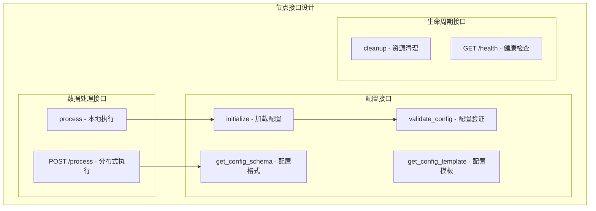
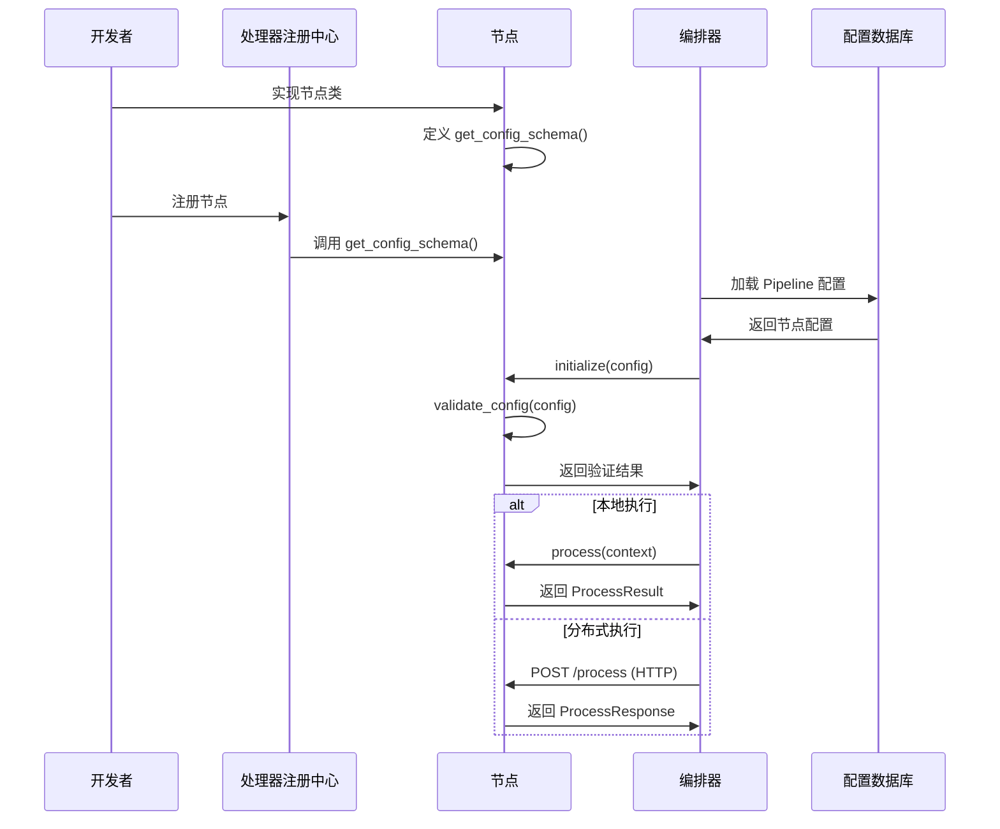

# 架构设计总结

> 返回 [目录](./README.md)

## 架构设计总结

### 核心架构决策

#### 1. 节点执行模式

框架支持**双模式执行**，根据业务需求灵活选择：

| 执行模式 | 数据传递方式 | 适用场景 | 优势 |
|---------|------------|---------|------|
| **本地执行** | ProcessContext 对象传递 | • 轻量级处理 • 高频低延迟场景 • 开发测试环境 | • 无网络开销 • 数据传递快 • 部署简单 |
| **分布式执行 (HTTP)** | HTTP/JSON 接口 | • 开发调试环境 • 外部系统对接 | • 调试便利 • 通用性强 |
| **分布式执行 (gRPC)** | gRPC/Protobuf 接口 | • 内网高性能场景 • 计算密集型任务 | • 低延迟 • 高吞吐 • 内置 TLS |
| **分布式执行 (Kafka)** | Kafka 消息队列 | • 异步解耦场景 • 削峰填谷 | • 高可用 • 水平扩展 |
| **混合部署** | ProcessContext + 多协议 | • 复杂业务场景 • 多租户环境 | • 灵活性高 • 成本优化 • 性能均衡 |

#### 2. 节点接口设计

每个节点需要实现三类接口：

#### 3. 配置管理机制

每个节点都有**专属的配置格式**，通过 `get_config_schema()` 定义：

### 架构优势

1. **灵活性**：支持本地和分布式两种执行模式，可根据实际需求选择
2. **可扩展性**：分布式执行支持水平扩展，应对大规模数据处理
3. **类型安全**：每个节点定义专属配置格式，确保配置正确性
4. **易维护性**：清晰的接口设计，节点职责单一
5. **高性能**：本地执行无网络开销，分布式执行可并行处理
6. **高可用**：支持服务发现、负载均衡、熔断降级

### 技术栈总结

| 组件 | 技术选型 | 用途 |
|------|---------|------|
| **规则引擎** | jsonLogic + ConditionMatcher | 条件匹配和规则评估 |
| **限流** | Redis + Lua 脚本 | 分布式限流 |
| **配置验证** | pydantic + jsonschema | 配置对象验证 |
| **结构化日志** | structlog | JSON 格式日志输出 |
| **分布式通信** | 多协议支持 (HTTP/gRPC/Kafka) | 可插拔传输层，根据场景选择协议 |
| **HTTP 适配器** | FastAPI + httpx | 开发调试、外部系统对接 |
| **gRPC 适配器** | grpcio + protobuf | 内网高性能场景，低延迟二进制传输 |
| **Kafka 适配器** | aiokafka | 异步解耦、削峰填谷场景 |
| **服务发现** | Consul/etcd | 动态服务注册与发现 |
| **Pipeline编排** | 自研编排器 | 流程编排和执行 |
| **熔断/收敛** | 现有实现 | 复用成熟组件 |

### 最佳实践建议

1. **节点部署策略**：
   - 轻量级节点（过滤、验证）→ 本地执行
   - 计算密集型节点（收敛、规则引擎）→ 分布式执行
   - I/O 密集型节点（通知、存储）→ 分布式执行

2. **协议选择策略**：
   - **HTTP**: 开发调试环境、外部系统对接、需要 curl/Postman 测试的场景
   - **gRPC**: 内网高性能场景、对延迟敏感的调用、二进制数据传输
   - **Kafka**: 异步处理场景、削峰填谷、需要解耦生产者和消费者的场景
   - 可以同一 Pipeline 中混用多种协议，根据节点特点选择

3. **配置管理**：
   - 使用配置模板生成初始配置
   - 严格遵循节点配置 Schema
   - 支持配置热更新和版本管理

4. **可观测性**：
   - 记录节点执行模式（本地/远程）和使用的协议
   - 监控网络调用延迟（分布式模式）
   - 统一使用 structlog 输出结构化日志

5. **性能优化**：
   - 本地节点使用 ProcessContext 避免序列化
   - HTTP 节点使用连接池和 HTTP/2
   - gRPC 节点启用连接复用和流式传输
   - Kafka 节点使用批量发送和异步确认

6. **安全配置**：
   - HTTP: 启用 TLS/mTLS，配置 API Key 或 JWT 认证
   - gRPC: 启用 mTLS 双向认证
   - Kafka: 配置 SASL/SSL 认证加密

7. **容错机制**：
   - 实现重试策略和超时控制
   - 远程节点失败时降级到本地节点
   - 使用熔断器防止级联故障

## 总结

本文档描述了一个基于配置的数据流处理框架的设计方案。该框架专注于后台数据处理，通过 Pipeline 编排器实现可配置的告警处理流程，支持事件丰富、过滤、限流、熔断、屏蔽、收敛、通知等核心功能。

**核心特性**：
- **多协议支持**：支持 HTTP、gRPC、Kafka 三种通信协议，可根据场景灵活选择
- **可插拔架构**：协议适配器工厂模式，支持注册自定义协议
- **混合部署**：同一 Pipeline 中可混用多种协议，充分发挥各协议优势
- **安全通信**：支持 TLS/mTLS、SASL/SSL 等安全机制

框架采用纯后台架构，通过配置文件、数据库和命令行工具进行配置管理，提供 REST API 供其他服务调用，不包含任何用户界面组件。

---

**上一篇**: [配置管理设计](./05-configuration.md) | **下一篇**: [第三方库使用](./07-third-party-libs.md)
