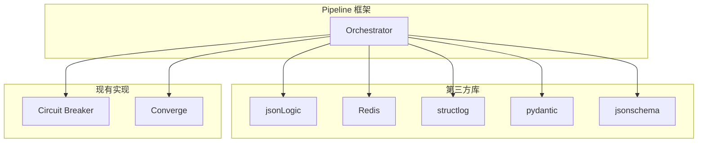
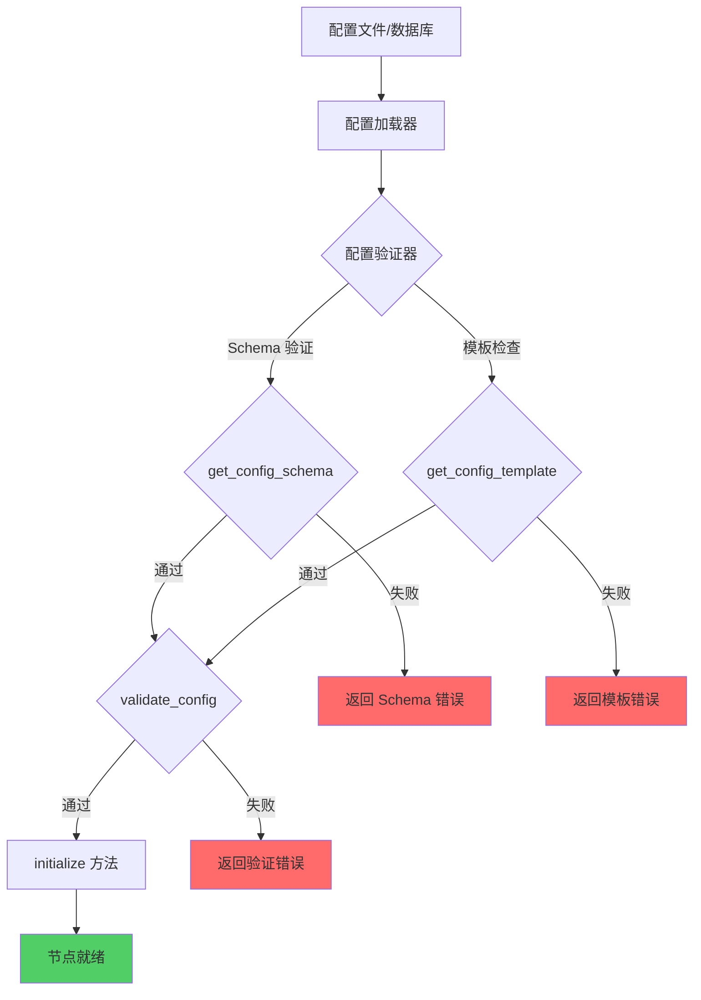

# 第三方库详细使用说明

> 返回 [目录](./README.md)

## 第三方库详细使用说明

### 1. 规则引擎 - jsonLogic

#### 库选择
- **jsonLogic**: 轻量级的 JSON 规则引擎,支持复杂的条件表达式
- **已实现**: matcher/adapter.py 中的 ConditionMatcher 已完成集成

#### 核心功能
- 简洁的条件配置格式
- 支持丰富的操作符: eq/neq/gt/gte/lt/lte/in/not_in/include/exclude/regex/startswith/endswith
- 支持 AND/OR/NOT 逻辑组合
- 支持自定义操作注册

#### 使用示例

```python
from matcher.adapter import ConditionMatcher

# 定义条件
conditions = [
    {"field": "severity", "op": "gte", "value": 3},
    {"field": "level", "op": "in", "value": ["error", "critical"]},
    {"field": "message", "op": "include", "value": "database"}
]

# 创建匹配器
matcher = ConditionMatcher(conditions)

# 匹配数据
data = {"severity": 4, "level": "error", "message": "database connection failed"}
result = matcher.match(data)  # True

# 快速匹配函数
from matcher.adapter import match
result = match(data, conditions)
```

#### 与 Pipeline 集成

```python
class FilterNode(IProcessor):
    """基于 jsonLogic 的过滤节点"""
    
    def __init__(self, config: Dict):
        self.conditions = config.get("conditions", [])
        self.matcher = ConditionMatcher(self.conditions)
    
    def process(self, context: ProcessContext) -> ProcessResult:
        if not self.matcher.match(context.event.to_dict()):
            context.should_stop = True
            return ProcessResult(success=False, context=context)
        
        return ProcessResult(success=True, context=context)
```

---

### 2. 限流 - Redis + Lua

#### 实现方案
基于 Redis 和 Lua 脚本实现滑动窗口限流算法,支持分布式场景。

#### 核心优势
- 高性能: 原子操作,避免竞态条件
- 分布式: 支持多实例部署
- 精确控制: 滑动窗口,避免固定窗口的边界问题

#### 限流配置

```python
@dataclass
class RateLimitConfig:
    """限流配置"""
    key: str                          # 限流键
    limit: int                        # 限流阈值
    window: int                       # 时间窗口(秒)
    strategy: str = "sliding_window"  # 限流策略
```

#### 实现代码

```python
import time
import redis
from typing import Dict, Optional

class RateLimiter:
    """基于 Redis 的分布式限流器"""
    
    # 滑动窗口限流 Lua 脚本
    SLIDING_WINDOW_SCRIPT = """
    local key = KEYS[1]
    local now = tonumber(ARGV[1])
    local window = tonumber(ARGV[2])
    local limit = tonumber(ARGV[3])
    
    -- 清理过期数据
    redis.call('ZREMRANGEBYSCORE', key, '-inf', now - window)
    
    -- 获取当前窗口内的请求数
    local current = redis.call('ZCARD', key)
    
    -- 判断是否超过限制
    if current < limit then
        redis.call('ZADD', key, now, now)
        redis.call('EXPIRE', key, window)
        return {1, current + 1}
    else
        return {0, current}
    end
    """
    
    def __init__(self, redis_client: redis.Redis):
        self.redis = redis_client
        self.script = self.redis.register_script(self.SLIDING_WINDOW_SCRIPT)
    
    def check(self, key: str, limit: int, window: int) -> tuple[bool, int]:
        """检查是否允许通过"""
        redis_key = f"rate_limit:{key}"
        result = self.script(
            keys=[redis_key],
            args=[int(time.time()), window, limit]
        )
        return bool(result[0]), result[1]
    
    def is_allowed(self, key: str, limit: int, window: int) -> bool:
        """简化接口: 仅返回是否允许"""
        allowed, _ = self.check(key, limit, window)
        return allowed
```

#### 与 Pipeline 集成

```python
class RateLimitNode(IProcessor):
    """限流节点"""
    
    def __init__(self, config: Dict):
        self.config = RateLimitConfig(**config)
        self.limiter = RateLimiter(get_redis_client())
    
    def process(self, context: ProcessContext) -> ProcessResult:
        # 构建限流键
        limit_key = self._build_limit_key(context)
        
        # 检查限流
        if not self.limiter.is_allowed(
            limit_key,
            self.config.limit,
            self.config.window
        ):
            # 记录限流日志
            context.metrics['rate_limited'] = True
            return ProcessResult(success=False, context=context)
        
        return ProcessResult(success=True, context=context)
    
    def _build_limit_key(self, context: ProcessContext) -> str:
        """构建限流键,可根据策略动态生成"""
        return f"{context.event.strategy_id}:{context.event.ip}"
```

---

### 3. 结构化日志 - structlog

#### 库选择
- **structlog**: 现代化的结构化日志库,支持多种输出格式

#### 核心优势
- JSON 格式输出,便于机器解析
- 自动上下文绑定
- 与 Elasticsearch 完美集成
- 支持多种处理器和渲染器

#### 配置示例

```python
import structlog
from logging.config import dictConfig

# 配置 structlog
dictConfig({
    "version": 1,
    "disable_existing_loggers": False,
    "formatters": {
        "json": {
            "()": structlog.stdlib.ProcessorFormatter,
            "processor": structlog.processors.JSONRenderer()
        }
    },
    "handlers": {
        "default": {
            "level": "INFO",
            "class": "logging.StreamHandler",
            "formatter": "json"
        }
    },
    "loggers": {
        "": {
            "handlers": ["default"],
            "level": "INFO",
            "propagate": True
        }
    }
})

# 配置 structlog
structlog.configure(
    processors=[
        structlog.stdlib.filter_by_level,
        structlog.stdlib.add_logger_name,
        structlog.stdlib.add_log_level,
        structlog.processors.TimeStamper(fmt="iso"),
        structlog.processors.StackInfoRenderer(),
        structlog.processors.format_exc_info,
        structlog.processors.UnicodeDecoder(),
        structlog.processors.JSONRenderer()
    ],
    context_class=dict,
    logger_factory=structlog.stdlib.LoggerFactory(),
    cache_logger_on_first_use=True
)
```

#### 使用示例

```python
import structlog

logger = structlog.get_logger(__name__)

# 自动绑定上下文
log = logger.bind(
    pipeline_id="alert_pipeline",
    trace_id="abc123",
    event_id="evt_001"
)

# 输出 JSON 格式日志
log.info("Processing event", severity=3, processor="filter")
```

#### 与 Pipeline 集成

```python
class ObservabilityMixin(ABC):
    """可观测性 Mixin - 使用 structlog 记录日志"""
    
    def __init__(self):
        self.logger = structlog.get_logger(self.__class__.__name__)
        self._log_context: Optional[Dict] = None
    
    def bind_log_context(self, **kwargs):
        """绑定日志上下文"""
        self._log_context = kwargs
        self.logger = self.logger.bind(**kwargs)
    
    def log_node_start(self, **kwargs):
        """记录节点开始"""
        self.logger.info("Node started", **kwargs)
    
    def log_node_success(self, **kwargs):
        """记录节点成功"""
        self.logger.info("Node completed successfully", **kwargs)
    
    def log_node_error(self, error: Exception, **kwargs):
        """记录节点错误"""
        self.logger.error("Node failed", error=str(error), **kwargs)
```

---

### 4. 配置验证 - DRF Serializer + pydantic

#### 库选择
- **DRF Serializer**: Django REST Framework 的序列化器，用于配置验证和字段约束
- **pydantic**: 现代化的数据验证库，作为辅助工具使用

#### 核心优势
- 与现有 Django/DRF 生态无缝集成
- 丰富的内置字段类型和验证器
- 支持嵌套序列化器
- 自动生成 API 文档
- 丰富的错误信息

#### 配置模型定义

```python
from rest_framework import serializers
from enum import Enum
from typing import Dict, Any


class ProcessorType(str, Enum):
    """处理器类型枚举"""
    ENRICHMENT = "enrichment"
    FILTER = "filter"
    RATE_LIMIT = "rate_limit"
    SHIELD = "shield"
    CONVERGE = "converge"


class ProcessorConfigSerializer(serializers.Serializer):
    """处理器配置"""
    name = serializers.CharField(help_text="处理器名称")
    type = serializers.ChoiceField(choices=[(e.value, e.name) for e in ProcessorType])
    enabled = serializers.BooleanField(default=True)
    timeout = serializers.IntegerField(required=False, min_value=1, max_value=300, help_text="超时时间(秒)")
    config = serializers.DictField(default=dict)
    
    def validate_name(self, value):
        if not value.strip():
            raise serializers.ValidationError('name cannot be empty')
        return value


class StageConfigSerializer(serializers.Serializer):
    """阶段配置"""
    name = serializers.CharField()
    processors = ProcessorConfigSerializer(many=True)
    enabled = serializers.BooleanField(default=True)
    parallel = serializers.BooleanField(default=False)
    condition = serializers.CharField(required=False, allow_null=True)


class PipelineConfigSerializer(serializers.Serializer):
    """Pipeline 配置"""
    id = serializers.CharField()
    name = serializers.CharField()
    version = serializers.CharField()
    enabled = serializers.BooleanField(default=True)
    stages = StageConfigSerializer(many=True)
    global_config = serializers.DictField(default=dict)
```

#### 使用示例

```python
# 验证配置
try:
    serializer = PipelineConfigSerializer(data=config_data)
    if serializer.is_valid(raise_exception=True):
        validated_config = serializer.validated_data
        print("配置验证成功")
except serializers.ValidationError as e:
    print(f"配置验证失败: {e.detail}")
```

---

### 5. Schema 验证 - jsonschema

#### 库选择
- **jsonschema**: 标准的 JSON Schema 验证库

#### 核心优势
- 符合 JSON Schema 规范
- 支持复杂的验证规则
- 适用于外部配置验证

#### 使用示例

```python
from jsonschema import validate, ValidationError

# 定义 Schema
schema = {
    "type": "object",
    "properties": {
        "id": {"type": "string"},
        "name": {"type": "string", "minLength": 1},
        "stages": {
            "type": "array",
            "items": {
                "type": "object",
                "properties": {
                    "name": {"type": "string"},
                    "processors": {"type": "array"}
                },
                "required": ["name", "processors"]
            }
        }
    },
    "required": ["id", "name", "stages"]
}

# 验证配置
try:
    validate(instance=config_data, schema=schema)
    print("Schema 验证成功")
except ValidationError as e:
    print(f"Schema 验证失败: {e.message}")
    print(f"路径: {list(e.path)}")
```

#### 与 pydantic 结合使用

```python
class ConfigValidator:
    """配置验证器 - 组合使用 pydantic 和 jsonschema"""
    
    def __init__(self, schema: Optional[Dict] = None):
        self.json_schema = schema
    
    def validate(self, config_data: Dict):
        """双重验证"""
        # 第一步: pydantic 验证
        try:
            pipeline_config = PipelineConfig(**config_data)
        except ValidationError as e:
            raise ValueError(f"Pydantic 验证失败: {e}")
        
        # 第二步: jsonschema 验证(可选)
        if self.json_schema:
            try:
                validate(instance=config_data, schema=self.json_schema)
            except ValidationError as e:
                raise ValueError(f"JSON Schema 验证失败: {e.message}")
        
        return pipeline_config
```

---

### 6. 依赖安装

```bash
# 安装核心依赖
pip install jsonLogic
pip install pydantic
pip install jsonschema
pip install structlog
pip install redis

# 可选依赖 - 如果使用 Prometheus 监控
pip install prometheus-client
```

---

### 7. 第三方库集成架构



---

### 8. 最佳实践

#### 8.1 规则引擎
- 使用简洁的条件配置格式
- 复杂条件拆分为多个简单条件
- 定期审查规则性能

#### 8.2 限流
- 根据业务需求选择合适的限流策略
- 限流键设计要合理,避免过度限制
- 监控限流触发情况,及时调整阈值

#### 8.3 结构化日志
- 统一日志格式,便于分析
- 合理使用上下文绑定,避免信息冗余
- 敏感信息脱敏处理

#### 8.4 配置验证
- 使用 pydantic 进行日常配置验证
- 使用 jsonschema 进行严格 Schema 验证
- 提供清晰的错误提示,帮助用户快速定位问题

---

### 9. 性能考量

| 功能 | 第三方库 | 性能特点 | 优化建议 |
|------|---------|---------|---------|
| 规则匹配 | jsonLogic | 高性能,表达式求值快 | 缓存编译后的规则 |
| 限流 | Redis Lua | 高性能,原子操作 | 使用 Pipeline 批量操作 |
| 日志 | structlog | 轻量级,异步友好 | 异步写入 Elasticsearch |
| 配置验证 | DRF Serializer | 高性能，与 Django 生态集成 | 缓存验证器实例 |

#### 节点配置接口设计

每个节点都需要接收配置，并且节点之间可能有不同的配置格式。节点提供三种配置接口：

##### 1. 配置加载接口

```python
class IProcessor(ABC):
    """处理器基类 - 支持配置加载"""
    
    @abstractmethod
    def initialize(self, config: Dict) -> None:
        """
        初始化处理器，接收配置
        
        这是节点接收配置的主要接口，在以下时机调用：
        - Pipeline 加载时（本地节点）
        - 节点启动时（远程节点）
        - 配置热更新时
        
        Args:
            config: 节点专属配置字典，符合 get_config_schema() 定义的格式
        
        Raises:
            ValueError: 配置验证失败
        """
        pass
    
    @classmethod
    @abstractmethod
    def get_config_schema(cls) -> Dict:
        """
        返回节点的配置 Schema（JSON Schema）
        
        每个节点必须定义自己的配置格式，用于：
        - 配置验证
        - 生成配置模板
        - 文档生成
        - IDE 自动补全
        
        Returns:
            JSON Schema 格式的配置定义
        """
        pass
    
    @abstractmethod
    def validate_config(self, config: Dict) -> bool:
        """
        验证配置是否有效
        
        在 initialize() 之前调用，确保配置合法。
        
        Args:
            config: 配置字典
        
        Returns:
            验证结果
        
        Raises:
            ValueError: 配置验证失败时抛出详细错误信息
        """
        pass
```

##### 2. 配置更新接口（远程节点）

```python
class IDistributedProcessor(IProcessor):
    """分布式处理器接口 - 支持动态配置更新"""
    
    def _setup_routes(self):
        """设置 HTTP 路由"""
        
        @self.app.post("/config/update")
        async def update_config(config: Dict):
            """配置更新接口"""
            try:
                # 验证配置
                if not self.validate_config(config):
                    raise ValueError("Invalid config")
                
                # 应用新配置
                self.initialize(config)
                
                return {"success": True, "message": "Config updated"}
            except Exception as e:
                raise HTTPException(status_code=400, detail=str(e))
        
        @self.app.get("/config")
        async def get_config():
            """获取当前配置"""
            return {"config": self.config}
```

##### 3. 配置模板接口

```python
class IProcessor(ABC):
    """处理器基类 - 支持配置模板"""
    
    @classmethod
    def get_config_template(cls) -> Dict:
        """
        获取配置模板
        
        提供带有默认值和注释的配置模板，方便用户理解如何配置。
        
        Returns:
            配置模板字典，包含默认值和说明
        """
        schema = cls.get_config_schema()
        return cls._generate_template_from_schema(schema)
    
    @classmethod
    def _generate_template_from_schema(cls, schema: Dict) -> Dict:
        """从 Schema 生成配置模板"""
        template = {}
        properties = schema.get("properties", {})
        
        for key, prop in properties.items():
            default = prop.get("default")
            description = prop.get("description", "")
            prop_type = prop.get("type")
            
            # 添加注释（在 JSON 中用 __comment_ 前缀）
            if description:
                template[f"__comment_{key}"] = description
            
            # 设置默认值
            if default is not None:
                template[key] = default
            elif prop_type == "string":
                template[key] = ""
            elif prop_type == "integer":
                template[key] = 0
            elif prop_type == "boolean":
                template[key] = False
            elif prop_type == "array":
                template[key] = []
            elif prop_type == "object":
                template[key] = {}
        
        return template
```

#### 节点配置格式示例

不同节点有不同的配置格式，以下是几个典型的节点配置示例：

##### 1. 过滤节点配置

```python
class FilterNode(IDistributedProcessor):
    """过滤节点配置"""
    
    @classmethod
    def get_config_schema(cls) -> Dict:
        """过滤节点配置 Schema"""
        return {
            "type": "object",
            "description": "过滤节点配置，用于基于规则条件过滤事件",
            "properties": {
                "name": {
                    "type": "string",
                    "description": "节点名称"
                },
                "conditions": {
                    "type": "array",
                    "description": "过滤条件列表，所有条件必须满足（AND 逻辑）",
                    "items": {
                        "type": "object",
                        "properties": {
                            "field": {
                                "type": "string",
                                "description": "字段名，支持嵌套路径如 'labels.env'"
                            },
                            "op": {
                                "type": "string",
                                "description": "操作符",
                                "enum": ["eq", "neq", "gt", "gte", "lt", "lte", "in", "not_in", 
                                        "include", "exclude", "regex", "startswith", "endswith"]
                            },
                            "value": {
                                "description": "比较值，可以是字符串、数字、数组等"
                            }
                        },
                        "required": ["field", "op", "value"]
                    }
                },
                "match_mode": {
                    "type": "string",
                    "description": "匹配模式",
                    "enum": ["any", "all"],
                    "default": "all"
                }
            },
            "required": ["conditions"]
        }
    
    @classmethod
    def get_config_template(cls) -> Dict:
        """配置模板"""
        return {
            "__comment_name": "节点名称",
            "name": "severity_filter",
            "__comment_conditions": "过滤条件列表",
            "conditions": [
                {
                    "__comment_field": "字段名",
                    "field": "severity",
                    "__comment_op": "操作符",
                    "op": "gte",
                    "__comment_value": "比较值",
                    "value": 3
                },
                {
                    "field": "labels.env",
                    "op": "in",
                    "value": ["prod", "staging"]
                }
            ],
            "__comment_match_mode": "匹配模式：any（任意匹配）或 all（全部匹配）",
            "match_mode": "all"
        }

# 配置示例
filter_config = {
    "name": "severity_filter",
    "conditions": [
        {"field": "severity", "op": "gte", "value": 3},
        {"field": "level", "op": "in", "value": ["error", "critical"]},
        {"field": "message", "op": "include", "value": "database"}
    ],
    "match_mode": "all"
}
```

##### 2. 限流节点配置

```python
class RateLimitNode(IDistributedProcessor):
    """限流节点配置"""
    
    @classmethod
    def get_config_schema(cls) -> Dict:
        """限流节点配置 Schema"""
        return {
            "type": "object",
            "description": "限流节点配置，基于 Redis 实现分布式限流",
            "properties": {
                "key_template": {
                    "type": "string",
                    "description": "限流键模板，支持变量替换如 '{strategy_id}:{ip}'"
                },
                "limit": {
                    "type": "integer",
                    "description": "限流阈值",
                    "minimum": 1
                },
                "window": {
                    "type": "integer",
                    "description": "时间窗口（秒）",
                    "minimum": 1
                },
                "strategy": {
                    "type": "string",
                    "description": "限流策略",
                    "enum": ["sliding_window", "fixed_window", "token_bucket"],
                    "default": "sliding_window"
                },
                "burst_size": {
                    "type": "integer",
                    "description": "突发容量（令牌桶模式）",
                    "minimum": 0,
                    "default": 10
                }
            },
            "required": ["key_template", "limit", "window"]
        }
    
    @classmethod
    def get_config_template(cls) -> Dict:
        """配置模板"""
        return {
            "__comment_key_template": "限流键模板，可用变量：{strategy_id}, {ip}, {event_id}",
            "key_template": "{strategy_id}:{ip}",
            "__comment_limit": "限流阈值",
            "limit": 100,
            "__comment_window": "时间窗口（秒）",
            "window": 60,
            "__comment_strategy": "限流策略",
            "strategy": "sliding_window"
        }

# 配置示例
rate_limit_config = {
    "key_template": "{strategy_id}:{ip}",
    "limit": 100,
    "window": 60,
    "strategy": "sliding_window"
}
```

##### 3. 丰富化节点配置

```python
class EnrichmentNode(IDistributedProcessor):
    """丰富化节点配置"""
    
    @classmethod
    def get_config_schema(cls) -> Dict:
        """丰富化节点配置 Schema"""
        return {
            "type": "object",
            "description": "丰富化节点配置，用于事件数据增强",
            "properties": {
                "enrichments": {
                    "type": "array",
                    "description": "丰富化规则列表",
                    "items": {
                        "type": "object",
                        "properties": {
                            "type": {
                                "type": "string",
                                "description": "丰富化类型",
                                "enum": ["cmdb", "tag", "custom", "static"]
                            },
                            "source_field": {
                                "type": "string",
                                "description": "源字段名"
                            },
                            "target_field": {
                                "type": "string",
                                "description": "目标字段名"
                            },
                            "mapping": {
                                "type": "object",
                                "description": "映射规则（type=custom 时使用）"
                            },
                            "static_value": {
                                "description": "静态值（type=static 时使用）"
                            }
                        },
                        "required": ["type", "target_field"]
                    }
                },
                "fallback_values": {
                    "type": "object",
                    "description": "丰富化失败时的默认值"
                },
                "timeout": {
                    "type": "integer",
                    "description": "超时时间（毫秒）",
                    "minimum": 100,
                    "default": 5000
                }
            },
            "required": ["enrichments"]
        }
    
    @classmethod
    def get_config_template(cls) -> Dict:
        """配置模板"""
        return {
            "__comment_enrichments": "丰富化规则列表",
            "enrichments": [
                {
                    "__comment_type": "丰富化类型",
                    "type": "cmdb",
                    "__comment_source_field": "源字段",
                    "source_field": "ip",
                    "__comment_target_field": "目标字段",
                    "target_field": "host_info"
                },
                {
                    "type": "custom",
                    "source_field": "level",
                    "target_field": "priority",
                    "__comment_mapping": "自定义映射",
                    "mapping": {
                        "critical": "P0",
                        "error": "P1",
                        "warning": "P2"
                    }
                }
            ],
            "__comment_fallback_values": "默认值",
            "fallback_values": {},
            "__comment_timeout": "超时时间（毫秒）",
            "timeout": 5000
        }

# 配置示例
enrichment_config = {
    "enrichments": [
        {
            "type": "cmdb",
            "source_field": "ip",
            "target_field": "host_info"
        },
        {
            "type": "custom",
            "source_field": "level",
            "target_field": "priority",
            "mapping": {
                "critical": "P0",
                "error": "P1",
                "warning": "P2"
            }
        }
    ],
    "fallback_values": {
        "host_info": {"unknown": True}
    },
    "timeout": 5000
}
```

##### 4. 收敛节点配置

```python
class ConvergeNode(IDistributedProcessor):
    """收敛节点配置"""
    
    @classmethod
    def get_config_schema(cls) -> Dict:
        """收敛节点配置 Schema"""
        return {
            "type": "object",
            "description": "收敛节点配置，用于事件去重和聚合",
            "properties": {
                "dimension": {
                    "type": "array",
                    "description": "收敛维度字段列表",
                    "items": {"type": "string"}
                },
                "window": {
                    "type": "integer",
                    "description": "收敛时间窗口（秒）",
                    "minimum": 1
                },
                "converge_type": {
                    "type": "string",
                    "description": "收敛类型",
                    "enum": ["count", "duration", "interval"],
                    "default": "count"
                },
                "threshold": {
                    "type": "integer",
                    "description": "收敛阈值",
                    "minimum": 1,
                    "default": 10
                },
                "action": {
                    "type": "string",
                    "description": "收敛动作",
                    "enum": ["suppress", "aggregate", "update"],
                    "default": "suppress"
                },
                "include_fields": {
                    "type": "array",
                    "description": "包含字段（仅用于 aggregate 动作）",
                    "items": {"type": "string"}
                }
            },
            "required": ["dimension", "window"]
        }
    
    @classmethod
    def get_config_template(cls) -> Dict:
        """配置模板"""
        return {
            "__comment_dimension": "收敛维度字段列表",
            "dimension": ["strategy_id", "dimension"],
            "__comment_window": "收敛时间窗口（秒）",
            "window": 300,
            "__comment_converge_type": "收敛类型",
            "converge_type": "count",
            "__comment_threshold": "收敛阈值",
            "threshold": 10,
            "__comment_action": "收敛动作",
            "action": "suppress"
        }

# 配置示例
converge_config = {
    "dimension": ["strategy_id", "dimension"],
    "window": 300,
    "converge_type": "count",
    "threshold": 10,
    "action": "suppress",
    "include_fields": ["first_event_time", "last_event_time", "event_count"]
}
```

#### 配置验证流程



#### 配置管理接口

##### REST API 接口

```python
# bkmonitor/alarm_backends/service/views.py

from rest_framework import views
from rest_framework.response import Response
from framework.processor.registry import ProcessorRegistry

class NodeConfigView(views.APIView):
    """节点配置管理接口"""
    
    def get(self, request, node_type: str):
        """获取节点配置 Schema 和模板"""
        registry = ProcessorRegistry.get_instance()
        
        try:
            processor_class = registry.get_processor_class(node_type)
        except ValueError as e:
            return Response({"error": str(e)}, status=404)
        
        return Response({
            "node_type": node_type,
            "schema": processor_class.get_config_schema(),
            "template": processor_class.get_config_template()
        })

class NodeListView(views.APIView):
    """节点类型列表接口"""
    
    def get(self, request):
        """获取所有可用的节点类型"""
        registry = ProcessorRegistry.get_instance()
        
        nodes = []
        for node_type, processor_class in registry.get_all_processors().items():
            nodes.append({
                "type": node_type,
                "name": processor_class.__name__,
                "version": processor_class.get_version() if hasattr(processor_class, 'get_version') else "1.0.0",
                "description": processor_class.get_config_schema().get("description", "")
            })
        
        return Response({"nodes": nodes})

# URL 配置
# bkmonitor/alarm_backends/service/urls.py

from django.urls import path
from .views import NodeConfigView, NodeListView

urlpatterns = [
    path('api/v1/nodes/', NodeListView.as_view(), name='node-list'),
    path('api/v1/nodes/<str:node_type>/config/', NodeConfigView.as_view(), name='node-config'),
]
```

##### 命令行工具

```bash
# 获取节点配置 Schema
bk-monitor node schema filter

# 获取节点配置模板
bk-monitor node template rate-limit > config/rate_limit_example.yaml

# 验证节点配置
bk-monitor node validate --type filter --config config/filter.yaml

# 列出所有可用节点
bk-monitor node list
```


---

**上一篇**: [架构设计总结](./06-summary.md)
