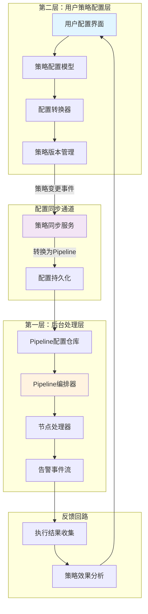

## 双层告警配置架构设计

### 架构概览



---

## 1. 配置模型分层定义

### 1.1 用户策略配置模型（第二层）

```python
# user_strategy_config.py
"""
用户友好的策略配置模型
面向业务人员，屏蔽底层复杂性
"""

from dataclasses import dataclass, field
from typing import List, Dict, Optional, Any
from enum import Enum


class StrategyType(str, Enum):
    """策略类型"""
    METRIC = "metric"           # 指标策略
    LOG = "log"                 # 日志策略
    EVENT = "event"             # 事件策略
    UPTIME = "uptime"           # 可用性策略


class DetectAlgorithm(str, Enum):
    """检测算法"""
    THRESHOLD = "threshold"     # 静态阈值
    ANOMALY = "anomaly"         # 异常检测
    BASELINE = "baseline"       # 基线检测
    TREND = "trend"             # 趋势检测


class AlertLevel(str, Enum):
    """告警级别"""
    CRITICAL = 1    # 致命
    ERROR = 2       # 错误
    WARNING = 3     # 警告
    NOTICE = 4      # 提醒


@dataclass
class MetricSource:
    """指标数据源配置"""
    metric_id: str
    aggregation_method: str = "avg"  # avg/max/min/sum/count
    aggregation_interval: int = 60   # 秒
    query_conditions: Dict = field(default_factory=dict)
    
    def to_dict(self) -> Dict:
        return {
            "metric_id": self.metric_id,
            "aggregation_method": self.aggregation_method,
            "aggregation_interval": self.aggregation_interval,
            "query_conditions": self.query_conditions
        }


@dataclass
class ThresholdRule:
    """阈值规则 - 用户友好定义"""
    level: AlertLevel
    operator: str  # > >= < <= == !=
    value: float
    consecutive_count: int = 3  # 连续几次触发
    
    def to_dict(self) -> Dict:
        return {
            "level": self.level.value,
            "operator": self.operator,
            "value": self.value,
            "consecutive_count": self.consecutive_count
        }


@dataclass
class NotificationRule:
    """通知规则"""
    enabled: bool = True
    
    # 通知渠道
    channels: List[str] = field(default_factory=lambda: ["weixin"])
    
    # 接收人
    receiver_type: str = "role"  # role/user/group/duty
    receiver_id: str = "operator"
    receiver_fallback: List[str] = field(default_factory=list)
    
    # 通知模板
    title_template: Optional[str] = None
    content_template: Optional[str] = None
    
    # 高级选项
    work_hours_only: bool = False  # 仅工作时间通知
    mute_window: Optional[Dict] = None  # 免打扰时段
    aggregate_window: int = 300  # 聚合窗口（秒）
    
    def to_dict(self) -> Dict:
        return {
            "enabled": self.enabled,
            "channels": self.channels,
            "receiver_type": self.receiver_type,
            "receiver_id": self.receiver_id,
            "receiver_fallback": self.receiver_fallback,
            "title_template": self.title_template,
            "content_template": self.content_template,
            "work_hours_only": self.work_hours_only,
            "mute_window": self.mute_window,
            "aggregate_window": self.aggregate_window
        }


@dataclass
class ShieldRule:
    """屏蔽规则"""
    enabled: bool = True
    shield_type: str = "maintenance"  # maintenance/temporary/permanent
    
    # 屏蔽条件
    scope: str = "biz"  # biz/host/service
    scope_ids: List[str] = field(default_factory=list)
    
    # 时间范围
    time_range_type: str = "periodic"  # once/periodic
    begin_time: Optional[str] = None
    end_time: Optional[str] = None
    weekdays: List[int] = field(default_factory=list)  # 0-6
    start_time: Optional[str] = None  # HH:MM
    stop_time: Optional[str] = None   # HH:MM
    
    def to_dict(self) -> Dict:
        return {
            "enabled": self.enabled,
            "shield_type": self.shield_type,
            "scope": self.scope,
            "scope_ids": self.scope_ids,
            "time_range_type": self.time_range_type,
            "begin_time": self.begin_time,
            "end_time": self.end_time,
            "weekdays": self.weekdays,
            "start_time": self.start_time,
            "stop_time": self.stop_time
        }


@dataclass
class RecoveryRule:
    """恢复规则"""
    enabled: bool = True
    recovery_type: str = "threshold"  # threshold/timeout/manual
    
    # 阈值恢复配置
    recovery_operator: str = "<"
    recovery_threshold: Optional[float] = None
    consecutive_count: int = 3
    
    # 超时恢复
    recovery_timeout: Optional[int] = None  # 秒
    
    def to_dict(self) -> Dict:
        return {
            "enabled": self.enabled,
            "recovery_type": self.recovery_type,
            "recovery_operator": self.recovery_operator,
            "recovery_threshold": self.recovery_threshold,
            "consecutive_count": self.consecutive_count,
            "recovery_timeout": self.recovery_timeout
        }


@dataclass
class UserStrategyConfig:
    """
    用户策略配置 - 顶层模型
    
    这是用户直接操作的配置对象，包含所有业务级配置
    """
    # 基础信息
    strategy_id: str
    name: str
    description: str = ""
    version: str = "1.0.0"
    enabled: bool = True
    
    # 业务归属
    biz_id: int
    scenario: str = "monitoring"
    
    # 策略类型
    strategy_type: StrategyType = StrategyType.METRIC
    
    # 数据源
    data_source: MetricSource = field(default_factory=lambda: MetricSource(""))
    
    # 检测规则
    detect_algorithm: DetectAlgorithm = DetectAlgorithm.THRESHOLD
    threshold_rules: List[ThresholdRule] = field(default_factory=list)
    
    # 处理规则
    notification_rule: NotificationRule = field(default_factory=NotificationRule)
    shield_rules: List[ShieldRule] = field(default_factory=list)
    recovery_rule: RecoveryRule = field(default_factory=RecoveryRule)
    
    # 收敛配置
    converge_enabled: bool = True
    converge_window: int = 300  # 秒
    converge_dimensions: List[str] = field(default_factory=list)
    
    # 高级配置
    tags: Dict[str, str] = field(default_factory=dict)
    priority: int = 0
    
    # 元数据
    created_at: Optional[str] = None
    updated_at: Optional[str] = None
    created_by: Optional[str] = None
    
    def to_dict(self) -> Dict[str, Any]:
        """转换为字典"""
        return {
            "strategy_id": self.strategy_id,
            "name": self.name,
            "description": self.description,
            "version": self.version,
            "enabled": self.enabled,
            "biz_id": self.biz_id,
            "scenario": self.scenario,
            "strategy_type": self.strategy_type.value,
            "data_source": self.data_source.to_dict(),
            "detect_algorithm": self.detect_algorithm.value,
            "threshold_rules": [r.to_dict() for r in self.threshold_rules],
            "notification_rule": self.notification_rule.to_dict(),
            "shield_rules": [r.to_dict() for r in self.shield_rules],
            "recovery_rule": self.recovery_rule.to_dict(),
            "converge_enabled": self.converge_enabled,
            "converge_window": self.converge_window,
            "converge_dimensions": self.converge_dimensions,
            "tags": self.tags,
            "priority": self.priority,
            "created_at": self.created_at,
            "updated_at": self.updated_at,
            "created_by": self.created_by
        }
    
    @classmethod
    def from_dict(cls, data: Dict) -> "UserStrategyConfig":
        """从字典创建"""
        return cls(
            strategy_id=data["strategy_id"],
            name=data["name"],
            description=data.get("description", ""),
            version=data.get("version", "1.0.0"),
            enabled=data.get("enabled", True),
            biz_id=data["biz_id"],
            scenario=data.get("scenario", "monitoring"),
            strategy_type=StrategyType(data.get("strategy_type", "metric")),
            data_source=MetricSource(**data.get("data_source", {})),
            detect_algorithm=DetectAlgorithm(data.get("detect_algorithm", "threshold")),
            threshold_rules=[ThresholdRule(**r) for r in data.get("threshold_rules", [])],
            notification_rule=NotificationRule(**data.get("notification_rule", {})),
            shield_rules=[ShieldRule(**r) for r in data.get("shield_rules", [])],
            recovery_rule=RecoveryRule(**data.get("recovery_rule", {})),
            converge_enabled=data.get("converge_enabled", True),
            converge_window=data.get("converge_window", 300),
            converge_dimensions=data.get("converge_dimensions", []),
            tags=data.get("tags", {}),
            priority=data.get("priority", 0),
            created_at=data.get("created_at"),
            updated_at=data.get("updated_at"),
            created_by=data.get("created_by")
        )
```

### 1.2 后台 Pipeline 配置模型（第一层）

```python
# pipeline_config.py
"""
底层 Pipeline 配置模型
直接驱动 AlertFlow Engine 执行
"""

from dataclasses import dataclass, field
from typing import List, Dict, Optional, Any


@dataclass
class ProcessorConfig:
    """处理器配置"""
    node_type: str
    name: str
    description: str = ""
    enabled: bool = True
    config: Dict = field(default_factory=dict)
    execution: Dict = field(default_factory=lambda: {
        "timeout": 30,
        "retry_enabled": True,
        "retry_max_attempts": 3
    })
    error_handling: Dict = field(default_factory=lambda: {
        "on_error": "continue",
        "log_error": True
    })
    skip_condition: Optional[Dict] = None
    
    def to_dict(self) -> Dict:
        result = {
            "node_type": self.node_type,
            "name": self.name,
            "description": self.description,
            "enabled": self.enabled,
            "config": self.config,
            "execution": self.execution,
            "error_handling": self.error_handling
        }
        if self.skip_condition:
            result["skip_condition"] = self.skip_condition
        return result


@dataclass
class StageConfig:
    """阶段配置"""
    name: str
    type: str  # sequential/parallel/conditional
    description: str = ""
    processors: List[ProcessorConfig] = field(default_factory=list)
    condition: Optional[str] = None  # 条件表达式（conditional类型使用）
    
    def to_dict(self) -> Dict:
        result = {
            "name": self.name,
            "type": self.type,
            "description": self.description,
            "processors": [p.to_dict() for p in self.processors]
        }
        if self.condition:
            result["condition"] = self.condition
        return result


@dataclass
class PipelineConfig:
    """
    Pipeline 配置 - 底层执行模型
    
    直接用于驱动 AlertFlow Engine 的数据流处理
    """
    # 基础信息
    pipeline_id: str
    name: str
    description: str = ""
    version: str = "1.0.0"
    enabled: bool = True
    
    # 关联的策略
    strategy_id: Optional[str] = None
    
    # 阶段列表
    stages: List[StageConfig] = field(default_factory=list)
    
    # 全局配置
    global_config: Dict = field(default_factory=lambda: {
        "default_timeout": 30,
        "trace_enabled": True,
        "metrics_enabled": True
    })
    
    # 错误处理
    error_handling: Dict = field(default_factory=lambda: {
        "on_error": "continue",
        "log_errors": True,
        "retry_failed": True
    })
    
    # 指标配置
    metrics_config: Dict = field(default_factory=lambda: {
        "enabled": True,
        "export_interval": 60
    })
    
    def to_dict(self) -> Dict[str, Any]:
        return {
            "pipeline_id": self.pipeline_id,
            "name": self.name,
            "description": self.description,
            "version": self.version,
            "enabled": self.enabled,
            "strategy_id": self.strategy_id,
            "stages": [s.to_dict() for s in self.stages],
            "global_config": self.global_config,
            "error_handling": self.error_handling,
            "metrics_config": self.metrics_config
        }
```

---

## 2. 配置转换器（核心组件）

```python
# config_transformer.py
"""
配置转换器：将用户策略配置转换为 Pipeline 配置
实现双层架构的桥接
"""

from typing import List, Dict, Any, Optional
from user_strategy_config import UserStrategyConfig, AlertLevel
from pipeline_config import PipelineConfig, StageConfig, ProcessorConfig


class StrategyToPipelineTransformer:
    """
    策略到 Pipeline 的转换器
    
    将用户友好的策略配置转换为底层的 Pipeline 配置
    """
    
    # 操作符映射：用户配置 -> 系统配置
    OPERATOR_MAP = {
        ">": "gt",
        ">=": "gte",
        "<": "lt",
        "<=": "lte",
        "==": "eq",
        "!=": "ne"
    }
    
    # 级别映射
    LEVEL_MAP = {
        AlertLevel.CRITICAL: 1,
        AlertLevel.ERROR: 2,
        AlertLevel.WARNING: 3,
        AlertLevel.NOTICE: 4
    }
    
    def __init__(self):
        self.transformers = {
            'preprocessing': self._build_preprocessing_stage,
            'detection': self._build_detection_stage,
            'filtering': self._build_filtering_stage,
            'flow_control': self._build_flow_control_stage,
            'converging': self._build_converging_stage,
            'notification': self._build_notification_stage,
            'storage': self._build_storage_stage
        }
    
    def transform(self, strategy: UserStrategyConfig) -> PipelineConfig:
        """
        将用户策略转换为 Pipeline 配置
        
        Args:
            strategy: 用户策略配置
            
        Returns:
            PipelineConfig: Pipeline 配置
        """
        pipeline_id = f"pipeline_{strategy.strategy_id}"
        
        stages = []
        
        # 按顺序构建各阶段
        if strategy.strategy_type.value == "metric":
            stages.append(self._build_preprocessing_stage(strategy))
            stages.append(self._build_detection_stage(strategy))
            stages.append(self._build_filtering_stage(strategy))
            stages.append(self._build_flow_control_stage(strategy))
            stages.append(self._build_converging_stage(strategy))
            stages.append(self._build_routing_stage(strategy))
            stages.append(self._build_storage_stage(strategy))
        
        return PipelineConfig(
            pipeline_id=pipeline_id,
            name=f"Pipeline for {strategy.name}",
            description=f"Auto-generated pipeline from strategy {strategy.strategy_id}",
            version=strategy.version,
            enabled=strategy.enabled,
            strategy_id=strategy.strategy_id,
            stages=stages,
            global_config={
                "default_timeout": 30,
                "trace_enabled": True,
                "metrics_enabled": True,
                "biz_id": strategy.biz_id
            }
        )
    
    def _build_preprocessing_stage(self, strategy: UserStrategyConfig) -> StageConfig:
        """构建预处理阶段"""
        processors = []
        
        # 数据转换节点
        processors.append(ProcessorConfig(
            node_type="transform",
            name="data_normalize",
            description="标准化事件数据",
            config={
                "rules": [
                    {
                        "operation": "set",
                        "target_field": "event.source",
                        "value": "bk_monitor"
                    },
                    {
                        "operation": "set",
                        "target_field": "event.strategy_id",
                        "value": strategy.strategy_id
                    },
                    {
                        "operation": "set",
                        "target_field": "event.biz_id",
                        "value": strategy.biz_id
                    },
                    {
                        "operation": "template",
                        "target_field": "event.alert_name",
                        "template": strategy.name
                    }
                ]
            }
        ))
        
        # 数据丰富节点（CMDB查询）
        processors.append(ProcessorConfig(
            node_type="enrichment",
            name="host_enrichment",
            description="从CMDB获取主机信息",
            config={
                "lookup_field": "event.ip",
                "data_source": {
                    "type": "cmdb",
                    "cmdb_object_type": "host",
                    "cmdb_lookup_field": "bk_host_innerip"
                },
                "field_mappings": [
                    {
                        "source_field": "bk_cloud_id",
                        "target_field": "event.cloud_id"
                    },
                    {
                        "source_field": "bk_biz_id",
                        "target_field": "event.biz_id"
                    },
                    {
                        "source_field": "operator",
                        "target_field": "event.operator"
                    }
                ],
                "fail_on_missing": False,
                "cache_enabled": True,
                "cache_ttl": 600
            }
        ))
        
        return StageConfig(
            name="preprocessing",
            type="sequential",
            description="数据预处理和丰富化",
            processors=processors
        )
    
    def _build_detection_stage(self, strategy: UserStrategyConfig) -> StageConfig:
        """构建检测阶段"""
        processors = []
        
        if strategy.detect_algorithm.value == "threshold":
            thresholds = []
            for rule in strategy.threshold_rules:
                thresholds.append({
                    "level": self.LEVEL_MAP.get(rule.level, 3),
                    "operator": self.OPERATOR_MAP.get(rule.operator, "gte"),
                    "value": rule.value,
                    "priority": rule.level.value
                })
            
            processors.append(ProcessorConfig(
                node_type="threshold",
                name="threshold_detection",
                description="阈值检测",
                config={
                    "value_field": "event.value",
                    "thresholds": thresholds,
                    "evaluation_mode": "highest",
                    "consecutive_count": max(r.consecutive_count for r in strategy.threshold_rules) if strategy.threshold_rules else 3,
                    "detection_window": strategy.data_source.aggregation_interval * 5,
                    "output_level_field": "event.severity"
                }
            ))
        
        return StageConfig(
            name="detection",
            type="sequential",
            description="告警检测",
            processors=processors
        )
    
    def _build_filtering_stage(self, strategy: UserStrategyConfig) -> StageConfig:
        """构建过滤阶段"""
        processors = []
        
        # 去重节点
        processors.append(ProcessorConfig(
            node_type="dedupe",
            name="alert_dedupe",
            description="告警去重",
            config={
                "dedupe_key_fields": ["event.strategy_id", "event.ip"],
                "dedupe_window": 300,
                "on_duplicate": "update"
            }
        ))
        
        # 级别过滤（过滤掉太低级别的）
        processors.append(ProcessorConfig(
            node_type="filter",
            name="severity_filter",
            description="级别过滤",
            config={
                "match_mode": "all",
                "conditions": [
                    {
                        "field": "event.severity",
                        "operator": "lte",
                        "value": 4  # 只处理 NOTICE 及以上
                    }
                ]
            }
        ))
        
        # 屏蔽节点
        if strategy.shield_rules:
            shield_rules = []
            for rule in strategy.shield_rules:
                if not rule.enabled:
                    continue
                    
                shield_rule = {
                    "name": f"shield_rule_{len(shield_rules)}",
                    "shield_type": rule.shield_type,
                    "category": rule.shield_type,
                    "scope": rule.scope,
                    "scope_ids": rule.scope_ids,
                    "priority": 50
                }
                
                # 时间范围
                if rule.time_range_type == "once":
                    shield_rule["time_range"] = {
                        "type": "once",
                        "begin_time": rule.begin_time,
                        "end_time": rule.end_time
                    }
                else:
                    shield_rule["time_range"] = {
                        "type": "periodic",
                        "weekdays": rule.weekdays,
                        "start_time": rule.start_time,
                        "stop_time": rule.stop_time
                    }
                
                shield_rules.append(shield_rule)
            
            processors.append(ProcessorConfig(
                node_type="shield",
                name="shield_check",
                description="屏蔽检查",
                config={
                    "rules": shield_rules,
                    "shield_action": "drop",
                    "cache_enabled": True,
                    "cache_ttl": 60
                }
            ))
        
        return StageConfig(
            name="filtering",
            type="sequential",
            description="过滤和屏蔽处理",
            processors=processors
        )
    
    def _build_flow_control_stage(self, strategy: UserStrategyConfig) -> StageConfig:
        """构建流控阶段"""
        processors = []
        
        # 熔断节点
        processors.append(ProcessorConfig(
            node_type="circuit_breaker",
            name="strategy_breaker",
            description="策略熔断保护",
            config={
                "breaker_key_template": f"strategy:{strategy.strategy_id}",
                "failure_threshold": 10,
                "failure_rate_threshold": 0.6,
                "window_size": 120,
                "open_duration": 60,
                "on_open_action": "drop"
            }
        ))
        
        # 限流节点
        processors.append(ProcessorConfig(
            node_type="rate_limit",
            name="strategy_rate_limit",
            description="策略限流",
            config={
                "rate_limit_key_template": f"strategy:{strategy.strategy_id}",
                "algorithm": "sliding_window",
                "limit": 100,
                "window": 60,
                "on_limit_action": "drop"
            }
        ))
        
        return StageConfig(
            name="flow_control",
            type="sequential",
            description="流量控制和熔断保护",
            processors=processors
        )
    
    def _build_converging_stage(self, strategy: UserStrategyConfig) -> StageConfig:
        """构建收敛阶段"""
        processors = []
        
        if strategy.converge_enabled:
            # 确定收敛维度
            converge_fields = ["event.strategy_id", "event.ip"]
            if strategy.converge_dimensions:
                converge_fields = [f"event.{d}" for d in strategy.converge_dimensions]
            
            processors.append(ProcessorConfig(
                node_type="converge",
                name="alert_converge",
                description="告警收敛",
                config={
                    "converge_key_fields": converge_fields,
                    "strategy": "count",
                    "window": {
                        "type": "fixed",
                        "size": strategy.converge_window
                    },
                    "max_converge_count": 100,
                    "emit_on_window_close": True
                }
            ))
        
        return StageConfig(
            name="converging",
            type="sequential",
            description="告警收敛处理",
            processors=processors
        )
    
    def _build_routing_stage(self, strategy: UserStrategyConfig) -> StageConfig:
        """构建路由阶段"""
        processors = []
        
        # 通知处理器
        notify_config = strategy.notification_rule
        
        if notify_config.enabled:
            channels = []
            for ch in notify_config.channels:
                channel_config = {
                    "channel": ch,
                    "enabled": True
                }
                
                # 设置模板
                if notify_config.title_template:
                    channel_config["title_template"] = notify_config.title_template
                else:
                    channel_config["title_template"] = "[{{ event.severity_display }}] {{ event.alert_name }}"
                
                if notify_config.content_template:
                    channel_config["content_template"] = notify_config.content_template
                else:
                    channel_config["content_template"] = "目标：{{ event.target }}\n当前值：{{ event.current_value }}\n时间：{{ event.time }}"
                
                channels.append(channel_config)
            
            # 接收人配置
            receivers = [{
                "type": notify_config.receiver_type,
                "id": notify_config.receiver_id
            }]
            
            if notify_config.receiver_fallback:
                receivers[0]["fallback"] = notify_config.receiver_fallback
            
            processors.append(ProcessorConfig(
                node_type="notification",
                name="alert_notification",
                description="告警通知",
                config={
                    "channels": channels,
                    "receivers": receivers,
                    "send_on_recovery": True,
                    "aggregate_notifications": True,
                    "merge_window": notify_config.aggregate_window,
                    "retry_enabled": True,
                    "retry_count": 3
                }
            ))
        
        # 恢复检测
        if strategy.recovery_rule.enabled:
            recovery = strategy.recovery_rule
            
            processors.append(ProcessorConfig(
                node_type="recovery",
                name="auto_recovery",
                description="自动恢复检测",
                config={
                    "recovery_type": recovery.recovery_type,
                    "recovery_threshold": recovery.recovery_threshold,
                    "recovery_operator": self.OPERATOR_MAP.get(recovery.recovery_operator, "lt"),
                    "value_field": "event.value",
                    "consecutive_count": recovery.consecutive_count,
                    "send_recovery_notification": True
                }
            ))
        
        return StageConfig(
            name="notification",
            type="parallel",
            description="通知和恢复处理",
            processors=processors
        )
    
    def _build_storage_stage(self, strategy: UserStrategyConfig) -> StageConfig:
        """构建存储阶段"""
        processors = []
        
        # ES存储
        processors.append(ProcessorConfig(
            node_type="storage",
            name="alert_storage",
            description="告警数据存储",
            config={
                "storage_type": "elasticsearch",
                "connection_name": "default_es",
                "es_index_template": f"bkmonitor-alerts-{strategy.biz_id}-{{{{ event.date }}}}",
                "batch_size": 100,
                "flush_interval": 5
            }
        ))
        
        # 审计日志
        processors.append(ProcessorConfig(
            node_type="log",
            name="audit_log",
            description="审计日志",
            config={
                "log_level": "info",
                "log_template": "[{{ event.trace_id }}] Alert {{ event.alert_id }} processed",
                "storage_type": "elasticsearch",
                "es_index": "bkmonitor-audit-logs"
            }
        ))
        
        return StageConfig(
            name="storage",
            type="sequential",
            description="数据持久化存储",
            processors=processors
        )
```

---

## 3. 配置管理器与同步服务

```python
# config_manager.py
"""
配置管理器：管理策略配置的CRUD和版本控制
"""

import json
from typing import Dict, List, Optional
from datetime import datetime
from user_strategy_config import UserStrategyConfig
from pipeline_config import PipelineConfig


class StrategyConfigManager:
    """
    用户策略配置管理器
    
    负责用户策略配置的持久化和版本管理
    """
    
    def __init__(self, db_connection):
        self.db = db_connection
        self._cache = {}
    
    def create_strategy(self, config: UserStrategyConfig) -> str:
        """创建新策略"""
        config.created_at = datetime.now().isoformat()
        config.version = "1.0.0"
        
        # 保存到数据库
        strategy_data = config.to_dict()
        self.db.insert("alert_strategies", strategy_data)
        
        # 触发配置变更事件
        self._notify_config_change(config.strategy_id, "created")
        
        return config.strategy_id
    
    def update_strategy(self, strategy_id: str, updates: Dict) -> UserStrategyConfig:
        """更新策略"""
        # 获取现有配置
        existing = self.get_strategy(strategy_id)
        if not existing:
            raise ValueError(f"Strategy {strategy_id} not found")
        
        # 更新字段
        for key, value in updates.items():
            if hasattr(existing, key):
                setattr(existing, key, value)
        
        # 版本号递增
        version_parts = existing.version.split(".")
        version_parts[-1] = str(int(version_parts[-1]) + 1)
        existing.version = ".".join(version_parts)
        existing.updated_at = datetime.now().isoformat()
        
        # 保存更新
        self.db.update("alert_strategies", 
                      {"strategy_id": strategy_id},
                      existing.to_dict())
        
        # 触发配置变更事件
        self._notify_config_change(strategy_id, "updated")
        
        return existing
    
    def get_strategy(self, strategy_id: str) -> Optional[UserStrategyConfig]:
        """获取策略配置"""
        # 先查缓存
        if strategy_id in self._cache:
            return self._cache[strategy_id]
        
        # 查数据库
        data = self.db.find_one("alert_strategies", {"strategy_id": strategy_id})
        if data:
            config = UserStrategyConfig.from_dict(data)
            self._cache[strategy_id] = config
            return config
        
        return None
    
    def delete_strategy(self, strategy_id: str) -> bool:
        """删除策略"""
        result = self.db.delete("alert_strategies", {"strategy_id": strategy_id})
        
        # 触发配置变更事件
        self._notify_config_change(strategy_id, "deleted")
        
        # 清理缓存
        if strategy_id in self._cache:
            del self._cache[strategy_id]
        
        return result
    
    def list_strategies(self, biz_id: Optional[int] = None, 
                       enabled_only: bool = True) -> List[UserStrategyConfig]:
        """列出策略"""
        query = {}
        if biz_id:
            query["biz_id"] = biz_id
        if enabled_only:
            query["enabled"] = True
        
        data_list = self.db.find("alert_strategies", query)
        return [UserStrategyConfig.from_dict(d) for d in data_list]
    
    def _notify_config_change(self, strategy_id: str, action: str):
        """通知配置变更"""
        # 发布到消息队列或事件总线
        event = {
            "event_type": "strategy_config_changed",
            "strategy_id": strategy_id,
            "action": action,
            "timestamp": datetime.now().isoformat()
        }
        # 实际实现中这里会发送到Kafka/Redis等
        print(f"[Config Change] {event}")


class PipelineConfigManager:
    """
    Pipeline 配置管理器
    
    负责底层 Pipeline 配置的存储和管理
    """
    
    def __init__(self, storage_backend="redis"):
        self.storage = storage_backend
        self._local_cache = {}
    
    def save_pipeline(self, pipeline: PipelineConfig):
        """保存 Pipeline 配置"""
        pipeline_data = pipeline.to_dict()
        
        # 保存到存储（Redis/DB等）
        key = f"pipeline:{pipeline.pipeline_id}"
        self._save_to_storage(key, pipeline_data)
        
        # 更新本地缓存
        self._local_cache[pipeline.pipeline_id] = pipeline
        
        print(f"[Pipeline Saved] {pipeline.pipeline_id}")
    
    def get_pipeline(self, pipeline_id: str) -> Optional[PipelineConfig]:
        """获取 Pipeline 配置"""
        # 先查本地缓存
        if pipeline_id in self._local_cache:
            return self._local_cache[pipeline_id]
        
        # 查存储
        key = f"pipeline:{pipeline_id}"
        data = self._get_from_storage(key)
        
        if data:
            # 重建 PipelineConfig 对象
            stages = []
            for s_data in data.get("stages", []):
                processors = []
                for p_data in s_data.get("processors", []):
                    processors.append(ProcessorConfig(**p_data))
                s_data["processors"] = processors
                stages.append(StageConfig(**s_data))
            
            data["stages"] = stages
            pipeline = PipelineConfig(**data)
            self._local_cache[pipeline_id] = pipeline
            return pipeline
        
        return None
    
    def delete_pipeline(self, pipeline_id: str):
        """删除 Pipeline"""
        key = f"pipeline:{pipeline_id}"
        self._delete_from_storage(key)
        
        if pipeline_id in self._local_cache:
            del self._local_cache[pipeline_id]
    
    def get_pipeline_by_strategy(self, strategy_id: str) -> Optional[PipelineConfig]:
        """根据策略ID获取 Pipeline"""
        pipeline_id = f"pipeline_{strategy_id}"
        return self.get_pipeline(pipeline_id)
    
    def _save_to_storage(self, key: str, data: Dict):
        """保存到存储后端"""
        # 实际实现中这里操作Redis/DB
        import json
        print(f"[Storage] SET {key}: {json.dumps(data, indent=2)[:200]}...")
    
    def _get_from_storage(self, key: str) -> Optional[Dict]:
        """从存储后端获取"""
        # 实际实现
        return None
    
    def _delete_from_storage(self, key: str):
        """从存储后端删除"""
        print(f"[Storage] DEL {key}")


class ConfigSyncService:
    """
    配置同步服务
    
    监听策略配置变更，同步更新 Pipeline 配置
    """
    
    def __init__(self, strategy_manager: StrategyConfigManager,
                 pipeline_manager: PipelineConfigManager,
                 transformer: StrategyToPipelineTransformer):
        self.strategy_manager = strategy_manager
        self.pipeline_manager = pipeline_manager
        self.transformer = transformer
        
        # 注册变更监听器
        self._setup_listeners()
    
    def _setup_listeners(self):
        """设置变更监听器"""
        # 实际实现中会订阅消息队列
        pass
    
    def on_strategy_changed(self, strategy_id: str, action: str):
        """
        策略变更回调
        
        Args:
            strategy_id: 策略ID
            action: 变更类型 (created/updated/deleted)
        """
        print(f"\n[Sync] Strategy {strategy_id} {action}")
        
        if action in ["created", "updated"]:
            # 获取最新策略配置
            strategy = self.strategy_manager.get_strategy(strategy_id)
            if not strategy:
                print(f"[Sync Error] Strategy {strategy_id} not found")
                return
            
            # 转换为 Pipeline 配置
            pipeline = self.transformer.transform(strategy)
            
            # 保存 Pipeline
            self.pipeline_manager.save_pipeline(pipeline)
            
            print(f"[Sync] Pipeline {pipeline.pipeline_id} updated")
            
            # 通知 Pipeline 编排器重新加载
            self._reload_pipeline(pipeline.pipeline_id)
            
        elif action == "deleted":
            # 删除对应的 Pipeline
            pipeline_id = f"pipeline_{strategy_id}"
            self.pipeline_manager.delete_pipeline(pipeline_id)
            print(f"[Sync] Pipeline {pipeline_id} deleted")
    
    def _reload_pipeline(self, pipeline_id: str):
        """通知 Pipeline 编排器重载配置"""
        # 实际实现中会通过消息队列通知
        print(f"[Reload] Pipeline {pipeline_id} reload requested")
    
    def sync_all(self):
        """全量同步所有策略"""
        strategies = self.strategy_manager.list_strategies(enabled_only=False)
        
        for strategy in strategies:
            if strategy.enabled:
                pipeline = self.transformer.transform(strategy)
                self.pipeline_manager.save_pipeline(pipeline)
        
        print(f"[Sync] {len(strategies)} strategies synced")
```

---

## 4. Pipeline 编排器（运行时）

```python
# pipeline_orchestrator.py
"""
Pipeline 编排器：执行告警处理流程
"""

import asyncio
from typing import Dict, Any, Optional
from dataclasses import dataclass
from pipeline_config import PipelineConfig, StageConfig, ProcessorConfig


@dataclass
class ProcessContext:
    """处理上下文"""
    event: Dict[str, Any]
    alert: Optional[Dict] = None
    data: Dict = field(default_factory=dict)
    metadata: Dict = field(default_factory=dict)
    state: Dict = field(default_factory=dict)
    should_stop: bool = False
    should_skip: bool = False
    trace_id: str = ""
    errors: list = field(default_factory=list)


class NodeRegistry:
    """节点注册表"""
    
    def __init__(self):
        self._nodes = {}
    
    def register(self, node_type: str, node_class):
        """注册节点处理器"""
        self._nodes[node_type] = node_class
        print(f"[Registry] Registered node: {node_type}")
    
    def get_processor(self, node_type: str):
        """获取节点处理器"""
        return self._nodes.get(node_type)
    
    def list_nodes(self):
        """列出所有节点类型"""
        return list(self._nodes.keys())


class PipelineOrchestrator:
    """
    Pipeline 编排器
    
    负责执行 Pipeline 流程
    """
    
    def __init__(self, pipeline_manager, node_registry: NodeRegistry):
        self.pipeline_manager = pipeline_manager
        self.node_registry = node_registry
        self._running_pipelines = {}
    
    async def execute(self, pipeline_id: str, event: Dict[str, Any]) -> ProcessContext:
        """
        执行 Pipeline
        
        Args:
            pipeline_id: Pipeline ID
            event: 输入事件
            
        Returns:
            ProcessContext: 处理后的上下文
        """
        # 获取 Pipeline 配置
        pipeline = self.pipeline_manager.get_pipeline(pipeline_id)
        if not pipeline:
            raise ValueError(f"Pipeline {pipeline_id} not found")
        
        # 创建上下文
        context = ProcessContext(
            event=event,
            trace_id=event.get("trace_id", self._generate_trace_id())
        )
        
        print(f"\n[Execute] Pipeline: {pipeline.name}, Event: {event.get('id')}")
        
        # 按顺序执行各阶段
        for stage in pipeline.stages:
            if context.should_stop:
                print(f"[Execute] Pipeline stopped at stage: {stage.name}")
                break
            
            print(f"\n[Stage] {stage.name} ({stage.type})")
            context = await self._execute_stage(stage, context)
        
        return context
    
    async def _execute_stage(self, stage: StageConfig, context: ProcessContext) -> ProcessContext:
        """执行阶段"""
        if stage.type == "sequential":
            # 顺序执行
            for processor in stage.processors:
                if context.should_stop:
                    break
                context = await self._execute_processor(processor, context)
                
        elif stage.type == "parallel":
            # 并行执行
            tasks = []
            for processor in stage.processors:
                task = self._execute_processor(processor, context)
                tasks.append(task)
            
            results = await asyncio.gather(*tasks, return_exceptions=True)
            # 合并结果
            
        elif stage.type == "conditional":
            # 条件执行
            # 评估条件
            condition_met = self._evaluate_condition(stage.condition, context)
            if condition_met:
                for processor in stage.processors:
                    context = await self._execute_processor(processor, context)
        
        return context
    
    async def _execute_processor(self, processor: ProcessorConfig, 
                                  context: ProcessContext) -> ProcessContext:
        """执行处理器"""
        if not processor.enabled:
            return context
        
        # 检查跳过条件
        if processor.skip_condition:
            should_skip = self._evaluate_condition(processor.skip_condition, context)
            if should_skip:
                print(f"  [Skip] {processor.name}")
                return context
        
        print(f"  [Node] {processor.node_type}: {processor.name}")
        
        # 获取节点处理器
        node_class = self.node_registry.get_processor(processor.node_type)
        if not node_class:
            raise ValueError(f"Unknown node type: {processor.node_type}")
        
        # 实例化并执行
        try:
            node = node_class(processor.config)
            result = await node.process(context)
            return result
        except Exception as e:
            print(f"  [Error] {processor.name}: {e}")
            context.errors.append(e)
            
            # 错误处理
            if processor.error_handling.get("on_error") == "stop":
                context.should_stop = True
            elif processor.error_handling.get("on_error") == "fallback":
                # 使用降级值
                pass
            
            return context
    
    def _evaluate_condition(self, condition: Dict, context: ProcessContext) -> bool:
        """评估条件"""
        # 简化的条件评估
        logic = condition.get("logic", "and")
        conditions = condition.get("conditions", [])
        
        results = []
        for c in conditions:
            field = c.get("field", "")
            operator = c.get("operator", "eq")
            value = c.get("value")
            
            # 从上下文中获取字段值
            actual_value = self._get_field_value(field, context)
            
            # 比较
            if operator == "eq":
                results.append(actual_value == value)
            elif operator == "ne":
                results.append(actual_value != value)
            elif operator == "gt":
                results.append(actual_value > value)
            elif operator == "gte":
                results.append(actual_value >= value)
            # ... 其他操作符
        
        if logic == "and":
            return all(results)
        else:
            return any(results)
    
    def _get_field_value(self, field_path: str, context: ProcessContext):
        """从上下文中获取字段值"""
        parts = field_path.split(".")
        value = context.event
        
        for part in parts:
            if isinstance(value, dict):
                value = value.get(part)
            else:
                return None
        
        return value
    
    def _generate_trace_id(self) -> str:
        """生成追踪ID"""
        import uuid
        return str(uuid.uuid4())[:16]


# 示例节点处理器基类
class BaseNodeProcessor:
    """节点处理器基类"""
    
    def __init__(self, config: Dict):
        self.config = config
    
    async def process(self, context: ProcessContext) -> ProcessContext:
        """处理逻辑"""
        raise NotImplementedError
```

---

## 5. 完整使用示例

```python
# main.py
"""
完整使用示例：双层配置架构演示
"""

from user_strategy_config import (
    UserStrategyConfig, MetricSource, ThresholdRule, 
    NotificationRule, AlertLevel
)
from pipeline_config import PipelineConfig
from config_transformer import StrategyToPipelineTransformer
from config_manager import StrategyConfigManager, PipelineConfigManager, ConfigSyncService


def demo():
    """演示双层架构"""
    
    print("=" * 60)
    print("双层告警配置架构演示")
    print("=" * 60)
    
    # ========== 第一层：用户创建策略 ==========
    print("\n【第二层】用户创建告警策略...")
    
    user_strategy = UserStrategyConfig(
        strategy_id="strategy_cpu_001",
        name="CPU使用率过高告警",
        description="监控业务服务器CPU使用率",
        biz_id=100,
        data_source=MetricSource(
            metric_id="cpu_usage",
            aggregation_method="avg",
            aggregation_interval=60
        ),
        threshold_rules=[
            ThresholdRule(
                level=AlertLevel.WARNING,
                operator=">=",
                value=80,
                consecutive_count=3
            ),
            ThresholdRule(
                level=AlertLevel.ERROR,
                operator=">=",
                value=90,
                consecutive_count=2
            ),
            ThresholdRule(
                level=AlertLevel.CRITICAL,
                operator=">=",
                value=95,
                consecutive_count=1
            )
        ],
        notification_rule=NotificationRule(
            enabled=True,
            channels=["weixin", "sms", "voice"],
            receiver_type="duty",
            receiver_id="oncall_group",
            aggregate_window=300
        ),
        converge_enabled=True,
        converge_window=300,
        converge_dimensions=["ip", "strategy_id"],
        tags={"team": "ops", "category": "infrastructure"}
    )
    
    print(f"策略名称: {user_strategy.name}")
    print(f"业务ID: {user_strategy.biz_id}")
    print(f"检测规则: {len(user_strategy.threshold_rules)} 条")
    for rule in user_strategy.threshold_rules:
        print(f"  - {rule.level.name}: {rule.operator} {rule.value}% (连续{rule.consecutive_count}次)")
    
    # ========== 配置转换 ==========
    print("\n【转换层】将用户策略转换为 Pipeline 配置...")
    
    transformer = StrategyToPipelineTransformer()
    pipeline = transformer.transform(user_strategy)
    
    print(f"Pipeline ID: {pipeline.pipeline_id}")
    print(f"阶段数量: {len(pipeline.stages)}")
    for stage in pipeline.stages:
        print(f"  - {stage.name}: {len(stage.processors)} 个处理器")
    
    # ========== 配置持久化 ==========
    print("\n【持久化】保存配置...")
    
    # 保存用户策略
    strategy_manager = StrategyConfigManager(db_connection=None)
    # strategy_manager.create_strategy(user_strategy)
    
    # 保存 Pipeline
    pipeline_manager = PipelineConfigManager()
    pipeline_manager.save_pipeline(pipeline)
    
    # ========== 配置同步 ==========
    print("\n【同步服务】策略变更同步...")
    
    sync_service = ConfigSyncService(
        strategy_manager=strategy_manager,
        pipeline_manager=pipeline_manager,
        transformer=transformer
    )
    
    # 模拟策略更新
    sync_service.on_strategy_changed("strategy_cpu_001", "updated")
    
    # ========== 运行时执行 ==========
    print("\n【第一层】Pipeline 运行时执行...")
    
    # 模拟告警事件
    test_event = {
        "id": "event_001",
        "trace_id": "trace_abc123",
        "ip": "192.168.1.100",
        "value": 92.5,
        "time": "2024-01-15 10:30:00",
        "strategy_id": "strategy_cpu_001"
    }
    
    print(f"输入事件: {test_event}")
    
    # 实际执行（需要完整的编排器）
    # orchestrator = PipelineOrchestrator(pipeline_manager, node_registry)
    # result = asyncio.run(orchestrator.execute(pipeline.pipeline_id, test_event))
    
    print("\n" + "=" * 60)
    print("演示完成！")
    print("=" * 60)


if __name__ == "__main__":
    demo()
```

---

## 6. 架构优势总结

| 层级                   | 职责     | 用户群体          | 优势                                 |
| ---------------------- | -------- | ----------------- | ------------------------------------ |
| **第二层：用户策略层** | 业务配置 | 运维人员/业务人员 | 简单易用、贴近业务、无需技术背景     |
| **转换层**             | 配置映射 | 系统自动          | 灵活扩展、支持多种策略类型、版本管理 |
| **第一层：Pipeline层** | 执行引擎 | 系统/开发者       | 高性能、可观测、支持复杂流控         |

### 核心特性

1. **配置分离**：用户只需关注业务规则，系统处理执行细节
2. **实时同步**：策略变更自动转换为 Pipeline 配置并热加载
3. **灵活扩展**：新增策略类型只需添加转换器，不影响用户界面
4. **版本管理**：支持策略版本回滚和灰度发布
5. **双向追踪**：可从用户策略追溯到 Pipeline 执行，也可从告警反查策略配置

这个架构既保证了用户使用的简洁性，又提供了底层强大的处理能力，实现了双层配置的有效协同。