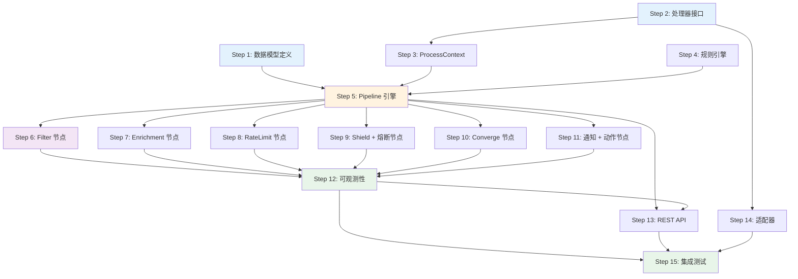

# AlertFlow Engine 实现计划

> 基于 [设计文档](./README.md) 的详细实现计划，采用分步骤、最小可验证单元的方式推进。

## 一、总体原则

1. **渐进式实现**：每个步骤产出可独立运行和测试的代码
2. **全新实现**：所有功能模块独立实现，不依赖现有 `alarm_backends/core/` 和 `service/` 中的组件
3. **最小侵入**：新增 `framework/`、`nodes/` 目录，不修改现有代码
4. **配置驱动**：所有行为通过配置控制，代码只提供引擎能力

## 二、最终目录结构

```
bkmonitor/alarm_backends/
├── framework/                           # Pipeline 框架核心
│   ├── __init__.py
│   ├── pipeline/                        # Pipeline 编排器
│   │   ├── __init__.py
│   │   ├── orchestrator.py             # 编排器：加载配置、编排执行
│   │   ├── executor.py                 # 执行器：节点调度、错误处理
│   │   └── context.py                  # ProcessContext 上下文管理
│   ├── processor/                       # 处理器框架
│   │   ├── __init__.py
│   │   ├── base.py                     # IProcessor 抽象基类
│   │   ├── registry.py                 # 处理器注册中心（单例）
│   │   └── factory.py                  # 处理器工厂
│   ├── rule/                            # 规则引擎
│   │   ├── __init__.py
│   │   ├── engine.py                   # 规则引擎入口
│   │   ├── matcher.py                  # 条件匹配器（集成 jsonLogic）
│   │   └── condition.py                # 条件定义与操作符
│   ├── config/                          # 配置管理
│   │   ├── __init__.py
│   │   ├── manager.py                  # 配置管理器
│   │   ├── validator.py                # 配置验证器（DRF Serializer + jsonschema）
│   │   ├── loader.py                   # 配置加载器（JSON/YAML/DB）
│   │   └── models.py                   # Django ORM 模型（PipelineConfig 等）
│   ├── cache/                           # 缓存模块（全新实现）
│   │   ├── __init__.py
│   │   ├── cmdb_cache.py               # CMDB 数据缓存
│   │   ├── shield_cache.py             # 屏蔽规则缓存
│   │   └── strategy_cache.py           # 策略配置缓存
│   ├── circuit_breaking/                # 熔断机制（全新实现）
│   │   ├── __init__.py
│   │   ├── breaker.py                  # 熔断器实现
│   │   └── state.py                    # 熔断状态管理
│   └── observability/                   # 可观测性
│       ├── __init__.py
│       ├── manager.py                  # ObservabilityManager
│       ├── mixin.py                    # ObservabilityMixin
│       └── logger.py                   # structlog 配置与封装
├── nodes/                               # 预置处理节点
│   ├── __init__.py
│   ├── base.py                         # 节点通用基类（继承 IProcessor + ObservabilityMixin）
│   ├── filter/                          # 过滤节点
│   │   ├── __init__.py
│   │   └── filter_node.py
│   ├── enrichment/                      # 丰富化节点
│   │   ├── __init__.py
│   │   └── enrichment_node.py
│   ├── rate_limit/                      # 限流节点
│   │   ├── __init__.py
│   │   └── rate_limit_node.py
│   ├── shield/                          # 屏蔽节点
│   │   ├── __init__.py
│   │   └── shield_node.py
│   ├── converge/                        # 收敛节点
│   │   ├── __init__.py
│   │   └── converge_node.py
│   ├── circuit_breaker/                 # 熔断节点
│   │   ├── __init__.py
│   │   └── circuit_breaker_node.py
│   ├── notification/                    # 通知节点
│   │   ├── __init__.py
│   │   └── notification_node.py
│   └── action/                          # 动作节点
│       ├── __init__.py
│       └── action_node.py
├── service/alertflow/                   # 内部服务接口（新增子目录）
│   ├── __init__.py
│   ├── views.py                        # REST API 视图
│   ├── serializers.py                  # DRF 序列化器
│   ├── urls.py                         # 路由配置
│   └── manager.py                      # Pipeline CRUD 管理
└── tests/alertflow/                     # 测试（新增子目录）
    ├── __init__.py
    ├── test_processor.py
    ├── test_pipeline.py
    ├── test_rule_engine.py
    ├── test_config.py
    └── test_nodes/
        ├── __init__.py
        ├── test_filter.py
        ├── test_enrichment.py
        ├── test_rate_limit.py
        └── test_converge.py
```

---

## 三、分步实现计划

### Step 1：数据模型定义

**目标**：定义 Django ORM 数据模型，为配置管理、版本管理、日志存储提供数据持久化基础。

**产出文件**：
| 文件 | 说明 |
|------|------|
| `framework/__init__.py` | 框架包初始化 |
| `framework/config/__init__.py` | 配置管理子包初始化 |
| `framework/config/models.py` | Django ORM 模型：`PipelineConfig`、`PipelineConfigVersion` |

**数据模型**：
```python
class PipelineConfig(models.Model):
    """Pipeline 配置表"""
    pipeline_id = models.CharField(max_length=128, unique=True)
    name = models.CharField(max_length=256)
    version = models.CharField(max_length=64)
    description = models.TextField(blank=True, default="")
    scenario = models.CharField(max_length=64, default="alert")
    enabled = models.BooleanField(default=True)
    config_json = models.JSONField()        # 完整 Pipeline 配置
    created_at = models.DateTimeField(auto_now_add=True)
    updated_at = models.DateTimeField(auto_now=True)
    created_by = models.CharField(max_length=128, default="")

class PipelineConfigVersion(models.Model):
    """配置版本历史表"""
    pipeline = models.ForeignKey(PipelineConfig, on_delete=models.CASCADE)
    version = models.CharField(max_length=64)
    config_json = models.JSONField()
    change_reason = models.TextField(blank=True, default="")
    created_at = models.DateTimeField(auto_now_add=True)
    created_by = models.CharField(max_length=128, default="")
```

**验收标准**：
- [ ] 模型定义符合 PostgresQL JSONField 规范
- [ ] 支持 `pipeline_id` 唯一索引
- [ ] 支持 Django Migration 正确生成
- [ ] 外键关系正确配置（级联删除）

**依赖**：无（最底层，无外部依赖）  
**新增第三方库**：无

---

### Step 2：处理器接口与注册中心

**目标**：实现 `IProcessor` 抽象基类和 `ProcessorRegistry` 注册中心，定义统一的处理器接口规范。

**产出文件**：
| 文件 | 说明 |
|------|------|
| `framework/processor/__init__.py` | 处理器子包初始化 |
| `framework/processor/base.py` | `IProcessor` 抽象基类、`ProcessResult` 结果类 |
| `framework/processor/registry.py` | `ProcessorRegistry` 单例注册中心 |
| `framework/processor/factory.py` | `ProcessorFactory` 工厂类 |
| `tests/alertflow/__init__.py` | 测试包初始化 |
| `tests/alertflow/test_processor.py` | 处理器框架单元测试 |

**核心接口定义**：
```python
class IProcessor(ABC):
    """处理器抽象基类"""
    name: str                                    # 处理器名称
    version: str                                 # 处理器版本
    def initialize(self, config: Dict) -> None   # 初始化（接收配置）
    def process(self, context: ProcessContext) -> ProcessResult  # 处理数据
    def validate_config(self, config: Dict) -> bool             # 验证配置
    def get_config_schema(cls) -> Dict           # 返回配置 Schema
    def get_input_schema(cls) -> Dict            # 返回输入 Schema
    def get_output_schema(cls) -> Dict           # 返回输出 Schema
    def cleanup(self) -> None                    # 资源清理

class ProcessorRegistry:
    """处理器注册中心（单例模式）"""
    def register(self, processor_class)          # 注册处理器
    def get(self, name: str, version: str = None) -> Type[IProcessor]  # 获取处理器类
    def list_all(self) -> Dict                   # 列出所有已注册处理器
```

**验收标准**：
- [ ] `IProcessor` 定义完整的抽象接口
- [ ] `ProcessorRegistry` 支持注册、查询、列举处理器
- [ ] `ProcessorFactory` 根据名称和配置创建处理器实例
- [ ] 支持 `@register_processor` 装饰器注册
- [ ] 单元测试通过

**依赖**：无（零外部依赖）

---

### Step 3：ProcessContext 上下文管理

**目标**：实现 `ProcessContext`，负责在节点间传递数据和状态，是 Pipeline 数据流的载体。

**产出文件**：
| 文件 | 说明 |
|------|------|
| `framework/pipeline/__init__.py` | Pipeline 子包初始化 |
| `framework/pipeline/context.py` | `ProcessContext` 上下文类 |

**核心数据结构**：
```python
class ProcessContext:
    """处理上下文 - 在节点间传递的数据容器"""
    trace_id: str              # 追踪 ID（UUID）
    pipeline_id: str           # Pipeline ID
    event: Dict                # 原始事件数据
    alert: Optional[Dict]      # 告警数据（处理过程中生成）
    variables: Dict            # 全局变量（节点间共享）
    upstream: Dict             # 上游节点输出（支持 {{ $upstream.node_name.field }} 语法）
    metadata: Dict             # 元数据
    should_stop: bool          # 是否终止流程
    error: Optional[str]       # 错误信息
    metrics: Dict              # 性能指标
    executed_nodes: List[str]  # 已执行节点列表
```

**验收标准**：
- [ ] 支持事件数据和告警数据的存取
- [ ] 支持上游节点输出的引用（`upstream` 字段）
- [ ] 支持 `should_stop` 流程控制标志
- [ ] 支持 `trace_id` 链路追踪
- [ ] 支持序列化/反序列化（用于分布式场景）
- [ ] 单元测试通过

**依赖**：Step 2

---

### Step 4：规则引擎

**目标**：实现基于 jsonLogic 的规则引擎，为过滤、路由等节点提供条件匹配能力。

**产出文件**：
| 文件 | 说明 |
|------|------|
| `framework/rule/__init__.py` | 规则引擎子包初始化 |
| `framework/rule/condition.py` | 条件定义（操作符枚举、条件数据结构） |
| `framework/rule/matcher.py` | `ConditionMatcher` 条件匹配器 |
| `framework/rule/engine.py` | `RuleEngine` 规则引擎入口 |
| `tests/alertflow/test_rule_engine.py` | 规则引擎单元测试 |

**支持的操作符**：
`eq`, `neq`, `gt`, `gte`, `lt`, `lte`, `in`, `not_in`, `include`, `exclude`, `regex`, `startswith`, `endswith`

**逻辑组合**：`AND`（全部满足）、`OR`（任意满足）、`NOT`（取反）

**验收标准**：
- [ ] 支持所有 14 种操作符
- [ ] 支持 AND/OR/NOT 逻辑组合
- [ ] 支持嵌套字段路径匹配（如 `labels.env`）
- [ ] 集成 jsonLogic 库
- [ ] 性能：单次匹配 < 1ms
- [ ] 单元测试覆盖所有操作符

**依赖**：无（独立模块）
**新增第三方库**：`json-logic-qubit`（jsonLogic Python 实现）

---

### Step 5：Pipeline 执行引擎

**目标**：实现 Pipeline 编排器和执行器，串联处理器框架、上下文、规则引擎和配置管理，形成完整的执行链路。

**产出文件**：
| 文件 | 说明 |
|------|------|
| `framework/config/loader.py` | 配置加载器（支持 JSON/YAML/DB 来源） |
| `framework/config/validator.py` | 配置验证器（DRF Serializer + jsonschema 双重验证） |
| `framework/config/manager.py` | 配置管理器（CRUD + 版本管理 + 热加载） |
| `framework/pipeline/orchestrator.py` | `PipelineOrchestrator` 编排器 |
| `framework/pipeline/executor.py` | `PipelineExecutor` 执行器 |
| `tests/alertflow/test_config.py` | 配置管理单元测试 |
| `tests/alertflow/test_pipeline.py` | Pipeline 执行单元测试 |

**核心流程**：
```
加载配置 → 验证配置 → 实例化节点 → 依次执行节点 → 收集结果
```

**编排器职责**：
- 加载 Pipeline 配置
- 管理多个 Pipeline 实例
- 提供热加载能力

**执行器职责**：
- 按序执行节点列表
- 错误处理策略（忽略/重试/停止/降级）
- 节点条件判断（基于规则引擎决定是否执行某节点）
- 执行超时控制
- 上游输出传递（`upstream` 机制）

**错误处理策略**：
```python
class ErrorStrategy(str, Enum):
    IGNORE = "ignore"       # 忽略错误，继续执行
    RETRY = "retry"         # 重试（可配置次数和间隔）
    STOP = "stop"           # 停止整个 Pipeline
    FALLBACK = "fallback"   # 降级到备用节点
```

**验收标准**：
- [ ] 支持从 JSON 文件、YAML 文件、数据库加载配置
- [ ] DRF Serializer 验证配置结构
- [ ] jsonschema 验证节点配置的 Schema 合法性
- [ ] 能够从配置创建并执行完整的 Pipeline
- [ ] 支持 4 种错误处理策略
- [ ] 支持条件执行（基于规则引擎）
- [ ] 支持节点超时控制
- [ ] 支持 `upstream` 输出引用
- [ ] 支持热加载
- [ ] 集成测试：构造一个含 3 个 Mock 节点的 Pipeline 完整执行

**依赖**：Step 1 + Step 2 + Step 3 + Step 4
**新增第三方库**：`jsonschema`、`PyYAML`

---

### Step 6：Filter 过滤节点

**目标**：实现第一个真实的处理节点，基于规则引擎进行事件过滤，验证整个框架的可用性。

**产出文件**：
| 文件 | 说明 |
|------|------|
| `nodes/__init__.py` | 节点包初始化 |
| `nodes/base.py` | 节点通用基类 |
| `nodes/filter/__init__.py` | 过滤节点包初始化 |
| `nodes/filter/filter_node.py` | `FilterNode` 过滤节点实现 |
| `tests/alertflow/test_nodes/__init__.py` | 节点测试包初始化 |
| `tests/alertflow/test_nodes/test_filter.py` | 过滤节点测试 |

**功能**：
- 基于 jsonLogic 条件表达式过滤事件
- 支持 `any`（任意匹配）和 `all`（全部匹配）两种匹配模式
- 不满足条件的事件设置 `context.should_stop = True`

**验收标准**：
- [ ] 通过规则引擎执行条件匹配
- [ ] 支持多条件组合
- [ ] 端到端测试：FilterNode 作为 Pipeline 节点正常工作
- [ ] 单元测试通过

**依赖**：Step 4 + Step 5

---

### Step 7：Enrichment 丰富化节点

**目标**：实现事件丰富化节点，支持 CMDB 数据获取、自定义映射、静态值注入。

**产出文件**：
| 文件 | 说明 |
|------|------|
| `nodes/enrichment/__init__.py` | 丰富化节点包初始化 |
| `nodes/enrichment/enrichment_node.py` | `EnrichmentNode` 丰富化节点实现 |
| `tests/alertflow/test_nodes/test_enrichment.py` | 丰富化节点测试 |

**丰富化类型**：
| 类型 | 说明 | 数据来源 |
|------|------|---------|
| `cmdb` | CMDB 主机信息 | 复用 `core/cache/cmdb/` |
| `custom` | 自定义字段映射 | 配置中的 `mapping` 字典 |
| `static` | 静态值注入 | 配置中的 `static_value` |
| `tag` | 标签补充 | 外部标签服务 |

**验收标准**：
- [ ] 支持 4 种丰富化类型
- [ ] CMDB 丰富化从 CMDB API 获取数据并缓存到 Redis
- [ ] 支持 `fallback_values` 降级默认值
- [ ] 支持超时控制
- [ ] 单元测试通过

**依赖**：Step 5

---

### Step 8：RateLimit 限流节点

**目标**：实现基于 Redis + Lua 的分布式限流节点。

**产出文件**：
| 文件 | 说明 |
|------|------|
| `nodes/rate_limit/__init__.py` | 限流节点包初始化 |
| `nodes/rate_limit/rate_limit_node.py` | `RateLimitNode` 限流节点（含 Lua 脚本） |
| `tests/alertflow/test_nodes/test_rate_limit.py` | 限流节点测试 |

**限流策略**：
| 策略 | 算法 | 适用场景 |
|------|------|---------|
| `sliding_window` | 滑动窗口 | 通用限流，精确控制 |
| `fixed_window` | 固定窗口 | 简单场景，性能最优 |
| `token_bucket` | 令牌桶 | 允许突发流量 |

**验收标准**：
- [ ] 实现滑动窗口限流（Redis ZSET + Lua）
- [ ] 支持 `key_template` 变量替换（如 `{strategy_id}:{ip}`）
- [ ] 被限流的事件标记 `context.metrics['rate_limited'] = True`
- [ ] Redis 不可用时降级（不限流，打日志告警）
- [ ] 单元测试通过（使用 fakeredis 模拟）

**依赖**：Step 5

---

### Step 9：Shield 屏蔽节点 + CircuitBreaker 熔断节点

**目标**：实现屏蔽和熔断节点，复用现有的 `core/cache/shield.py` 和 `core/circuit_breaking/`。

**产出文件**：
| 文件 | 说明 |
|------|------|
| `nodes/shield/__init__.py` | 屏蔽节点包初始化 |
| `nodes/shield/shield_node.py` | `ShieldNode` 屏蔽节点 |
| `nodes/circuit_breaker/__init__.py` | 熔断节点包初始化 |
| `nodes/circuit_breaker/circuit_breaker_node.py` | `CircuitBreakerNode` 熔断节点 |
| `tests/alertflow/test_nodes/test_shield.py` | 屏蔽节点测试 |
| `tests/alertflow/test_nodes/test_circuit_breaker.py` | 熔断节点测试 |

**验收标准**：
- [ ] 屏蔽节点：从配置数据库加载屏蔽规则
- [ ] 屏蔽节点：支持时间范围屏蔽、维度匹配屏蔽
- [ ] 熔断节点：实现独立熔断机制
- [ ] 熔断节点：支持 open/closed/half-open 三态
- [ ] 单元测试通过

**依赖**：Step 5

---

### Step 10：Converge 收敛节点

**目标**：实现告警收敛节点，复用现有 `service/converge/` 的收敛逻辑。

**产出文件**：
| 文件 | 说明 |
|------|------|
| `nodes/converge/__init__.py` | 收敛节点包初始化 |
| `nodes/converge/converge_node.py` | `ConvergeNode` 收敛节点 |
| `tests/alertflow/test_nodes/test_converge.py` | 收敛节点测试 |

**收敛类型**：
| 类型 | 说明 |
|------|------|
| `count` | 计数收敛：同一维度达到阈值后收敛 |
| `duration` | 时长收敛：持续一段时间后收敛 |
| `interval` | 间隔收敛：控制通知间隔 |

**验收标准**：
- [ ] 支持 3 种收敛类型
- [ ] 支持多维度收敛键（`dimension` 字段列表）
- [ ] 实现独立收敛逻辑
- [ ] 收敛状态存储在 Redis
- [ ] 单元测试通过

**依赖**：Step 5

---

### Step 11：Notification 通知节点 + Action 动作节点

**目标**：实现告警通知和动作执行节点，对接现有的 FTA 动作系统。

**产出文件**：
| 文件 | 说明 |
|------|------|
| `nodes/notification/__init__.py` | 通知节点包初始化 |
| `nodes/notification/notification_node.py` | `NotificationNode` 通知节点 |
| `nodes/action/__init__.py` | 动作节点包初始化 |
| `nodes/action/action_node.py` | `ActionNode` 动作节点 |
| `tests/alertflow/test_nodes/test_notification.py` | 通知节点测试 |

**通知渠道**：
邮件、短信、微信、企业微信、Webhook（复用现有 FTA 通知能力）

**验收标准**：
- [ ] 通知节点：支持多渠道通知配置
- [ ] 通知节点：实现独立通知机制
- [ ] 动作节点：支持自动化动作触发
- [ ] 动作节点：实现独立动作处理
- [ ] 单元测试通过

**依赖**：Step 5

---

### Step 12：可观测性实现

**目标**：实现完整的可观测性能力，包括 structlog 结构化日志、ObservabilityMixin 和 ES 日志存储。

**产出文件**：
| 文件 | 说明 |
|------|------|
| `framework/observability/__init__.py` | 可观测性子包初始化 |
| `framework/observability/logger.py` | structlog 配置与封装 |
| `framework/observability/mixin.py` | `ObservabilityMixin` 基类 |
| `framework/observability/manager.py` | `ObservabilityManager`（ES 存储） |

**ES 索引**：
| 索引名 | 说明 |
|--------|------|
| `alertflow_execution_log` | Pipeline 执行日志 |
| `alertflow_node_log` | 节点执行日志 |
| `alertflow_rate_limit_log` | 限流日志 |
| `alertflow_shield_log` | 屏蔽日志 |
| `alertflow_converge_log` | 收敛日志 |
| `alertflow_frequency_rule_log` | 频率规则日志 |

**验收标准**：
- [ ] structlog 配置完成，输出 JSON 格式日志
- [ ] `ObservabilityMixin` 自动记录节点开始/成功/失败
- [ ] `ObservabilityManager` 支持 6 类日志写入 ES
- [ ] `query_by_trace_id` 接口可查询完整执行链路
- [ ] 异步写入 ES，不影响主流程性能
- [ ] 回填：将 ObservabilityMixin 集成到 Step 6~11 的所有节点

**依赖**：Step 6 ~ Step 11
**新增第三方库**：`structlog`

---

### Step 13：REST API 内部服务接口

**目标**：实现配置管理的 REST API 和故障排查接口。

**产出文件**：
| 文件 | 说明 |
|------|------|
| `service/alertflow/__init__.py` | 服务子包初始化 |
| `service/alertflow/serializers.py` | DRF 序列化器 |
| `service/alertflow/views.py` | API 视图 |
| `service/alertflow/urls.py` | URL 路由 |
| `service/alertflow/manager.py` | Pipeline CRUD 管理封装 |

**API 列表**：
```
POST   /api/v1/pipelines/                # 创建 Pipeline
GET    /api/v1/pipelines/                # 获取 Pipeline 列表
GET    /api/v1/pipelines/{id}/           # 获取 Pipeline 详情
PUT    /api/v1/pipelines/{id}/           # 更新 Pipeline
DELETE /api/v1/pipelines/{id}/           # 删除 Pipeline
POST   /api/v1/pipelines/{id}/validate/  # 验证配置
POST   /api/v1/pipelines/{id}/test/      # 测试配置（Dry Run）
GET    /api/v1/pipelines/{id}/versions/  # 获取配置版本历史
POST   /api/v1/pipelines/{id}/rollback/  # 回滚到指定版本

GET    /api/v1/nodes/                    # 获取所有可用节点类型
GET    /api/v1/nodes/{type}/config/      # 获取节点配置 Schema 和模板

GET    /api/v1/traces/{trace_id}/        # 根据 trace_id 查询执行链路
GET    /api/v1/analysis/strategy/        # 策略维度分析
GET    /api/v1/analysis/time-range/      # 时间范围分析
```

**验收标准**：
- [ ] Pipeline CRUD 接口正常工作
- [ ] 配置验证和测试（Dry Run）接口正常
- [ ] 版本管理和回滚接口正常
- [ ] 节点 Schema 查询接口正常
- [ ] 故障排查（trace_id 查询）接口正常
- [ ] DRF Serializer 验证所有输入

**依赖**：Step 5 + Step 12

---

### Step 14：现有系统适配器

**目标**：实现适配器层，将现有的告警处理逻辑桥接到新框架。

**产出文件**：
| 文件 | 说明 |
|------|------|
| `adapters/__init__.py` | 适配器包初始化 |
| `adapters/legacy/__init__.py` | Legacy 适配器包初始化 |
| `adapters/legacy/converge_adapter.py` | 收敛处理器适配器 |
| `adapters/legacy/fta_action_adapter.py` | FTA 动作处理器适配器 |

**验收标准**：
- [ ] 适配器将现有收敛处理器包装为 `IProcessor` 接口
- [ ] 适配器将现有 FTA 动作包装为 `IProcessor` 接口
- [ ] 适配器可在 Pipeline 中作为普通节点使用
- [ ] 不修改任何现有代码

**依赖**：Step 2 + 现有 `service/converge/` + `service/fta_action/`

---

### Step 15：集成测试与端到端验证

**目标**：构建完整的集成测试，验证从事件输入到通知输出的全链路。

**产出文件**：
| 文件 | 说明 |
|------|------|
| `tests/alertflow/test_integration.py` | 端到端集成测试 |
| `tests/alertflow/test_e2e_pipeline.py` | 完整 Pipeline 场景测试 |

**测试场景**：
```
场景1：标准告警流程
  事件输入 → 丰富化 → 过滤 → 限流 → 屏蔽检查 → 收敛 → 通知

场景2：被过滤的事件
  事件输入 → 丰富化 → 过滤(不匹配) → Pipeline 终止

场景3：告警风暴场景
  大量事件输入 → 限流生效 → 部分事件被限流 → 收敛 → 少量通知

场景4：配置热加载
  执行中修改配置 → 热加载 → 新配置生效

场景5：节点异常降级
  某节点执行异常 → 错误策略触发 → 降级/重试/停止
```

**验收标准**：
- [ ] 5 个场景全部通过
- [ ] 全链路 trace_id 追踪正确
- [ ] ES 日志记录完整
- [ ] 性能基准：单条事件处理 < 100ms

**依赖**：Step 6 ~ Step 14 全部完成

---

## 四、依赖关系图



**关键路径**（必须按序执行的步骤）：
```
Step 1 → Step 5 → Step 6 → Step 12 → Step 13 → Step 15
```

**可并行执行的步骤**：
- **第一阶段（框架层）**：Step 2 与 Step 5 可并行（Step 4 也独立）
- **第二阶段（节点层）**：Step 6 完成后，Step 7 ~ Step 11 的 6 类节点可全部并行开发
- **适配器可提前启动**：Step 14 在 Step 2 完成后即可启动（仅依赖接口定义）

---

## 五、新增第三方依赖

| 库名 | 版本 | 用途 | 引入阶段 |
|------|------|------|---------|
| `json-logic-qubit` | >=0.9.1 | jsonLogic 规则引擎 | Step 4 |
| `jsonschema` | >=4.0 | JSON Schema 验证 | Step 5 |
| `PyYAML` | >=6.0 | YAML 配置文件解析 | Step 5 |
| `structlog` | >=23.0 | 结构化日志 | Step 12 |

> **注**：`pydantic`、`redis`、`elasticsearch`、`celery`、`Django`、`DRF` 等均为现有依赖，无需新增。

---

## 六、与现有系统的集成点

| 现有模块 | 集成方式 | 引入阶段 |
|---------|---------|---------|
| `core/alert/event.py` — Event 模型 | 读取事件数据，作为 ProcessContext 的事件数据来源 | Step 3 |
| `core/alert/alert.py` — Alert 模型 | 读取告警数据，作为 ProcessContext 的告警数据 | Step 3 |
| `core/cache/strategy.py` — 策略缓存 | 读取策略配置，转换为 Pipeline 配置 | Step 5 |
| `core/cache/shield.py` — 屏蔽缓存 | ShieldNode 读取屏蔽配置数据 | Step 9 |
| `core/cache/cmdb/` — CMDB 缓存 | EnrichmentNode 通过 API 获取主机信息 | Step 7 |
| `core/storage/redis.py` — Redis 客户端 | RateLimitNode 使用 Redis 限流，ConvergeNode 存储收敛状态 | Step 8, Step 10 |
| `service/converge/` — 收敛服务 | 参考收敛业务逻辑，全新实现 ConvergeNode | Step 10 |
| `service/fta_action/` — FTA 动作 | 参考通知和动作业务逻辑，全新实现 NotificationNode 和 ActionNode | Step 11 |

---

## 七、风险与应对

| 风险 | 影响 | 应对措施 |
|------|------|---------|
| 全新实现熔断/收敛逻辑需要充分理解业务规则 | Step 9/10 可能耗时增加 | 详细阅读现有代码和文档，充分测试验证 |
| jsonLogic 不满足复杂业务规则需求 | Step 4 可能需要扩展 | 预留自定义操作符注册机制 |
| Pipeline 配置复杂，用户容易配错 | 降低可用性 | Step 5 严格验证 + Step 13 提供模板和 Dry Run |
| ES 写入量大，影响集群性能 | Step 12 可能需要优化 | 异步批量写入 + 日志采样 + ILM 策略 |
| Redis 故障导致限流/收敛失效 | 业务中断 | 本地内存降级 + 告警通知 |

---

## 八、里程碑

| 里程碑 | 包含步骤 | 交付物 | 关键指标 |
|--------|---------|--------|---------|
| **M1: 核心框架完成** | Step 1 ~ Step 5 | 数据模型 + 处理器接口 + 执行引擎 | 能执行含 Mock 节点的 Pipeline，框架单元测试 100% 通过 |
| **M2: 核心节点就绪** | Step 6 ~ Step 11 | Filter、Enrichment、RateLimit、Shield、CircuitBreaker、Converge、Notification、Action 共 8 类节点 | 节点单元测试 100% 通过，端到端集成测试通过 |
| **M3: 可观测与管理** | Step 12 ~ Step 14 | structlog 日志 + ES 存储 + REST API + 适配器 | API 接口测试通过，日志正确写入 ES |
| **M4: 生产就绪** | Step 15 | 全链路集成测试 | 5 个场景全部通过，单事件处理 < 100ms |
