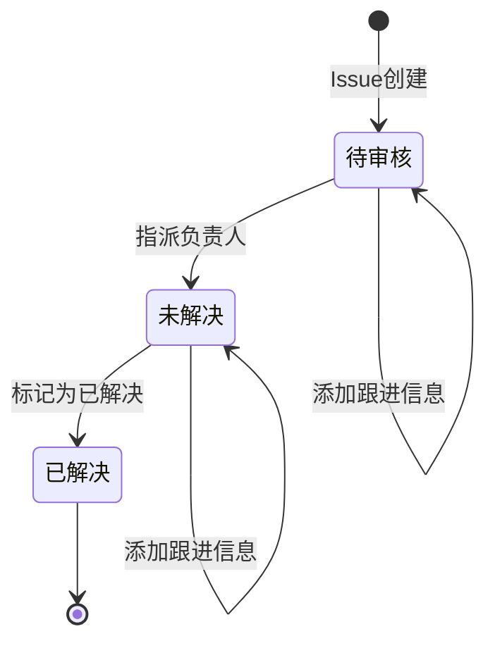

# Issues Node Configuration (问题跟踪节点配置)

## 节点类型
- **NodeType**: `issues`
- **分类**: ACTION (动作类)
- **功能**: 创建或更新 Issue，实现告警/故障的持续跟踪管理，支持与外部系统（ITSM/TAPD/GitHub）集成

## 功能说明

Issues 节点用于解决"告警恢复 ≠ 问题解决"的场景。即使告警已恢复，仍可能需要负责人继续跟进处理（如修复代码Bug并发布）。

### 与 Incident 节点的区别

| 特性 | Incident（故障事件） | Issues（问题跟踪） |
|------|---------------------|-------------------|
| **定位** | 实时故障管理 | 后续问题跟踪 |
| **生命周期** | 告警恢复即关闭 | 需人工标记解决 |
| **状态流转** | 自动化为主 | 人工驱动为主 |
| **外部关联** | ITSM工单 | ITSM/TAPD/GitHub等 |
| **典型场景** | 故障响应 | 根因修复、代码Bug |

## 配置 Schema

### IssuesNodeConfigSerializer

```python
from rest_framework import serializers
from enum import Enum


class IssueStatus(str, Enum):
    """Issue状态"""
    PENDING_REVIEW = "pending_review"   # 待审核（初始状态）
    UNRESOLVED = "unresolved"           # 未解决
    RESOLVED = "resolved"               # 已解决


class IssuePriority(str, Enum):
    """Issue优先级"""
    CRITICAL = "critical"   # 紧急
    HIGH = "high"           # 高
    MEDIUM = "medium"       # 中
    LOW = "low"             # 低


class IssueAction(str, Enum):
    """Issue动作"""
    CREATE = "create"           # 创建Issue
    UPDATE = "update"           # 更新Issue
    MERGE = "merge"             # 合并到现有Issue
    AUTO = "auto"               # 自动选择


class IssueSource(str, Enum):
    """Issue来源"""
    ALERT_STRATEGY = "alert_strategy"   # 告警策略聚合
    AI_ANALYSIS = "ai_analysis"         # AI故障分析
    MANUAL = "manual"                   # 手动创建


class ExternalSystemType(str, Enum):
    """外部系统类型"""
    BK_ITSM = "bk_itsm"     # 蓝鲸ITSM
    TAPD = "tapd"           # TAPD
    GITHUB = "github"       # GitHub Issues
    GITLAB = "gitlab"       # GitLab Issues
    JIRA = "jira"           # Jira


class IssueAggregationSerializer(serializers.Serializer):
    """Issue聚合配置"""
    enabled = serializers.BooleanField(
        default=True,
        help_text="是否启用聚合"
    )
    aggregation_dimensions = serializers.ListField(
        child=serializers.CharField(),
        help_text="聚合维度列表（基于策略配置的维度，只能减少不能新增）"
    )
    condition = serializers.DictField(
        default=dict,
        required=False,
        help_text="基于维度可选值的筛选条件"
    )
    effective_levels = serializers.ListField(
        child=serializers.IntegerField(),
        default=list,
        help_text="生效告警级别列表（1=致命, 2=预警, 3=提醒）"
    )
    aggregation_window = serializers.IntegerField(
        default=86400,
        help_text="聚合时间窗口（秒），同窗口内相同维度告警聚合到同一Issue"
    )


class IssueMappingSerializer(serializers.Serializer):
    """Issue字段映射"""
    name_template = serializers.CharField(
        default="{{ event.alert_name }}",
        help_text="Issue名称模板（默认为策略名称）"
    )
    description_template = serializers.CharField(
        required=False,
        help_text="Issue描述模板"
    )
    error_message_field = serializers.CharField(
        default="event.description",
        help_text="关键报错信息字段"
    )
    impact_scope_fields = serializers.ListField(
        child=serializers.CharField(),
        default=list,
        help_text="影响范围字段列表"
    )
    labels_field = serializers.CharField(
        default="event.labels",
        help_text="标签字段（继承告警策略标签）"
    )


class IssueAssignmentSerializer(serializers.Serializer):
    """Issue指派配置"""
    auto_assign = serializers.BooleanField(
        default=False,
        help_text="是否自动指派负责人"
    )
    assign_strategy = serializers.ChoiceField(
        choices=[
            ("by_cmdb", "按CMDB负责人"),
            ("by_strategy", "按策略配置"),
            ("by_rotation", "按轮值安排"),
            ("by_rule", "按自定义规则"),
        ],
        default="by_cmdb",
        help_text="指派策略"
    )
    default_assignee = serializers.CharField(
        required=False,
        help_text="默认负责人"
    )
    assignee_field = serializers.CharField(
        default="event.operator",
        help_text="负责人字段路径"
    )
    fallback_assignee = serializers.CharField(
        required=False,
        help_text="兜底负责人（找不到负责人时使用）"
    )


class ExternalSystemConfigSerializer(serializers.Serializer):
    """外部系统配置"""
    system_type = serializers.ChoiceField(
        choices=[(e.value, e.name) for e in ExternalSystemType],
        help_text="外部系统类型"
    )
    enabled = serializers.BooleanField(
        default=False,
        help_text="是否启用"
    )
    auto_create = serializers.BooleanField(
        default=False,
        help_text="是否自动创建外部事项"
    )
    # ITSM配置
    itsm_service_id = serializers.CharField(
        required=False,
        help_text="ITSM服务ID"
    )
    # TAPD配置
    tapd_workspace_id = serializers.CharField(
        required=False,
        help_text="TAPD项目ID"
    )
    tapd_template_id = serializers.CharField(
        required=False,
        help_text="TAPD缺陷模板ID"
    )
    # GitHub/GitLab配置
    repo_url = serializers.CharField(
        required=False,
        help_text="仓库URL"
    )
    repo_token = serializers.CharField(
        required=False,
        help_text="访问Token"
    )
    issue_labels = serializers.ListField(
        child=serializers.CharField(),
        default=list,
        help_text="Issue标签列表"
    )
    # 通用字段映射
    field_mapping = serializers.DictField(
        default=dict,
        help_text="字段映射配置"
    )


class IssueNotificationSerializer(serializers.Serializer):
    """Issue通知配置"""
    notify_on_create = serializers.BooleanField(
        default=True,
        help_text="创建时通知"
    )
    notify_on_assign = serializers.BooleanField(
        default=True,
        help_text="指派时通知"
    )
    notify_on_resolve = serializers.BooleanField(
        default=True,
        help_text="解决时通知"
    )
    notify_on_regression = serializers.BooleanField(
        default=True,
        help_text="回归问题时通知"
    )
    notify_channels = serializers.ListField(
        child=serializers.CharField(),
        default=["weixin"],
        help_text="通知渠道列表"
    )
    notify_roles = serializers.ListField(
        child=serializers.CharField(),
        default=list,
        help_text="通知角色列表"
    )


class IssueActivitySerializer(serializers.Serializer):
    """Issue活动配置"""
    track_status_change = serializers.BooleanField(
        default=True,
        help_text="记录状态变更"
    )
    track_priority_change = serializers.BooleanField(
        default=True,
        help_text="记录优先级变更"
    )
    track_assignee_change = serializers.BooleanField(
        default=True,
        help_text="记录负责人变更"
    )
    track_external_links = serializers.BooleanField(
        default=True,
        help_text="记录外部系统关联"
    )
    auto_comment_on_alert = serializers.BooleanField(
        default=False,
        help_text="新告警时自动添加评论"
    )


class RegressionDetectionSerializer(serializers.Serializer):
    """回归问题检测配置"""
    enabled = serializers.BooleanField(
        default=True,
        help_text="是否启用回归检测"
    )
    lookback_days = serializers.IntegerField(
        default=30,
        help_text="历史回溯天数"
    )
    match_fields = serializers.ListField(
        child=serializers.CharField(),
        default=list,
        help_text="匹配字段列表"
    )
    mark_as_regression = serializers.BooleanField(
        default=True,
        help_text="自动标记为回归问题"
    )


class IssuesNodeConfigSerializer(BaseNodeConfigSerializer):
    """Issues问题跟踪节点配置"""
    node_type = serializers.CharField(default="issues", read_only=True)
    
    # Issue动作
    action = serializers.ChoiceField(
        choices=[(e.value, e.name) for e in IssueAction],
        default="auto",
        help_text="Issue动作"
    )
    
    # Issue来源
    source = serializers.ChoiceField(
        choices=[(e.value, e.name) for e in IssueSource],
        default="alert_strategy",
        help_text="Issue来源"
    )
    
    # 聚合配置
    aggregation = IssueAggregationSerializer(
        required=False,
        help_text="Issue聚合配置"
    )
    
    # 字段映射
    mapping = IssueMappingSerializer(
        required=False,
        help_text="字段映射配置"
    )
    
    # 指派配置
    assignment = IssueAssignmentSerializer(
        required=False,
        help_text="Issue指派配置"
    )
    
    # 默认优先级
    default_priority = serializers.ChoiceField(
        choices=[(e.value, e.name) for e in IssuePriority],
        default="medium",
        help_text="默认优先级"
    )
    
    # 默认状态
    default_status = serializers.ChoiceField(
        choices=[(e.value, e.name) for e in IssueStatus],
        default="pending_review",
        help_text="默认状态（待审核）"
    )
    
    # 外部系统集成
    external_systems = serializers.ListField(
        child=ExternalSystemConfigSerializer(),
        default=list,
        help_text="外部系统集成配置列表（支持1对多）"
    )
    
    # 通知配置
    notification = IssueNotificationSerializer(
        required=False,
        help_text="通知配置"
    )
    
    # 活动记录配置
    activity = IssueActivitySerializer(
        required=False,
        help_text="活动记录配置"
    )
    
    # 回归检测配置
    regression_detection = RegressionDetectionSerializer(
        required=False,
        help_text="回归问题检测配置"
    )
    
    # Issue ID生成
    issue_id_template = serializers.CharField(
        default="ISSUE-{{ biz_id }}-{{ timestamp }}",
        help_text="Issue ID模板"
    )
    
    # 关联告警字段
    related_alerts_field = serializers.CharField(
        default="related_alerts",
        help_text="关联告警字段名"
    )
    
    # 输出字段
    issue_id_output_field = serializers.CharField(
        default="_issue_id",
        help_text="Issue ID输出字段"
    )
    
    # 去重配置
    dedupe_enabled = serializers.BooleanField(
        default=True,
        help_text="是否启用Issue去重"
    )
    dedupe_key_fields = serializers.ListField(
        child=serializers.CharField(),
        default=list,
        help_text="去重键字段列表"
    )
    
    # 存储后端
    storage_backend = serializers.ChoiceField(
        choices=[("mysql", "MySQL"), ("elasticsearch", "Elasticsearch")],
        default="mysql",
        help_text="Issue存储后端"
    )


## 配置字段说明

### 节点基础字段

| 字段 | 类型 | 必填 | 默认值 | 说明 |
|------|------|------|--------|------|
| `node_type` | string | 是 | "issues" | 节点类型标识 |
| `name` | string | 是 | - | 节点实例名称 |
| `description` | string | 否 | "" | 节点描述 |
| `enabled` | boolean | 否 | true | 是否启用 |
| `action` | string | 否 | "auto" | Issue动作 |
| `source` | string | 否 | "alert_strategy" | Issue来源 |
| `default_priority` | string | 否 | "medium" | 默认优先级 |
| `default_status` | string | 否 | "pending_review" | 默认状态 |
| `dedupe_enabled` | boolean | 否 | true | 启用去重 |
| `storage_backend` | string | 否 | "mysql" | 存储后端 |

### Issue聚合配置 (IssueAggregation)

| 字段 | 类型 | 必填 | 默认值 | 说明 |
|------|------|------|--------|------|
| `enabled` | boolean | 否 | true | 启用聚合 |
| `aggregation_dimensions` | array | 是 | - | 聚合维度列表 |
| `condition` | object | 否 | {} | 维度筛选条件 |
| `effective_levels` | array | 否 | [] | 生效告警级别 |
| `aggregation_window` | integer | 否 | 86400 | 聚合时间窗口（秒） |

### Issue字段映射 (IssueMapping)

| 字段 | 类型 | 必填 | 默认值 | 说明 |
|------|------|------|--------|------|
| `name_template` | string | 否 | "{{ event.alert_name }}" | Issue名称模板 |
| `description_template` | string | 否 | - | Issue描述模板 |
| `error_message_field` | string | 否 | "event.description" | 报错信息字段 |
| `impact_scope_fields` | array | 否 | [] | 影响范围字段 |
| `labels_field` | string | 否 | "event.labels" | 标签字段 |

### Issue指派配置 (IssueAssignment)

| 字段 | 类型 | 必填 | 默认值 | 说明 |
|------|------|------|--------|------|
| `auto_assign` | boolean | 否 | false | 自动指派 |
| `assign_strategy` | string | 否 | "by_cmdb" | 指派策略 |
| `default_assignee` | string | 否 | - | 默认负责人 |
| `assignee_field` | string | 否 | "event.operator" | 负责人字段 |
| `fallback_assignee` | string | 否 | - | 兜底负责人 |

### 外部系统配置 (ExternalSystemConfig)

| 字段 | 类型 | 必填 | 默认值 | 说明 |
|------|------|------|--------|------|
| `system_type` | string | 是 | - | 外部系统类型 |
| `enabled` | boolean | 否 | false | 是否启用 |
| `auto_create` | boolean | 否 | false | 自动创建外部事项 |
| `itsm_service_id` | string | 否 | - | ITSM服务ID |
| `tapd_workspace_id` | string | 否 | - | TAPD项目ID |
| `repo_url` | string | 否 | - | Git仓库URL |
| `issue_labels` | array | 否 | [] | Issue标签 |
| `field_mapping` | object | 否 | {} | 字段映射 |

### 回归检测配置 (RegressionDetection)

| 字段 | 类型 | 必填 | 默认值 | 说明 |
|------|------|------|--------|------|
| `enabled` | boolean | 否 | true | 启用回归检测 |
| `lookback_days` | integer | 否 | 30 | 回溯天数 |
| `match_fields` | array | 否 | [] | 匹配字段 |
| `mark_as_regression` | boolean | 否 | true | 自动标记回归 |

### Issue状态说明

| 状态 | 值 | 说明 | 流转条件 |
|------|-----|------|----------|
| **待审核** | `pending_review` | 初始状态，负责人为空 | Issue创建 |
| **未解决** | `unresolved` | 已指派负责人 | 指派负责人后自动流转 |
| **已解决** | `resolved` | 人工标记为已解决 | 人工操作 |

### Issue优先级说明

| 优先级 | 值 | 说明 |
|--------|-----|------|
| **紧急** | `critical` | 需要立即处理 |
| **高** | `high` | 尽快处理 |
| **中** | `medium` | 正常优先级 |
| **低** | `low` | 可延后处理 |

### Issue来源说明

| 来源 | 值 | 说明 |
|------|-----|------|
| **告警策略** | `alert_strategy` | 告警策略配置的维度聚合 |
| **AI分析** | `ai_analysis` | AI故障分析自动聚合 |
| **手动** | `manual` | 手动创建 |

### 外部系统类型说明

| 系统类型 | 值 | 说明 | 关系 |
|----------|-----|------|------|
| **蓝鲸ITSM** | `bk_itsm` | 蓝鲸ITSM系统 | 1对多 |
| **TAPD** | `tapd` | 腾讯TAPD | 1对多 |
| **GitHub** | `github` | GitHub Issues | 1对多 |
| **GitLab** | `gitlab` | GitLab Issues | 1对多 |
| **Jira** | `jira` | Atlassian Jira | 1对多 |

## JSON 配置示例

### 示例 1: 基础Issue创建（告警策略聚合）

```json
{
  "name": "strategy_issues",
  "description": "基于告警策略的Issue聚合",
  "enabled": true,
  "node_type": "issues",
  "action": "auto",
  "source": "alert_strategy",
  "aggregation": {
    "enabled": true,
    "aggregation_dimensions": [
      "event.biz_id",
      "event.strategy_id",
      "event.dimensions.host"
    ],
    "condition": {},
    "effective_levels": [1, 2, 3],
    "aggregation_window": 86400
  },
  "mapping": {
    "name_template": "{{ event.alert_name }}",
    "description_template": "告警策略：{{ event.strategy_name }}\n影响目标：{{ event.target }}\n当前值：{{ event.current_value }}",
    "error_message_field": "event.description",
    "impact_scope_fields": ["event.target", "event.dimensions.host"],
    "labels_field": "event.labels"
  },
  "assignment": {
    "auto_assign": false
  },
  "default_priority": "medium",
  "default_status": "pending_review",
  "notification": {
    "notify_on_create": true,
    "notify_on_assign": true,
    "notify_on_resolve": true,
    "notify_on_regression": true,
    "notify_channels": ["weixin"],
    "notify_roles": ["operator"]
  },
  "activity": {
    "track_status_change": true,
    "track_priority_change": true,
    "track_assignee_change": true,
    "track_external_links": true,
    "auto_comment_on_alert": false
  },
  "regression_detection": {
    "enabled": true,
    "lookback_days": 30,
    "match_fields": ["event.strategy_id", "event.dimensions.host"],
    "mark_as_regression": true
  },
  "dedupe_enabled": true,
  "dedupe_key_fields": ["event.biz_id", "event.strategy_id"],
  "storage_backend": "mysql",
  "execution": {
    "timeout": 60
  }
}
```

### 示例 2: 代码Bug跟踪（GitHub集成）

```json
{
  "name": "code_bug_issues",
  "description": "代码Bug导致的告警跟踪，自动关联GitHub Issues",
  "enabled": true,
  "node_type": "issues",
  "action": "auto",
  "source": "alert_strategy",
  "aggregation": {
    "enabled": true,
    "aggregation_dimensions": [
      "event.biz_id",
      "event.strategy_id",
      "event.dimensions.service",
      "event.dimensions.error_code"
    ],
    "effective_levels": [1, 2],
    "aggregation_window": 172800
  },
  "mapping": {
    "name_template": "[BUG] {{ event.alert_name }} - {{ event.dimensions.error_code }}",
    "description_template": "## 问题概况\n- **服务**: {{ event.dimensions.service }}\n- **错误码**: {{ event.dimensions.error_code }}\n- **首次出现**: {{ first_occur_time }}\n- **最后出现**: {{ last_occur_time }}\n- **告警次数**: {{ alert_count }}\n\n## 错误详情\n```\n{{ event.description }}\n```",
    "error_message_field": "event.description",
    "impact_scope_fields": [
      "event.dimensions.service",
      "event.dimensions.cluster"
    ]
  },
  "assignment": {
    "auto_assign": true,
    "assign_strategy": "by_cmdb",
    "assignee_field": "event.dimensions.service_owner",
    "fallback_assignee": "dev_team_lead"
  },
  "default_priority": "high",
  "default_status": "pending_review",
  "external_systems": [
    {
      "system_type": "github",
      "enabled": true,
      "auto_create": true,
      "repo_url": "https://github.com/company/backend-service",
      "repo_token": "${GITHUB_TOKEN}",
      "issue_labels": ["bug", "from-monitor", "priority-high"],
      "field_mapping": {
        "title": "name",
        "body": "description",
        "labels": "labels"
      }
    }
  ],
  "notification": {
    "notify_on_create": true,
    "notify_on_assign": true,
    "notify_on_resolve": true,
    "notify_on_regression": true,
    "notify_channels": ["weixin", "mail"],
    "notify_roles": ["developer", "team_lead"]
  },
  "activity": {
    "track_status_change": true,
    "track_priority_change": true,
    "track_assignee_change": true,
    "track_external_links": true,
    "auto_comment_on_alert": true
  },
  "regression_detection": {
    "enabled": true,
    "lookback_days": 60,
    "match_fields": [
      "event.strategy_id",
      "event.dimensions.error_code"
    ],
    "mark_as_regression": true
  },
  "dedupe_enabled": true,
  "dedupe_key_fields": [
    "event.biz_id",
    "event.dimensions.service",
    "event.dimensions.error_code"
  ],
  "storage_backend": "mysql",
  "execution": {
    "timeout": 120
  },
  "error_handling": {
    "on_error": "continue",
    "log_error": true
  }
}
```

### 示例 3: 多系统集成（ITSM + TAPD）

```json
{
  "name": "multi_system_issues",
  "description": "复杂故障跟踪，同时关联ITSM工单和TAPD任务",
  "enabled": true,
  "node_type": "issues",
  "action": "auto",
  "source": "ai_analysis",
  "aggregation": {
    "enabled": true,
    "aggregation_dimensions": [
      "event.biz_id",
      "event.root_cause_id"
    ],
    "effective_levels": [1],
    "aggregation_window": 604800
  },
  "mapping": {
    "name_template": "[故障] {{ event.biz_name }} - {{ event.root_cause_name }}",
    "description_template": "## 故障分析\n\n### AI诊断结果\n{{ event.ai_diagnosis }}\n\n### 关联告警 ({{ alert_count }}条)\n\n- {{ alert.alert_name }} @ {{ alert.target }}\n\n\n... 等共 {{ alert_count }} 条告警\n\n\n### 影响范围\n- **业务**: {{ event.biz_name }}\n- **影响服务数**: {{ affected_services | length }}\n- **影响主机数**: {{ affected_hosts | length }}",
    "impact_scope_fields": [
      "affected_services",
      "affected_hosts"
    ]
  },
  "assignment": {
    "auto_assign": true,
    "assign_strategy": "by_rule",
    "default_assignee": "oncall_sre"
  },
  "default_priority": "critical",
  "default_status": "pending_review",
  "external_systems": [
    {
      "system_type": "bk_itsm",
      "enabled": true,
      "auto_create": true,
      "itsm_service_id": "incident_management",
      "field_mapping": {
        "title": "name",
        "description": "description",
        "urgency": "priority",
        "bk_biz_id": "event.biz_id"
      }
    },
    {
      "system_type": "tapd",
      "enabled": true,
      "auto_create": true,
      "tapd_workspace_id": "12345678",
      "tapd_template_id": "bug_template_001",
      "field_mapping": {
        "title": "name",
        "description": "description",
        "priority": "priority",
        "custom_field_one": "event.biz_name"
      }
    }
  ],
  "notification": {
    "notify_on_create": true,
    "notify_on_assign": true,
    "notify_on_resolve": true,
    "notify_on_regression": true,
    "notify_channels": ["weixin", "mail", "sms"],
    "notify_roles": ["sre", "service_owner", "team_lead"]
  },
  "activity": {
    "track_status_change": true,
    "track_priority_change": true,
    "track_assignee_change": true,
    "track_external_links": true,
    "auto_comment_on_alert": true
  },
  "regression_detection": {
    "enabled": true,
    "lookback_days": 90,
    "match_fields": ["event.root_cause_id"],
    "mark_as_regression": true
  },
  "issue_id_template": "ISSUE-{{ biz_id }}-{{ root_cause_id }}-{{ timestamp }}",
  "related_alerts_field": "alerts",
  "issue_id_output_field": "_issue_id",
  "dedupe_enabled": true,
  "dedupe_key_fields": ["event.biz_id", "event.root_cause_id"],
  "storage_backend": "elasticsearch",
  "execution": {
    "timeout": 180
  },
  "error_handling": {
    "on_error": "continue",
    "log_error": true
  }
}
```

## 使用场景

1. **告警后续跟踪**：告警恢复后仍需持续跟进处理
2. **代码Bug修复**：跟踪代码Bug从发现到修复发布的全流程
3. **复杂故障处理**：AI分析聚合的故障需要多方协作处理
4. **外部系统协同**：与ITSM/TAPD/GitHub等系统1对多关联
5. **问题回归追踪**：识别并标记回归问题
6. **责任指派**：自动或手动指派问题负责人
7. **趋势分析**：统计问题发生趋势和影响范围
8. **报告生成**：生成问题处理报告

## 注意事项

1. **聚合维度配置**：
   - 只能使用策略已配置的维度（只能减少不能新增）
   - 维度选择影响Issue粒度
   - 过细粒度会产生大量Issue

2. **状态流转**：
   - 初始状态为"待审核"（负责人为空显示"未指派"）
   - 指派负责人后自动流转到"未解决"
   - 只能通过人工操作标记"已解决"

3. **外部系统集成**：
   - 支持1个Issue关联多个外部系统事项
   - 不同系统需要不同的认证配置
   - 注意API调用频率限制

4. **回归检测**：
   - 基于聚合维度和策略判断历史问题
   - 合理设置回溯时间范围
   - 回归问题会特别标记

5. **通知策略**：
   - 创建时通知审核人员
   - 指派时通知负责人
   - 回归问题重点通知

6. **与Incident的配合**：
   - Incident用于实时故障管理
   - Issue用于后续问题跟踪
   - 可从Incident自动创建Issue

7. **批量操作**：
   - 支持批量指派负责人
   - 支持批量标记已解决
   - 支持批量修改优先级

8. **数据导出**：
   - 支持导出Excel表格
   - 包含完整Issue信息和关联告警

## 相关节点

- **上游节点**：
  - Incident（故障事件节点）：从故障事件创建Issue
  - Converge（收敛节点）：收敛后创建Issue
  - Filter（过滤节点）：按条件创建Issue

- **下游节点**：
  - Notification（通知节点）：Issue状态通知
  - Webhook（回调节点）：触发外部系统
  - Storage（存储节点）：存储Issue详情

### 典型组合模式

1. **Converge → Issues → Notification**
   - 收敛 → 创建Issue → 通知负责人

2. **Incident → Issues → Webhook**
   - 故障事件 → 创建Issue → 触发外部系统

3. **Filter → Issues → Storage**
   - 过滤高优先级 → 创建Issue → 存储归档

4. **AI Analysis → Issues → Multi-System**
   - AI故障分析 → 创建Issue → 关联ITSM/TAPD/GitHub

## Issue生命周期流程图



## 参考文档

- [节点配置基础文档](../08-node-config-schemas.md)
- [扩展节点配置文档](../09-extended-node-configs.md)
- [节点配置索引](./README.md)
- [Issues功能详细说明](../../../docs/issues_feature_guide.md)
