# Issues 模块技术设计

> **创建时间**：2026-03-08
> **最后更新**：2026-03-09（v1.3，补齐 IssueDocument 主键、跨索引查询口径与历史保留策略）
> **状态**：设计完成，后台第一阶段待实现
> **关联文档**：[产品设计](./issues模块产品设计.md) | [review.md](./review.md)

---

## 1. 存储分层策略

完全对齐 Alert 模式，Issue 运营数据无需 MySQL，仅策略聚合配置保留 MySQL。

> **范围约束**：当前版本仅支持 `strategy_id -> 1 个活跃 Issue` 的 1:1 关系，不为 1:N 引入额外复杂度。

| 存储层 | 内容 | 对齐参考 |
|--------|------|---------|
| **MySQL** | `StrategyIssueConfig`（策略聚合配置，唯一 MySQL 表） | `StrategyActionConfigRelation` |
| **Redis 热缓存** | 活跃 Issue 数据（TTL 30min） | `ALERT_DEDUPE_CONTENT_KEY` |
| **Redis 分布式锁** | 按 `strategy_id` 加锁，**仅用于 Issue 创建阶段** | `ALERT_UPDATE_LOCK` |
| **ES AlertDocument** | 新增 `issue_id` 字段，Alert 持有所属 Issue 的引用 | 现有 `AlertDocument` 扩展 |
| **ES IssueDocument** | Issue 主体（唯一持久化存储） | `AlertDocument` |
| **ES IssueActivityDocument** | 评论 + 变更时间线（append-only） | `AlertLog` |
| **Celery 周期任务** | 定期统计各 Issue 的 `alert_count` / `last_alert_time` | `rollover_indices` 任务模式 |

### 核心架构变化（v1.2）

**旧方案**：IssueDocument 持有 `alert_ids[]` → 每条告警都抢锁更新数组 → 并发竞争严重

**新方案**：AlertDocument 持有 `issue_id` → 告警各自写自己的字段 → 并发完全无竞争

```
旧：Alert → [争锁] → IssueDocument.alert_ids.append(alert_id) → UPSERT
新：Alert → AlertDocument.issue_id = issue_id  （无锁，各自独立写）
          → IssueDocument 仅在创建时需要锁（find-or-create）
```

**加锁范围从"每条告警处理"缩小到"仅首条告警创建 Issue"**，后续告警关联完全无锁。

---

## 2. 数据模型

### 2.1 枚举常量（`constants/issue.py`）

```python
class IssueStatus:
    PENDING_REVIEW = "pending_review"   # 待审核（初始状态，负责人=未指派）
    UNRESOLVED = "unresolved"           # 未解决（已指派负责人，跟进中）
    RESOLVED = "resolved"               # 已解决（人工标记）
    REJECTED = "rejected"               # 拒绝/无效（实例级，不影响后续创建）

    ACTIVE_STATUSES = [PENDING_REVIEW, UNRESOLVED]


class IssuePriority:
    # 第一阶段冻结为 P0~P2；中文展示为高/中/低；不与告警级别映射
    P0 = "P0"  # 高
    P1 = "P1"  # 中
    P2 = "P2"  # 低（默认值）


class IssueActivityType:
    CREATE = "create"                   # Issue 创建（系统写入）
    COMMENT = "comment"                 # 人工评论
    STATUS_CHANGE = "status_change"     # 状态变更
    ASSIGNEE_CHANGE = "assignee_change" # 负责人变更
    PRIORITY_CHANGE = "priority_change" # 优先级变更
```

### 2.2 Redis Key（`alarm_backends/core/cache/key.py` 追加）

```python
# 活跃 Issue 热缓存，按 strategy_id 路由
ISSUE_ACTIVE_CONTENT_KEY
# key_tpl: issue.active.content.{strategy_id}
# TTL: 30min，backend: service

# Issue 创建阶段分布式锁（仅 find-or-create 时使用）
ISSUE_STRATEGY_LOCK
# key_tpl: issue.strategy.lock.{strategy_id}
# TTL: 60s，backend: service
```

### 2.3 AlertDocument 扩展（`bkmonitor/documents/alert.py`）

在现有 `AlertDocument` 中新增一个字段（backward compatible，现有文档该字段为 null）：

```python
# 所属 Issue 的 ES _id（null 表示未关联）
issue_id = field.Keyword()
```

**此字段由 `IssueAggregationProcessor` 在 Issue find-or-create 完成后写入**，通过 `AlertDocument.bulk_create([alert], action=BulkActionType.UPSERT)` 更新。

### 2.4 MySQL 表：StrategyIssueConfig（`bkmonitor/models/issue.py`）

```python
class StrategyIssueConfig(AbstractRecordModel):
    class Meta:
        db_table = "bkmonitor_strategy_issue_config"

    strategy_id = models.IntegerField(unique=True, db_index=True)
    bk_biz_id = models.IntegerField(db_index=True)
    # 由 Service 层根据 strategy_id 对应的策略快照回填，不接受外部自由指定
    is_enabled = models.BooleanField(default=True)
    aggregate_dimensions = JsonField(default=list)
    # 策略公共维度子集，如 ["bk_target_ip", "service"]
    # 维度来源复用现有策略语义：单 Item 取 Item.public_dimensions，多 Item 取 Strategy.public_dimensions
    conditions = JsonField(default=list)
    # 过滤语义，格式: [{"key": "service", "method": "eq", "value": ["order"]}]
    # method 复用现有策略条件语义：eq / neq / include / exclude / reg / nreg
    alert_levels = JsonField(default=list)
    # [1, 2, 3] 子集，对应 EventSeverity.FATAL/WARNING/REMIND
```

#### 配置校验规则

| 字段 | 校验规则 | 校验层次 |
|------|---------|---------|
| `bk_biz_id` | 不作为外部配置项自由填写；由 Service 层根据 `strategy_id` 对应策略快照回填，并确保与策略所属业务一致 | **API/Service 层** |
| `aggregate_dimensions` | 空列表 = 使用策略运行时公共维度（即 `Strategy.public_dimensions`）；非空时必须是该公共维度集合的子集 | `clean()` 不校验，推迟到 **API/Service 层** |
| `conditions` | 每项格式 `{"key": str, "method": str, "value": list}`；`key` 必须属于“生效维度集合”（`aggregate_dimensions` 非空时取其本身，否则取 `Strategy.public_dimensions`）；`method` 复用现有策略条件语义：`["eq", "neq", "include", "exclude", "reg", "nreg"]` | `clean()` 做格式校验，**API/Service 层**做跨模型 key 校验 |
| `alert_levels` | 非空且是 `[1, 2, 3]` 的子集 | `clean()` |

**缓存失效**：`save()` / `delete()` 通过 Django `post_save` / `post_delete` 信号触发 `StrategyIssueConfigCache.invalidate(strategy_id)`。

**匹配实现约定**：`IssueAggregationProcessor._check_conditions()` 不单独发明一套判断逻辑，直接复用 access 模块既有代码入口：

- `{BK_MONITOR_LOCAL_REPO}/bkmonitor/alarm_backends/service/access/event/filters.py` → `ConditionFilter.filter()`
- `{BK_MONITOR_LOCAL_REPO}/bkmonitor/alarm_backends/core/control/item.py` → `gen_condition_matcher()`

当前阶段仅开放 `eq/neq/include/exclude/reg/nreg` 这组过滤方法。字段缺失或值不命中时，按“不满足条件”处理并直接跳过。

### 2.5 ES Document 1：IssueDocument（`bkmonitor/documents/issue.py`）

```python
class IssueDocument(BaseDocument):
    class Index:
        name = "bkfta_issue"
        settings = ES_INDEX_SETTINGS.copy()

    class Meta:
        dynamic = MetaField("false")

    # 第一阶段保留全量历史 Issue，避免 ILM 仅迁移活跃数据导致 regression / 历史查询失真
    REINDEX_ENABLED = False

    # 核心标识
    id = field.Keyword(required=True)
    strategy_id = field.Keyword()
    bk_biz_id = field.Keyword()

    # 内容
    # 创建时按稳定默认规则生成，至少包含 strategy_name；后续 API / 前端阶段支持人工编辑
    name = field.Text(fields={"raw": field.Keyword()})

    # 状态机字段
    status = field.Keyword()
    is_regression = field.Boolean()
    # 空字符串表示未指派；展示层统一渲染为“未指派”
    assignee = field.Keyword()
    priority = field.Keyword()

    # 告警统计（由周期任务异步更新，实时写路径不维护）
    alert_count = field.Long()
    # 从 AlertDocument 统计：count(filter(issue_id=self.id))
    first_alert_time = field.Date(format="epoch_second")
    # 创建时写入，后续不变
    last_alert_time = field.Date(format="epoch_second")
    # 由周期任务更新：max(AlertDocument.begin_time, filter(issue_id=self.id))

    # 影响范围快照：创建时可先写初值，后续由周期任务按关联 Alert 重算覆盖；允许为空，不参与去重/状态判断
    impact_scope = field.Object(enabled=False)

    # 策略冗余信息（避免查询时 JOIN）
    strategy_name = field.Text(fields={"raw": field.Keyword()})
    labels = field.Keyword(multi=True)

    # 聚合配置快照（创建时固化，不随配置变更）
    aggregate_config = field.Object(enabled=False)

    # 时间戳
    create_time = field.Date(format="epoch_second")
    update_time = field.Date(format="epoch_second")
    resolved_time = field.Date(format="epoch_second")
    # resolve() 时写入，供历史 Issue 展示

    def __init__(self, *args, **kwargs):
        super().__init__(*args, **kwargs)
        if self.id is None:
            self.id = f"{self.create_time}{uuid.uuid4().hex[:8]}"

    @classmethod
    def parse_timestamp_by_id(cls, issue_id: str) -> int:
        return int(str(issue_id)[:10])

    def get_index_time(self):
        return self.create_time or self.parse_timestamp_by_id(self.id)
```

**移除字段说明**：v1.2 起不再维护 `alert_ids`、`alert_ids_truncated`。告警与 Issue 的关联关系通过 `AlertDocument.issue_id` 反向查询，彻底消除数组竞争问题。

**查询口径**：Issue 与其关联 Alert 都可能跨天存在。参考 `AlertDocument.search(all_indices=True)` 的现有使用方式，所有未显式限定时间范围的 Issue / Alert 关联查询均统一使用 `all_indices=True`，避免默认只查当天索引导致误判。

**索引路由约定**：Issue 的 `id` 前 10 位固定为秒级时间戳，`get_index_time()` 优先取 `create_time`，缺失时回退到 `parse_timestamp_by_id(self.id)`。这样周期任务或状态流转中的部分 UPSERT 即使未显式携带 `create_time`，也能稳定写回原始时间分片索引。

#### IssueDocument 数据示例

**示例 1：新建 Issue（首次告警触发，待审核状态）**

```json
{
  "id": "1741420800a3b7c9d2",
  "strategy_id": "1001",
  "bk_biz_id": "2",
  "name": "主机 CPU 使用率过高",
  "status": "pending_review",
  "is_regression": false,
  "assignee": "",
  "priority": "P2",
  "alert_count": 1,
  "first_alert_time": 1741420790,
  "last_alert_time": 1741420790,
  "impact_scope": {},
  "strategy_name": "主机 CPU 使用率过高",
  "labels": ["主机监控", "基础设施"],
  "aggregate_config": {
    "aggregate_dimensions": ["bk_target_ip", "bk_target_cloud_id"],
    "conditions": [
      {"key": "bk_target_cloud_id", "method": "eq", "value": ["0"]}
    ],
    "alert_levels": [1, 2]
  },
  "create_time": 1741420800,
  "update_time": 1741420800,
  "resolved_time": null
}
```

**示例 2：活跃 Issue（已指派负责人，跟进中）**

```json
{
  "id": "1741420800a3b7c9d2",
  "strategy_id": "1001",
  "bk_biz_id": "2",
  "name": "主机 CPU 使用率过高",
  "status": "unresolved",
  "is_regression": false,
  "assignee": "zhangsan",
  "priority": "P0",
  "alert_count": 15,
  "first_alert_time": 1741420790,
  "last_alert_time": 1741507200,
  "impact_scope": {
    "hosts": ["<host_ip_1>", "<host_ip_2>", "<host_ip_3>"],
    "host_count": 3
  },
  "strategy_name": "主机 CPU 使用率过高",
  "labels": ["主机监控", "基础设施"],
  "aggregate_config": {
    "aggregate_dimensions": ["bk_target_ip", "bk_target_cloud_id"],
    "conditions": [
      {"key": "bk_target_cloud_id", "method": "eq", "value": ["0"]}
    ],
    "alert_levels": [1, 2]
  },
  "create_time": 1741420800,
  "update_time": 1741510000,
  "resolved_time": null
}
```

**示例 3：已解决 Issue**

```json
{
  "id": "1741420800a3b7c9d2",
  "strategy_id": "1001",
  "bk_biz_id": "2",
  "name": "主机 CPU 使用率过高",
  "status": "resolved",
  "is_regression": false,
  "assignee": "zhangsan",
  "priority": "P0",
  "alert_count": 23,
  "first_alert_time": 1741420790,
  "last_alert_time": 1741593600,
  "impact_scope": {
    "hosts": ["<host_ip_1>", "<host_ip_2>", "<host_ip_3>"],
    "host_count": 3
  },
  "strategy_name": "主机 CPU 使用率过高",
  "labels": ["主机监控", "基础设施"],
  "aggregate_config": {
    "aggregate_dimensions": ["bk_target_ip", "bk_target_cloud_id"],
    "conditions": [
      {"key": "bk_target_cloud_id", "method": "eq", "value": ["0"]}
    ],
    "alert_levels": [1, 2]
  },
  "create_time": 1741420800,
  "update_time": 1741600000,
  "resolved_time": 1741600000
}
```

**示例 4：回归 Issue（同策略历史上有已解决 Issue，再次触发）**

```json
{
  "id": "1741680000f5e6d7c8",
  "strategy_id": "1001",
  "bk_biz_id": "2",
  "name": "[回归] 主机 CPU 使用率过高",
  "status": "pending_review",
  "is_regression": true,
  "assignee": "",
  "priority": "P2",
  "alert_count": 1,
  "first_alert_time": 1741679990,
  "last_alert_time": 1741679990,
  "impact_scope": {},
  "strategy_name": "主机 CPU 使用率过高",
  "labels": ["主机监控", "基础设施"],
  "aggregate_config": {
    "aggregate_dimensions": ["bk_target_ip", "bk_target_cloud_id"],
    "conditions": [
      {"key": "bk_target_cloud_id", "method": "eq", "value": ["0"]}
    ],
    "alert_levels": [1, 2]
  },
  "create_time": 1741680000,
  "update_time": 1741680000,
  "resolved_time": null
}
```

**示例 5：被拒绝的 Issue（无效告警）**

```json
{
  "id": "1741334400b2c3d4e5",
  "strategy_id": "2050",
  "bk_biz_id": "5",
  "name": "磁盘空间不足告警",
  "status": "rejected",
  "is_regression": false,
  "assignee": "",
  "priority": "P2",
  "alert_count": 2,
  "first_alert_time": 1741334390,
  "last_alert_time": 1741338000,
  "impact_scope": {},
  "strategy_name": "磁盘空间不足告警",
  "labels": ["存储"],
  "aggregate_config": {
    "aggregate_dimensions": [],
    "conditions": [],
    "alert_levels": [1, 2, 3]
  },
  "create_time": 1741334400,
  "update_time": 1741340000,
  "resolved_time": null
}
```

> **字段说明要点**：
> - `id` 前 10 位为秒级时间戳（`create_time`），后 8 位为 UUID 截取，保证全局唯一且支持按 ID 反推索引分片
> - `assignee` 为空字符串表示未指派；展示层统一渲染为"未指派"
> - `alert_count` / `last_alert_time` 由 Celery 周期任务异步统计回写，创建时 `alert_count=1` 为初始值
> - `impact_scope` 为 best-effort 快照，结构不固定（`enabled=False`），由周期任务按关联告警重算覆盖
> - `aggregate_config` 在 Issue 创建时固化，不随后续策略配置变更而更新
> - `resolved_time` 仅在 `resolve()` 时写入；`rejected` 状态不写该字段

### 2.6 ES Document 2：IssueActivityDocument（`bkmonitor/documents/issue.py`）

对齐 `AlertLog`，append-only，直写 ES，无 MySQL 表。

```python
class IssueActivityDocument(BaseDocument):
    class Index:
        name = "bkfta_issue_activity"
        settings = ES_INDEX_SETTINGS.copy()

    class Meta:
        dynamic = MetaField("false")

    REINDEX_ENABLED = False

    id = field.Keyword(required=True)
    issue_id = field.Keyword()
    bk_biz_id = field.Keyword()
    activity_type = field.Keyword()
    # 仅 COMMENT 类型写用户输入内容；系统活动通过结构化字段表达
    content = field.Text()
    operator = field.Keyword()
    from_value = field.Keyword()
    to_value = field.Keyword()
    time = field.Date(format="epoch_second")
    create_time = field.Date(format="epoch_second")

    def __init__(self, *args, **kwargs):
        super().__init__(*args, **kwargs)
        if self.id is None:
            self.id = f"{self.create_time}{uuid.uuid4().hex[:8]}"

    def get_index_time(self):
        return self.create_time
```

---

## 3. 状态机设计

### 3.1 状态流转图

```
[告警触发]
    ↓
待审核 (PENDING_REVIEW)
    ├── assign(user) ───────────────────────→ 未解决 (UNRESOLVED)
    │                                              │
    │                                    reassign(user)（改派，不流转状态）
    │                                              │
    └── reject(operator) ──→ 拒绝/无效             └── resolve(operator) ──→ 已解决 (RESOLVED)
                            (REJECTED)                                              │
                                │                                         同策略再触发 ↓
                            实例级，                                  新建 Issue（is_regression=True）
                        下次触发仍正常创建
```

### 3.2 状态机方法（实现在 IssueDocument 上）

每个方法统一执行：**校验当前状态 → 更新字段 → UPSERT ES → 缓存处理 → 写 IssueActivityDocument**

#### 缓存处理规则

| 方法 | 缓存操作 |
|------|---------|
| `assign` / `reassign` / `update_priority` | 写回缓存（仍为活跃 Issue，TTL 重置） |
| `resolve` / `reject` | **删除缓存 key**（Issue 已非活跃，避免后续 `_find_active_issue` 错误命中） |

```python
def assign(self, assignee: str, operator: str):
    """首次指派：PENDING_REVIEW → UNRESOLVED"""
    # 校验: status == PENDING_REVIEW
    # 更新: assignee, status = UNRESOLVED, update_time
    # 缓存: 写回
    # 活动: ASSIGNEE_CHANGE + STATUS_CHANGE（两条）

def reassign(self, assignee: str, operator: str):
    """改派负责人：UNRESOLVED 下改派，不触发状态流转"""
    # 校验: status == UNRESOLVED
    # 更新: assignee, update_time（status 不变）
    # 缓存: 写回
    # 活动: ASSIGNEE_CHANGE（一条）

def resolve(self, operator: str):
    """人工标记已解决：UNRESOLVED → RESOLVED"""
    # 校验: status == UNRESOLVED
    # 更新: status = RESOLVED, resolved_time = now(), update_time
    # 缓存: 删除（非活跃）
    # 活动: STATUS_CHANGE

def reject(self, operator: str):
    """拒绝/无效（实例级）：PENDING_REVIEW → REJECTED"""
    # 校验: status == PENDING_REVIEW
    # 更新: status = REJECTED, update_time
    # 缓存: 删除（非活跃）
    # 活动: STATUS_CHANGE

def update_priority(self, priority: int, operator: str):
    """修改优先级（任意活跃状态均可）"""
    # 校验: status in ACTIVE_STATUSES
    # 更新: priority, update_time
    # 缓存: 写回
    # 活动: PRIORITY_CHANGE
```

**ES 写入可靠性与数据一致性**：所有方法调用 `_persist_and_cache()` 时，UPSERT 失败 → warning log → 立即重试 1 次 → 仍失败 → error log + 告警上报 → **raise `IssueDocumentWriteError`**。
状态机方法不捕获该异常，异常上浮后 `_write_activities()` 自然不执行，保证"主文档未落库时活动日志不写入"，避免主/附数据分裂。上层调用点（API Handler / Celery Task）负责捕获并返回错误响应。

---

## 4. 聚合处理器设计

### 4.1 集成位置

`alarm_backends/service/fta_action/issue_processor.py`（新建）

在 `CreateActionProcessor.do_create_actions()` 中调用：

```python
IssueAggregationProcessor(alert, strategy).process()
```

### 4.2 聚合维度语义

在 1:1 模型下，`aggregate_dimensions` 有两个明确作用，**不参与 Issue 主键或分片逻辑**：

其维度来源复用现有策略模型的公共维度语义：

- 单个监控项内部，维度集合取 `Item.public_dimensions`
- 整个策略范围内，维度集合取 `Strategy.public_dimensions`
- `StrategyIssueConfig.aggregate_dimensions` 允许配置的范围，就是当前策略 `Strategy.public_dimensions` 的子集，而不是所有 `agg_dimension` 的并集

之所以不取并集，是因为并集可能包含仅存在于某个 item / query_config 的维度；这类维度无法稳定作为策略级过滤条件。

| 作用 | 说明 |
|------|------|
| **过滤（配合 conditions）** | `conditions.key` 取自生效维度集合：`aggregate_dimensions` 非空时取其本身，否则取 `Strategy.public_dimensions`，确定哪些告警满足条件 |
| **快照存储** | 创建 Issue 时写入 `aggregate_config`，供 UI 展示和历史比对 |

**回归判断**：按 `strategy_id` 查 ES 历史已解决 Issue（`status=RESOLVED`），1:1 语义下同策略即同问题。

**默认命名与影响范围约定**：

- `IssueDocument.name` 在首次创建时由后端按稳定默认规则生成，至少包含 `strategy_name`；若是回归问题，可附带回归标识
- `impact_scope` 为 best-effort 快照，创建时可先写初值；周期任务会按最新关联告警重算覆盖。即使暂时为空，也不影响去重、状态流转和统计任务

### 4.3 process() 核心流程（v1.2 新架构）

```
① 校验阶段（快速失败）
   ┣━ 读 StrategyIssueConfig（Redis 缓存 → MySQL 降级）
   ┣━ is_enabled=False → 跳过
   ┣━ alert.severity 不在 alert_levels → 跳过
   ┗━ alert 维度不满足 conditions → 跳过

② 查找活跃 Issue（无锁）
   ┣━ 读 Redis ISSUE_ACTIVE_CONTENT_KEY.{strategy_id}
   ┃    命中 → 反序列化为 IssueDocument，进入 ④
   ┗━ 未命中 → 查 ES（filter: strategy_id + status in ACTIVE_STATUSES）
        ┣━ ES 有活跃 Issue → 写回 Redis 缓存，进入 ④
        ┗━ ES 无活跃 Issue → 需要创建，进入 ③

③ 创建新 Issue（仅在无活跃 Issue 时加锁）
   ┣━ 加锁：ISSUE_STRATEGY_LOCK.{strategy_id}（SET NX EX 60s）
   ┃    失败 → warning log → return False（不等待，不重查，保证链路延迟）
   ┃         创建窗口期极端情况下，当前告警 issue_id 可能暂未写入，由周期任务补偿回填
   ┣━ 二次确认（已持锁）：再查一次 ES（防止锁竞争期间其他进程已创建）
   ┃    已有活跃 Issue → 释放锁，进入 ④
   ┣━ 新建 IssueDocument：
   ┃    ┣━ is_regression：查 ES 同 strategy_id 是否有 RESOLVED 历史
   ┃    ┣━ first_alert_time = alert.begin_time
   ┃    ┣━ 生成默认 name（至少包含 strategy_name）
   ┃    ┣━ 填充 aggregate_config 快照
   ┃    ┣━ best-effort 填充 impact_scope
   ┃    ┗━ 填充 strategy_name / labels
   ┣━ issue._persist_and_cache(active=True)（复用统一重试语义：失败重试 1 次 → 仍失败 raise IssueDocumentWriteError）
   ┃    raise 后 IssueActivityDocument 自然不写，与状态机路径一致（不分裂）
   ┣━ IssueActivityDocument(CREATE) → ES
   ┗━ 释放锁

④ 关联当前告警（无锁，独立写入，含失败补偿）
   ┣━ alert.issue_id = issue.id
   ┣━ AlertDocument.bulk_create([alert], UPSERT) → 失败重试 1 次 → 仍失败 → error log + 告警
   ┗━ 关联写失败不回滚 IssueDocument（由 sync_issue_alert_stats 周期检测空 Issue 告警）
```

**并发设计原则**：锁仅保证 Issue **创建唯一性**；锁失败后直接返回，不等待，保证 P99 < 200ms。创建窗口期内竞争失败导致的 `issue_id` 漏写由周期任务补偿回填。Issue 建立后，后续告警均无锁独立关联，无竞争。

**索引查询原则**：`_find_active_issue()`、`_check_is_regression()`、`sync_issue_alert_stats()` 以及 `AlertDocument.issue_id` 反查统计，均使用 `search(all_indices=True)`。Issue 是跨天对象，不能沿用默认“当天索引”查询口径。

### 4.4 alert_count / last_alert_time 周期更新任务

`alert_count` 和 `last_alert_time` 由 Celery 周期任务异步更新，不在实时写路径维护：

```python
# alarm_backends/service/fta_action/tasks.py（新增）
@task(ignore_result=True)
def sync_issue_alert_stats():
    """
    定期统计各活跃 Issue 的告警数与最后告警时间，写回 IssueDocument。
    查询：AlertDocument.search(all_indices=True).filter("terms", issue_id=[...]).aggs(...)
    更新：IssueDocument.bulk_create(UPSERT)
    """
```

- **执行频率**：建议 5 分钟，可配置
- **统计口径**：`AlertDocument.count(filter(issue_id=X))` → `IssueDocument.alert_count`
- **最终一致性**：列表页 `alert_count` 存在 ≤5min 延迟，属于可接受的 best-effort 语义
- **额外职责**：
    - 漏关联补偿：回填创建窗口期及其后的同策略未关联 Alert 的 `issue_id`
    - 重算 `impact_scope`：按当前关联告警目标信息汇总覆盖写回
    - 检测 orphan issue（Issue 已创建但长时间无任何 Alert 关联），用于发现 `AlertDocument.issue_id` 持续写失败的异常

### 4.5 StrategyIssueConfig 缓存

`alarm_backends/core/cache/issue.py`（新建）：

- `get(strategy_id)` → Redis → MySQL 降级 → 写缓存（TTL 5min）
- `invalidate(strategy_id)` → 主动删除缓存（由 Django signal 触发）

---

## 5. 文件组织

```
bkmonitor/
├── constants/
│   └── issue.py                              # 枚举常量
├── bkmonitor/
│   ├── models/
│   │   └── issue.py                          # StrategyIssueConfig（唯一 MySQL 表）
│   ├── documents/
│   │   ├── alert.py                          # 新增 issue_id 字段（现有文件，追加字段）
│   │   └── issue.py                          # IssueDocument / IssueActivityDocument
│   └── migrations/
│       └── 0XXX_add_strategy_issue_config.py
└── alarm_backends/
    ├── core/
    │   └── cache/
    │       ├── key.py         （追加 ISSUE_ACTIVE_CONTENT_KEY / ISSUE_STRATEGY_LOCK）
    │       └── issue.py       （新建：StrategyIssueConfig Redis 缓存）
    └── service/
        ├── fta_action/
        │   ├── issue_processor.py            # IssueAggregationProcessor
        │   └── tasks.py                      # sync_issue_alert_stats 周期任务（追加）
        └── issue/
            └── config_service.py             # StrategyIssueConfigService（子集校验）
```

---

## 6. 后台开发任务分解（第一阶段）

> 不含前端和 API 层（第二阶段处理）

| Task | 内容 | 依赖 |
|------|------|------|
| **Task 1** | 枚举常量（`constants/issue.py`）+ Redis Key 注册（`cache/key.py`） | 无 |
| **Task 2A** | `StrategyIssueConfig` MySQL 模型 + migration | Task 1 |
| **Task 2B** | `AlertDocument` 追加 `issue_id` 字段 + `IssueDocument` / `IssueActivityDocument` ES Documents（含显式 `id` 与跨索引查询约定） | Task 1 |
| **Task 3** | `IssueDocument` 状态机方法：`assign / reassign / resolve / reject / update_priority`（含 `IssueDocumentWriteError`） | Task 2B |
| **Task 4A** | `IssueAggregationProcessor`（锁失败直接返回 + `_associate_alert` 重试 + `_persist_and_cache` 统一语义）+ fta_action 集成 | Task 1/2/3 |
| **Task 4B** | `StrategyIssueConfig` Redis 缓存（`cache/issue.py`） | Task 2A |
| **Task 4C** | `sync_issue_alert_stats` Celery 周期任务（含空 Issue 检测） | Task 2B |
| **Task 4D** | `StrategyIssueConfigService`（聚合维度子集校验，配置通过 shell 操作）| Task 2A |

**交付顺序**：Task 1 → Task 2A/2B（并行）→ Task 3 + Task 4D（并行）→ Task 4A/4B/4C（并行）

---

## 7. 暂未处理（第二阶段）

| 项目 | 说明 |
|------|------|
| Issues API 层 | List / Detail / 批量操作（指派/解决/优先级）/ 导出 / 活动评论 / 历史 Issue |
| 前端页面 | Issues 列表页、详情页、策略配置 Issues 聚合 Tab |
| 负责人通知机制 | Issue 创建/超时未跟进时是否触发通知（待产品确认） |
| 外部事项关联 | TAPD / GitHub Issues / ITSM 工单 1:N 关联 |

---

## 8. 架构变更历史

| 版本 | 变更内容 |
|------|---------|
| v1.0 | 初始设计：IssueDocument 持有 `alert_ids[]`，每条告警抢锁 UPSERT |
| v1.1 | review.md 第一轮审查：补充 reassign、缓存失效、resolved_time、配置校验、ES 失败路径 |
| v1.2 | **架构重构**：AlertDocument 新增 `issue_id` 字段，告警关联无锁；移除 `alert_ids / alert_ids_truncated`；`alert_count` 改为周期任务异步统计；锁范围收窄至仅 Issue 创建阶段 |
| v1.3 | **实现口径补齐**：IssueDocument / IssueActivityDocument 增加显式 `id`；Issue 与 Alert 关联查询统一 `all_indices=True`；第一阶段关闭 `IssueDocument` 的 active-only reindex，保留全量历史 |

---

## 9. 数据流转图

下面的数据流转图基于当前第一阶段设计，覆盖三条主链路：

- 告警进入 `fta_action` 后的 Issue 创建 / 关联链路
- 人工操作触发的 Issue 状态流转链路
- 周期任务同步 `alert_count` / `last_alert_time` 的异步链路

```mermaid
flowchart TD
    A["告警事件进入 fta_action<br/>CreateActionProcessor.do_create_actions"] --> B["IssueAggregationProcessor.process"]

    B --> C["读取 StrategyIssueConfig<br/>Redis 缓存 → MySQL 降级"]
    C --> D{"配置命中且满足过滤条件?"}
    D -->|否| Z1["跳过 Issue 聚合"]
    D -->|是| E["查找活跃 Issue<br/>Redis ISSUE_ACTIVE_CONTENT_KEY → ES all_indices"]

    E --> F{"存在活跃 Issue?"}
    F -->|是| K["复用已有 Issue"]
    F -->|否| G["尝试获取 ISSUE_STRATEGY_LOCK"]

    G --> H{"获取锁成功?"}
    H -->|否| Z2["记录 warning 并返回<br/>当前告警允许不写 issue_id"]
    H -->|是| I["二次确认是否已有活跃 Issue"]

    I --> J{"二次确认后仍不存在?"}
    J -->|否| K
    J -->|是| L["创建新 IssueDocument<br/>填充 status, assignee, is_regression, aggregate_config"]
    L --> M["IssueDocument._persist_and_cache&#40;active=True&#41;"]
    M --> M1{"ES UPSERT 成功?"}
    M1 -->|否| M2["warning 日志 + 立即重试 1 次"]
    M2 --> M3{"重试成功?"}
    M3 -->|否| M4["error 日志 + raise IssueDocumentWriteError<br/>终止创建链路，不写 CREATE 活动日志"]
    M3 -->|是| N
    M1 -->|是| N
    N["写 IssueActivityDocument CREATE"] --> K

    K --> O["当前 AlertDocument 写 issue_id"]
    O --> P{"写入成功?"}
    P -->|是| Q["主链路结束"]
    P -->|否| R["重试 1 次"]
    R --> S{"重试成功?"}
    S -->|是| Q
    S -->|否| T["记录 error + 告警<br/>不回滚 IssueDocument"]

    U["人工操作<br/>assign, reassign, resolve, reject, update_priority"] --> V["IssueDocument 状态机方法"]
    V --> W["_persist_and_cache&#40;active=True或false&#41;"]
    W --> W1{"ES UPSERT 成功?"}
    W1 -->|否| W2["warning 日志 + 立即重试 1 次"]
    W2 --> W3{"重试成功?"}
    W3 -->|否| W4["error 日志 + raise IssueDocumentWriteError<br/>终止调用链，不写状态变更活动日志"]
    W3 -->|是| X
    W1 -->|是| X
    X["更新或删除 Redis 活跃缓存"] --> Y["写 IssueActivityDocument 状态变更日志"]

    AA["Celery 周期任务<br/>sync_issue_alert_stats"] --> AB["扫描活跃 Issue<br/>IssueDocument.search&#40;all_indices=True&#41;"]
    AB --> AC["Step 0: 漏关联补偿<br/>扫描同 strategy_id 未关联<br/>时间 ≥ issue.create_time 的 Alert<br/>批量回填 AlertDocument.issue_id"]
    AC --> AD["按 issue_id 聚合查询 AlertDocument<br/>count + max&#40;begin_time&#41;"]
    AD --> AE["按最新关联告警重算 impact_scope"]
    AE --> AF["UPSERT 回写 IssueDocument<br/>alert_count, last_alert_time, impact_scope"]
    AD --> AG{"alert_count == 0 且超阈值?"}
    AG -->|否| AH["任务结束"]
    AG -->|是| AI["识别 orphan issue<br/>记录 error 日志, 触发自监控告警"]
```



### 9.1 流转说明

1. **实时主链路**：Issue 聚合只挂在 `fta_action` 阶段，不回溯前置 access / detect / trigger 流程。
2. **并发控制点**：只有“无活跃 Issue 时的新建路径”使用 `ISSUE_STRATEGY_LOCK`；已有 Issue 的告警关联完全无锁。
3. **持久化主从关系**：`IssueDocument` 是 Issue 主体；`AlertDocument.issue_id` 是 Alert -> Issue 的引用；`IssueActivityDocument` 是 append-only 活动日志。
4. **最终一致性设计**：`alert_count` / `last_alert_time` 不在实时链路维护，而是由周期任务在“漏关联补偿”之后统一同步，`impact_scope` 也由同一周期任务按最新关联告警重算覆盖。
5. **漏关联补偿**：锁竞争失败或 `AlertDocument.issue_id` 短时写失败时，允许当前链路先返回；后续由 `sync_issue_alert_stats` 扫描活跃 Issue 创建窗口期及其后的未关联告警，按 1:1 活跃规则批量回填。
6. **异常兜底**：若 `IssueDocument` 已创建但长时间仍无任何 Alert 成功关联，会形成 orphan issue，由 `sync_issue_alert_stats` 周期识别并触发自监控告警。
7. **失败语义**：无论首次创建路径还是状态机路径，`_persist_and_cache()` 在 ES UPSERT 重试后仍失败时都会 `raise IssueDocumentWriteError`，并终止后续 `IssueActivityDocument` 写入，避免主文档未落库而活动日志先写入的分裂状态。