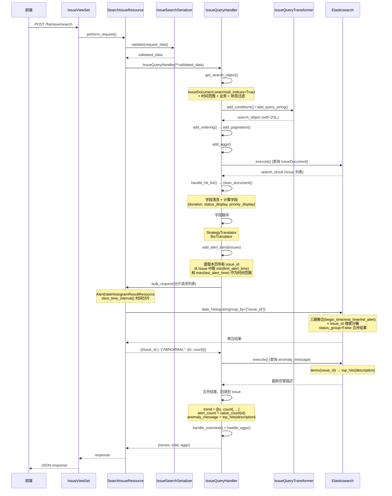

  # Issue 列表接口设计文档

> **关联文档**：[Issues 模块技术设计.md](./Issues%20模块技术设计.md)

---

## 1. 整体架构

Issue 列表查询采用三层架构：

```
┌──────────────┐      ┌──────────────────┐      ┌────────────────────┐
│   ViewSet    │ ──→  │    Resource       │ ──→  │    QueryHandler    │
│  (路由注册)   │      │  (参数校验+编排)   │      │  (ES 查询+数据清洗) │
└──────────────┘      └──────────────────┘      └────────────────────┘
```

| 层次 | 模块 |
|------|------|
| **ViewSet** | `IssueViewSet` in `fta_web/issue/views.py` |
| **Resource** | `SearchIssueResource` in `fta_web/issue/resources.py` |
| **Handler** | `IssueQueryHandler` in `fta_web/issue/handlers/issue.py` |
| **Transformer** | `IssueQueryTransformer` in `fta_web/issue/handlers/issue.py` |

---

## 2. 文件组织

```
bkmonitor/packages/fta_web/
├── issue/                              ← 新建模块
│   ├── __init__.py
│   ├── handlers/
│   │   ├── __init__.py
│   │   └── issue.py                   # IssueQueryTransformer + IssueQueryHandler
│   ├── resources.py                   # SearchIssueResource / IssueDetailResource / IssueTopNResource 等
│   ├── urls.py                        # URL 配置
│   └── views.py                       # IssueViewSet
```

**独立建模理由：**

1. Issue 是独立的业务实体，有自己的 Document（`IssueDocument`）、状态机、操作日志（`IssueActivityDocument`）
2. 独立模块便于维护和扩展，避免已有模块文件膨胀
3. 与 `alert/`、`action/`、`assign/` 保持一致的模块划分风格

---

## 3. 接口清单

### 3.1 第一阶段接口（列表 + 详情 + 操作）(本文档重点设计列表接口)

| 接口名 | Resource 类名 | HTTP | endpoint | 说明 |
|--------|--------------|------|----------|------|
| **Issue 列表** | `SearchIssueResource` | POST | `issue/search` | 分页查询、条件过滤、总览统计、高级筛选聚合 |
| **Issue 详情** | `IssueDetailResource` | GET | `issue/detail` | 按 ID 获取单个 Issue 完整信息 |
| **Issue TopN** | `IssueTopNResource` | POST | `issue/top_n` | 字段值 TOP N 统计（策略、负责人、优先级等） |
| **Issue 操作日志** | `ListIssueActivityResource` | POST | `issue/activity` | 分页查询 IssueActivityDocument |
| **Issue 指派** | `AssignIssueResource` | POST | `issue/assign` | 首次指派 / 改派 |
| **Issue 解决** | `ResolveIssueResource` | POST | `issue/resolve` | 标记已解决 |
| **Issue 归档** | `ArchiveIssueResource` | POST | `issue/archive` | 标记为归档 |
| **Issue 优先级** | `UpdateIssuePriorityResource` | POST | `issue/update_priority` | 修改优先级 |
| **Issue 评论** | `CommentIssueResource` | POST | `issue/comment` | 添加评论 |

---

## 4. 核心设计：IssueQueryHandler

### 4.1 继承关系

```
BaseQueryHandler (base.py)
  └── BaseBizQueryHandler (base.py)     ← 提供 bk_biz_ids 过滤、权限业务解析
        └── IssueQueryHandler
```

复用 `BaseBizQueryHandler` 提供的：
- `add_pagination()` — 分页
- `add_ordering()` — 排序
- `add_conditions()` — 条件过滤
- `add_query_string()` — query_string 搜索
- `top_n()` — TopN 聚合
- `handle_hit_list()` / `handle_hit()` — Hit 数据清洗

### 4.2 IssueQueryTransformer

```python
class IssueQueryTransformer(BaseQueryTransformer):
    """Issue ES 查询字段转换器"""

    VALUE_TRANSLATE_FIELDS = {
        "status": IssueStatus.CHOICES,
        "priority": IssuePriority.CHOICES,
    }
    doc_cls = IssueDocument

    query_fields = [
        QueryField("id", "Issue ID"),
        QueryField("name", "Issue 名称", agg_field="name.raw", is_char=True),
        QueryField("status", "状态"),
        QueryField("priority", "优先级"),
        QueryField("assignee", "负责人"),
        QueryField("strategy_id", "策略ID"),
        QueryField("strategy_name", "策略名称", agg_field="strategy_name.raw", is_char=True),
        QueryField("bk_biz_id", "业务ID"),
        QueryField("labels", "标签", is_char=True),
        QueryField("is_regression", "是否回归"),
        QueryField("alert_count", "告警数量"),
        QueryField("first_alert_time", "首次告警时间"),
        QueryField("last_alert_time", "最近告警时间"),
        QueryField("create_time", "创建时间"),
        QueryField("update_time", "更新时间"),
        QueryField("resolved_time", "解决时间"),
    ]
```

### 4.3 IssueQueryHandler 核心方法

```python
class IssueQueryHandler(BaseBizQueryHandler):
    query_transformer = IssueQueryTransformer

    MY_ISSUE_STATUS_NAME = "MY_ISSUE"          # 我负责的
    NO_ASSIGNEE_STATUS_NAME = "NO_ASSIGNEE"    # 未分派的
```

#### `__init__` 参数

| 参数 | 类型 | 说明 |
|------|------|------|
| `bk_biz_ids` | `list[int]` | 业务 ID 列表 |
| `username` | `str` | 当前用户名 |
| `status` | `list[str]` | 否 | 无 | **仅支持虚拟状态**过滤（`MY_ISSUE` / `NO_ASSIGNEE`）。实际状态过滤请使用 `conditions` 参数 |
| `start_time` | `int` | 开始时间 |
| `end_time` | `int` | 结束时间 |
| `ordering` | `list[str]` | 排序字段 |
| `query_string` | `str` | 搜索关键词 |
| `conditions` | `list[dict]` | 结构化过滤条件 |
| `page` / `page_size` | `int` | 分页参数 |

#### `get_search_object()` — 构建 ES 查询

> **设计决策**：API 层接收 `start_time` / `end_time`（与 Alert 模块保持一致），在 `get_search_object()` 内部
> 将 `end_time` 映射为 `create_time` 过滤、将 `start_time` 映射为 `resolved_time` 过滤。
> Serializer 不做任何字段重命名，转换逻辑完全内聚在 Handler 的 ES DSL 构建中。
>
> **不引入 `is_time_partitioned` / `is_finaly_partition` 参数**：Alert 模块使用这两个参数支持大时间范围的分片并行查询，
> 但 Issue 是聚合后的实体，数量级远小于 Alert，且使用 `all_indices=True` 全量索引查询，无需时间分片（YAGNI 原则）。

```
1. IssueDocument.search(all_indices=True)
   → Issue 跨天存在，使用全索引查询
2. 时间范围过滤（在 get_search_object() 内部完成 end_time → create_time、start_time → resolved_time 的映射）：
   → if end_time:  filter("range", create_time={"lte": end_time})
   → if start_time: filter(Q("range", resolved_time={"gte": start_time}) | ~Q("exists", field="resolved_time"))
   → 语义：create_time <= end_time AND (resolved_time >= start_time OR resolved_time IS NULL)
   → Issue 用 create_time + resolved_time 划定生命周期
   → resolved_time 为 NULL 的 Issue（pending_review / unresolved / archived）不受 start_time 约束，始终可见
3. 业务过滤：
   → filter("terms", bk_biz_id=bk_biz_ids)
4. 状态过滤：
   → MY_ISSUE → filter("term", assignee=request_username)
   → NO_ASSIGNEE → filter("term", assignee="") 或 must_not exists("assignee")
   → 其他直接按 status 精确匹配
```

##### `get_search_object()` 伪代码

```python
def get_search_object(self, start_time=None, end_time=None, **kwargs):
    start_time = start_time or self.start_time
    end_time = end_time or self.end_time

    # Issue 跨天存在，使用全量索引查询
    search_object = IssueDocument.search(all_indices=True)

    # 时间范围过滤：Issue 用 create_time + resolved_time 划定生命周期
    # API 接收的 end_time 用于过滤 create_time（Issue 创建时间不晚于 end_time）
    # API 接收的 start_time 用于过滤 resolved_time（Issue 解决时间不早于 start_time，或尚未解决）
    if end_time:
        search_object = search_object.filter("range", create_time={"lte": end_time})
    if start_time:
        search_object = search_object.filter(
            Q("range", resolved_time={"gte": start_time})
            | ~Q("exists", field="resolved_time")
        )

    # 业务过滤
    if self.bk_biz_ids:
        search_object = search_object.filter("terms", bk_biz_id=self.bk_biz_ids)

    # 状态过滤（含虚拟状态）
    if self.status:
        # ... MY_ISSUE / NO_ASSIGNEE / 实际状态
    
    return search_object
```

#### `search()` — 主查询入口

```
1. search_raw()
   → get_search_object() → add_conditions() → add_query_string() → add_ordering() → add_pagination()
→ [可选] add_aggs()
   → execute()
2. handle_hit_list() → 清洗数据
3. 字段翻译：
   → StrategyTranslator: strategy_id → strategy_name
   → BizTranslator: bk_biz_id → bk_biz_name
4. add_alert_trend() → 批量查询本页所有 Issue 的关联告警时间分布趋势
   → 从 Issue 中取 min(first_alert_time) / max(last_alert_time) 确定时间范围
   → 复用 AlertDateHistogramResultResource.bulk_request + slice_time_interval 时间分片并行查询
   → 内部调用 AlertQueryHandler.date_histogram(group_by=["issue_id"]) 获取 trend
   → 后台线程并行执行 value_count 聚合获取 alert_count，以及 top_hits 获取 anomaly_message
5. 组装返回: { issues, total, aggs? }
```

#### `add_aggs()` — 高级筛选聚合

```python
def add_aggs(self, search_object):
    # 优先级聚合
    search_object.aggs.bucket("priority", "terms", field="priority")
    # 状态聚合
    search_object.aggs.bucket("status", "terms", field="status")
    # 负责人聚合：使用 filters 聚合，只关心「我负责的」和「未分配」
    search_object.aggs.bucket("assignee", "filters", filters={
        "my_assignee": Q("term", assignee=self.request_username),
        "no_assignee": Q("term", assignee=""),
    })
    # 类型聚合（是否回归）
    search_object.aggs.bucket("is_regression", "terms", field="is_regression")
    return search_object
```

> **设计说明**：aggs 覆盖前端筛选面板的四个维度：
> - **priority**：优先级（P0/P1/P2）
> - **status**：状态（pending_review/unresolved/resolved/archived）
> - **assignee**：负责人（使用 `filters` 聚合，只返回「我负责的」和「未分配」两个命名桶，不枚举所有负责人）
> - **is_regression**：类型（true=回归问题，false=新问题）

返回结构示例：

```json
[
  {"id": "priority", "name": "优先级", "count": 128, "children": ["..."]},
  {"id": "status", "name": "状态", "count": 128, "children": ["..."]},
  {"id": "assignee", "name": "负责人", "count": 30, "children": [
    {"id": "my_assignee", "name": "我负责的", "count": 20},
    {"id": "no_assignee", "name": "未分配", "count": 10}
  ]},
  {"id": "is_regression", "name": "类型", "count": 128, "children": ["..."]}
]
```

#### `add_alert_trend()` — 批量查询关联告警趋势

> **设计目标**：为列表页返回的每个 Issue 附加关联告警的时间分布趋势（sparkline）、告警数量和异常信息。
> - **trend**：通过复用 `AlertQueryHandler.date_histogram(group_by=["issue_id"])` + `bulk_request` 时间分片并行查询获取
> - **alert_count**：通过 ES `value_count` 聚合统计 `AlertDocument.id` 字段得出（与 trend 独立查询）
> - **anomaly_message**：通过 ES `top_hits` 聚合获取最新告警的 description

##### 复用策略

**核心思路**：直接复用 `AlertQueryHandler.date_histogram()` 方法，通过 `group_by=["status", "issue_id"]` 参数实现按 Issue 分桶 + 告警状态区分，无需手动构建 ES 聚合 DSL。

**复用链路**（参考 `AlertDateHistogramResource` 的实现模式）：

```
add_alert_trend()
  → resource.alert.alert_date_histogram_result.bulk_request(分片请求列表)
    → AlertDateHistogramResultResource.perform_request()
      → AlertQueryHandler(**params).date_histogram(group_by=["status", "issue_id"])
        → 三路聚合（begin_time / end_time / init_alert）+ 滚动累加
        → 返回 {(("issue_id", id),): {"ABNORMAL": {ts: count}, "RECOVERED": {...}, "CLOSED": {...}}}
```

**复用的已有模块**：

| 复用项 | 来源 | 说明 |
|--------|------|------|
| `date_histogram()` | `AlertQueryHandler` | 三路聚合 + 滚动累加 + 时间对齐，完整的告警趋势计算引擎 |
| `bulk_request` | `AlertDateHistogramResultResource` | Resource 层的并行批量请求机制 |
| `slice_time_interval()` | `fta_web.alert.utils` | 智能时间分片：≥30d 按月分片，≥7d 按周分片，≥1d 按天分片，<1d 不分片 |
| `calculate_agg_interval()` | `BaseQueryHandler` | 自动计算聚合间隔：≤1h→1min, ≤6h→5min, ≤72h→1h, >72h→1天 |
| `_get_buckets()` | `AlertQueryHandler` | 递归解析多维度嵌套聚合结果 |
| `add_agg_bucket()` | `BaseQueryHandler` | 按字段添加 terms 聚合桶 |

##### 方法签名

```python
def add_alert_trend(self, issues: list[dict]) -> None:
    """
    批量查询 AlertDocument，为每个 Issue 填充 trend、alert_count 和 anomaly_message。

    参数:
        issues: search() 已清洗完成的 Issue 列表（会被原地修改）
    
    副作用:
        - 为每个 issue dict 添加 "trend" 字段: list[list[int, int]]（时间分布趋势）
        - 为每个 issue dict 覆盖 "alert_count" 字段: int（告警文档总数，通过 value_count 聚合得出）
        - 为每个 issue dict 添加 "anomaly_message" 字段: str（最新告警的 description，无值返回 "--"）
    """
```

##### 核心逻辑

```python
def add_alert_trend(self, issues: list[dict]) -> None:
    issue_ids = [issue["id"] for issue in issues]
    if not issue_ids:
        return

    # ── 1. 从本页 Issue 中提取告警时间边界 ──
    first_alert_times = [issue["first_alert_time"] for issue in issues if issue.get("first_alert_time")]
    last_alert_times = [issue["last_alert_time"] for issue in issues if issue.get("last_alert_time")]
    if not first_alert_times or not last_alert_times:
        for issue in issues:
            issue["trend"] = []
            issue["alert_count"] = 0
            issue["anomaly_message"] = "--"
        return

    start_time = min(first_alert_times)
    end_time = max(last_alert_times)
    interval = self.calculate_agg_interval(start_time, end_time)

    # ── 2. 启动后台线程并行查询 alert_count 和 anomaly_message ──
    fill_result = {"alert_count_map": {}, "anomaly_message_map": {}}
    fill_thread = threading.Thread(
        target=_fill_anomaly_message,
        args=(issue_ids, start_time, end_time, fill_result),
    )
    fill_thread.start()

    # ── 3. 查询告警趋势：复用 AlertDateHistogramResultResource ──
    # 参考 AlertDateHistogramResource.perform_request() 的实现模式：
    # - slice_time_interval() 将大时间跨度拆分为多个小分片
    # - 并行执行各分片的 date_histogram 查询
    # - conditions 注入 issue_id 过滤，group_by 按 issue_id 分桶
    results = resource.alert.alert_date_histogram_result.bulk_request(
        [
            {
                "start_time": sliced_start_time,
                "end_time": sliced_end_time,
                "interval": interval,
                "conditions": [
                    {"key": "issue_id", "value": issue_ids, "method": "eq"}
                ],
                "group_by": ["issue_id"],
            }
            for sliced_start_time, sliced_end_time in slice_time_interval(start_time, end_time)
        ]
    )
    # date_histogram(group_by=["issue_id"]) 返回结构（status_group=False 时的合并结果）：
    # {
    #     (("issue_id", "1741420800a3b7c9d2"),): {
    #         "ABNORMAL": {1741334400000: 13, 1741338000000: 12, ...},  # 合并后的时间序列
    #     },
    #     ...
    # }
    # 注：status_group=False 时，RECOVERED 和 CLOSED 已合并到 ABNORMAL 中，只返回一条序列

    # ── 4. 合并各时间分片的结果 ──
    merged = {}  # {issue_id: {ts: count}}
    for result in results:
        for dimension_tuple, status_series in result.items():
            # 从维度元组中提取 issue_id
            issue_id = None
            for key, value in dimension_tuple:
                if key == "issue_id":
                    issue_id = value
                    break
            if issue_id is None:
                continue

            if issue_id not in merged:
                merged[issue_id] = {}
            # status_group=False 时只返回 ABNORMAL 序列（已合并 RECOVERED 和 CLOSED）
            abnormal_series = status_series.get("ABNORMAL", {})
            merged[issue_id].update(abnormal_series)

    # ── 5. 等待后台线程完成 ──
    fill_thread.join()

    # ── 6. 解析结果，回填到 Issue 列表 ──
    for issue in issues:
        issue_id = issue["id"]
        if issue_id in merged:
            series = merged[issue_id]
            # 将时间序列转换为 [[ts_ms, count], ...] 格式
            issue["trend"] = sorted([[ts, count] for ts, count in series.items()])
        else:
            issue["trend"] = []

        # alert_count 由后台线程通过 value_count 聚合得出
        issue["anomaly_message"] = fill_result["anomaly_message_map"].get(issue_id, "--")
        issue["alert_count"] = fill_result["alert_count_map"].get(issue_id, 0)


def _fill_anomaly_message(issue_ids, start_time, end_time, fill_result):
    """后台线程：查询每个 Issue 最新告警的 description 和告警数量"""
    search_object = AlertDocument.search(start_time=start_time, end_time=end_time)
    search_object = search_object.filter("terms", issue_id=issue_ids)

    # 按 issue_id 分桶
    issue_agg = search_object.aggs.bucket(
        "issues", "terms", field="issue_id", size=len(issue_ids)
    )
    # 获取最新告警的 description
    issue_agg.metric(
        "latest_alert", "top_hits",
        size=1,
        sort=[{"begin_time": {"order": "desc"}}],
        _source=["description"],
    )
    # 统计每个 Issue 的告警文档数量
    issue_agg.metric("alert_count", "value_count", field="id")

    result = search_object[:0].execute()

    msg_map = {}
    count_map = {}
    for issue_bucket in result.aggs.issues.buckets:
        issue_id = issue_bucket.key
        
        # 解析 anomaly_message
        anomaly_message = "--"
        if hasattr(issue_bucket, "latest_alert") and issue_bucket.latest_alert:
            hits = issue_bucket.latest_alert.hits
            if hits and hits.hits and len(hits.hits) > 0:
                hit = hits.hits[0]
                description = getattr(hit, "description", "") or hit.to_dict().get("description", "")
                if description:
                    anomaly_message = description
        msg_map[issue_id] = anomaly_message

        # 解析 alert_count（通过 value_count 聚合得出）
        if hasattr(issue_bucket, "alert_count"):
            count_map[issue_id] = int(issue_bucket.alert_count.value or 0)

    fill_result["anomaly_message_map"] = msg_map
    fill_result["alert_count_map"] = count_map
```

##### `date_histogram(group_by=["issue_id"])` 内部执行流程

> `date_histogram` 方法内部会自动处理 `issue_id` 维度：
> - `issue_id` 作为普通维度字段，通过 `add_agg_bucket()` 在三路聚合的末尾追加 `terms` 聚合
> - `_get_buckets()` 递归解析嵌套聚合结果，展平为 `{((\"issue_id\", id),): BucketData}` 结构
> - 由于 `group_by` 不包含 `\"status\"`，`status_group=False`，最终结果会将 RECOVERED 和 CLOSED 合并到 ABNORMAL 中，只返回一条时间序列

```
三路聚合结构（由 date_histogram 自动构建）：

1. end_time 桶（已结束告警）
   └── date_histogram(end_time)
       └── terms(status)        ← 区分 RECOVERED / CLOSED（内部处理）
           └── terms(issue_id)  ← 按 Issue 分桶

2. begin_time 桶（新产生告警）
   └── date_histogram(begin_time)
       └── terms(issue_id)      ← 按 Issue 分桶

3. init_alert 桶（查询范围前的存量）
   └── terms(issue_id)          ← 按 Issue 分桶

→ 滚动累加：每个 issue_id 维度独立计算
  当前异常数 = 上一时刻异常数 + 新增异常 - 恢复 - 关闭

→ 最终合并（status_group=False）：
  ABNORMAL[ts] += RECOVERED[ts] + CLOSED[ts]
  只返回一条合并后的时间序列
```

##### 设计要点

| 要点 | 说明 |
|------|------|
| **直接复用 `date_histogram`** | 通过 `group_by=["issue_id"]` 参数，复用已有的三路聚合 + 滚动累加算法，零重复代码 |
| **时间分片并行查询** | 复用 `slice_time_interval()` + `bulk_request()` 模式（参考 `AlertDateHistogramResource`），将大时间跨度拆分为多个小分片并行查询，避免单次 ES 查询超时 |
| **不区分告警状态** | `group_by` 不包含 `"status"`，`date_histogram` 内部仍执行三路聚合，但最终将 RECOVERED 和 CLOSED 合并到 ABNORMAL，只返回一条时间序列 |
| **`alert_count` 通过 value_count 聚合获取** | `alert_count` 通过 ES `value_count` 聚合统计 `AlertDocument.id` 字段得出，与 `trend` 是独立的查询。使用后台线程并行执行，避免阻塞主查询 |
| **`anomaly_message` 通过 top_hits 获取** | 通过 ES `top_hits` 聚合获取最新告警的 `description` 字段，无值时返回 `"--"`。与 `alert_count` 在同一次 ES 请求中获取 |
| **覆盖 IssueDocument 的静态 `alert_count`** | `IssueDocument` 中有一个后端 processor 写入的静态 `alert_count`（全生命周期累计），列表页用动态聚合值覆盖，实时性更好 |
| **时间范围由 Issue 自身决定** | 趋势的时间范围取自本页所有 Issue 的 `min(first_alert_time)` 和 `max(last_alert_time)`，展示每个 Issue 完整生命周期内的告警分布 |
| **`conditions` 注入 `issue_id` 过滤** | 通过 `conditions=[{"key": "issue_id", "value": issue_ids, "method": "eq"}]` 限制只查本页 Issue 的告警 |
| **聚合粒度自动计算** | 复用 `BaseQueryHandler.calculate_agg_interval()` 方法：≤1h→1min, ≤6h→5min, ≤72h→1h, >72h→1天 |
| **后台线程并行优化** | `alert_count` 和 `anomaly_message` 的查询使用后台线程并行执行，与 `trend` 的 date_histogram 查询同时进行，减少总体响应时间 |

##### 与详情页趋势接口的对比

| 维度 | 列表页 `add_alert_trend()` | 详情页 `IssueDateHistogramResource` |
|------|---------------------------|-------------------------------------|
| **查询目标** | 批量（本页 N 个 Issue） | 单个 Issue |
| **聚合方式** | 复用 `date_histogram(group_by=["issue_id"])` | 复用 `date_histogram(group_by=["status"])` |
| **状态分组** | ❌ 不区分，只返回合并后的总数序列 | ✅ ABNORMAL / RECOVERED / CLOSED 三条序列 |
| **时间分片** | ✅ `slice_time_interval()` + `bulk_request()` 并行分片 | ✅ 同左（参考 `AlertDateHistogramResource`） |
| **时间范围** | 由 Issue 自身 `first_alert_time` / `last_alert_time` 决定 | 由请求参数 `start_time` / `end_time` 决定 |
| **返回格式** | `[[ts, count], ...]`（合并后的总数） | `{"series": [{"name": "ABNORMAL", "data": [...]}, ...]}` |
| **使用场景** | sparkline 小图 + alert_count 计数 | 堆叠柱状图，展示告警状态随时间变化 |
| **ES 查询次数** | 按时间分片并行（通常 1~4 次） | 同左 |

---

#### `clean_document()` — 数据清洗

```python
@classmethod
def clean_document(cls, doc: IssueDocument) -> dict:
    data = doc.to_dict()
    cleaned = {}
    # 固定字段（由 query_fields 驱动）
    for field in cls.query_transformer.query_fields:
        cleaned[field.field] = field.get_value_by_es_field(data)
    # 额外计算字段
    cleaned["duration"] = hms_string(计算 Issue 存活时长)
    cleaned["status_display"] = IssueStatus.CHOICES 中文映射
    cleaned["priority_display"] = IssuePriority.CHOICES 中文映射
    # impact_scope 添加 display_name 字段后返回
    impact_scope = data.get("impact_scope", {})
    cleaned["impact_scope"] = enrich_impact_scope(impact_scope)
    cleaned["aggregate_config"] = data.get("aggregate_config", {})
    return cleaned
```

清洗要点：
- `duration`：Issue 存活时长 = now - create_time（未解决）或 resolved_time - create_time（已解决）
- `status_display` / `priority_display`：枚举值的中文映射
- `impact_scope`：添加 `display_name` 字段后返回（由 `enrich_impact_scope()` 函数处理）
- `aggregate_config`：Issue 特有的 Object 字段直接透传

---

## 5. Serializer 层设计

### 5.1 继承关系与复用策略

```
BaseSearchSerializer (fta_web/alert/serializers.py)    ← 已有，提供 bk_biz_ids / space_uids 通用字段
  └── IssueSearchSerializer (fta_web/issue/serializers.py)  ← 新增
        └── SearchIssueResource.RequestSerializer           ← 新增（内嵌于 Resource）
```

**复用 `BaseSearchSerializer` 而非重新定义**：
- `BaseSearchSerializer` 提供 `bk_biz_ids` 通用字段，该 Serializer 是业务无关的通用基类
- 位于 `fta_web/alert/serializers.py`，Issue 模块直接导入复用

**复用 `SearchConditionSerializer`**：
- `SearchConditionSerializer` 定义了 `key` / `value` / `method` / `condition` 四个字段，是通用的结构化过滤条件序列化器
- Issue 的条件过滤语义与 Alert 完全一致（eq / neq / include / exclude / gt / gte / lt / lte），无需重新定义

### 5.2 IssueSearchSerializer

```python
from fta_web.alert.serializers import BaseSearchSerializer, SearchConditionSerializer

class IssueSearchSerializer(BaseSearchSerializer):
    """Issue 搜索基础序列化器，提供 Issue 列表查询的通用请求字段"""
    status = serializers.ListField(
        label="状态", required=False, child=serializers.CharField(),
        help_text="支持实际状态值和虚拟状态: MY_ISSUE(我负责的) / NO_ASSIGNEE(未分派)"
    )
    conditions = SearchConditionSerializer(label="搜索条件", many=True, default=[])
    query_string = serializers.CharField(label="查询字符串", default="", allow_blank=True)
    start_time = serializers.IntegerField(label="开始时间", required=False)
    end_time = serializers.IntegerField(label="结束时间", required=False)
```

#### 字段说明

| 字段 | 类型 | 必填 | 默认值 | 说明 |
|------|------|------|--------|------|
| `bk_biz_ids` | `list[int]` | 否 | `None` | 业务 ID 列表，为空时查询当前用户相关的所有 Issue |
| `status` | `list[str]` | 否 | 无 | **仅支持虚拟状态**过滤（`MY_ISSUE` / `NO_ASSIGNEE`）。实际状态过滤请使用 `conditions` 参数 |
| `conditions` | `list[dict]` | 否 | `[]` | 结构化过滤条件，每个条件包含 `key`、`value`、`method`、`condition` 四个字段 |
| `query_string` | `str` | 否 | `\"\"` | 搜索关键词，支持 Elasticsearch query_string 语法 |
| `start_time` | `int` | 否 | 无 | 新增 | 时间范围起点（秒级时间戳）。不传则不做时间过滤 |
| `end_time` | `int` | 否 | 无 | 新增 | 时间范围终点（秒级时间戳）。不传则不做时间过滤 |

> **与 `AlertSearchSerializer` 的关键差异**：`start_time` 和 `end_time` 为可选字段（`required=False`），
> 因为 Issue 是长期存在的实体，用户常见场景是查看"所有活跃 Issue"而不限定时间范围。
> Alert 场景中时间范围为必填，因为告警数据量大，不限定时间范围会导致查询超时。

#### conditions 条件格式（复用 SearchConditionSerializer）

```json
{
  "key": "priority",
  "value": ["P0", "P1"],
  "method": "eq",
  "condition": "and"
}
```

| 字段 | 类型 | 说明 |
|------|------|------|
| `key` | `str` | 匹配字段名，支持 `IssueQueryTransformer.query_fields` 中定义的所有字段 |
| `value` | `list` | 匹配值列表 |
| `method` | `str` | 匹配方法：`eq`（精确匹配）/ `neq`（不等于）/ `include`（模糊包含）/ `exclude`（模糊排除）/ `gt` / `gte` / `lt` / `lte`（范围比较） |
| `condition` | `str` | 复合条件：`and` / `or` / `""`（空字符串，默认） |

---

## 6. Resource 层设计

### 6.1 SearchIssueResource

```python
class SearchIssueResource(Resource):
    """查询 Issue 列表"""

class RequestSerializer(IssueSearchSerializer):
        ordering = serializers.ListField(label="排序", child=serializers.CharField(), default=[])
        page = serializers.IntegerField(label="页数", min_value=1, default=1)
        page_size = serializers.IntegerField(label="每页大小", min_value=0, max_value=500, default=10)
        show_aggs = serializers.BooleanField(label="展示聚合统计信息", default=True)
        show_dsl = serializers.BooleanField(label="返回ES DSL查询语句", default=False)

def perform_request(self, validated_request_data):
        show_aggs = validated_request_data.pop("show_aggs")
        show_dsl = validated_request_data.pop("show_dsl")
        handler = IssueQueryHandler(**validated_request_data)
        result = handler.search(show_aggs=show_aggs)
        
        # 如果需要返回 ES DSL 查询语句（用于调试）
        if show_dsl:
            result["dsl"] = handler.get_search_object().to_dict()
        
        return result
```

#### RequestSerializer 完整字段一览

| 字段 | 类型 | 必填 | 默认值 | 说明 |
|------|------|------|--------|------|
| `bk_biz_ids` | `list[int]` | 否 | `None` | 业务 ID 列表 |
| `status` | `list[str]` | 否 | 无 | 状态过滤 |
| `conditions` | `list[dict]` | 否 | `[]` | 结构化过滤条件 |
| `query_string` | `str` | 否 | `\"\"` | 查询字符串 |
| `start_time` | `int` | 否 | 无 | 时间范围起点 |
| `end_time` | `int` | 否 | 无 | 时间范围终点 |
| `ordering` | `list[str]` | 否 | `[]` | 排序字段列表，前缀 `-` 为倒序 |
| `page` | `int` | 否 | `1` | 页码，最小值 1 |
| `page_size` | `int` | 否 | `10` | 每页大小，最大 500 |
| `show_aggs` | `bool` | 否 | `true` | 是否返回 aggs 高级筛选聚合 |
| `show_dsl` | `bool` | 否 | `false` | 是否返回 ES DSL 查询语句（用于调试） |

#### 请求示例

```json
{
  "bk_biz_ids": [2],
  "status": ["NO_ASSIGNEE"],
  "conditions": [
    {"key": "priority", "value": ["P0", "P1"], "method": "eq", "condition": ""}
  ],
  "query_string": "CPU",
  "start_time": 1741334400,
  "end_time": 1741420800,
  "ordering": ["-update_time"],
  "page": 1,
  "page_size": 20,
  "show_aggs": true,
  "show_dsl": false
}
```

### 6.2 返回值结构

```json
{
  "issues": [
    {
      "id": "1741420800a3b7c9d2",
      "name": "主机 CPU 使用率过高",
      "status": "unresolved",
      "status_display": "未解决",
      "priority": "P0",
      "priority_display": "高",
      "assignee": ["zhangsan"],
      "is_regression": false,
      "strategy_id": "1001",
      "strategy_name": "主机 CPU 使用率过高",
      "bk_biz_id": "2",
      "bk_biz_name": "蓝鲸",
      "labels": ["主机监控", "基础设施"],
      "alert_count": 15,
      "anomaly_message": "主机 10.0.0.1 CPU 使用率达到 95%，超过阈值 80%",
      "trend": [
        [1741334400000, 3],
        [1741348800000, 5],
        [1741363200000, 2],
        [1741377600000, 0],
        [1741392000000, 4],
        [1741406400000, 1]
      ],
      "first_alert_time": 1741420790,
      "last_alert_time": 1741507200,
      "create_time": 1741420800,
      "update_time": 1741510000,
"resolved_time": null,
      "is_resolved": false,
      "duration": "1d 1h",
"impact_scope": {
        "host": {
          "count": 2,
          "instance_list": [
            {"bk_host_id": 1001, "display_name": "10.0.0.1"},
            {"bk_host_id": 1002, "display_name": "10.0.0.2"}
          ],
          "link_tpl": "/performance/detail/{bk_host_id}"
        },
        "service_instances": {
          "count": 3,
          "instance_list": [
            {"bk_service_instance_id": 2001, "display_name": "service-instance-1"},
            {"bk_service_instance_id": 2002, "display_name": "service-instance-2"},
            {"bk_service_instance_id": 2003, "display_name": "service-instance-3"}
          ],
          "link_tpl": null
        }
      },
      "aggregate_config": {"aggregate_dimensions": ["bk_target_ip"], "conditions": [], "alert_levels": [1, 2]}
    }
  ],
"total": 128,
  "aggs": [
    {
      "id": "priority",
      "name": "优先级",
      "count": 128,
      "children": [
        {"id": "P0", "name": "高", "count": 15},
        {"id": "P1", "name": "中", "count": 53},
        {"id": "P2", "name": "低", "count": 60}
      ]
    },
    {
      "id": "status",
      "name": "状态",
      "count": 128,
      "children": [
        {"id": "pending_review", "name": "待审核", "count": 30},
        {"id": "unresolved", "name": "未解决", "count": 12},
        {"id": "resolved", "name": "已解决", "count": 80},
        {"id": "archived", "name": "归档", "count": 6}
      ]
    },
    {
      "id": "assignee",
      "name": "负责人",
      "count": 30,
      "children": [
        {"id": "my_assignee", "name": "我负责的", "count": 20},
        {"id": "no_assignee", "name": "未分配", "count": 10}
      ]
    },
    {
      "id": "is_regression",
      "name": "类型",
      "count": 128,
      "children": [
        {"id": "true", "name": "回归问题", "count": 8},
        {"id": "false", "name": "新问题", "count": 120}
      ]
    }
  ]
}
```

#### 返回值字段说明

| 字段 | 类型 | 说明 |
|------|------|------|
| `issues` | `list[dict]` | Issue 列表，每项包含 ES 字段 + 计算字段 |
| `total` | `int` | 满足查询条件的 Issue 总数（由 ES `hits.total.value` 提供） |
| `aggs` | `list[dict]` | 高级筛选聚合（仅 `show_aggs=true` 时返回） |
| `dsl` | `dict` | ES DSL 查询语句（仅 `show_dsl=true` 时返回，用于调试） |

#### Issue 单项字段说明

| 字段 | 类型 | 来源 | 说明 |
|------|------|------|------|
| `id` | `str` | ES 字段 | Issue 唯一标识（前10位为秒级时间戳 + 8位UUID hex） |
| `name` | `str` | ES 字段 | Issue 名称（回归问题带 `[回归]` 前缀） |
| `status` | `str` | ES 字段 | 状态：`pending_review` / `unresolved` / `resolved` / `archived` |
| `status_display` | `str` | 计算字段 | 状态中文名：待审核 / 未解决 / 已解决 / 归档 |
| `priority` | `str` | ES 字段 | 优先级：`P0` / `P1` / `P2` |
| `priority_display` | `str` | 计算字段 | 优先级中文名：高 / 中 / 低 |
| `assignee` | `list[str]` | ES 字段 | 负责人用户名列表（空数组表示未指派） |
| `is_regression` | `bool` | ES 字段 | 是否为回归 Issue |
| `strategy_id` | `str` | ES 字段 | 关联的告警策略 ID（Keyword 类型，字符串） |
| `strategy_name` | `str` | 翻译字段 | 策略名称（由 `StrategyTranslator` 翻译） |
| `bk_biz_id` | `str` | ES 字段 | 所属业务 ID（Keyword 类型，字符串） |
| `bk_biz_name` | `str` | 翻译字段 | 业务名称（由 `BizTranslator` 翻译） |
| `labels` | `list[str]` | ES 字段 | 标签列表 |
| `alert_count` | `int` | 动态计算 | Issue 在时间范围内的关联告警文档总数，通过 ES `value_count` 聚合统计 `AlertDocument.id` 字段得出。由 `add_alert_trend()` 在后台线程并行查询，覆盖 `IssueDocument` 中的静态累计值 |
| `anomaly_message` | `str` | 动态计算 | 异常信息，从关联告警的 `description` 字段获取。若无关联告警或 description 为空，返回 `"--"` |
| `trend` | `list[list[int, int]]` | 动态计算 | 关联告警的时间分布趋势（sparkline 数据），格式为 `[[timestamp_ms, count], ...]`。时间范围由 Issue 自身的 `first_alert_time` / `last_alert_time` 决定，基于 `AlertDocument.begin_time` 聚合 |
| `first_alert_time` | `int` | ES 字段 | 首条关联告警时间（秒级时间戳） |
| `last_alert_time` | `int` | ES 字段 | 最近一条关联告警时间（秒级时间戳） |
| `create_time` | `int` | ES 字段 | Issue 创建时间（秒级时间戳） |
| `update_time` | `int` | ES 字段 | 最近更新时间（秒级时间戳） |
| `resolved_time` | `int \| null` | ES 字段 | 解决时间（仅已解决状态有值，其余为 `null`） |
| `is_resolved` | `bool` | 计算字段 | 是否已解决，根据 `resolved_time` 是否有值计算：有值则为 `true`，否则为 `false` |
| `duration` | `str` | 计算字段 | 存活时长（人类可读格式，如 `"1d 1h"`） |
| `impact_scope` | `dict` | ES 字段 | 影响范围快照，支持多维度（set/host/service_instances/cluster/node/service/pod/app/apm_service），见下方结构说明 |
| `aggregate_config` | `dict` | ES 字段 | 聚合配置快照（创建时固化，包含 `aggregate_dimensions` / `conditions` / `alert_levels`） |

#### impact_scope 结构说明

```json
{
  "set": {
    "count": 2,
    "display_name": "集群",
    "instance_list": [
      {"set_id": 123, "display_name": "蓝鲸/生产环境"},
      {"set_id": 456, "display_name": "蓝鲸/测试环境"}
    ],
    "link_tpl": null
  },
  "host": {
    "count": 3,
    "display_name": "主机",
    "instance_list": [
      {"bk_host_id": 1001, "display_name": "10.0.0.1"},
      {"bk_host_id": 1002, "display_name": "10.0.0.2"}
    ],
    "link_tpl": "/performance/detail/{bk_host_id}"
  },
  "service_instances": {
    "count": 5,
    "display_name": "服务实例",
    "instance_list": [
      {"bk_service_instance_id": 2001, "display_name": "api-service-1"}
    ],
    "link_tpl": null
  },
  "cluster": {
    "count": 1,
    "display_name": "bcs集群",
    "instance_list": [
      {"bcs_cluster_id": "BCS-K8S-12345", "display_name": "生产集群"}
    ],
    "link_tpl": "/k8s?filter-bcs_cluster_id={bcs_cluster_id}&sceneId=kubernetes&sceneType=overview"
  },
  "node": {
    "count": 2,
    "display_name": "node",
    "instance_list": [
      {"bcs_cluster_id": "BCS-K8S-12345", "node": "node-1", "display_name": "BCS-K8S-12345/node-1"}
    ],
    "link_tpl": "/k8s?filter-bcs_cluster_id={bcs_cluster_id}&filter-node_name={node}&dashboardId=node&sceneId=kubernetes&sceneType=detail"
  },
  "service": {
    "count": 3,
    "display_name": "service",
    "instance_list": [
      {"bcs_cluster_id": "BCS-K8S-12345", "service": "nginx", "display_name": "BCS-K8S-12345/nginx"}
    ],
    "link_tpl": "/k8s?filter-bcs_cluster_id={bcs_cluster_id}&filter-service_name={service}&dashboardId=service&sceneId=kubernetes&sceneType=detail"
  },
  "pod": {
    "count": 10,
    "display_name": "pod",
    "instance_list": [
      {"bcs_cluster_id": "BCS-K8S-12345", "pod": "nginx-abc123", "display_name": "BCS-K8S-12345/nginx-abc123"}
    ],
    "link_tpl": "/k8s?filter-bcs_cluster_id={bcs_cluster_id}&filter-pod_name={pod}&dashboardId=pod&sceneId=kubernetes&sceneType=detail"
  },
  "app": {
    "count": 1,
    "display_name": "app",
    "instance_list": [
      {"app_name": "my-app", "bk_biz_id": 2, "display_name": "my-app"}
    ],
    "link_tpl": "?bizId={bk_biz_id}#/apm/application?filter-app_name={app_name}"
  },
  "apm_service": {
    "count": 2,
    "display_name": "apm_service",
    "instance_list": [
      {"app_name": "my-app", "service_name": "order-service", "bk_biz_id": 2, "display_name": "my-app/order-service"}
    ],
    "link_tpl": "?bizId={bk_biz_id}#/apm/service?filter-app_name={app_name}&filter-service_name={service_name}"
  }
}
```

#### 维度说明

| 维度 key | 展示名称 | 说明 | instance_list 元素字段 |
|----------|----------|------|------------------------|
| `set` | 集群 | CMDB 集群 | `set_id`, `display_name` |
| `host` | 主机 | 主机 | `bk_host_id`, `display_name` |
| `service_instances` | 服务实例 | 服务实例 | `bk_service_instance_id`, `display_name` |
| `cluster` | bcs集群 | K8S 集群（多集群时） | `bcs_cluster_id`, `display_name` |
| `node` | node | K8S 节点（单集群时） | `bcs_cluster_id`, `node`, `display_name` |
| `service` | service | K8S Service（单集群时） | `bcs_cluster_id`, `service`, `display_name` |
| `pod` | pod | K8S Pod（单集群时） | `bcs_cluster_id`, `pod`, `display_name` |
| `app` | app | APM 应用（多应用时） | `app_name`, `bk_biz_id`, `display_name` |
| `apm_service` | apm_service | APM 服务（单应用时） | `app_name`, `service_name`, `bk_biz_id`, `display_name` |

#### 通用字段说明

| 字段 | 类型 | 说明 |
|------|------|------|
| `count` | `int` | 该维度受影响实例总数（去重后） |
| `display_name` | `string` | 维度的中文展示名称，由 `ImpactScopeDimension` 枚举提供 |
| `instance_list` | `object[]` | 实例列表，最多 50 条 |
| `link_tpl` | `string \| null` | 前端跳转链接模板，支持占位符替换 |

#### 前端渲染说明

**`display_name` 字段用于影响范围列的展示**：前端在设计稿"影响范围"列中展示的"集群"、"主机"、"服务实例"等中文名称，直接使用 `display_name` 字段的值。

**设计稿对应示例**：

```
┌─────────────────────────────┐
│       影响范围                │
├─────────────────────────────┤
│  集群: 100                   │  ← display_name="集群", count=100
│  主机: 124                   │  ← display_name="主机", count=124
├─────────────────────────────┤
│  集群: 100                   │  ← display_name="集群"
│  node: 22                    │  ← display_name="node"
│  pod: 30                     │  ← display_name="pod"
└─────────────────────────────┘
```

**前端渲染逻辑**：
1. 遍历 `impact_scope` 对象的每个维度 key（如 `host`、`set`、`cluster` 等）
2. 使用维度数据中的 `display_name` 作为展示名称，`count` 作为数量
3. 按固定顺序展示：`set` > `host` > `service_instances` > `cluster` > `node` > `service` > `pod` > `app` > `apm_service`

> **说明**：
> - 每个维度都是可选的，仅当存在对应类型的影响范围时才返回
> - `cluster`/`node`/`service`/`pod` 互斥：多集群时返回 `cluster`，单集群时返回 `node`/`service`/`pod`
> - `app`/`apm_service` 互斥：多应用时返回 `app`，单应用时返回 `apm_service`
> - 若 Issue 无任何影响范围信息，`impact_scope` 为空字典 `{}`

> **overview 统计说明**：`count` 为搜索结果总数，`children` 中的 `MY_ISSUE` 和 `NO_ASSIGNEE` 是交叉维度统计（一个 Issue 可能同时属于"我负责的"和"未分派"），
> 因此各子项计数之和可能大于 `count`。实际的互斥状态统计由 `pending_review` + `unresolved` + `resolved` + `archived` 四项覆盖。


## 7. 调用流程图



---

## 8. 默认排序策略

```python
# IssueQueryHandler.__init__
if not self.ordering:
    self.ordering = ["status", "-update_time"]
```

排序语义：
1. **状态优先**：活跃 Issue（pending_review / unresolved）排在前面
2. **最近更新**：同状态下按 update_time 倒序

---

## 9. 设计合理性评估

### 9.1 已确认的设计要点

| 评估项 | 结论 | 说明 |
|--------|------|------|
| **`start_time` / `end_time` 可选** | ✅ 合理 | Issue 是长期存在的实体，常见场景是查看全部活跃 Issue。不传时间时 `get_search_object()` 跳过时间范围过滤 |
| **字段类型一致性** | ✅ 已校验 | `strategy_id`、`bk_biz_id` 在 `IssueDocument` 中均为 `field.Keyword()`（字符串类型），返回值示例中类型正确 |
| **优先级枚举值** | ✅ 正确 | `IssuePriority.CHOICES`: P0→高, P1→中, P2→低，返回值中 `priority: "P0"` / `priority_display: "高"` 对应正确 |
| **状态枚举值** | ✅ 正确 | `IssueStatus.CHOICES`: pending_review→待审核, unresolved→未解决, resolved→已解决, archived→归档 |
| **`IssueDocument.search(all_indices=True)`** | ✅ 合理 | Issue 跨天存在，不能像 Alert 按时间分片查询，必须查全量索引 |
| **`SearchConditionSerializer` 复用** | ✅ 合理 | 条件过滤语义完全一致，无需重新定义 |
| **`BaseSearchSerializer` 复用** | ✅ 合理 | `bk_biz_ids` / `space_uids` 转换逻辑通用，直接继承 |
| **`IssueIDField` 校验逻辑** | ✅ 合理 | 复用 `IssueDocument.parse_timestamp_by_id()` 校验 ID 前10位为合法时间戳 |
| **不引入 `is_time_partitioned` / `is_finaly_partition`** | ✅ 已确认 | Issue 是聚合后的实体，数量级远小于 Alert，使用 `all_indices=True` 全量索引查询，无需 Alert 模块的时间分片并行查询机制（YAGNI 原则） |
| **`archived` 状态穿透时间过滤** | ✅ 可接受 | `archived` 状态的 Issue 没有 `resolved_time`（仅 `resolved` 状态写入），因此 `resolved_time IS NULL` 会放行 `archived` Issue。前端可通过 `status` 过滤排除，不影响主要使用场景 |
| **时间过滤转换逻辑位于 `get_search_object()`** | ✅ 已确认 | Serializer 保持原样接收 `start_time` / `end_time`（与 Alert 模块接口一致），在 `IssueQueryHandler.get_search_object()` 内部完成到 `create_time` / `resolved_time` 的映射，保持转换逻辑与 ES DSL 构建的内聚性 |

### 9.2 需注意的实现细节

| 细节 | 说明 |
|------|------|
| **`resolved_time` 可能为 null** | `clean_document()` 中 `resolved_time` 字段在未解决/待审核/拒绝状态下为 `null`，`duration` 计算时需判空：未解决取 `now - create_time`，已解决取 `resolved_time - create_time` |
| **`archived` 状态无 `resolved_time`** | `IssueDocument.archive()` 方法不写入 `resolved_time`（仅更新 `status` 和 `update_time`），因此 `resolved_time IS NULL` 包含三种状态：`pending_review`、`unresolved`、`archived`。时间过滤中 `~Q("exists", field="resolved_time")` 会放行这三种状态的 Issue，已确认这是可接受的行为 |
| **`add_biz_condition` 需简化** | Issue 的业务过滤直接使用 `bk_biz_id`（顶层 Keyword 字段），无需像 Alert 那样查 `event.bk_biz_id`（嵌套路径），`IssueQueryHandler` 需覆写 `add_biz_condition` 方法 |
| **`status` 字段排序需自定义** | `ordering=["status"]` 在 ES 中默认按字母序排序，但期望活跃状态排前面。需要在 `add_ordering()` 中对 status 字段使用 ES script-based sorting 或在 `IssueQueryTransformer` 中配置 status 排序映射 |
| **搜索历史功能** | 第一阶段不实现 `record_history`，如后续需要可参照 `SearchAlertResource` 的 `SearchHistory.record()` 模式 |
| **`alert_count` 静态值 vs 动态值** | `IssueDocument` 中有后端 processor 写入的静态 `alert_count`（全生命周期累计），`clean_document()` 会先从 ES 取到这个静态值，随后 `add_alert_trend()` 用动态聚合值覆盖。动态值通过 ES `value_count` 聚合实时计算，比静态值更可靠 |
| **趋势时间范围取自 Issue 自身** | `add_alert_trend()` 从本页 Issue 中取 `min(first_alert_time)` 和 `max(last_alert_time)` 作为查询范围。如果本页所有 Issue 都没有 `first_alert_time`（理论上不应出现），则跳过趋势查询，直接填充空 trend 和 `alert_count=0` |
| **`begin_time` vs `create_time` 语义** | `AlertDocument.begin_time` 是告警实际触发时间，`create_time` 是服务器写入时间。趋势图和时间范围过滤均使用 `begin_time`，与 `issue_processor` 中 `first_alert_time = alert.begin_time` 的写入逻辑保持一致 |
| **`AlertDocument.issue_id` 索引** | 趋势聚合依赖 `AlertDocument.issue_id` 字段（`field.Keyword()`），确保该字段已建立倒排索引，`terms` 聚合才能高效执行 |

---

## 10. 开发任务拆解建议

| Task | 内容 | 依赖 |
|------|------|------|
| **Task A** | 创建 `fta_web/issue/` 模块骨架（`__init__.py` / `urls.py` / `views.py`） | 无 |
| **Task B** | `IssueQueryTransformer` + `IssueQueryHandler`（handlers/issue.py） | 依赖 `IssueDocument`（已完成） |
| **Task B-1** | `IssueQueryHandler.add_alert_trend()` 方法（trend 复用 `date_histogram(group_by=["issue_id"])` + alert_count 使用 `value_count` 聚合 + anomaly_message 使用 `top_hits` 聚合，后台线程并行优化） | Task B + `AlertDocument.issue_id` 字段（已完成） |
| **Task C** | `IssueSearchSerializer` + `IssueIDField`（serializers.py） | 无 |
| **Task D** | `SearchIssueResource` / `IssueDetailResource` / `IssueTopNResource`（resources.py） | Task B + B-1 + C |
| **Task E** | `IssueViewSet` 路由注册 + 权限校验 | Task D |
| **Task F** | 操作类 Resource：`AssignIssueResource` / `ResolveIssueResource` / `ArchiveIssueResource` / `UpdateIssuePriorityResource` / `CommentIssueResource` | Task E + IssueDocument 状态机方法（已完成） |
| **Task G** | `ListIssueActivityResource`（操作日志查询） | Task E |

---

## 11. ImpactScopeDimension 枚举设计

`ImpactScopeDimension` 枚举用于定义 `impact_scope` 中各维度的中文展示名称，在接口层为每个维度添加 `display_name` 字段。

### 11.1 枚举定义

**文件位置**: `bkmonitor/constants/issue.py`

```python
class ImpactScopeDimension:
    """影响范围维度枚举"""

    SET = "set"
    HOST = "host"
    SERVICE_INSTANCES = "service_instances"
    CLUSTER = "cluster"
    NODE = "node"
    SERVICE = "service"
    POD = "pod"
    APP = "app"
    APM_SERVICE = "apm_service"

    CHOICES = (
        (SET, "集群"),
        (HOST, "主机"),
        (SERVICE_INSTANCES, "服务实例"),
        (CLUSTER, "bcs集群"),
        (NODE, "node"),
        (SERVICE, "service"),
        (POD, "pod"),
        (APP, "app"),
        (APM_SERVICE, "apm_service"),
    )

    @classmethod
    def get_display_name(cls, dimension: str) -> str:
        """获取维度的展示名称，未匹配时返回原维度值"""
        return dict(cls.CHOICES).get(dimension, dimension)
```

### 11.2 维度与展示名称映射

| 维度 key | 展示名称 |
|----------|----------|
| `set` | 集群 |
| `host` | 主机 |
| `service_instances` | 服务实例 |
| `cluster` | bcs集群 |
| `node` | node |
| `service` | service |
| `pod` | pod |
| `app` | app |
| `apm_service` | apm_service |

### 11.3 接口层使用

在 `SearchIssueResource` 或 `IssueQueryHandler` 的响应处理中，遍历 `impact_scope`，为每个维度添加 `display_name` 字段：

```python
from bkmonitor.constants.issue import ImpactScopeDimension

def enrich_impact_scope(impact_scope: dict) -> dict:
    """丰富 impact_scope 数据：为每个维度添加 display_name，为每个实例渲染 alert_query_fields"""
    for dimension_key, dimension_data in impact_scope.items():
        dimension_data["display_name"] = ImpactScopeDimension.get_display_name(dimension_key)
    return impact_scope
```
