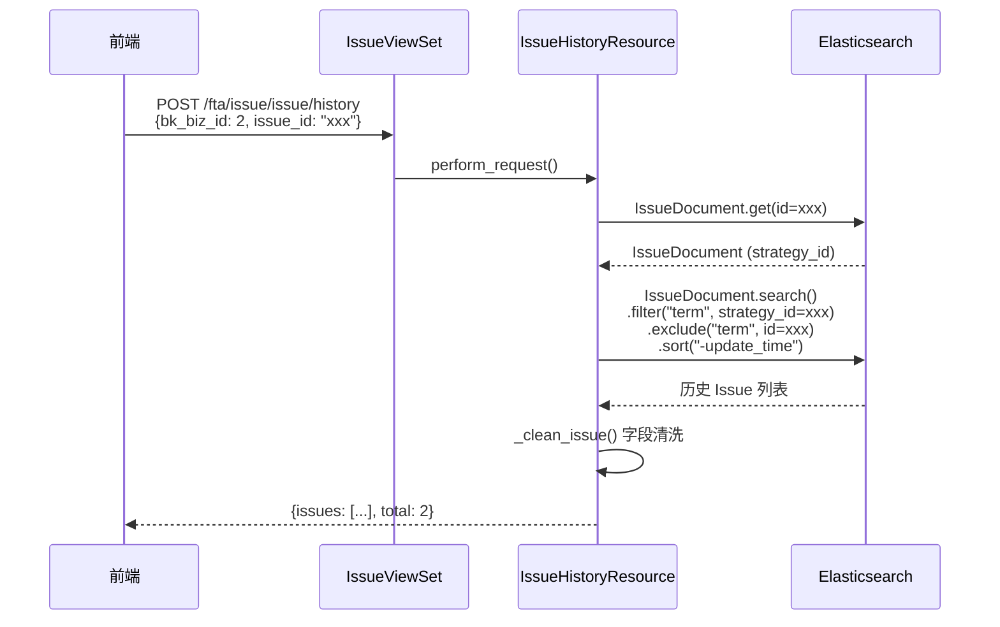

# Issue 历史接口设计文档

> **关联文档**：[Issues详情接口设计.md](Issues详情接口设计.md) | [Issue详情接口文档.md](../api/Issue详情接口文档.md)

---

## 1. 接口说明

对应设计稿模块：**历史 Issue**             

接口地址：`POST /fta/issue/issue/history`

展示与当前 Issue **同策略**的历史 Issue 列表（不包含当前 Issue 自身），帮助用户了解该策略的历史告警情况。属于第二阶段懒加载请求，用户手动点击历史 Issue 区域时触发。

**设计稿展示**：

```
历史 Issue
──────────
🔗 异常登录日志告警        15s ago
🔗 异常登录日志告警        8months ago
```

---

## 2. IssueHistoryResource

```python
class IssueHistoryResource(Resource):
    """
    查询与指定 Issue 同策略的历史 Issue 列表

    查询逻辑：
    1. 获取目标 Issue 的 strategy_id
    2. 查询同 strategy_id 的所有 Issue（排除当前 Issue）
    3. 按 update_time 倒序排列，返回分页结果
    4. 清洗字段（status_display / priority_display / duration 等计算字段）
    """

    class RequestSerializer(serializers.Serializer):
        bk_biz_id = serializers.IntegerField(label="业务ID", required=True)
        issue_id = IssueIDField(label="Issue ID")
        page = serializers.IntegerField(label="页数", min_value=1, default=1)
        page_size = serializers.IntegerField(label="每页大小", min_value=1, max_value=50, default=10)

    def perform_request(self, validated_request_data):
        issue_id = validated_request_data["issue_id"]
        page = validated_request_data["page"]
        page_size = validated_request_data["page_size"]

        # 1. 获取当前 Issue 的 strategy_id
        issue = IssueDocument.get(issue_id)
        strategy_id = issue.strategy_id

        # 2. 查询同策略的历史 Issue（排除当前 Issue）
        search = (
            IssueDocument.search(all_indices=True)
            .filter("term", strategy_id=strategy_id)
            .exclude("term", id=issue_id)
            .sort("-update_time")
        )

        # 3. 分页
        start = (page - 1) * page_size
        search = search[start : start + page_size]
        search = search.params(track_total_hits=True)

        result = search.execute()
        total = result.hits.total.value if hasattr(result.hits.total, "value") else len(result.hits)

        # 4. 清洗字段
        issues = [self._clean_issue(hit) for hit in result.hits]

        return {"issues": issues, "total": total}

    @staticmethod
    def _clean_issue(hit) -> dict:
        """清洗 Issue 字段，添加计算字段"""
        hit_dict = hit.to_dict()
        now = int(time.time())

        status = hit_dict.get("status", "")
        priority = hit_dict.get("priority", "")
        create_time = hit_dict.get("create_time")
        resolved_time = hit_dict.get("resolved_time")

        # 计算 duration
        if resolved_time:
            duration_seconds = int(resolved_time) - int(create_time) if create_time else 0
        else:
            duration_seconds = now - int(create_time) if create_time else 0
        duration = humanize_timedelta(duration_seconds)

        return {
            "id": hit_dict.get("id"),
            "name": hit_dict.get("name"),
            "status": status,
            "status_display": dict(IssueStatus.CHOICES).get(status, status),
            "priority": priority,
            "priority_display": dict(IssuePriority.CHOICES).get(priority, priority),
            "is_regression": hit_dict.get("is_regression", False),
            "alert_count": hit_dict.get("alert_count", 0),
            "create_time": create_time,
            "update_time": hit_dict.get("update_time"),
            "last_alert_time": hit_dict.get("last_alert_time"),
            "resolved_time": resolved_time,
            "duration": duration,
        }
```

---

## 3. 请求参数

| 字段 | 类型 | 必填 | 默认值 | 说明 |
|------|------|------|--------|------|
| `bk_biz_id` | `int` | 是 | — | 业务 ID（用于权限校验） |
| `issue_id` | `str` | 是 | — | 当前 Issue ID |
| `page` | `int` | 否 | `1` | 页码 |
| `page_size` | `int` | 否 | `10` | 每页大小（最大 50） |

---

## 4. 返回值结构

```json
{
  "issues": [
    {
      "id": "1741334400e5f6a7b8",
      "name": "异常登录日志告警",
      "status": "resolved",
      "status_display": "已解决",
      "priority": "P0",
      "priority_display": "高",
      "is_regression": false,
      "alert_count": 52,
      "create_time": 1741334400,
      "update_time": 1741420800,
      "last_alert_time": 1741420790,
      "resolved_time": 1741420800,
      "duration": "1d"
    },
    {
      "id": "1739248000a1b2c3d4",
      "name": "异常登录日志告警",
      "status": "resolved",
      "status_display": "已解决",
      "priority": "P1",
      "priority_display": "中",
      "is_regression": false,
      "alert_count": 120,
      "create_time": 1739248000,
      "update_time": 1741334400,
      "last_alert_time": 1741334390,
      "resolved_time": 1741334400,
      "duration": "24d 2h"
    }
  ],
  "total": 2
}
```

### 返回字段说明

| 字段 | 类型 | 说明 |
|------|------|------|
| `issues` | `list[dict]` | 历史 Issue 列表 |
| `total` | `int` | 满足条件的历史 Issue 总数 |

### Issue 单项字段说明

| 字段 | 类型 | 来源 | 说明 |
|------|------|------|------|
| `id` | `str` | ES 字段 | Issue 唯一标识 |
| `name` | `str` | ES 字段 | Issue 名称 |
| `status` | `str` | ES 字段 | 状态枚举值 |
| `status_display` | `str` | 计算字段 | 状态中文名 |
| `priority` | `str` | ES 字段 | 优先级枚举值 |
| `priority_display` | `str` | 计算字段 | 优先级中文名 |
| `is_regression` | `bool` | ES 字段 | 是否为回归 Issue |
| `alert_count` | `int` | ES 字段 | 关联告警总数 |
| `create_time` | `int` | ES 字段 | 创建时间（秒级时间戳） |
| `update_time` | `int` | ES 字段 | 最近更新时间（秒级时间戳） |
| `last_alert_time` | `int` | ES 字段 | 最近关联告警时间（秒级时间戳） |
| `resolved_time` | `int \| null` | ES 字段 | 解决时间，仅已解决状态有值 |
| `duration` | `str` | 计算字段 | 存活时长（人类可读格式，如 `"1d 1h"`） |

---

## 5. ES 查询逻辑

```
1. GET IssueDocument(id=issue_id) → 获取 strategy_id
2. IssueDocument.search(all_indices=True)
     .filter("term", strategy_id=strategy_id)
     .exclude("term", id=issue_id)        ← 排除当前 Issue
     .sort("-update_time")
     → 分页查询
3. _clean_issue() 清洗数据（添加 status_display / priority_display / duration）
4. 返回 {issues, total}
```

---

## 6. 路由注册

```python
# fta_web/issue/views.py

class IssueViewSet(ResourceViewSet):
    resource_routes = [
        # ... existing routes ...
        ResourceRoute("POST", IssueHistoryResource, endpoint="history"),
    ]
```

---

## 7. 开发任务

| Task | 内容 | 优先级 |
|------|------|--------|
| **Task A** | `IssueHistoryResource` 实现 | P1 |

> **依赖**：`IssueDetailResource`（已完成）

---

## 8. 调用流程

