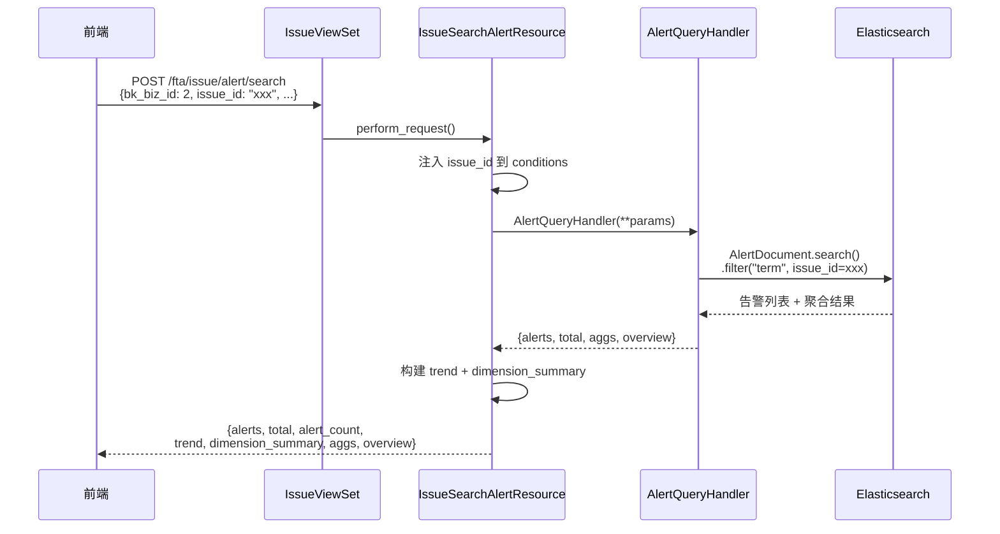

# Issue 告警查询接口设计文档

> **关联文档**：[Issues详情接口设计.md](Issues详情接口设计.md) | [Issue详情接口文档.md](../api/Issue详情接口文档.md)

---

## 1. 接口说明

对应设计稿模块：**检索栏 + 告警列表 + 趋势图 + 维度统计**

接口地址：`POST /fta/issue/alert/search`

本接口用于**刷新 Issue 详情页中的动态数据**。当用户在检索栏中输入条件、切换时间范围时，通过本接口重新查询并返回更新后的告警列表、趋势图、维度统计等数据。

| 维度 | 说明 |
|------|------|
| **定位** | 刷新 Issue 详情中除元数据外的动态数据（告警列表 + 趋势图 + 维度统计 + 聚合统计等） |
| **搜索范围** | 单个 Issue 关联的告警子集（`AlertDocument` 中 `issue_id` 等于当前 Issue ID 的告警） |
| **不是** | 搜索整个告警中心的所有告警 |
| **交互方式** | 检索栏 UI 模式与告警中心保持一致，但功能本质不同 |
| **使用场景** | 用户在 Issue 详情页使用检索栏过滤/搜索时，局部刷新动态数据 |

---

## 2. 设计决策：独立 Resource + 复用告警搜索核心逻辑

**方案选择**：新建 `IssueSearchAlertResource`，内部复用 `AlertQueryHandler` 的搜索能力。

理由：
1. Issue 告警查询挂载在 Issue 模块路由下（`/fta/issue/alert/search`），需要独立的 Resource 注册
2. 核心搜索逻辑（过滤、条件查询）复用现有 `AlertQueryHandler`
3. 通过 `issue_id` 参数自动注入 `conditions`，对前端透明
4. 返回值与 Issue 详情接口的动态数据部分一致（去掉 Issue 元数据），用于局部刷新

---

## 3. IssueSearchAlertResource

```python
class IssueSearchAlertResource(Resource):
    """查询 Issue 关联告警的动态数据，用于刷新 Issue 详情页"""

    class RequestSerializer(serializers.Serializer):
        bk_biz_id = serializers.IntegerField(label="业务ID", required=True)
        issue_id = IssueIDField(label="Issue ID")
        conditions = SearchConditionSerializer(label="搜索条件", many=True, default=[])
        query_string = serializers.CharField(label="查询字符串", default="", allow_blank=True)
        start_time = serializers.IntegerField(label="开始时间")
        end_time = serializers.IntegerField(label="结束时间")

    def perform_request(self, validated_request_data):
        # 具体实现见开发阶段
        pass
```

---

## 4. 请求参数

| 字段 | 类型 | 必填 | 默认值 | 说明 |
|------|------|------|--------|------|
| `bk_biz_id` | `int` | 是 | — | 业务 ID（用于权限校验） |
| `issue_id` | `str` | 是 | — | Issue ID，自动注入为 `conditions` 中的 `issue_id` 过滤条件 |
| `conditions` | `list` | 否 | `[]` | 搜索条件，格式同告警搜索 |
| `query_string` | `str` | 否 | `""` | 查询字符串 |
| `start_time` | `int` | 是 | — | 开始时间（秒级时间戳） |
| `end_time` | `int` | 是 | — | 结束时间（秒级时间戳） |

> **说明**：本接口不支持分页和排序参数。告警列表返回当前条件下的全量数据，前端自行处理展示逻辑。

---

## 5. 返回值结构

返回 Issue 详情中除元数据外的动态数据，用于局部刷新详情页：

```json
{
  "alerts": [...],
  "total": 86,
  "alert_count": 86,
  "aggs": [...],
  "overview": {...},
  "trend": [
    {
      "data": [[1773619200000, 1], [1773705600000, 3], ...],
      "display_name": "未恢复",
      "name": "ABNORMAL"
    },
    {
      "data": [[1773619200000, 0], [1773705600000, 1], ...],
      "display_name": "已恢复",
      "name": "RECOVERED"
    },
    {
      "data": [[1773619200000, 0], [1773705600000, 0], ...],
      "display_name": "已失效",
      "name": "CLOSED"
    }
  ],
  "dimension_summary": [
    {
      "dimension_key": "bk_target_ip",
      "dimension_name": "主机IP",
      "total_count": 86,
      "items": [
        {"value": "10.0.0.1", "count": 30, "percentage": 34.88},
        {"value": "10.0.0.2", "count": 20, "percentage": 23.26},
        {"value": "其他", "count": 1, "percentage": 1.16}
      ]
    }
  ]
}
```

### 5.1 返回值字段说明

| 字段 | 类型 | 说明 |
|------|------|------|
| `alerts` | `list` | 当前条件下的告警列表（全量） |
| `total` | `int` | 告警总数 |
| `alert_count` | `int` | 告警总数（与 `total` 一致，对齐 Issue 详情接口字段） |
| `aggs` | `list` | 聚合统计信息 |
| `overview` | `dict` | 总览统计信息 |
| `trend` | `list` | 告警趋势图数据（ABNORMAL / RECOVERED / CLOSED 三条时间序列） |
| `dimension_summary` | `list` | 维度统计数据（Top5 + 其他） |

> **与 Issue 详情接口的关系**：本接口返回的 `alerts`、`trend`、`dimension_summary`、`alert_count`、`aggs`、`overview` 字段含义与 Issue 详情接口一致，用于替换详情页中对应模块的数据。

---

## 6. 前端调用方式

### 6.1 检索栏搜索（刷新动态数据）

```json
POST /fta/issue/alert/search
{
  "bk_biz_id": 2,
  "issue_id": "1741420800a3b7c9d2",
  "start_time": 1741334400,
  "end_time": 1741420800,
  "conditions": [],
  "query_string": ""
}
```

### 6.2 带条件过滤

```json
POST /fta/issue/alert/search
{
  "bk_biz_id": 2,
  "issue_id": "1741420800a3b7c9d2",
  "start_time": 1741334400,
  "end_time": 1741420800,
  "conditions": [
    {"key": "severity", "value": [1], "method": "eq"}
  ],
  "query_string": ""
}
```

### 6.3 最新/最早告警

`latest_alert_id` 和 `earliest_alert_id` 已通过 `detail` 接口返回，前端点击时直接调用告警详情接口（已实现），无需本接口支持。

---

## 7. 检索栏 UI 模式

设计稿中检索栏支持 **UI 模式切换**，与告警中心保持一致：

- 检索栏的 `UI 模式`、`添加条件`、`搜索` 等交互逻辑复用告警中心组件
- `issue_id` 作为 Resource 层参数，自动注入 `conditions`，前端无需手动添加
- 用户添加的额外条件通过 `conditions` 参数追加

---

## 8. 后端实现要点

### 8.1 注册 issue_id 查询字段

在 `AlertQueryTransformer.query_fields` 中注册 `issue_id` 字段：

```python
# fta_web/alert/handlers/alert.py

class AlertQueryTransformer(BaseQueryTransformer):
    query_fields = [
        # ... existing fields ...
        QueryField("issue_id", _lazy("Issue ID")),
    ]
```

### 8.2 路由注册

```python
# fta_web/issue/views.py

class IssueViewSet(ResourceViewSet):
    resource_routes = [
        # ... existing routes ...
        ResourceRoute("POST", IssueSearchAlertResource, endpoint="alert/search"),
    ]
```

---

## 9. 开发任务

| Task | 内容 | 优先级 |
|------|------|--------|
| **Task A** | `AlertQueryTransformer` 追加 `issue_id` QueryField | P0 |
| **Task B** | `IssueSearchAlertResource` 实现 | P0 |
| **Task C** | `IssueViewSet` 路由注册 `alert/search` endpoint | P0 |

---

## 10. 调用流程


