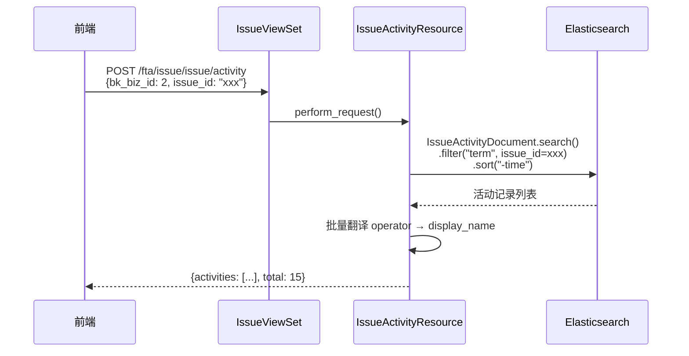

# Issue 活动日志接口设计文档

> **关联文档**：[Issues详情接口设计.md](Issues详情接口设计.md) | [Issue详情接口文档.md](../api/Issue详情接口文档.md)

---

## 1. 接口说明

对应设计稿模块：**问题活动（时间线）**

接口地址：`POST /fta/issue/issue/activity`

获取 Issue 的操作活动记录，包括评论、状态变更、负责人变更等。属于第一阶段页面骨架的并行请求之一。

---

## 2. 设计稿映射

设计稿中的问题活动时间线包含以下活动类型，对应 `IssueActivityDocument.activity_type`：

| 设计稿图标 | 活动类型 | activity_type 值 | 说明 |
|-----------|---------|-----------------|------|
| ✂️ | Issue 拆分 | `SPLIT` | 内容：拆分出的子 Issue 名称列表 |
| 📦 | Issue 合并 | `MERGE` | 内容：合并进的目标 Issue |
| 👩 + 文字 | 评论 | `COMMENT` | 内容：评论文字，最多 3 行，超出展示 `...` + 展开按钮 |
| 🔄 | 状态流转 | `STATUS_CHANGE` | `from_value` → `to_value` |
| 👤 | 指派负责人 | `ASSIGNEE_CHANGE` | `from_value` → `to_value` |
| 🚨 | 首次出现 | `FIRST_ALERT` | 内容：首次告警时间 |
| ⚡ | 优先级变更 | `PRIORITY_CHANGE` | `from_value` → `to_value` |

---

## 3. 评论功能

**添加评论**：调用 `CommentIssueResource`（`POST /fta/issue/issue/comment`），写入 `IssueActivityDocument`。

**评论展示规则**（设计稿明确）：
- 最多显示 **3 行**
- 超出 3 行用 `...` 省略，显示 `[🔗]` 展开按钮
- 点击展开按钮弹出完整内容弹窗

> **实现位置**：评论截断逻辑放在前端（CSS `line-clamp: 3` 或 JS 截断），后端返回完整内容。

---

## 4. IssueActivityResource

```python
class IssueActivityResource(Resource):
    """查询 Issue 活动日志列表"""

    class RequestSerializer(serializers.Serializer):
        bk_biz_id = serializers.IntegerField(label="业务ID", required=True)
        issue_id = IssueIDField(label="Issue ID")
        page = serializers.IntegerField(label="页数", min_value=1, default=1)
        page_size = serializers.IntegerField(label="每页大小", min_value=1, max_value=50, default=10)

    def perform_request(self, validated_request_data):
        issue_id = validated_request_data["issue_id"]
        page = validated_request_data["page"]
        page_size = validated_request_data["page_size"]

        search = (
            IssueActivityDocument.search(all_indices=True)
            .filter("term", issue_id=issue_id)
            .sort("-time")
        )

        # 分页
        start = (page - 1) * page_size
        search = search[start : start + page_size]
        search = search.params(track_total_hits=True)

        result = search.execute()
        total = result.hits.total.value if hasattr(result.hits.total, "value") else len(result.hits)

        # 收集 operator 列表，批量翻译显示名
        operators = {hit.operator for hit in result.hits if hit.operator}
        operator_display_map = self._translate_operators(operators)

        activities = []
        for hit in result.hits:
            hit_dict = hit.to_dict()
            activities.append({
                "id": hit_dict.get("id"),
                "activity_type": hit_dict.get("activity_type"),
                "operator": hit_dict.get("operator"),
                "operator_display_name": operator_display_map.get(
                    hit_dict.get("operator"), hit_dict.get("operator", "")
                ),
                "content": hit_dict.get("content"),
                "time": hit_dict.get("time"),
                "from_value": hit_dict.get("from_value"),
                "to_value": hit_dict.get("to_value"),
            })

        return {"activities": activities, "total": total}

    @staticmethod
    def _translate_operators(operators: set) -> dict:
        """批量翻译 operator 为中文显示名"""
        if not operators:
            return {}
        # 系统操作者直接映射
        display_map = {"system": _("系统")}
        # 非系统用户通过 UserTranslator 翻译
        user_operators = [op for op in operators if op != "system"]
        if user_operators:
            from bkmonitor.utils.user import get_user_display_info
            user_info = get_user_display_info(user_operators)
            display_map.update(user_info)
        return display_map
```

---

## 5. 请求参数

| 字段 | 类型 | 必填 | 默认值 | 说明 |
|------|------|------|--------|------|
| `bk_biz_id` | `int` | 是 | — | 业务 ID（用于权限校验） |
| `issue_id` | `str` | 是 | — | Issue ID |
| `page` | `int` | 否 | `1` | 页码 |
| `page_size` | `int` | 否 | `10` | 每页大小（最大 50） |

---

## 6. 返回值结构

```json
{
  "activities": [
    {
      "id": "1741420800a1b2c3d4",
      "activity_type": "COMMENT",
      "operator": "lililiu",
      "operator_display_name": "刘莉莉",
      "content": "我是评论相关的信息嘻嘻...",
      "time": 1741420800,
      "from_value": null,
      "to_value": null
    },
    {
      "id": "1741420800e5f6a7b8",
      "activity_type": "STATUS_CHANGE",
      "operator": "system",
      "operator_display_name": "系统",
      "content": null,
      "time": 1741420800,
      "from_value": "pending_review",
      "to_value": "unresolved"
    },
    {
      "id": "1741420800f9a0b1c2",
      "activity_type": "PRIORITY_CHANGE",
      "operator": "carrielu",
      "operator_display_name": "鲁凯瑞",
      "content": null,
      "time": 1741420700,
      "from_value": "P1",
      "to_value": "P0" 
    }
  ],
  "total": 15
}
```

### 返回字段说明

| 字段 | 类型 | 说明 |
|------|------|------|
| `activities` | `list[dict]` | 活动记录列表 |
| `total` | `int` | 满足条件的活动记录总数 |

### activity 单项字段说明

| 字段 | 类型 | 说明 |
|------|------|------|
| `id` | `str` | 活动记录 ID |
| `activity_type` | `str` | 活动类型枚举值（`COMMENT` / `STATUS_CHANGE` / `ASSIGNEE_CHANGE` / `PRIORITY_CHANGE` / `FIRST_ALERT` / `SPLIT` / `MERGE`） |
| `operator` | `str` | 操作者用户名，`system` 表示系统自动操作 |
| `operator_display_name` | `str` | 操作者中文显示名 |
| `content` | `str \| null` | 评论内容（仅 `COMMENT` 类型有值），后端返回完整内容，截断由前端处理 |
| `time` | `int` | 活动时间（秒级时间戳） |
| `from_value` | `str \| null` | 变更前的值（仅变更类活动有值） |
| `to_value` | `str \| null` | 变更后的值（仅变更类活动有值） |

---

## 7. 路由注册

```python
# fta_web/issue/views.py

class IssueViewSet(ResourceViewSet):
    resource_routes = [
        # ... existing routes ...
        ResourceRoute("POST", IssueActivityResource, endpoint="activity"),
    ]
```

---

## 8. 开发任务

| Task | 内容 | 优先级 |
|------|------|--------|
| **Task A** | `IssueActivityResource` 实现（含 operator_display_name 翻译） | P0 |

> **依赖**：`IssueActivityDocument`（已完成）

---

## 9. 调用流程

