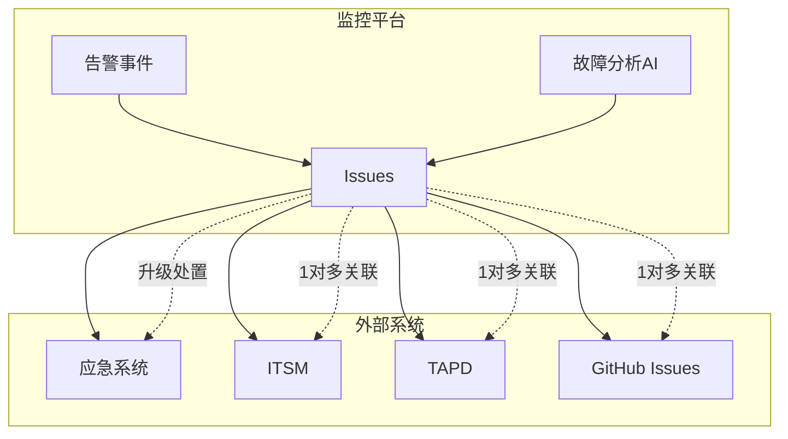
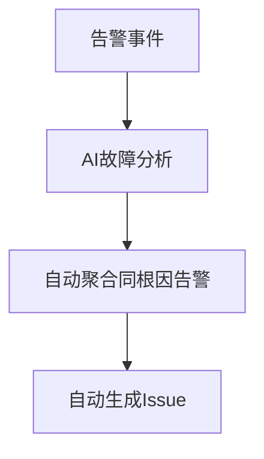
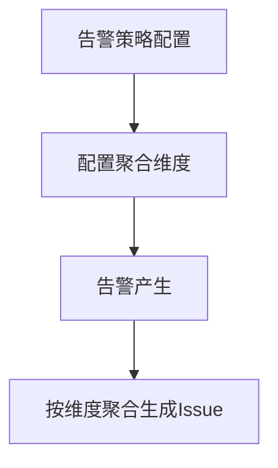
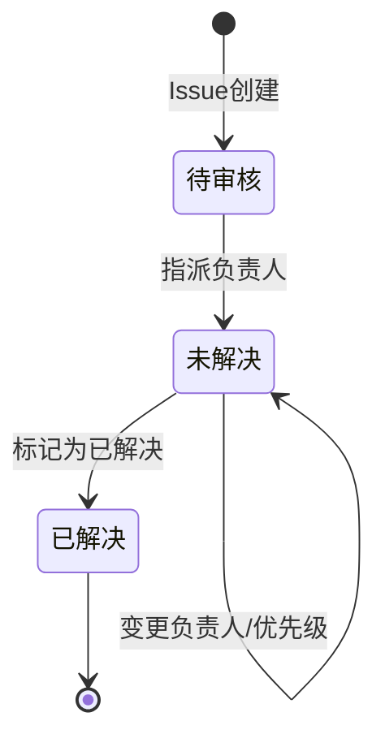
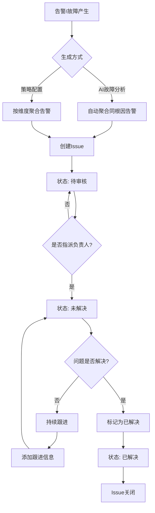
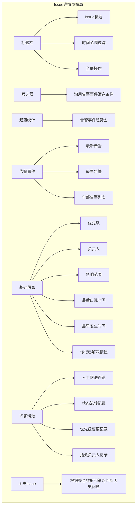
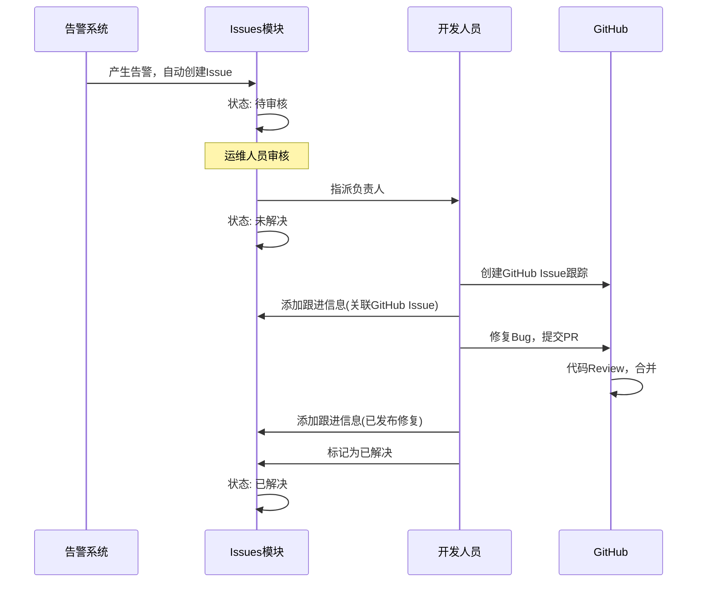
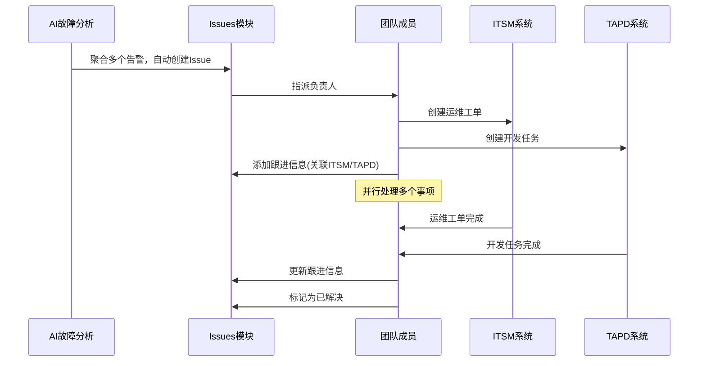
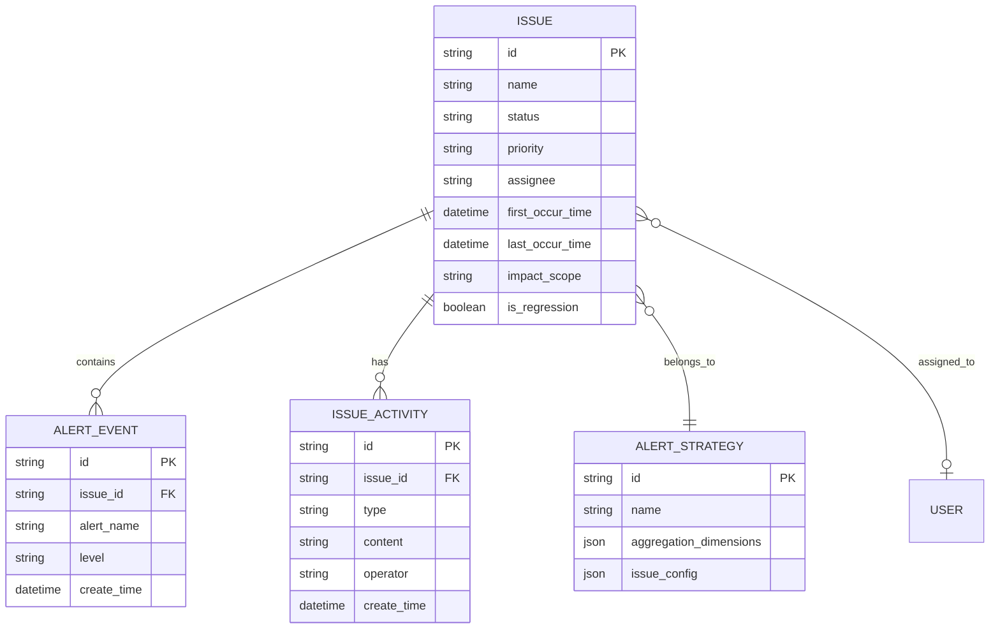

# Issues 功能详细说明文档

## 1. 概述

### 1.1 功能定位

Issues 功能是蓝鲸监控平台中的**告警/故障跟踪管理模块**，旨在解决告警或故障产生后无法进行人工后续跟踪的问题。

**核心价值**：
- 告警恢复 ≠ 问题解决：即使告警已恢复，仍可能需要负责人继续跟进处理
- 例如：修复代码中的某个 bug 并发布后，才能算真正跟进完成

### 1.2 与其他系统的关系

| 系统 | 关系说明 |
|------|----------|
| **应急系统** | 解决影响业务故障需要升级处置的问题，属于管理流程上的补充 |
| **ITSM/TAPD/GitHub** | 属于 Issues 对应的额外需要跟进的事项，1个 Issue 可关联多个事项（1对多） |
| **故障分析** | AI 自动聚合告警事件，认为属于同一根因引起时，会默认产生 Issue |

---

## 2. Issue 生成机制

### 2.1 Issue 产生方式

#### 方式一：故障分析自动生成

故障分析功能通过 AI 自动聚合告警事件，当系统判定这些告警属于同一类根因引起时，该故障会**默认产生 Issue**。

#### 方式二：告警策略配置聚合

用户可在告警策略中配置维度组合，对产生的告警进行 Issue 聚合。

**配置位置**：告警策略 → 告警处理面板 → "Issues聚合" Tab

**配置参数**：

| 参数 | 说明 | 是否必填 |
|------|------|----------|
| 聚合维度 | 默认为当前策略配置的维度，只能减少不能新增 | 必填 |
| 条件 | 基于前面选择维度的可选值进行筛选 | 可选 |
| 生效告警级别 | 默认前面配置的告警级别都勾选 | 可选 |

---

## 3. Issue 状态流转

### 3.1 状态定义

| 状态 | 说明 |
|------|------|
| **待审核** | 初始状态，负责人为空，显示"未指派" |
| **未解决** | 已指派负责人后自动流转到此状态 |
| **已解决** | 人工标记为已解决 |

### 3.2 状态流转图

### 3.3 完整生命周期流程

---

## 4. 功能模块详解

### 4.1 Issues 列表

Issues 是独立的功能模块，与告警事件同级菜单。

#### 4.1.1 列表字段说明

| 字段 | 说明 |
|------|------|
| **Issue** | Issue 名称（默认为告警策略名称）、关键报错信息、包含告警事件数量 |
| **标签** | 告警策略的标签 |
| **最后出现时间** | 最后一条告警产生的时间 |
| **最早发生时间** | 最早一条告警产生的时间 |
| **趋势** | 相应告警事件产生的趋势统计图，以柱状图形式展示告警数量随时间的变化趋势，数字表示当前时间范围内的告警总数 |
| **影响范围** | 展示 Issue 关联告警的影响范围，包括集群(cluster)、主机(host)、Pod、容器(container)等关键维度及其数量 |
| **优先级** | 可手动调整（高/中/低） |
| **状态** | 待审核/未解决/已解决，支持表头筛选 |
| **负责人** | Issue 指派人员，默认"未指派"，支持表头筛选 |
| **操作** | 支持"标记为已解决"操作 |

#### 4.1.3 问题类型标识

在 Issue 名称旁会显示问题类型标识，用于快速识别问题性质：

| 标识 | 说明 |
|------|------|
| **新问题** | 该 Issue 对应的告警组合在历史上首次出现 |
| **回归问题** | 该 Issue 曾经出现过并被标记为已解决，现在再次发生 |

> 注：系统根据 Issue 的聚合维度和告警策略判断是否为历史问题，详情页底部"历史 Issue"区域可查看历史记录。

#### 4.1.2 批量操作

- 指派负责人
- 标记为已解决
- 修改优先级
- 添加跟进信息
- 导出 Excel 表格数据

### 4.2 Issue 详情页

#### 详情页功能区域说明

| 区域 | 位置 | 功能说明 |
|------|------|----------|
| **标题栏** | 页面顶部 | Issue 标题展示、时间范围过滤（近1小时/近6小时/近1天/近7天/自定义）、全屏操作 |
| **筛选器** | 标题栏下方 | Issue 关联的告警事件筛选器，沿用告警事件的筛选条件（如告警级别、状态等） |
| **趋势统计** | 左侧上方 | 告警事件趋势统计图，展示时间范围内的告警产生趋势 |
| **维度统计** | 左侧中部 | 展示告警在各维度的分布占比，如主机分布、云区域 ID 分布等 |
| **告警事件** | 左侧下方 | 展示最新/最早的告警事件卡片，点击"全部"展示完整告警列表 |
| **基础信息** | 右侧栏上方 | 优先级、负责人、影响范围、时间信息 + 标记已解决按钮 |
| **问题活动** | 右侧栏中部 | 人工跟进评论，包括状态流转、优先级变更、指派负责人等变更记录 |
| **历史Issue** | 右侧栏底部 | 根据 Issue 聚合维度和告警策略判断是否曾经出现过该问题 |

#### 4.2.4 基础信息

基础信息卡片展示 Issue 的核心属性和操作：

| 字段 | 说明 |
|------|------|
| **优先级** | 显示当前优先级（高/中/低），以彩色标签展示（如红色=高） |
| **负责人** | 显示指派的人员列表，支持点击编辑修改负责人 |
| **影响范围** | 展示关键维度信息（如 `host: 124`），支持点击查看详情 |
| **最早出现时间** | 第一条告警产生的时间（如 15s ago） |
| **最早发生时间** | 首次检测到问题的时间（如 8m ago） |
| **操作按钮** | 「标记为已解决」按钮，点击后将 Issue 状态变更为已解决 |

#### 4.2.5 问题活动

问题活动模块记录 Issue 的全生命周期操作和人工跟进信息：

| 功能 | 说明 |
|------|------|
| **评论输入** | 输入框提示"我要评论..."，支持添加人工跟进评论 |
| **状态流转记录** | 记录状态变更历史，如「状态流转：已审核 15s ago」 |
| **时间记录** | 记录关键时间节点，如「最早发生时间 8m ago」 |
| **变更记录** | 包括优先级变更、负责人变更等操作的历史记录 |

活动记录以时间线形式展示，便于追溯 Issue 处理过程。

#### 4.2.6 历史 Issue

历史 Issue 模块用于识别是否为**回归问题**：

| 元素 | 说明 |
|------|------|
| **Issue 名称** | 历史 Issue 的名称（如"异常登录日志告警"），支持点击跳转 |
| **发生时间** | 该历史 Issue 上次发生的时间（如 10d ago） |
| **判定逻辑** | 系统根据 Issue 聚合维度和告警策略判断是否为同一问题 |

> **回归问题判定**：当相同聚合维度和策略的 Issue 曾经出现过且被标记为已解决，再次发生时会被识别为"回归问题"，在列表中显示相应标识。

#### 4.2.1 趋势统计

趋势统计模块以**堆叠柱状图**形式展示 Issue 关联告警事件的时间分布趋势：

| 元素 | 说明 |
|------|------|
| **图表类型** | 堆叠柱状图，按时间轴展示 |
| **数据维度** | 横轴为时间（如 10-1 至 10-7），纵轴为告警数量 |
| **状态分色** | 红色：未恢复、绿色：已恢复、黄色：已失效 |
| **告警事件数** | 图表标题旁显示当前筛选条件下的告警事件总数 |
| **当前数量** | 图表右上角显示当前时间范围内的告警数量 |

#### 4.2.2 维度统计

维度统计模块以**横向进度条**形式展示 Issue 关联告警在各维度的分布占比，帮助快速定位影响范围：

| 统计项 | 展示形式 | 说明 |
|--------|----------|------|
| **主机分布** | 横向进度条 + 百分比 | 展示告警涉及的主机列表及占比（如 43%、32%、25%） |
| **云区域 ID 分布** | 横向进度条 + 百分比 | 展示告警在不同云区域的分布占比（如 63%、37%） |
| **其他维度** | 横向进度条 + 百分比 | 根据告警策略配置的维度动态展示，如 cluster_id、bcs_cluster_id 等 |

维度统计支持点击具体维度值快速筛选对应告警事件。

#### 4.2.3 告警事件卡片

告警事件区域以卡片形式展示关联的告警详情，每张卡片包含：

| 模块 | 内容 |
|------|------|
| **告警标题** | 告警策略名称 + 告警级别标识 |
| **维度信息** | 展示告警的具体维度，如 IP、云区域 ID、挂载点等 |
| **基础信息** | 首次告警时间、告警内容、持续时长等 |
| **视图入口** | 点击查看该告警的详细数据视图（如指标趋势图、日志详情等） |
| **操作** | 跳转至原始告警详情页 |

支持"最新告警"、"最早告警"快捷查看，点击"全部"展开完整告警列表，支持分页和筛选。

---

## 5. 使用场景示例

### 场景一：代码Bug导致的告警跟踪

### 场景二：复杂故障的多事项跟进

---

## 6. 数据模型概览

---

## 7. 总结

Issues 功能为蓝鲸监控平台提供了完整的**告警后续跟踪能力**，主要特点包括：

1. **智能聚合**：支持 AI 自动聚合和策略维度聚合两种方式
2. **状态管理**：清晰的状态流转（待审核 → 未解决 → 已解决）
3. **协作跟进**：支持指派负责人、添加跟进信息、关联外部系统
4. **历史追溯**：支持查看历史 Issue，判断是否为回归问题
5. **批量操作**：提高运维效率，支持批量处理和数据导出

通过 Issues 功能，监控告警不再只是"响了就完了"，而是能够持续追踪直到问题**真正被解决**。
