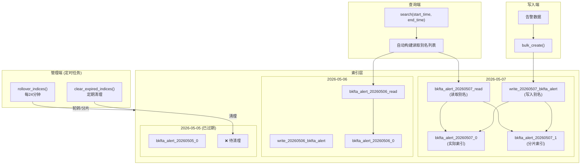
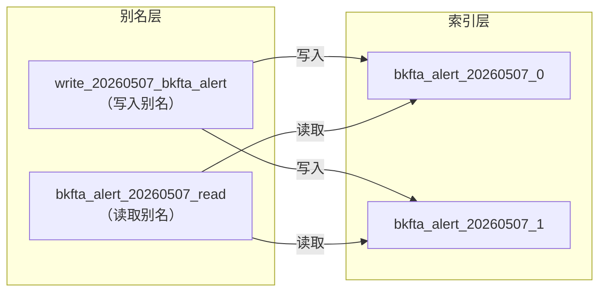
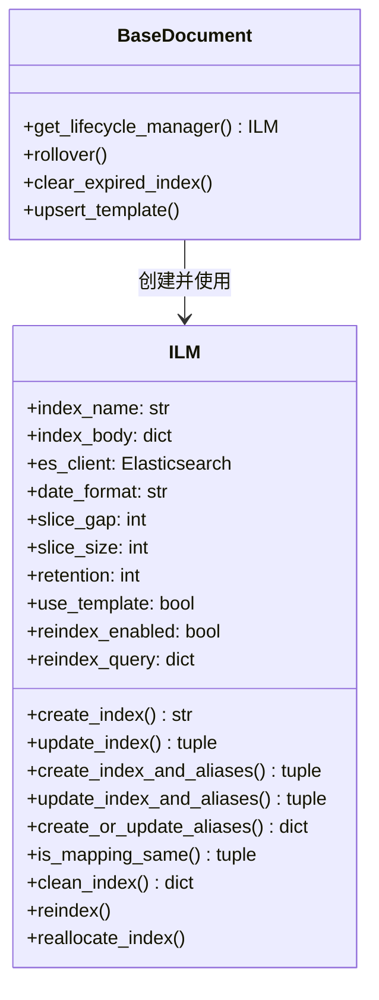
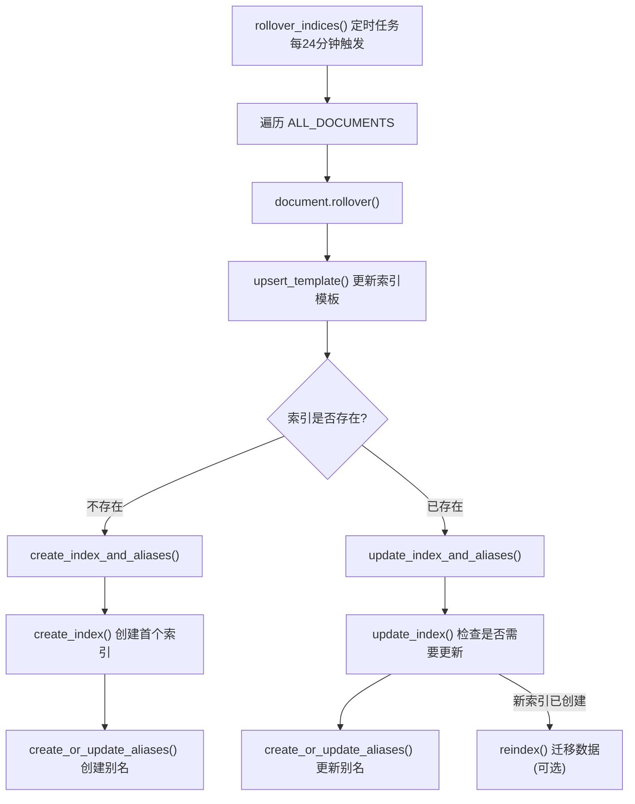
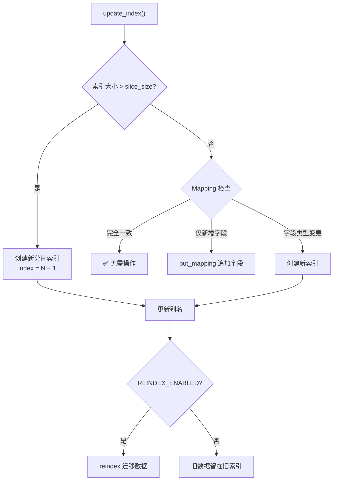
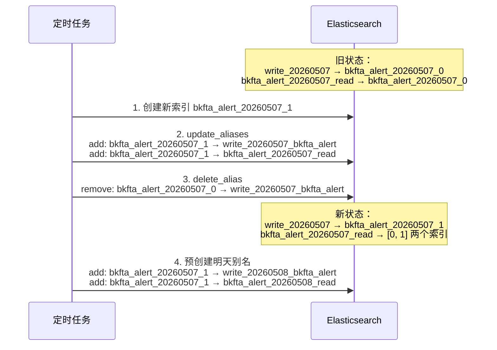
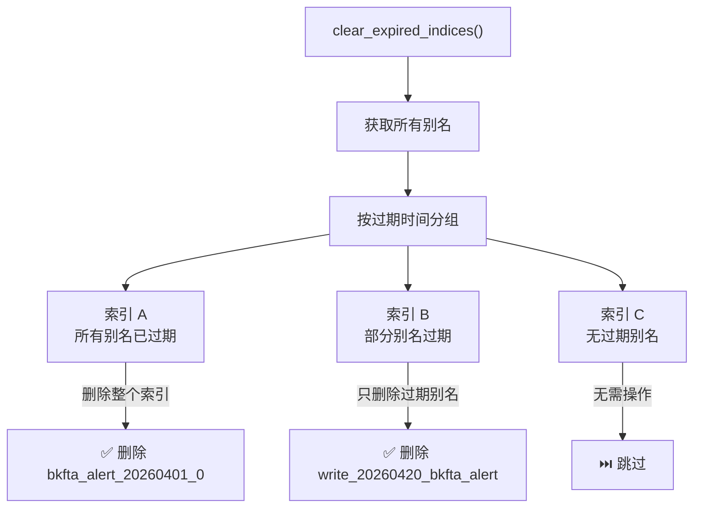
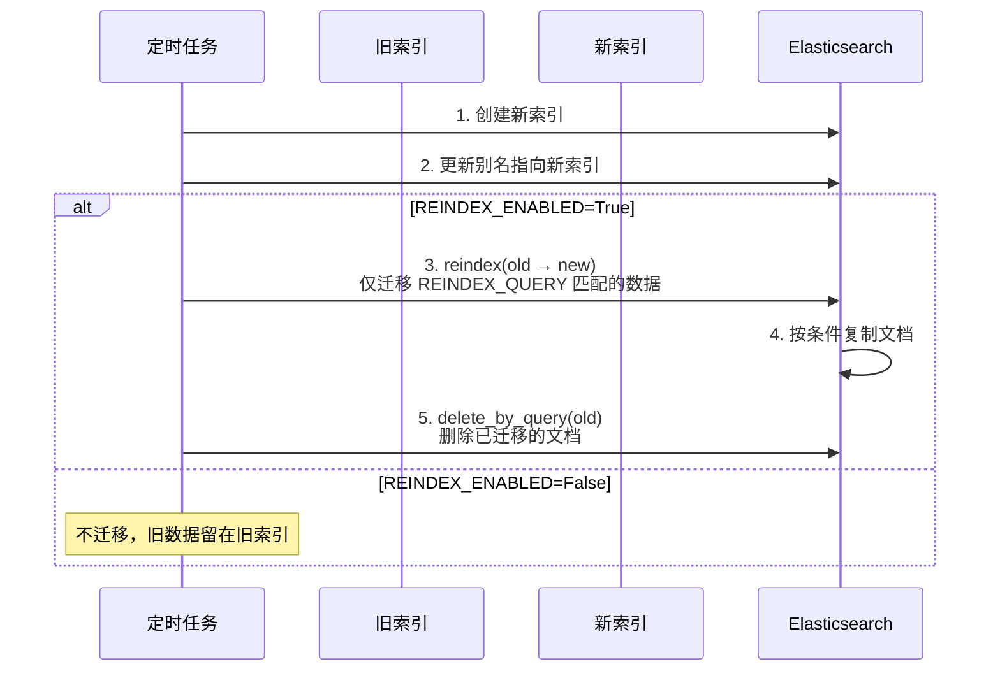
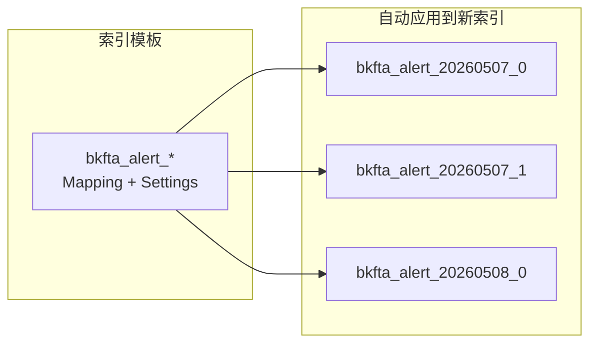
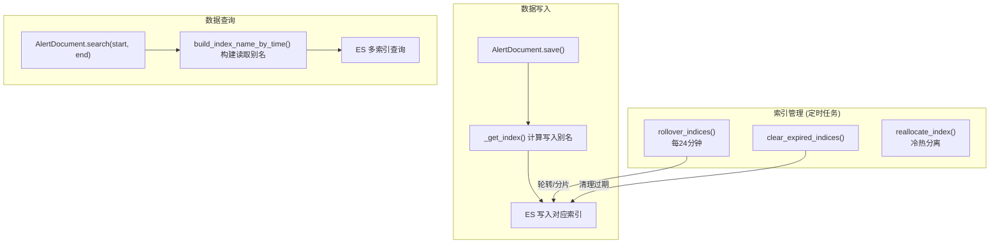

# ES 索引管理机制 — BaseDocument 与 ILM

> 🎯 **学习目标**：理解 bk-monitor 告警后台的 ES 索引管理架构，掌握按天分索引、别名路由、ILM 生命周期管理的完整设计，学会在分布式存储场景中应用类似的索引管理策略

---

## 1. 整体架构概览

bk-monitor 的告警数据全部存储在 Elasticsearch 中，通过 `BaseDocument` 实现了一套 **按天分索引 + 读写别名分离 + ILM 生命周期管理** 的完整索引体系。



---

## 2. 索引命名规范

### 📐 三层命名规则

| 类型 | 格式 | 示例 | 用途 |
|------|------|------|------|
| **写入别名** | `write_{yyyyMMdd}_{index_name}` | `write_20260507_bkfta_alert` | 数据写入路由 |
| **读取别名** | `{index_name}_{yyyyMMdd}_read` | `bkfta_alert_20260507_read` | 按天查询路由 |
| **实际索引** | `{index_name}_{yyyyMMdd}_{N}` | `bkfta_alert_20260507_0` | ES 物理索引 |

> 💡 **为什么用别名而非直接写索引？** 别名是 ES 的核心特性，可以在不修改应用代码的情况下切换底层索引，实现零停机轮转。

### 🔑 别名与索引的关系



**关键设计**：
- **写入别名**：每天一个，指向当天所有实际索引，数据写入时自动路由
- **读取别名**：每天一个，指向当天所有实际索引，查询时按时间范围拼接
- **实际索引**：同一天可能有多个（超过大小限制时自动分片）

---

## 3. 写入路由：文档如何找到正确的索引

### 🔧 _get_index() 源码解析

**文件位置**：`bkmonitor/documents/base.py`

```python
class BaseDocument(Document):
    INDEX_TIME_FORMAT = "%Y%m%d"  # 按天拆分

    def get_index_time(self):
        """
        子类必须实现：返回文档的时间字段
        用于判断该文档应该存放到哪个索引
        """
        raise NotImplementedError

    def _get_index(self, index=None, required=True):
        """
        根据文档时间计算写入别名

        流程：
        1. 获取文档的时间字段（如 create_time）
        2. 格式化为日期字符串（如 "20260507"）
        3. 拼接写入别名（如 "write_20260507_bkfta_alert"）
        """
        index_name = index or getattr(self._index, "_name", None)

        try:
            index_time = self.get_index_time()
            time_obj = arrow.get(index_time)
        except Exception:
            # 时间解析失败，用当前时间兜底
            time_obj = arrow.now()

        date_str = time_obj.strftime(self.INDEX_TIME_FORMAT)
        return self.get_write_index_name(index_name, date_str)
```

### 📊 各子类的时间字段

| Document | `get_index_time()` 实现 | 说明 |
|----------|------------------------|------|
| **AlertDocument** | `parse_timestamp_by_id(self.id)` | 从 UUID 前 10 位反解时间戳 |
| **EventDocument** | `self.create_time` | 使用事件创建时间 |
| **ActionInstanceDocument** | `self.create_time` | 使用动作创建时间 |
| **IncidentDocument** | `self.create_time` | 使用故障创建时间 |

**AlertDocument 的时间反解**：

```python
# 文件: bkmonitor/documents/alert.py

class AlertDocument(BaseDocument):
    class Index:
        name = "bkfta_alert"
        settings = ES_INDEX_SETTINGS.copy()

    def get_index_time(self):
        """从告警 ID（UUID）反解时间戳"""
        return self.parse_timestamp_by_id(self.id)

    @classmethod
    def parse_timestamp_by_id(cls, uuid: str) -> int:
        """UUID 前 10 位是秒级时间戳"""
        return int(str(uuid)[:10])
```

> 💡 **设计意图**：告警 ID 本身包含时间信息，无需额外字段即可确定写入索引，减少数据冗余。

---

## 4. 查询路由：按时间范围构建读取索引

### 🔧 build_index_name_by_time() 源码解析

```python
@classmethod
def build_index_name_by_time(cls, start_time=None, end_time=None, days=0):
    """
    根据起止时间构建读取别名列表

    智能策略：
    - 同月且 ≤ 15天：按天枚举
    - > 15天：按月通配符
    - 跨月：首尾月按天 + 中间月按月通配
    """
    index_name = cls._index._name

    if not start_time:
        start_time = arrow.now().replace(days=-days).floor("day")
    else:
        start_time = arrow.get(start_time).floor("day")
    if not end_time:
        end_time = arrow.now().ceil("day")
    else:
        end_time = arrow.get(end_time).ceil("day")

    # 同月直接按天枚举
    if start_time.year == end_time.year and start_time.month == end_time.month:
        return cls._format_index_by_day(start_time, end_time)

    index = []
    # 1. 开始月按天枚举
    index.extend(cls._format_index_by_day(start_time, start_time.ceil("month")))
    # 2. 中间月按月通配
    current_time = start_time.floor("month").replace(months=1)
    current_end_time = end_time.ceil("month").replace(months=-1)
    while current_time < current_end_time:
        index.append(cls.get_read_index_name(index_name, f"{current_time.strftime('%Y%m')}*"))
        current_time = current_time.replace(months=1)
    # 3. 结束月按天枚举
    index.extend(cls._format_index_by_day(end_time.floor("month"), end_time))

    return index
```

### 📊 查询策略示例

| 查询范围 | 生成索引列表 | 说明 |
|---------|-------------|------|
| 5月7日当天 | `[bkfta_alert_20260507_read]` | 单天查询 |
| 5月5日~5月7日 | `[...0505_read, ...0506_read, ...0507_read]` | ≤15天按天枚举 |
| 4月1日~5月7日 | `[...0401_read, ..., ...0430_read, ...0507_read]` | 跨月，首尾按天 |
| 1月1日~5月7日 | `[...01*_read, ...02*_read, ...03*_read, ...04*_read, ...0501_read, ..., ...0507_read]` | 大范围，中间月按月通配 |

**_format_index_by_day 的优化**：

```python
@classmethod
def _format_index_by_day(cls, start_time, end_time):
    """按天枚举，超过15天改用月通配符"""
    if (end_time - start_time).days > 15:
        return [cls.get_read_index_name(index_name, f"{start_time.strftime('%Y%m')}*")]
    # 逐天枚举
    current_time = start_time
    while current_time < end_time:
        index.append(cls.get_read_index_name(index_name, current_time.strftime("%Y%m%d")))
        current_time = current_time.replace(days=1)
    return index
```

### 🔧 search() 入口

```python
@classmethod
def search(cls, using=None, index=None, start_time=None, end_time=None, days=0, all_indices=False):
    """
    查询入口：三种模式

    1. 指定索引：直接查询
    2. 全量查询：使用 {name}_*_read 通配
    3. 时间范围：自动构建读取别名列表
    """
    if index:
        return super().search(using=using, index=index).params(ignore_unavailable=True)
    if all_indices:
        return super().search(using=using, index=cls.build_all_indices_read_index_name()).params(ignore_unavailable=True)
    index = cls.build_index_name_by_time(start_time, end_time, days)
    return super().search(using=using, index=index).params(ignore_unavailable=True)
```

> 💡 `ignore_unavailable=True`：跳过不存在的索引，避免查询某天索引不存在时报错。

---

## 5. ILM 索引生命周期管理

### 🏗️ ILM 类设计

**文件位置**：`bkmonitor/utils/elasticsearch/ilm.py`



### 📐 ILM 关键参数

| 参数 | 默认值 | 来源 | 说明 |
|------|--------|------|------|
| `slice_size` | 50 GB | `settings.FTA_ES_SLICE_SIZE` | 索引大小超限触发分片 |
| `retention` | 365 天 | `settings.FTA_ES_RETENTION` | 索引保留天数 |
| `slice_gap` | 1440 分钟 | 硬编码 | 创建未来别名的前瞻时间（1天） |
| `date_format` | `%Y%m%d` | `BaseDocument.INDEX_TIME_FORMAT` | 索引日期格式 |
| `use_template` | True | 硬编码 | 是否使用索引模板 |
| `reindex_enabled` | False | 子类覆盖 | 是否开启重索引 |

---

## 6. 索引轮转（Rollover）

### 📊 轮转流程全景



### 🔧 update_index() 分片逻辑

```python
def update_index(self):
    """
    判断索引是否需要分片或更新

    三种情况：
    1. 索引大小超过 slice_size → 创建新分片索引
    2. Mapping 仅新增字段 → put_mapping 追加
    3. Mapping 字段类型变更 → 创建新索引
    """
    current_index_info = self.current_index_info()
    index_size_in_byte = current_index_info["size"]

    # 判断是否需要分片
    should_create = False
    if index_size_in_byte / 1024.0 / 1024.0 / 1024.0 > self.slice_size:
        should_create = True

    # 不需要分片时，检查 Mapping
    if not should_create:
        is_same_mapping, should_create = self.is_mapping_same(last_index_name)
        if is_same_mapping:
            return None, last_index_name  # 无需操作
        if not should_create:
            # 仅新增字段，追加 Mapping
            es_client.indices.put_mapping(...)
            return None, last_index_name

    # 需要创建新索引
    # ...
```



---

## 7. 别名管理

### 🔧 create_or_update_aliases() 源码解析

```python
def create_or_update_aliases(self, ahead_time=1440):
    """
    为索引创建写入和读取别名

    核心逻辑：
    1. 从当前时间开始，每 slice_gap 分钟（默认1440=1天）创建一组别名
    2. 总共前瞻 ahead_time 分钟（默认1440=1天）
    3. 每组包含：写入别名 + 读取别名
    4. 解除旧索引的别名关联
    5. 将别名指向最新索引

    ahead_time=1440 意味着预创建1天的别名
    """
    es_client = self.get_client()
    current_index_info = self.current_index_info()
    last_index_name = self.make_index_name(current_index_info["datetime_object"], current_index_info["index"])

    now_datetime_object = datetime.datetime.utcnow()
    now_gap = 0
    created_alias = []

    while now_gap <= ahead_time:
        round_time = now_datetime_object + datetime.timedelta(minutes=now_gap)
        round_time_str = round_time.strftime(self.date_format)

        round_alias_name = f"write_{round_time_str}_{index_name}"
        round_read_alias_name = f"{index_name}_{round_time_str}_read"

        # 解除旧索引的别名关联
        # ...

        # 将别名指向最新索引
        es_client.indices.update_aliases(body={
            "actions": [
                {"add": {"index": last_index_name, "alias": round_alias_name}},
                {"add": {"index": last_index_name, "alias": round_read_alias_name}},
            ]
        })

        created_alias.append(round_alias_name)
        created_alias.append(round_read_alias_name)

        now_gap += self.slice_gap

    return {"last_index_name": last_index_name, "created_alias": created_alias}
```

### 📊 别名更新示意



---

## 8. 索引清理

### 🔧 clean_index() 源码解析

```python
def clean_index(self):
    """
    清理过期索引

    规则：
    1. 超过 retention 天的别名 → 删除别名
    2. 如果某索引没有任何未过期别名 → 删除整个索引
    3. 不合法的别名（不匹配时间格式）→ 根据 ES_RETAIN_INVALID_ALIAS 决定是否保留
    """
    es_client = self.get_client()
    alias_list = es_client.indices.get_alias(index=f"*{self.index_name}_*_*")
    filter_result = self.group_expired_alias(alias_list, self.retention)

    for index_name, alias_info in filter_result.items():
        if not alias_info["not_expired_alias"]:
            # 无未过期别名 → 删除整个索引
            es_client.indices.delete(index=index_name)
        elif alias_info["expired_alias"]:
            # 有过期别名 → 只删除过期别名
            es_client.indices.delete_alias(index=index_name, name=",".join(alias_info["expired_alias"]))
```

### 📊 清理流程



---

## 9. Mapping 变更处理

### 🔧 is_mapping_same() 源码解析

```python
def is_mapping_same(self, index_name):
    """
    判断索引 Mapping 与代码定义是否一致

    返回: (is_same, should_create)
    - is_same=True, should_create=False → 完全一致，无需操作
    - is_same=False, should_create=False → 仅新增字段，追加 Mapping
    - is_same=False, should_create=True → 字段类型变更，需创建新索引
    """
    # 获取 ES 上的当前 Mapping
    es_mappings = es_client.indices.get_mapping(index=index_name)
    current_mapping = es_mappings["properties"]

    # 获取代码定义的 Mapping
    es_properties = self.get_database_properties()
    database_field_list = list(es_properties.keys())

    # 差集：代码有但 ES 没有
    field_diff_set = set(database_field_list) - set(current_mapping.keys())

    # 遍历已有字段，检查类型是否一致
    for field_name, database_config in es_properties.items():
        if field_name in field_diff_set:
            continue  # 新增字段不参与比较
        current_config = current_mapping[field_name]
        for field_config in ["type", "format", "properties", "fields"]:
            if database_config.get(field_config) != current_config.get(field_config):
                return False, True  # 字段类型变更，需创建新索引

    should_create = False
    if field_diff_set:
        return False, should_create  # 仅新增字段，追加 Mapping

    return True, should_create  # 完全一致
```

### 📊 Mapping 变更的三种处理

| 变更类型 | 检测结果 | 处理方式 | 影响 |
|---------|---------|---------|------|
| 无变更 | `is_same=True` | 无需操作 | 零影响 |
| 新增字段 | `field_diff_set` 非空 | `put_mapping` 追加 | 零停机 |
| 类型变更 | 字段属性不匹配 | 创建新索引 | 需要别名切换 |

---

## 10. Reindex 数据迁移

### 📐 可选的数据迁移机制

```python
class BaseDocument(Document):
    REINDEX_ENABLED = False     # 默认关闭
    REINDEX_QUERY = None        # 迁移查询条件
```

**AlertDocument 开启了 Reindex**：

```python
class AlertDocument(BaseDocument):
    REINDEX_ENABLED = True
    # 只迁移状态为 ABNORMAL 的告警（需要继续被查询的活跃告警）
    REINDEX_QUERY = Search().filter("term", status=EventStatus.ABNORMAL).to_dict()
```

### 🔧 reindex() 流程



> 💡 **为什么只迁移 ABNORMAL 状态的告警？** 已关闭/恢复的告警不会被主动查询，留在旧索引中不影响业务，减少迁移数据量。

---

## 11. 批量操作

### 🔧 prepare_action() 源码解析

```python
class BulkActionType:
    CREATE = "create"     # 创建（文档不存在时）
    INDEX = "index"       # 索引（覆盖写入）
    UPDATE = "update"     # 更新已存在的文档
    DELETE = "delete"     # 删除
    UPSERT = "upsert"     # 存在则更新，不存在则创建

def prepare_action(self, action=BulkActionType.CREATE):
    """为 bulk API 准备单条操作"""
    data = {
        "_op_type": action,
        "_index": self._get_index(),  # 自动路由到正确的写入别名
    }
    if hasattr(self, "id"):
        data["_id"] = getattr(self, "id")

    if action == BulkActionType.UPDATE:
        data["doc"] = self.to_dict()
    elif action == BulkActionType.UPSERT:
        data["_op_type"] = BulkActionType.UPDATE
        data["doc"] = self.to_dict()
        data["doc_as_upsert"] = True
    else:
        data["_source"] = self.to_dict()

    return data

@classmethod
def bulk_create(cls, documents, parallel=False, action=BulkActionType.CREATE, **kwargs):
    """批量写入"""
    actions = [doc.prepare_action(action) for doc in documents]
    params = dict(actions=actions, request_timeout=30, **kwargs)
    if parallel:
        return cls().parallel_bulk(**params)
    return cls().bulk(max_retries=3, **params)
```

---

## 12. 定时任务调度

**文件位置**：`bkmonitor/documents/tasks.py`

```python
def rollover_indices():
    """索引轮转 — 遍历所有 Document 执行 rollover"""
    for index in ALL_DOCUMENTS:
        try:
            new_index_name, alias = index.rollover()
        except Exception as e:
            logger.exception(f"[ES ILM] index({index.Index.name}) rollover failed: {e}")

def clear_expired_indices():
    """索引清理 — 遍历所有 Document 清理过期索引"""
    for index in ALL_DOCUMENTS:
        try:
            result = index.clear_expired_index()
        except Exception as e:
            logger.exception(f"[ES ILM] index({index.Index.name}) clear failed: {e}")
```

**调度配置**（`config/role/worker.py`）：

```python
DEFAULT_CRONTAB = [
    # 每24分钟执行索引轮转
    ("*/24 * * * *", "bkmonitor.documents.tasks.rollover_indices", "global"),
]
```

### 📋 ALL_DOCUMENTS 注册表

```python
# 文件: bkmonitor/documents/__init__.py

ALL_DOCUMENTS = [
    EventDocument,              # 事件
    AlertDocument,              # 告警
    AlertLog,                   # 告警日志
    ActionInstanceDocument,     # 动作实例
    IncidentDocument,           # 故障
    IncidentNoticeDocument,     # 故障通知
    IncidentOperationDocument,  # 故障操作
    IncidentSnapshotDocument,   # 故障快照
    IssueDocument,              # Issue
    IssueActivityDocument,      # Issue 活动
]
```

---

## 13. 索引模板

### 🔧 upsert_template() 源码解析

```python
@classmethod
def upsert_template(cls):
    """更新索引模板"""
    index_template = cls._index.as_template(
        template_name=cls.Index.name,
        pattern=f"{cls.Index.name}_*",   # 匹配所有同前缀的索引
        order=100
    )
    index_template.save()
```

**模板的作用**：



> 💡 **use_template=True 时**，创建索引不再传 body，而是通过模板自动继承 Mapping 和 Settings，确保所有分片索引的配置一致。

---

## 📝 总结

### ✅ 核心设计模式

| 模式 | 实现 | 优势 |
|------|------|------|
| **按天分索引** | `_get_index()` 根据时间路由 | 缩小查询范围、方便过期清理 |
| **读写分离别名** | 写入别名 vs 读取别名 | 零停机轮转、查询性能优化 |
| **ILM 生命周期** | 创建→分片→迁移→清理 | 自动化管理、无需人工干预 |
| **索引模板** | `upsert_template()` | 新索引自动继承配置 |
| **Mapping 热更新** | `is_mapping_same()` 检测 | 新增字段不停机、类型变更自动切换 |
| **可选 Reindex** | `REINDEX_ENABLED` | 按需迁移活跃数据，减少开销 |

### 📐 数据流全景



---

## 🤔 思考题

1. **为什么写入别名格式是 `write_{date}_{name}` 而读取别名是 `{name}_{date}_read`？两种不同的命名风格有什么考虑？**

2. **当同一天创建了多个分片索引（如 `_0` 和 `_1`），读取别名会指向所有分片。ES 如何保证查询结果不重复？**

3. **如果 `rollover_indices()` 任务执行失败，会导致什么后果？是否需要告警？如何保证索引轮转的可靠性？**

4. **AlertDocument 的 `REINDEX_QUERY` 只迁移 ABNORMAL 状态的告警。如果用户需要查询历史已关闭的告警，这些数据还在旧索引中，查询时如何路由到旧索引？**

---

## 📁 相关源码索引

| 功能 | 源码路径 |
|------|---------|
| BaseDocument 基类 | `bkmonitor/documents/base.py` |
| ILM 生命周期管理 | `bkmonitor/utils/elasticsearch/ilm.py` |
| AlertDocument | `bkmonitor/documents/alert.py` |
| EventDocument | `bkmonitor/documents/event.py` |
| 索引常量配置 | `bkmonitor/documents/constants.py` |
| Document 注册表 | `bkmonitor/documents/__init__.py` |
| 定时任务 | `bkmonitor/documents/tasks.py` |
| 管理命令 | `bkmonitor/management/commands/rollover_index.py` |
