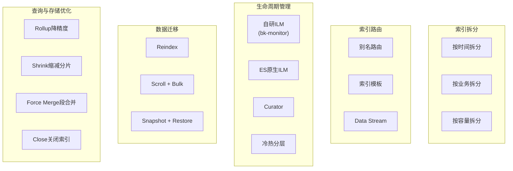
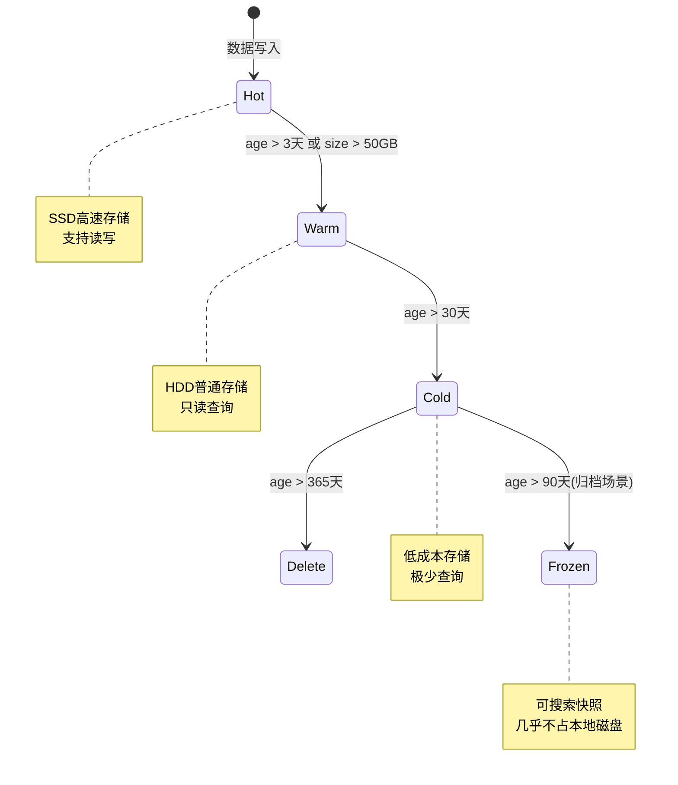
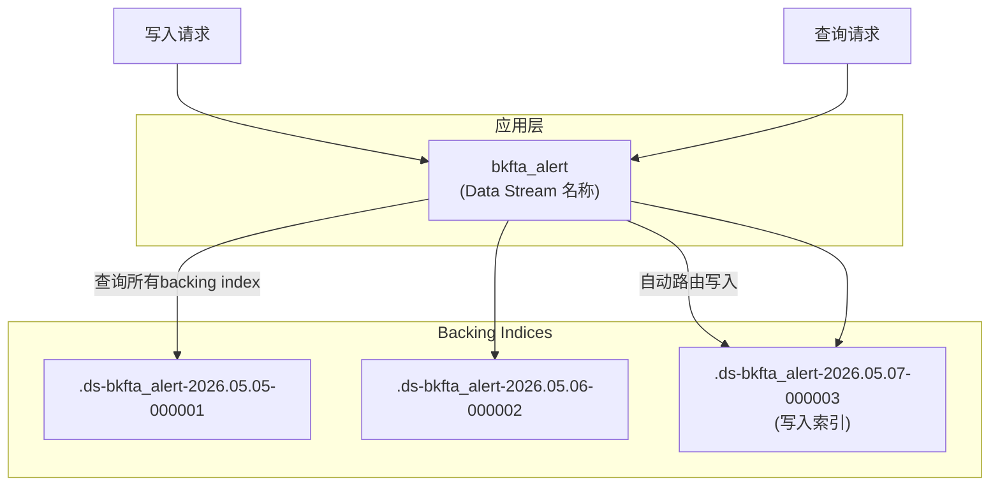
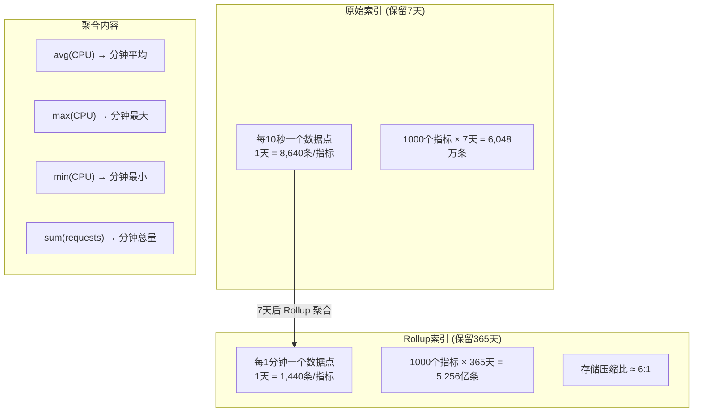
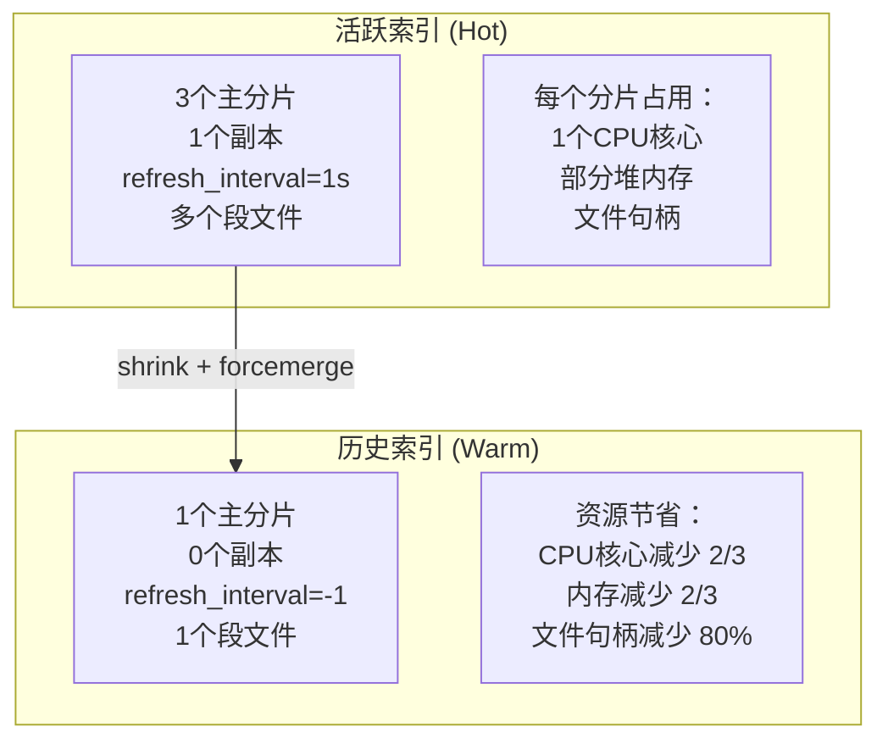
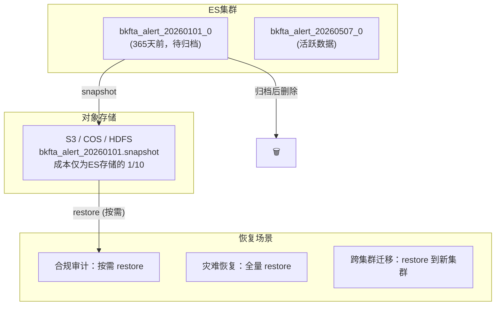
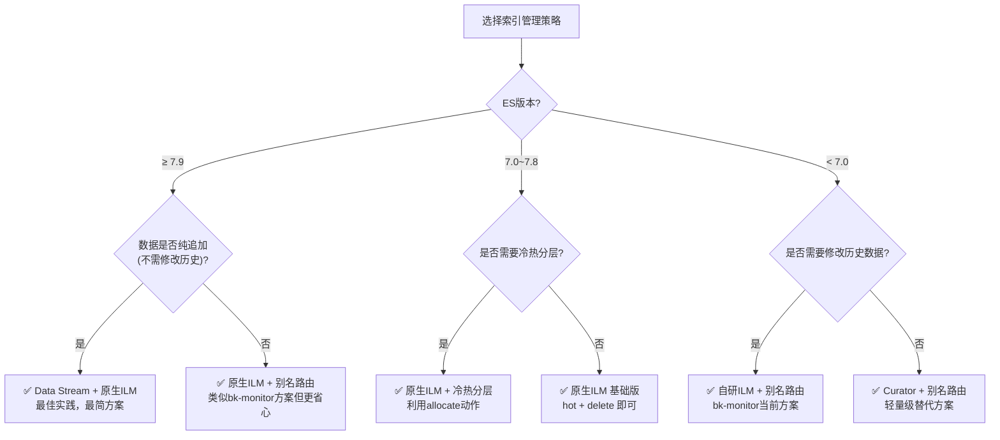
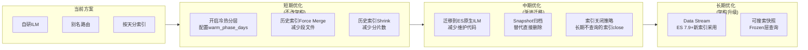

# ES 索引管理策略全景

> 🎯 **学习目标**：全面了解 Elasticsearch 索引管理的常用策略，对比 bk-monitor 当前方案与业界最佳实践的异同，掌握不同场景下的策略选型方法

---

## 1. 策略总览



---

## 2. bk-monitor 当前方案回顾

bk-monitor 的 `BaseDocument` 采用了以下组合策略：

| 策略 | 使用情况 | 说明 |
|------|---------|------|
| 按时间分索引 | ✅ 按天 | 每天一个写入别名 + 读取别名 |
| 别名路由 | ✅ 读写分离 | `write_{date}_{name}` / `{name}_{date}_read` |
| 自研 ILM | ✅ | 自行实现轮转、分片、清理 |
| 索引模板 | ✅ | `upsert_template()` 确保配置一致 |
| Reindex | ⚠️ 可选 | AlertDocument 开启，按条件迁移 |
| 冷热分层 | ⚠️ 框架存在 | `reallocate_index()` 代码已有但未深度使用 |
| Curator | ⚠️ 部分使用 | 仅用于冷节点分配 |
| ES 原生 ILM | ❌ | 自研替代 |
| Data Stream | ❌ | ES 7.9+ 特性，未采用 |
| Rollup | ❌ | 告警数据无需降精度 |
| Shrink | ❌ | 未缩减历史索引分片 |
| Force Merge | ❌ | 未合并历史索引段 |
| Snapshot | ❌ | 未归档到对象存储 |

> 📖 关于 bk-monitor 当前方案的详细解析，请参阅《ES索引管理机制-BaseDocument与ILM.md》

---

## 3. ES 原生 ILM

### 📐 四层生命周期

ES 7.x 内置了 Index Lifecycle Management，是官方推荐的索引管理方案：



### 📋 各 Phase 可执行动作

| Phase | 动作 | 说明 |
|-------|------|------|
| **Hot** | `rollover` | 按大小/时间/文档数自动轮转 |
| | `set_priority` | 设置恢复优先级 |
| **Warm** | `forcemerge` | 合并段文件，减少文件数 |
| | `shrink` | 缩减主分片数（如 3→1） |
| | `allocate` | 迁移到温节点（HDD） |
| | `set_priority` | 降低恢复优先级 |
| **Cold** | `freeze` | 冻结索引，减少内存占用 |
| | `allocate` | 迁移到冷节点 |
| | `searchable_snapshot` | 可搜索快照（ES 7.12+） |
| **Frozen** | `searchable_snapshot` | 从对象存储直接搜索 |
| **Delete** | `delete` | 永久删除索引 |

### 🔧 配置示例

```json
PUT _ilm/policy/bkmonitor_policy
{
  "policy": {
    "phases": {
      "hot": {
        "min_age": "0ms",
        "actions": {
          "rollover": {
            "max_size": "50gb",
            "max_age": "1d"
          },
          "set_priority": { "priority": 100 }
        }
      },
      "warm": {
        "min_age": "3d",
        "actions": {
          "forcemerge": { "max_num_segments": 1 },
          "shrink": { "number_of_shards": 1 },
          "allocate": { "require": { "data": "warm" } },
          "set_priority": { "priority": 50 }
        }
      },
      "cold": {
        "min_age": "30d",
        "actions": {
          "freeze": {},
          "allocate": { "require": { "data": "cold" } }
        }
      },
      "delete": {
        "min_age": "365d",
        "actions": { "delete": {} }
      }
    }
  }
}
```

### 📊 vs bk-monitor 自研 ILM

| 对比项 | 自研 ILM | ES 原生 ILM |
|--------|---------|------------|
| **维护成本** | 需自行维护 ~800 行代码 | ES 内置，零维护 |
| **灵活性** | 完全自定义逻辑 | 受 ES 策略约束 |
| **ES 版本** | 兼容 ES 5.x+ | 需 ES 7.x+ |
| **冷热分层** | 手动实现 | 原生支持 |
| **Force Merge** | 不支持 | 原生支持 |
| **Shrink** | 不支持 | 原生支持 |
| **Freeze** | 不支持 | 原生支持 |
| **可搜索快照** | 不支持 | ES 7.12+ 原生支持 |
| **Mapping 变更** | 自行检测并处理 | 需配合模板和 rollover |

---

## 4. Data Stream

### 📐 设计理念

ES 7.9+ 引入的 Data Stream 是专为时序数据（日志、指标、事件）设计的抽象层：



### 🔧 配置示例

```json
// 1. 创建索引模板
PUT _index_template/bkfta_alert_template
{
  "index_patterns": ["bkfta_alert*"],
  "data_stream": {},
  "template": {
    "settings": {
      "number_of_shards": 3,
      "number_of_replicas": 1,
      "lifecycle.name": "bkmonitor_policy"
    },
    "mappings": {
      "properties": {
        "@timestamp": { "type": "date" },
        "alert_name": { "type": "text", "fields": { "raw": { "type": "keyword" } } },
        "status": { "type": "keyword" }
      }
    }
  }
}

// 2. 创建 Data Stream
PUT _data_stream/bkfta_alert

// 3. 写入数据（自动路由）
POST bkfta_alert/_doc
{
  "@timestamp": "2026-05-07T10:00:00",
  "alert_name": "CPU使用率过高",
  "status": "ABNORMAL"
}

// 4. 查询（统一入口）
GET bkfta_alert/_search
{
  "query": { "range": { "@timestamp": { "gte": "now-7d" } } }
}
```

### 📊 vs bk-monitor 别名方案

| 对比项 | 别名方案（bk-monitor） | Data Stream |
|--------|----------------------|-------------|
| **写入** | 需计算 `write_{date}_{name}` | 自动路由到最新 backing index |
| **查询** | 需构建读取别名列表 | 统一通过 Data Stream 名查询 |
| **轮转** | 自行 rollover + 别名更新 | 配合 ILM 自动轮转 |
| **修改历史数据** | ✅ 可通过写入别名写入任意天 | ❌ 不支持修改历史 backing index |
| **删除历史数据** | ✅ 可按条件删除 | ❌ 只能删除整个 backing index |
| **实现复杂度** | 高（~800行 ILM 代码） | 低（声明式配置） |
| **ES 版本** | 5.x+ | 7.9+ |

> 💡 **Data Stream 的核心限制**：只支持追加（append-only），不支持更新或删除历史 backing index 中的文档。适合日志、指标等纯时序数据，不适合需要频繁更新历史记录的场景。

---

## 5. 冷热分层架构

### 📐 硬件分层

```mermaid
flowchart LR
    subgraph Hot层["Hot 层 (SSD)"]
        direction TB
        H1["ES Node: data_hot"]
        H2["最近3天的数据"]
        H3["高频读写"]
        H4["3分片 + 1副本"]
    end

    subgraph Warm层["Warm 层 (HDD)"]
        direction TB
        W1["ES Node: data_warm"]
        W2["3~30天的数据"]
        W3["低频只读查询"]
        W4["1分片 + 1副本"]
    end

    subgraph Cold层["Cold 层 (低成本存储)"]
        direction TB
        C1["ES Node: data_cold"]
        C2["30~365天的数据"]
        C3["极少查询"]
        C4["1分片 + 0副本<br/>冻结状态"]
    end

    subgraph Frozen层["Frozen 层 (对象存储)"]
        direction TB
        F1["S3/COS/HDFS"]
        F2["365天+的数据"]
        F3["可搜索快照"]
        F4["几乎不占本地磁盘"]
    end

    Hot层 --> |"3天后迁移"| Warm层
    Warm层 --> |"30天后迁移"| Cold层
    Cold层 --> |"365天后归档"| Frozen层
```



### 🔧 ES 节点配置

```yaml
# Hot 节点 — SSD，高性能
node.roles: [data_hot]
path.data: /data/ssd/es

# Warm 节点 — HDD，大容量
node.roles: [data_warm]
path.data: /data/hdd/es

# Cold 节点 — 低成本存储
node.roles: [data_cold]
path.data: /data/cold/es

# Frozen 节点 — 可搜索快照
node.roles: [data_frozen]
```

### 📊 各层成本对比

| 层级 | 存储介质 | 查询延迟 | 每GB成本 | 副本数 | 适用数据 |
|------|---------|---------|---------|--------|---------|
| **Hot** | SSD | < 100ms | ¥¥¥ | 1 | 最近3天活跃数据 |
| **Warm** | HDD | 100ms~1s | ¥¥ | 1 | 近30天分析数据 |
| **Cold** | 低成本HDD | 1s~10s | ¥ | 0 | 30天~1年合规数据 |
| **Frozen** | 对象存储 | 10s~60s | ¥/10 | 0 | 1年以上归档数据 |

### 📌 bk-monitor 的冷热分层实现

bk-monitor 的 ILM 类中已包含冷热分层的框架代码：

```python
# 文件: bkmonitor/utils/elasticsearch/ilm.py

def reallocate_index(self):
    """将过期索引重新分配到冷节点"""
    if self.warm_phase_days <= 0:
        return

    # 获取已过写入期的索引（无未过期写入别名的索引）
    reallocate_index_list = [
        index_name for index_name, alias in filter_result.items()
        if not alias["not_expired_alias"]
    ]

    # 使用 curator 执行节点分配
    ilo = IndexList(es_client, index_names=reallocate_index_list)
    ilo.filter_allocated(key=allocation_attr_name, value=allocation_attr_value)

    allocation = curator.Allocation(
        ilo=ilo,
        key=allocation_attr_name,
        value=allocation_attr_value,
        allocation_type=allocation_type,
    )
    allocation.do_action()
```

> 💡 目前 `warm_phase_days` 默认为 0（未启用），只需配置即可开启冷热分层。

---

## 6. Rollup — 历史数据降精度

### 📐 适用场景

对于高频采集的监控指标数据，秒级数据量大、长期保存成本高，可以通过 Rollup 将历史数据聚合为低精度：



### 🔧 配置示例

```json
PUT _rollup/job/bkmonitor_metrics
{
  "index_pattern": "bkmonitor_metrics_*",
  "rollup_index": "bkmonitor_metrics_rollup",
  "cron": "0 0 * * *",
  "page_size": 1000,
  "groups": {
    "date_histogram": {
      "field": "@timestamp",
      "fixed_interval": "1m"
    },
    "terms": {
      "fields": ["bk_biz_id", "strategy_id"]
    }
  },
  "metrics": [
    { "field": "value", "metrics": ["avg", "max", "min", "sum"] }
  ]
}
```

### 📊 适用性分析

| 数据类型 | 是否适合 Rollup | 原因 |
|---------|----------------|------|
| 监控指标（CPU、内存等） | ✅ 适合 | 高频、数值型、聚合有意义 |
| 告警记录 | ❌ 不适合 | 低频、非数值、聚合无意义 |
| 审计日志 | ❌ 不适合 | 需要完整记录，不能丢失细节 |
| 访问日志 | ⚠️ 部分适合 | 统计类查询可 Rollup，溯源类不行 |

> 💡 bk-monitor 的告警数据不适合 Rollup，因为告警是事件型数据，每条都有独立的业务含义，不能聚合。

---

## 7. Shrink & Force Merge — 历史索引优化

### 📐 优化原理

活跃索引为了写入性能通常配置多个分片，但历史索引只读后，多余的分片浪费资源：



### 🔧 操作步骤

```bash
# 1. 将索引设为只读
PUT bkfta_alert_20260401_0/_settings
{
  "settings": {
    "index.blocks.write": true
  }
}

# 2. Shrink：3分片 → 1分片
POST bkfta_alert_20260401_0/_shrink/bkfta_alert_20260401_0_shrunk
{
  "settings": {
    "index.number_of_shards": 1,
    "index.number_of_replicas": 0,
    "index.codec": "best_compression"
  }
}

# 3. Force Merge：合并段文件为1个
POST bkfta_alert_20260401_0_shrunk/_forcemerge?max_num_segments=1

# 4. 关闭索引（极少查询时）
POST bkfta_alert_20260401_0_shrunk/_close
```

### 📊 效果对比

| 操作 | 磁盘空间 | 查询性能 | 资源占用 | 可逆性 |
|------|---------|---------|---------|--------|
| **Shrink** | 减少约 30%（best_compression） | 略降（单分片扫描） | 大幅减少 | 不可逆 |
| **Force Merge** | 减少约 10~20% | 提升（减少段数） | 减少文件句柄 | 不可逆 |
| **Close** | 不变 | 无法查询（需先 open） | 几乎为零 | 可逆 |
| **Freeze** | 不变 | 首次查询需加载 | 极低 | 可逆 |

---

## 8. Snapshot/Restore — 归档到对象存储

### 📐 架构



### 🔧 配置示例

```bash
# 1. 注册快照仓库
PUT _snapshot/bkmonitor_backup
{
  "type": "s3",
  "settings": {
    "bucket": "bkmonitor-es-backup",
    "base_path": "snapshots",
    "server_side_encryption": true
  }
}

# 2. 创建快照
PUT _snapshot/bkmonitor_backup/snapshot_20260507
{
  "indices": "bkfta_alert_20260101_*",
  "ignore_unavailable": true,
  "include_global_state": false
}

# 3. 按需恢复
POST _snapshot/bkmonitor_backup/snapshot_20260101/_restore
{
  "indices": "bkfta_alert_20260101_*",
  "rename_pattern": "(.+)",
  "rename_replacement": "restored_$1"
}
```

### 📊 快照策略对比

| 策略 | 频率 | 保留时间 | 适用场景 |
|------|------|---------|---------|
| **增量快照** | 每小时 | 7天 | 灾难恢复 |
| **日快照** | 每天 | 30天 | 近期数据恢复 |
| **周快照** | 每周 | 90天 | 合规审计 |
| **归档快照** | 按需 | 永久 | 历史数据归档 |

---

## 9. 策略选型指南

### 🎯 决策树



### 📋 场景推荐

| 场景 | 推荐策略 | 核心优势 |
|------|---------|---------|
| 新项目 + ES 7.9+ + 纯时序 | Data Stream + 原生 ILM | 最简单，自动管理 |
| 新项目 + ES 7.x + 需改历史 | 原生 ILM + 别名路由 | 灵活且低维护 |
| 旧项目 + ES 5.x/6.x | 自研 ILM + 别名路由 | 兼容旧版本 |
| 海量历史 + 成本敏感 | 冷热分层 + Snapshot 归档 | 存储成本降低 90% |
| 高频指标 + 长期保存 | Rollup + 冷热分层 | 数据量压缩 6:1 |
| 合规审计 + 极少查询 | Snapshot 归档 + Close | 近零资源占用 |
| 跨集群灾备 | 定期 Snapshot | 灾难恢复 < 1小时 |

---

## 10. bk-monitor 优化路线图

### 🎯 从当前方案可渐进优化的方向



| 阶段 | 优化项 | 改动量 | 收益 |
|------|--------|--------|------|
| **短期** | 开启冷热分层 | 配置 `warm_phase_days` | 存储成本降低 50% |
| **短期** | 历史索引 Force Merge | 定时任务加一步 | 文件句柄减少 80% |
| **短期** | 历史索引 Shrink | 定时任务加一步 | 堆内存减少 2/3 |
| **中期** | 迁移原生 ILM | 重构 ILM 类 | 减少 800 行维护代码 |
| **中期** | Snapshot 归档 | 新增归档模块 | 超期数据可恢复 |
| **长期** | Data Stream | 新 Document 采用 | 新模块零配置管理 |

---

## 📝 总结

### ✅ 核心原则

| 原则 | 说明 |
|------|------|
| **按时拆分** | 时序数据按时间拆分索引，缩小查询范围 |
| **读写分离** | 写入别名和读取别名分离，零停机切换 |
| **冷热分层** | 活跃数据SSD、历史数据HDD、归档数据对象存储 |
| **自动管理** | 用 ILM 自动化轮转、迁移、清理 |
| **渐进优化** | 从当前方案逐步升级，不搞大爆炸重构 |

### 📊 存储成本对比

```
假设：1TB 告警数据，365天保留期

全量SSD存储：     ¥100,000/年  (基准)
冷热分层：        ¥40,000/年   (节省60%)
冷热+归档：       ¥15,000/年   (节省85%)
冷热+归档+Shrink：¥10,000/年   (节省90%)
```

---

## 🤔 思考题

1. **bk-monitor 选择自研 ILM 而非 ES 原生 ILM，你认为最重要的原因是什么？如果要迁移到原生 ILM，最大的风险点是什么？**

2. **Data Stream 不支持修改历史数据，但 bk-monitor 的告警状态会频繁变更（如从 ABNORMAL 变为 RECOVERED）。如果用 Data Stream，应该如何设计告警状态的更新机制？**

3. **冷热分层中，Frozen 层的"可搜索快照"和传统的 Snapshot/Restore 有什么本质区别？为什么可搜索快照更适合归档查询场景？**

4. **如果要对 bk-monitor 的历史告警索引执行 Shrink 操作，需要注意哪些前提条件？在 Shrink 过程中如何保证服务不中断？**

---

## 📁 相关源码索引

| 功能 | 源码路径 |
|------|---------|
| BaseDocument 基类 | `bkmonitor/documents/base.py` |
| 自研 ILM | `bkmonitor/utils/elasticsearch/ilm.py` |
| 索引定时任务 | `bkmonitor/documents/tasks.py` |
| Document 注册表 | `bkmonitor/documents/__init__.py` |
