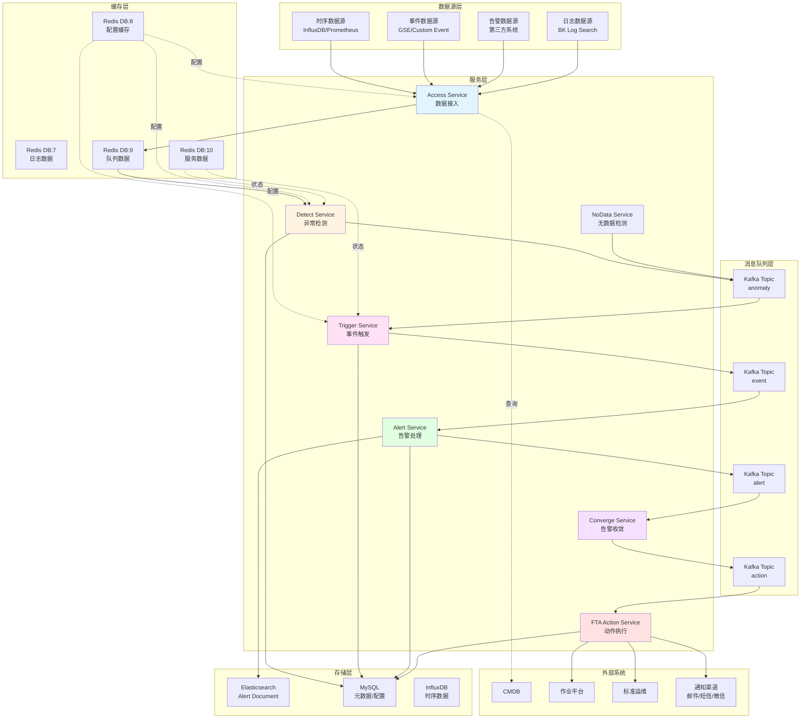
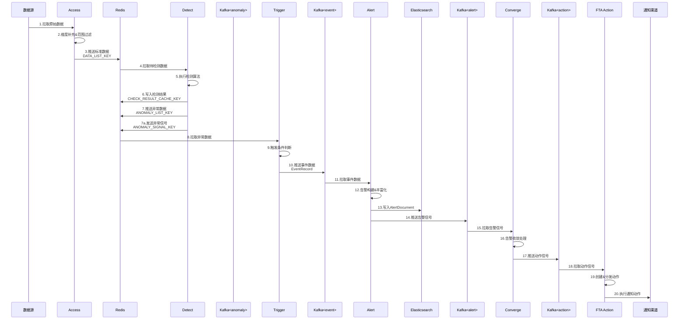
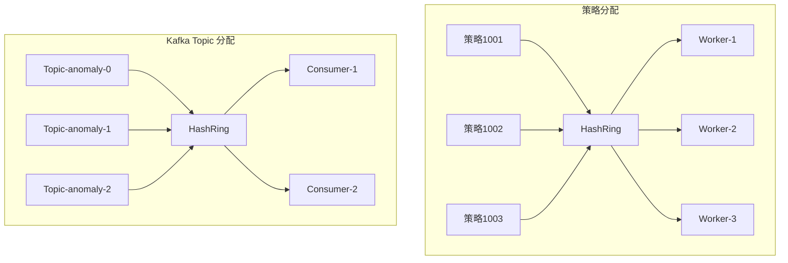
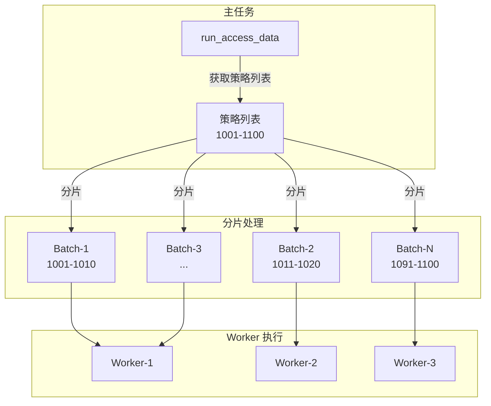
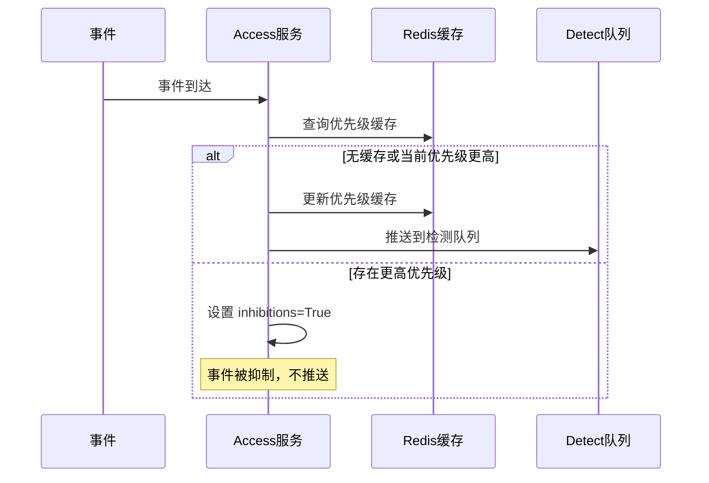
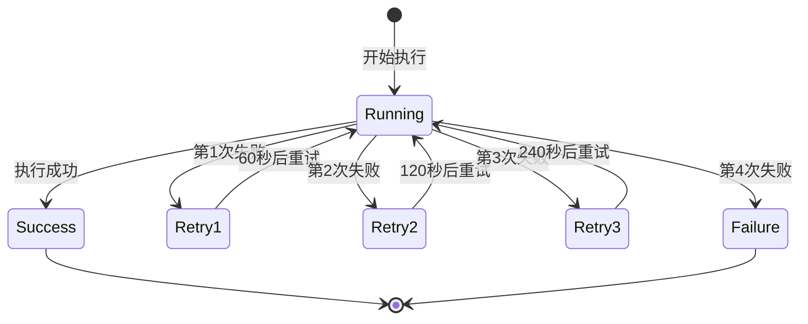

# alarm_backends/service 模块架构与数据流设计文档

## 1. 模块概述

`alarm_backends/service` 是蓝鲸监控平台告警后台处理服务的核心模块,负责完整的告警处理链路,从数据接入、异常检测、事件触发到最终的告警通知与自愈动作执行。该模块采用分布式微服务架构,基于 Celery 任务队列实现异步处理,通过 Kafka 和 Redis 实现服务间的消息传递与数据共享。

### 核心职责

- **数据接入**: 从多种数据源拉取监控数据、事件数据和告警数据
- **异常检测**: 基于配置的检测算法进行数据分析和异常识别
- **事件触发**: 根据触发条件判断是否产生告警事件
- **告警处理**: 对告警进行收敛、丰富化处理并写入存储
- **动作执行**: 执行通知、自愈套餐等处理动作
- **关联策略**: 基于多条件组合的复合告警策略处理
- **故障管理**: 故障事件的接入、关联和管理

### 模块目录结构

```
alarm_backends/service/
├── access/           # 数据接入模块
│   ├── data/         # 时序数据接入
│   ├── event/        # 事件数据接入（GSE基础告警、自定义事件等）
│   ├── incident/     # 故障接入（故障事件处理）
│   └── alert/        # 告警接入（第三方告警源）
├── detect/           # 异常检测模块
├── trigger/          # 事件触发模块
├── nodata/           # 无数据检测模块
├── alert/            # 告警处理模块
│   ├── builder/      # 告警构建器
│   └── manager/      # 告警管理器
├── composite/        # 关联策略处理模块（复合告警策略）
├── converge/         # 告警收敛模块
├── fta_action/       # 动作执行模块（故障自愈动作）
├── new_report/       # 新报表模块（定时报表生成）
└── scheduler/        # 调度器模块（任务调度管理）
```

### 技术栈

- **编程语言**: Python 3.11
- **Web 框架**: Django
- **任务队列**: Celery
- **消息队列**: Kafka
- **缓存存储**: Redis
- **时序存储**: InfluxDB / Elasticsearch
- **文档存储**: Elasticsearch (AlertDocument)

## 2. 系统架构图



## 3. 数据流向分析

### 3.1 完整数据流转路径



### 3.2 关键数据节点说明

| 数据节点 | 数据类型 | 存储位置 | 生产者 | 消费者 | 过期策略 |
|---------|---------|---------|--------|--------|---------|
| 原始数据 | 时序/事件 | 数据源 | 采集器 | Access | - |
| 标准数据 | DataPoint | Redis List | Access | Detect | 检测后清理 |
| 检测结果 | CheckResult | Redis SortedSet | Detect | Trigger | 30个周期 |
| 异常数据 | AnomalyRecord | Redis List | Detect | Trigger | 检测后清理 |
| 异常信号 | Signal | Redis Set | Detect | Trigger | 处理后清理 |
| 事件数据 | EventRecord | Kafka Topic | Trigger | Alert | Kafka保留期 |
| 告警数据 | AlertDocument | Elasticsearch | Alert | Converge/Action | 按索引策略 |
| 动作信号 | ActionSignal | Kafka Topic | Converge | Action | Kafka保留期 |

## 4. 数据格式示例

### 4.0 ID 类型说明

系统中使用了多种不同格式的 ID，用于标识不同阶段的数据对象。下表对这些 ID 类型进行说明：

| ID 类型 | 用途 | 格式 | 示例 | 生成位置 |
|--------|------|------|------|---------|
| `record_id` | 数据点唯一标识 | `{dimensions_md5}.{timestamp}` | `55a76cf628e46c04a052f4e19bdb9dbf.1569246480` | Access 阶段 |
| `anomaly_id` | 异常记录标识 | `{dimensions_md5}.{timestamp}.{strategy_id}.{item_id}.{level}` | `55a76cf628e46c04a052f4e19bdb9dbf.1569246480.1001.37.1` | Detect 阶段 |
| `alert_id` | 告警文档唯一ID | `{10位时间戳}{自增序列号}` | `15692464801` | Alert 阶段 |

**关键区别说明**：

1. **record_id**：由数据维度的 MD5 哈希值与时间戳拼接而成，用于标识唯一的数据点
2. **anomaly_id**：在 `record_id` 基础上追加策略ID、监控项ID和告警级别，用于标识具体的异常检测记录
3. **alert_id**：由 `AlertUIDManager.generate()` 生成，格式为 10 位 Unix 时间戳（秒）+ 自增序列号，用于 AlertDocument 的主键

> **注意**：在 AlertDocument 中：
> - 顶层 `id` 字段使用 `alert_id` 格式（如 `15692464801`）
> - 内嵌的 `event.event_id` 字段使用 `anomaly_id` 格式（来源于 Trigger 阶段生成的事件ID）

### 4.1 Access 阶段 - 标准数据 (DataPoint)

**Redis Key**: `{prefix}.access.data.{strategy_id}.{item_id}`

```json
{
  "record_id": "55a76cf628e46c04a052f4e19bdb9dbf.1569246480",
  "value": 1.38,
  "values": {
    "timestamp": 1569246480,
    "load5": 1.38,
    "cpu_usage": 85.5
  },
  "dimensions": {
    "ip": "10.0.1.100",
    "bk_cloud_id": "0",
    "bk_target_ip": "10.0.1.100",
    "bk_target_cloud_id": "0"
  },
  "time": 1569246480
}
```

**关键字段说明**:
- `record_id`: 记录唯一标识, 格式为 `{dimensions_md5}.{timestamp}`
- `value`: 主指标当前值
- `values`: 包含时间戳和所有指标值的字典
- `dimensions`: 维度信息,用于数据聚合和告警分组
- `time`: 数据时间戳(秒级)

### 4.2 Detect 阶段 - 异常数据 (AnomalyRecord)

**Kafka Topic**: `{prefix}.detect.anomaly.list.{strategy_id}.{item_id}`

```json
{
  "data": {
    "record_id": "55a76cf628e46c04a052f4e19bdb9dbf.1569246480",
    "value": 91.5,
    "values": {
      "timestamp": 1569246480,
      "cpu_usage": 91.5
    },
    "dimensions": {
      "ip": "10.0.1.100",
      "bk_cloud_id": "0"
    },
    "time": 1569246480
  },
  "anomaly": {
    "1": {
      "anomaly_message": "CPU使用率 >= 90.0%, 当前值91.5%",
      "anomaly_id": "55a76cf628e46c04a052f4e19bdb9dbf.1569246480.1001.37.1",
      "anomaly_time": "2019-09-23 18:48:00"
    },
    "2": {
      "anomaly_message": "CPU使用率 >= 80.0%, 当前值91.5%",
      "anomaly_id": "55a76cf628e46c04a052f4e19bdb9dbf.1569246480.1001.37.2",
      "anomaly_time": "2019-09-23 18:48:00"
    }
  },
  "strategy_snapshot_key": "cache.strategy.snapshot.1001.1569200000",
  "context": {}
}
```

**关键字段说明**:
- `data`: 原始数据点信息
- `anomaly`: 各告警级别的异常信息字典
  - key: 告警级别(1最高,3最低)
  - `anomaly_id`: 格式为 `{dimensions_md5}.{timestamp}.{strategy_id}.{item_id}.{level}`
  - `anomaly_message`: 告警描述信息
- `strategy_snapshot_key`: 策略快照缓存键,用于获取检测时的策略配置

### 4.3 Trigger 阶段 - 事件数据 (EventRecord)

**Kafka Topic**: `{prefix}.trigger.event`

```json
{
  "data": {
    "record_id": "55a76cf628e46c04a052f4e19bdb9dbf.1569246480",
    "value": 91.5,
    "values": {
      "timestamp": 1569246480,
      "cpu_usage": 91.5
    },
    "dimensions": {
      "ip": "10.0.1.100",
      "bk_cloud_id": "0"
    },
    "time": 1569246480
  },
  "anomaly": {
    "1": {
      "anomaly_message": "CPU使用率 >= 90.0%, 当前值91.5%",
      "anomaly_id": "55a76cf628e46c04a052f4e19bdb9dbf.1569246480.1001.37.1",
      "anomaly_time": "2019-09-23 18:48:00"
    },
    "2": {
      "anomaly_message": "CPU使用率 >= 80.0%, 当前值91.5%",
      "anomaly_id": "55a76cf628e46c04a052f4e19bdb9dbf.1569246480.1001.37.2",
      "anomaly_time": "2019-09-23 18:48:00"
    }
  },
  "strategy_snapshot_key": "cache.strategy.snapshot.1001.1569200000",
  "trigger": {
    "level": "1",
    "anomaly_ids": [
      "55a76cf628e46c04a052f4e19bdb9dbf.1569246360.1001.37.1",
      "55a76cf628e46c04a052f4e19bdb9dbf.1569246420.1001.37.1",
      "55a76cf628e46c04a052f4e19bdb9dbf.1569246480.1001.37.1"
    ]
  },
  "context": {}
}
```

**关键字段说明**:
- `trigger`: 触发信息
  - `level`: 触发的告警级别
  - `anomaly_ids`: 触发条件窗口内的所有异常ID列表

### 4.4 Alert 阶段 - 告警文档 (AlertDocument)

**Elasticsearch Index**: `{index_prefix}_alert_*`

> **注意**: `id` 字段为告警唯一标识（alert_id），格式为 `{10位时间戳}{自增序列号}`，由 `AlertUIDManager.generate()` 生成。
> 这与 `event.event_id`（anomaly_id 格式）不同，后者格式为 `{dimensions_md5}.{timestamp}.{strategy_id}.{item_id}.{level}`。

```json
{
  "id": "15692464801",
  "alert_name": "CPU使用率过高",
  "status": "ABNORMAL",
  "severity": 1,
  "bk_biz_id": 2,
  "strategy_id": 1001,
  "begin_time": 1569246360,
  "create_time": 1569246480,
  "latest_time": 1569246480,
  "end_time": null,
  "duration": 120,
  "event": {
    "id": "C92Df021945DB2D72A48f3b649AEAFa4.1569246480.1001.37.1",
    "event_id": "C92Df021945DB2D72A48f3b649AEAFa4.1569246480.1001.37.1",
    "plugin_id": "bkmonitor",
    "strategy_id": 1001,
    "alert_name": "CPU使用率过高",
    "description": "新告警, CPU使用率 >= 90.0%, 当前值91.5%",
    "severity": 1,
    "target_type": "HOST",
    "target": "10.0.1.100",
    "metric": ["system.cpu_summary.usage"],
    "category": "os",
    "time": 1569246480,
    "bk_biz_id": 2
  },
  "dimensions": [
    {
      "key": "bk_target_ip",
      "value": "10.0.1.100",
      "display_key": "目标IP",
      "display_value": "10.0.1.100"
    },
    {
      "key": "bk_target_cloud_id",
      "value": "0",
      "display_key": "云区域ID",
      "display_value": "默认区域"
    }
  ],
  "agg_dimensions": ["bk_target_ip", "bk_target_cloud_id"],
  "assignee": ["admin", "operator"],
  "appointee": [],
  "is_ack": false,
  "is_shielded": false,
  "shield_ids": [],
  "extra_info": {
    "strategy": {
      "id": 1001,
      "name": "CPU使用率监控",
      "scenario": "host_process"
    },
    "origin_alarm": {
      "data": {
        "record_id": "55a76cf628e46c04a052f4e19bdb9dbf.1569246480",
        "value": 91.5,
        "values": {
          "timestamp": 1569246480,
          "cpu_usage": 91.5
        },
        "dimensions": {
          "ip": "10.0.1.100",
          "bk_cloud_id": "0"
        },
        "time": 1569246480
      },
      "trigger": {
        "level": "1",
        "anomaly_ids": [
          "55a76cf628e46c04a052f4e19bdb9dbf.1569246360.1001.37.1",
          "55a76cf628e46c04a052f4e19bdb9dbf.1569246420.1001.37.1",
          "55a76cf628e46c04a052f4e19bdb9dbf.1569246480.1001.37.1"
        ]
      },
      "anomaly": {
        "1": {
          "anomaly_message": "CPU使用率 >= 90.0%, 当前值91.5%",
          "anomaly_id": "55a76cf628e46c04a052f4e19bdb9dbf.1569246480.1001.37.1",
          "anomaly_time": "2019-09-23 18:48:00"
        }
      },
      "dimension_translation": {
        "bk_target_ip": {
          "value": "10.0.1.100",
          "display_name": "目标IP",
          "display_value": "10.0.1.100"
        }
      }
    }
  }
}
```

**关键字段说明**:
- `id`: 告警唯一标识（alert_id），格式为 `{10位时间戳}{自增序列号}`，示例 `15692464801` 表示时间戳 `1569246480` + 序列号 `1`
- `event.event_id`: 事件ID（anomaly_id 格式），来源于 Trigger 阶段生成的异常ID
- `status`: 告警状态(ABNORMAL/RECOVERED/CLOSED)
- `severity`: 告警级别(1-致命, 2-预警, 3-提醒)
- `begin_time`: 告警首次产生时间
- `latest_time`: 最近一次异常时间
- `duration`: 告警持续时间(秒)
- `dimensions`: 告警维度列表
- `agg_dimensions`: 聚合维度字段名列表
- `extra_info`: 扩展信息,包含策略和原始告警详情

### 4.5 Action 阶段 - 动作实例 (ActionInstance)

**MySQL Table**: `bkmonitor_action_instance`

```json
{
  "id": 123456,
  "signal": "abnormal",
  "strategy_id": 1001,
  "alert_ids": ["55a76cf628e46c04a052f4e19bdb9dbf.1569246480.1001.37.1"],
  "alerts": ["55a76cf628e46c04a052f4e19bdb9dbf.1569246480.1001.37.1"],
  "action_config": {
    "id": 1,
    "plugin_id": 1,
    "plugin_type": "notice",
    "is_enabled": true,
    "name": "通知处理套餐",
    "bk_biz_id": 2,
    "execute_config": {
      "template_detail": {
        "method": "POST",
        "url": "",
        "headers": [],
        "body": {}
      }
    },
    "config": {
      "alarm_interval": 1440,
      "send_recovery_alarm": true,
      "need_poll": false
    }
  },
  "action_plugin": {
    "id": 1,
    "name": "通知",
    "plugin_type": "notice",
    "plugin_key": "notice"
  },
  "inputs": {
    "notice_ways": [
      {"level": 1, "notice_ways": ["weixin", "mail"]},
      {"level": 2, "notice_ways": ["weixin"]},
      {"level": 3, "notice_ways": ["mail"]}
    ],
    "notice_receiver": ["user#admin", "user#operator"]
  },
  "outputs": {},
  "status": "success",
  "create_time": "2019-09-23 18:48:05",
  "update_time": "2019-09-23 18:48:10",
  "end_time": "2019-09-23 18:48:10",
  "ex_data": {}
}
```

**关键字段说明**:
- `signal`: 触发信号类型(abnormal/recovered/closed/ack等)
- `action_config`: 动作配置详情
- `action_plugin`: 动作插件信息
- `inputs`: 动作执行输入参数
- `outputs`: 动作执行输出结果
- `status`: 执行状态(running/success/failure/skipped)

## 5. 字段转换规则

### 5.1 Access → Detect 字段转换

| Access字段 | Detect字段 | 转换规则 | 说明 |
|-----------|-----------|---------|------|
| record_id | data.record_id | 直接传递 | 记录唯一标识 |
| value | data.value | 直接传递 | 主指标值 |
| values | data.values | 直接传递 | 所有指标值字典 |
| dimensions | data.dimensions | 维度补充 | 可能添加CMDB信息 |
| time | data.time | 直接传递 | 数据时间戳 |
| - | anomaly.{level} | 算法检测生成 | 异常级别信息 |
| - | strategy_snapshot_key | 策略快照生成 | 策略配置引用 |

**维度补充逻辑**:
- 主机监控: 补充 bk_host_id, bk_cloud_id, bk_biz_id
- 进程监控: 补充 bk_process_id
- 服务拓扑: 补充 bk_inst_id, bk_obj_id

### 5.2 Detect → Trigger 字段转换

| Detect字段 | Trigger字段 | 转换规则 | 说明 |
|-----------|------------|---------|------|
| data | data | 完整传递 | 数据点信息 |
| anomaly | anomaly | 完整传递 | 异常信息 |
| strategy_snapshot_key | strategy_snapshot_key | 直接传递 | 策略快照引用 |
| - | trigger.level | 触发判断生成 | 触发级别 |
| - | trigger.anomaly_ids | 窗口内异常聚合 | 异常ID列表 |

**触发判断逻辑**:
- 从Redis `CHECK_RESULT_CACHE_KEY` 获取检测窗口内结果
- 统计带 `ANOMALY` 标签的数据点数量
- 按级别从高到低判断,满足触发条件则生成 trigger 信息

### 5.3 Trigger → Alert 字段转换

| Trigger字段 | Alert字段 | 转换规则 | 说明 |
|------------|----------|---------|------|
| data.dimensions | dimensions | 维度对象化 | 转为dimension对象列表 |
| data.dimensions.* | agg_dimensions | 提取维度键 | 聚合维度字段名 |
| trigger.anomaly_ids[0] | id | 首个异常ID | 告警唯一标识 |
| anomaly.{level}.anomaly_message | event.description | 拼接告警描述 | 事件描述信息 |
| data.time | begin_time | 首次异常时间 | 告警开始时间 |
| data.time | latest_time | 当前数据时间 | 最新异常时间 |
| strategy_snapshot | strategy_id | 从快照提取 | 策略ID |
| - | status | 固定为ABNORMAL | 告警状态 |
| - | assignee | 策略配置获取 | 通知人列表 |

**维度对象化示例**:
```json
// 输入: data.dimensions
{
  "bk_target_ip": "10.0.1.100",
  "bk_target_cloud_id": "0"
}

// 输出: dimensions
[
  {
    "key": "bk_target_ip",
    "value": "10.0.1.100",
    "display_key": "目标IP",
    "display_value": "10.0.1.100"
  },
  {
    "key": "bk_target_cloud_id",
    "value": "0",
    "display_key": "云区域ID",
    "display_value": "默认区域"
  }
]
```

### 5.4 Alert → Action 字段转换

| Alert字段 | Action字段 | 转换规则 | 说明 |
|----------|-----------|---------|------|
| id | alert_ids | 聚合为列表 | 关联告警ID列表 |
| strategy_id | strategy_id | 直接传递 | 策略ID |
| - | signal | 根据告警状态生成 | abnormal/recovered/closed |
| strategy.actions | action_config | 策略配置映射 | 动作配置详情 |
| dimensions | inputs.dimensions | 维度信息传递 | 用于模板渲染 |
| assignee | inputs.notice_receiver | 通知人转换 | 通知接收人 |

**Signal生成规则**:
- 新产生告警: abnormal
- 告警恢复: recovered  
- 告警关闭: closed
- 告警确认: ack
- 手动触发: manual

## 6. 后台任务分析

### 6.1 Access Service 任务

#### 6.1.1 run_access_data (周期任务)

**触发机制**: Celery Beat 定时调度,默认周期根据策略聚合间隔配置

**执行流程**:
1. 从策略缓存获取待处理的策略列表
2. 按照策略分组周期(agg_interval)进行数据拉取
3. 对每个策略的每个监控项(item)执行数据拉取
4. 推送标准化数据到 Redis 队列

**关键参数**:
- `strategy_id`: 策略ID
- `item_id`: 监控项ID
- `agg_interval`: 聚合周期(秒)

**监控指标**:
- `access_data_pull_count`: 拉取数据点数量
- `access_data_push_count`: 推送数据点数量
- `access_data_duration`: 处理耗时

#### 6.1.2 run_access_event_handler (事件驱动)

**触发机制**: 从 Kafka 消费事件数据,检测到新事件时触发

**执行流程**:
1. 从 Kafka 拉取事件数据(GSE基础告警/自定义事件/进程事件)
2. 根据事件类型实例化对应的事件记录对象
3. 进行策略匹配和过滤(条件过滤/过期过滤/主机状态过滤)
4. 推送匹配的异常点到检测队列

**事件类型**:
- `AgentEvent`: Agent心跳事件
- `DiskFullEvent`: 磁盘写满事件
- `DiskReadonlyEvent`: 磁盘只读事件
- `OOMEvent`: OOM事件
- `CorefileEvent`: Corefile事件
- `PingEvent`: Ping异常事件
- `GseProcessEventRecord`: GSE进程事件

#### 6.1.3 run_access_real_time (实时数据)

**触发机制**: 持续运行,处理实时数据流

**执行流程**:
1. 建立与实时数据源的连接
2. 持续拉取实时数据点
3. 进行数据标准化处理
4. 推送到 Detect 队列

### 6.2 Detect Service 任务

#### 6.2.1 run_detect (周期任务)

**触发机制**: Celery 任务,由信号触发或周期调度

**执行流程**:
1. 从 Redis 拉取待检测数据 (`DATA_LIST_KEY`)
2. 生成策略快照 (`STRATEGY_SNAPSHOT_KEY`)
3. 按照监控项配置的检测算法进行数据检测
4. 将检测结果写入 Redis (`CHECK_RESULT_CACHE_KEY`)
5. 更新维度最后检测时间 (`LAST_CHECKPOINTS_CACHE_KEY`)
6. 推送异常数据到 Redis (`ANOMALY_LIST_KEY`)
7. 发送异常信号 (`ANOMALY_SIGNAL_KEY`)

**检测算法类型**:
- 静态阈值检测：基于固定阈值判断异常
- 同比策略(简易/高级)：与历史同期数据对比
- 环比策略(简易/高级)：与前N个周期数据对比
- 同比振幅/同比区间：同比差值的振幅或区间检测
- 环比振幅：环比差值的振幅检测
- 智能异常检测：基于机器学习的异常检测
- 异常聚类检测 (`abnormal_cluster`)：基于聚类算法的异常识别
- 主机异常检测 (`host_anomaly_detection`)：主机层面的综合异常检测
- 多变量异常检测 (`multivariate_anomaly_detection`)：多指标联合异常检测
- 系统重启检测 (`os_restart`)：检测系统重启事件
- Ping 不可达检测 (`ping_unreachable`)：检测主机网络不可达
- 进程端口检测 (`proc_port`)：检测进程端口状态
- 时序预测 (`time_series_forecasting`)：基于时序预测的异常检测

**性能优化**:
- 批量拉取数据,减少Redis操作
- 使用Pipeline批量写入检测结果
- 异步推送异常数据到Kafka

### 6.3 Trigger Service 任务

#### 6.3.1 run_trigger (事件驱动)

**触发机制**: 从 `ANOMALY_SIGNAL_KEY` 拉取异常信号触发

**执行流程**:
1. 从 `ANOMALY_LIST_KEY` 拉取异常检测结果
2. 获取策略快照,提取触发配置(check_window, trigger_count)
3. 从 `CHECK_RESULT_CACHE_KEY` 获取检测窗口内的检测结果
4. 统计异常点数量,判断是否满足触发条件
5. 生成 AnomalyRecord 写入 MySQL
6. 满足触发条件则生成 EventRecord 推送到 Kafka

**触发条件示例**:
- 配置: 5分钟内满足3次异常
- 窗口大小: 5个周期(check_window_size=5)
- 触发次数: 3次(trigger_count=3)
- 判断逻辑: 检测最近5个周期内,异常点 >= 3个

### 6.4 NoData Service 任务

#### 6.4.1 run_nodata_check (周期任务)

**触发机制**: Celery Beat 定时调度,默认每分钟执行一次

**执行流程**:
1. 获取启用无数据检测的策略列表
2. 对每个策略监控项进行无数据检测
3. 获取无数据告警维度(目标实例维度)
4. 对比历史上报数据和目标维度,判断是否无数据
5. 生成无数据异常信息,推送到 Kafka

**无数据判定逻辑**:
- 目标维度在检测窗口内未上报数据
- 或数据上报时间早于上次检测点
- 标记特殊维度 `__NO_DATA_DIMENSION__=true`

### 6.5 Alert Service 任务

#### 6.5.1 run_alert_manager (事件驱动)

**触发机制**: 从 Kafka 拉取事件数据触发

**执行流程**:
1. 从 Kafka 消费事件数据
2. 根据告警键(AlertKey)查询或创建告警文档
3. 执行告警状态检查器链(NextStatusChecker, RecoverStatusChecker等)
4. 丰富化告警信息(维度翻译/CMDB信息/关联信息)
5. 将告警文档写入 Elasticsearch
6. 推送告警信号到 Kafka,触发后续处理

**告警状态检查器**:
- `NextStatusChecker`: 下一状态检查
- `CloseStatusChecker`: 关闭状态检查
- `RecoverStatusChecker`: 恢复状态检查
- `ShieldStatusChecker`: 屏蔽状态检查
- `AckChecker`: 确认状态检查
- `UpgradeChecker`: 告警升级检查
- `ActionHandleChecker`: 动作处理检查

### 6.6 Converge Service 任务

#### 6.6.1 run_converge (事件驱动)

**触发机制**: 从 Kafka 拉取告警信号触发

**执行流程**:
1. 从 Kafka 消费告警信号
2. 根据收敛配置判断是否需要收敛
3. 计算收敛维度和收敛时间窗口
4. 查询时间窗口内相同维度的告警
5. 判断是否达到收敛条件(次数/时间)
6. 创建或更新收敛实例(ConvergeInstance)
7. 推送动作信号到 Kafka

**收敛维度类型**:
- 策略维度: `strategy_id`
- 业务维度: `bk_biz_id`
- 告警维度: 告警的 dimensions
- 自定义维度: 配置的任意字段组合

**收敛函数**:
- `collect`: 汇总收敛，将多个告警合并为一个通知
- `collect_alarm`: 告警汇总，按时间窗口聚合告警
- `defense`: 告警防御，超过阈值则不再产生新动作
- `skip_when_success`: 成功后跳过，前一个动作成功则跳过当前动作
- `approve_when_failed`: 失败时审批，动作失败时触发审批流程
- `skip_when_proceed`: 执行中跳过，有相同动作正在执行则跳过
- `wait_when_proceed`: 执行中等待，有相同动作正在执行则等待
- `skip_when_exceed`: 超出后跳过，超过收敛阈值则跳过
- `relevance`: 汇集相关事件，聚合关联的告警事件
- `trigger`: 收敛后处理，收敛完成后触发后续动作

### 6.7 FTA Action Service 任务

#### 6.7.1 dispatch_action_task (事件驱动)

**触发机制**: 从 Kafka 拉取动作信号触发

**执行流程**:
1. 从 Kafka 消费动作信号
2. 创建动作实例(ActionInstance)
3. 根据动作类型分发到不同队列
4. 执行动作处理器(NoticeProcessor/WebhookProcessor等)
5. 记录执行结果和日志

**动作队列**:
- `celery_action`: 通用动作分发队列
- `celery_running_action`: 自愈套餐执行队列
- `celery_webhook_action`: Webhook推送队列
- `celery_notice_action`: 通知执行队列(可选)

**动作处理器目录** (`fta_action/`):
- `notice/`: 通知处理器，支持邮件、短信、企业微信等通知渠道
- `webhook/`: Webhook处理器，支持HTTP回调
- `job/`: 作业平台处理器，执行JOB脚本任务
- `sops/`: 标准运维处理器，执行SOPS流程任务
- `message_queue/`: 消息队列处理器，推送消息到消息队列
- `collect/`: 采集处理器，执行采集相关动作
- `common/`: 通用处理器，处理通用动作逻辑
- `bk_incident/`: 故障管理处理器，创建和更新故障事件

#### 6.7.2 run_notice_action (异步任务)

**触发机制**: 从 `dispatch_action_task` 分发

**执行流程**:
1. 获取通知配置和接收人列表
2. 渲染通知模板(Jinja2)
3. 根据通知方式调用对应通知渠道
4. 处理通知汇总和防重
5. 记录通知结果

**通知方式**:
- `weixin`: 企业微信
- `mail`: 邮件
- `sms`: 短信
- `voice`: 语音
- `wxwork-bot`: 企业微信机器人

#### 6.7.3 run_webhook_action (异步任务)

**触发机制**: 从 `dispatch_action_task` 分发

**执行流程**:
1. 获取Webhook配置(URL/Headers/Body)
2. 渲染请求参数模板
3. 发送HTTP请求
4. 处理响应结果和重试

#### 6.7.4 run_job_action (异步任务)

**触发机制**: 从 `dispatch_action_task` 分发

**执行流程**:
1. 获取作业配置(脚本/参数)
2. 调用作业平台API执行作业
3. 轮询作业执行状态
4. 获取执行结果和日志

#### 6.7.5 run_sops_action (异步任务)

**触发机制**: 从 `dispatch_action_task` 分发

**执行流程**:
1. 获取标准运维流程配置
2. 创建流程任务实例
3. 启动流程执行
4. 轮询流程状态
5. 获取执行结果

#### 6.7.6 sync_action_to_es (定时任务)

**触发机制**: Celery Beat 定时调度,每10分钟执行一次

**执行流程**:
1. 查询最近创建的动作实例
2. 将动作实例数据同步到 Elasticsearch
3. 更新同步时间戳

## 7. 关键代码实现方案

### 7.1 数据接入处理 (Access)

**核心类**: `AccessDataProcess`

**设计模式**: 模板方法模式 + 策略模式

**关键方法**:

- `pull()`: 从数据源拉取原始数据
  - 调用 `QueryAPI` 查询时序数据
  - 支持多种数据源(InfluxDB/Prometheus/ES)
  - 处理查询超时和异常

- `handle()`: 数据处理和标准化
  - 维度补充: 从CMDB获取主机/进程信息
  - 范围过滤: 基于目标范围过滤数据
  - 数据转换: 转为DataPoint对象

- `push()`: 推送标准化数据到队列
  - 序列化数据为JSON
  - 批量推送到Redis List
  - 发送处理信号

**性能优化策略**:
- 批量拉取: 一次拉取多个监控项数据
- 并行处理: 使用进程池并行处理策略
- 缓存复用: CMDB数据缓存1小时
- 连接池: 复用数据源连接

### 7.2 异常检测处理 (Detect)

**核心类**: `DetectProcessor`

**设计模式**: 责任链模式 + 工厂模式

**关键方法**:

- `gen_strategy_snapshot()`: 生成策略快照
  - 获取策略完整配置
  - 序列化为JSON存入Redis
  - 返回快照键用于后续引用

- `pull_data()`: 拉取待检测数据
  - 从Redis List批量拉取
  - 转换为DataPoint对象列表
  - 按监控项分组

- `handle_data()`: 执行检测算法
  - 根据算法类型加载检测器
  - 执行detect方法获取异常点
  - 生成AnomalyDataPoint对象

- `push_data()`: 推送异常数据
  - 序列化异常数据
  - 推送到Kafka Topic
  - 发送异常信号到Redis Set

**检测算法实现**:
- `ThresholdDetector`: 静态阈值检测
  - 支持多条件组合(AND/OR)
  - 支持多种比较运算符(>/>=/<=/</==/!=)
  
- `YearRoundAmplitudeDetector`: 同比振幅检测
  - 计算历史N天同时刻差值
  - 对比当前差值与历史差值
  
- `AdvancedRingRatioDetector`: 高级环比检测
  - 计算前N个周期均值
  - 对比当前值与均值偏离度

**异常处理策略**:
- 算法异常: 记录日志,跳过当前检测
- 数据异常: 标记无效数据,不参与检测
- 超时保护: 单次检测超时10秒则中断

### 7.3 事件触发处理 (Trigger)

**核心类**: `AnomalyChecker`

**设计模式**: 策略模式

**关键方法**:

- `check_anomaly()`: 异常触发检查
  - 按告警级别从高到低遍历
  - 调用`_check_anomaly_by_level`判断
  - 高级别触发则跳过低级别

- `_check_anomaly_by_level()`: 级别触发判断
  - 获取触发配置(窗口大小/触发次数)
  - 从Redis SortedSet获取检测窗口内结果
  - 统计异常点数量
  - 对比触发阈值

- `gen_event_record()`: 生成事件记录
  - 构造EventRecord对象
  - 包含触发级别和异常ID列表
  - 添加触发时间和策略快照引用

**触发优化策略**:
- 级别短路: 高级别触发后不再检查低级别
- 窗口缓存: 检测结果缓存30个周期
- 批量查询: 一次性获取窗口内所有数据

### 7.4 告警处理 (Alert)

**核心类**: `AlertManager`

**设计模式**: 责任链模式 + 构建器模式

**关键方法**:

- `process()`: 告警处理主流程
  - 加锁防止并发处理同一告警
  - 按顺序执行检查器链
  - 处理告警状态变更
  - 推送告警信号

- `build_alert()`: 构建告警文档
  - 从事件数据提取信息
  - 查询策略配置和通知人
  - 丰富化维度信息
  - 构造AlertDocument对象

- `enrich_dimensions()`: 丰富化维度
  - CMDB信息查询和翻译
  - 拓扑路径查询
  - IP地址转主机名
  - 自定义维度处理

**告警状态机**:
```
[ABNORMAL] --恢复--> [RECOVERED]
[ABNORMAL] --关闭--> [CLOSED]
[RECOVERED] --再次异常--> [ABNORMAL]
```

**性能优化策略**:
- 分布式锁: 使用Redis实现告警级别锁
- 批量写入: Elasticsearch bulk API
- 异步处理: 丰富化操作异步执行
- 缓存策略: CMDB数据缓存

### 7.5 告警收敛 (Converge)

**核心类**: `ConvergeProcessor`

**设计模式**: 策略模式 + 工厂模式

**关键方法**:

- `get_dimension()`: 计算收敛维度
  - 提取收敛维度配置
  - 从告警中提取维度值
  - 生成维度哈希值

- `check_converge()`: 判断是否收敛
  - 查询时间窗口内相同维度告警
  - 统计告警数量
  - 对比收敛阈值

- `execute_converge_func()`: 执行收敛函数
  - `collect`: 汇总收敛,合并通知
  - `defense`: 告警防御,超阈值丢弃

**收敛算法**:
- 时间窗口: 滑动窗口,支持固定窗口和动态窗口
- 维度聚合: 支持多维度组合聚合
- 阈值判断: 次数阈值和时间阈值

### 7.6 动作执行 (FTA Action)

**核心类**: `BaseActionProcessor`

**设计模式**: 模板方法模式 + 责任链模式

**关键方法**:

- `create()`: 创建动作实例
  - 根据告警和策略配置创建
  - 生成动作ID和执行参数
  - 保存到MySQL

- `dispatch()`: 分发动作到执行队列
  - 根据动作类型选择队列
  - 推送到Celery队列
  - 记录分发时间

- `execute()`: 执行动作处理
  - 获取动作配置和参数
  - 调用具体处理器执行
  - 处理执行结果和异常
  - 更新动作状态

- `handle_callback()`: 处理异步回调
  - 接收外部系统回调
  - 更新动作执行状态
  - 触发后续流程

**熔断机制**:
- 熔断维度: strategy_id/bk_biz_id/data_source
- 熔断检测: 创建阶段和执行阶段双重检测
- 熔断策略: message_queue 创建阶段熔断,其他类型执行阶段熔断
- 参数保存: 通知类动作熔断时保存参数支持重放

**重试机制**:
- 重试次数: 根据动作类型配置,默认3次
- 重试间隔: 指数退避策略
- 失败处理: 记录失败原因和日志

**异常处理策略**:
- 网络异常: 自动重试
- 超时异常: 标记超时并重试
- 业务异常: 记录错误信息,不重试
- 未知异常: 记录堆栈,人工介入

### 7.7 数据存储与查询

**Kafka Topic 配置**:

| Topic | 分区数 | 副本数 | 保留期 | 生产者 | 消费者 |
|-------|--------|--------|--------|--------|--------|
| anomaly | 8 | 2 | 7天 | Detect | Trigger |
| event | 8 | 2 | 7天 | Trigger | Alert |
| alert | 16 | 2 | 7天 | Alert | Converge |
| action | 16 | 2 | 7天 | Converge | Action |

**Redis Key 设计**:

```
# 配置缓存 (DB:8)
bk_monitor.ee.config.strategy_{strategy_id}           # 策略详情
bk_monitor.ee.config.strategy_ids                     # 策略ID列表
bk_monitor.ee.cache.strategy.snapshot.{strategy_id}.{update_time}  # 策略快照

# 数据队列 (DB:9)
bk_monitor.ee.access.data.{strategy_id}.{item_id}     # 待检测数据队列
bk_monitor.ee.detect.anomaly.list.{strategy_id}.{item_id}  # 异常数据队列
bk_monitor.ee.detect.anomaly.signal                   # 异常信号队列

# 服务数据 (DB:10)
bk_monitor.ee.detect.result.{strategy_id}.{item_id}.{dimensions_md5}.{level}  # 检测结果
bk_monitor.ee.detect.last.checkpoint.{strategy_id}.{item_id}  # 最后检测点
bk_monitor.ee.detect.md5.dimension.{service}.{strategy_id}.{item_id}  # 维度映射
```

**Elasticsearch 索引设计**:

```
# 告警索引
{index_prefix}_alert_v2_{yyyyMM}
- 按月分片
- 7+3副本配置
- 保留90天

# 动作索引
{index_prefix}_action_v2_{yyyyMM}
- 按月分片
- 保留30天
```

### 7.8 监控与可观测性

**性能指标**:
- 数据处理速率: 每秒处理数据点数
- 告警产生速率: 每秒产生告警数
- 动作执行速率: 每秒执行动作数
- 服务延迟: 各阶段处理延迟分布

**链路追踪**:
- 使用 `strategy_id` 和 `dimensions_md5` 作为追踪标识
- 记录各阶段处理时间戳
- 构建完整处理链路

**日志规范**:
- 格式: `[{service}] {level} [{strategy_id}.{item_id}] {message}`
- 级别: DEBUG/INFO/WARNING/ERROR/CRITICAL
- 关键日志: 处理开始/结束/异常/性能

**告警监控**:
- 服务存活: 心跳检测
- 队列积压: Kafka Lag监控
- 处理异常: 异常率监控
- 资源使用: CPU/内存/网络监控

## 8. 分布式设计

本章节描述系统的分布式设计方案，包括分布式锁、数据分片、限流、熔断等核心机制，以实现系统的高可用性和水平扩展能力。

### 8.1 分布式锁机制

系统使用 Redis 实现分布式锁，防止多个 Worker 节点并发处理同一数据导致的数据不一致问题。

**实现位置**: `alarm_backends/core/lock/`

#### 8.1.1 RedisLock - 单键分布式锁

```python
class RedisLock(BaseLock):
    """
    基于 Redis SETNX 实现的单键分布式锁
    
    特点：
    - 原子性操作，保证获取锁的唯一性
    - 支持锁超时自动释放
    - 支持阻塞等待获取锁
    """
    def acquire(self, _wait=0.001):
        token = uniqid4()
        # 使用 Redis SET NX EX 实现原子性加锁
        while not self.client.set(self.name, token, ex=self.ttl, nx=True):
            if time.time() < wait_until:
                time.sleep(0.01)
            else:
                return False
        self.__token = token
        return True
    
    def release(self):
        # 只有持有锁的进程才能释放锁（通过 token 校验）
        if self.client.get(self.name) == self.__token:
            self.client.delete(self.name)
```

#### 8.1.2 MultiRedisLock - 批量分布式锁

```python
class MultiRedisLock:
    """
    批量分布式锁，用于同时锁定多个资源
    
    特点：
    - Pipeline 批量操作，减少网络往返
    - 全部成功或全部失败
    - 适用于需要同时锁定多个告警的场景
    """
    def acquire(self):
        pipeline = self.client.pipeline(transaction=False)
        for key in keys:
            pipeline.set(key, self._token, ex=self.ttl, nx=True)
        results = pipeline.execute()
        # 检查是否全部获取成功
        return all(results)
```

#### 8.1.3 锁的使用场景

| 锁类型 | 使用场景 | Key 格式 | TTL |
|-------|---------|---------|-----|
| `service_lock` | 告警处理防并发 | `lock.alert.{alert_id}` | 60s |
| `share_lock` | Celery 任务防重执行 | `lock.task.{task_id}` | 300s |
| `refresh_service_lock` | 长时间任务锁续期 | 同 service_lock | 动态 |

### 8.2 一致性哈希分片

系统使用一致性哈希算法将策略和数据分配到不同的 Worker 节点，实现负载均衡和故障隔离。

**实现位置**: `alarm_backends/management/hashring.py`

#### 8.2.1 HashRing 实现

```python
class HashRing(object):
    """
    一致性哈希环实现
    
    特点：
    - 使用虚拟节点（默认 2^16 个）实现负载均衡
    - 节点增减时最小化数据迁移
    - 支持节点权重配置
    """
    def __init__(self, nodes, num_vnodes=2 ** 16):
        self.num_vnodes = num_vnodes
        self.ring = []
        self.hash2node = {}
        
        # 为每个节点创建虚拟节点
        for node, weight in nodes.items():
            multiple = int(weight * self.num_vnodes)
            for i in range(multiple):
                h = self._hash(str(node) + str(i))
                self.ring.append(h)
                self.hash2node[h] = node
        self.ring.sort()
    
    def get_node(self, key):
        """根据 key 获取对应的节点"""
        h = self._hash(key)
        # 二分查找找到第一个大于等于 h 的虚拟节点
        n = bisect_left(self.ring, h) % len(self.ring)
        return self.hash2node[self.ring[n]]
```

#### 8.2.2 使用场景



- **策略分组**：将策略按 `strategy_id` 哈希分配到不同处理进程
- **Kafka Partition 分配**：实时数据处理时，将 Partition 分配到不同 Worker
- **负载均衡**：通过虚拟节点保证数据分布均匀

### 8.3 QOS 限流机制

系统在多个阶段实现 QOS（Quality of Service）限流，防止告警洪泛和系统过载。

**实现位置**: 
- `alarm_backends/service/access/event/qos.py`
- `alarm_backends/core/alert/alert.py`

#### 8.3.1 Access 阶段 QOS

```python
class QoSMixin:
    """
    事件接入阶段的 QOS 限流
    
    限流维度：bk_biz_id + strategy_id + item_id + target_ip + level
    """
    def check_qos(self, check_client=None):
        # 按维度计数
        count_of_alarm = client.hincrby(
            key.QOS_CONTROL_KEY.get_key(), 
            key.QOS_CONTROL_KEY.get_field(dimensions_md5=dimensions_md5), 
            1
        )
        
        # 超过阈值则丢弃告警
        if count_of_alarm > settings.QOS_DROP_ALARM_THRESHOLD:
            logger.warning("QOS drop alarm: dimensions_md5=%s, count=%s", 
                          dimensions_md5, count_of_alarm)
            return True  # 被限流
        return False
```

#### 8.3.2 Alert 阶段 QOS

```python
def qos_check(self):
    """
    告警构建阶段的 QOS 限流
    
    限流维度：strategy_id + signal + severity
    """
    qos_threshold = settings.QOS_ALERT_THRESHOLD
    qos_window = settings.QOS_ALERT_WINDOW
    
    # 计算窗口期内该策略产生的告警数量
    is_blocked, current_count = self.qos_calc(signal, qos_counter, threshold)
    
    if is_blocked:
        message = "告警所属策略在当前窗口期内产生的告警数量已大于QOS阈值，当前告警被流控"
        # 标记告警为被流控状态
        self.alert.is_blocked = True
```

#### 8.3.3 QOS 配置参数

| 参数 | 默认值 | 说明 |
|-----|-------|------|
| `QOS_DROP_ALARM_THRESHOLD` | 1000 | Access 阶段单维度最大告警数 |
| `QOS_ALERT_THRESHOLD` | 500 | Alert 阶段单策略最大告警数 |
| `QOS_ALERT_WINDOW` | 60 | Alert 阶段限流窗口（秒） |

### 8.4 熔断机制

系统实现了多级熔断保护，当某个维度的处理出现异常或过载时，自动熔断以保护系统稳定性。

**实现位置**: `alarm_backends/core/circuit_breaking/`

#### 8.4.1 熔断模块枚举

```python
class CircuitBreakingModule(Enum):
    """熔断模块定义"""
    ACCESS_DATA = "access.data"      # 数据接入熔断
    ALERT_BUILDER = "alert.builder"  # 告警构建熔断
    ALERT_MANAGER = "alert.manager"  # 告警管理熔断
    ACTION = "action"                # 动作执行熔断
```

#### 8.4.2 熔断维度

| 模块 | 熔断维度 | 说明 |
|-----|---------|------|
| ACCESS_DATA | `strategy_id` | 按策略熔断 |
| ACCESS_DATA | `bk_biz_id` | 按业务熔断 |
| ACCESS_DATA | `data_source_label` | 按数据源标签熔断 |
| ACCESS_DATA | `data_type_label` | 按数据类型标签熔断 |
| ACCESS_DATA | `strategy_source` | 按数据源组合熔断 |
| ACTION | `plugin_type` | 按插件类型熔断 |

#### 8.4.3 熔断策略

```python
# 熔断检测逻辑
def check_circuit_breaking(module, dimension_key, dimension_value):
    """
    检查指定维度是否处于熔断状态
    
    熔断规则：
    - 在时间窗口内，如果失败次数超过阈值，触发熔断
    - 熔断期间，该维度的所有请求直接拒绝
    - 熔断超时后，进入半开状态，允许少量请求通过
    """
    cache_key = f"circuit_breaking.{module.value}.{dimension_key}.{dimension_value}"
    failure_count = redis_client.get(cache_key)
    
    if failure_count and int(failure_count) >= CIRCUIT_BREAKING_THRESHOLD:
        return True  # 熔断中
    return False
```

#### 8.4.4 各模块熔断行为

| 模块 | 熔断时机 | 熔断行为 |
|-----|---------|---------|
| `access.data` | 数据分发阶段 | 不再分发任务到 worker 队列 |
| `alert.builder` | 告警创建后 | 告警状态设置为被流控 |
| `action` (message_queue) | 创建阶段 | 直接拒绝创建 |
| `action` (其他类型) | 执行阶段 | 保存参数支持后续重放 |

### 8.5 任务分片调度

系统支持将大批量任务拆分为多个子任务并行执行，提高处理效率和隔离性。

**实现位置**: `alarm_backends/service/scheduler/tasks/__init__.py`

#### 8.5.1 任务分片实现

```python
def perform_sharding_task(targets, sharding_task, num_per_task=10):
    """
    任务分片调度：将 targets 分片拆分到子任务中执行
    
    参数:
        targets: 待处理的目标列表（如策略ID列表）
        sharding_task: 子任务函数
        num_per_task: 每个子任务处理的目标数量
    """
    idx = 0
    total_batches = len(targets) // num_per_task + 1
    
    while idx < total_batches:
        start_offset = idx * num_per_task
        end_offset = start_offset + num_per_task
        batch_targets = list(targets[start_offset:end_offset])
        
        if batch_targets:
            # 异步分发子任务到 Celery 队列
            sharding_task.apply_async(args=(batch_targets,))
        
        idx += 1
```

#### 8.5.2 分片策略



- **按聚合周期分组**：策略按 `agg_interval`（聚合周期）分组，同周期的策略一起处理
- **批量拆分**：大批量策略拆分为多个子任务，每个子任务处理 10 个策略
- **任务隔离**：支持按业务、集群进行任务隔离，防止互相影响

#### 8.5.3 分片配置

| 配置项 | 默认值 | 说明 |
|-------|-------|------|
| `SHARDING_NUM_PER_TASK` | 10 | 每个子任务处理的策略数 |
| `MAX_CONCURRENT_TASKS` | 100 | 最大并发子任务数 |
| `TASK_ISOLATION_ENABLED` | True | 是否启用任务隔离 |

## 9. 关键代码设计详解

本章节补充描述系统中的核心设计实现细节，包括告警 ID 生成、优先级抑制、告警去重聚合、动作重试等机制。

### 9.1 告警 ID 生成机制

告警 ID（alert_id）是 AlertDocument 的唯一标识，由 `AlertUIDManager` 类生成。

**实现位置**: `alarm_backends/core/alert/alert.py`

#### 9.1.1 AlertUIDManager 实现

```python
class AlertUIDManager:
    """
    告警 UID 管理器
    
    设计特点：
    - 格式：{10位时间戳}{自增序列号}
    - 使用序列号池预取优化，减少 Redis 访问
    - 线程安全，支持多进程环境
    """
    
    # 序列号池 - 预读取到内存减少 Redis 访问
    sequence_pool = set()
    POOL_SIZE = 100  # 序列号池大小
    
    # Redis 键定义
    SEQUENCE_REDIS_KEY = "alert.uid.sequence"
    
    @classmethod
    def preload_pool(cls, count=1):
        """
        批量从 Redis 获取序列号到本地内存池
        
        优化策略：
        - 当池中序列号不足时，一次性预取 POOL_SIZE 个
        - 减少 Redis INCR 操作的网络往返
        """
        if len(cls.sequence_pool) >= count:
            return
        
        fetch_size = max(cls.POOL_SIZE, count) - len(cls.sequence_pool)
        # 原子性递增获取序列号范围
        max_seq = cls.SEQUENCE_REDIS_KEY.client.incrby(
            cls.SEQUENCE_REDIS_KEY.get_key(), 
            fetch_size
        )
        # 填充序列号池
        cls.sequence_pool.update(range(max_seq - fetch_size + 1, max_seq + 1))
    
    @classmethod
    def pop_sequence(cls):
        """从序列号池中取出一个序列号"""
        cls.preload_pool(1)
        return cls.sequence_pool.pop()
    
    @classmethod
    def generate(cls, timestamp: int = None) -> str:
        """
        生成告警 UID
        
        格式：4 bytes 时间戳 + N bytes 自增序列号
        示例：1619775685, 1 => "16197756851"
        
        参数:
            timestamp: Unix 时间戳（秒），默认为当前时间
        
        返回:
            告警唯一ID字符串
        """
        if timestamp is None:
            timestamp = int(time.time())
        
        timestamp_str = str(timestamp)[:10]  # 取前10位
        sequence = cls.pop_sequence()
        
        return f"{timestamp_str:0>10}{sequence}"
```

#### 9.1.2 ID 解析

```python
# AlertDocument 中的 ID 解析方法
@classmethod
def parse_timestamp_by_id(cls, uuid: str) -> int:
    """
    从告警 ID 中提取时间戳
    
    示例：
    - 输入："16197756851"
    - 输出：1619775685
    """
    return int(str(uuid)[:10])
```

### 9.2 优先级抑制机制

当同一告警被多个不同优先级的策略触发时，只处理高优先级策略的告警，低优先级的告警被抑制。

**实现位置**: `alarm_backends/service/access/priority.py`

#### 9.2.1 优先级检查器

```python
class PriorityChecker:
    """
    优先级检查器
    
    设计目的：
    - 避免同一问题被多个策略重复告警
    - 高优先级策略的告警优先处理
    - 通过 Redis 缓存实现跨进程的优先级协调
    """
    
    # Redis 缓存键，存储优先级信息
    ACCESS_PRIORITY_KEY = "access.priority.{dimensions_md5}"
    
    @classmethod
    def check_records(cls, records, strategy):
        """
        检查记录列表的优先级抑制状态
        
        参数:
            records: 待检查的事件记录列表
            strategy: 当前策略配置
        
        返回:
            更新后的 records，被抑制的记录会设置 inhibitions 标记
        """
        current_priority = strategy.get("priority", 0)
        
        for record in records:
            dimensions_md5 = record.dimensions_md5
            cache_key = cls.ACCESS_PRIORITY_KEY.format(dimensions_md5=dimensions_md5)
            
            # 获取缓存中的优先级信息
            cached_priority = cls._get_cached_priority(cache_key)
            
            if cached_priority is not None and cached_priority > current_priority:
                # 存在更高优先级的策略，当前记录被抑制
                record.inhibitions[strategy["id"]] = True
            else:
                # 更新缓存中的优先级
                cls._set_cached_priority(cache_key, current_priority)
                record.inhibitions[strategy["id"]] = False
        
        return records
    
    @classmethod
    def is_inhibited(cls, record, strategy_id):
        """检查记录是否被抑制"""
        return record.inhibitions.get(strategy_id, False)
```

#### 9.2.2 优先级缓存结构

```
Redis Key: access.priority.{dimensions_md5}
Value: {
    "priority": 1,           # 当前最高优先级
    "strategy_id": 1001,     # 触发的策略ID
    "timestamp": 1619775685  # 记录时间
}
TTL: 300s（5分钟）
```

#### 9.2.3 抑制流程



### 9.3 告警去重与聚合机制

系统通过 AlertKey 对相同维度的异常事件进行去重和聚合，避免重复告警。

**实现位置**: `alarm_backends/service/alert/builder/`

#### 9.3.1 AlertKey 计算

```python
class AlertKey:
    """
    告警键，用于告警的唯一标识和去重
    
    计算规则：
    - 基于策略ID、监控项ID和聚合维度计算 MD5
    - 相同 AlertKey 的事件会聚合到同一个告警
    """
    
    @staticmethod
    def generate(strategy_id, item_id, dimensions, agg_dimensions):
        """
        生成告警键
        
        参数:
            strategy_id: 策略ID
            item_id: 监控项ID
            dimensions: 完整维度字典
            agg_dimensions: 聚合维度列表
        
        返回:
            告警键的 MD5 哈希值
        """
        # 提取聚合维度的值
        agg_values = {
            k: v for k, v in sorted(dimensions.items()) 
            if k in agg_dimensions
        }
        
        # 构建键字符串
        key_str = f"{strategy_id}.{item_id}.{json.dumps(agg_values, sort_keys=True)}"
        
        return hashlib.md5(key_str.encode()).hexdigest()
```

#### 9.3.2 告警聚合逻辑

```python
class AlertBuilder:
    """告警构建器"""
    
    def dedupe_events_to_alerts(self, events):
        """
        事件去重并聚合到告警
        
        处理逻辑：
        1. 计算每个事件的 AlertKey
        2. 按 AlertKey 分组事件
        3. 查询是否存在活跃告警
        4. 新事件创建告警或追加到已有告警
        """
        alerts_map = {}  # AlertKey -> Alert
        
        for event in events:
            alert_key = AlertKey.generate(
                event.strategy_id,
                event.item_id,
                event.dimensions,
                event.agg_dimensions
            )
            
            if alert_key in alerts_map:
                # 追加到已有告警
                alerts_map[alert_key].add_event(event)
            else:
                # 查询 ES 中是否有活跃告警
                existing_alert = self._query_active_alert(alert_key)
                
                if existing_alert:
                    existing_alert.add_event(event)
                    alerts_map[alert_key] = existing_alert
                else:
                    # 创建新告警
                    new_alert = Alert.from_event(event)
                    alerts_map[alert_key] = new_alert
        
        return list(alerts_map.values())
```

#### 9.3.3 去重维度配置

| 配置项 | 说明 | 示例 |
|-------|------|------|
| `agg_dimensions` | 聚合维度列表 | `["bk_target_ip", "bk_target_cloud_id"]` |
| `dedupe_md5` | 告警去重键 | 由 AlertKey.generate() 计算 |

### 9.4 动作执行重试机制

系统为动作执行实现了指数退避重试策略，确保在临时故障时能够自动恢复。

**实现位置**: `alarm_backends/service/fta_action/tasks/`

#### 9.4.1 重试策略实现

```python
class ActionProcessor:
    """动作处理器基类"""
    
    # 最大重试次数
    MAX_RETRY = 3
    
    # 重试间隔基数（秒）
    RETRY_BASE_INTERVAL = 60
    
    def set_finished(self, to_status, failure_type="", retry_func="execute", **kwargs):
        """
        设置动作执行完成状态
        
        参数:
            to_status: 目标状态
            failure_type: 失败类型
            retry_func: 重试时调用的函数名
        """
        if to_status == ActionStatus.FAILURE:
            if self.action.failure_times < self.MAX_RETRY:
                # 计算重试间隔（指数退避）
                # 重试间隔 = 2^failure_times * 60 秒
                # 第1次失败：60秒后重试
                # 第2次失败：120秒后重试
                # 第3次失败：240秒后重试
                countdown = (2 ** self.action.failure_times) * self.RETRY_BASE_INTERVAL
                
                # 记录失败次数
                self.action.failure_times += 1
                self.action.save()
                
                # 延迟重试
                self.wait_callback(retry_func, delta_seconds=countdown)
                
                logger.info(
                    "Action %s failed, will retry in %s seconds (attempt %s/%s)",
                    self.action.id, countdown, 
                    self.action.failure_times, self.MAX_RETRY
                )
            else:
                # 超过最大重试次数，标记为最终失败
                self.action.status = ActionStatus.FAILURE
                self.action.failure_type = failure_type
                self.action.end_time = timezone.now()
                self.action.save()
                
                logger.error(
                    "Action %s failed after %s retries",
                    self.action.id, self.MAX_RETRY
                )
        else:
            # 成功或其他状态
            self.action.status = to_status
            self.action.end_time = timezone.now()
            self.action.save()
    
    def wait_callback(self, func_name, delta_seconds):
        """
        设置延迟回调
        
        通过 Celery apply_async 的 countdown 参数实现延迟执行
        """
        from alarm_backends.service.fta_action.tasks import execute_action
        
        execute_action.apply_async(
            args=(self.action.id, func_name),
            countdown=delta_seconds
        )
```

#### 9.4.2 重试配置

| 配置项 | 默认值 | 说明 |
|-------|-------|------|
| `MAX_RETRY` | 3 | 最大重试次数 |
| `RETRY_BASE_INTERVAL` | 60 | 重试间隔基数（秒） |
| 第1次重试 | 60s | 2^0 * 60 |
| 第2次重试 | 120s | 2^1 * 60 |
| 第3次重试 | 240s | 2^2 * 60 |

#### 9.4.3 重试流程图



#### 9.4.4 可重试的失败类型

| 失败类型 | 是否重试 | 说明 |
|---------|---------|------|
| `NETWORK_ERROR` | ✅ | 网络异常，可重试 |
| `TIMEOUT` | ✅ | 执行超时，可重试 |
| `RATE_LIMIT` | ✅ | 限流，可重试 |
| `AUTH_ERROR` | ❌ | 认证失败，不重试 |
| `PARAM_ERROR` | ❌ | 参数错误，不重试 |
| `UNKNOWN` | ✅ | 未知错误，默认重试 |
