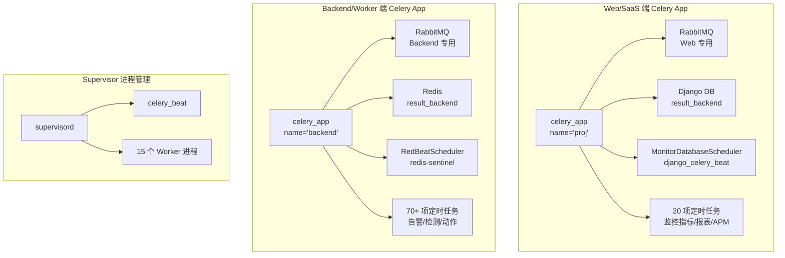
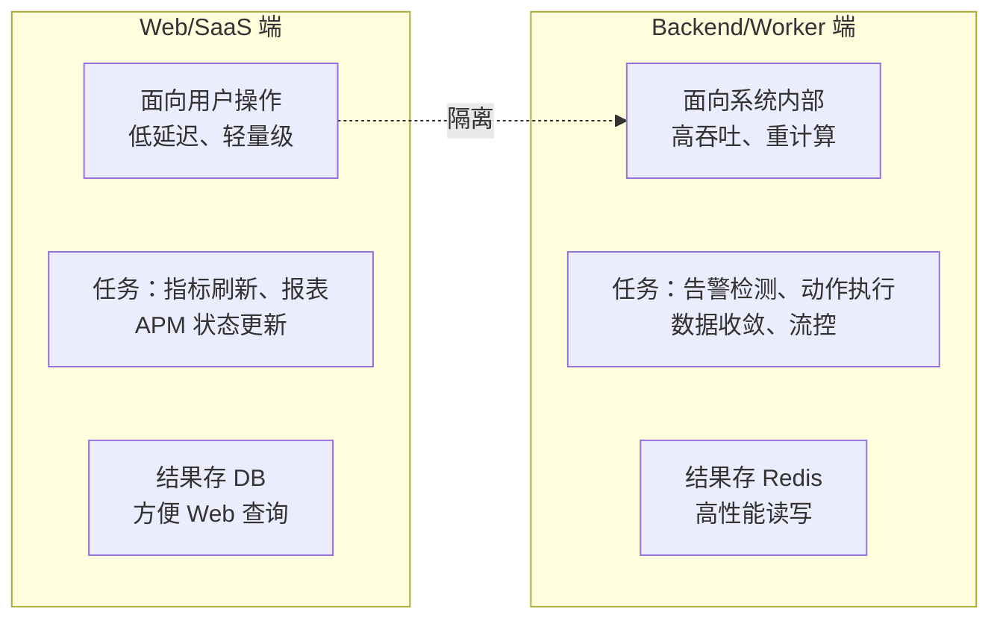
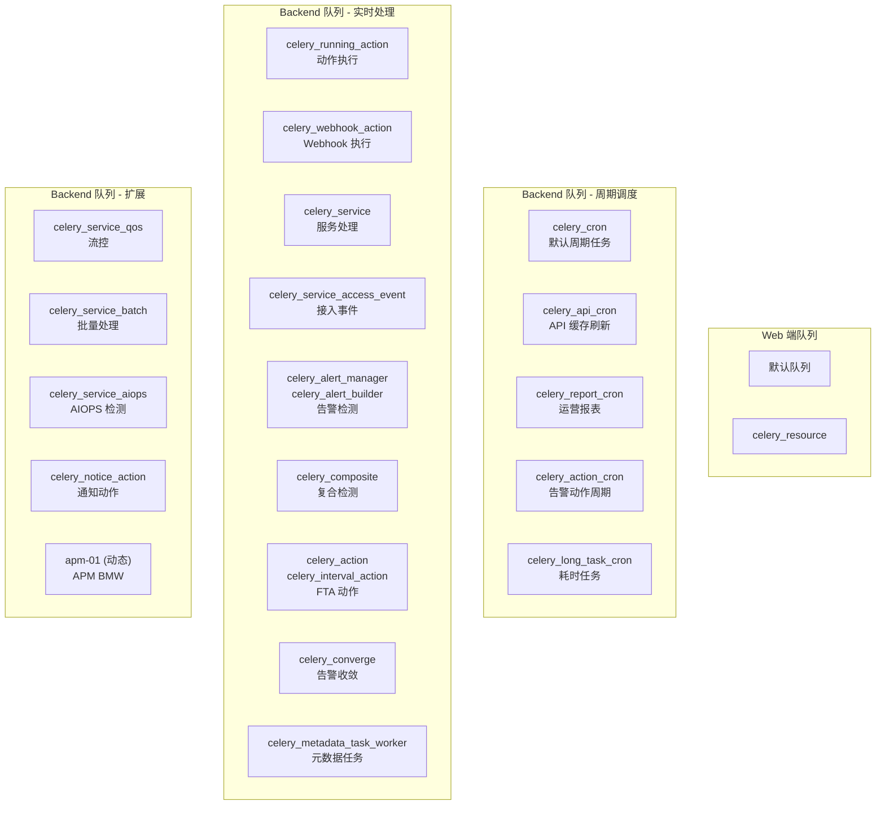
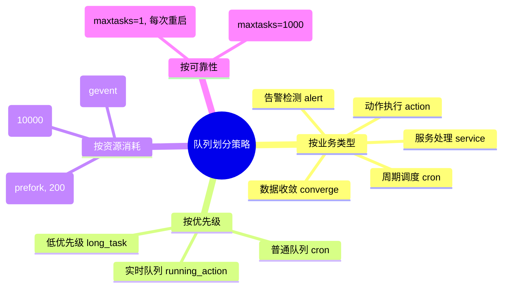
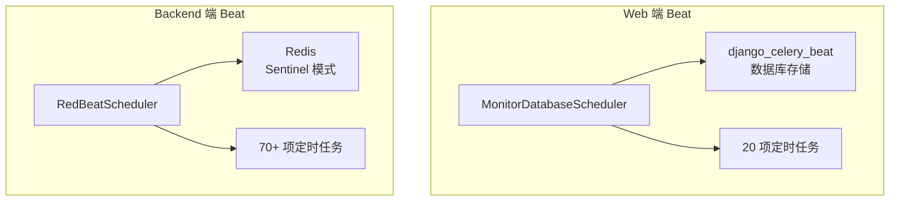
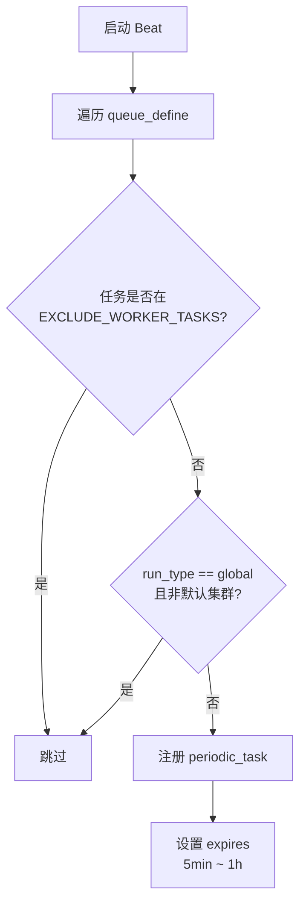
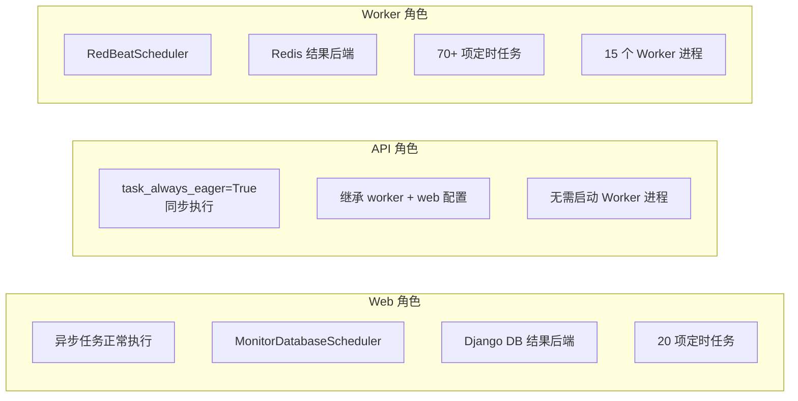
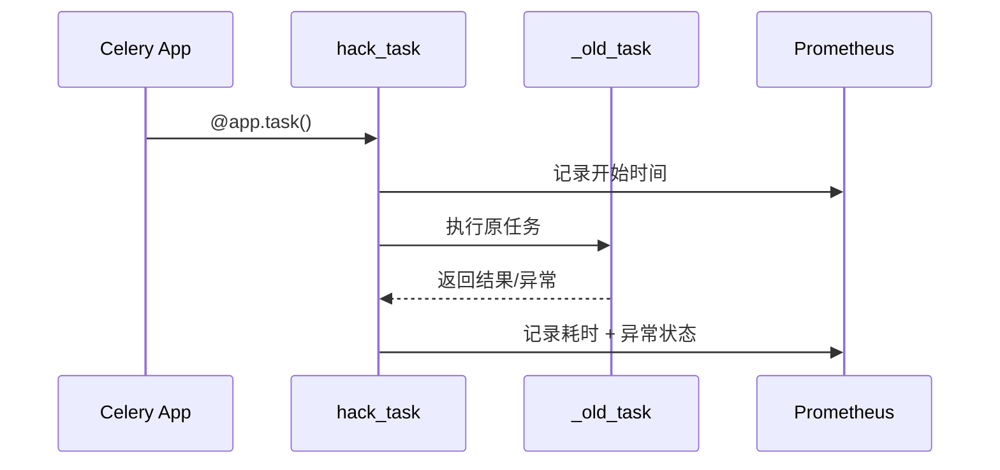
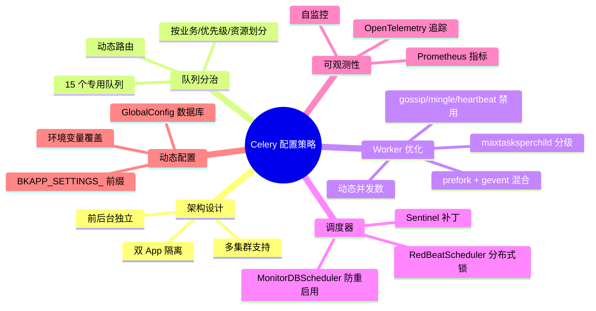

# bk-monitor Celery 配置策略设计文档

## 一、整体架构概览

bk-monitor 采用 **双 Celery App 架构**，分别服务于 Web/SaaS 前台和 Backend/Worker 后台，两者独立配置、独立运行、独立调度。



### 设计理念

| 原则 | 说明 |
|------|------|
| **前后台隔离** | Web 和 Backend 使用独立的 Celery App，互不影响 |
| **队列分治** | 按业务类型划分队列，不同任务走不同 Worker |
| **动态配置** | Worker 并发数、定时任务均可通过数据库动态调整 |
| **可观测性** | Prometheus 指标 + OpenTelemetry 链路追踪全覆盖 |

---

## 二、双 Celery App 设计

### 2.1 Web/SaaS 端 Celery App

**初始化文件**: `config/celery/celery.py`

```python
app = Celery("proj")
app.config_from_object("config.celery.config:Config")
app.autodiscover_tasks(lambda: settings.INSTALLED_APPS)
```

| 属性 | 值 |
|------|-----|
| App 名称 | `proj` |
| 配置来源 | `config.celery.config:Config` |
| 任务发现 | 自动从 `INSTALLED_APPS` 发现 |
| Broker | Web 专用 RabbitMQ |
| 结果后端 | Django 数据库 (`django_celery_results`) |
| Beat 调度器 | `MonitorDatabaseScheduler` |

### 2.2 Backend/Worker 端 Celery App

**初始化文件**: `alarm_backends/service/scheduler/app.py`

```python
app = Celery("backend")
app.config_from_object(rabbitmq_conf())
```

| 属性 | 值 |
|------|-----|
| App 名称 | `backend` |
| 配置来源 | `rabbitmq_conf()` 动态类 |
| 任务发现 | 手动指定 `TASK_ROOT_MODULES` |
| Broker | Backend 专用 RabbitMQ |
| 结果后端 | Redis (支持 Sentinel) |
| Beat 调度器 | `RedBeatScheduler` |
| 额外能力 | Prometheus 计时器 (`celery_app_timer`) |

### 2.3 为什么需要两套？



---

## 三、Broker 配置

### 3.1 RabbitMQ 配置

两端均使用 RabbitMQ 作为消息 Broker，但连接不同的实例/VHost。

**配置获取**: `config/tools/rabbitmq.py`

#### Web 端

```python
broker_url = get_rabbitmq_settings(settings.APP_CODE)["broker_url"]
```

#### Backend 端

```python
# 环境变量 → 配置
BK_MONITOR_RABBITMQ_HOST     # 默认: rabbitmq.service.consul
BK_MONITOR_RABBITMQ_PORT     # 默认: 5672
BK_MONITOR_RABBITMQ_VHOST    # 默认: app_code
BK_MONITOR_RABBITMQ_USERNAME # 默认: app_code
BK_MONITOR_RABBITMQ_PASSWORD # 默认: ""
```

**连接串格式**：
```
amqp://{user}:{pass}@{host}:{port}/{vhost}
```

#### Broker 传输选项

```python
broker_transport_options = {
    "queue_name_prefix": "{cluster_name}-"  # 仅非默认集群时设置
}
```

> 队列名前缀机制支持多集群部署，不同集群的队列互不冲突。

### 3.2 Redis 配置（Celery 相关）

Redis db 分配策略：

| db | 用途 | 配置变量 |
|----|------|----------|
| 7 | 日志相关数据 | `REDIS_LOG_CONF` |
| 8 | 配置缓存（CMDB、策略、屏蔽等） | `REDIS_CACHE_CONF` |
| **9** | **Celery broker + 服务间交互队列** | `REDIS_CELERY_CONF` / `REDIS_QUEUE_CONF` |
| 10 | Service 自身数据 | `REDIS_SERVICE_CONF` |

---

## 四、序列化配置

两端统一使用 **pickle** 序列化，确保复杂数据结构可以高效传输：

```python
task_serializer  = "pickle"
result_serializer = "pickle"
accept_content   = ["pickle"]
```

### 选择 pickle 的原因

| 序列化方式 | 性能 | 兼容性 | 安全性 | 适用场景 |
|-----------|------|--------|--------|----------|
| **pickle** | ★★★★★ | 仅 Python | 低（反序列化风险） | 内部任务、复杂对象 |
| json | ★★★ | 跨语言 | 高 | 跨系统交互 |
| msgpack | ★★★★ | 跨语言 | 高 | 高性能跨语言 |

> 项目选择 pickle 是因为所有 Worker 均为 Python 进程，且任务数据中包含复杂 Python 对象（如策略配置、检测上下文等），pickle 能零损耗传递。

---

## 五、任务队列划分策略

### 5.1 队列全景图



### 5.2 队列路由配置

Backend 端默认路由：

```python
task_default_exchange    = "monitor"
task_default_queue       = "monitor"
task_default_routing_key = "monitor"
```

任务通过装饰器的 `queue` 参数指定目标队列：

```python
@app.task(queue="celery_alert_manager", ...)
def detect_alert(...):
    ...
```

### 5.3 Worker 进程与队列映射

**Supervisor 配置文件**: `support-files/templates/#etc#supervisor-bkmonitorv3-monitor.conf`

| 进程名 | 监听队列 | 并发数 | 池类型 | maxtasksperchild |
|--------|----------|--------|--------|------------------|
| `celery_beat` | -- (Beat 进程) | -- | RedBeatScheduler | -- |
| `celery_worker_api_cron` | `celery_api_cron` | 5 | **gevent** | -- |
| `celery_worker_report_cron` | `celery_report_cron` | 4 | prefork | -- |
| `celery_worker_action` | `celery_running_action` | 8 | prefork | 200 |
| `celery_worker_webhook_action` | `celery_webhook_action` | 8 | prefork | 200 |
| `celery_worker_service` | `celery_service` | auto | prefork | 1000 |
| `celery_worker_service_access_event` | `celery_service_access_event` | 2 | prefork | 1000 |
| `celery_worker_cron` | `celery_cron` | 8 | prefork | **1** |
| `celery_worker_alert` | `celery_alert_manager,celery_alert_builder` | 8 | prefork | 50 |
| `celery_worker_composite` | `celery_composite` | 2 | prefork | **10000** |
| `celery_worker_fta_action` | `celery_action,celery_interval_action` | 8 | prefork | 100 |
| `celery_worker_converge` | `celery_converge` | 8 | prefork | 1000 |
| `celery_worker_action_cron` | `celery_action_cron` | 8 | prefork | 1000 |
| `celery_worker_long_task_cron` | `celery_long_task_cron` | 2 | prefork | 1000 |
| `celery_metadata_task_worker` | `celery_metadata_task_worker` | 2 | prefork | **1** |

### 5.4 队列设计思路



---

## 六、Worker 配置详解

### 6.1 并发模式

项目使用两种 Worker 并发模式：

| 模式 | 适用场景 | 使用者 |
|------|----------|--------|
| **prefork** | CPU 密集型、内存隔离要求高 | 绝大多数 Worker |
| **gevent** | IO 密集型、高并发低延迟 | `celery_worker_api_cron` |

### 6.2 并发数配置

**动态并发数计算**：

```python
worker_concurrency = int(settings.CELERY_WORKERS) or default_celery_worker_num()
```

**默认计算公式**（`CELERY_WORKERS=0` 时）：

```python
def default_celery_worker_num():
    return int(cpu_count ** 0.6 * 1.85)
```

| CPU 核数 | 默认并发数 |
|----------|-----------|
| 2 | 3 |
| 4 | 4 |
| 8 | 6 |
| 16 | 9 |
| 32 | 14 |
| 64 | 22 |

**动态调整**：通过 `GlobalConfig` 数据库表修改 `CELERY_WORKERS`，无需改代码即可调整并发数。

```python
# bkmonitor/define/global_config.py
("CELERY_WORKERS", slz.IntegerField(
    label="后台处理队列的子进程数（需重启scheduler:*）",
    default=0, min_value=0
))
```

### 6.3 maxtasksperchild 策略

`maxtasksperchild` 控制子进程处理多少任务后重启，防止内存泄漏：

| 策略值 | 适用场景 | 对应 Worker |
|--------|----------|-------------|
| **1** | 极高可靠性，每次任务后重启 | `celery_worker_cron`、`celery_metadata_task_worker` |
| 50 | 告警检测，需要较新状态 | `celery_worker_alert` |
| 100 | FTA 动作 | `celery_worker_fta_action` |
| 200 | 动作执行 | `celery_worker_action`、`celery_worker_webhook_action` |
| 1000 | 普通服务 | `celery_worker_service`、`celery_worker_converge` |
| **10000** | 长期运行、稳定 | `celery_worker_composite` |
| 无限制 | 不需要重启 | `celery_worker_api_cron`、`celery_worker_report_cron` |

### 6.4 Worker 启动优化参数

大部分 Worker 添加了以下优化参数：

```bash
--without-gossip     # 禁用 Worker 间 gossip 消息
--without-mingle     # 禁用启动时同步
--without-heartbeat  # 禁用心跳
```

> 这三个参数减少了 Worker 间的网络通信开销，适合集中式调度场景。

### 6.5 task_acks_late

```python
task_acks_late = True  # 任务执行完成后才确认，而非消费时确认
```

**作用**：如果 Worker 在执行任务时崩溃，任务不会被确认，会被重新分配给其他 Worker，确保任务不丢失。

---

## 七、定时任务（Beat）配置

### 7.1 双调度器设计



| 特性 | Web 端 (MonitorDatabaseScheduler) | Backend 端 (RedBeatScheduler) |
|------|----------------------------------|-------------------------------|
| 存储 | Django 数据库 | Redis (Sentinel) |
| 管理 | Django Admin 可视化管理 | 配置文件定义 |
| 分布式锁 | DB 行锁 | Redis 分布式锁 (`redbeat_lock_timeout=300`) |
| 循环间隔 | 默认 | `beat_max_loop_interval=60` |
| 定制 | 防止手动禁用任务被重新启用 | 支持多集群过滤 |

### 7.2 Web 端 Beat 定时任务

**配置文件**: `config/celery/config.py`

| 任务 | 周期 (crontab) | 队列 | enabled |
|------|---------------|------|---------|
| `update_external_approval_status` | `*/10 * * * *` | 默认 | True |
| `update_metric_list` | `* * * * *` | celery_resource | True |
| `access_pending_aiops_strategy` | `*/5 * * * *` | 默认 | True |
| `update_uptime_check_task_status` | `*/10 * * * *` | 默认 | True |
| `maintain_aiops_strategies` | `*/10 * * * *` | 默认 | **False** |
| `update_home_statistics` (fta_web) | `*/5 * * * *` | 默认 | True |
| `update_report_receivers` | `27 2 * * *` | 默认 | True |
| `refresh_apm_app_state_snapshot` | `0 0 * * *` | 默认 | True |
| `refresh_application` | `*/10 * * * *` | 默认 | True |
| `refresh_apm_application_metric` | `*/10 * * * *` | 默认 | True |
| `application_create_check` | `*/1 * * * *` | 默认 | True |
| `cache_application_scope_name` | `*/10 * * * *` | 默认 | True |
| `refresh_dashboard_strategy_snapshot` | `*/60 * * * *` | celery_resource | True |
| `update_statistics_data` | `* * * * *` | 默认 | True |
| `clean_bkrepo_temp_file` | `* */1 * * *` | celery_resource | True |
| `update_metric_json_from_ts_group` | `*/50 * * * *` | 默认 | True |
| `update_target_detail` | `*/15 * * * *` | 默认 | True |
| `soft_delete_expired_shields` | `0 2 * * *` | 默认 | True |
| `auto_register_apm_builtin_strategy_template` | `*/30 * * * *` | 默认 | True |
| `auto_apply_strategy_template` | `*/30 * * * *` | 默认 | True |

### 7.3 Backend 端 Beat 定时任务

#### 动态注册机制

**配置文件**: `alarm_backends/service/scheduler/tasks/cron.py`

```python
queue_define = {
    "celery_cron":          settings.DEFAULT_CRONTAB,
    "celery_action_cron":   settings.ACTION_TASK_CRONTAB,
    "celery_long_task_cron": settings.LONG_TASK_CRONTAB,
}
```



#### DEFAULT_CRONTAB（约 45 项）

| 类别 | 示例任务 |
|------|----------|
| 策略缓存 | 策略快照刷新、策略缓存预热 |
| 模型缓存 | CMDB 拓扑同步、主机关系更新 |
| 动作配置 | 通知组更新、动作配置同步 |
| 延迟队列 | 延迟告警检测、重试队列消费 |
| APM | 拓扑发现、服务关系刷新 |
| 元数据 | metadata 同步、指标缓存更新 |

#### ACTION_TASK_CRONTAB（约 14 项）

| 类别 | 示例任务 |
|------|----------|
| 屏蔽 | 屏蔽规则过期检查 |
| 异常检测 | 异常告警检测 |
| 流控 | 流控告警检测 |
| 动作同步 | 动作状态同步 |
| 排班 | 排班计划刷新 |
| ES 轮转 | ES 索引轮转清理 |

#### LONG_TASK_CRONTAB（约 12 项）

| 类别 | 示例任务 |
|------|----------|
| InfluxDB | 数据清理、存储刷新 |
| 自定义事件 | 事件检查、状态更新 |
| BkBase | 数据同步 |

#### api_cron / report_cron

| 队列 | 来源 | 典型任务 |
|------|------|----------|
| `celery_api_cron` | `alarm_backends.core.api_cache.library.API_CRONTAB` | API 缓存刷新 |
| `celery_report_cron` | 硬编码 | 运营数据上报、SLI 指标、Redis 指标采集、邮件订阅报表 |

### 7.4 MonitorDatabaseScheduler 定制

**文件**: `packages/monitor/schedulers.py`

继承 `django_celery_beat.schedulers.DatabaseScheduler`，核心定制：

```python
class MonitorModelEntry(ModelEntry):
    def save(self):
        # 任务已存在时不更新 enabled 属性
        # 防止手动禁用的任务被代码重新启用
        if self.model.objects.filter(name=self.name).exists():
            self.enabled = None  # 不更新
        super().save()
```

### 7.5 RedBeat Sentinel 补丁

**文件**: `patches/redbeat/schedulers.py`

当使用 Redis Sentinel 模式时，需要对 RedBeat 进行 monkey patch：

- 修复云 Redis pipeline 取回数据问题
- 替换 `schedulers.get_redis` 为 `sentinel_kwargs_get_redis`
- 支持 Sentinel 模式下的 Redis 连接

**自动 patch 逻辑** (`settings.py`)：

```python
if "redbeat.RedBeatScheduler" in sys.argv:
    patch_target.update({"redbeat.schedulers": None})
    monkey.patch_all(patch_target)
```

---

## 八、结果后端配置

### 8.1 Web 端 — Django 数据库

```python
result_backend = "django_celery_results.backends:DatabaseBackend"
```

**优点**：
- 与 Django Admin 集成，方便查看任务结果
- 无需额外中间件
- 适合低频任务

### 8.2 Backend 端 — Redis

#### Sentinel 模式

```python
result_backend = "sentinel://:{pwd}@{host}:{port}/{db}"  # 多节点用分号拼接
result_backend_transport_options = {
    "master_name": master_name,
    "sentinel_kwargs": {"password": sentinel_password}
}
redbeat_redis_url = "redis-sentinel://redis-sentinel:26379/0"
redbeat_redis_options = {
    "sentinels": [...],
    "password": ...,
    "service_name": ...,
    "socket_timeout": 10,
    "retry_period": 60
}
```

#### 普通 Redis 模式

```python
result_backend = "redis://:{pwd}@{host}:{port}/{db}"
redbeat_redis_url = "redis://:{pwd}@{host}:{port}/0"
```

---

## 九、不同角色的 Celery 配置差异

### 9.1 角色矩阵



| 特性 | Web | API | Worker |
|------|-----|-----|--------|
| Celery App | proj | proj | backend |
| task_always_eager | False | **True** | False |
| Broker | Web RabbitMQ | Web RabbitMQ | Backend RabbitMQ |
| result_backend | Django DB | Django DB | Redis |
| Beat 调度器 | MonitorDBScheduler | 不使用 | RedBeatScheduler |
| Worker 进程 | 需启动 | 不需要 | 需启动 |
| django_celery_beat | 注册 | 注册 | 注册 |
| django_celery_results | 注册 | 注册 | 注册 |

### 9.2 API 角色的 task_always_eager

```python
# config/role/api.py
task_always_eager = True  # API 角色下所有任务同步执行
```

**设计意图**：API 角色主要用于提供 HTTP 接口，不需要异步执行任务。同步执行确保任务结果立即可用，简化 API 逻辑。

---

## 十、监控与可观测性

### 10.1 Prometheus 指标

**文件**: `core/prometheus/metrics.py`

| 指标名 | 类型 | 标签 | 说明 |
|--------|------|------|------|
| `bkmonitor_celery_task_execute_time` | Histogram | `task_name, queue, exception` | 任务执行耗时分布 |
| `bkmonitor_cron_task_execute_time` | Histogram | `task_name, queue` | 周期任务执行耗时分布 |
| `bkmonitor_cron_task_execute_count` | Counter | `task_name, status, exception, queue` | 周期任务执行计数 |

### 10.2 celery_app_timer 机制

**文件**: `core/prometheus/tools.py`

对 Backend Celery App 的 `task` 方法进行 monkey-patch，为每个任务自动添加计时器：

```python
def celery_app_timer(app):
    """对 celery app 进行 patch，为其增加函数计时器"""
    app._old_task = app.task
    app.task = MethodType(hack_task, app)
```



### 10.3 OpenTelemetry 链路追踪

**文件**: `bkmonitor/trace/log_trace.py`

```python
# Celery Instrumentor 自动注入
CeleryInstrumentor().instrument()

# Worker 进程初始化时启用 tracing
@worker_process_init.connect
def init_tracing(**kwargs):
    ...

# Beat 进程初始化时启用 tracing
@beat_init.connect
def init_tracing(**kwargs):
    ...
```

**依赖环境变量**：
- `BKAPP_OTLP_HTTP_HOST` — 追踪服务地址
- `BKAPP_OTLP_BK_DATA_TOKEN` — 认证令牌

### 10.4 自监控

**文件**: `alarm_backends/service/selfmonitor/handler.py`

| 监控类型 | 处理器 | 说明 |
|----------|--------|------|
| log | `LogProcessor` | 日志轮转监控 |
| supervisor | `SupervisorHandler` | 进程存活监控 |

关键配置：
```python
SELFMONITOR_PORTS = {"gse-data": 58625}
SUPERVISOR_PROCESS_UPTIME = 10  # 进程启动超时阈值(秒)
```

---

## 十一、配置文件路径速查

| 文件路径 | 作用 |
|---------|------|
| `settings.py` | Django settings 入口，加载角色配置 + RedBeat patch |
| `config/default.py` | 全局默认配置，`CELERY_WORKERS=0` |
| `config/role/worker.py` | Worker 角色配置：CRONTAB / Redis / RabbitMQ |
| `config/role/api.py` | API 角色配置：`task_always_eager=True` |
| `config/role/web.py` | Web 角色配置 |
| `config/celery/celery.py` | Web 端 Celery App 初始化 |
| `config/celery/config.py` | Web 端 Config 类 + beat_schedule |
| `config/tools/rabbitmq.py` | RabbitMQ 配置获取工具 |
| `alarm_backends/service/scheduler/app.py` | Backend Celery App + RabbitmqConf |
| `alarm_backends/service/scheduler/tasks/cron.py` | Backend 周期任务动态注册 |
| `alarm_backends/service/scheduler/tasks/api_cron.py` | API 周期任务注册 |
| `alarm_backends/service/scheduler/tasks/report_cron.py` | 报表周期任务注册 |
| `packages/monitor/schedulers.py` | 自定义 MonitorDatabaseScheduler |
| `patches/redbeat/schedulers.py` | RedBeat Sentinel 补丁 |
| `bkmonitor/define/global_config.py` | CELERY_WORKERS 动态配置定义 |
| `alarm_backends/core/storage/redis.py` | Redis db 分配 + Celery Redis 配置映射 |
| `core/prometheus/tools.py` | Celery 任务计时器 patch |
| `core/prometheus/metrics.py` | Prometheus 指标定义 |
| `bkmonitor/trace/log_trace.py` | Celery OpenTelemetry tracing |
| `support-files/templates/#etc#supervisor-bkmonitorv3-monitor.conf` | Supervisor 进程配置 |

---

## 十二、核心配置速查表

### 通用配置

| 配置项 | 值 | 说明 |
|--------|-----|------|
| `task_serializer` | `pickle` | 序列化方式 |
| `result_serializer` | `pickle` | 结果序列化 |
| `accept_content` | `["pickle"]` | 接受的内容类型 |
| `task_acks_late` | `True` | 延迟确认 |
| `timezone` | `Asia/Shanghai` | 时区 |

### Backend 专属

| 配置项 | 值 | 说明 |
|--------|-----|------|
| `task_default_exchange` | `monitor` | 默认交换机 |
| `task_default_queue` | `monitor` | 默认队列 |
| `task_default_routing_key` | `monitor` | 默认路由键 |
| `worker_max_tasks_per_child` | `1000` | 子进程最大任务数 |
| `beat_max_loop_interval` | `60` | Beat 循环间隔(秒) |
| `redbeat_lock_timeout` | `300` | RedBeat 锁超时(秒) |

### API 专属

| 配置项 | 值 | 说明 |
|--------|-----|------|
| `task_always_eager` | `True` | 同步执行所有任务 |

### 环境变量

| 变量名 | 说明 |
|--------|------|
| `BK_MONITOR_RABBITMQ_HOST` | Backend RabbitMQ 地址 |
| `BK_MONITOR_RABBITMQ_PORT` | Backend RabbitMQ 端口 |
| `BK_MONITOR_RABBITMQ_VHOST` | Backend RabbitMQ VHost |
| `BK_MONITOR_RABBITMQ_USERNAME` | Backend RabbitMQ 用户名 |
| `BK_MONITOR_RABBITMQ_PASSWORD` | Backend RabbitMQ 密码 |
| `BKAPP_OTLP_HTTP_HOST` | OTLP 追踪地址 |
| `BKAPP_OTLP_BK_DATA_TOKEN` | OTLP 认证令牌 |

---

## 十三、设计亮点总结


