# 第一部分：分布式基础概念

# 第1章：分布式系统概述

> 🎯 **学习目标**：理解分布式系统的核心概念、面临的挑战，并通过 bk-monitor 告警后台的真实架构加深理解

---

## 1.1 什么是分布式系统

### 📖 定义

**分布式系统**（Distributed System）是由多台计算机组成的集合，这些计算机通过网络互相通信，协同完成一个共同的任务，对外呈现为一个统一的系统。

用一个生活化的比喻来理解：

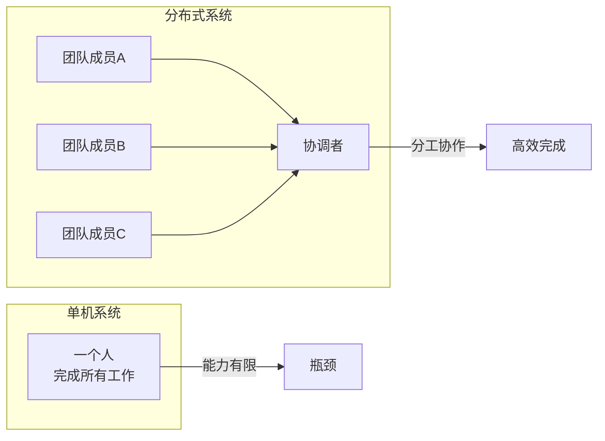

### 🔑 核心特征

| 特征 | 说明 | bk-monitor 中的体现 |
|------|------|---------------------|
| **多节点** | 多台服务器协同工作 | Access、Detect、Converge、Action 等多个服务节点 |
| **网络通信** | 通过网络交换数据 | Kafka/RabbitMQ 作为消息通道 |
| **协调机制** | 需要协调各节点行为 | Consul 服务发现、Redis 分布式锁 |
| **故障隔离** | 单节点故障不影响整体 | Supervisor 管理进程、Sentinel Redis 高可用 |
| **可扩展** | 水平扩展增加容量 | 一致性哈希支持节点动态增减 |

### 🌍 为什么需要分布式系统？

单机系统面临的问题：

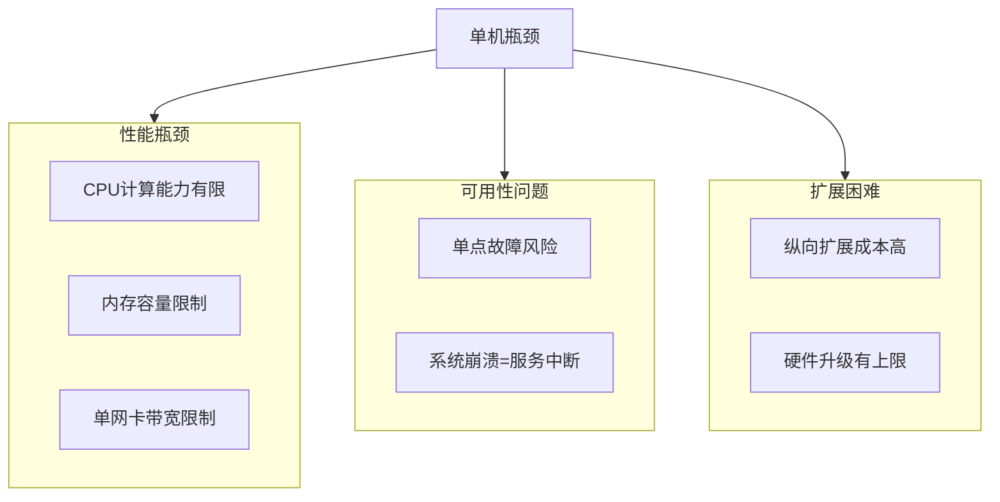

分布式系统的优势：

| 优势 | 说明 |
|------|------|
| **高性能** | 多节点并行处理，吞吐量线性增长 |
| **高可用** | 节点冗余，单点故障不影响整体 |
| **可扩展** | 水平扩展简单，增加节点即可 |
| **地理位置分散** | 可就近部署，降低网络延迟 |

### ⚠️ 分布式系统的代价

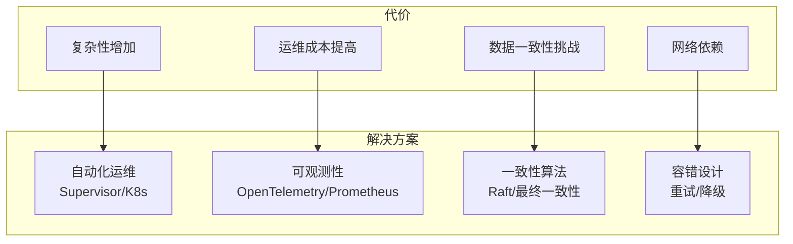

---

## 1.2 分布式系统的挑战

### 🧩 CAP 定理

CAP 定理是分布式系统设计的基石，由 Eric Brewer 于 2000 年提出。

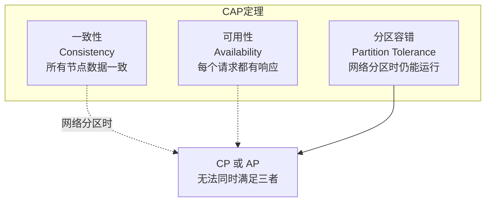

#### 三选二的抉择

| 选择 | 含义 | 适用场景 | bk-monitor 的选择 |
|------|------|---------|-------------------|
| **CP** | 保证一致性，牺牲可用性 | 金融交易、分布式锁 | Redis 分布式锁（锁失败则等待） |
| **AP** | 保证可用性，牺牲一致性 | 缓存系统、日志收集 | Kafka 消费（允许消息延迟） |
| **CA** | 无分区容错，实际上不存在 | 单机系统 | — |

#### 💡 在 bk-monitor 中的体现

**CP 选择示例** — 分布式锁：

```python
# 文件: alarm_backends/core/lock/__init__.py

class RedisLock(BaseLock):
    def acquire(self, _wait=0.001):
        """获取分布式锁"""
        token = uniqid4()  # 生成唯一标识
        wait_until = time.time() + _wait

        # 使用 SET NX EX 原子操作
        # 如果锁已被占用，则等待（牺牲可用性保证一致性）
        while not self.client.set(self.name, token, ex=self.ttl, nx=True):
            if time.time() < wait_until:
                time.sleep(0.01)  # 自旋等待
            else:
                return False  # 超时返回失败

        self.__token = token
        return True
```

> 🎯 **思考**：为什么锁需要 CP？因为如果多个节点同时获得锁，会导致并发冲突，破坏数据一致性。

**AP 选择示例** — 延迟队列消费：

```python
# 文件: alarm_backends/core/cache/delay_queue.py

class DelayQueueManager:
    def refresh_single_db(self, cache):
        """消费延迟队列中的到期任务"""
        # ZRANGEBYSCORE 取出到期的 task_id
        task_ids = cache.zrangebyscore(TASK_DELAY_QUEUE, 0, int(time.time()))

        # 使用 ZREM 的原子性防止重复消费
        # 但允许短暂的顺序不一致（AP）
        if task_ids:
            pipe = cache.pipeline()
            pipe.zrem(TASK_DELAY_QUEUE, *task_ids)
            ...
```

> 🎯 **思考**：为什么延迟队列选择 AP？因为消息顺序的短暂不一致不影响业务结果，而高可用确保告警不会丢失。

---

### 🔄 BASE 理论

BASE 理论是对 CAP 定理的补充，提供了一种更务实的指导原则。

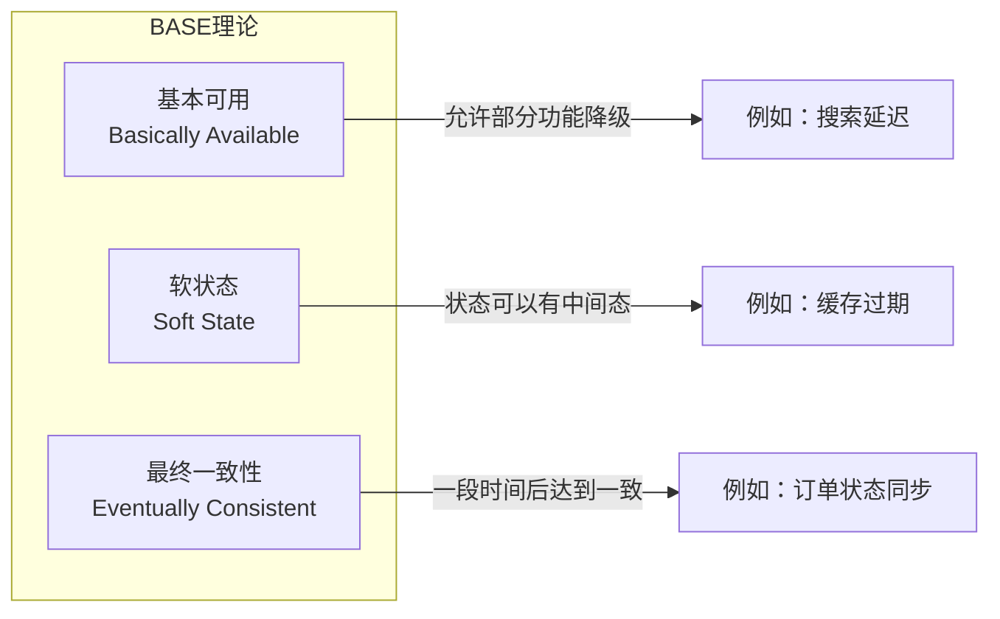

#### BASE vs ACID

| 特性 | ACID（传统数据库） | BASE（分布式系统） |
|------|-------------------|-------------------|
| **原子性** | 强一致性 | 最终一致性 |
| **一致性** | 立即一致 | 允许中间状态 |
| **隔离性** | 完全隔离 | 弱隔离 |
| **持久性** | 立即持久 | 可能短暂不一致 |

#### 💡 在 bk-monitor 中的体现

**软状态示例** — 策略缓存：

```python
# 文件: alarm_backends/core/cache/strategy.py

class StrategyCacheManager(CacheManager):
    """策略配置缓存管理器"""

    def get_strategy(self, strategy_id):
        """获取策略配置"""
        # 从 Redis 缓存获取（软状态，可能有短暂延迟）
        strategy = self.cache.get(f"strategy:{strategy_id}")

        if strategy is None:
            # 缓存不存在时从数据库加载
            strategy = Strategy.objects.get(id=strategy_id)
            self.cache.set(f"strategy:{strategy_id}", strategy, ttl=3600)

        return strategy
```

> 🎯 **说明**：策略配置通过缓存加速读取，允许短暂的不一致（软状态），但最终会与数据库保持一致（最终一致性）。

**最终一致性示例** — 告警状态同步：

```python
# 文件: alarm_backends/service/alert/manager/processor.py

class AlertManager:
    """告警状态管理器"""

    def process(self):
        """处理告警状态流转"""
        # 从 ES 拉取告警数据
        alerts = self.fetch_alerts()

        # 执行各检查器更新状态
        for checker in INSTALLED_CHECKERS:
            checker.check(alerts)

        # 更新 ES（最终一致性）
        self.save_alerts(alerts)
```

> 🎯 **说明**：告警状态可能在不同节点间有短暂不一致，但最终会通过 ES 同步达到一致状态。

---

### 📐 一致性模型对比

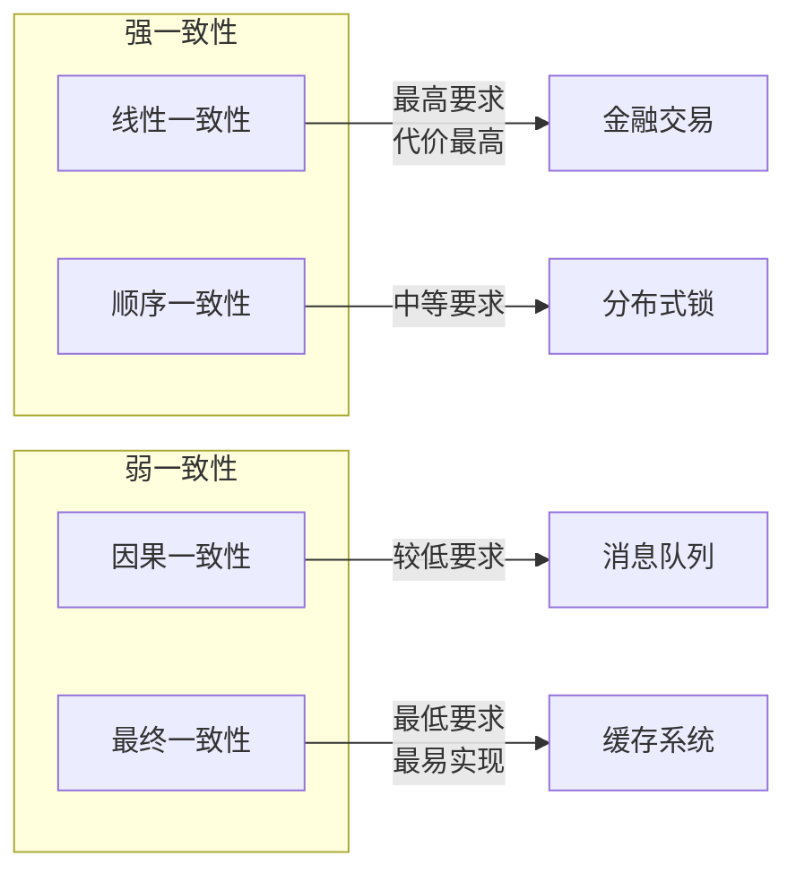

| 模型 | 说明 | 实现难度 | bk-monitor 应用 |
|------|------|---------|-----------------|
| **强一致性** | 所有节点立即看到相同数据 | 高 | Redis 分布式锁 |
| **最终一致性** | 最终所有节点看到相同数据 | 低 | 告警状态同步、策略缓存 |
| **因果一致性** | 有因果关系的操作保持顺序 | 中 | Kafka 消息顺序 |

---

## 1.3 bk-monitor 整体架构概览

### 🏗️ 系统架构图

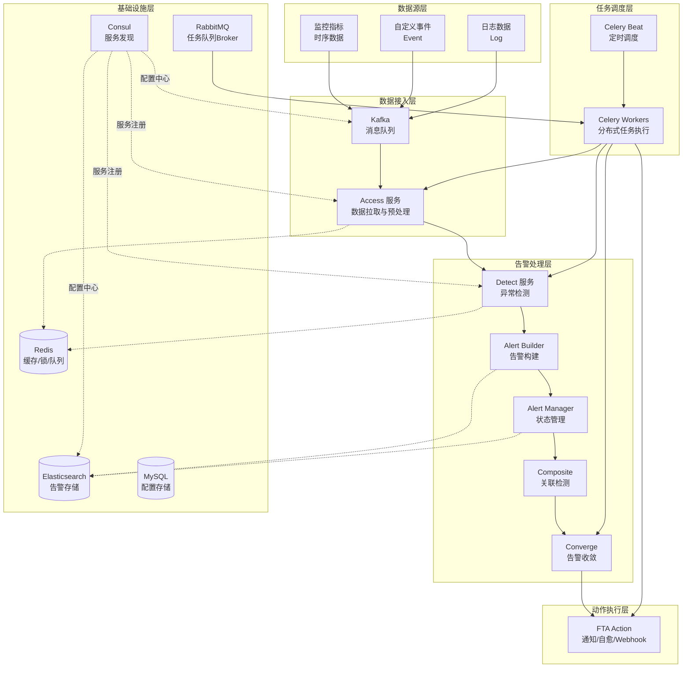

---

### 🔄 告警数据流转全景

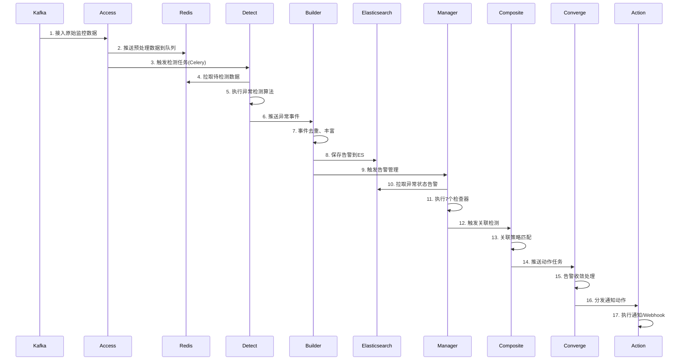

---

### 📂 核心模块职责

| 模块 | 职责 | 核心文件 |
|------|------|---------|
| **Access** | 数据接入、预处理、推送 | `alarm_backends/service/access/tasks.py` |
| **Detect** | 异常检测算法执行 | `alarm_backends/service/detect/tasks.py` |
| **Alert Builder** | 事件去重、告警生成 | `alarm_backends/service/alert/builder/tasks.py` |
| **Alert Manager** | 告警状态流转管理 | `alarm_backends/service/alert/manager/tasks.py` |
| **Composite** | 关联策略检测 | `alarm_backends/service/composite/tasks.py` |
| **Converge** | 告警收敛、降噪 | `alarm_backends/service/converge/tasks.py` |
| **FTA Action** | 通知发送、自愈执行 | `alarm_backends/service/fta_action/tasks/` |

---

### 🛠️ 分布式技术栈一览

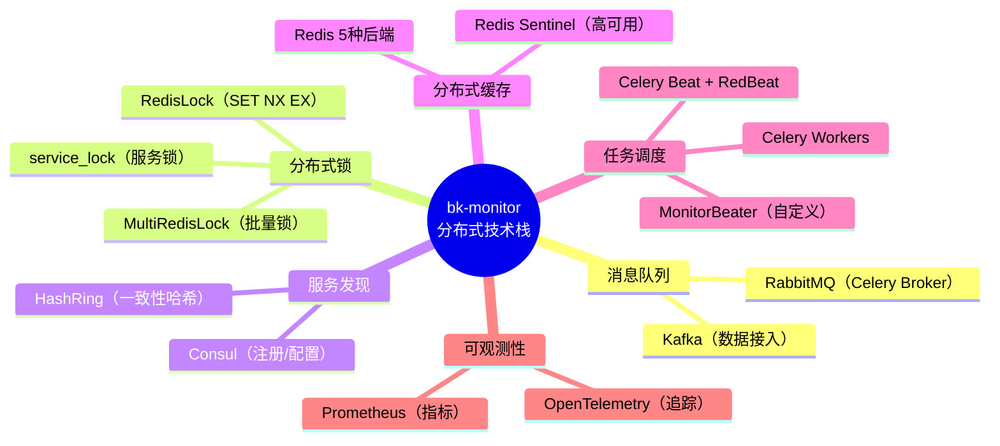

---

### 💾 Redis 缓存分层设计

bk-monitor 将 Redis 划分为 5 个独立的缓存后端，每种用途隔离：

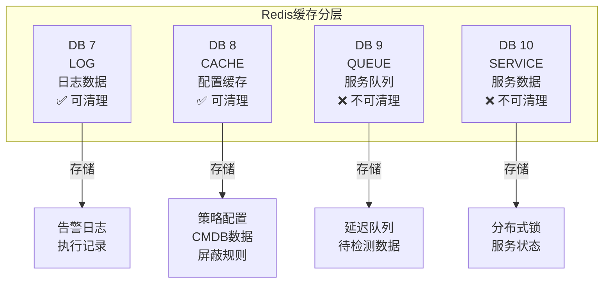

**代码位置**：

```python
# 文件: alarm_backends/core/storage/redis.py

class CacheBackendType(Enum):
    """Redis 缓存后端类型"""
    LOG = "log"      # DB 7 - 日志相关
    CACHE = "cache"  # DB 8 - 配置缓存
    QUEUE = "queue"  # DB 9 - 服务队列
    SERVICE = "service"  # DB 10 - 服务数据
    CELERY = "celery"    # DB 9 - Celery 结果
```

---

### 🔗 服务发现与任务分发

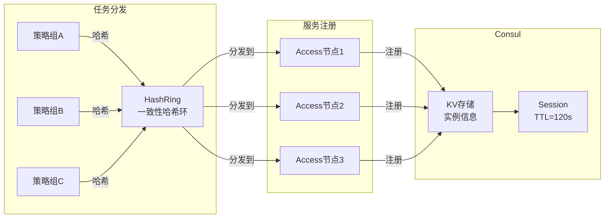

**核心原理**：

```python
# 文件: alarm_backends/management/hashring.py

class HashRing:
    """带权一致性哈希环"""

    def __init__(self, nodes: dict, num_vnodes=2**16):
        """
        nodes: {"node1": weight1, "node2": weight2}
        num_vnodes: 虚拟节点上限，默认 65536
        """
        self.num_vnodes = num_vnodes
        self._ring = []  # 有序哈希环
        self._nodes = {}  # 虚拟节点到物理节点的映射

        # 按权重生成虚拟节点
        for node, weight in nodes.items():
            for i in range(int(weight * multiple)):
                vnode = f"{node}{i}"
                hash_val = self._hash(vnode)
                self._ring.append(hash_val)
                self._nodes[hash_val] = node

        self._ring.sort()  # 排序形成环

    def get_node(self, key: str) -> str:
        """根据 key 找到对应的节点"""
        hash_val = self._hash(key)
        # 二分查找：顺时针找到第一个 >= hash_val 的节点
        idx = bisect_left(self._ring, hash_val)
        if idx >= len(self._ring):
            idx = 0  # 超出则回到环起点
        return self._nodes[self._ring[idx]]
```

---

### ⏰ 三级任务队列架构

bk-monitor 设计了三级 Celery 任务队列，实现任务分级处理：

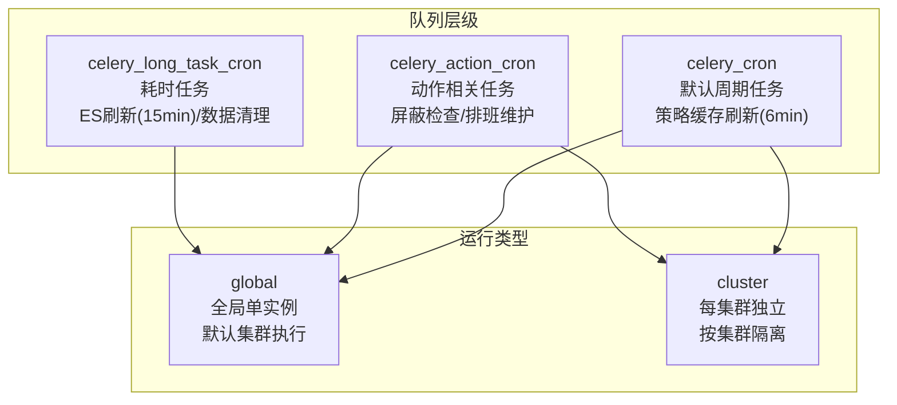

**配置位置**：

```python
# 文件: config/role/worker.py

# 三级定时任务队列
DEFAULT_CRONTAB = [
    # 核心任务：策略缓存刷新（6分钟）
    ("*/6 * * * *", "cache.refresh_all", "global"),
    # 增量更新（1分钟）
    ("* * * * *", "cache.incremental_update", "cluster"),
    # 延迟队列消费（1分钟）
    ("* * * * *", "delay_queue.refresh", "cluster"),
]

ACTION_TASK_CRONTAB = [
    # 屏蔽规则检查（5分钟）
    ("*/5 * * * *", "shield.check", "global"),
    # 异常告警检测（1分钟）
    ("* * * * *", "alert.check_abnormal", "cluster"),
]

LONG_TASK_CRONTAB = [
    # ES存储刷新（15分钟）
    ("*/15 * * * *", "es.refresh", "global"),
    # 空间资源同步（30分钟）
    ("*/30 * * * *", "space.sync", "global"),
]
```

---

## 📝 本章小结

### ✅ 核心知识点回顾

| 概念 | 要点 | 项目体现 |
|------|------|---------|
| **分布式系统** | 多节点协同、网络通信、协调机制 | 多服务节点 + Consul + Redis |
| **CAP 定理** | C/A/P 三选二 | Redis锁(CP) + 延迟队列(AP) |
| **BASE 理论** | 基本可用 + 软状态 + 最终一致 | 策略缓存 + 告警状态同步 |
| **一致性模型** | 强一致 → 最终一致，代价递减 | 不同场景选择不同模型 |

### 🎯 架构设计原则

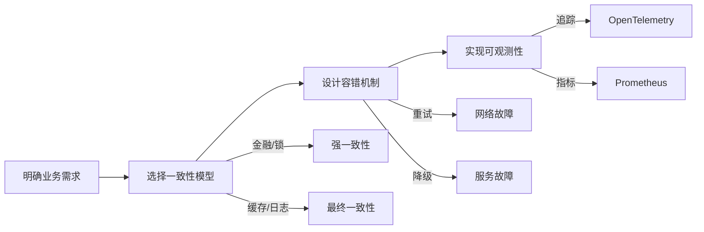

---

## 🤔 思考题

1. **为什么 bk-monitor 使用 Kafka 作为数据接入队列，而用 RabbitMQ 作为 Celery Broker？两者有什么区别？**

2. **Redis 分布式锁为什么需要 token 机制？如果不使用 token，可能出现什么问题？**

3. **一致性哈希环中的虚拟节点有什么作用？为什么默认设置 65536 个虚拟节点？**

4. **三级任务队列的设计有什么好处？如果所有任务都放在同一个队列会有什么问题？**

---

## 📁 相关源码索引

| 章节 | 源码路径 |
|------|---------|
| Redis 缓存分层 | `alarm_backends/core/storage/redis.py` |
| 分布式锁实现 | `alarm_backends/core/lock/__init__.py` |
| 一致性哈希 | `alarm_backends/management/hashring.py` |
| 服务发现 | `alarm_backends/management/base/service_discovery.py` |
| Celery 配置 | `alarm_backends/service/scheduler/app.py` |
| Worker 配置 | `config/role/worker.py` |
| 延迟队列 | `alarm_backends/core/cache/delay_queue.py` |

---

> 📖 **下一章预告**：第2章将深入讲解 **Consul 服务发现机制**，包括服务注册、健康检查、配置中心的具体实现。