# 第二部分：分布式协调与发现

# 第2章：服务注册与发现 — Consul

> 🎯 **学习目标**：理解服务发现解决的核心问题，掌握 Consul 的核心概念，并深入学习 bk-monitor 告警后台的服务注册与配置中心实现

---

## 2.1 服务发现解决的问题

### 🤔 传统架构的困境

在没有服务发现的架构中，服务之间的调用面临以下问题：

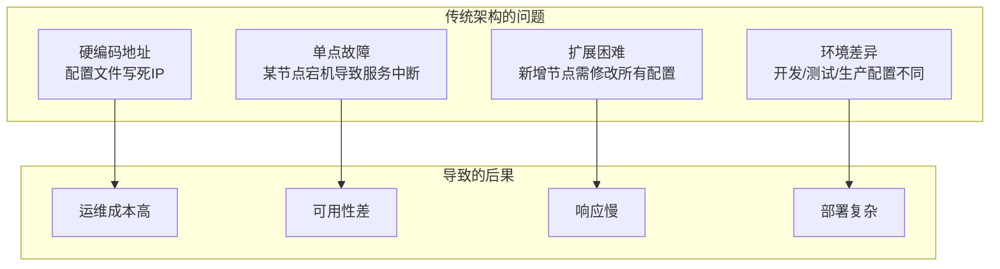

### 🌟 服务发现的解决方案

服务发现机制的核心思想是：**服务启动时自动注册，服务停止时自动注销，调用方动态获取可用节点列表。**

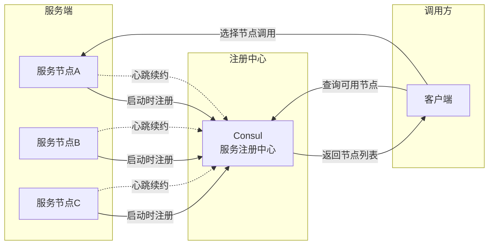

### 📊 服务发现的三种模式

| 模式 | 工作原理 | 典型实现 | 适用场景 |
|------|---------|---------|---------|
| **客户端发现** | 客户端查询注册中心，自行选择节点 | Consul、Eureka | 调用方可控、需要负载均衡策略 |
| **服务端发现** | 通过负载均衡器转发请求 | K8s Service、Nginx | 客户端无感知、简化调用方逻辑 |
| **混合模式** | 注册中心 + 负载均衡器 | Spring Cloud | 复杂企业架构 |

bk-monitor 采用的是 **客户端发现模式**，由各服务节点直接与 Consul 交互。

---

### 💡 为什么选择 Consul？

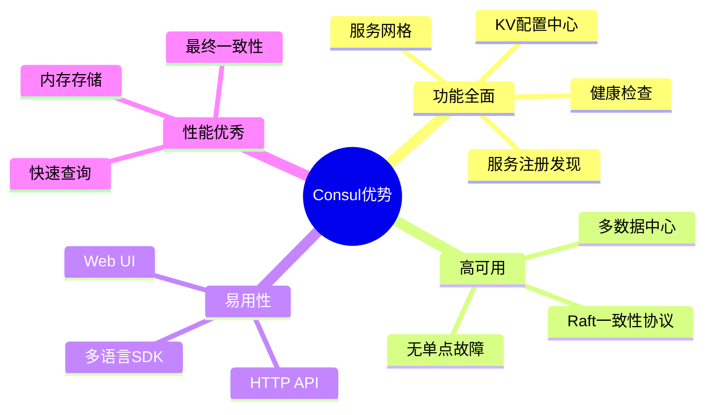

| 特性 | Consul | Eureka | ZooKeeper | Nacos |
|------|--------|--------|-----------|-------|
| **一致性协议** | Raft（强一致） | 无（最终一致） | ZAB（强一致） | Raft/最终一致 |
| **健康检查** | TCP/HTTP/Script | 心跳 | 会话超时 | TCP/HTTP/心跳 |
| **配置中心** | ✅ KV存储 | ❌ | ✅ ZNode | ✅ |
| **多数据中心** | ✅ | ❌ | ❌ | ✅ |
| **语言生态** | 多语言 | Java | 多语言 | Java |

---

## 2.2 Consul 核心概念

### 🏗️ Consul 架构组件

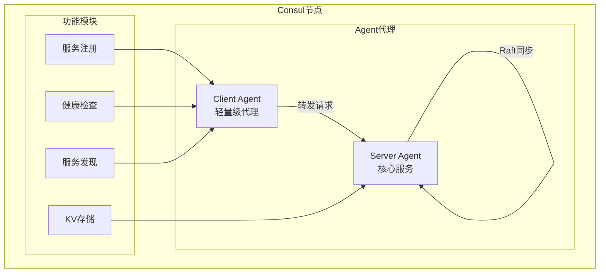

#### 核心概念详解

| 概念 | 说明 | 在 bk-monitor 中的应用 |
|------|------|------------------------|
| **Agent** | Consul 的代理进程，每个节点运行一个 | 告警后台各服务节点通过 Agent 注册 |
| **Server** | 范围服务节点，存储数据、参与 Raft | 配置中心数据存储在 Server 集群 |
| **Client** | 轻量级代理，转发请求到 Server | 本地部署 Client Agent |
| **KV Store** | 分布式键值存储，用于配置管理 | Kafka 集群配置、ES 存储配置下发 |
| **Session** | 会话机制，实现临时节点和分布式锁 | 服务实例注册（TTL=120s） |
| **Service** | 注册的服务实例 | Access、Detect、Converge 等服务 |

---

### 🔑 Consul KV 存储原理

Consul KV 是一个分布式的键值存储系统，支持层级结构：

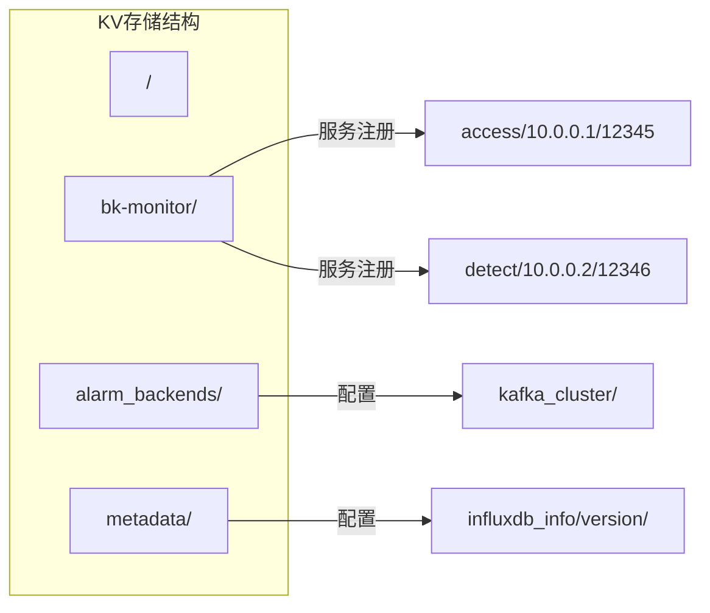

**KV 存储的特点**：

- ✅ **层级结构**：支持类似文件系统的路径
- ✅ **原子读写**：单个 key 的读写操作是原子的
- ✅ **Watch 监听**：支持阻塞查询，配置变更时立即通知
- ✅ **Session 绑定**：可绑定 Session 实现临时节点

---

### 🔄 Consul Session 机制

Session 是 Consul 实现临时节点和分布式锁的核心机制：

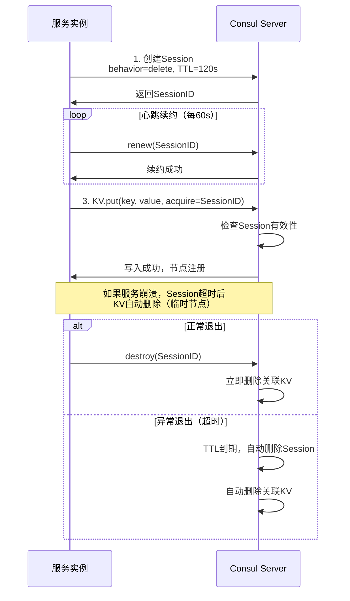

#### Session 关键参数

| 参数 | 说明 | bk-monitor 设置 |
|------|------|-----------------|
| **behavior** | Session 失效后的行为 | `"delete"` — 删除关联 KV |
| **lock_delay** | 锁释放延迟时间 | `0` — 立即释放 |
| **TTL** | 会话超时时间 | `120` 秒 |
| **renew** | 续约间隔 | 建议 `TTL / 2` |

---

## 2.3 实战：bk-monitor 的服务注册实现

### 📐 服务注册架构

bk-monitor 的告警后台服务通过 Consul KV 实现服务注册：

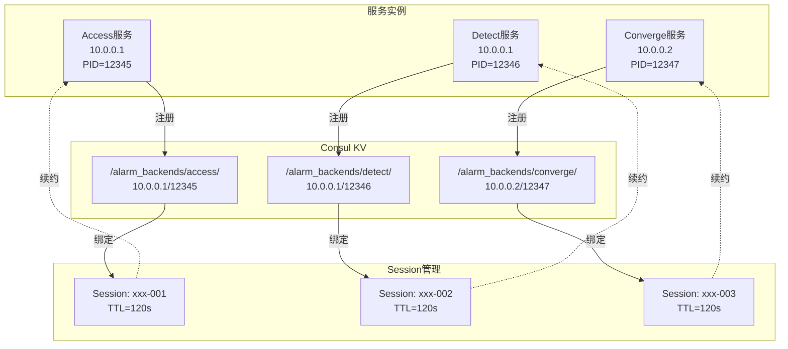

---

### 🔧 核心源码解析

#### 1. Consul 客户端封装

**文件位置**：`bkmonitor/utils/consul.py`

```python
# -*- coding: utf-8 -*-
"""
bk-monitor 的 Consul 客户端封装
支持 HTTP/HTTPS 协议，自动适配 Django 配置
"""

import os
import consul
from django.conf import settings


class BKConsul(consul.Consul):
    """
    自动适配 Django 配置的 Consul 客户端

    核心特性：
    1. 支持从 settings 自动读取配置
    2. 支持 TLS 双向认证（HTTPS）
    3. 支持客户端证书认证
    """

    def __init__(self, using_settings=True, scheme="http", verify=None, cert=None, port=8500, **kwargs):
        """
        初始化 Consul 客户端

        :param using_settings: 是否使用 Django settings 配置
        :param scheme: 协议类型（http/https）
        :param verify: 服务端 CA 证书路径
        :param cert: 客户端证书（证书+私钥）
        :param port: Consul 服务端口
        """

        if not using_settings:
            # 不使用 settings，直接初始化
            super(BKConsul, self).__init__(scheme=scheme, verify=verify, cert=cert, port=port, **kwargs)
            return

        # 从 settings 读取 Consul 配置
        host = self._get_settings("CONSUL_CLIENT_HOST")
        port = self._get_settings("CONSUL_CLIENT_PORT")

        # TLS 证书配置
        client_cert = self._get_settings("CONSUL_CLIENT_CERT_FILE")
        client_key = self._get_settings("CONSUL_CLIENT_KEY_FILE")
        server_cert = self._get_settings("CONSUL_SERVER_CA_CERT")
        https_port = self._get_settings("CONSUL_HTTPS_PORT")

        # 检查证书文件是否存在
        client_cert = client_cert if self._is_file_exists(client_cert) else None
        client_key = client_key if self._is_file_exists(client_key) else None
        server_cert = server_cert if self._is_file_exists(server_cert) else None

        # 配置客户端证书
        if client_cert is not None and client_key is not None and cert is None:
            cert = (client_cert, client_key)

        # 配置服务端证书验证
        if verify is None and server_cert is not None:
            verify = server_cert

        kwargs["host"] = host

        # 如果有证书配置，切换到 HTTPS
        if cert is not None:
            scheme = "https"
            port = https_port
            # SSL/TLS 不支持 127.0.0.1 作为 SNI，转换为 localhost
            if kwargs.get("host") == "127.0.0.1":
                kwargs["host"] = "localhost"

        super(BKConsul, self).__init__(scheme=scheme, verify=verify, cert=cert, port=port, **kwargs)

    def _get_settings(self, config_name):
        """从 Django settings 获取配置，空字符串返回 None"""
        value = getattr(settings, config_name, None)
        if value == "":
            return None
        return value

    def _is_file_exists(self, file_path):
        """检查文件是否存在"""
        if file_path is None:
            return False
        return os.path.isfile(file_path) and os.path.exists(file_path)
```

> 🎯 **设计亮点**：
> - 自动适配 Django 配置，无需手动传参
> - 支持 TLS 双向认证，保障安全通信
> - 空配置自动降级为 HTTP 模式

---

#### 2. 服务发现 Mixin 实现

**文件位置**：`alarm_backends/management/base/service_discovery.py`

```python
# -*- coding: utf-8 -*-
"""
基于 Consul KV 的服务发现实现
使用 Session 机制实现临时节点注册
"""

import json
import time
from consul import NotFound
from django.utils.functional import cached_property

from bkmonitor.utils import consul


class ConsulServiceDiscoveryMixin:
    """
    Consul 服务发现混入类

    设计模式：混入类（Mixin）
    - 提供服务注册、注销、查询能力
    - 可与其他类组合使用

    核心特性：
    1. 基于 Consul KV 的服务注册
    2. 使用 Session 实现临时节点（TTL=120s）
    3. 自动续约机制
    4. 支持按主机和实例查询
    """

    # Session ID（每个实例一个）
    __SESSION_ID__ = None

    # 配置参数（由子类覆盖）
    _PATH_PREFIX_ = None      # 注册路径前缀，如 "/alarm_backends/access"
    _SESSION_TTL_ = 120       # Session TTL（秒）

    def __init__(self, *args, **kwargs):
        super().__init__(*args, **kwargs)
        self.last_renew_session_time = 0  # 上次续约时间

    @cached_property
    def _client(self):
        """懒加载 Consul 客户端"""
        return consul.BKConsul()

    @cached_property
    def _registration_path(self):
        """
        注册路径：{PATH_PREFIX}/{host_addr}/{pid}

        示例：/alarm_backends/access/10.0.0.1/12345
        """
        return "/".join([self._PATH_PREFIX_, self.host_addr, self.pid])

    @property
    def _registry(self):
        """
        获取所有注册的节点

        返回格式：
        {
            "10.0.0.1": ["12345", "12346"],
            "10.0.0.2": ["12347"]
        }
        """
        _, node_list = self._client.kv.get(self._PATH_PREFIX_, keys=True)
        node_list = node_list or {}

        registry = {}
        for node in node_list:
            # 解析路径：从 node 中提取 host_addr 和 pid
            host_addr, pid = node[len(self._PATH_PREFIX_) + 1:].split("/")
            registry.setdefault(host_addr, []).append(pid)

        return registry

    def _renew_or_create_session_id(self):
        """
        创建或续约 Session

        Session 创建参数：
        - behavior="delete": Session 失效后自动删除关联 KV
        - lock_delay=0: 锁立即释放，无延迟
        - ttl=120: 120秒超时

        续约策略：距上次续约超过 TTL/2 才执行续约
        """
        session = consul.BKConsul.Session(self._client.agent.agent)

        if self.__SESSION_ID__:
            try:
                # 尝试续约已有 Session
                session.renew(self.__SESSION_ID__)
            except NotFound:
                # Session 已失效，重新创建
                self.__SESSION_ID__ = None

        if self.__SESSION_ID__ is None:
            # 创建新 Session
            self.__SESSION_ID__ = session.create(
                behavior="delete",  # 失效后删除 KV
                lock_delay=0,       # 立即释放
                ttl=self._SESSION_TTL_
            )

        return self.__SESSION_ID__

    def update_registration_info(self, value=None):
        """
        更新注册信息

        工作流程：
        1. 检查是否需要续约（超过 TTL/2）
        2. 续约或创建 Session
        3. 使用 acquire 参数写入 KV（实现分布式锁语义）
        """
        now = time.time()
        # 续约间隔检查：超过 TTL/2 才续约
        if now - self.last_renew_session_time < self._SESSION_TTL_ / 2:
            return
        self.last_renew_session_time = now

        # 序列化注册信息
        try:
            info = json.dumps(value)
        except:
            info = b""

        # 获取 Session ID
        session_id = self._renew_or_create_session_id()
        assert session_id, "session_id should not be None"

        # 使用 acquire 参数写入 KV
        # acquire=session_id 实现分布式锁语义：
        # - 只有持有 Session 的实例才能写入
        # - 同一 path 只能被一个实例持有
        self._client.kv.put(self._registration_path, info, acquire=session_id)

    def register(self, registration_info=None):
        """注册服务实例"""
        self.update_registration_info(registration_info)

    def unregister(self):
        """注销服务实例"""
        if self.__SESSION_ID__:
            # 销毁 Session，关联 KV 自动删除
            self._client.session.destroy(self.__SESSION_ID__)

    def query_for_hosts(self):
        """查询所有注册的主机"""
        return list(self._registry.keys())

    def query_for_instances(self, host_addr=None):
        """查询指定主机下的所有实例"""
        if host_addr is None:
            host_addr = self.host_addr

        registry = dict(self._registry)
        return (
            list(registry.keys()),  # 所有主机
            ["{}/{}".format(host_addr, pid) for pid in registry.get(host_addr, [])]  # 指定主机的实例
        )
```

---

### 📊 服务注册流程详解

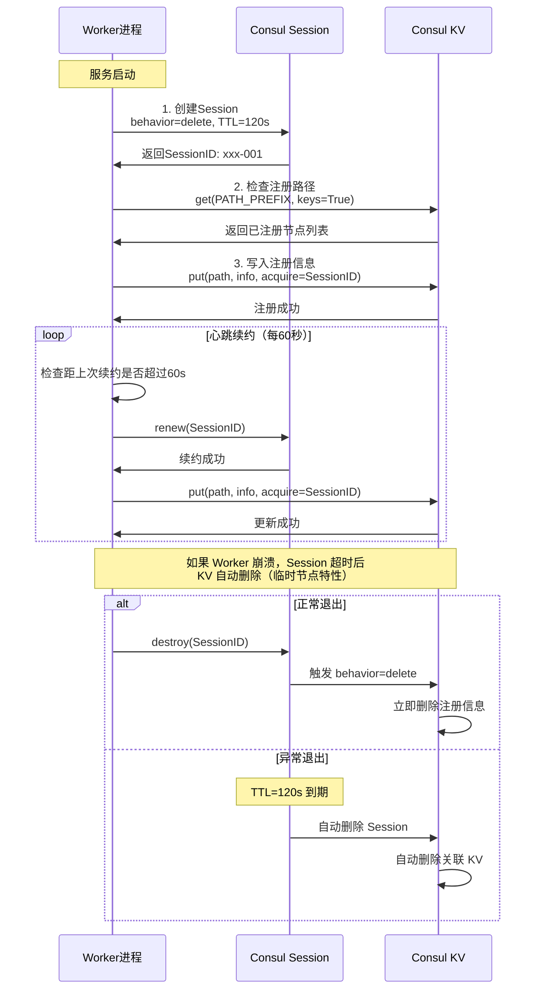

---

### 🔑 acquire 参数的工作原理

`acquire` 参数是 Consul KV 实现分布式锁的关键：

```python
# 使用 acquire 写入 KV
self._client.kv.put(key, value, acquire=session_id)
```

**工作机制**：

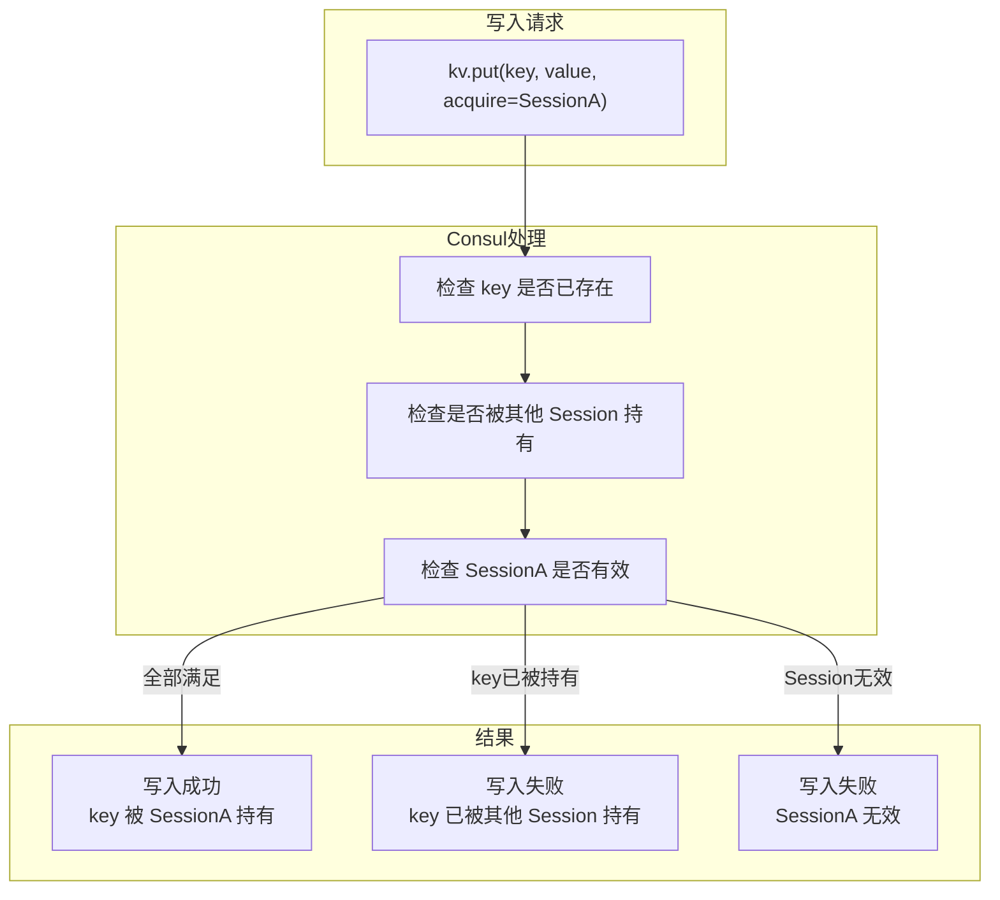

| 参数 | 说明 |
|------|------|
| **acquire** | 获取锁的 Session ID，成功写入后 key 被该 Session 持有 |
| **release** | 释放锁的 Session ID，写入后 key 解除持有关系 |

---

## 2.4 实战：Consul KV 配置中心应用

### 📐 配置中心架构

bk-monitor 使用 Consul KV 作为分布式配置中心，实现配置的集中管理和动态下发：

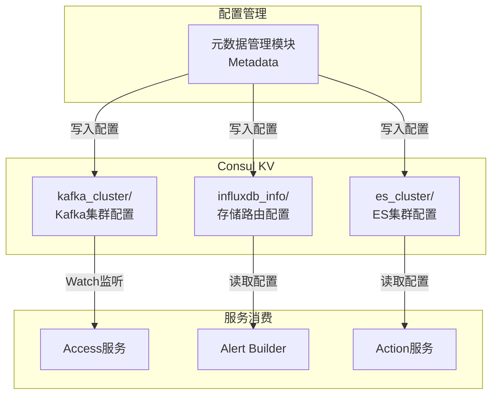

---

### 🔧 HashConsul 优化写入器

为了降低 Consul 的刷新频率，bk-monitor 实现了基于哈希比对的配置写入优化：

**文件位置**：`metadata/utils/consul_tools.py`

```python
# -*- coding: utf-8 -*-
"""
哈希优化的 Consul KV 写入器

核心思想：
写入前先比对哈希值，如果内容未变化则跳过写入，
从而降低 Consul 的刷新频率和网络开销
"""

import json
import logging
import time
from consul.base import ConsulException

from bkmonitor.utils import consul
from metadata.utils import hash_util


class HashConsul:
    """
    哈希优化的 Consul KV 写入器

    工作流程：
    1. 计算待写入内容的哈希值
    2. 获取 Consul 上已有内容的哈希值
    3. 比对哈希值，相同则跳过写入
    4. 不同才执行写入操作
    """

    def __init__(self, host="127.0.0.1", port=8500, scheme="http", verify=None, default_force=False):
        """
        :param default_force: 默认是否强制更新（跳过哈希比对）
        """
        self.host = host
        self.port = port
        self.scheme = scheme
        self.verify = verify
        self.default_force = default_force  # 强制更新标志

    def put(self, key, value, is_force_update=False, bk_data_id=None, *args, **kwargs):
        """
        KV 数据更新

        :param key: 键名
        :param value: 待写入内容（字典或数组）
        :param is_force_update: 本次是否强制更新
        :param bk_data_id: 数据源 ID（用于日志记录）
        :return: True 表示成功或内容无变化
        """
        consul_client = consul.BKConsul()

        # 0. 检查是否强制更新
        if self.default_force or is_force_update:
            logging.debug(f"key [{key}] force update, will write to consul")
            return consul_client.kv.put(key=key, value=json.dumps(value))

        # 1. 获取 Consul 上已有内容
        old_value = consul_client.kv.get(key)[1]
        if old_value is None:
            # 不存在则直接写入
            logging.info(f"key [{key}] not exists, will write to consul")
            return consul_client.kv.put(key=key, value=json.dumps(value))

        # 2. 计算新旧内容的哈希值
        old_hash = hash_util.object_md5(json.loads(old_value["Value"]))
        new_hash = hash_util.object_md5(value)

        # 3. 比对哈希值
        if old_hash == new_hash:
            # 内容相同，跳过写入
            logging.debug(f"key [{key}] hash unchanged [{new_hash}], skip update")
            return True

        # 4. 内容不同，执行写入
        logging.info(f"key [{key}] hash changed: old [{old_hash}] -> new [{new_hash}]")
        try:
            return consul_client.kv.put(key=key, value=json.dumps(value))
        except ConsulException as e:
            logging.error(f"put consul key error, data_id: {bk_data_id}, error: {e}")
            raise

    def get(self, key):
        """获取指定 KV"""
        consul_client = consul.BKConsul()
        return consul_client.kv.get(key)

    def delete(self, key, recurse=None):
        """删除指定 KV"""
        consul_client = consul.BKConsul()
        consul_client.kv.delete(key, recurse)
        logging.info(f"key [{key}] has been deleted")
```

---

### 📊 配置下发流程

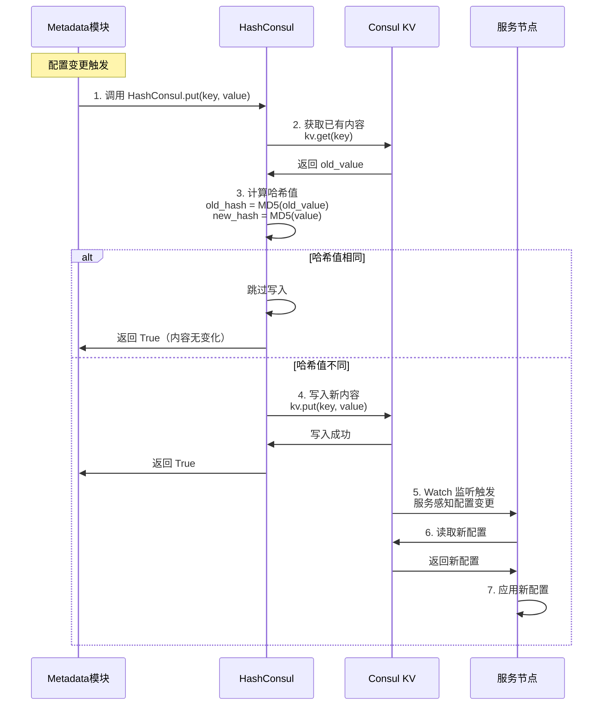

---

### 🎯 配置中心的典型应用场景

| 配置类型 | KV 路径 | 用途 |
|---------|---------|------|
| **Kafka 集群配置** | `kafka_cluster/` | 数据接入 Kafka 集群地址、Topic 配置 |
| **InfluxDB 路由** | `influxdb_info/version/` | 时序数据存储路由规则 |
| **ES 集群配置** | `es_cluster/` | 告警存储 ES 集群地址 |
| **Redis 集群配置** | `redis_cluster/` | 缓存集群路由 |

**版本号触发更新机制**：

```python
# 文件: metadata/utils/consul_tools.py

CONSUL_INFLUXDB_VERSION_PATH = "%s/influxdb_info/version/" % config.CONSUL_PATH

def refresh_router_version():
    """
    更新 Consul 指定路径下的版本号

    用途：触发所有服务节点感知存储路由变更
    服务节点通过 Watch 监听版本号变化，感知配置更新
    """
    client = consul.BKConsul()
    client.kv.put(key=CONSUL_INFLUXDB_VERSION_PATH, value=str(time.time()))
    logger.info("refresh influxdb version in consul success.")
```

---

## 2.5 服务健康检查与故障转移

### 🩺 健康检查机制

Consul 提供多种健康检查方式：

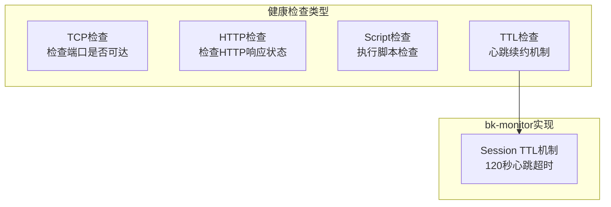

bk-monitor 使用 **Session TTL 机制** 实现健康检查：

| 方式 | 实现原理 | 检查频率 |
|------|---------|---------|
| **主动续约** | Worker 进程每 60 秒调用 `session.renew()` | 每 60 秒 |
| **被动检查** | Consul 在 TTL=120s 后自动删除失效 Session | 120 秒超时 |

---

### 🔄 故障转移流程

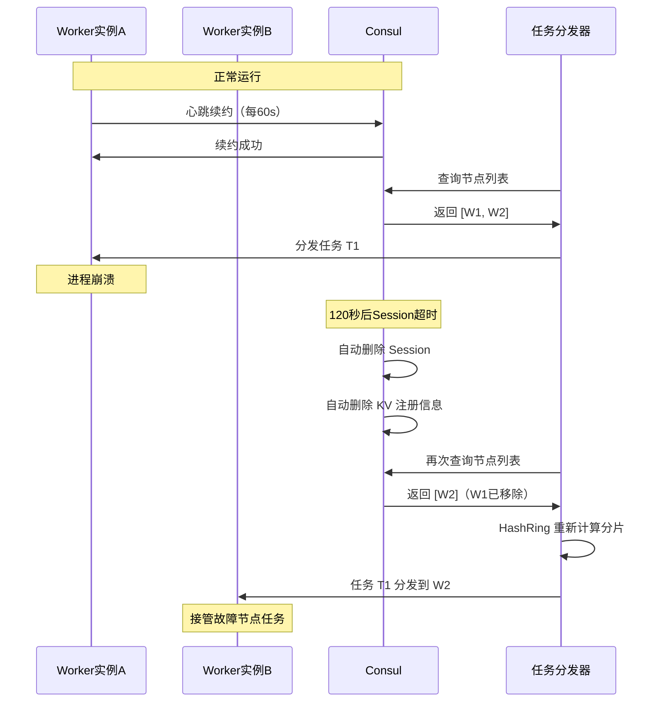

---

### 🎯 任务分发与 HashRing 结合

服务发现与一致性哈希结合，实现任务的分布式分发：

**文件位置**：`alarm_backends/management/base/dispatch.py`

```python
# -*- coding: utf-8 -*-
"""
基于服务发现的任务分发实现
结合 HashRing 实现一致性哈希分发
"""

from alarm_backends.management.hashring import HashRing


class DefaultDispatchMixin:
    """
    默认任务分发混入类

    工作流程：
    1. 从 Consul 查询所有可用节点
    2. 使用 HashRing 将目标（策略组）分发到节点
    3. 确保同一目标始终由同一节点处理
    """

    def dispatch_all_hosts(self, hosts):
        """
        分发所有目标到各节点

        :param hosts: 节点列表，格式 {host: weight}
        :return: (全部目标, 各节点分到的目标)
        """
        if isinstance(hosts, (list, tuple)):
            # 无权重时，默认权重为 1
            hosts = {host: 1 for host in hosts}

        # 获取所有待分发的目标（如策略组）
        targets = self.query_host_targets()

        # 初始化结果字典
        host_targets_dict = {host: list() for host in hosts}

        if targets:
            # 创建哈希环
            host_ring = HashRing(hosts)

            # 将每个目标分发到对应节点
            for target in targets:
                # 使用目标 ID 计算哈希，找到对应节点
                host = host_ring.get_node(target)
                host_targets_dict[host].append(target)

        return targets, host_targets_dict

    def dispatch_for_host(self, hosts):
        """
        获取当前主机分到的目标

        :param hosts: 所有可用节点
        :return: (全部目标, 当前主机的目标)
        """
        targets, host_targets_dict = self.dispatch_all_hosts(hosts)

        # 返回当前主机的目标列表
        return targets, host_targets_dict[self.host_addr]

    def dispatch_for_instance(self, hosts, instances, target_instance=None):
        """
        获取当前实例分到的目标

        同一主机可能有多个进程实例，需要进一步分发
        """
        if target_instance is None:
            target_instance = "{}/{}".format(self.host_addr, self.pid)

        _, host_targets = self.dispatch_for_host(hosts)
        instance_targets = []

        if target_instance in instances:
            # 获取需要在实例间进一步分发的目标
            targets = self.query_instance_targets(host_targets)

            if targets:
                # 使用索引轮询分发
                index = instances.index(target_instance)
                for i, target in enumerate(targets):
                    # 按实例数量轮询分配
                    if (i % len(instances)) == index:
                        instance_targets.append(target)

        return host_targets, instance_targets
```

---

### 📊 任务分发示意图

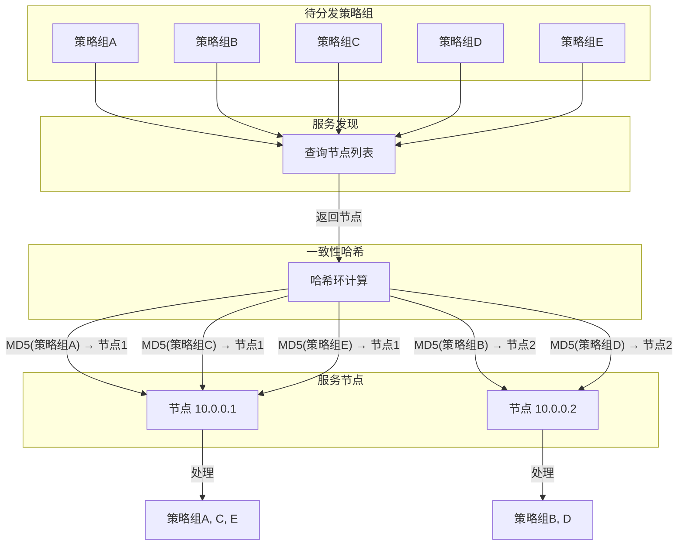

---

## 📝 本章小结

### ✅ 核心知识点回顾

| 概念 | 要点 | 代码位置 |
|------|------|---------|
| **服务发现** | 动态注册、自动注销、节点查询 | `service_discovery.py` |
| **Consul KV** | 层级存储、Session绑定、Watch监听 | `consul_tools.py` |
| **Session机制** | TTL=120s、behavior=delete、续约策略 | `_renew_or_create_session_id()` |
| **配置中心** | 哈希比对优化、版本号触发更新 | `HashConsul.put()` |
| **任务分发** | HashRing一致性哈希、故障自动转移 | `dispatch_for_host()` |

---

### 🎯 设计模式总结

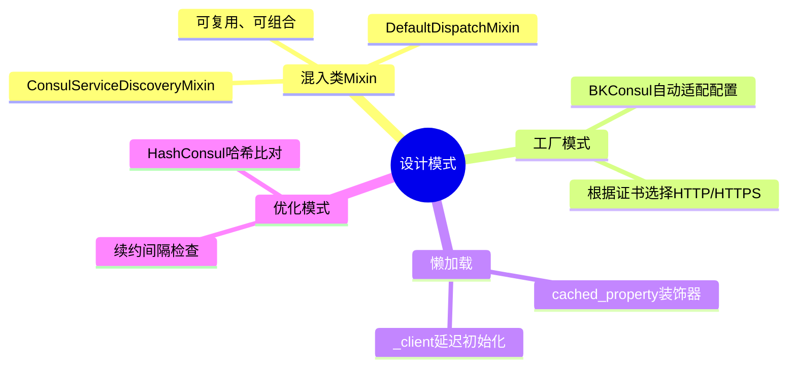

---

## 🤔 思考题

1. **为什么 Session 的 TTL 设置为 120 秒，续约间隔设置为 TTL/2？这个比例有什么考虑？**

2. **HashConsul 使用哈希比对来跳过写入，如果两个不同的内容恰好哈希值相同（哈希碰撞），会发生什么？这种情况在实际中是否需要担心？**

3. **服务发现使用 KV 而不是 Consul 的 Service 注册功能，这两种方式有什么区别？各自的优缺点是什么？**

4. **当某个节点故障后，其分到的任务会被重新分发到其他节点。这个过程会有数据丢失吗？如何保证？**

---

## 📁 相关源码索引

| 功能 | 源码路径 |
|------|---------|
| Consul 客户端 | `bkmonitor/utils/consul.py` |
| Consul 配置 | `config/tools/consul.py` |
| 服务发现实现 | `alarm_backends/management/base/service_discovery.py` |
| 协议定义 | `alarm_backends/management/base/protocol.py` |
| 任务分发 | `alarm_backends/management/base/dispatch.py` |
| 配置中心 | `metadata/utils/consul_tools.py` |

---

> 📖 **下一章预告**：第3章将深入讲解 **一致性哈希算法**，包括虚拟节点、哈希环的构建与查找，以及在 bk-monitor 中的具体应用。