# 第3章：一致性哈希

> 🎯 **学习目标**：理解一致性哈希解决的核心问题，掌握虚拟节点原理，深入解析 bk-monitor 的 HashRing 实现，并学会在任务分发场景中应用

---

## 3.1 为什么需要一致性哈希

### ❌ 传统哈希的问题

假设我们有 3 台服务器，使用最简单的取模哈希来分配任务：

```python
# 传统取模哈希
def traditional_hash(key, node_count):
    return hash(key) % node_count
```

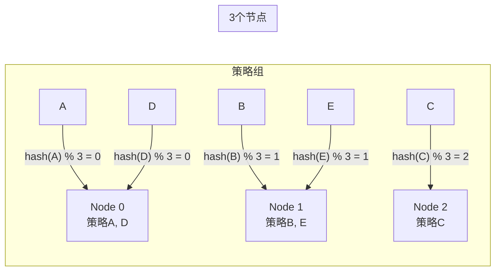

**看起来一切正常，但当节点数量变化时：**

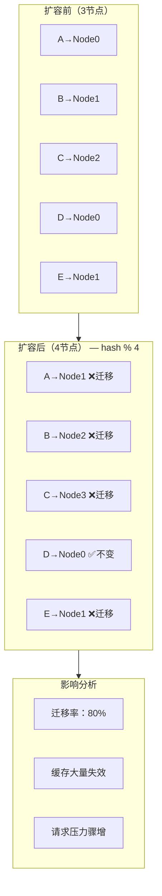

> 🐛 **核心问题**：节点数从 N 变为 N+1 时，大约有 **N/(N+1)** 的数据需要重新分配。对于 3→4 节点的场景，约 **75%** 的数据会被迁移！

---

### ✅ 一致性哈希的解决方案

一致性哈希（Consistent Hashing）由 MIT 的 David Karger 于 1997 年提出，核心思想是：

> **当节点数量变化时，只影响相邻节点间的数据迁移，而不是全局重新分配。**

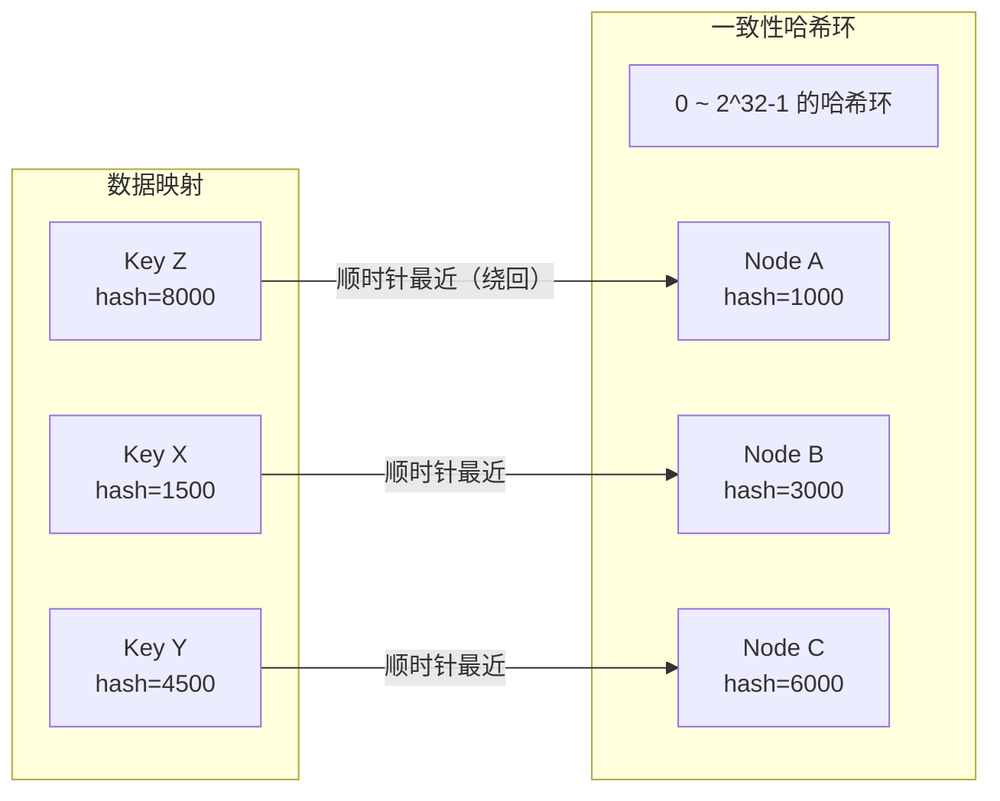

**节点变化时的迁移量对比**：

| 场景 | 传统取模 | 一致性哈希 |
|------|---------|-----------|
| 3→4 节点 | ~75% 数据迁移 | ~25% 数据迁移 |
| 3→5 节点 | ~80% 数据迁移 | ~20% 数据迁移 |
| 3→2 节点（缩容） | ~67% 数据迁移 | ~33% 数据迁移 |

---

## 3.2 虚拟节点与数据分片

### 🤔 为什么需要虚拟节点？

直接使用物理节点构造哈希环存在一个严重问题：**数据倾斜**

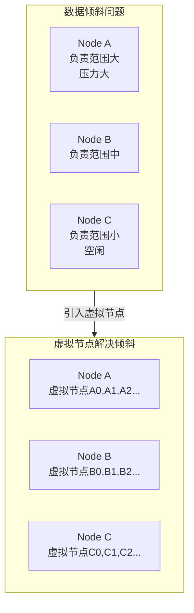

**虚拟节点的原理**：

每个物理节点对应多个虚拟节点，虚拟节点均匀分布在哈希环上：

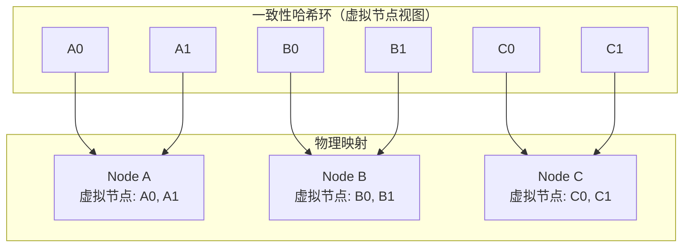

**虚拟节点的数量越多，数据分布越均匀**：

| 虚拟节点数/物理节点 | 最大/最小负载比 | 均匀性 |
|-------------------|----------------|--------|
| 1 | 可能 3:1 | 差 |
| 10 | 约 1.3:1 | 中等 |
| 100 | 约 1.1:1 | 好 |
| 1000+ | 接近 1:1 | 优秀 |

---

### 🔢 权重分配机制

bk-monitor 的 HashRing 支持按权重分配虚拟节点：

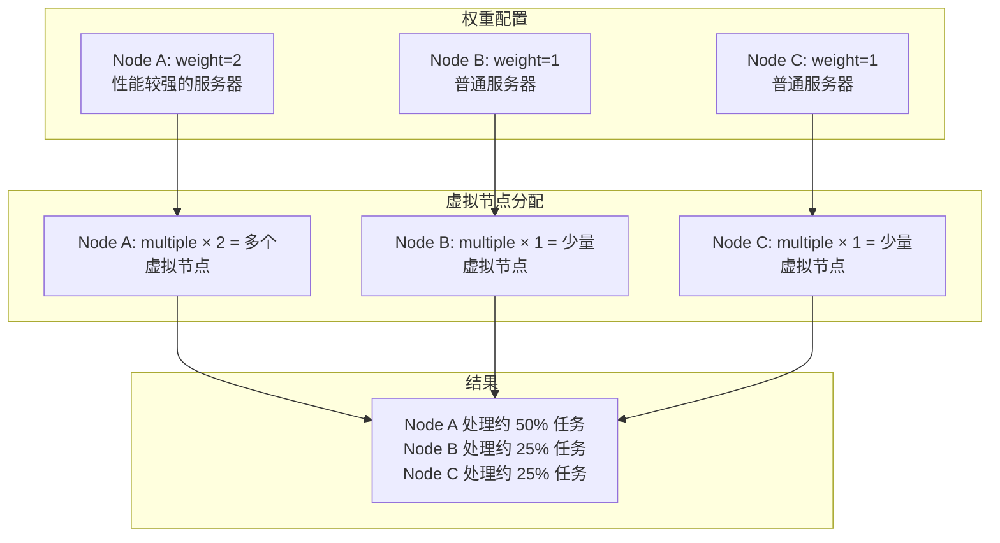

> 💡 **multiple 的计算公式**：`multiple = max(num_vnodes // sum_weight, 1)`
>
> 即虚拟节点总数除以权重总和，确保每个权重单位都能分配到合理的虚拟节点数。

---

## 3.3 实战：bk-monitor 的 HashRing 实现

### 📐 整体设计

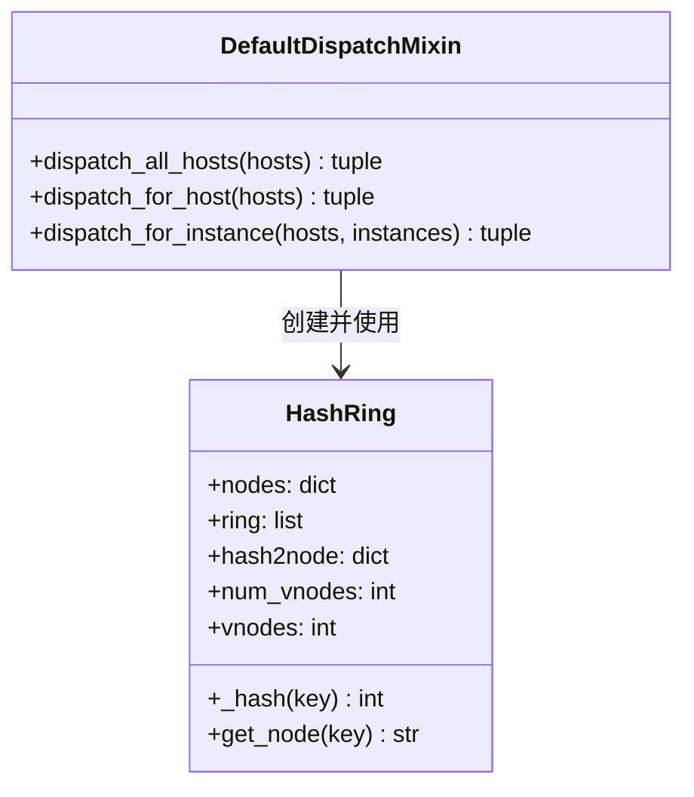

---

### 🔧 源码逐行解析

**文件位置**：`alarm_backends/management/hashring.py`

```python
# -*- coding: utf-8 -*-
"""
一致性哈希环实现
基于 MD5 + 虚拟节点 + 二分查找
"""

from bisect import bisect_left
from hashlib import md5
import six


class HashRing:
    """
    带权一致性哈希环

    核心特性：
    1. 基于 MD5 哈希函数
    2. 支持虚拟节点（默认 2^16 = 65536 个上限）
    3. 支持按权重分配
    4. 使用二分查找快速定位节点
    """

    def __init__(self, nodes, num_vnodes=2 ** 16):
        """
        构建哈希环

        :param nodes: 节点字典，格式 {"节点名": 权重}
                      例如 {"10.0.0.1": 1, "10.0.0.2": 2}
        :param num_vnodes: 虚拟节点上限，默认 65536
        """
        self.nodes = nodes

        # 两个核心数据结构
        self.ring = []        # 有序哈希值列表（哈希环）
        self.hash2node = {}   # 哈希值 → 物理节点映射

        # 计算每个权重单位对应的虚拟节点数
        self.num_vnodes = num_vnodes
        sum_weight = sum(nodes.values())
        multiple = max(int(self.num_vnodes // sum_weight), 1)  # 至少 1 个
        self.vnodes = multiple * sum_weight  # 实际虚拟节点总数

        # 为每个物理节点生成虚拟节点
        for node, weight in six.iteritems(nodes):
            for i in range(multiple):  # 注意：这里只按 multiple 生成，而非 weight * multiple
                # 虚拟节点名 = 物理节点名 + 序号
                h = self._hash(str(node) + str(i))
                self.ring.append(h)
                self.hash2node[h] = node

        # 排序形成有序环
        self.ring.sort()

    def _hash(self, key):
        """
        哈希函数：MD5 → 32 位整数

        步骤：
        1. 将 key 编码为 UTF-8 字节
        2. 计算 MD5 摘要（128 位）
        3. 转为十六进制字符串
        4. 取模映射到 0 ~ 2^32-1 范围

        :param key: 待哈希的键
        :return: 0 ~ 2^32-1 的整数
        """
        return int(md5(str(key).encode("utf-8")).hexdigest(), 16) % (2 ** 32)

    def get_node(self, key):
        """
        根据键找到对应的物理节点

        步骤：
        1. 对 key 进行哈希
        2. 在有序环上二分查找
        3. 顺时针找到第一个 >= 哈希值的虚拟节点
        4. 映射回物理节点

        :param key: 待查找的键（如策略组 ID）
        :return: 物理节点名
        """
        h = self._hash(key)
        # bisect_left: 找到第一个 >= h 的位置
        # % self.vnodes: 如果超出环尾，回到环首（环形结构）
        n = bisect_left(self.ring, h) % self.vnodes
        return self.hash2node[self.ring[n]]
```

---

### 📊 哈希环构建过程详解

以 3 个节点为例，逐步演示哈希环的构建过程：

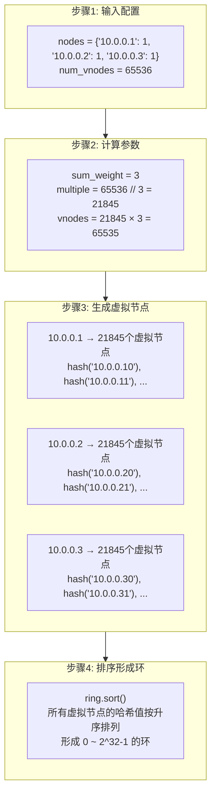

---

### 🔍 节点查找过程详解

以查找策略组 `"strategy_12345"` 为例：

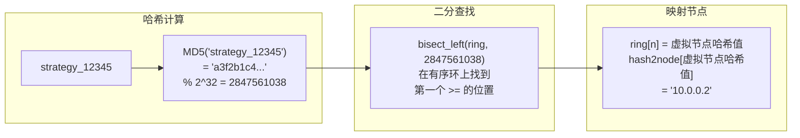

**具体的二分查找示意**：

```
哈希环（简化视图）：

位置:    0 -------- 1000 -------- 3000 -------- 6000 -------- 2^32-1
节点:    |  Node A   |   Node B    |   Node C    |  (回到Node A) |
         |           |             |             |               |
         |   A的区间  |   B的区间    |   C的区间    |  A的区间      |

查找 key="strategy_12345"，哈希值 = 2500
                    ↓
         bisect_left(ring, 2500) = 2（指向3000，即Node B的虚拟节点）
                    ↓
         结果：strategy_12345 → Node B
```

---

### 📐 关键参数选择分析

| 参数 | 值 | 选择理由 |
|------|-----|---------|
| **num_vnodes** | `2^16 = 65536` | 虚拟节点上限，足够保证分布均匀 |
| **哈希函数** | `MD5 % 2^32` | MD5 分布均匀、计算快速，32 位空间足够大 |
| **查找算法** | `bisect_left` | Python 标准库二分查找，时间复杂度 O(log N) |
| **取模范围** | `2^32` | 约 42 亿空间，哈希冲突概率极低 |

> 💡 **时间复杂度分析**：
> - 构建哈希环：`O(N × M × log(N × M))`，其中 N 是物理节点数，M 是 multiple
> - 查找节点：`O(log(N × M))`，二分查找
> - 实际使用中，构建一次、反复查找，非常高效

---

## 3.4 哈希环在任务分发中的应用

### 📐 两级分发架构

bk-monitor 的任务分发采用 **主机级 + 实例级** 两级分发：

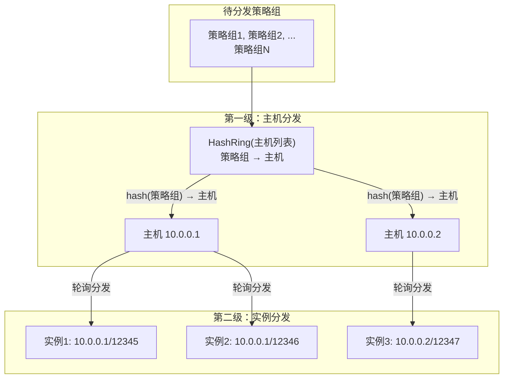

---

### 🔧 任务分发源码解析

**文件位置**：`alarm_backends/management/base/dispatch.py`

```python
# -*- coding: utf-8 -*-
"""
基于一致性哈希的任务分发
支持两级分发：主机级 + 实例级
"""

from alarm_backends.management.hashring import HashRing


class DefaultDispatchMixin:
    """
    默认任务分发混入类

    两级分发策略：
    1. 主机级：通过 HashRing 将策略组分发到不同主机
    2. 实例级：同一主机内多个进程实例轮询分配
    """

    def dispatch_all_hosts(self, hosts):
        """
        第一级：将所有策略组分发到各主机

        :param hosts: 主机列表或字典
                      列表格式: ['10.0.0.1', '10.0.0.2']
                      字典格式: {'10.0.0.1': 1, '10.0.0.2': 2}（支持权重）
        :return: (全部目标, 各主机的目标字典)
        """
        # 统一转换为权重字典
        if isinstance(hosts, (list, tuple)):
            hosts = {host: 1 for host in hosts}

        # 获取所有待分发的策略组
        targets = self.query_host_targets()

        # 初始化每个主机的目标列表
        host_targets_dict = {host: list() for host in hosts}

        if targets:
            # 创建哈希环
            host_ring = HashRing(hosts)

            # 逐个策略组计算归属节点
            for target in targets:
                host = host_ring.get_node(target)  # 哈希查找
                host_targets_dict[host].append(target)

        return targets, host_targets_dict

    def dispatch_for_host(self, hosts):
        """
        获取当前主机分到的策略组

        :param hosts: 所有可用主机
        :return: (全部目标, 当前主机的目标)
        """
        targets, host_targets_dict = self.dispatch_all_hosts(hosts)

        # 只返回当前主机分到的策略组
        return targets, host_targets_dict[self.host_addr]

    def dispatch_for_instance(self, hosts, instances, target_instance=None):
        """
        第二级：将主机分到的策略组进一步分配到进程实例

        分配策略：轮询（Round Robin）
        - 将策略组按索引分配给不同实例
        - 实例1: 第0, 3, 6...个策略组
        - 实例2: 第1, 4, 7...个策略组
        - 实例3: 第2, 5, 8...个策略组

        :param hosts: 所有可用主机
        :param instances: 当前主机的所有实例列表
        :param target_instance: 目标实例标识（默认当前实例）
        :return: (主机级目标, 当前实例的目标)
        """
        if target_instance is None:
            target_instance = "{}/{}".format(self.host_addr, self.pid)

        # 先获取主机级分发结果
        _, host_targets = self.dispatch_for_host(hosts)
        instance_targets = []

        if target_instance in instances:
            # 获取需要进一步分发的目标
            targets = self.query_instance_targets(host_targets)

            if targets:
                # 轮询分发：根据实例索引分配
                index = instances.index(target_instance)
                for i, target in enumerate(targets):
                    if (i % len(instances)) == index:
                        instance_targets.append(target)

        return host_targets, instance_targets

    def query_instance_targets(self, host_targets):
        """获取实例级待分发目标（默认与主机级相同）"""
        return host_targets
```

---

### 📊 分发示例详解

假设有 2 台主机，每台主机 2 个进程实例，共 8 个策略组：

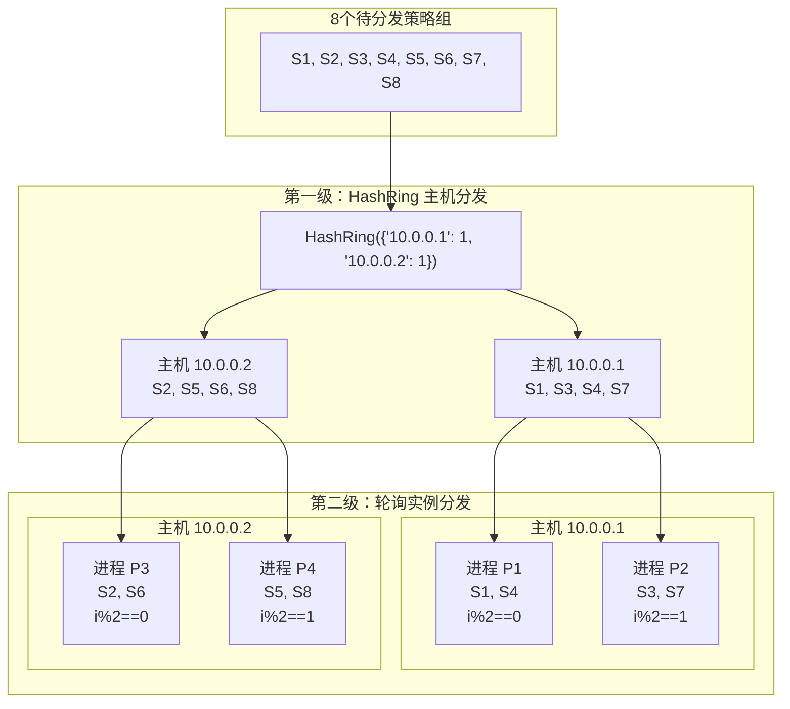

**轮询分发逻辑**：

```
主机 10.0.0.1 分到：[S1, S3, S4, S7]
实例列表：[P1, P2]

P1 的 index = 0
  S1 (i=0): 0 % 2 == 0 ✅ → P1
  S3 (i=1): 1 % 2 == 0 ❌
  S4 (i=2): 2 % 2 == 0 ✅ → P1
  S7 (i=3): 3 % 2 == 0 ❌
  P1 分到：[S1, S4]

P2 的 index = 1
  S1 (i=0): 0 % 2 == 1 ❌
  S3 (i=1): 1 % 2 == 1 ✅ → P2
  S4 (i=2): 2 % 2 == 1 ❌
  S7 (i=3): 3 % 2 == 1 ✅ → P2
  P2 分到：[S3, S7]
```

---

### 🔄 节点变化时的重新分发

当某个节点故障或新增节点时，一致性哈希的优势就体现出来了：

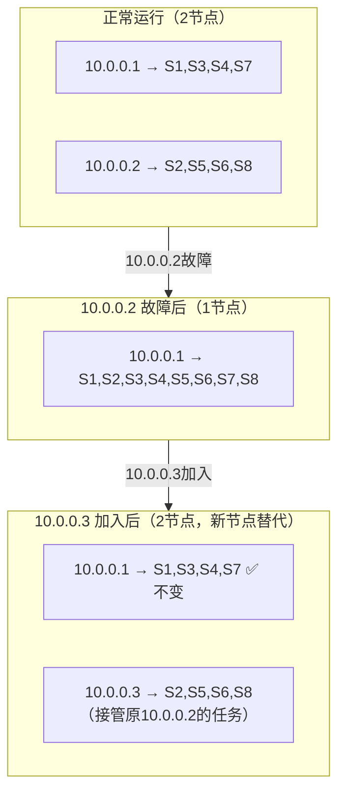

**迁移分析**：

| 场景 | 受影响的策略组 | 迁移率 | 不变的策略组 |
|------|--------------|--------|-------------|
| 10.0.0.2 故障 | S2,S5,S6,S8 迁移到 10.0.0.1 | 50% | S1,S3,S4,S7 ✅ |
| 10.0.0.3 加入 | S2,S5,S6,S8 迁移到 10.0.0.3 | 50% | S1,S3,S4,S7 ✅ |

> 🎯 **对比传统取模**：传统方式下节点变化会导致 **几乎所有数据** 重新分配；一致性哈希只有约 `1/N` 的数据需要迁移。

---

### 🔁 完整的调度生命周期

一致性哈希在整个服务生命周期中的作用：

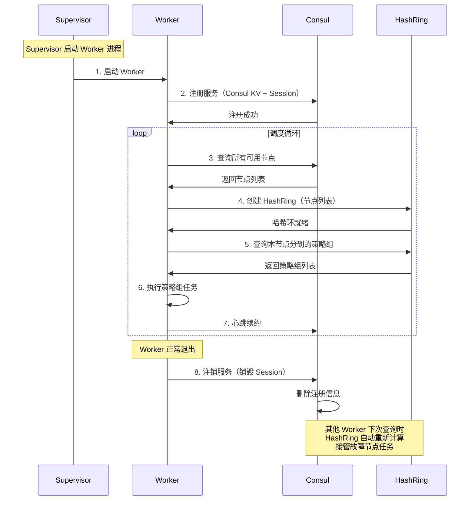

---

## 📝 本章小结

### ✅ 核心知识点回顾

| 概念 | 要点 | bk-monitor 实现 |
|------|------|----------------|
| **传统哈希的问题** | 节点变化导致大量数据迁移 | — |
| **一致性哈希** | 只影响相邻节点，最小化迁移 | `HashRing` 类 |
| **虚拟节点** | 解决数据倾斜，均匀分布 | 默认 65536 个上限 |
| **权重分配** | 性能强的节点处理更多任务 | `multiple = num_vnodes // sum_weight` |
| **两级分发** | 主机级 HashRing + 实例级轮询 | `DefaultDispatchMixin` |
| **故障转移** | 节点变化时自动重新分片 | Consul + HashRing 联动 |

---

### 🎯 一致性哈希 vs 其他分片方案

| 方案 | 节点变化迁移量 | 复杂度 | 适用场景 |
|------|--------------|--------|---------|
| **取模哈希** | ~100% | 低 | 固定节点数 |
| **一致性哈希** | ~1/N | 中 | 动态节点、缓存 |
| **Range 分片** | 取决于范围边界 | 中 | 数据库分库 |
| **Hash Slot（Redis Cluster）** | ~1/N | 高 | Redis 集群 |

---

## 🤔 思考题

1. **HashRing 中使用 `bisect_left` 进行查找，如果 key 的哈希值大于环上所有虚拟节点的哈希值，会发生什么？为什么这样做是正确的？**

2. **当前实现中虚拟节点名为 `str(node) + str(i)`，如果两个不同的物理节点恰好生成了相同的虚拟节点哈希值，会有什么影响？如何避免？**

3. **在两级分发中，第二级使用轮询（Round Robin）而不是继续使用一致性哈希。为什么？如果第二级也用一致性哈希有什么优缺点？**

4. **当集群节点频繁上下线时，HashRing 会频繁重建。这可能导致同一策略组在不同节点间频繁切换。如何解决这种"抖动"问题？**

---

## 📁 相关源码索引

| 功能 | 源码路径 |
|------|---------|
| 一致性哈希环 | `alarm_backends/management/hashring.py` |
| 任务分发 | `alarm_backends/management/base/dispatch.py` |
| 服务发现 | `alarm_backends/management/base/service_discovery.py` |
| 分发协议 | `alarm_backends/management/base/protocol.py` |

---

> 📖 **下一部分预告**：第三部分将深入 **分布式锁与并发控制**，包括 Redis 分布式锁原理、批量锁、服务锁设计，以及告警收敛中的并发控制策略。