# 第三部分：分布式锁与并发控制

# 第4章：分布式锁原理与实践

> 🎯 **学习目标**：理解分布式锁的必要性、掌握 Redis 分布式锁的核心原理，深入解析 bk-monitor 的 RedisLock、MultiRedisLock 实现，并学会在实际场景中正确使用

---

## 4.1 分布式锁的必要性与挑战

### ❓ 为什么需要分布式锁

在单机程序中，我们用线程锁（`threading.Lock`）或进程锁（`multiprocessing.Lock`）来保护共享资源。但在分布式系统中，多个进程分布在不同机器上，传统锁无法跨进程生效。

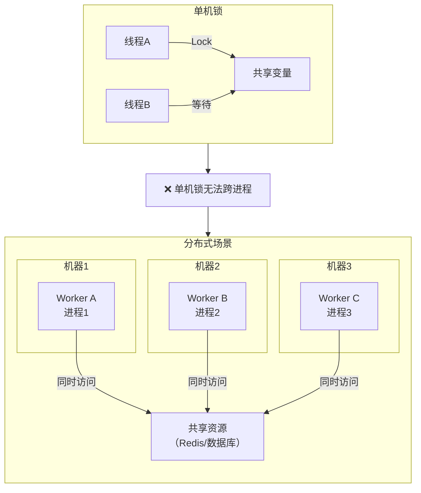

### 🎯 bk-monitor 中的典型场景

在 bk-monitor 告警后台中，同一时刻可能有多个 Worker 进程同时处理同一策略的告警数据：

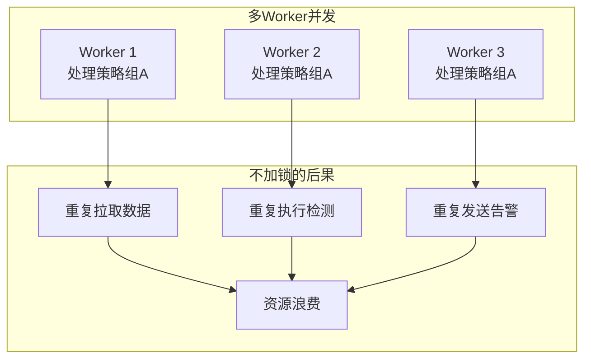

**bk-monitor 中需要分布式锁的场景**：

| 场景 | 锁类型 | 说明 |
|------|--------|------|
| 数据接入 | `service_lock` | 同一策略组同时只有一个 Worker 接入 |
| 异常检测 | `service_lock` | 同一策略同时只有一个 Worker 检测 |
| 告警构建 | `multi_service_lock` | 批量锁定多个告警，防止重复构建 |
| 告警收敛 | `service_lock` | 收敛处理期间防止并发修改 |
| 动作执行 | `service_lock` | 防止重复执行通知动作 |
| 任务去重 | `share_lock` | 同名 Celery 任务只有一个实例运行 |
| 缓存刷新 | `share_lock` | 防止多个 Worker 同时刷新缓存 |
| AIOPS预处理 | `refresh_service_lock` | 支持锁续约，任务重载时旧实例退出 |

---

### ⚠️ 分布式锁的挑战

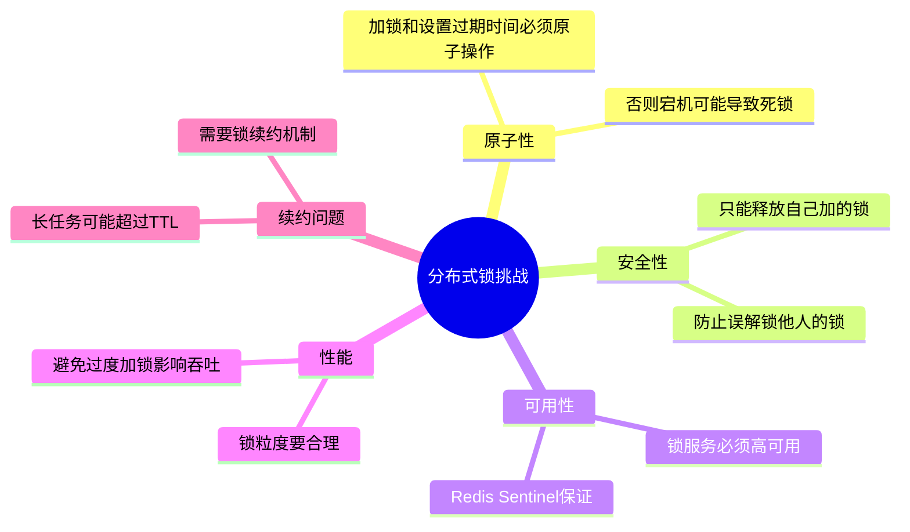

---

## 4.2 Redis 分布式锁实现原理

### 🔑 SET NX EX 命令

Redis 分布式锁的核心是 `SET key value NX EX seconds` 命令：

| 参数 | 含义 | 作用 |
|------|------|------|
| **NX** | Not eXists，仅在 key 不存在时设置 | 保证互斥性 |
| **EX** | 设置过期时间（秒） | 防止死锁 |
| **value** | 锁的持有者标识 | 防止误解锁 |

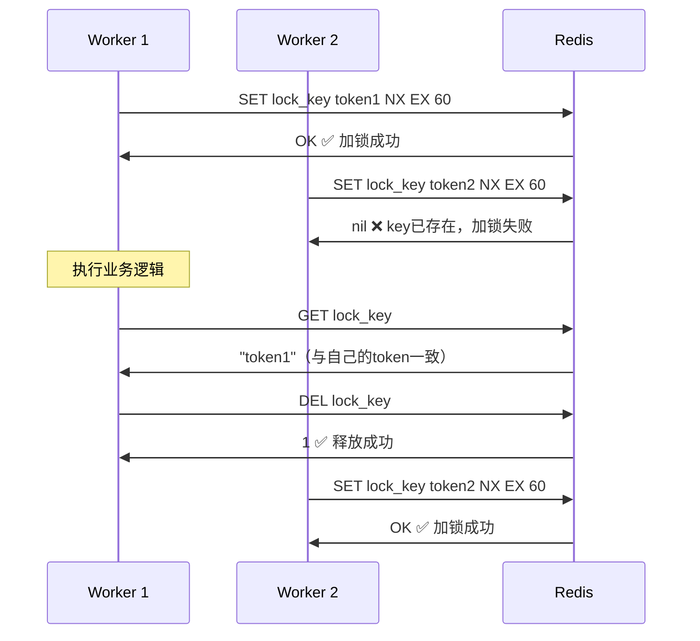

### 🛡️ 为什么需要 Token

Token（也称为 owner tag）是防止误解锁的关键机制：

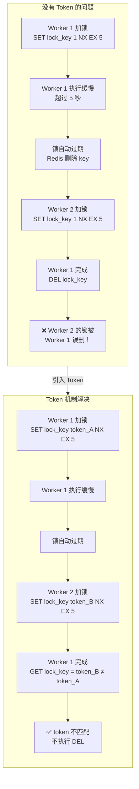

---

## 4.3 实战：bk-monitor 的 RedisLock 源码解析

### 📐 锁的类层次结构

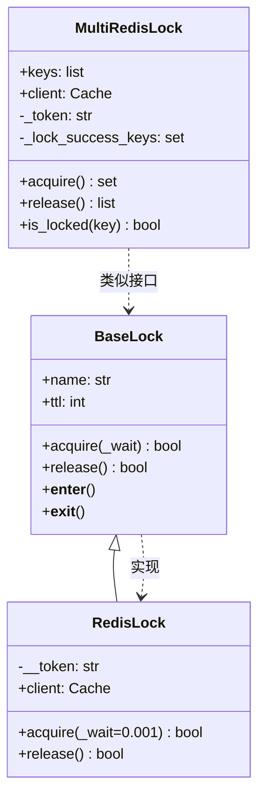

---

### 🔧 BaseLock 基类

**文件位置**：`alarm_backends/core/lock/__init__.py`

```python
class BaseLock:
    """
    锁基类

    核心设计：
    1. 默认 TTL = 60 秒（CONST_MINUTES），防止死锁
    2. 支持 with 上下文管理器语法
    3. 子类需实现 acquire() 和 release()
    """

    def __init__(self, name, ttl=None):
        self.name = name
        # 默认 60 秒过期，防止持有锁的进程崩溃导致死锁
        self.ttl = ttl or CONST_MINUTES  # CONST_MINUTES = 60

    def acquire(self, _wait=None):
        """获取锁，子类必须实现"""
        raise NotImplementedError

    def release(self):
        """释放锁，子类必须实现"""
        raise NotImplementedError

    def __exit__(self, t, v, tb):
        """退出 with 块时自动释放锁"""
        self.release()

    def __enter__(self):
        """进入 with 块时自动获取锁"""
        self.acquire()
        return self
```

> 💡 **上下文管理器设计**：通过 `__enter__` / `__exit__` 支持 `with` 语法，确保锁一定会被释放，即使发生异常。

---

### 🔧 RedisLock 核心实现

**文件位置**：`alarm_backends/core/lock/__init__.py`

```python
class RedisLock(BaseLock):
    """
    基于 Redis SET NX EX 的分布式锁

    核心特性：
    1. 使用 SET NX EX 保证原子性
    2. Token 机制防止误解锁
    3. 自旋等待 + 超时机制
    4. 使用 service-lock 后端（DB 10）
    """

    __token = None  # 当前锁持有者的唯一标识

    def __init__(self, name, ttl=None):
        super().__init__(name, ttl)
        # 使用 service-lock 后端（Redis DB 10）
        self.client = Cache("service-lock")

    def acquire(self, _wait=0.001):
        """
        获取分布式锁

        :param _wait: 最大等待时间（秒），默认 0.001 即几乎不等待
        :return: True 获取成功，False 获取失败

        工作流程：
        1. 生成唯一 Token
        2. 尝试 SET NX EX
        3. 失败则自旋等待（10ms 间隔）
        4. 超时后返回 False
        """
        token = uniqid4()          # 生成唯一标识
        wait_until = time.time() + _wait

        # 自旋等待：反复尝试获取锁
        while not self.client.set(self.name, token, ex=self.ttl, nx=True):
            if time.time() < wait_until:
                time.sleep(0.01)   # 等 10ms 再试
            else:
                return False       # 超时，获取失败

        self.__token = token       # 记录自己的 token
        return True

    def release(self):
        """
        释放分布式锁

        安全释放流程：
        1. 检查是否有 token（是否持有锁）
        2. 读取当前锁的 token
        3. 比对自己的 token（防止误解锁）
        4. token 匹配才删除

        :return: True 释放成功，False 释放失败
        """
        if not self.__token:
            return False           # 没有持有锁

        token = self.client.get(self.name)

        if not token or token != self.__token:
            # 锁已不存在 或 token 不匹配（可能已过期被他人获取）
            return False

        return self.client.delete(self.name)
```

---

### 📊 RedisLock 工作流程

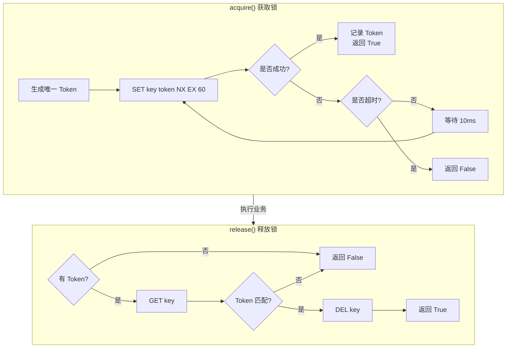

---

### 🎯 RedisLock 使用示例

在告警后台各模块中的实际使用方式：

```python
# 文件: alarm_backends/service/access/tasks.py
from alarm_backends.core.lock.service_lock import service_lock

def run_access_data(strategy_group_key, interval):
    """数据接入任务"""
    # 使用 service_lock 保证同一策略组同时只有一个 Worker 接入
    with service_lock(key.SERVICE_LOCK_ACCESS, strategy_group_key=strategy_group_key):
        # 加锁成功，执行数据接入逻辑
        AccessDataProcess(strategy_group_key, interval).process()
    # with 块结束，自动释放锁
```

```python
# 文件: alarm_backends/service/detect/process.py
from alarm_backends.core.lock.service_lock import service_lock

class DetectProcess:
    def process(self):
        """异常检测主流程"""
        # 同一策略同时只有一个 Worker 执行检测
        with service_lock(key.SERVICE_LOCK_DETECT, strategy_id=self.strategy_id):
            data = self.pull_data()
            self.handle_data(data)
            self.push_data()
```

---

### 📋 service_lock 封装

**文件位置**：`alarm_backends/core/lock/service_lock.py`

```python
@contextmanager
def service_lock(key_instance, **kwargs):
    """
    服务级锁上下文管理器

    封装 RedisLock，提供更友好的使用方式

    :param key_instance: RedisDataKey 对象，包含 key 模板和 TTL
    :param kwargs: key 模板的参数

    使用示例：
        with service_lock(SERVICE_LOCK_ACCESS, strategy_group_key="group_1"):
            # 执行业务逻辑
            pass
    """
    lock = None
    lock_key = key_instance.get_key(**kwargs)  # 根据模板生成实际的 key
    try:
        lock = RedisLock(lock_key, key_instance.ttl)
        if lock.acquire(0.1):   # 等待 100ms
            yield lock           # 加锁成功，执行业务逻辑
        else:
            raise LockError(msg=f"{lock_key} is already locked")
    except LockError as err:
        raise err                # 向上抛出锁异常
    finally:
        if lock is not None:
            lock.release()       # 确保锁一定被释放
```

> 🎯 **设计亮点**：
> - `key_instance.get_key(**kwargs)` 支持动态参数生成不同的锁 key
> - `finally` 块确保异常时也能释放锁
> - 加锁失败抛出 `LockError` 而非静默忽略，便于问题排查

---

## 4.4 批量锁与 Pipeline 原子操作

### 🤔 为什么需要批量锁

告警构建（Alert Builder）和告警管理（Alert Manager）场景中，需要同时处理多个告警对象，如果逐个加锁，效率低且可能产生部分加锁的死锁状态。

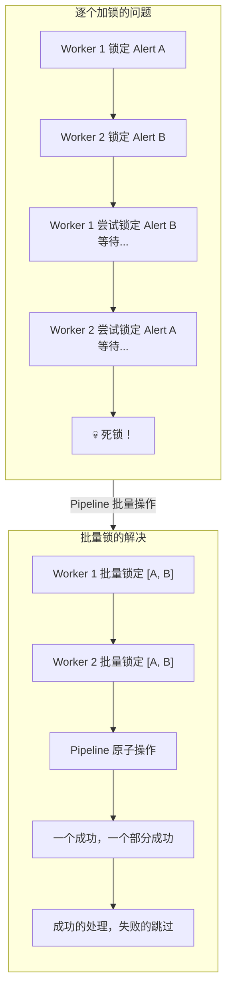

---

### 🔧 MultiRedisLock 源码解析

**文件位置**：`alarm_backends/core/lock/__init__.py`

```python
class MultiRedisLock:
    """
    Redis 批量锁

    核心设计：
    1. 使用 Pipeline 批量发送 SET NX EX，减少网络往返
    2. 记录成功获取的 key 集合
    3. 释放时只释放自己成功获取的锁
    4. 通过 Token 机制防止误解锁
    """

    def __init__(self, keys: list[str], ttl: int = None):
        self.keys = keys
        self.ttl = ttl or CONST_MINUTES  # 默认 60 秒
        self.client = Cache("service-lock")
        self._token = uniqid4()               # 所有 key 共用同一个 Token
        self._lock_success_keys = set()       # 成功获取锁的 key 集合

    def acquire(self):
        """
        批量获取锁

        使用 Pipeline 批量发送命令：
        - 将多次 Redis 命令打包一次发送
        - 减少网络往返时间（RTT）
        - 注意：transaction=False 表示非事务模式

        :return: 成功获取锁的 key 集合
        """
        if not self.keys:
            return []

        keys = list(set(self.keys))  # 去重

        # 创建 Pipeline（非事务模式）
        pipeline = self.client.pipeline(transaction=False)

        # 批量打包 SET NX EX 命令
        for key in keys:
            pipeline.set(key, self._token, ex=self.ttl, nx=True)

        # 一次性发送所有命令
        results = pipeline.execute()

        # 记录成功的 key
        for index, locked in enumerate(results):
            if locked:
                self._lock_success_keys.add(keys[index])

        return self._lock_success_keys

    def release(self):
        """
        批量释放锁

        安全释放流程：
        1. MGET 批量获取所有成功 key 的 token
        2. 比对 token，只释放匹配的
        3. 批量删除匹配的 key

        :return: 实际释放的 key 列表
        """
        if not self._lock_success_keys:
            return

        lock_success_keys = list(self._lock_success_keys)

        # 批量获取 token
        results = self.client.mget(lock_success_keys)

        keys_to_delete = []
        for index, token in enumerate(results):
            if token == self._token:
                # Token 匹配，可以安全删除
                keys_to_delete.append(lock_success_keys[index])

        if keys_to_delete:
            self.client.delete(*keys_to_delete)

        return keys_to_delete

    def is_locked(self, key: str):
        """查询某个 key 是否已获得锁"""
        return key in self._lock_success_keys
```

---

### 📊 Pipeline 原子操作详解

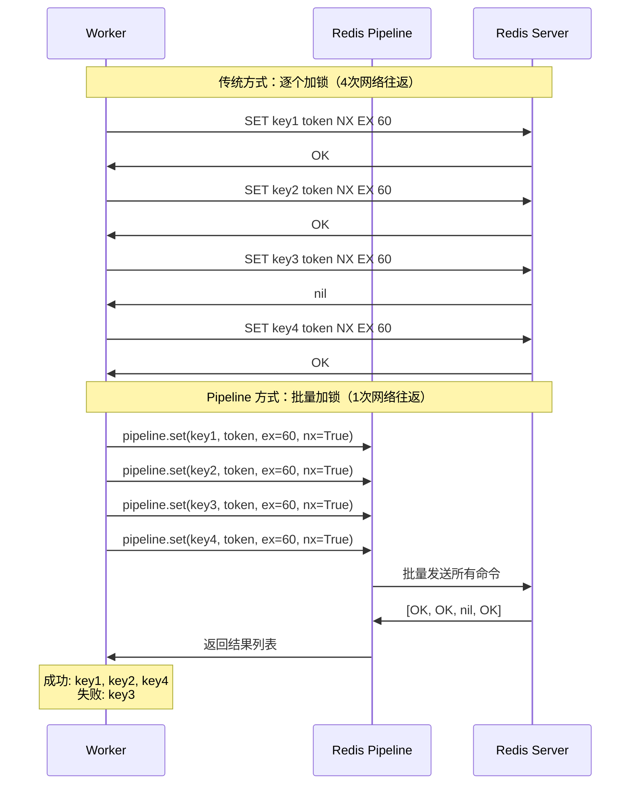

---

### 🎯 multi_service_lock 使用示例

```python
# 文件: alarm_backends/service/alert/builder/processor.py
from alarm_backends.core.lock.service_lock import multi_service_lock

class AlertBuilder:
    def handle(self, events):
        """处理告警事件"""
        # 生成需要锁定的 key 列表
        lock_keys = [f"alert_update_{event.alert_id}" for event in events]

        # 批量锁定所有相关告警
        with multi_service_lock(ALERT_UPDATE_LOCK, lock_keys) as lock:
            for event in events:
                if lock.is_locked(f"alert_update_{event.alert_id}"):
                    # 只处理成功获取锁的告警
                    self.process_event(event)
                # 跳过未能获取锁的告警（其他 Worker 正在处理）
```

```python
# 文件: alarm_backends/service/alert/manager/processor.py
from alarm_backends.core.lock.service_lock import multi_service_lock

class AlertManager:
    def handle(self, alerts):
        """批量管理告警状态"""
        lock_keys = [alert.lock_key for alert in alerts]

        with multi_service_lock(ALERT_UPDATE_LOCK, lock_keys) as lock:
            for alert in alerts:
                if lock.is_locked(alert.lock_key):
                    # 执行状态检查和更新
                    self.check_and_update(alert)
```

---

### 📊 RedisLock vs MultiRedisLock 对比

| 特性 | RedisLock | MultiRedisLock |
|------|-----------|----------------|
| **加锁数量** | 单个 key | 多个 key |
| **网络往返** | 1 次（单条命令） | 1 次（Pipeline 批量） |
| **等待机制** | 自旋等待 + 超时 | 无等待，立即返回 |
| **Token** | 每次获取生成新 Token | 所有 key 共用一个 Token |
| **释放方式** | GET 比对 + DEL | MGET 批量比对 + 批量 DEL |
| **适用场景** | 单资源互斥 | 多资源批量操作 |
| **典型应用** | 数据接入、异常检测 | 告警构建、告警管理 |

---

## 4.5 锁续约与防误解锁机制

### 🔄 share_lock — Celery 任务去重锁

**文件位置**：`alarm_backends/core/lock/service_lock.py`

```python
def share_lock(ttl=600, identify=None):
    """
    Celery 任务去重装饰器

    核心思想：
    同名任务同一时刻只有一个 Worker 在执行

    :param ttl: 锁过期时间，默认 600 秒
    :param identify: 自定义标识，防止不同模块函数重名

    使用示例：
        @share_lock(ttl=300)
        def refresh_cache():
            # 同一时刻只有一个 Worker 执行
            ...
    """

    def wrapper(func):
        @functools.wraps(func)
        def _inner(*args, **kwargs):
            token = str(time.time())  # 使用时间戳作为 Token

            # 生成锁 key
            # 默认用函数名，可通过 identify 参数自定义
            name = func.__name__ if identify is None else identify
            cache_key = f"{get_cluster().name}_celery_lock_{name}"

            client = Cache("service-lock")

            # 尝试获取锁
            lock_success = client.set(cache_key, token, ex=ttl, nx=True)
            if not lock_success:
                # 已有其他 Worker 在执行，直接跳过
                return

            try:
                return func(*args, **kwargs)
            finally:
                # 执行完毕后检查 token，防止误解锁
                if client.get(cache_key) == token:
                    client.delete(cache_key)

        return _inner

    return wrapper
```

**工作原理**：

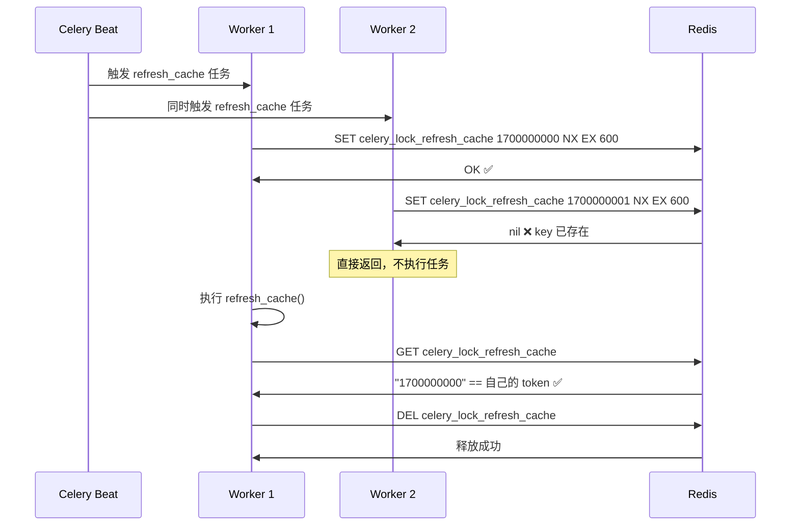

**使用场景汇总**：

```python
# 文件: alarm_backends/core/api_cache/library.py

@share_lock()                    # 默认 TTL=600s，以函数名标识
def refresh_action_config():
    """刷新动作配置缓存"""
    ...

@share_lock(identify=IP)         # 自定义标识，按 IP 去重
def refresh_ip_library():
    """刷新 IP 库缓存"""
    ...
```

```python
# 文件: alarm_backends/service/scheduler/tasks/report_cron.py

@share_lock()                    # 报告生成任务去重
def report_cron_task():
    """定期生成报告"""
    ...

@share_lock()                    # 另一个报告任务
def new_report_cron_task():
    """新版报告生成"""
    ...
```

---

### 🔄 refresh_service_lock — 锁续约机制

对于执行时间较长的任务（如 AIOPS 数据预处理），可能超过锁的 TTL，需要续约来保持锁的持有。

**文件位置**：`alarm_backends/core/lock/service_lock.py`

```python
@contextmanager
def refresh_service_lock(key_instance: RedisDataKey, token: str, **kwargs):
    """
    可续约的服务锁

    核心思想：
    - 每次执行都刷新锁的 TTL
    - 任务重载时，旧实例的 token 会被新 token 覆盖
    - 旧实例检测到 token 变化后自动退出

    :param key_instance: 锁的 key 实例
    :param token: 标记（一般用时间戳）
    :param kwargs: key 模板参数
    """

    lock_key = key_instance.get_key(**kwargs)
    client = Cache("service-lock")

    # 刷新锁：设置新 token 和 TTL
    client.set(lock_key, token, ex=key_instance.ttl)

    yield  # 执行业务逻辑

    # 执行完毕后检查 token 是否变化
    if not check_lock_updated(key_instance, token, **kwargs):
        # Token 未被更新，说明没有新任务接管，安全删除
        client.delete(lock_key)


def check_lock_updated(key_instance: RedisDataKey, token: str = None, **kwargs) -> bool:
    """
    检查锁是否被更新

    :return: True 表示已被更新（有新任务接管），False 表示未变化

    用途：任务重载后需要停止旧任务实例
    - 新任务启动时设置新 token
    - 旧任务检测到 token 变化后退出
    """
    lock_key = key_instance.get_key(**kwargs)
    client = Cache("service-lock")
    last_token = client.get(lock_key)

    if last_token == str(token):
        return False  # 未变化

    return True       # 已被更新
```

**续约与任务交接流程**：

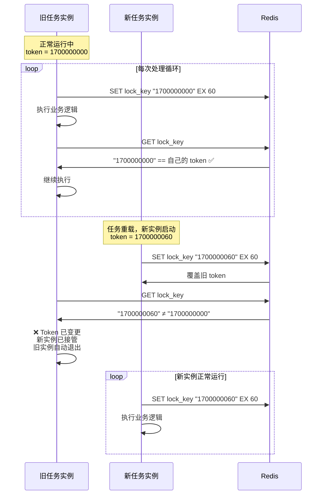

---

### 🎯 使用示例

```python
# 文件: alarm_backends/service/preparation/aiops/processor.py

from alarm_backends.core.lock.service_lock import (
    service_lock,
    refresh_service_lock,
)

class AIOPSPrepareProcessor:
    """AIOPS 数据预处理器"""

    def process(self, strategy_id):
        update_time = str(time.time())

        # 使用可续约锁
        with refresh_service_lock(self.prepare_key, update_time, strategy_id=strategy_id):
            while self.has_data_to_process():
                # 处理数据（可能耗时较长）
                self.process_batch()

                # 检查是否有新实例接管
                if check_lock_updated(self.prepare_key, update_time, strategy_id=strategy_id):
                    # 有新实例接管，当前实例优雅退出
                    logger.info("Lock updated by new instance, exiting...")
                    return
```

---

## 📝 本章小结

### ✅ 四种锁机制对比

| 锁类型 | 用途 | 获取方式 | 释放方式 | 适用场景 |
|--------|------|---------|---------|---------|
| **RedisLock** | 单资源互斥 | 自旋等待 + 超时 | GET比对 + DEL | 数据接入、异常检测 |
| **MultiRedisLock** | 多资源批量锁定 | Pipeline批量，无等待 | MGET比对 + 批量DEL | 告警构建、告警管理 |
| **share_lock** | Celery 任务去重 | SET NX，失败静默跳过 | 执行完检查Token再DEL | 缓存刷新、定时任务 |
| **refresh_service_lock** | 可续约锁 | SET 覆盖 | 检查Token变化后DEL | AIOPS 长任务 |

### 🎯 安全性设计总结

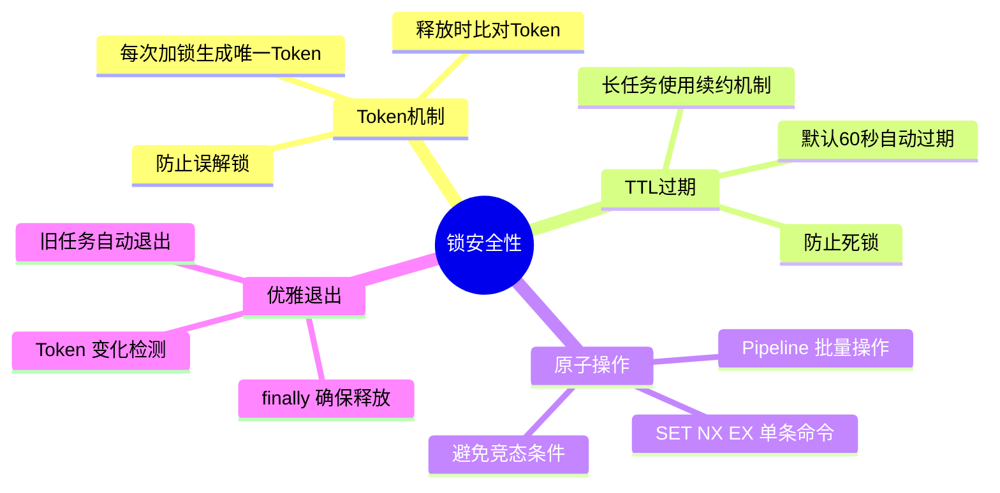

---

## 🤔 思考题

1. **RedisLock 的 `acquire()` 方法中，自旋等待间隔 10ms、默认超时 1ms（`_wait=0.001`），这意味着大多数情况下第一次尝试失败就直接返回 False。为什么不设置更长的等待时间？**

2. **MultiRedisLock 使用 `pipeline(transaction=False)` 而非事务模式。为什么不用事务模式（MULTI/EXEC）？如果用事务模式会有什么问题？**

3. **share_lock 的释放逻辑是先 GET 比对 Token 再 DEL，这两步操作不是原子的。在高并发场景下，是否可能出现 GET 时 Token 匹配但 DEL 前锁已过期被他人获取的情况？如何改进？**

4. **refresh_service_lock 通过 Token 变化检测实现旧任务退出。但如果旧任务在 `yield` 之后才检测到变化，这段时间内的操作是否会有问题？如何保证更安全的交接？**

---

## 📁 相关源码索引

| 功能 | 源码路径 |
|------|---------|
| 锁基类 + RedisLock | `alarm_backends/core/lock/__init__.py` |
| 服务锁封装 | `alarm_backends/core/lock/service_lock.py` |
| Key 定义 | `alarm_backends/core/cache/key.py` |
| 接入任务（使用 service_lock） | `alarm_backends/service/access/tasks.py` |
| 检测任务（使用 service_lock） | `alarm_backends/service/detect/process.py` |
| 告警构建（使用 multi_service_lock） | `alarm_backends/service/alert/builder/processor.py` |
| 告警管理（使用 multi_service_lock） | `alarm_backends/service/alert/manager/processor.py` |
| AIOPS 预处理（使用 refresh_service_lock） | `alarm_backends/service/preparation/aiops/processor.py` |
| 缓存刷新（使用 share_lock） | `alarm_backends/core/api_cache/library.py` |

---

> 📖 **下一章预告**：第5章将深入 **分布式并发控制进阶**，包括 share_lock 在定时任务中的应用、收敛处理器中的计数器锁、以及分布式锁的最佳实践与踩坑指南。