# 第5章：分布式并发控制进阶

> 🎯 **学习目标**：掌握 share_lock 在定时任务中的应用、理解告警收敛中的计数器锁设计、学会分布式锁的最佳实践与常见陷阱

---

## 5.1 Celery 任务去重锁（share_lock）

### ❓ 问题背景：定时任务的并发困境

在 Celery 分布式任务调度中，一个常见的问题是：**同一个定时任务可能被多个 Worker 同时执行**。

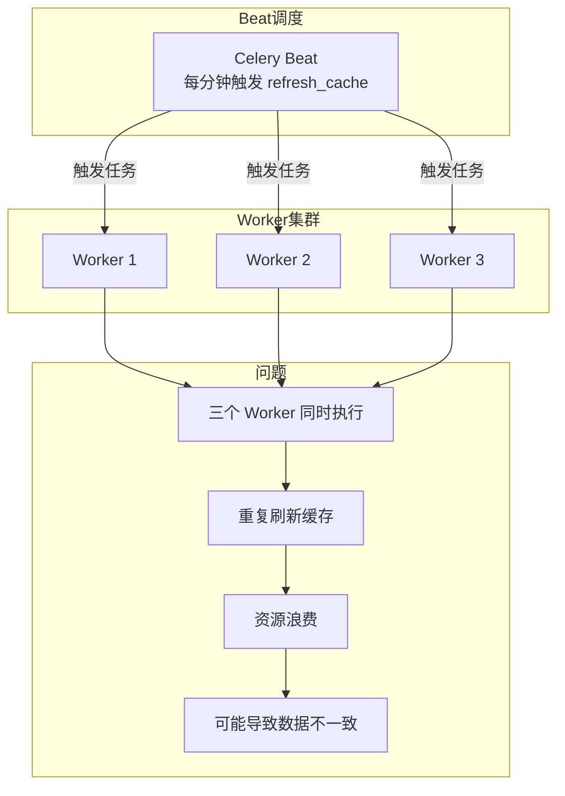

### 🔧 share_lock 的设计思路

share_lock 的核心思想是：**同一时刻只有一个 Worker 执行该任务，其他 Worker 静默跳过**。

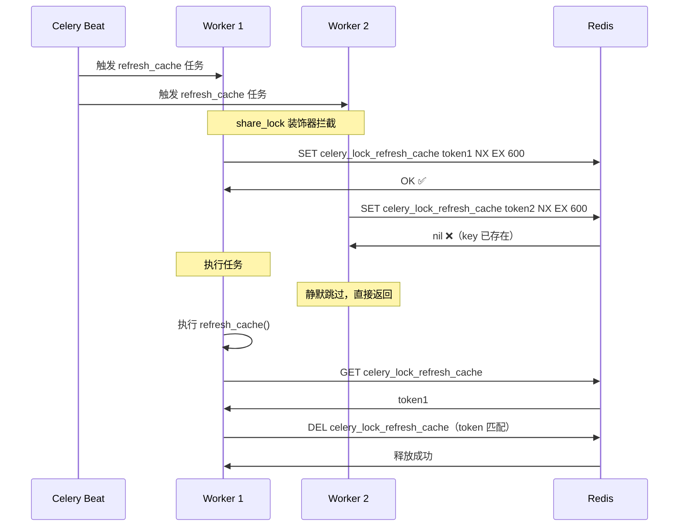

---

### 🔧 share_lock 源码解析

**文件位置**：`alarm_backends/core/lock/service_lock.py`

```python
def share_lock(ttl=600, identify=None):
    """
    Celery 任务去重装饰器

    核心设计：
    1. 装饰器模式，无侵入使用
    2. 使用 SET NX EX 原子加锁
    3. 加锁失败静默跳过（不抛异常）
    4. Token 机制防止误解锁
    5. 支持自定义标识（identify）解决函数重名问题

    :param ttl: 锁过期时间，默认 600 秒（10 分钟）
    :param identify: 自定义标识，防止不同模块函数重名导致互斥

    使用示例：
        @share_lock(ttl=300)
        def refresh_cache():
            ...

        @share_lock(identify="module_a_task")
        def task():
            ...
    """

    def wrapper(func):
        @functools.wraps(func)
        def _inner(*args, **kwargs):
            # 使用时间戳作为 Token
            token = str(time.time())

            # 生成锁 key
            name = func.__name__ if identify is None else identify
            # key 格式：{cluster_name}_celery_lock_{name}
            cache_key = f"{get_cluster().name}_celery_lock_{name}"

            client = Cache("service-lock")

            # 尝试获取锁：SET NX EX
            lock_success = client.set(cache_key, token, ex=ttl, nx=True)

            if not lock_success:
                # 已有其他 Worker 在执行，静默跳过
                # 不抛异常，直接返回 None
                return

            try:
                # 加锁成功，执行任务
                return func(*args, **kwargs)
            finally:
                # 执行完毕，检查 Token 后释放锁
                # 防止锁已过期被他人获取时的误解锁
                if client.get(cache_key) == token:
                    client.delete(cache_key)

        return _inner

    return wrapper
```

---

### 📊 share_lock 在 bk-monitor 中的应用

```python
# 文件: alarm_backends/core/api_cache/library.py

@share_lock()  # 默认 TTL=600s，函数名作为标识
def refresh_action_config():
    """刷新动作配置缓存"""
    # 同一时刻只有一个 Worker 执行
    ActionConfigCacheManager.refresh_all()


@share_lock(identify=IP)  # 按 IP 去重，每个 IP 的任务独立
def refresh_ip_library():
    """刷新 IP 库缓存"""
    # 不同机器可以并行执行
    IPLibraryCacheManager.refresh()
```

```python
# 文件: alarm_backends/service/scheduler/tasks/report_cron.py

@share_lock()
def report_cron_task():
    """定期生成报告"""
    # 同一时刻只有一个实例生成报告
    ReportGenerator.process()


@share_lock()
def new_report_cron_task():
    """新版报告生成"""
    NewReportGenerator.process()
```

---

### 📋 share_lock vs service_lock 对比

| 特性 | share_lock | service_lock |
|------|-----------|--------------|
| **使用方式** | 装饰器，无侵入 | 上下文管理器，需包裹代码块 |
| **加锁失败** | 静默跳过，返回 None | 抛出 LockError 异常 |
| **等待机制** | 无等待，立即返回 | 可设置等待超时 |
| **适用场景** | 定时任务去重 | 业务逻辑互斥 |
| **锁粒度** | 任务级别（函数名） | 可自定义（key 模板） |
| **集群隔离** | 自动按集群名隔离 | 需在 key 模板中指定 |

---

### 🎯 identify 参数的必要性

不同模块可能有同名函数，导致意外的互斥：

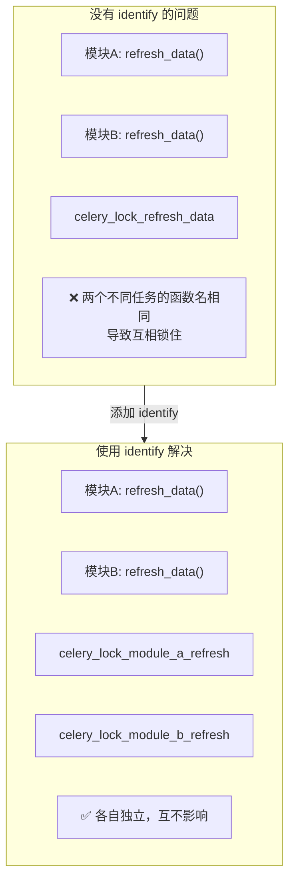

```python
# 模块 A
@share_lock(identify="module_a_refresh_data")
def refresh_data():
    ...

# 模块 B
@share_lock(identify="module_b_refresh_data")
def refresh_data():
    ...
```

---

## 5.2 服务级锁（service_lock）设计模式

### 📐 service_lock 的设计模式

service_lock 封装了 RedisLock，提供更友好的 API：

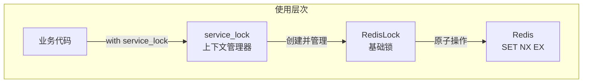

---

### 🔧 service_lock 源码解析

```python
@contextmanager
def service_lock(key_instance, **kwargs):
    """
    服务级锁上下文管理器

    核心设计：
    1. 使用 RedisDataKey 对象管理 key 模板和 TTL
    2. 支持动态参数生成不同的锁 key
    3. 加锁失败抛出 LockError（而非静默跳过）
    4. finally 块确保锁一定被释放

    :param key_instance: RedisDataKey 对象
    :param kwargs: key 模板的动态参数

    使用示例：
        with service_lock(SERVICE_LOCK_ACCESS, strategy_group_key="group_1"):
            # 只有获取锁成功才能执行
            process_access()
        # with 块结束，自动释放锁
    """
    lock = None
    lock_key = key_instance.get_key(**kwargs)

    try:
        lock = RedisLock(lock_key, key_instance.ttl)
        if lock.acquire(0.1):   # 等待 100ms
            yield lock           # 加锁成功，执行业务
        else:
            # 加锁失败，抛出异常（告知调用方）
            raise LockError(msg=f"{lock_key} is already locked")
    except LockError as err:
        raise err                # 向上传播异常
    finally:
        if lock is not None:
            lock.release()       # 确保锁被释放
```

---

### 📊 RedisDataKey 的设计

**文件位置**：`alarm_backends/core/cache/key.py`

```python
class RedisDataKey:
    """
    Redis Key 对象

    核心设计：
    1. key_tpl: key 模板，支持 {param} 占位符
    2. ttl: 过期时间（秒）
    3. backend: Redis 后端类型
    4. is_global: 是否全局 key（跨集群）

    使用示例：
        SERVICE_LOCK_ACCESS = RedisDataKey(
            key_tpl="access.lock.{strategy_group_key}",
            ttl=180,  # 3 分钟
            backend="service"
        )
    """

    def __init__(self, key_tpl=None, ttl=None, backend=None, is_global=False, **extra_config):
        if not all([key_tpl, ttl, backend]):
            raise ValueError

        self.key_tpl = key_tpl
        self.ttl = ttl
        self.backend = backend
        self.is_global = is_global

    def get_key(self, **kwargs):
        """
        根据模板和参数生成实际的 key

        :param kwargs: 模板参数
        :return: 完整的 Redis key

        示例：
            key = SERVICE_LOCK_ACCESS.get_key(strategy_group_key="group_1")
            # 结果: "bkmonitor.access.lock.group_1"
        """
        key = self.key_tpl.format(**kwargs)

        # 添加前缀（环境 + 集群）
        if self.is_global:
            key_prefix = PUBLIC_KEY_PREFIX
        else:
            key_prefix = KEY_PREFIX

        if not key.startswith(key_prefix):
            key = ".".join([key_prefix, key])

        return key
```

**预定义的锁 Key 配置**：

```python
# 文件: alarm_backends/core/cache/key.py

# 数据接入锁：TTL=3分钟
SERVICE_LOCK_ACCESS = register_key_with_config({
    "label": "access.lock.strategy_{strategy_group_key}",
    "key_type": "string",
    "key_tpl": "access.lock.{strategy_group_key}",
    "ttl": 3 * CONST_MINUTES,  # 180秒
    "backend": "service",
})

# 异常检测锁：TTL=2分钟
SERVICE_LOCK_DETECT = register_key_with_config({
    "label": "detect.lock.strategy_{strategy_id}",
    "key_type": "string",
    "key_tpl": "detect.lock.{strategy_id}",
    "ttl": 2 * CONST_MINUTES,  # 120秒
    "backend": "service",
})

# 收敛处理锁：TTL=1分钟
ACTION_CONVERGE_KEY_PROCESS_LOCK = register_key_with_config({
    "label": "[converge]收敛的发送锁",
    "key_type": "string",
    "key_tpl": "fta_action.converge.{dimension}.process.lock",
    "ttl": CONST_MINUTES,  # 60秒
    "backend": "service",
})
```

---

### 🎯 service_lock 在告警处理中的应用

```python
# 文件: alarm_backends/service/access/tasks.py

@app.task(queue="celery_service")
def run_access_data(strategy_group_key, interval):
    """数据接入任务"""
    # 同一策略组同时只有一个 Worker 接入
    with service_lock(key.SERVICE_LOCK_ACCESS, strategy_group_key=strategy_group_key):
        AccessDataProcess(strategy_group_key, interval).process()
```

```python
# 文件: alarm_backends/service/detect/process.py

class DetectProcess:
    def process(self):
        """异常检测主流程"""
        # 同一策略同时只有一个 Worker 检测
        with service_lock(key.SERVICE_LOCK_DETECT, strategy_id=self.strategy_id):
            data = self.pull_data()
            self.handle_data(data)
            self.push_data()
```

```python
# 文件: alarm_backends/service/nodata/processor.py

def process(self):
    """无数据告警处理"""
    with service_lock(key.SERVICE_LOCK_NODATA, strategy_id=self.strategy_id):
        self.check_and_generate_alert()
```

---

## 5.3 计数器锁在告警收敛中的应用

### ❓ 问题背景：收敛的并发控制需求

告警收敛（Converge）场景中，需要控制同一维度的并发收敛数量：

- 同一维度可能产生多个收敛实例
- 如果所有实例同时处理，会造成资源竞争
- 需要限制并发数，而非完全互斥

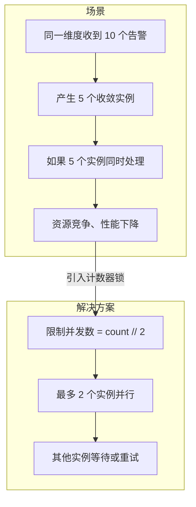

---

### 🔧 计数器锁的实现原理

使用 Redis 的 `INCR`/`DECR` 命令实现计数器锁：

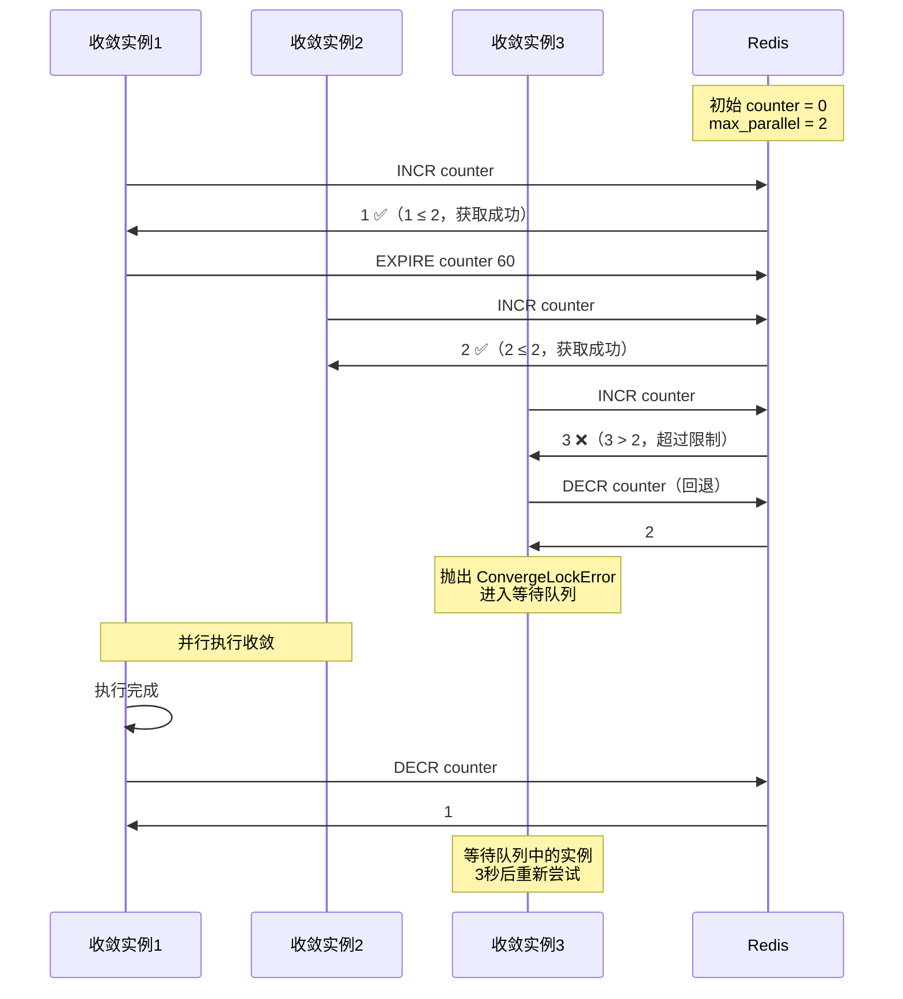

---

### 🔧 ConvergeProcessor 计数器锁源码解析

**文件位置**：`alarm_backends/service/converge/processor.py`

```python
class ConvergeProcessor:
    """告警收敛处理器"""

    def lock(self):
        """
        获取收敛维度锁（计数器锁）

        核心设计：
        1. 使用 INCR 增加计数器
        2. 判断是否超过并发限制
        3. 超过则 DECR 回退并抛出异常
        4. 设置 TTL 防止计数器长期占用
        5. 并发限制 = max(count // 2, 1)

        :raises ConvergeLockError: 获取锁失败时抛出
        """
        client = ACTION_CONVERGE_KEY_PROCESS_LOCK.client

        # 并发限制：收敛数的一半，至少 1
        parallel_converge_count = max(int(self.converge_count) // 2, 1)

        # 生成锁 key：基于收敛维度
        self.lock_key = ACTION_CONVERGE_KEY_PROCESS_LOCK.get_key(dimension=self.dimension)

        # INCR 增加计数器
        if client.incr(self.lock_key) > parallel_converge_count:
            # 超过限制，回退并抛出异常
            client.decr(self.lock_key)

            # 检查 TTL，避免计数器长期占用
            ttl = client.ttl(self.lock_key)
            if ttl is None or ttl < 0:
                client.expire(self.lock_key, ACTION_CONVERGE_KEY_PROCESS_LOCK.ttl)

            raise ConvergeLockError(
                f"get parallel converge failed, "
                f"current_parallel_converge_count is {parallel_converge_count}, "
                f"converge condition is {self.dimension}"
            )

        # 设置 TTL
        client.expire(self.lock_key, ACTION_CONVERGE_KEY_PROCESS_LOCK.ttl)

        # 标记需要解锁
        self.need_unlock = True

    def unlock(self):
        """
        释放收敛维度锁

        安全释放：
        1. 检查是否需要解锁
        2. 检查计数器是否还有效
        3. DECR 减少计数器
        """
        if self.need_unlock is False:
            return

        client = ACTION_CONVERGE_KEY_PROCESS_LOCK.client

        if int(client.get(self.lock_key) or 0) > 0:
            client.decr(self.lock_key)
```

---

### 📊 计数器锁的并发控制流程

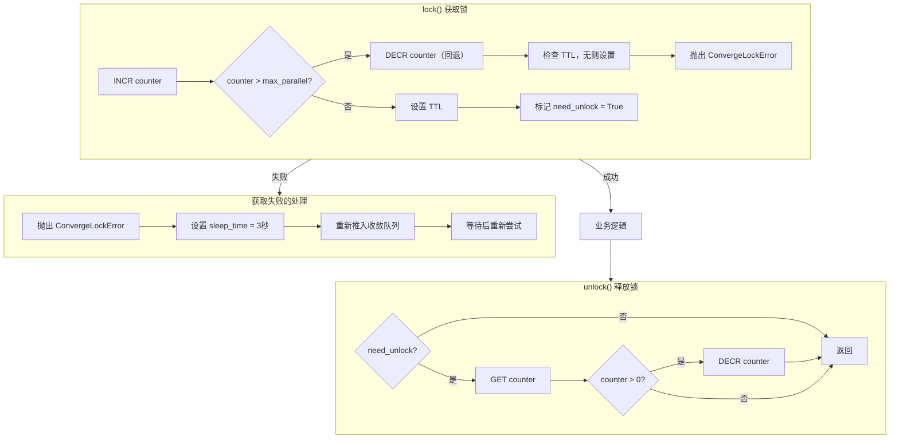

---

### 🎯 并发限制的计算逻辑

```python
# 并发限制 = 收敛数的一半，至少 1
parallel_converge_count = max(int(self.converge_count) // 2, 1)
```

| converge_count | parallel_converge_count | 说明 |
|----------------|------------------------|------|
| 1 | 1 | 单收敛，完全互斥 |
| 2 | 1 | 双收敛，允许 1 个并行 |
| 4 | 2 | 四收敛，允许 2 个并行 |
| 10 | 5 | 十收敛，允许 5 个并行 |

> 💡 **设计思想**：收敛数越大，允许的并行度越高，在保证资源不冲突的前提下提高吞吐量。

---

### 🔄 失败重试机制

**文件位置**：`alarm_backends/service/converge/tasks.py`

```python
@app.task(ignore_result=True, queue="celery_converge")
def run_converge(converge_config, instance_id, instance_type, converge_context=None, alerts=None, retry_times=0):
    """
    执行收敛动作

    重试机制：
    1. 获取锁失败时进入等待队列
    2. 其他异常最多重试 3 次
    3. 每次重试间隔 30 秒
    """

    exc = None
    try:
        converge_handler = ConvergeProcessor(
            converge_config, instance_id, instance_type, converge_context, alerts
        )
        converge_handler.converge_alarm()
    except ConvergeLockError as error:
        # 获取锁失败，已在处理器中推入等待队列
        logger.info("converge %s due to lock error: %s", instance_id, str(error))
    except Exception as error:
        exc = error
        logger.exception("converge %s error: %s", instance_id, error)

    # 异常重试逻辑
    if exc:
        if retry_times < 3:
            # 重试次数未达上限，重新推送任务
            task_id = run_converge.apply_async(
                (converge_config, instance_id, instance_type, converge_context, alerts, retry_times + 1),
                countdown=CONST_HALF_MINUTE,  # 30 秒后重试
            )
            logger.info("retry converge %s, delay %s, task_id(%s)", instance_id, CONST_HALF_MINUTE, task_id)
```

---

## 5.4 分布式锁最佳实践与踩坑指南

### 🎯 锁粒度设计原则

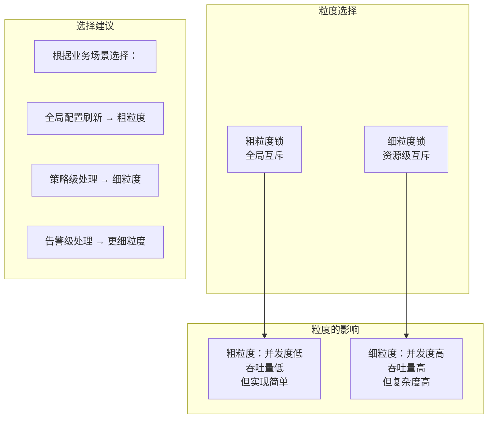

**bk-monitor 的粒度设计示例**：

| 锁 | 粒度 | 说明 |
|-----|------|------|
| `celery_lock_{task_name}` | 任务级 | 定时任务去重，粗粒度 |
| `access.lock.{strategy_group_key}` | 策略组级 | 数据接入互斥 |
| `detect.lock.{strategy_id}` | 策略级 | 异常检测互斥 |
| `fta_action.converge.{dimension}` | 维度级 | 收敛处理并发控制 |
| `alert_update_{alert_id}` | 告警级 | 告警更新互斥，最细粒度 |

---

### ⚠️ 常见陷阱与解决方案

#### 陷阱 1：锁过期时间设置不当

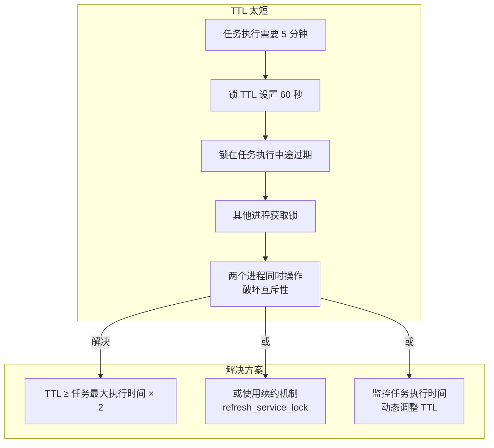

#### 陷阱 2：误解锁问题

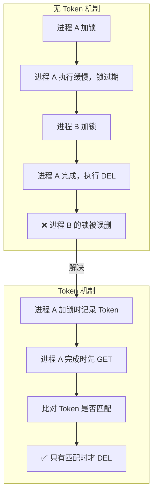

#### 陷阱 3：死锁问题

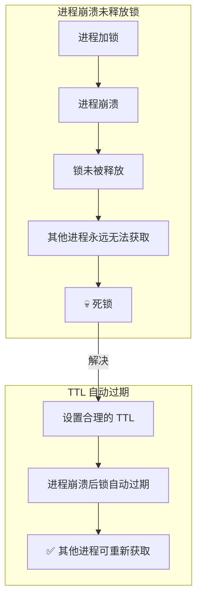

#### 陷阱 4：锁等待超时设计不当

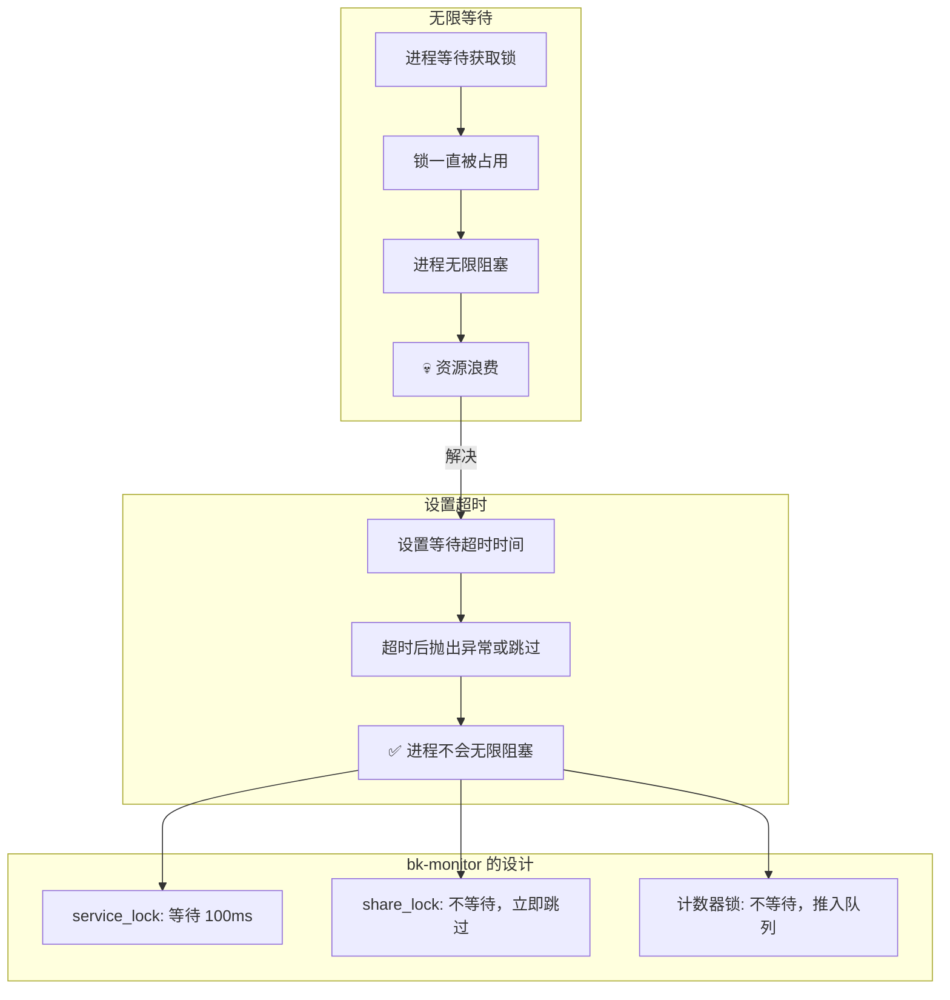

---

### 📋 最佳实践清单

| 实践 | 说明 | bk-monitor 实现 |
|------|------|----------------|
| **使用原子操作** | SET NX EX 单条命令 | ✅ RedisLock |
| **Token 机制** | 防止误解锁 | ✅ uniqid4() |
| **设置 TTL** | 防止死锁 | ✅ 默认 60 秒 |
| **合理的锁粒度** | 平衡并发和复杂度 | ✅ 多级锁粒度 |
| **等待超时** | 防止无限阻塞 | ✅ service_lock 100ms |
| **优雅释放** | finally 确保释放 | ✅ 上下文管理器 |
| **异常处理** | 加锁失败有明确策略 | ✅ 抛出/跳过/重试 |
| **监控告警** | 监控锁等待时间 | ✅ Prometheus 指标 |

---

### 🔧 分布式锁的正确使用姿势

```python
# ✅ 正确：使用上下文管理器，自动释放
with service_lock(SERVICE_LOCK_ACCESS, strategy_group_key=key):
    process_access()

# ❌ 错误：手动获取和释放，可能忘记释放
lock = RedisLock(key)
lock.acquire()
try:
    process_access()
finally:
    lock.release()  # 必须记得手动释放


# ✅ 正确：加锁失败有明确处理策略
try:
    with service_lock(SERVICE_LOCK_ACCESS, strategy_group_key=key):
        process_access()
except LockError:
    # 明确的失败处理：记录日志、跳过、或重试
    logger.warning(f"Failed to acquire lock for {key}")
    return


# ✅ 正确：定时任务使用 share_lock 去重
@share_lock(ttl=300)
def scheduled_task():
    # 同一时刻只有一个实例执行
    ...

# ❌ 错误：定时任务不加锁，可能重复执行
def scheduled_task():
    # 多个 Worker 可能同时执行
    ...
```

---

## 📝 本章小结

### ✅ 三种锁机制对比

| 锁类型 | 并发模型 | 失败策略 | 适用场景 |
|--------|---------|---------|---------|
| **RedisLock** | 完全互斥（1 个持有者） | 抛出异常 | 单资源独占 |
| **计数器锁** | 限制并发（N 个持有者） | 推入等待队列 | 批量处理并发控制 |
| **share_lock** | 完全互斥（1 个持有者） | 静默跳过 | 定时任务去重 |

### 🎯 设计模式总结

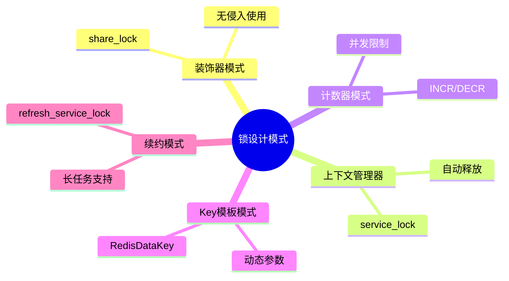

---

## 🤔 思考题

1. **share_lock 使用函数名作为默认锁标识，但如果 Celery Beat 的调度间隔小于 TTL（600秒），任务会被锁住跳过。如何避免这个问题？**

2. **计数器锁使用 INCR/DECR 实现，如果某个进程在获取锁后崩溃（未执行 DECR），计数器会一直偏高。虽然有 TTL 机制，但在 TTL 到期前，并发限制会错误地收紧。如何改进？**

3. **multi_service_lock 使用 Pipeline 批量加锁，但如果部分 key 加锁成功、部分失败，是否应该继续处理成功部分？还是应该全部回退？bk-monitor 选择了哪种策略？**

4. **在告警收敛场景中，为什么并发限制设置为 `count // 2` 而不是固定值？这种动态计算有什么优缺点？**

---

## 📁 相关源码索引

| 功能 | 源码路径 |
|------|---------|
| share_lock 定义 | `alarm_backends/core/lock/service_lock.py` |
| RedisLock 基础实现 | `alarm_backends/core/lock/__init__.py` |
| Key 定义 | `alarm_backends/core/cache/key.py` |
| 收敛处理器 | `alarm_backends/service/converge/processor.py` |
| 收敛任务 | `alarm_backends/service/converge/tasks.py` |
| 接入任务（使用 service_lock） | `alarm_backends/service/access/tasks.py` |
| 检测任务（使用 service_lock） | `alarm_backends/service/detect/process.py` |
| 缓存刷新（使用 share_lock） | `alarm_backends/core/api_cache/library.py` |

---

> 📖 **下一部分预告**：第四部分将深入 **消息队列与异步处理**，包括 Kafka 数据接入、RabbitMQ 与 Celery 任务调度、三级队列架构设计。