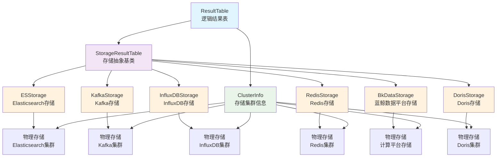
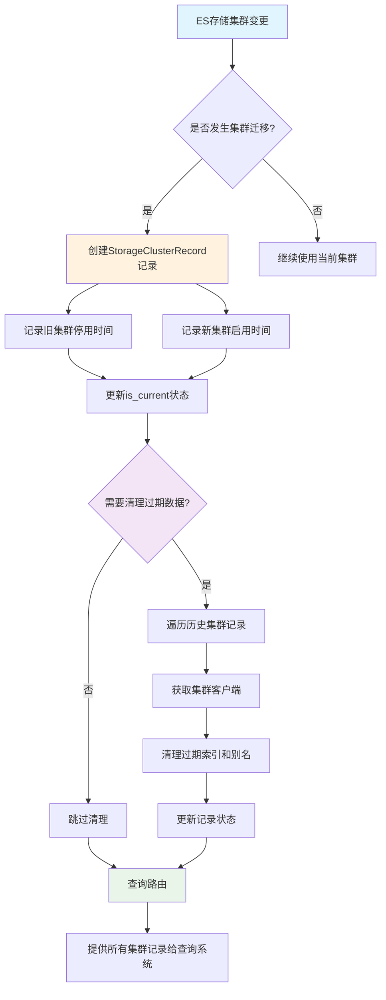

---
## StorageClusterRecord 表的作用

[StorageClusterRecord](file:///Users/wuyongping/PycharmProjects/bk-monitor/bkmonitor/metadata/models/storage.py#L5127-L5216)是bkmonitor项目中一个重要的数据模型，主要用于记录和管理ES存储集群的历史变更信息。它的核心作用包括：

### 1. 存储集群迁移历史记录
当一个结果表（ResultTable）的ES存储集群发生变更时，系统会创建[StorageClusterRecord](file:///Users/wuyongping/PycharmProjects/bk-monitor/bkmonitor/metadata/models/storage.py#L5127-L5216)记录来追踪这些变更。这使得系统能够：
- 追踪历史存储集群信息
- 管理存储集群的启用和停用时间
- 支持跨集群数据清理操作

### 2. 多集群管理支持
在实际监控场景中，一个结果表的数据可能会因为各种原因（如集群扩容、硬件更换、性能优化等）迁移到不同的ES集群。[StorageClusterRecord](file:///Users/wuyongping/PycharmProjects/bk-monitor/bkmonitor/metadata/models/storage.py#L5127-L5216)表记录了这些迁移历史，使得系统能够：
- 管理当前和历史集群信息
- 支持在多个集群中清理过期数据
- 提供数据路由信息给查询系统

### 3. 数据生命周期管理
该表支持数据的生命周期管理，通过记录集群的启用时间、停用时间和删除时间，系统能够：
- 自动清理已停用集群中的过期数据
- 避免数据泄露或存储资源浪费
- 确保数据按照保留策略正确处理

### 4. 数据查询路由
通过[compose_table_id_storage_cluster_records](file:///Users/wuyongping/PycharmProjects/bk-monitor/bkmonitor/metadata/models/storage.py#L5152-L5216)方法，系统可以获取特定结果表的所有历史存储集群记录，并将这些信息提供给查询系统，使得查询系统能够知道在哪些集群中查找相关数据。

